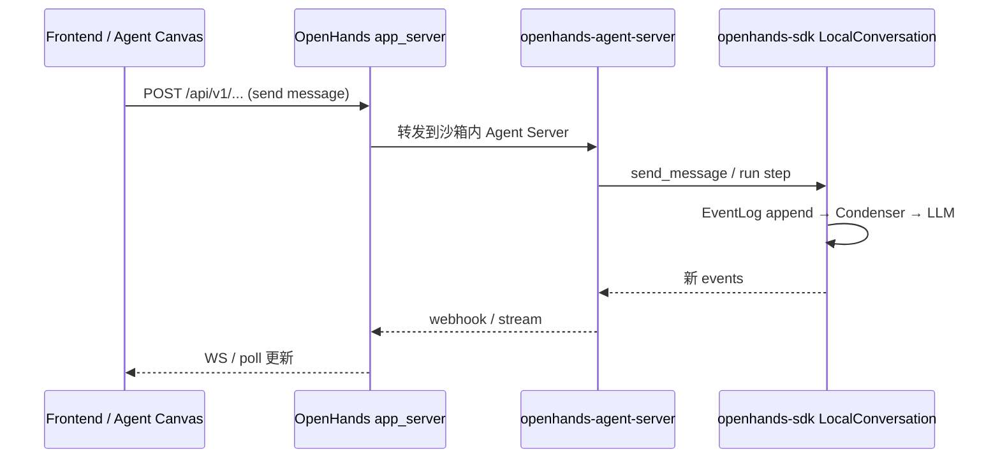

# OpenHands 生态

> **合并说明**：由以下文档去重合并（2026-08-04）。

---


---

## OpenHands + software-agent-sdk 架构

> **文档类型**: 框架对比 · 架构总览（OpenHands 生态）  
> **真源**: `OpenHands/` + `software-agent-sdk/`（本 monorepo 内并列两仓）  
> **关联**: [06-memory.md](06-memory.md)（压缩深潜）· [06-memory.md](06-memory.md) §5–§6

---

## 0. 先读这三句话

1. **Agent 执行逻辑已迁出 OpenHands 主仓**，落在独立仓库 **`software-agent-sdk`**（PyPI：`openhands-sdk`、`openhands-agent-server`、`openhands-tools`、`openhands-workspace`）。
2. **OpenHands 主仓（2026）= 控制面**：`app_server` 编排对话/沙箱/用户设置，通过 HTTP/Webhook 驱动 **Agent Server**；**V0 内嵌 runtime（`controller` / `agenthub` / `openhands/memory`）已从源码移除**。
3. **「记忆」分三条线，不要混**：**事件日志**（Session transcript）· **Condenser**（上下文压缩）· **`MEMORY.md` 文件索引**（跨会话提示注入）。持久化与多实例问题主要在 **事件日志 + FileStore + Lease** 层解决。

---

## 1. 两个仓库的关系

```text
┌─────────────────────────────────────────────────────────────────────────┐
│  OpenHands/  (PyPI: openhands-ai)                                       │
│  ├── frontend/          React UI（向 @openhands/agent-canvas 迁移中）    │
│  ├── openhands/app_server/   V1 FastAPI 控制面 · /api/v1/*              │
│  ├── enterprise/        SaaS：Postgres、Keycloak、计费、组织            │
│  └── openhands/server/  ⚠️ 已废弃 shim → 重导出 app_server              │
└───────────────────────────────┬─────────────────────────────────────────┘
                                │ 依赖 PyPI（版本与主仓 lock 同步）
                                │ openhands-sdk == openhands-agent-server == openhands-tools
                                ▼
┌─────────────────────────────────────────────────────────────────────────┐
│  software-agent-sdk/  (UV workspace monorepo)                           │
│  ├── openhands-sdk/           Agent、Conversation、EventLog、Condenser  │
│  ├── openhands-agent-server/  REST/WS 执行面 · LocalConversation        │
│  ├── openhands-tools/         terminal、file_editor、browser、delegate  │
│  └── openhands-workspace/     Local / Docker / K8s / Cloud 工作区       │
└─────────────────────────────────────────────────────────────────────────┘
```

| 维度 | OpenHands 主仓 | software-agent-sdk |
|------|----------------|-------------------|
| **角色** | 产品编排、UI、企业集成 | Agent 引擎 + 可独立部署的 Agent Server |
| **典型入口** | `make run` → app_server + frontend | `Conversation(...)` 嵌入脚本；或 `openhands-agent-server` 容器 |
| **对话执行** | 不内嵌 Agent loop；调 Agent Server | `LocalConversation` / `RemoteConversation` |
| **事件持久化** | app_server 层元数据 + 可选云事件后端 | SDK `EventLog` → `FileStore` |
| **官方文档** | https://docs.openhands.dev/ | https://docs.openhands.dev/sdk |

**版本钉扎（示例，以 `OpenHands/pyproject.toml` 为准）**：`openhands-sdk`、`openhands-agent-server`、`openhands-tools` 同版本（如 `1.37.1`）。Agent Server 镜像：`ghcr.io/openhands/agent-server:{version}-python`。

---

## 2. SDK 四包职责

### 2.1 `openhands-sdk`

核心库，**无 FastAPI 依赖**。主要子系统：

| 子包 | 职责 |
|------|------|
| `agent/` | `Agent`、step 循环、tool 调度 |
| `conversation/` | `LocalConversation`、`EventLog`、`base_state.json` |
| `event/` | 事件类型、`Condensation` 墓碑事件 |
| `context/condenser/` | `View`、`LLMSummarizingCondenser` |
| `context/memory.py` | 加载 `MEMORY.md`（**非**事件持久化） |
| `io/` | `FileStore` 抽象、`LocalFileStore` |
| `llm/` | 多厂商 LLM、context window 分类 |
| `settings/` | `AgentSettings`、condenser 配置 schema |
| `tool/` · `mcp/` · `skills/` | 工具与技能 |
| `workspace/` | 工作区句柄（与 `openhands-workspace` 配合） |

**嵌入用法**（不经 Agent Server）：

```python
from openhands.sdk import LLM, Agent, Conversation
from openhands.tools.terminal import TerminalTool

agent = Agent(llm=LLM(...), tools=[TerminalTool.create()])
conv = Conversation(agent=agent, persistence_dir="/path/to/conversations/uuid")
conv.send_message("Fix the failing test")
```

`persistence_dir` 下生成 `base_state.json` + `events/event-{idx}-{uuid}.json`。

### 2.2 `openhands-agent-server`

在单机上暴露 **REST + WebSocket**，管理多个 `LocalConversation` 实例。

| 模块 | 职责 |
|------|------|
| `conversation_service.py` | 对话 CRUD、webhook、驱逐 |
| `event_service.py` | 事件 pub/sub、与 SDK EventLog 衔接 |
| `conversation_lease.py` | 多实例/崩溃恢复时的 **对话所有权** |
| `persistence/store.py` | settings、secrets（需 `OH_SECRET_KEY`） |
| `init_router.py` | `OH_DEFERRED_INIT` 温池/延迟初始化 |

默认对话数据在 **`conversations_path`**（本地目录）。见 `openhands-agent-server/openhands/agent_server/README.md`。

### 2.3 `openhands-tools` / `openhands-workspace`

- **tools**：`TerminalTool`、`FileEditorTool`、`TaskTrackerTool`、browser、delegate 等 preset。
- **workspace**：把 Agent 命令执行映射到 Local/Docker/K8s 等运行时。

OpenHands `app_server` 通过 sandbox 服务拉起 **带 Agent Server 的容器**（`docker_sandbox_service.py`、`sandbox_spec_service.py`），而非在 app 进程内跑 Agent。

---

## 3. OpenHands V1 控制面（app_server）

**入口**：`openhands/app_server/app.py` · 路由聚合 `v1_router.py`  
**默认**：`ENABLE_V1` 非 `'0'` 即启用 V1。

| 模块 | 职责 |
|------|------|
| `app_conversation/` | 沙箱内对话生命周期、`conversation_version='V1'` 元数据 |
| `sandbox/` | Docker / Remote runtime 规格与启动 |
| `event/` | 应用层事件存储（`FilesystemEventService`、S3、GCS） |
| `file_store/` | 应用级 blob（与 SDK 对话目录 **不同命名空间**） |
| `event_callback/webhook_router.py` | Agent Server → App Server 事件回写 |
| `settings/` | 用户 LLM/MCP 配置（继承 SDK `AgentSettings` 模型） |
| `pending_messages/` | 服务端消息排队 |

**一次用户消息的粗粒度时序**：



---

## 4. 记忆与上下文：三层模型

不要把「OpenHands 记忆」当成单一模块。

### 4.1 M1 — 工作记忆（事件日志）

- **载体**：append-only `Event` 序列，持久化在 `EventLog` + `FileStore`。
- **布局**（每对话目录）：
  - `base_state.json` — Agent/对话元状态
  - `events/event-NNNNN-{uuid}.json` — 单条事件
  - `.eventlog.lock` — 并发写锁
- **真源**：`openhands-sdk/openhands/sdk/conversation/event_store.py`
- **重建**：从事件回放得到 `ConversationState`；**不是**平面 `messages[]` 列表。

### 4.2 M2 — 压缩记忆（Condenser + View）

- **载体**：逻辑上「遗忘」旧事件，物理上写 `Condensation` **墓碑事件**。
- **默认**：`LLMSummarizingCondenser`，`max_size=240`，`keep_first=2`。
- **配置**：`AgentSettings` 内 `condenser` 字段（`LLMSummarizingCondenserSettings`），**不再**使用已删除的 `openhands/core/config/condenser_config.py`。
- **真源**：`openhands-sdk/openhands/sdk/context/condenser/README.md`
- **深潜**：[06-memory.md](06-memory.md)

### 4.3 M4 — 文件记忆（MEMORY.md）

- **载体**：`~/.openhands/memory/MEMORY.md`（用户级）+ `<workspace>/.openhands/memory/MEMORY.md`（项目级）。
- **行为**：`load_memory()` 在首次 `send_message`/`run` 时注入 prompt；**不**写入 EventLog。
- **真源**：`openhands-sdk/openhands/sdk/context/memory.py`
- **与 M3 长期向量记忆**：SDK **无内置** Mem0/向量库；企业或应用层自建。

---

## 5. 持久化：三个存储层（勿混）

```text
Layer A — App Server (OpenHands)
  SQL：对话元数据、成本、企业租户（enterprise）
  app_server/event/：用户级 v1_conversations 事件镜像（FS / S3 / GCS）
  app_server/file_store/：应用 blob

Layer B — Agent Server
  conversations_path/：每对话目录（SDK 布局）
  persistence/store.py：settings、secrets
  owner_lease.json：对话所有权（TTL 45s，generation + PID）

Layer C — SDK EventLog
  FileStore（默认 LocalFileStore）
  锁：filelock；NFS 上不可靠（见 EventLog 文档注释）
```

| 问题 | 看哪一层 |
|------|----------|
| 对话能否跨 Pod 续聊？ | B + C：共享 `conversations_path` **或** 每对话固定路由到持有 lease 的实例 |
| 审计/回放全事件？ | C 为主；A 可有副本 |
| 用户 LLM API Key？ | B `persistence/store`（加密）+ A `settings/` |
| 压缩后 LLM 看到什么？ | C `View.from_events()`，与 A/B 无关 |

---

## 6. 多实例部署要点

| 模式 | 机制 | 注意 |
|------|------|------|
| **一对话一沙箱容器** | app_server 起 `agent-server` 镜像 | 最常见；状态在容器卷或挂载卷 |
| **多 Agent Server 后端** | Agent Canvas 连多个 host:port | README 架构图 |
| **Agent Server 水平扩展** | `ConversationLease` 文件锁 | 同一 `conversation_id` 同时只能一个 owner；过期可接管 |
| **共享文件系统** | EventLog `flock` | **NFS 不可靠**；优先对象存储 + 单写者，或 sticky 路由 |
| **App Server 水平扩展** | SQL 元数据 + 无状态 API | enterprise Postgres；OSS 偏单实例 compose |
| **延迟启动** | `OH_DEFERRED_INIT` + `POST /api/init` | 温池降冷启动 |

**「失忆」典型根因**：

1. 多副本 Agent Server **无共享** `conversations_path`，且 LB 无会话亲和 → 打到空目录的 Pod。  
2. 把 **App Server 的 event 目录** 和 **Agent Server 的 conversations_path** 当成同一目录（它们不是）。  
3. 仅依赖本地 `LocalFileStore` 却做跨主机扩缩。

**生产向组合**：Enterprise（Postgres + Redis）+ 每对话独立沙箱卷 **或** S3/GCS FileStore（app 层）+ 明确 lease 策略。

---

## 7. V0 → V1 迁移状态（2026-07）

| 项目 | 状态 |
|------|------|
| `openhands/controller`、`runtime`、`memory`、`agenthub` | **已移除** |
| `openhands/core/config/condenser_config.py` | **不存在**（文档若引用则为过时） |
| `openhands/server/listen.py` | 废弃 shim |
| `ENABLE_V1` | 默认开启 |
| UI | 向 **agent-canvas** npm 包迁移 |
| 本地 `OpenHands/docs/OpenHands_ARCHITECTURE_OVERVIEW.md` | 仍写「V1 开发中」→ **过时** |

**仍以源码为准的路径**：

- Condenser / Event / View → **仅** `software-agent-sdk/openhands-sdk/`
- 对话编排 / 沙箱 → `OpenHands/openhands/app_server/`
- Condenser README → `software-agent-sdk/.../context/condenser/README.md`

---

## 8. 本 monorepo 内文档地图

### 8.1 推荐（framework-comparison）

| 文档 | 内容 |
|------|------|
| **本文** | 两仓关系、三层记忆、持久化、多实例 |
| [06-memory.md](06-memory.md) | Condenser / View 源码级 |
| [06-memory.md](06-memory.md) | Session 横向对比 |
| [06-memory.md](06-memory.md) | M1–M5 总表 |

### 8.2 仓库内补充（可能滞后，需交叉验证）

| 路径 | 说明 | staleness |
|------|------|-----------|
| `OpenHands/README.md` | Agent Canvas、SDK 链接 | ✅ 较新 |
| `OpenHands/AGENTS.md` | 开发指南 | ✅ |
| `OpenHands/openhands/app_server/README.md` | 模块地图 | ✅ |
| `OpenHands/docs/ARCHITECTURE_PART1–2.md` | 中文深潜 | ⚠️ 部分路径仍混 V0 |
| `OpenHands/docs/OpenHands_ARCHITECTURE_OVERVIEW.md` | 总览 | ❌ V0/V1 状态过时 |
| `OpenHands/docs/OPENHANDS_SDK_ARCHITECTURE_DEEP_DIVE.md` | SDK 深潜 | ⚠️ 版本号旧（1.19.x） |
| `software-agent-sdk/docs/ARCHITECTURE_PART1–3.md` | SDK 中文架构 | ⚠️ PART3 曾写错 `file_store` 路径（实为 `sdk/io/`） |
| https://docs.openhands.dev/sdk | 官方 SDK 文档 | ✅ 权威（独立 docs 仓维护） |

---

## 9. 关键源码索引

### software-agent-sdk

| 主题 | 路径 |
|------|------|
| EventLog | `openhands-sdk/openhands/sdk/conversation/event_store.py` |
| 持久化常量 | `openhands-sdk/openhands/sdk/conversation/persistence_const.py` |
| LocalConversation | `openhands-sdk/openhands/sdk/conversation/impl/local_conversation.py` |
| Condenser 默认 | `openhands-sdk/openhands/sdk/context/condenser/llm_summarizing_condenser.py` |
| MEMORY.md 加载 | `openhands-sdk/openhands/sdk/context/memory.py` |
| FileStore | `openhands-sdk/openhands/sdk/io/` |
| Agent Server 租约 | `openhands-agent-server/openhands/agent_server/conversation_lease.py` |
| Agent Server 对话 | `openhands-agent-server/openhands/agent_server/conversation_service.py` |

### OpenHands

| 主题 | 路径 |
|------|------|
| App 入口 | `openhands/app_server/app.py` |
| 沙箱 Docker | `openhands/app_server/sandbox/docker_sandbox_service.py` |
| 对话服务 | `openhands/app_server/app_conversation/live_status_app_conversation_service.py` |
| Webhook | `openhands/app_server/event_callback/webhook_router.py` |
| 文件事件 | `openhands/app_server/event/filesystem_event_service.py` |

---

## 10. 与其他框架对比（一句话）

| 维度 | OpenHands 生态 | deepagents | AgentScope v2 |
|------|----------------|------------|---------------|
| Session 载体 | Event sourcing + FileStore | LangGraph checkpoint | `AgentState` / `RedisStorage` |
| 压缩 | Condenser 墓碑 + View | SummarizationMiddleware | `compress_context` + summary |
| 多实例 | Lease + 共享卷/沙箱隔离；DIY 重 | checkpointer 外置 | `app/` RedisStorage + MessageBus |
| 产品化程度 | 高（app + enterprise） | SDK 嵌入 | SDK + 可选 `create_app` |

---

**维护者**: OpenHarness framework-comparison  
**下次核对触发**: OpenHands 升级 SDK 大版本、V0 shim 删除、agent-canvas 成为唯一 UI 时


---

## Condenser / View / EventLog

> **真源**: `software-agent-sdk/openhands-sdk/openhands/sdk/`  
> **架构总览**: [10-openhands.md](10-openhands.md)（两仓关系、持久化三层、多实例）  
> **Condenser 官方 README**: `software-agent-sdk/openhands-sdk/openhands/sdk/context/condenser/README.md`

---

## 勘误（相对 v2.x 及更旧对比文档）

| 过时说法 | 现行（2026-07） |
|----------|-----------------|
| `OpenHands/openhands/memory/condenser.py` | **已删除**；Condenser 仅在 `openhands-sdk/.../context/condenser/` |
| `openhands/core/config/condenser_config.py` | **不存在**；配置在 `AgentSettings.condenser`（`sdk/settings/model.py`） |
| `AgentConfig.enable_history_truncation` + TOML `[condenser]` | V0 配置；V1 用 SDK persisted settings |
| 默认 `max_size=50` / `100` | **`LLMSummarizingCondenser.max_size=240`**, `keep_first=2` |
| 平面 `messages` 列表 | **Event log → View → Condenser → LLM messages** |
| 「OpenHands = 单仓」 | **Agent 逻辑在 `software-agent-sdk`**；OpenHands = `app_server` 控制面 |

---

## 目录

1. [三条记忆线](#1-三条记忆线)
2. [Event / View / Condenser 心智模型](#2-event--view--condenser-心智模型)
3. [Condenser 实现与默认参数](#3-condenser-实现与默认参数)
4. [触发：软限制 vs 硬重置](#4-触发软限制-vs-硬重置)
5. [MEMORY.md 文件记忆](#5-memorymd-文件记忆)
6. [持久化与多实例](#6-持久化与多实例)
7. [配置入口（V1）](#7-配置入口v1)
8. [源码索引](#8-源码索引)

---

## 1. 三条记忆线

```text
M1 工作记忆     EventLog（append-only events/*.json）
       ↓ View.from_events() 应用 Condensation 墓碑
M2 压缩记忆     LLMSummarizingCondenser → Condensation 事件
       ↓
LLM 可见消息    LLMConvertibleEvent → provider messages

M4 文件记忆     ~/.openhands/memory/MEMORY.md + <workspace>/.openhands/memory/MEMORY.md
                （load_memory()，与 EventLog 无关）
```

**无内置 M3 语义长期记忆**：向量库 / Mem0 需应用层或 Enterprise 扩展。

---

## 2. Event / View / Condenser 心智模型

```text
Event history (LLMConvertibleEvent + Condensation tombstones)
  → View.from_events()
  → RollingCondenser.should_condense() / condense()
  → 新 Condensation 事件 append 到 EventLog
  → 更新后的 View → 转为 LLM 输入
```

- **Append-only**：物理不删历史文件；「遗忘」靠 `Condensation` 墓碑（类 Kafka/Cassandra tombstone）。
- **View**：当前 LLM 应看到的逻辑事件序列 + manipulation 元数据，防止 condenser 误伤关键事件。
- **独立 condenser LLM**：`LLMSummarizingCondenser` 用 `llm` 做摘要；`agent_llm` 仅用于 token 计数（`usage_id="condenser"`）。

---

## 3. Condenser 实现与默认参数

**类**：`openhands.sdk.context.condenser.LLMSummarizingCondenser`  
**工厂**：`default_condenser(llm)` → `max_size=240`, `keep_first=2`

核心策略（见 condenser README）：

1. 定期或超限时，把 View **前半** 事件摘要为单条 summary 事件。  
2. **后半** 事件保持不动，便于继续当前任务。  
3. 摘要可再被摘要（层级压缩），重要早期上下文以压缩形式保留。

```python
# software-agent-sdk/openhands-sdk/openhands/sdk/context/condenser/llm_summarizing_condenser.py
class LLMSummarizingCondenser(RollingCondenser):
    max_size: int = Field(default=240, gt=0)
    keep_first: int = Field(default=2, ge=0)
    # max_tokens 等见 LLMSummarizingCondenserSettings
```

**同包其他 condenser**（实验/组合）：`NoOpCondenser` 等；生产默认以 `LLMSummarizingCondenser` 为主。

**已移除的 V0 多策略表**（`ObservationMasking`、`AmortizedForgetting`、`CondenserPipeline` 等 **OpenHands 主仓配置**）不再适用；若 SDK 新增 condenser 类型，以 `openhands-sdk/openhands/sdk/context/condenser/__init__.py` 导出为准。

---

## 4. 触发：软限制 vs 硬重置

| 触发 | 类型 | 行为 |
|------|------|------|
| `len(view) > max_size` 或 token 超限 | **软** | 尝试 condense；若结构不允许可暂缓，下一步再试 |
| 用户 `Conversation.condense()` | 可硬可软 | 显式请求 |
| Agent 检测到 context window 异常 | **硬** | `hard_context_reset`：必要时 forget-and-summarize 整窗 |

Context window 分类：`openhands.sdk.llm.exceptions.classifier.is_context_window_exceeded`。

---

## 5. MEMORY.md 文件记忆

**真源**：`openhands-sdk/openhands/sdk/context/memory.py`

| 路径 | 层级 |
|------|------|
| `~/.openhands/memory/MEMORY.md` | 用户级 |
| `<workspace>/.openhands/memory/MEMORY.md` | 项目级 |

- 合并注入 prompt，预算默认 `MEMORY_CHAR_BUDGET=6000`。  
- **不加载** 同目录下 `YYYY-MM-DD.md` 日志（Agent 按需读文件）。  
- 与 Condenser **正交**：文件记忆不进 EventLog，压缩不删 MEMORY.md。

---

## 6. 持久化与多实例

### 6.1 磁盘布局（SDK）

```text
{persistence_dir}/
├── base_state.json
├── events/
│   ├── event-00001-{uuid}.json
│   └── ...
├── .eventlog.lock
└── owner_lease.json          # Agent Server 多实例时
```

常量：`persistence_const.py` — `BASE_STATE`, `EVENTS_DIR`, `event-{idx:05d}-{event_id}.json`。

### 6.2 FileStore 与锁

- `EventLog` 通过 `FileStore.write/read/list` + `filelock`。  
- **注释明确**：`LocalFileStore` 在 **NFS 上 flock 不可靠**；多副本共享目录需 `ConversationLease` 或避免跨主机共享同一对话目录。

### 6.3 Agent Server 租约

`conversation_lease.py`：

- `owner_lease.json` + TTL（默认 45s）、`generation`、可选 `owner_pid`。  
- 同一对话目录同时仅一个 owner；过期或死进程可接管。

### 6.4 与 OpenHands app_server 的关系

- **Agent Server** 写 SDK 布局（Layer B/C）。  
- **app_server/event/** 可有用户级事件镜像（Layer A），路径与 Agent Server 的 `conversations_path` **不同**。  
- 多实例续聊：保证 **同一 `conversation_id` 读到同一持久化根** + lease 协调；不能只扩 app_server 而不共享 Agent 数据。

详见 [10-openhands.md §5–§6](10-openhands.md#5-持久化三个存储层勿混)。

---

## 7. 配置入口（V1）

Condenser 通过 **`AgentSettings`** 持久化（schema 版本见 `tests/sdk/persisted_settings_baselines/`）：

- `LLMSummarizingCondenserSettings`：`enabled`、`max_size`、`max_tokens`、`keep_first`…  
- `build_condenser(llm)` → `LLMSummarizingCondenser` 或 `None`

OpenHands UI / `app_server/settings/` 将用户配置映射为 SDK settings，**不再**读取 V0 `config.toml` `[condenser]`。

---

## 8. 源码索引

| 主题 | 路径 |
|------|------|
| EventLog | `openhands-sdk/openhands/sdk/conversation/event_store.py` |
| Condensation 事件 | `openhands-sdk/openhands/sdk/event/condenser.py` |
| View | `openhands-sdk/openhands/sdk/context/view/` |
| 默认 condenser | `openhands-sdk/openhands/sdk/context/condenser/llm_summarizing_condenser.py` |
| Settings | `openhands-sdk/openhands/sdk/settings/model.py` |
| MEMORY.md | `openhands-sdk/openhands/sdk/context/memory.py` |
| LocalConversation | `openhands-sdk/openhands/sdk/conversation/impl/local_conversation.py` |
| Lease | `openhands-agent-server/openhands/agent_server/conversation_lease.py` |

---

**审查基准**: 2026-07-27 · SDK 1.37.x 与 OpenHands `pyproject.toml` 钉扎一致

