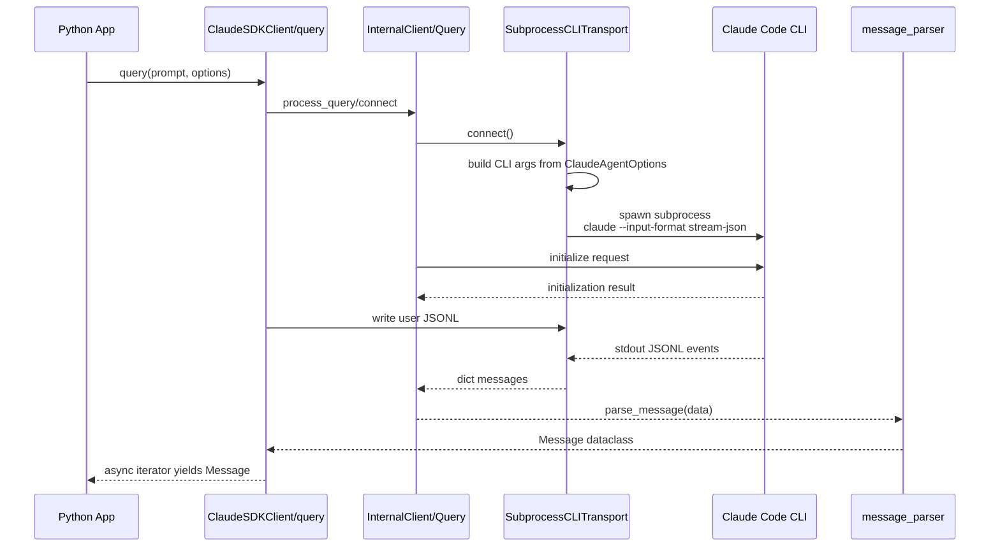
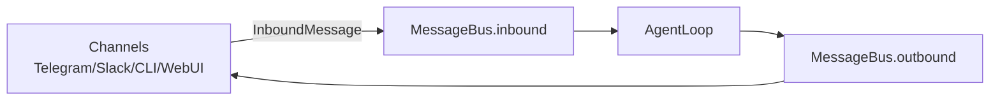
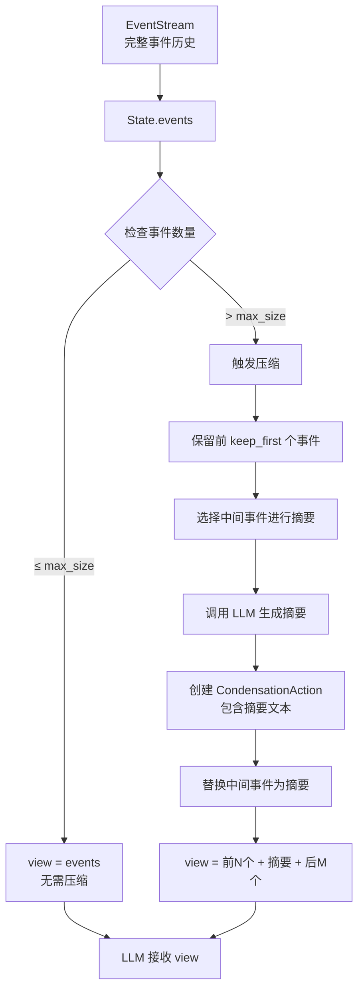

# 单产品实现深潜

> **合并说明**：由以下文档去重合并（2026-08-04）。

---


---

## Claude Agent SDK

> **源码来源**: `anthropics/claude-agent-sdk-python` 官方 GitHub  
> **本地源码**: `claude-agent-sdk-python/` · **架构深读**: [CLAUDE_AGENT_SDK_RUNTIME_CONTROL_DEEP_DIVE.md](../../../claude-agent-sdk-python/docs/CLAUDE_AGENT_SDK_RUNTIME_CONTROL_DEEP_DIVE.md)  
> **核心结论**: Python SDK **不自建 agent loop**，而是把 Python API 映射到 Claude Code CLI 子进程，通过 `stream-json` 协议收发 JSONL 消息；真正的工具循环、上下文管理、压缩、权限与内置工具执行在 Claude Code CLI 内部。

---

## 1. 一句话定位

Claude Agent SDK Python 是 **Claude Code CLI 的 Python 控制面**：

```text
Python query()/ClaudeSDKClient
  → InternalClient / Query
  → SubprocessCLITransport
  → claude CLI --input-format stream-json
  → CLI 内部 agent loop
  → JSONL message stream
  → Python dataclass Message
```

所以它不是 OpenManus/Hermes/nanobot 那种“自己在 Python 里写 LLM → tool → result loop”的框架。它的价值是：

- 用 Python 启动 Claude Code；
- 配置工具、权限、MCP、skills、subagents、hooks；
- 读取 Claude Code 的结构化流；
- 在需要时发送后续 user message、interrupt、切换 permission/model；
- 可选把 transcript mirror 到外部 `SessionStore`。

---

## 2. 核心入口

### 2.1 `query()`：一次性/单向流

源码：`src/claude_agent_sdk/query.py`

```python
async def query(
    *,
    prompt: str | AsyncIterable[dict[str, Any]],
    options: ClaudeAgentOptions | None = None,
    transport: Transport | None = None,
) -> AsyncIterator[Message]:
    if options is None:
        options = ClaudeAgentOptions()

    client = InternalClient()

    async for message in client.process_query(
        prompt=prompt,
        options=options,
        transport=transport,
    ):
        yield message
```

`query()` 特点：

| 特性 | 说明 |
|------|------|
| 通信方向 | 单向：先给 prompt，再消费输出 |
| 状态 | 每次独立，除非 options 指定 `resume/continue/session_id` |
| 中断 | 不支持 interrupt |
| 适用 | CI、脚本、批处理、一次性代码任务 |

### 2.2 `ClaudeSDKClient`：状态式交互

源码：`src/claude_agent_sdk/client.py`

关键方法：

| 方法 | 作用 |
|------|------|
| `connect(prompt=None)` | 启动 Claude Code CLI 子进程，初始化 Query 控制协议 |
| `query(prompt, session_id="default")` | 连接后继续写入 user message |
| `receive_messages()` | 迭代读取并 parse CLI JSON 消息 |
| `receive_response()` | 读到 `ResultMessage` 为止 |
| `interrupt()` | 向 Query 发送 interrupt |
| `set_permission_mode(mode)` | 动态切换权限模式 |
| `set_model(model)` | 动态切换模型 |
| `disconnect()` | 关闭 transport 和 materialized session 临时目录 |

---

## 3. 端到端时序



---

## 4. `ClaudeSDKClient.connect()` 源码级流程

源码：`src/claude_agent_sdk/client.py`

```text
connect(prompt)
  1. validate_session_store_options(options)
  2. 如果 options.resume/continue + session_store:
       materialize_resume_session(options)
       把外部 store 中的 transcript 写到临时 CLAUDE_CONFIG_DIR
  3. _connect_inner(prompt, actual_prompt)
```

`_connect_inner()`：

```text
1. 如果 options.can_use_tool:
     - 要求 prompt 不是 str，而是 AsyncIterable
     - 自动 permission_prompt_tool_name="stdio"

2. 如果有 materialized session:
     - apply_materialized_options()

3. 选择 transport:
     - 自定义 transport → 直接用
     - 默认 → SubprocessCLITransport(prompt=actual_prompt, options=options)

4. await transport.connect()

5. 提取 SDK MCP servers:
     options.mcp_servers 中 type == "sdk" 的 server instance

6. 构造 Query:
     Query(
       transport=transport,
       is_streaming_mode=True,
       can_use_tool=options.can_use_tool,
       hooks=converted hooks,
       sdk_mcp_servers=sdk_mcp_servers,
       agents=agents_dict,
       skills=options.skills,
       ...
     )

7. 如果 options.session_store:
     set_transcript_mirror_batcher(...)

8. await query.start()
9. await query.initialize()

10. 如果初始 prompt 是 str:
      写入 JSONL:
      {
        "type": "user",
        "message": {"role": "user", "content": prompt},
        "parent_tool_use_id": None,
        "session_id": "default"
      }

11. 如果 prompt 是 AsyncIterable:
      query.spawn_task(query.stream_input(prompt))
```

这里最关键的是第 4 步：Python SDK 不是自己调 Anthropic Messages API，而是启动 CLI 子进程。

---

## 5. Transport：如何启动 Claude Code

源码：`src/claude_agent_sdk/_internal/transport/subprocess_cli.py`

### 5.1 命令构造

`SubprocessCLITransport._build_command()` 会把 `ClaudeAgentOptions` 映射成 CLI 参数：

| Option | CLI 参数 |
|--------|----------|
| `tools` | `--tools` |
| `allowed_tools` | `--allowedTools` |
| `max_turns` | `--max-turns` |
| `max_budget_usd` | `--max-budget-usd` |
| `disallowed_tools` | `--disallowedTools` |
| `model` | `--model` |
| `fallback_model` | `--fallback-model` |
| `permission_mode` | `--permission-mode` |
| `continue_conversation` | `--continue` |
| `resume` | `--resume <id>` |
| `session_id` | `--session-id <uuid>` |
| `mcp_servers` | `--mcp-config <json/path>` |
| `strict_mcp_config` | `--strict-mcp-config` |
| `fork_session` | `--fork-session` |
| `session_store` | `--session-mirror` |
| `plugins` | `--plugin-dir` |
| `thinking` | `--thinking` / `--max-thinking-tokens` |
| `output_format` | `--json-schema` |

最后强制：

```text
--input-format stream-json
```

这就是 SDK 与 CLI 的主协议开关。

### 5.2 子进程启动

`SubprocessCLITransport.connect()`：

```text
1. _find_cli()
2. _check_claude_version()
3. cmd = _build_command()
4. process_env:
     - 继承环境变量，排除 CLAUDECODE
     - CLAUDE_CODE_ENTRYPOINT=sdk-py
     - CLAUDE_AGENT_SDK_VERSION=...
     - options.env 覆盖
     - 可注入 OTEL trace context
5. anyio.open_process(
     cmd,
     stdin=PIPE,
     stdout=PIPE,
     stderr=PIPE if stderr callback exists,
     cwd=options.cwd,
     env=process_env,
     user=options.user,
   )
6. stdout → TextReceiveStream
7. stdin → TextSendStream
8. _ready = True
```

### 5.3 JSONL 收发

写入：

```text
transport.write(json.dumps(message) + "\n")
```

读取：

```text
async for line in stdout:
  strip 空行
  跳过非 JSON 行
  累积 partial JSON
  json.loads()
  yield dict
```

所以 SDK 的数据协议是 **stdin/stdout JSONL**。

---

## 6. 数据模型与事件

源码：`src/claude_agent_sdk/types.py`

### 6.1 内容块

| 类型 | 含义 |
|------|------|
| `TextBlock` | 普通文本 |
| `ThinkingBlock` | thinking 内容 |
| `ToolUseBlock` | 工具调用 |
| `ToolResultBlock` | 工具结果 |
| `ServerToolUseBlock` | 服务端工具调用，如 web_search |
| `ServerToolResultBlock` | 服务端工具结果 |

### 6.2 消息类型

| 类型 | 说明 |
|------|------|
| `UserMessage` | 用户输入 |
| `AssistantMessage` | Claude 输出，含 content blocks、message_id、stop_reason、session_id |
| `SystemMessage` | 系统事件基类 |
| `TaskStartedMessage` | 子任务开始 |
| `TaskProgressMessage` | 子任务进度 |
| `TaskNotificationMessage` | 子任务完成/失败/停止 |
| `MirrorErrorMessage` | session mirror 失败 |
| `ResultMessage` | 一次 run 的最终结果、turn 数、cost、usage、session_id |
| `HookEventMessage` | hook 生命周期事件 |

### 6.3 Options 是 SDK 的真正控制面

`ClaudeAgentOptions` 不只是模型参数，它是把 Python 配置映射到 Claude Code CLI 的“协议对象”。

关键字段：

| 字段 | 作用 |
|------|------|
| `tools` | 限定可见内置工具集合 |
| `allowed_tools` | 自动允许执行的工具 |
| `disallowed_tools` | 从上下文移除并禁止 |
| `system_prompt` | 自定义或 preset system prompt |
| `mcp_servers` | MCP 配置或 SDK in-process server |
| `strict_mcp_config` | 只使用传入 MCP 配置 |
| `permission_mode` | `default/acceptEdits/plan/bypassPermissions/dontAsk/auto` |
| `continue_conversation` | 继续当前目录最近会话 |
| `resume` | 恢复指定 session |
| `session_id` | 使用指定 UUID |
| `fork_session` | resume 后 fork 新 session |
| `can_use_tool` | SDK 侧权限回调 |
| `hooks` | hook callback |
| `agents` | 程序化定义 subagents |
| `skills` | 启用 skills |
| `sandbox` | Claude Code sandbox 设置 |
| `session_store` | transcript mirror 外部存储 |
| `enable_file_checkpointing` | 文件 checkpoint |

---

## 7. Session / 持久化 / Resume

Claude Agent SDK 的 session 能力分两层：

### 7.1 CLI 原生 session

通过 CLI 参数：

```text
--continue
--resume <session_id>
--session-id <uuid>
--fork-session
```

这部分实际持久化位置和压缩策略属于 Claude Code CLI，而不是 Python SDK。

### 7.2 SDK `SessionStore`

`ClaudeAgentOptions.session_store` 提供 transcript mirror：

```text
CLI stdout transcript
  → Query
  → transcript mirror batcher
  → session_store.append()
```

resume 时：

```text
session_store.load(SessionKey)
  → materialize_resume_session()
  → 临时 CLAUDE_CONFIG_DIR / JSONL
  → CLI --resume 从 materialized 数据恢复
```

`SessionStore` 语义：

| 方法 | 作用 |
|------|------|
| `load(key)` | resume 前加载完整 session |
| `append(key, entries)` | mirror 新 transcript |
| `list_subkeys()` | 恢复 subagent transcript |
| `list_sessions()` | 列出 session 元数据 |

### 7.3 Memory / 压缩边界

Python SDK 本身没有：

- `Memory` 类；
- summarizer；
- token-based compression；
- vector store；
- AGENTS/MEMORY 文件注入逻辑。

这些能力属于 Claude Code CLI 的内部上下文管理。SDK 能做的是：

- 传入 `system_prompt`；
- 配置 `setting_sources` 是否加载 `CLAUDE.md`；
- 配置 `skills`；
- 配置 `session_store` mirror；
- 读取 CLI 输出中的 `ContextUsage` / result / session_id。

---

## 8. 权限与工具控制

### 8.1 permission mode

| mode | 行为 |
|------|------|
| `default` | 标准权限，危险工具会提示 |
| `acceptEdits` | 自动接受文件编辑 |
| `plan` | 只规划，不执行工具 |
| `bypassPermissions` | 跳过权限检查 |
| `dontAsk` | 不提示，未预批准就拒绝 |
| `auto` | 模型分类器决定 |

### 8.2 `can_use_tool`

`can_use_tool` 是 Python 侧权限回调，但有限制：

```text
如果 options.can_use_tool:
  - prompt 不能是 str，必须是 AsyncIterable
  - 自动 permission_prompt_tool_name = "stdio"
```

原因：权限请求需要在 streaming/control protocol 中来回交互。

---

## 9. 与 OpenManus/nanobot 的核心区别

| 维度 | Claude Agent SDK Python | OpenManus | nanobot |
|------|-------------------------|-----------|---------|
| agent loop | Claude Code CLI 内部 | Python 手写 `while step` | Python `AgentRunner._run_core` |
| 工具执行 | CLI 内置工具/MCP | `BaseTool.execute()` | `ToolRegistry` + runner |
| session | CLI session + SDK `SessionStore` mirror | 无内置 | `SessionManager` |
| memory/压缩 | CLI 内部，不在 SDK | 无压缩，100 条截断 | Consolidator + Dream |
| 协议 | stdin/stdout JSONL | 内存对象调用 | MessageBus + provider/tool loop |
| Python SDK 职责 | 控制 CLI 子进程 | 自己跑 agent | 自己跑 agent 服务 |

---

## 10. 源码阅读路线

1. `src/claude_agent_sdk/query.py`：理解 one-shot API。
2. `src/claude_agent_sdk/client.py`：理解 stateful client、connect/query/receive。
3. `src/claude_agent_sdk/_internal/transport/subprocess_cli.py`：理解 CLI 子进程和 JSONL 协议。
4. `src/claude_agent_sdk/types.py`：理解 options、message、session_store、permission。
5. `_internal/query.py`、`message_parser.py`：进一步理解 control protocol 和事件解析。

---

**最后更新**: 2026-06-08


---

## nanobot

> **源码来源**: `HKUDS/nanobot` 官方 GitHub  
> **本地状态**: 当前 workspace 未包含 `nanobot/` 源码目录  
> **核心结论**: nanobot 是一个轻量但完整的 Python Agent 框架，核心是 `MessageBus → AgentLoop → AgentRunner → ToolRegistry → Session/Memory`。它不是目录级 demo：它有明确的异步消息总线、会话管理、上下文构建、tool-calling runner、token 触发压缩，以及 Dream 两阶段长期记忆巩固。

---

## 1. 一句话理解 nanobot

nanobot 的主链路是：

```text
Channel 收消息
  → MessageBus.inbound
  → AgentLoop.run()
  → AgentLoop._dispatch()
  → AgentLoop._process_message()
  → ContextBuilder.build_messages()
  → AgentRunner.run()
  → provider.chat_with_retry()
  → ToolRegistry.execute()
  → SessionManager.save()
  → MessageBus.outbound
  → Channel 发消息
```

它的边界非常清楚：

| 层 | 职责 |
|----|------|
| Channel | 连接 Telegram/Slack/CLI/WebSocket 等外部平台 |
| MessageBus | 用两个 `asyncio.Queue` 解耦 channel 与 agent |
| AgentLoop | 会话、上下文、命令、并发、MCP、调度 |
| AgentRunner | 纯 LLM/tool 迭代 loop |
| SessionManager | per-session 历史与 metadata |
| MemoryStore | `SOUL.md` / `USER.md` / `memory/MEMORY.md` / `history.jsonl` |
| Consolidator | token 触发的轻量压缩 |
| Dream | 后台/手动触发的长期记忆整理 |

---

## 2. MessageBus：45 行但很关键

源码：`nanobot/bus/queue.py`

```python
class MessageBus:
    def __init__(self):
        self.inbound: asyncio.Queue[InboundMessage] = asyncio.Queue()
        self.outbound: asyncio.Queue[OutboundMessage] = asyncio.Queue()

    async def publish_inbound(self, msg): await self.inbound.put(msg)
    async def consume_inbound(self): return await self.inbound.get()
    async def publish_outbound(self, msg): await self.outbound.put(msg)
    async def consume_outbound(self): return await self.outbound.get()
```

这让系统变成：



它的价值不是代码多，而是边界稳：

- Channel 不知道 Agent 怎么跑；
- Agent 不知道消息来自哪个平台；
- 新平台只要 publish/consume bus；
- 并发和 session 锁放在 `AgentLoop`，不是 channel。

---

## 3. AgentLoop：产品层调度器

源码：`nanobot/agent/loop.py`

`AgentLoop` 的 docstring 写得很直白：

```text
1. Receives messages from the bus
2. Builds context with history, memory, skills
3. Calls the LLM
4. Executes tool calls
5. Sends responses back
```

### 3.1 初始化时组装的核心组件

`AgentLoop.__init__()` 中创建：

| 字段 | 类型/来源 | 作用 |
|------|-----------|------|
| `context` | `ContextBuilder` | 构造 system/user/history/memory/skills 上下文 |
| `sessions` | `SessionManager` | per-session 历史与 metadata |
| `tools` | `ToolRegistry` | 工具注册和执行 |
| `runner` | `AgentRunner(provider)` | 纯 LLM/tool loop |
| `subagents` | `SubagentManager` | 子 Agent 管理 |
| `consolidator` | `Consolidator` | token 触发压缩到 history.jsonl |
| `auto_compact` | `AutoCompact` | TTL idle session 压缩 |
| `_session_locks` | `dict[str, asyncio.Lock]` | 同一 session 串行 |
| `_pending_queues` | `dict[str, Queue]` | 活跃 turn 的 mid-turn 注入 |
| `_active_tasks` | `dict[str, list[Task]]` | session 级任务追踪 |

### 3.2 `AgentLoop.run()` 主循环

源码级流程：

```text
AgentLoop.run()
  1. self._running = True
  2. await _connect_mcp()
  3. while self._running:
       3.1 msg = await bus.consume_inbound()，1s timeout
       3.2 timeout 时 auto_compact.check_expired(...)
       3.3 raw = msg.content.strip()
       3.4 effective_key = _effective_session_key(msg)
       3.5 handle_runtime_control(...)
       3.6 priority command → _dispatch_command_inline()
       3.7 如果 session 已有 pending_queue:
             - 普通消息放入 pending queue，作为 mid-turn injection
             - 非 priority command 直接执行
       3.8 否则 create_task(self._dispatch(msg))
       3.9 记录到 _active_tasks[session_key]
```

这里是 nanobot 区别于 OpenManus 的关键：**同一 session 串行，跨 session 并发**。

```mermaid
sequenceDiagram
    participant Bus as MessageBus
    participant Loop as AgentLoop
    participant Lock as Session Lock
    participant Runner as AgentRunner

    Bus->>Loop: consume_inbound()
    Loop->>Loop: effective_session_key
    alt session already running
        Loop->>Loop: route to pending_queue
    else new dispatch
        Loop->>Lock: async with session lock
        Lock->>Runner: _process_message() / _run_agent_loop()
    end
```

### 3.3 `_dispatch()`：session 串行与 pending queue

`_dispatch()`：

```text
1. session_key = _effective_session_key(msg)
2. lock = _session_locks.setdefault(session_key, asyncio.Lock())
3. async with lock, concurrency_gate:
     3.1 pending = asyncio.Queue(maxsize=20)
     3.2 _pending_queues[session_key] = pending
     3.3 如果 wants_stream，创建 on_stream/on_stream_end
     3.4 response = await _process_message(...)
     3.5 bus.publish_outbound(response)
4. finally:
     4.1 清理 pending_queue
     4.2 剩余 pending message 重新 publish_inbound，避免丢消息
     4.3 runtime status = idle
```

这个 pending queue 是 nanobot 支持“turn 过程中又来了用户消息/子 Agent 结果”的关键。

---

## 4. AgentLoop 到 AgentRunner 的边界

源码：`nanobot/agent/loop.py` `_run_agent_loop()`

```text
AgentLoop._run_agent_loop(...)
  1. 创建 AgentProgressHook
  2. 如果有额外 hooks，组合为 CompositeHook
  3. 定义 checkpoint_callback：写入 session runtime checkpoint
  4. 定义 injection_callback：从 pending_queue drain follow-up messages
  5. bind_file_states / bind_request_context / bind_workspace_scope
  6. 调 AgentRunner.run(AgentRunSpec(...))
  7. reset contextvars
  8. 根据 stop_reason 做 stream 结束、错误处理
  9. 返回 final_content, tools_used, messages, stop_reason, had_injections
```

`AgentRunSpec` 把产品层信息打包给 Runner：

| 字段 | 来源 | 作用 |
|------|------|------|
| `initial_messages` | `ContextBuilder` | 给模型的初始上下文 |
| `tools` | `ToolRegistry` | 工具列表 |
| `model` | config/preset | 模型名 |
| `max_iterations` | defaults | 最大 LLM/tool loop |
| `max_tool_result_chars` | defaults | 工具结果预算 |
| `hook` | `AgentProgressHook` | streaming/progress/checkpoint |
| `session_key` | Session | 日志、checkpoint、工具上下文 |
| `context_window_tokens` | config | 上下文治理 |
| `injection_callback` | pending queue | mid-turn 注入 |
| `checkpoint_callback` | session metadata | 取消恢复 |

---

## 5. AgentRunner：真正的 tool-calling loop

源码：`nanobot/agent/runner.py`

`AgentRunner` 的职责很纯：不管 channel、不管持久化、不管命令，只管“给 LLM 消息 → 执行工具 → 下一轮”。

### 5.1 `AgentRunner.run()`

```text
run(spec)
  1. hook = spec.hook or AgentHook()
  2. messages = list(spec.initial_messages)
  3. hook.before_run()
  4. result = _run_core(spec, hook, messages)
  5. hook.after_run()
  6. hook.on_finally()
```

异常：

- `CancelledError`：标记 `stop_reason=cancelled` 后继续抛出；
- 其它异常：`stop_reason=error`，调用 `hook.on_error()`，再抛出。

### 5.2 `_run_core()` 循环

这是 nanobot 的核心 loop：

```text
for iteration in range(spec.max_iterations):
  1. 上下文治理：
       _drop_orphan_tool_results()
       _backfill_missing_tool_results()
       _microcompact()
       _apply_tool_result_budget()
       _snip_history()

  2. hook.before_iteration()

  3. response = _request_model(spec, messages_for_model, hook, context)

  4. usage 统计、reasoning 提取、stream hook

  5. 如果 response.should_execute_tools:
       5.1 build assistant_message(tool_calls)
       5.2 messages.append(assistant_message)
       5.3 emit checkpoint phase="awaiting_tools"
       5.4 hook.before_execute_tools()
       5.5 _execute_tools(...)
       5.6 每个 result → tool message append
       5.7 fatal tool error → final message + break
       5.8 emit checkpoint phase="tools_completed"
       5.9 drain injections after tool execution
       5.10 continue 下一轮

  6. 如果没有工具调用:
       6.1 处理空响应重试
       6.2 处理 finish_reason == length 的续写恢复
       6.3 drain injections before final stream end
       6.4 append final assistant_message
       6.5 emit checkpoint phase="final_response"
       6.6 break

else:
  stop_reason = "max_iterations"
```

### 5.3 Runner 的上下文治理

Runner 每轮请求模型前都会生成 `messages_for_model`，但不直接改 persisted `messages`：

```text
messages              # 持久会话，append boundary 不能乱动
  ↓
messages_for_model    # 给模型看的临时版本
```

治理步骤：

| 步骤 | 作用 |
|------|------|
| `_drop_orphan_tool_results` | 删除没有对应 tool_call 的 tool result |
| `_backfill_missing_tool_results` | 补齐缺失 tool result，保持协议合法 |
| `_microcompact` | 微压缩历史内容 |
| `_apply_tool_result_budget` | 限制工具结果体积 |
| `_snip_history` | 根据 context window 裁剪历史 |

这比 OpenManus 的 `Memory.messages[-100:]` 细很多。

---

## 6. Session 与 Memory

### 6.1 `MemoryStore`

源码：`nanobot/agent/memory.py`

文件结构：

```text
workspace/
├── SOUL.md
├── USER.md
└── memory/
    ├── MEMORY.md
    ├── history.jsonl
    ├── .cursor
    └── .dream_cursor
```

职责：

| 文件 | 用途 |
|------|------|
| `SOUL.md` | Agent 身份/行为准则 |
| `USER.md` | 用户偏好/画像 |
| `memory/MEMORY.md` | 长期事实 |
| `memory/history.jsonl` | 会话归档、压缩摘要、raw fallback |
| `memory/.cursor` | history 自增 cursor |
| `memory/.dream_cursor` | Dream 已处理到哪个 cursor |

`MemoryStore.append_history()` 的关键实现：

```text
1. raw = entry.rstrip()
2. 如果超 max_chars → truncate_text()
3. content = strip_think(raw)
4. 加锁 _append_lock
5. cursor = _next_cursor()
6. record = {cursor, timestamp, content}
7. append JSON line to history.jsonl
8. 写 .cursor
```

它强调 durability：

- cursor 分配和 append 在锁内；
- JSONL append-only；
- 写入有 defensive cap；
- 自动迁移旧 `HISTORY.md`。

### 6.2 Memory 注入

`MemoryStore.get_memory_context()`：

```python
long_term = self.read_memory()
return f"## Long-term Memory\n{long_term}" if long_term else ""
```

这个 context 会经 `ContextBuilder` 进入 prompt。nanobot 的长期记忆不是向量库，而是 **Markdown 文件 → prompt 注入**。

### 6.3 SessionManager 与 per-session 历史

`AgentLoop` 使用：

```python
self.sessions = session_manager or SessionManager(workspace)
```

`_persist_user_message_early()` 会在 turn 开始前把用户消息写入 session：

```text
session.add_message("user", text, media/extra)
self._mark_pending_user_turn(session)
self.sessions.save(session)
```

取消时 `_dispatch()` 会尝试恢复 runtime checkpoint：

```text
_restore_runtime_checkpoint(session)
_clear_pending_user_turn(session)
sessions.save(session)
```

这解决了“工具执行一半 /stop 后上下文丢失”的问题。

---

## 7. 压缩：Consolidator

源码：`nanobot/agent/memory.py`

`Consolidator` 是轻量压缩层：

```python
class Consolidator:
    """Lightweight consolidation: summarizes evicted messages into history.jsonl."""
```

初始化依赖：

| 字段 | 作用 |
|------|------|
| `store` | `MemoryStore`，写 history.jsonl |
| `provider` | LLM provider |
| `model` | 压缩用模型 |
| `sessions` | `SessionManager` |
| `context_window_tokens` | 上下文窗口 |
| `build_messages` | 构造 prompt 的函数 |
| `get_tool_definitions` | 工具 schema，用于估算 prompt |
| `consolidation_ratio` | 压缩目标比例 |

### 7.1 token 触发压缩

核心方法：`maybe_consolidate_by_tokens(session, replay_max_messages=None)`

```text
1. 如果 context_window_tokens <= 0 → return
2. 获取 session lock
3. 刷新 session
4. budget = context_window_tokens - max_completion_tokens - safety_buffer
5. target = int(budget * consolidation_ratio)
6. 先处理 replay window overflow
7. estimate_session_prompt_tokens(session)
8. 如果 estimated < budget → 不压缩
9. 最多 5 轮：
     9.1 pick_consolidation_boundary(session, estimated - target)
     9.2 chunk = messages[last_consolidated:end_idx]
     9.3 summary = archive(chunk)
     9.4 session.last_consolidated = end_idx
     9.5 sessions.save(session)
     9.6 重新估算 tokens
10. 把 last_summary 写入 session.metadata["_last_summary"]
```

### 7.2 选择边界

`pick_consolidation_boundary()`：

```text
从 session.last_consolidated 开始累积 token
遇到新的 user message 时记录合法边界
直到 removed_tokens >= tokens_to_remove
返回上一个 user-turn boundary
```

这避免从一轮 tool call 中间截断，尽量按 user turn 边界压缩。

### 7.3 archive()

```text
archive(messages)
  1. MemoryStore._format_messages(messages)
  2. _truncate_to_token_budget()
  3. provider.chat_with_retry(
       system = agent/consolidator_archive.md
       user = formatted history
     )
  4. 成功：append_history(summary, max_chars=8000)
  5. 失败：raw_archive(messages)
```

这说明 nanobot 的压缩不是直接改 `MEMORY.md`，而是把旧会话摘要/原文归档到 `history.jsonl`，再由 Dream 慢慢吸收长期事实。

---

## 8. Dream：长期记忆巩固

Dream 的官方设计：

```text
Stage 1: Consolidator
  - per-turn / token-triggered
  - 把旧消息总结或 raw dump 到 memory/history.jsonl

Stage 2: Dream
  - 慢速、后台/手动触发
  - 读取 history.jsonl + SOUL.md + USER.md + MEMORY.md
  - 用 AgentRunner + file edit tools 做“外科手术式”编辑
  - 用 GitStore 记录变更，支持 dream-log / dream-restore
```

Dream 读取：

- `memory/history.jsonl` 新条目；
- `SOUL.md`；
- `USER.md`；
- `memory/MEMORY.md`。

Dream 配置：

| 字段 | 含义 |
|------|------|
| `intervalH` | 每隔多少小时运行 |
| `modelOverride` | Dream 专用模型 |
| `maxBatchSize` | 每次处理多少 history 条目 |
| `maxIterations` | Dream 编辑阶段 tool budget |

核心理念：

```text
Consolidator 解决“上下文塞不下”
Dream 解决“长期知识如何变得更准”
GitStore 解决“记忆修改如何可追溯/可回滚”
```

---

## 9. 端到端时序

```mermaid
sequenceDiagram
    participant CH as Channel
    participant BUS as MessageBus
    participant LOOP as AgentLoop
    participant SES as SessionManager
    participant CTX as ContextBuilder
    participant RUN as AgentRunner
    participant LLM as Provider
    participant TOOLS as ToolRegistry
    participant MEM as Consolidator/MemoryStore

    CH->>BUS: publish_inbound(InboundMessage)
    LOOP->>BUS: consume_inbound()
    LOOP->>LOOP: effective_session_key()
    LOOP->>LOOP: acquire session lock
    LOOP->>SES: get_or_create(session)
    LOOP->>SES: add user message early + save
    LOOP->>CTX: build_messages(history, memory, skills, runtime)
    LOOP->>RUN: run(AgentRunSpec)

    loop max_iterations
        RUN->>RUN: context governance
        RUN->>LLM: _request_model(messages_for_model, tools)
        LLM-->>RUN: content/tool_calls
        alt tool calls
            RUN->>TOOLS: _execute_tools()
            TOOLS-->>RUN: tool results
            RUN->>RUN: append assistant + tool messages
            RUN->>LOOP: checkpoint tools_completed
        else final answer
            RUN->>RUN: append final assistant message
            RUN-->>LOOP: AgentRunResult
        end
    end

    LOOP->>SES: save messages/checkpoint
    LOOP->>MEM: maybe_consolidate_by_tokens(session)
    LOOP->>BUS: publish_outbound(OutboundMessage)
    BUS-->>CH: channel sends response
```

---

## 10. 与 OpenManus/Hermes/Claude SDK 对比

| 维度 | nanobot | OpenManus | Hermes | Claude Agent SDK |
|------|---------|-----------|--------|------------------|
| 核心 loop | `AgentRunner._run_core` | `BaseAgent.run` + `ToolCallAgent` | 命令式长期 loop | Claude Code CLI 内部 |
| 消息入口 | `MessageBus` | CLI input | CLI/Gateway | Python API → subprocess |
| session | `SessionManager` | 无 | SQLite sessions | CLI session + SessionStore mirror |
| 压缩 | `Consolidator` | 无，100 条截断 | compression | CLI 内部 |
| 长期记忆 | `SOUL/USER/MEMORY.md` + Dream | 无 | MEMORY/USER/provider | CLI/文件由 Claude Code 管 |
| 多平台 | Channels | 无 | Gateway | 无平台层 |
| 工具 | `ToolRegistry` | `ToolCollection` | toolsets/plugins | Claude Code tools |
| 子 Agent | SubagentManager/tool | PlanningFlow executor | delegate_task/kanban | `agents` option/CLI Agent tool |

---

## 11. 源码阅读路线

1. `nanobot/bus/queue.py`：理解 MessageBus。
2. `nanobot/bus/events.py`：看 `InboundMessage` / `OutboundMessage`。
3. `nanobot/agent/loop.py`：看 `AgentLoop.run()`、`_dispatch()`、`_run_agent_loop()`。
4. `nanobot/agent/runner.py`：看 `AgentRunner.run()`、`_run_core()`。
5. `nanobot/agent/context.py`：看 prompt/context 如何拼。
6. `nanobot/session/manager.py`：看 session 保存和恢复。
7. `nanobot/agent/memory.py`：看 `MemoryStore`、`Consolidator`、Dream。
8. `nanobot/agent/tools/registry.py`：看工具注册与执行。

---

**最后更新**: 2026-06-08


---

## AgentScope · Redis · mem0 · 事件视图

> **目的**: 澄清 AgentScope 存储架构和 OpenHands V1 上下文转换机制

---

## ⚠️ 阅读前必读（2026-07 勘误）

| 章节 | 状态 | 请改读 |
|------|------|--------|
| **§1 AgentScope RedisMemory** | **部分过时** | v0.x 路径 `agentscope/memory/_working_memory/_redis_memory.py` 在 v2 `main` **已移除** |
| **AgentScope v2 托管存储** | ✅ 现行 | `agentscope/src/agentscope/app/storage/_redis_storage.py` · [06-memory.md §14](06-memory.md#14-托管-app-层) |
| **§2 OpenHands Event View** | **概念仍对** | 实现仅在 `software-agent-sdk`；见 [10-openhands.md](10-openhands.md)、[06-memory.md](06-memory.md) |
| V0 `openhands/memory` | **已删除** | 勿再引用 |

下文 §1.1 保留作 **v0 RedisMemory 历史参考**；生产 AgentScope 请以 **`RedisStorage` + `RedisMessageBus`** 为准。

---

## 1. AgentScope: Redis 存储内容和 Mem0 外部数据

### 1.1 RedisMemory 存储的数据结构

**源码位置**: `agentscope/src/agentscope/memory/_working_memory/_redis_memory.py`

#### Redis Key 命名规范

AgentScope 的 RedisMemory 使用以下 Key 模式（支持多租户隔离）：

```python
# 1. Session 消息列表（有序）
SESSION_KEY = "user_id:{user_id}:session:{session_id}:messages"
# 示例: "user_id:user_123:session:session_abc:messages"
# 类型: Redis List
# 内容: [msg_id_1, msg_id_2, msg_id_3, ...]

# 2. 单条消息数据
MESSAGE_KEY = "user_id:{user_id}:session:{session_id}:msg:{msg_id}"
# 示例: "user_id:user_123:session:session_abc:msg:msg_xyz789"
# 类型: Redis String (JSON)
# 内容: {"id": "msg_xyz789", "role": "user", "content": "...", ...}

# 3. 标记索引集合
MARKS_INDEX_KEY = "user_id:{user_id}:session:{session_id}:marks_index"
# 示例: "user_id:user_123:session:session_abc:marks_index"
# 类型: Redis Set
# 内容: {"compressed", "hint", "tool_call", ...}

# 4. 特定标记的消息 ID 列表
MARK_KEY = "user_id:{user_id}:session:{session_id}:mark:{mark}"
# 示例: "user_id:user_123:session:session_abc:mark:compressed"
# 类型: Redis List
# 内容: [msg_id_1, msg_id_5, msg_id_10, ...]
```

#### Redis 中实际存储的内容

**1. 消息列表（Session Key）**

```python
# Redis List: user_id:user_123:session:session_abc:messages
RPUSH user_id:user_123:session:session_abc:messages "msg_001"
RPUSH user_id:user_123:session:session_abc:messages "msg_002"
RPUSH user_id:user_123:session:session_abc:messages "msg_003"
```

**作用**：维护消息的顺序，支持快速遍历和分页。

**2. 消息详情（Message Key）**

```python
# Redis String: user_id:user_123:session:session_abc:msg:msg_001
SET user_id:user_123:session:session_abc:msg:msg_001 '{
    "id": "msg_001",
    "name": "user",
    "role": "user",
    "content": [
        {
            "type": "text",
            "text": "帮我写一个 Python 函数"
        }
    ],
    "metadata": {},
    "timestamp": "2026-04-27T10:00:00"
}'
```

**序列化格式**：使用 `json.dumps(m.to_dict(), ensure_ascii=False)` 将 `Msg` 对象序列化为 JSON 字符串。

**3. 标记系统（Marks Index + Mark Keys）**

```python
# Redis Set: user_id:user_123:session:session_abc:marks_index
SADD user_id:user_123:session:session_abc:marks_index "compressed"
SADD user_id:user_123:session:session_abc:marks_index "hint"

# Redis List: user_id:user_123:session:session_abc:mark:compressed
RPUSH user_id:user_123:session:session_abc:mark:compressed "msg_001"
RPUSH user_id:user_123:session:session_abc:mark:compressed "msg_005"
```

**作用**：
- `marks_index`：快速枚举所有存在的标记类型
- `mark:{mark}`：根据标记快速过滤消息（用于压缩、工具调用追踪等）

**4. 压缩摘要（继承自 MemoryBase）**

```python
# 注意：RedisMemory 不单独存储 _compressed_summary
# 它存储在内存中，每次会话重新加载时需要重新生成或从其他持久化存储恢复
self._compressed_summary: str = ""
```

**重要**：`_compressed_summary` 字段在 `MemoryBase` 中定义，但 **RedisMemory 不会自动持久化它**。如果需要跨会话保留压缩摘要，需要：
1. 手动保存到 Redis（自定义 Key）
2. 或使用支持状态持久化的后端（如 `AsyncSQLAlchemyMemory`）

#### Redis 存储的优势

| 特性 | 说明 |
|------|------|
| **多租户隔离** | 通过 `user_id` 和 `session_id` 前缀实现完全隔离 |
| **有序性** | Redis List 天然保持消息顺序 |
| **高效过滤** | 通过标记索引快速筛选特定类型的消息 |
| **TTL 支持** | 可设置 `key_ttl` 自动过期整个会话 |
| **原子操作** | 使用 Pipeline 保证批量操作的原子性 |
| **持久化** | Redis AOF/RDB 提供数据持久化保障 |

#### 完整存储流程示例

```python
# 添加消息到 Redis
await redis_memory.add(
    memories=[
        Msg("user", "你好", "user"),
        Msg("assistant", "你好！有什么可以帮助你的？", "assistant"),
    ],
    marks=["conversation"],  # 可选：添加标记
)

# Redis 中生成的数据：
# 1. LPUSH session_key ["msg_001", "msg_002"]
# 2. SET message_key:msg_001 '{"id":"msg_001","role":"user",...}'
# 3. SET message_key:msg_002 '{"id":"msg_002","role":"assistant",...}'
# 4. RPUSH mark:conversation ["msg_001", "msg_002"]
# 5. SADD marks_index "conversation"
```

---

### 1.2 Mem0LongTermMemory 存储的外部数据

**源码位置**: `agentscope/src/agentscope/memory/_long_term_memory/_mem0/_mem0_long_term_memory.py`

#### Mem0 是什么？

[Mem0](https://github.com/mem0ai/mem0) 是一个开源的记忆管理层，提供：
- **向量存储**：语义相似度检索
- **图数据库**（可选）：知识图谱关系
- **LLM 驱动的记忆提取**：自动从对话中提取关键信息
- **元数据过滤**：基于 agent/user/run 的多维度隔离

#### Mem0 存储的数据结构

**1. 向量数据库（默认 Qdrant）**

```python
# Qdrant Collection: mem0_memories
{
    "id": "uuid-12345",
    "vector": [0.1, 0.2, ..., 0.768],  # 嵌入向量（768 维）
    "payload": {
        "memory": "用户喜欢住民宿",      # 提取的记忆文本
        "agent_id": "Friday",           # 智能体标识
        "user_id": "user_123",          # 用户标识
        "run_id": "session_abc",        # 会话标识（可选）
        "metadata": {                   # 额外元数据
            "category": "preference",
            "confidence": 0.95,
            "created_at": "2026-04-27T10:00:00"
        }
    }
}
```

**存储内容**：
- **原始记忆文本**：从对话中提取的关键信息（偏好、事实、经验等）
- **嵌入向量**：用于语义相似度搜索
- **元数据**：agent_id、user_id、run_id 用于隔离和过滤

**2. LLM 配置（用于记忆提取）**

```python
# Mem0 内部使用的 LLM 配置
mem0_config.llm = ASLlmConfig(
    provider="agentscope",
    config={
        "model": DashScopeChatModel(
            model_name="qwen-max-latest",
            api_key=os.environ.get("DASHSCOPE_API_KEY"),
        )
    }
)
```

**作用**：当调用 `record()` 时，Mem0 使用 LLM 从原始消息中提取结构化记忆。

**3. 嵌入模型配置**

```python
# Mem0 内部使用的嵌入模型
mem0_config.embedder = ASEmbedderConfig(
    provider="agentscope",
    config={
        "model": DashScopeTextEmbedding(
            model_name="text-embedding-v3",
            dimensions=1024,
        )
    }
)
```

**作用**：将记忆文本转换为向量，存入向量数据库。

#### Mem0 的工作流程

**记录记忆（Record）**

```python
# 用户代码
await long_term_memory.record([
    Msg("user", "我喜欢住民宿", "user")
])

# Mem0 内部流程：
# 1. LLM 提取记忆 → "用户偏好住宿类型：民宿"
# 2. 嵌入模型生成向量 → [0.1, 0.2, ..., 0.768]
# 3. 存入 Qdrant → {
#      "memory": "用户偏好住宿类型：民宿",
#      "agent_id": "Friday",
#      "user_id": "user_123",
#      "vector": [0.1, 0.2, ...]
#    }
```

**检索记忆（Retrieve）**

```python
# 用户代码
results = await long_term_memory.retrieve([
    Msg("user", "我的住宿偏好", "user")
])

# Mem0 内部流程：
# 1. 嵌入查询 → [0.15, 0.25, ..., 0.758]
# 2. 向量相似度搜索 → 找到最接近的记忆
# 3. 元数据过滤 → 只返回 agent_id="Friday" AND user_id="user_123" 的记忆
# 4. 返回结果 → "用户偏好住宿类型：民宿"
```

#### Mem0 与 Working Memory 的区别

| 维度 | Working Memory (Redis) | Long-term Memory (Mem0) |
|------|------------------------|-------------------------|
| **存储内容** | 原始对话消息（完整历史） | 提取的结构化记忆（偏好、事实） |
| **存储形式** | JSON 字符串 | 向量 + 元数据 |
| **检索方式** | 按顺序、按标记过滤 | 语义相似度搜索 |
| **生命周期** | 当前会话 | 跨会话持久化 |
| **压缩** | 支持自动压缩 | 不支持（本身就是压缩后的记忆） |
| **用途** | 维持对话上下文 | 长期知识沉淀、个性化 |
| **后端** | Redis / InMemory / SQL | Qdrant / Chroma / Pinecone |

#### 实际应用场景

**场景 1：用户偏好记忆**

```python
# 第一轮对话
await agent(Msg("user", "我更喜欢 Python 而非 JavaScript"))
# Mem0 提取 → "用户编程语言偏好：Python > JavaScript"

# 第二轮对话（新会话）
await agent(Msg("user", "帮我写一个排序算法"))
# Mem0 检索 → 发现用户偏好 Python
# Agent 自动生成 Python 代码而非 JavaScript
```

**场景 2：项目上下文记忆**

```python
# 第一天
await agent(Msg("user", "我的项目使用 FastAPI + PostgreSQL"))
# Mem0 提取 → "项目技术栈：FastAPI + PostgreSQL"

# 第二天
await agent(Msg("user", "如何添加用户认证？"))
# Mem0 检索 → 知道项目使用 FastAPI
# Agent 提供 FastAPI 特定的认证方案（而非 Django/Flask）
```

---

## 2. OpenHands V1: 事件视图转换机制

### 2.1 核心问题：是否使用事件视图来转换上下文？

**答案：是的，OpenHands V1 使用事件视图（Event View）来转换上下文。**

但这个"视图"不是传统意义上的数据库视图，而是 **从 EventStream 动态投影出 LLM 可见的消息序列**。

### 2.2 OpenHands 的事件驱动架构

#### 事件流（EventStream）

OpenHands 将所有交互记录为事件（Event），包括：

```python
# 事件类型示例
events = [
    UserMessageAction(content="帮我修复这个 bug"),       # 用户消息
    AgentThinkAction(thought="我需要先读取文件"),         # 智能体思考
    FileReadAction(path="main.py"),                      # 文件读取动作
    FileReadObservation(content="..."),                  # 文件读取结果
    AgentMessageAction(content="已读取文件，发现..."),     # 智能体回复
    CmdRunAction(command="pytest"),                      # 命令执行
    CmdOutputObservation(output="1 failed"),             # 命令输出
]
```

**关键特性**：
- **不可变**：事件一旦写入 EventStream，永不修改
- **有序**：每个事件有唯一的递增 ID
- **完整历史**：保存所有中间步骤（思考、工具调用、观察）

#### 状态（State）与视图（View）

OpenHands SDK 中的 `State` 对象维护两个关键属性：

```python
class State:
    events: list[Event]      # 完整事件历史（从 EventStream 加载）
    view: list[Event]        # LLM 可见的事件子集（经过压缩/过滤）
```

**视图的作用**：
1. **Token 控制**：只包含 LLM 上下文窗口能容纳的事件
2. **隐私保护**：过滤敏感信息（如密码、密钥）
3. **噪声减少**：隐藏中间步骤（如失败的尝试）

### 2.3 LLMSummarizingCondenser 的工作原理

**真源（2026-07）**: `software-agent-sdk/openhands-sdk/openhands/sdk/context/condenser/llm_summarizing_condenser.py`  
**配置**: `AgentSettings` → `LLMSummarizingCondenserSettings`（`sdk/settings/model.py`），**非**已删除的 `openhands/core/config/condenser_config.py`

```python
# 默认参数（SDK）
class LLMSummarizingCondenser(RollingCondenser):
    max_size: int = 240
    keep_first: int = 2
    # max_tokens 等见 LLMSummarizingCondenserSettings
```

#### 压缩流程



#### 具体实现逻辑（伪代码）

```python
class LLMSummarizingCondenser:
    def condense(self, events: list[Event]) -> list[Event]:
        if len(events) <= self.max_size:
            return events  # 无需压缩
        
        # Step 1: 保留开头事件
        kept_start = events[:self.keep_first]
        
        # Step 2: 保留结尾事件（最近的上下文）
        recent_count = self.max_size - self.keep_first - 1  # -1 留给摘要
        kept_end = events[-recent_count:]
        
        # Step 3: 中间事件需要压缩
        middle_events = events[self.keep_first:-recent_count]
        
        # Step 4: 调用 LLM 生成摘要
        summary_prompt = self.build_summary_prompt(middle_events)
        summary_text = self.llm.generate(summary_prompt)
        
        # Step 5: 创建摘要事件
        summary_event = CondensationAction(
            forgotten_event_ids=[e.id for e in middle_events],
            summary=summary_text,
        )
        
        # Step 6: 组装视图
        view = kept_start + [summary_event] + kept_end
        return view
```

#### 摘要 Prompt 示例

```python
def build_summary_prompt(self, events: list[Event]) -> str:
    event_texts = [str(e) for e in events]
    return f"""
你是一个专业的对话摘要助手。

请总结以下对话片段的关键信息，包括：
1. 用户的原始任务
2. 已采取的行动
3. 发现的错误或问题
4. 当前的进度

对话片段：
{chr(10).join(event_texts)}

请用简洁的语言总结：
"""
```

### 2.4 视图转换的实际案例

#### 案例 1：未触发压缩（事件数 ≤ max_size）

```python
# EventStream 中有 50 个事件
state.events = [event_1, event_2, ..., event_50]

# max_size = 100，无需压缩
state.view = state.events  # 完整传递

# LLM 接收到的上下文
messages = [
    {"role": "user", "content": "帮我修复 bug"},
    {"role": "assistant", "content": "我需要先读取文件"},
    # ... 48 个中间事件 ...
    {"role": "assistant", "content": "已修复，请测试"},
]
```

#### 案例 2：触发压缩（事件数 > max_size）

```python
# EventStream 中有 150 个事件
state.events = [event_1, event_2, ..., event_150]

# max_size = 100, keep_first = 1
# 需要压缩中间 49 个事件

# Step 1: 保留开头
kept_start = [event_1]  # 用户任务

# Step 2: 保留结尾
kept_end = [event_101, ..., event_150]  # 最近 50 个事件

# Step 3: 压缩中间
middle = [event_2, ..., event_100]  # 49 个事件
summary = llm.generate(f"总结以下对话：{middle}")
# → "用户要求修复 main.py 中的 bug。已读取文件，发现第 10 行有语法错误。尝试修复 3 次，前 2 次失败，第 3 次部分成功。"

# Step 4: 创建摘要事件
summary_event = CondensationAction(
    forgotten_event_ids=[2, 3, ..., 100],
    summary=summary,
)

# Step 5: 组装视图
state.view = [event_1, summary_event, event_101, ..., event_150]

# LLM 接收到的上下文
messages = [
    {"role": "user", "content": "帮我修复 main.py 的 bug"},
    {"role": "system", "content": "[摘要] 用户要求修复 main.py 中的 bug...（省略 49 个事件的详细内容）"},
    {"role": "assistant", "content": "我注意到之前的修复还有问题，让我再试一次"},
    # ... 49 个最近事件 ...
]
```

### 2.5 事件视图 vs 消息投射

你之前提到的"事件投射"概念非常准确！OpenHands 确实是将 **事件流（Event Stream）投射为消息序列（Message Sequence）**。

#### 投射过程

```python
# 事件（内部表示）
events = [
    UserMessageAction(content="你好"),
    AgentThinkAction(thought="我应该打招呼"),
    AgentMessageAction(content="你好！有什么可以帮助你的？"),
]

# 投射为消息（LLM 可见）
messages = formatter.format(events)
# → [
#     {"role": "user", "content": "你好"},
#     {"role": "assistant", "content": "你好！有什么可以帮助你的？"}
#   ]
# 注意：AgentThinkAction 被过滤掉了（除非配置为可见）
```

#### 为什么需要投射？

1. **事件粒度更细**：
   - 事件记录每个动作（思考、工具调用、观察）
   - 消息只包含对话轮次

2. **灵活控制可见性**：
   - 可以隐藏中间思考过程
   - 可以选择性展示工具调用结果

3. **支持多种 Formatter**：
   - `OpenAIFormatter`：转换为 OpenAI API 格式
   - `AnthropicFormatter`：转换为 Anthropic API 格式
   - 自定义 Formatter：适应不同模型

### 2.6 与其他框架的对比

| 框架 | 上下文管理方式 | 压缩策略 |
|------|---------------|----------|
| **OpenHands V1** | EventStream → State.view | LLM 摘要 + 滑动窗口 |
| **AgentScope** | Working Memory + 标记系统 | 结构化摘要 + prepend_summary |
| **smolagents** | AgentMemory.steps | 选择性生成（summary_mode） |
| **LangGraph** | State 字典 | 手动管理（无内置压缩） |

**OpenHands 的独特之处**：
- ✅ **事件溯源**：完整记录所有中间步骤，便于调试和回放
- ✅ **动态视图**：根据 Token 限制动态调整 LLM 可见内容
- ✅ **可插拔 Condenser**：支持多种压缩策略（LLM、滑动窗口、注意力机制）

---

## 3. 总结

### 3.1 AgentScope 存储架构

**RedisMemory（短期记忆）**：
- 存储完整的对话消息（JSON 序列化）
- 使用标记系统支持高效过滤
- 支持多租户隔离和 TTL 自动过期
- **不自动持久化压缩摘要**（需手动处理）

**Mem0LongTermMemory（长期记忆）**：
- 存储提取的结构化记忆（向量 + 元数据）
- 使用 LLM 自动提取关键信息
- 支持语义相似度检索
- 跨会话持久化用户偏好和项目上下文

### 3.2 OpenHands V1 事件视图

**核心机制**：
- ✅ **使用事件视图转换上下文**
- EventStream 保存完整历史（不可变）
- State.view 动态投影 LLM 可见内容
- LLMSummarizingCondenser 通过 LLM 摘要压缩中间事件

**优势**：
- 事件溯源：完整记录，便于调试
- 灵活控制：可定制哪些事件对 LLM 可见
- 可扩展：支持多种 Condenser 策略

**与 AgentScope 的对比**：
- OpenHands：事件级压缩（摘要替代多个事件）
- AgentScope：消息级压缩（结构化摘要插入消息列表）

---

## 4. 参考资料

- AgentScope v2 RedisStorage: `agentscope/src/agentscope/app/storage/_redis_storage.py`
- AgentScope v2 LTM Middleware: `agentscope/src/agentscope/middleware/_longterm_memory/`
- OpenHands 架构: [10-openhands.md](10-openhands.md)
- OpenHands Condenser: `software-agent-sdk/openhands-sdk/openhands/sdk/context/condenser/`
- OpenHands SDK 版本: 与 `OpenHands/pyproject.toml` 钉扎一致（如 `1.37.1`）

**历史（v0，勿用于新设计）**:
- AgentScope RedisMemory: `agentscope/memory/_working_memory/_redis_memory.py`（v0 分支）
- OpenHands V0 condenser config: `openhands/core/config/condenser_config.py`（已删除）

