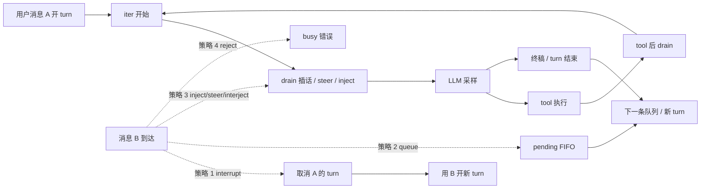

# Loop 过程中的插队对比

> **专题**：Agent **turn 尚未结束**（LLM 流式、tool 执行、多轮 sampling 循环进行中）时，用户再发一条消息——各框架如何处理？  
> **关联**：[03-runtime-loop-queue.md](03-runtime-loop-queue.md)（Bus/Queue 与 L0/L1 总览）· [09-channels.md](09-channels.md)（Channel→Loop 入口）· [05-plan-mode.md](05-plan-mode.md)（Grok §18 / OpenHuman QueueMode）

**最后更新**: 2026-08-05

---

## 0. 先分清：五种「打断」，不要混用

| 概念 | 层 | 打断什么 | 典型 API / 配置 |
|------|-----|----------|-----------------|
| **Loop 插队（本文）** | L1 用户消息 | 同 session 第二条 **chat 消息** 在 turn 进行中的命运 | pending queue、steer、interjection |
| **Turn interrupt** | L1 产品策略 | **整段当前 turn** 被取消，开新 turn | hermes `interrupt`、OH `QueueMode::Interrupt`、ohmo `_interrupt_session` |
| **Mid-turn inject** | L1 turn 内 | **不取消** turn；新文本并入当前 Runner 上下文 | nanobot `injection_callback`、hermes `steer` |
| **Interjection（Grok）** | L1 turn 内 | **不取消** turn；写成 **独立 synthetic user**，下一 iter 才见 | `x.ai/session/interjection`、`drain_pending_interjections` |
| **HITL / `interrupt_on`** | 图 / tool 级 | **工具执行前**暂停图，等人类审批 | LangGraph `interrupt_on`、deepagents HITL middleware |

> **易错点**：`interrupt_on` 暂停的是 **tool 节点**，不是「用户在 IM 里又发了一条」。Chat 插队看 L1；审批看 HITL。

---

## 1. 检查点模型：消息 B 能「插」在哪？

一次 **turn** 通常 = 外层 `run` + 内层 **sampling ↔ tool** 循环（多 iter）。插队策略决定 **消息 B** 落在哪个检查点：



| 检查点 | 进入 LLM 的时机 | 代表实现 |
|--------|----------------|----------|
| **立即 interrupt turn** | 新 `run` / 新 turn；A 的上下文丢弃或标 incomplete | hermes `interrupt`、OH 默认、OpenHarness ohmo |
| **Turn 结束后 FIFO** | A 整段结束后 `drain` 队列 | hermes `queue`、deepagents-code `deque`、Grok `pending_inputs` |
| **Tool 后 inject** | A 的 **当前 iter 结束后** 下一轮 LLM 可见 B | nanobot `injection_callback` |
| **Steer 注入** | 并入 **steering 通道**，常带前缀贴在下轮 tool 上下文 | hermes `steer`、OH `Steer`/`Collect` |
| **Interjection** | **独立 user 消息** 写入 ChatState，**下一 iter** 采样可见；**不 abort** | grok-build `InterjectionBuffer` |
| **Reject** | B **不进入** 上下文 | deer-flow IM、`multitask_strategy=reject` |

---

## 2. 主矩阵：Loop 进行中第二条消息

**图例**  
- **Abort turn**：当前 turn 被取消或标失败  
- **Inject 形态**：B 如何进入 messages / 送模本  
- **子 Agent 结果**：是否走同一 inject 通道（nanobot 是）

| 项目 | 默认策略 | Abort turn? | Inject / 排队形态 | 检查点 | 关键锚点 |
|------|----------|-------------|---------------------|--------|----------|
| **nanobot** | Mid-turn inject | 否（`/stop` 除外） | `pending_queue` → `injection_callback`；子 agent `subagent_announce` 同路 | tool 后 + 终稿前 `_try_drain_injections` | `agent/loop.py`, `agent/runner.py` |
| **hermes-agent** | **`interrupt`**（可配） | **是**（默认） | `queue`→FIFO 32；`steer`→`_pending_steer` | steer：tool 循环 `_drain_pending_steer` | `gateway/run.py`, `run_agent.py` |
| **grok-build** | **Interjection** + Prompt FIFO | **否**（interjection） | synthetic user `SyntheticReason::Interjection`；另一条线 `pending_inputs` 排队 | 每 iter 开头 + tool 批后 `drain_pending_interjections` | `interjection.rs`, `turn.rs`, `run_loop.rs` |
| **openhuman** | **`QueueMode::Interrupt`** | 默认 **是** | 五态：`Steer`/`Collect`/`Followup`/`Parallel`/`Interrupt` | Steer：`SteeringForwarderGuard` 50ms drain | `web_chat` 编排、`tinyagents` harness |
| **OpenHarness ohmo** | **interrupt** | **是** | 非 nanobot pending inject；`_interrupt_session` | Gateway Bridge → QueryEngine | `OHMO_DESIGN.md`、Bridge |
| **OpenHarness ChannelBridge** | Bus FIFO 串行 | 否（单消费者） | 第二条在 inbound queue 等第一条 `_handle` 结束 | 整条链路 await 完 | 同 09-channels |
| **deepagents-code** | TUI **FIFO** | Esc **可 interrupt** | `deque[QueuedMessage]` | idle 后 `_process_next_from_queue` | `deepagents_code/app.py` |
| **deer-flow IM** | **reject** | 否（A 继续） | LangGraph 拒绝第二 run | 不进入 B | `channels/manager.py` |
| **software-agent-sdk** | **FIFOLock 串行** | 否 | `send_message` 与 `run` 共锁；FINISHED 后可接新消息 | append event 后下一轮 `run` | `LocalConversation.run` |
| **OpenHands** | 非 mid-turn | — | `PendingMessageService` 会话未就绪缓冲 | step 级非 chat 插队 | Agent Server |
| **deepagents SDK** | 无 | — | 单次 `invoke`；`interrupt_on` 仅 HITL | 调用方自研 | LangGraph |
| **smolagents** | 无 | `interrupt()` 中止 run | 下一步抛错结束 | run 级 | `MultiStepAgent` |
| **crewAI** | 隐式串行 | — | `_pending_user_message` 存一轮 | 下次 `kickoff` | conversational API |
| **MetaGPT** | role buffer | 否 | `put_message` 入队，非 mid-turn chat | 下次 `_observe` | `MessageQueue` |

---

## 3. 三类「turn 内插队」机制详解

### 3.1 Injection callback（nanobot 模式）

**语义**：当前 turn **继续**；B 在检查点被 **drain** 成额外 user/上下文，进入 **同一** `AgentRunner._run_core` 的 messages。

```text
AgentLoop._dispatch (持 session lock)
  _pending_queues[session_key] = asyncio.Queue
  _run_agent_loop(injection_callback=_drain_pending)
    AgentRunner: tool 执行后 / 终稿前 → _try_drain_injections()
```

**特点**：

- 子 Agent 完成 → 同一 `session_key_override` 进 pending，父 turn 可 **阻塞等待**（最多 300s）。
- `finally`：未 drain 完的消息 **re-publish** 到 `MessageBus`，下轮当 **新 turn**。
- **无** 用户级「interrupt / queue / steer」开关；产品策略固定。

详见 [11-product-deep-dives.md](11-product-deep-dives.md) nanobot 章节、[03 §4.1](03-runtime-loop-queue.md)。

---

### 3.2 Steer（hermes / OpenHuman 内层）

| | **hermes `steer`** | **OpenHuman `Steer`/`Collect`** |
|--|-------------------|--------------------------------|
| **Abort turn** | 否 | 否 |
| **落盘** | `_pending_steer` → tool 循环 drain | `RunQueue` → `SteeringHandle` → harness checkpoint |
| **文本形态** | 并入下一轮 tool 上下文 | Steer：`[User steering message]:`；Collect：`[Additional context from user]:` |
| **配置** | `display.busy_input_mode=steer` | `QueueMode` 显式五态 |
| **与 Followup** | queue 模式 = turn 结束后再跑 | `Followup` = turn **结束后** `drain_followups` |

hermes `steer()` 设置 `_pending_steer`，在 tool 循环 `_drain_pending_steer()` 注入——**语义接近** nanobot inject，但 **不** 共用 pending queue 实现。

---

### 3.3 Interjection（grok-build）

Grok **没有** OpenHuman 同名 `QueueMode` 五态；中途改道主要靠 **Interjection** + **Prompt 队列** 两条线：

| 机制 | 作用 | Abort turn? |
|------|------|-------------|
| **Interjection** | Ctrl+Enter / ACP `x.ai/session/interjection` → `pending_interjections` | **否** |
| **Prompt `pending_inputs`** | 多条 ACP Prompt **FIFO**；同时仅一个 `running_task` | 新 Prompt 排队，不并入当前 iter |
| **`ToolLoop::FollowupMessage`** | 工具返回触发 **新 user turn** | 否 |

**Interjection 消费**（`drain_pending_interjections`）：

- 时机：每 **loop iter 开头**、**tool 批之后**、turn **收尾前**。
- 落盘：`ConversationItem::interjection` + `SyntheticReason::Interjection` —— **独立 user 回合**，**不贴在 tool result 上**（保证 compaction / replay / analytics 可识别「用户改口」）。
- 插话后 loop **`continue`**，模型在 **下一 iter** 才看到新 user。

**Idle / 漏 drain 兜底**：`queue_interjection_fallback_prompt`（`interject-fallback-` prompt id）避免插话丢失。

> 对照 OpenHuman 默认 **Interrupt**：新消息会 **取消** 当前 IN_FLIGHT；Grok interjection **默认不 cancel**。

源码：`grok-build/crates/codegen/xai-grok-shell/src/session/acp_session_impl/interjection.rs`、`xai-interjection-core`。

---

## 4. Interrupt-turn 产品策略

**语义**：消息 B **不并入** A 的 iter；**取消**（或放弃）A，用 B 开 **新 turn**。

| 项目 | 行为 | 用户感知 |
|------|------|----------|
| **hermes `interrupt`（默认）** | `agent.interrupt()`；有活跃 subagent 时可能 **降级 queue** | 始终以最新消息为准；可能丢进行中工具 |
| **OpenHuman `Interrupt`（默认）** | cancel 旧 `IN_FLIGHT` → `spawn run_chat_task` | 旧 `request_id` 收 `chat_error` |
| **OpenHarness ohmo** | `_interrupt_session()` 打断旧 QueryEngine task | 类似 interrupt，非 nanobot inject |
| **deepagents-code Esc** | LIFO 弹队列 + cancel worker | TUI 显式打断 |

与 **Interjection / steer / inject** 的核心差异：**A 的 turn 不会自然跑完**，B 不会等 A 的 tool 检查点。

---

## 5. 连发两条消息：场景对照（扩展）

假设 **同一 session**，B 在 A 的 loop 未结束时到达。

| 框架 | B 的命运 | A 被打断? | B 何时进 LLM / 送模本 |
|------|----------|-----------|------------------------|
| **nanobot** | `pending_queue` | 否 | inject 检查点；或 finally 后新 turn |
| **hermes interrupt** | interrupt A | **是** | 新 `AIAgent.run` |
| **hermes queue** | FIFO ≤32 | 否 | A 结束后 |
| **hermes steer** | `_pending_steer` | 否 | A 下一 tool iter |
| **grok interjection** | `pending_interjections` | 否 | **下一 sampling iter**（独立 user） |
| **grok 第二条 Prompt** | `pending_inputs` 排队 | 否 | 当前 `running_task` 结束后 |
| **openhuman Interrupt** | cancel IN_FLIGHT | **是** | 新 turn |
| **openhuman Steer** | RunQueue → forwarder | 否 | harness checkpoint 后 |
| **openhuman Followup** | RunQueue，turn 结束后 | 否 | A **整段结束** 后 |
| **OpenHarness ohmo** | interrupt 旧 task | **是** | 新 QueryEngine run |
| **deer-flow IM** | LangGraph reject | 否 | 不进入；busy 提示 |
| **deepagents-code** | `deque` FIFO | Esc 可打断 | A 结束后 drain |
| **software-agent-sdk** | `send_message` 排队等锁 | 否 | append event 后下一轮 `run()` |
| **OpenManus** | `run()` 抛错 | — | 不进入 |

---

## 6. Grok ↔ OpenHuman 概念映射

| 用户需求 | grok-build | openhuman |
|----------|------------|-----------|
| 取消当前 turn 再开新的 | Cancel / 新 Prompt 策略 | 默认 `QueueMode::Interrupt` |
| 中途注入意图、**不 abort** | **Interjection** → synthetic user | **`Steer`** → `SteeringHandle` |
| 当前 turn 结束后再跑 | `pending_inputs` 下一条 Prompt | **`Followup`** → `drain_followups` |
| 静默追加旁白上下文 | reminder / monitor inject | **`Collect`** |
| 同 thread 并行另一条对话 | **新 session / subagent**（非第二 `running_task`） | **`Parallel`** + `fork=true` |

Grok 文档：`grok-build/doc-cn/ARCHITECTURE.md` §1.9。

---

## 7. 与 HITL / 工具审批的边界

| | Loop 插队 | HITL (`interrupt_on` 等) |
|--|-----------|---------------------------|
| **触发** | 用户又发了一条 chat | 模型要调 **危险/需审批** tool |
| **暂停点** | 消息路由 / Runner 检查点 | LangGraph 节点 **before tool** |
| **恢复** | 新消息、inject、或 interrupt | 人类 approve → 继续图 |
| **deepagents** | SDK **无**内置 L1 | `HumanInTheLoopMiddleware` + `interrupt_on` |
| **software-agent-sdk** | Confirmation Mode 两阶段 `run` | 高风险 action **暂停**，非 chat 插队 |

---

## 8. 设计取舍

| 取向 | 优点 | 缺点 | 典型场景 |
|------|------|------|----------|
| **Mid-turn inject** | 长 tool 链可合并子 agent / 插话；单 turn 连贯 | 流式 UI 语义复杂；需上限与 drain 兜底 | IM 助手、nanobot |
| **Interjection（独立 user）** | 分析/压缩可识别「改口」；不破坏 tool pairing | 下一 iter 才可见，非「立刻改输出」 | Grok TUI Ctrl+Enter |
| **Steer** | 轻量改道；可贴 tool 上下文 | 历史形态带前缀；与落盘 A 可能短暂不一致 | hermes、OpenHuman |
| **Interrupt-turn** | 始终以最新输入为准 | 丢进行中工具/子任务 | 快速纠错、ohmo |
| **FIFO queue** | 简单、无竞态 | 延迟累加 | Gateway、TUI |
| **Reject** | 无状态竞争 | 用户需重发 | 高成本 LangGraph run |

---

## 9. 选型速查

| 需求 | 参考 |
|------|------|
| Channel + **固定** inject + 子 agent 回灌同一 turn | **nanobot** |
| 产品可配 **interrupt / queue / steer** | **hermes** |
| **不 abort** 的 mid-turn 插话 + 独立 user 落盘 | **grok-build Interjection** |
| **显式五态** QueueMode + Pi 式 Steer | **openhuman** |
| nanobot Channel 但 **interrupt** 策略 | **OpenHarness ohmo** |
| IM **明确拒绝**并发 run | **deer-flow** |
| 事件溯源 + `send_message`/`run` 分离 | **software-agent-sdk** |
| 仅 SDK、自建 L1 | **deepagents** / OpenAI Agents |

**迁移提示**（nanobot → OpenHarness）：Channel 配置可复用；Agent 从 `AgentLoop` 换 `QueryEngine`；并发从 **pending inject** 改为 **interrupt**（见 [09-channels.md](09-channels.md)）。

---

## 10. 源码与文档索引

| 项目 | 文档 | 源码（monorepo 相对路径） |
|------|------|---------------------------|
| nanobot | [11-product-deep-dives.md](11-product-deep-dives.md) | `nanobot/nanobot/agent/loop.py`, `runner.py` |
| hermes | `hermes-dev/hermes-agent/docs/CLI_GATEWAY_SYSTEM.md` §4.1.4 | `hermes-agent/gateway/run.py` |
| grok-build | `grok-build/doc-cn/ARCHITECTURE.md` §1.9 | `xai-grok-shell/.../interjection.rs`, `turn.rs` |
| openhuman | `openhuman/doc-cn/ARCHITECTURE.md` Part I §QueueMode | `web_chat` 编排层 |
| OpenHarness | [09-channels.md](09-channels.md), `OHMO_DESIGN.md` | Bridge / QueryEngine |
| deepagents-code | [01-overview.md](01-overview.md) | `libs/code/deepagents_code/app.py` |
| deer-flow | [03-runtime-loop-queue.md](03-runtime-loop-queue.md) §4.2 | `deer-flow/backend/app/channels/` |
| software-agent-sdk | `software-agent-sdk/docs/ARCHITECTURE_PART1.md` §5 | `openhands-sdk/.../local_conversation.py` |

---

**维护者**: Deep Agents Community · 与 [03-runtime-loop-queue.md](03-runtime-loop-queue.md) 互补：03 偏 Bus/Queue 与 L0/L1 总表；本文偏 **turn 内检查点** 与 **inject / steer / interjection / interrupt** 语义对照。
