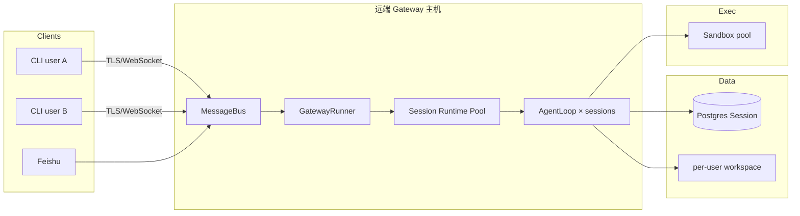

# 部署方案对比：远端 Agent、多实例、多用户并发

> **范围**: Tier 1 Agent 框架 + 本仓库 **档位 B Harness 蓝图**  
> **关联**: [02-harness-blueprint.md](./02-harness-blueprint.md) §8.5、§11 · [06-memory.md](./06-memory.md) §Session 多实例 · [09-channels.md](./09-channels.md)

---

## 目录

1. [三个问题不要混谈](#1-三个问题不要混谈)
2. [部署形态分类（D14）](#2-部署形态分类-d14)
3. [Tier 1 总览矩阵](#3-tier-1-总览矩阵)
4. [远端部署 Agent（控制面在哪）](#4-远端部署-agent控制面在哪)
5. [多实例 / 水平扩展](#5-多实例--水平扩展)
6. [多用户并发模型](#6-多用户并发模型)
7. [Codex 式远端多用户 CLI（参考模型）](#7-codex-式远端多用户-cli参考模型)
8. [档位 B Harness 目标能力（蓝图）](#8-档位-b-harness-目标能力蓝图)
9. [选型与检查清单](#9-选型与检查清单)

---

## 1. 三个问题不要混谈

| 问题 | 问的是什么 | 典型误判 |
|------|------------|----------|
| **远端部署 Agent** | Agent **进程**跑在服务器/Cloud，用户只连 Channel | 「装了 CLI = 已部署」；本地 `while` 脚本 ≠ 服务 |
| **多实例部署** | 多个 **副本/Pod** 扛流量，Session 不丢 | 多副本 + 本地 SQLite → **失忆** |
| **多用户并发** | 多用户/多 session **同时**跑 loop | 单进程多线程 ≠ 产品级隔离；需 session 键 + 并发语义 |

三者关系：

```text
远端部署     →  Agent + Gateway 在机房/Cloud
多实例       →  多个 Gateway/Worker 副本 + 外置 Session
多用户并发   →  每 user/session 隔离；同 session 串行或 steer
```

---

## 2. 部署形态分类（D14）

在 [01-overview.md](./01-overview.md) D12「部署形态」之上，细化为：

| 代码 | 形态 | 说明 |
|------|------|------|
| **P0** | 库 / 脚本 | 单次 `agent.run()`，无服务 |
| **P1** | 本地 CLI/TUI | 单用户终端，进程内 loop |
| **P2** | 本地 Gateway | Bus + 多渠道，仍单机 |
| **P3** | **远端 Gateway** | Gateway 监听 0.0.0.0 / TLS；IM/Web/**远端 CLI** 接入 |
| **P4** | 托管 Agent API | LangGraph Platform、Browser Use Cloud Tasks、Letta Server |
| **P5** | 控制面 + 执行面分离 | OpenHands app_server ↔ agent-server；deer-flow K8s 沙箱 |

---

## 3. Tier 1 总览矩阵

| 项目 | 远端部署 Agent | 多实例（水平扩展） | 多用户并发 | 默认 Session 外置 | 典型生产拓扑 |
|------|----------------|------------------|------------|-------------------|--------------|
| **deer-flow** | ✅ Gateway + 可选 K8s 沙箱 | ✅ **Postgres** checkpointer；多 `GATEWAY_WORKERS` | ✅ IM/Web 多租户；同 thread **reject** | ⚠️ SQLite → 必须 PG | Nginx → Gateway ×N → PG + 远程沙箱 |
| **OpenHarness / ohmo** | ✅ **`ohmo gateway`** 常驻；Channel 远端入站 | ⚠️ Session 文件/后端需自建共享 | ✅ **`OhmoSessionRuntimePool`** 每 session 一 runtime；跨 session 并行 | ⚠️ 默认 JSON/文件 | 单机 Gateway + 飞书 WS；或外置 Session DB |
| **Hermes** | ✅ `hermes gateway` daemon | 🔒 SQLite SessionDB；多副本需分 profile/卷 | ✅ 多 channel；`busy_input_mode` | 🔒 `~/.hermes/state.db` | 每用户独立 home 或单 gateway |
| **nanobot** | ✅ Gateway 可部署服务器 | ⚠️ `sessions/*.jsonl` 需 **共享卷** | ✅ **同 session 锁串行，跨 session 并行** | ⚠️ workspace 卷 | 单 Gateway VM + 共享 workspace |
| **OpenHands** | ✅ Agent Server HTTP（远端沙箱） | ⚠️ DIY → ✅ Enterprise PG + lease | ✅ 每 **conversation** 一沙箱/会话 | FileStore 事件目录 | app_server + 远程 agent-server 池 |
| **deepagents** | ⚠️ `langgraph deploy` / 自建 API | ⚠️ **Postgres checkpointer** | ⚠️ 应用层 `thread_id` 路由 | SQLite 默认 | LangGraph Cloud 或自建 API |
| **deepagents-code** | ❌ 桌面 TUI | 🔒 单用户 | 🔒 单会话 TUI | 同 SDK SQLite | 非多租户服务 |
| **AgentScope v2** | ✅ `create_app` 托管服务 | ✅ **Redis Storage + RedisMessageBus** | ✅ `user_id` + `session_id` | 嵌入模式无服务 | Redis 集群 + API 副本 |
| **OpenAI Agents** | ⚠️ 自建 Runner 服务 | ⚠️ **RedisSession** / SQL | ⚠️ 应用 mutex | 默认内存 SQLite | 无状态 API + Redis |
| **agent-framework (MAF)** | ⚠️ Hosting 示例 | ⚠️ **RedisHistoryProvider** | ⚠️ SessionStore | InMemory 默认 | ASP.NET / Python Hosting + Redis |
| **Letta** | ✅ Letta Server / Cloud | ✅ 服务端 DB | ✅ 多 `agent_id`/user | 服务端 Postgres | 官方云或自托管 DB |
| **browser-use** | ✅ **`@sandbox`** + **Cloud Tasks API** | ✅ Cloud 弹性 Browser/Agent | ✅ Cloud Session（计费按 Task） | Cloud 侧 | `BROWSER_USE_API_KEY` + API v2 |
| **Claude Agent SDK** | ❌ 委托 **Claude Code 进程** | — | — | CLI 会话 | 非自托管多副本 |
| **Codex（产品）** | ✅ **chatgpt.com Codex API** | ✅ OpenAI 侧扩展 | ✅ 订阅账号 + 多会话 | 厂商云 | 本地 CLI/IDE → 远端推理 |
| **crewAI / MetaGPT** | ⚠️ 批任务/脚本 | — | 批并行非交互多用户 | 内存 | CI/批处理 |
| **LangGraph**【库】 | ⚠️ 调用方部署 | ⚠️ checkpointer 选型 | ⚠️ Platform `multitask_strategy` | InMemory | 与 deepagents/deer-flow 同 |

图例：**✅** 产品/文档明确 · **⚠️** 需 DIY 外置存储/路由 · **🔒** 单实例/单用户默认可用 · **—** 非该场景

---

## 4. 远端部署 Agent（控制面在哪）

### 4.1 什么叫「Agent 在远端」

满足至少一条：

1. **Gateway / Agent Server** 在服务器 7×24，客户端只有 Channel（飞书、Web、**远端 CLI**）。
2. **执行环境在远端**：Docker/K8s 沙箱、Browser Use Cloud Browser、`@sandbox` 远程进程。
3. **推理在远端**：Codex/Claude Subscription API（控制逻辑仍可能在本地 CLI）。

### 4.2 代表实现

| 项目 | 远端入口 | Agent 跑在哪 |
|------|----------|--------------|
| deer-flow | `app/` Gateway HTTP + IM Webhook/WS | 同进程或 worker + 远程沙箱 cwd |
| ohmo | `oh gateway start` | `OhmoSessionRuntimePool` 内 `QueryEngine` |
| OpenHands | `agent-server` URL | 容器内 Agent + 可选远程 browser |
| browser-use | `POST /api/v2/tasks` 或 `@sandbox` | Cloud 同区 Browser+Agent |
| deepagents | `langgraph deploy` | Platform 托管 graph |

### 4.3 不是远端部署

- 开发者笔记本上 `uv run agent.py`（P0）
- `harness chat` **直连 Loop、不经 Bus**（仅 P1 调试）
- Claude Code / 本地 Codex CLI **仅本地进程**（推理远端但无自建 Gateway）

---

## 5. 多实例 / 水平扩展

### 5.1 必答：Session 存在哪

详见 [06-memory.md](./06-memory.md) §2–3。多副本 **必须** 满足：

```text
同一 session_id / thread_id 的任意请求 → 读到同一份 messages/checkpoint
```

| 模式 | 代表 | 要点 |
|------|------|------|
| **A LangGraph checkpoint** | deepagents, deer-flow | Postgres（推荐）/ Redis |
| **B Redis Session** | AgentScope app, OpenAI `RedisSession`, MAF Redis History | `session_id` 路由一致 |
| **C 厂商 Session** | OpenAI Conversations API | 状态在 OpenAI |
| **D 每会话一沙箱+卷** | OpenHands | `conversation_id` → 专属 volume |
| **E 共享文件卷** | nanobot, Hermes（有限） | NFS/EBS 挂 `sessions/` |

### 5.2 Gateway 多 Worker

| 项目 | 做法 |
|------|------|
| deer-flow | `GATEWAY_WORKERS>1` **禁止 SQLite**；Postgres + 可选 Redis Stream |
| ohmo | 单进程内多 session 并行；多副本需外置 Session + 粘性路由或共享 DB |
| AgentScope | Redis MessageBus 跨进程 |

### 5.3 反模式

- 多 Pod 各用本地 SQLite / 各写本地 `sessions/*.jsonl`
- 无 `conversation lease` 时多 agent-server 抢同一 conversation 目录

---

## 6. 多用户并发模型

### 6.1 两层并发

| 层 | 含义 | 机制示例 |
|----|------|----------|
| **L0 跨用户 / 跨 session** | 张三和李四同时聊 | 不同 `session_key` → 不同 runtime/checkpoint |
| **L1 同 session 第二条消息** | 上一条还在 tool 链又来一句 | queue / steer / interrupt / reject |

L0 全文：[03-runtime-loop-queue.md](./03-runtime-loop-queue.md)、[14-loop-interjection.md](./14-loop-interjection.md)

### 6.2 产品级并发对照

| 项目 | L0（多 session） | L1（同 session） | 隔离键 |
|------|------------------|------------------|--------|
| nanobot | ✅ `asyncio` 跨 session | pending **inject** | `channel:chat_id` + Lock |
| deer-flow | ✅ | **reject** 已有 run | `thread_id` / IM thread |
| Hermes | ✅ | **steer/queue** 可配 | `session_key` |
| ohmo | ✅ RuntimePool | 继承 OpenHarness interrupt | `channel:chat_id` |
| OpenHands | ✅ 多 conversation | PendingMessage（就绪前） | `conversation_id` |

### 6.3 「多用户」还需什么

- **认证**：Gateway `user_id`、API Key、Feishu `sender_id`
- **配额**：`per_user_max_active_sessions`、rate limit
- **数据隔离**：`~/work/{user_id}/` 或 per-user sandbox（deer-flow / 档位 B）

---

## 7. Codex 式远端多用户 CLI（参考模型）

用户提到的 **「像 Codex 那样」** 通常包含：

| 能力 | Codex / ohmo 启示 | 不是 |
|------|-------------------|------|
| 本地轻 CLI，**推理/Agent 在远端** | OpenHarness `CodexApiClient` → chatgpt.com；ohmo Gateway 跑服务器 | 每人笔记本跑完整 Agent+沙箱 |
| **多开发者同时连** | 每人独立 session；Gateway 上 **RuntimePool** | 单终端 `harness chat` 独占进程 |
| 订阅/统一鉴权 | Codex `auth.json`；ohmo `provider_profile=codex` | 每人散落 API Key 在脚本里 |
| 长会话可恢复 | Session 持久化 + 可选 compact | 纯内存 REPL |

### 7.1 架构草图（档位 B 目标）



### 7.2 与「本地调试 CLI」区分

| 命令级 | 模式 | 用途 |
|--------|------|------|
| `harness chat --local` | P1 直连 Loop | 开发调试，**不经 Bus** |
| `harness cli --gateway $URL` | P3 远端客户端 | 多用户连同一 Gateway |
| `harness gateway start` | P2/P3 服务端 | 监听 + 托管所有 Channel |

---

## 8. 档位 B Harness 目标能力（蓝图）

[02-harness-blueprint.md](./02-harness-blueprint.md) 档位 B **明确支持**：

1. **远端 Gateway**：`gateway.listen` 绑定 `0.0.0.0` + TLS；IM/Web/**CLI Server** 统一入 Bus。
2. **多实例**：`harness.yaml` → Postgres SessionDB；禁止多 worker 用纯 SQLite。
3. **多用户并发 CLI（Codex 式）**：
   - `channels.cli.mode: server` — Gateway 接受多路 CLI 连接；
   - `session_key: cli:{user_id}:{client_id}`；
   - **同 session 串行、跨 session 并行**（对齐 nanobot）；
   - `per_user_max_active_sessions` + `busy_input_mode: steer`。
4. **远端沙箱**：`sandbox.remote` 或 partner backend（Daytona 等），Agent 逻辑仍在上层 Loop。

配置样例见蓝图 `gateway.yaml` §4 与 §11 扩展拓扑。

---

## 9. 选型与检查清单

### 9.1 决策树（部署向）

```text
要远端部署 + 多用户同时使用？
  ├─ 要 IM + Web + CLI 统一 → deer-flow 或 档位 B Harness（抄 deer-flow Gateway + nanobot Bus）
  ├─ 要 Claude/Codex 订阅桥接 → OpenHarness ohmo（Gateway + CodexApiClient）
  ├─ 要浏览器自动化 Cloud → browser-use Cloud / @sandbox
  ├─ 要企业沙箱 + 审计事件流 → OpenHands Enterprise
  └─ 只要库嵌入自有 API → deepagents + Postgres + 自建 Gateway 薄层

要多实例 K8s？
  └─ 先答：Session 用 Postgres/Redis？沙箱是池化还是 per-session？
```

### 9.2 上线前检查

| # | 检查项 |
|---|--------|
| 1 | Session/checkpoint **不在** Pod 本地盘（除非 sticky + 接受扩缩容风险） |
| 2 | `session_key` / `thread_id` 含 **user** 维度，防串会话 |
| 3 | Gateway 多副本时：共享 Session 或 **粘性路由** |
| 4 | 同 session 并发语义已选（steer/queue/reject）且可配置 |
| 5 | 远端 CLI 走 **认证**（token/mTLS），非裸奔 8787 |
| 6 | 沙箱 cwd 按 `user_id` 隔离 |
| 7 | 观测：per-session trace id 贯穿 Gateway → Loop → Sandbox |

---

## 相关文档

| 文档 | 内容 |
|------|------|
| [02-harness-blueprint.md](./02-harness-blueprint.md) | 档位 B 部署拓扑、Gateway、Codex 式 CLI 配置 |
| [06-memory.md](./06-memory.md) | Session 存储与多实例总表 |
| [09-channels.md](./09-channels.md) | Channel/Gateway 五套路 |
| [10-openhands.md](./10-openhands.md) | app_server / agent-server 分离 |
| [browser-use/docs](../browser-use/docs/README.md) | `@sandbox`、Cloud Tasks |

---

**维护**: 框架发布新的 Gateway/托管能力时更新 §3 矩阵；蓝图 gateway schema 变更时同步 §8。
