# Session · Message · 投影模型对比

> **体系总览（五平面 S/W/L/T/U + 六族范式）**：见 **[21-session-message-architecture.md](./21-session-message-architecture.md)**。  
> **本文**补 JSON/JSONL 形态、Canonical/Envelope 术语、Tier 1 真源对照表。  
> **关联**：[06-memory.md](./06-memory.md) §Session · [03-runtime-loop-queue.md](./03-runtime-loop-queue.md) · [11-product-deep-dives.md](./11-product-deep-dives.md) · [17-deployment.md](./17-deployment.md)

> **最后更新**：2026-08-12

---

## 1. 为什么需要单独一层对比

多数框架文档混谈三件事，选型时容易串台：

| 概念 | 问的是什么 | 典型载体 |
|------|------------|----------|
| **Canonical（权威存储）** | 崩溃后可恢复、可审计的「真源」 | JSONL、SQLite 行、Event JSON、checkpoint |
| **Projection（投影 / View）** | 从真源 **派生** 给 LLM 的上下文 | `get_history()`、`View.from_events()`、middleware 删头 |
| **Envelope（通道信封）** | IM/Gateway 与 Loop 之间的 **非 LLM** 消息 | `InboundMessage`、`OutboundMessage` |
| **Mirror（外部镜像）** | 可选；与真源 **不等价** | Claude `SessionStore`、Webhook、TUI 事件流 |

**易错点**：

- OpenHands 的 **EventLog ≠ LLM messages**；LLM 吃的是 `View` 投影结果。  
- Claude Agent SDK 的 **SessionStore ≠ CLI session**；Python 层只是 transcript mirror。  
- nanobot **Session JSONL ≠ memory/history.jsonl**；后者是 Consolidator 归档轨。  
- LangGraph **checkpoint 里的 messages ≠ 用户看到的 UI 事件**（若上层另有 Gateway）。

---

## 2. 四种消息架构范式

```mermaid
flowchart TB
    subgraph P1["P1 Message List（列表真源）"]
        ML[session.messages / SessionDB rows]
        ML --> PR1[get_history / slice / compact]
        PR1 --> LLM1[LLM API messages]
    end

    subgraph P2["P2 Event Sourcing（事件真源）"]
        EV[event-NNNNN.json append-only]
        EV --> PR2[View + Condenser]
        PR2 --> LLM2[Message list for model]
    end

    subgraph P3["P3 Graph Checkpoint（图状态真源）"]
        CK[checkpointer blob]
        CK --> PR3[middleware 改 state.messages]
        PR3 --> LLM3[model call]
    end

    subgraph P4["P4 Bus Envelope（总线信封）"]
        BUS[InboundMessage / OutboundMessage]
        BUS --> LOOP[AgentLoop]
        LOOP --> CAN[写入 P1/P2/P3 之一]
    end
```



| 范式 | 代表 | 真源形态 | 投影发生点 | 审计友好度 |
|------|------|----------|------------|------------|
| **P1 列表** | nanobot, Hermes, OpenHarness, OpenManus | `list[dict]` 或 DB 表 | ContextBuilder / Compressor / `auto_compact` | 中（列表可被压缩改写） |
| **P2 事件** | OpenHands SDK | 每 step 一个 JSON 文件 | `View.from_events()` + Condenser | **高**（append-only） |
| **P3 图 checkpoint** | deepagents, deer-flow, LangGraph, TradingAgents | checkpointer 序列化 state | SummarizationMiddleware 等 | 中（依赖 checkpointer 实现） |
| **P4 总线信封** | nanobot, Hermes Gateway, deer-flow Gateway | Queue 上的 channel 消息 | Loop 入口 **转写** 进 P1/P3 | 低（信封通常不持久化） |

**组合常见**：P4 → P1（nanobot）、P4 → P3（deer-flow IM）、P2 独立（OpenHands 无 nanobot 式 Bus）。

---

## 3. 统一投影管线（抽象）

```text
[Envelope] 可选 ──► [Canonical Store] ──► [Projection Layer] ──► [LLM Request]
                              │                      │
                              │                      ├── token 预算 slice
                              │                      ├── 压缩 / Condenser
                              │                      ├── 去 tool orphan
                              │                      ├── 注入 summary / memory
                              │                      └── 权限 / Plan 模式过滤
                              │
                              └──► [Mirror] 可选（SessionStore / Webhook / JSONL export）
```

| 投影操作 | 目的 | 典型实现 |
|----------|------|----------|
| **游标切片** | 已归档部分不再 replay | nanobot `last_consolidated` |
| **尾窗保留** | 只保留最近 N 条 / N token | `get_history(max_messages=…)` |
| **合法起点** | 避免 orphan tool result | `find_legal_message_start()` |
| **摘要替换** | 旧对话变伪 user 消息 | AgentScope `summary`、S2 middleware |
| **事件墓碑** | 压缩不删历史文件 | OpenHands Condensation **事件** |
| **再注入** | 压缩后补关键块 | Hermes todo `format_for_injection()` |
| **模式过滤** | Plan 只读去掉写工具 schema | OpenHarness `PermissionMode.PLAN` |

---

## 4. Tier 1 — Session 模块与真源对照

| 项目 | 范式 | Canonical | 会话键 | Session 模块 / 包 | 投影模块 |
|------|------|-----------|--------|-------------------|----------|
| **nanobot** | P1 + P4 | `{workspace}/sessions/{safe_key}.jsonl` | `channel:chat_id` | `nanobot/session/manager.py` `SessionManager` | `ContextBuilder` + `Consolidator` + `get_history()` |
| **deer-flow** | P3 + P4 | LangGraph checkpoint + `threads/{id}/` 目录 | `thread_id`；IM→`channel:chat_id` | `app/channels` + LangGraph thread | `SummarizationMiddleware`、`DurableContextMiddleware` |
| **deepagents** | P3 | SQLite `sessions.db`（code TUI）/ checkpointer | `thread_id` | LangGraph + middleware | `SummarizationMiddleware.wrap_model_call` |
| **OpenHarness** | P1 | session 快照 JSON（依部署） | `session_id` | `openharness/engine/query.py` session state | `auto_compact_if_needed`、permission 过滤 |
| **Hermes** | P1 + P4 | SQLite `state.db` SessionDB | `session_id` / `session_key` | `gateway/session.py` `SessionStore` + SessionDB | `ContextCompressor` + todo re-inject |
| **OpenHands** | P2 | `events/event-*.json` + `base_state.json` | `conversation_id` | SDK `EventLog` / `EventStore` | `View` + `LLMSummarizingCondenser` |
| **AgentScope v2** | P1（嵌入）/ Redis（托管） | `AgentState.context` JSON | `user_id` + `session_id` | `app/` RedisStorage；嵌入无统一服务 | LTM Middleware 删头 + `summary` 伪消息 |
| **OpenAI Agents** | P1 | `Session` protocol items | `session_id` | `sessions/` 多种 backend | `OpenAIResponsesCompactionSession` |
| **Claude Agent SDK** | CLI 内 + Mirror | CLI 进程内；Python `SessionStore` | CLI `session_id` | `claude_agent_sdk` types + transport | CLI 内部；Python `message_parser` |
| **Letta** | P1 | Server DB messages + blocks | `agent_id` + user | Letta server | compaction on blocks |
| **AutoGen** | 流式 P1 | 内存 `BaseChatMessage` 列表 | team/run | AgentChat runtime | 应用层 |
| **crewAI** | 弱 Session | 内存 Task context | crew run | Flow 可选 | 常清空 Executor messages |
| **nanobot** | — | 见上 | — | `nanobot/bus/events.py` Envelope | — |

---

## 5. JSON / JSONL 记录形态对比

### 5.1 nanobot — Session JSONL（P1 参考实现）

**文件**：`{workspace}/sessions/{safe_key}.jsonl`（每 session 一行一条 JSON）

**Session 内存结构**（`Session` dataclass）：

```text
key: str
messages: list[dict]           # role, content, timestamp, 扩展字段
last_consolidated: int         # 投影游标：此前消息已进 history.jsonl
metadata: dict                 # _last_summary, title, goal_state, ...
provider_state: ProviderConversationState | None
```

**单条 message dict**（LLM replay 源）：

```json
{
  "role": "user",
  "content": "...",
  "timestamp": "2026-08-12T12:00:00",
  "_channel_delivery": false
}
```

**投影**：`messages[last_consolidated:]` → 尾窗 + token 预算 → 去 orphan tool → 可选去掉 runtime 字段。

**与 history.jsonl 分离**：Consolidator 归档行格式不同（含 `cursor`、`content` 摘要），见 [06-memory.md](./06-memory.md) §6.2。

### 5.2 Hermes — SessionDB 行 + 可选 JSON 快照

| 层 | 形态 |
|----|------|
| **messages 表** | SQLite 行：turn、role、content、tool_calls JSON、时间戳 |
| **sessions 表** | `session_id`、`session_key`、metadata、压缩状态 |
| **Gateway** | `SessionStore` 协议：`load/save/list`；与 SessionDB 协作 |
| **投影** | 加载全量 → `ContextCompressor` 超阈值替换 prefix → todo 再注入 |

**session_key vs session_id**：压缩 lineage 后 `session_id` 可能是 live 子会话，`session_key` 为 durable 路由键（TUI/Gateway 中断用）。

### 5.3 deer-flow — LangGraph ThreadState + 用户目录

| 存储 | 内容 |
|------|------|
| **checkpoint** | `ThreadState.messages`（LangChain `BaseMessage` 序列化） |
| **`.deer-flow/users/{user}/memory.json`** | 用户 facts（**非** message 列表） |
| **`threads/{thread_id}/user-data/`** | 沙箱工作区 artifact |

**投影**：`SummarizationMiddleware` 改 checkpoint 内 messages；`memory.json` 每 run **独立注入** system `<memory>`。

### 5.4 OpenHands — Event JSON（P2）

**路径**：`conversations_path/{conversation_id}/events/event-{seq:05d}-{uuid}.json`

**特点**：

- 每个 **step** append 一个事件文件；**不**直接改旧文件。  
- LLM 输入 = `View.from_events(events)` → `Message` 列表。  
- 压缩 = 写入 **Condensation** 类型事件（墓碑），非删文件。  
- `MEMORY.md` **不进** EventLog；`load_memory()` 单独读文件。

### 5.5 AgentScope — AgentState JSON

```text
AgentState
├── context: list[Msg]      # 工作记忆（可含 tool 消息）
├── summary: str | None     # 压缩后伪 User 消息源
├── name, memory, ...
```

托管 `create_app`：`RedisStorage` key = f(user_id, session_id)；`model_dump_json()` 往返。

### 5.6 OpenAI Agents — Session items

`TResponseInputItem[]`：与 Responses API 对齐的 item 数组；backend 可为内存 SQLite、`RedisSession`、SQLAlchemy、`OpenAIConversationsSession`。

### 5.7 Claude Agent SDK — 双层 Session

| 层 | 职责 |
|----|------|
| **CLI session** | `--resume` / `--session-id` / `--fork-session`；真源在 Claude Code 进程 |
| **SessionStore mirror** | `append` transcript；`materialize_resume_session` 写临时配置目录 |
| **Python Message** | `UserMessage` / `AssistantMessage` / `ResultMessage` 等 — **CLI stdout JSONL 的解析结果**，非存储模型 |

### 5.8 OpenHarness — session state + tool_metadata

- **messages**：QueryEngine 循环内 list（provider 格式）。  
- **tool_metadata**：`invoked_skills`、artifact 指针等 **旁路元数据**（不进 LLM message 列表）。  
- **投影**：`auto_compact_if_needed` + `PermissionMode` 工具过滤。

---

## 6. Envelope（通道消息）对比

与 Canonical **正交**：描述「谁从哪来、发往哪」，不必然进入 LLM history。

| 项目 | 入站类型 | 出站类型 | 转写点 |
|------|----------|----------|--------|
| **nanobot** | `InboundMessage`（channel, chat_id, content, media…） | `OutboundMessage` / `SessionUpdatedEvent` | `AgentLoop._handle_inbound` → `Session.add_message` |
| **Hermes** | Gateway adapter 回调 dict | adapter `send()` | `GatewayRunner` → `AIAgent` |
| **deer-flow** | Channel → Gateway HTTP | Gateway → IM adapter | 映射 `thread_id` |
| **OpenHarness ohmo** | Channel 插件 | 同左 | `OhmoSessionRuntimePool` |
| **OpenHands** | app_server webhook / API | Server events | 控制面 vs SDK 执行面分离 |

**nanobot `MessageBus`**（45 行）：`inbound` / `outbound` 两个 `asyncio.Queue`；**session 锁在 AgentLoop**，不在 Bus。

---

## 7. Mirror / 导出对比

| 项目 | Mirror 机制 | 与 Canonical 关系 |
|------|-------------|-------------------|
| **Claude SDK** | `SessionStore.append/load` | 可选；resume 前 materialize |
| **OpenHands app_server** | SQL 元数据 + event 目录镜像 S3 | 控制面副本 |
| **Hermes** | 会话导出 / FTS 搜索 | SessionDB 为真源 |
| **deer-flow** | Gateway 事件流（Redis Stream 可选） | checkpoint 为真源 |
| **deepagents-code** | TUI 渲染层 | checkpoint 为真源 |

---

## 8. 模块边界对照（谁管什么）

| 职责 | nanobot | Hermes | deer-flow | OpenHands | OpenHarness |
|------|---------|--------|-----------|-----------|-------------|
| 持久化读写 | `SessionManager` | SessionDB + `SessionStore` | checkpointer + thread 目录 | `EventLog` + FileStore | session snapshot |
| LLM 投影 | `ContextBuilder` | `ContextCompressor` | middleware 链 | `View` + Condenser | `query.py` compact |
| 通道信封 | `bus/events.py` | Gateway adapters | `app/channels` | app_server API | `channels/` |
| 长期记忆轨 | `MemoryStore` + Dream | memories/*.md + provider | `memory.json` | `MEMORY.md` | `MEMORY.md` / 检索 |
| 归档轨（非 session） | `history.jsonl` | — | — | Condensation events | — |

---

## 9. 多实例与投影（简表）

| 风险 | 原因 | 缓解 |
|------|------|------|
| 投影游标错乱 | `last_consolidated` 与 JSONL 不同步 | 原子写 + filelock（nanobot） |
| 双写失忆 | 多 Pod 本地 checkpoint | Postgres / Redis Session（见 [17-deployment.md](./17-deployment.md)） |
| EventLog 损坏 | NFS + flock | Lease + 单写者（OpenHands） |
| Mirror 当真源 | 只用 SessionStore resume | 明确 CLI session 为真源（Claude） |

---

## 10. 选型提示

| 需求 | 倾向范式 | 代表 |
|------|----------|------|
| 审计 / 回放每步 | P2 Event | OpenHands |
| 极简个人 Gateway | P1 JSONL + P4 Bus | nanobot |
| LangGraph 生态 | P3 checkpoint | deer-flow, deepagents |
| 托管多副本 API | Redis Session / Postgres | AgentScope app, OpenAI Agents |
| 非自托管 Claude 能力 | CLI + Mirror | Claude Agent SDK |
| 最少模块 | P1 内存列表 | OpenManus, smolagents |

---

## 11. 深潜索引

| 主题 | 文档 |
|------|------|
| nanobot Session + Bus | [11-product-deep-dives.md](./11-product-deep-dives.md) · `nanobot/docs/NANOBOT_ARCHITECTURE.md` |
| Claude Message / SessionStore | [11-product-deep-dives.md](./11-product-deep-dives.md) Claude 章 |
| OpenHands EventLog | [10-openhands.md](./10-openhands.md) · [06-memory.md](./06-memory.md) OpenHands 深潜 |
| Session 存储后端矩阵 | [06-memory.md](./06-memory.md) §Session 存储 |
| 运行中第二条消息 | [14-loop-interjection.md](./14-loop-interjection.md) |
| 压缩与投影 | [07-compression.md](./07-compression.md) |

**维护者**: OpenHarness framework-comparison
