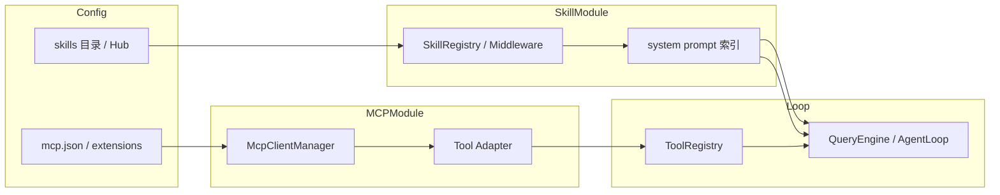

# Skill · MCP 模块设计对比

> **与 [08-mcp.md](./08-mcp.md) 的关系**：08 侧重 **MCP 协议、传输、Deferred、四框架封装链路**（3000+ 行深潜）。  
> **本文**侧重 **模块边界**：Skill / MCP 在各框架里 **包在哪、谁发现、谁加载、谁注册进 ToolRegistry、与 Loop 如何衔接**。  
> **Skill 引用与脚本**：见 [01-overview.md](./01-overview.md) §4b（Hermes `skill_view`、deer-flow `read_file` 等）。

> **最后更新**：2026-08-12

---

## 1. 模块设计要回答的问题

| 问题 | Skill 模块 | MCP 模块 |
|------|------------|----------|
| **配置从哪来** | 目录扫描 / Hub API / 插件 manifest | `mcp.json` / `extensions_config.json` / settings |
| **发现时机** | 启动 / 每 run / 懒加载 | 启动 `connect_all` / mtime 热更新 |
| **暴露给模型的形态** | 索引在 system；全文经 tool | `tools/list` → JSON Schema |
| **与内置工具合并点** | ToolRegistry 同一注册表 | 同名前缀避免冲突 |
| **生命周期** | 安装 / 启用 / Curator 进化 | 连接 / 重连 / 关闭 |
| **谁持 ClientSession** | 通常无（Skill 是文档） | Manager 或 LangChain 适配器 |

---

## 2. Skill 模块 — Tier 1 总表

| 项目 | 标准 | 配置 / 目录 | 注册表 | 加载策略 | 暴露工具 / 命令 | 生命周期 |
|------|------|-------------|--------|----------|-----------------|----------|
| **OpenHarness** | agentskills.io + 自有 | bundled → user → project → plugin；`.openharness/skills`、`.claude/skills` | `SkillRegistry` | **索引在 prompt**；全文 `skill` tool | `skill(name)`、`/skill` slash | 插件 enable；无自动进化 |
| **deepagents** | agentskills.io | `sources` 路径列表；backend 虚拟路径 | middleware state `skills_metadata` | **渐进**：system 列表 + `read_file` | 无专用 skill tool；`read_file` | 每 middleware 层覆盖 |
| **deer-flow** | SKILL.md + sandbox 映射 | `skills/public` + `custom`；`/mnt/skills/` | prompt `<skill_system>` | 列表在 system；`read_file` 读全文 | Gateway `POST /api/skills/install` | custom + `.history` |
| **Hermes** | agentskills.io + 扩展 | hub + bundled + optional-skills | skills 索引在 system | **三层披露** `skill_view` | `skill_view`、`/skill`、terminal 跑脚本 | **skill_manage** + Curator 自演进 |
| **AgentScope** | 应用自定义 | 应用目录 | `Toolkit` / Skill 对象 | Skill + `SkillViewer` | 应用定义 | 应用层 |
| **OpenHands** | 项目 skills 目录 | preset + 插件 | Tool preset | 读 SKILL 进 context | planning preset 工具集 | 插件安装 |
| **nanobot** | 部分 SKILL | workspace `skills/` | `ContextBuilder` 注入 | system 段 + 文件 | Dream 可写 skills | skill-creator 路径 |
| **Claude Code / SDK** | agentskills.io | `.claude/skills` | CLI 内 | frontmatter 索引 → 按需加载 | `${CLAUDE_SKILL_DIR}`、`!`cmd | CLI 管理 |
| **crewAI** | 非 SKILL 语义 | Agent backstory | Agent.tools | 无统一 Skill 层 | — | — |
| **OpenManus** | 视版本 | — | — | — | — | — |

---

## 3. Skill 模块内部结构（包级对比）

### 3.1 OpenHarness

```text
openharness/skills/
  loader.py      # load_skill_registry()：bundled → user → project → plugin
  registry.py    # SkillRegistry：name 覆盖规则（后注册优先）
  types.py       # SkillDefinition
  bundled.py     # 内置技能
openharness/tools/skill_tool.py   # SkillTool → registry.get(name)
openharness/prompts/context.py    # system 索引段
openharness/plugins/loader.py     # 插件附带 skills
```

**与 Loop 衔接**：`runtime.py` 构建时 `load_skill_registry` → `build_runtime_system_prompt` 注入索引 → `QueryEngine` 执行 `skill` tool 时 `invoked_skills` 写入 `tool_metadata`。

### 3.2 deepagents SDK

```text
deepagents/middleware/skills.py   # SkillsMiddleware
  - backend API 读 SKILL.md（无直接 fs）
  - sources 顺序覆盖：built-in → user → project
  - modify_request：注入 skills 列表 + read_file 指引
```

**与 Loop 衔接**：middleware 链一环；**SubAgent 可独立 sources**；无独立 SkillRegistry 服务。

### 3.3 deer-flow

```text
skills/public|custom/**/SKILL.md
packages/harness/...          # prompt 模板 <skill_system>
app/gateway/...               # skills install API
Sandbox: /mnt/skills/ → 宿主机 skills/
```

**与 Loop 衔接**：`apply_prompt_template` 每 run；子 Agent **全文注入** SKILL（与主 Agent 渐进不同）；压缩时 skill path `read_file` **rescue**。

### 3.4 Hermes（最完整 Skill 产品模块）

```text
agent/prompt_builder.py       # build_skills_system_prompt()
tools/skills_tool.py          # skill_view + linked_files
agent/skill_preprocessing.py  # ${HERMES_SKILL_DIR}、!`cmd`
gateway/...                   # skill 同步、slash /skill
plugins/memory/...            # 与 skill 独立的 memory provider
```

**与 Loop 衔接**：system 强制「匹配则必须 skill_view」；引用经 **二次 tool 调用**；脚本用 `terminal` 绝对路径。

### 3.5 渐进加载档位对比

| 档位 | 注入内容 | Token 成本 | 代表 |
|------|----------|------------|------|
| **L0 仅 frontmatter** | name + description | ~30–100 tokens/skill | Claude Code、Hermes 索引 |
| **L1 system 索引 + 路径** | + 容器路径 / skill_dir | 中 | deepagents、deer-flow、OpenHarness |
| **L2 专用 read tool** | 模型调 tool 拉全文 | 按需 | OpenHarness `skill`、Hermes `skill_view` |
| **L3 子 Agent 全文** | 整个 SKILL.md 进 system | 高 | deer-flow subagent |
| **L4 引用二次加载** | linked_files 列表 + file_path | 按需 | Hermes |
| **L5 自演进** | Curator 改 SKILL / 新建 | 运维成本 | Hermes、GenericAgent |

---

## 4. MCP 模块 — Tier 1 总表

| 项目 | Manager / 客户端 | 配置源 | 工具名前缀 | 注册合并点 | Resources | 热更新 | 模块路径（真源） |
|------|------------------|--------|------------|------------|-----------|--------|------------------|
| **OpenHarness** | `McpClientManager` | `settings.mcp_servers` + 插件 `.mcp.json` | `mcp__{server}__{tool}` | `McpToolAdapter` → `ToolRegistry` | `list_mcp_resources` tool | settings + 插件 manifest | `openharness/mcp/client.py` |
| **deer-flow** | `MultiServerMCPClient` | `extensions_config.json` | `{server}_{tool}` | `get_available_tools()` → ToolNode | tool 返回内解析 | **mtime** + `get_cached_mcp_tools` | `deerflow/mcp/` |
| **deepagents** | langchain-mcp-adapters | 应用层 | 适配器 prefix | LangChain tools | 不暴露 | 应用层 | 无内置包 |
| **AgentScope v2** | `MCPClient` | 构造参数 | `mcp__{name}__{tool}` | `Toolkit.register` | 未默认暴露 | 构造时 connect | `agentscope/mcp/` |
| **nanobot** | 官方 `mcp` SDK | 配置文件 | `mcp_{server}_{tool}` | `ToolRegistry` | **每 resource 伪 tool** | 启动 connect | `nanobot/mcp/` |
| **Hermes** | 宿主 MCP 客户端 | gateway 配置 | 依服务器前缀 | toolsets 注册 | 依版本 | 运行时集成 | `hermes-agent` 插件 |
| **smolagents** | `MCPAdapt` | `from_mcp` | 适配器 | Agent tools | — | — | `smolagents` 可选依赖 |
| **OpenHands** | FastMCP / 插件 | preset | preset 工具 | Tool 类 | — | — | SDK tools |

> 协议级对比、DeferredToolFilter、OAuth：见 [08-mcp.md](./08-mcp.md)。

---

## 5. MCP 模块内部结构（包级对比）

### 5.1 OpenHarness — 一等模块

```text
openharness/mcp/
  client.py      # McpClientManager：connect_all / call_tool / list_resources
  types.py       # Stdio / HTTP 配置类型
  adapter.py     # McpToolAdapter → BaseTool
ui/runtime.py    # 构造 McpClientManager，与 QueryEngine 同生命周期
```

**设计要点**：

- Agent loop **不区分** MCP 与 bash；统一 `ToolRegistry.execute`。  
- Manager 持 `ClientSession` per server + `AsyncExitStack` 生命周期。  
- 插件 manifest 可追加 server 定义。

### 5.2 deer-flow — 缓存 + LangChain 桥

```text
get_cached_mcp_tools()     # mtime 检测 extensions_config
MultiServerMCPClient       # langchain-mcp-adapters
DeferredToolRegistry       # schema 体积优化（非推迟执行）
DeferredToolFilterMiddleware # wrap_model_call 减绑 schema
```

**设计要点**：

- Gateway 与 LangGraph worker **进程分离** → 必须 mtime / 缓存同步。  
- MCP tools 与 builtin 在 `get_available_tools()` **一次组装**。

### 5.3 nanobot — 启动连接 + Resource 伪工具

```text
connect_mcp_servers()      # 启动时
每个 resource → 只读伪 tool  # 与 MCP tool 并列注册
```

**设计要点**：Resource 暴露策略与 OpenHarness「list_mcp_resources 工具」不同，nanobot 更激进。

### 5.4 AgentScope — Toolkit 内嵌

```text
Toolkit(mcps=[MCPClient...])
有状态 MCP 须 connect() 后再 get_tool_schemas()
```

**设计要点**：MCP 是 Toolkit 构造参数，非全局 Manager 服务。

---

## 6. Skill 与 MCP 的协作关系

| 模式 | 说明 | 代表 |
|------|------|------|
| **平行扩展面** | Skill 管文档能力；MCP 管远程服务；同一 ToolRegistry | OpenHarness, nanobot, Hermes |
| **Skill 文档化 MCP** | SKILL.md 教模型何时调哪个 MCP tool | 通用实践 |
| **MCP 即 Skill 宿主** | 独立 MCP 服务（如 agentmemory）+ 宿主 skills 目录 | agentmemory + deer-flow |
| **无 Skill 层** | 仅 MCP + 内置 tools | smolagents `from_mcp` |
| **Deferred MCP** | Skill 索引常显；MCP schema 按需绑模型 | deer-flow |



---

## 7. 配置与热更新对比

| 项目 | Skill 配置变更 | MCP 配置变更 |
|------|----------------|--------------|
| **OpenHarness** | 重启或新 session 重建 registry | `settings` 变更 + `reconnect_all` |
| **deer-flow** | `extensions_config` skills 段 | **mtime** 触发 `get_cached_mcp_tools` |
| **Hermes** | skills 变更常需 **新 session**（system 缓存） | gateway 动态注册 |
| **nanobot** | workspace 扫描 | 启动时连接；改配置需重启 |
| **deepagents** | middleware 层 sources 参数 | 应用重启 |

---

## 8. 安全与边界

| 项 | Skill | MCP |
|----|-------|-----|
| **路径穿越** | Hermes `validate_within_dir`；OpenHarness skill 根目录校验 | stdio command 白名单（Hermes OSV） |
| **凭证** | SKILL 内不应存密钥 | MCP env / OAuth；Hermes 脱敏错误 |
| **执行** | 脚本经 sandbox / terminal | MCP tool 与 bash 同等权限门控 |
| **Schema 炸弹** | 全文 SKILL 过大 | deer-flow Deferred；绑模型前过滤 |

---

## 9. 选型提示

| 需求 | Skill | MCP |
|------|-------|-----|
| Anthropic 标准 + 插件 | OpenHarness、deepagents | OpenHarness `McpClientManager` |
| LangGraph 一体 | deer-flow skills 目录 | deer-flow + deferred |
| 最强 Skill 产品与进化 | Hermes | Hermes gateway |
| 极简 Gateway | nanobot | nanobot 官方 SDK |
| 无内置、应用自拼 | — | langchain-mcp-adapters |
| Resource 也要给模型 | nanobot 伪 tool | OpenHarness list tool |

---

## 10. 文档索引

| 主题 | 位置 |
|------|------|
| MCP 协议 / 传输 / 深潜 | [08-mcp.md](./08-mcp.md) |
| Skill 引用 scripts/references | [01-overview.md](./01-overview.md) §4b |
| deer-flow MCP 产品文档 | `deer-flow/backend/docs/MCP_SERVER.md` |
| OpenHarness MCP 真源 | `OpenHarness/src/openharness/mcp/` |
| deepagents SkillsMiddleware | `libs/deepagents/deepagents/middleware/skills.py` |
| Hermes skill_view | `hermes-dev/hermes-agent/tools/skills_tool.py` |

**维护者**: OpenHarness framework-comparison
