# OpenHuman 架构设计文档

> **文档版本**：7.0  
> **最后更新**：2026-09-04（五文档重组）  
> **源码根**：`openhuman/src/` + `openhuman/app/`  
> **阅读方式**：**Part I** = 产品骨架 + 图与时序；**Part II** = Memory/Plan/多 Agent 领域语义（实现见 IMPLEMENTATION）  
> **实现图册（必读）**：[IMPLEMENTATION.md](./IMPLEMENTATION.md) — QueueMode 五态时序、中间件全链、Agent 字段、RPC/Socket  
> **模块手册**：[MODULES.md](./MODULES.md) · **产品视角**：[PRODUCT.md](./PRODUCT.md)  
> **结构对齐**：[`pi/docs/ARCHITECTURE.md`](../../pi/docs/ARCHITECTURE.md)（Part I / Part II）  
> **专题**：[OPENHUMAN_RUNTIME_PROMPTS.md](./OPENHUMAN_RUNTIME_PROMPTS.md)

---

## 文档结构

| 部分 | 受众 | 内容 |
|------|------|------|
| **Part I** | 架构师、新贡献者、对照 Pi/Grok | 产品定位、边界、实体、子系统、时序、双状态源、QueueMode 地图（**图表权威来源**） |
| **Part II** | 改记忆/委派/Plan 行为的开发者 | **仅** Memory、Plan、多 Agent 领域语义；实现细节见 IMPLEMENTATION |

---

## Part I 目录

- [I.0–I.5](#part-i--高层架构) 框架、哲学、实体、子系统、chatSend/Steer/委派时序
- [I.6](#i6-多份对话副本谁才是真相) 五本账 · QueueMode
- [I.7](#i7-运行时实体关系对照源码非概念-er) 真 ER · 四层消息变换
- [I.8](#i8-长生命周期陪伴产品面--实现) 潜意识 · 多源 ingest
- [I.9](#i9-记忆双通路短期对话-vs-长期知识库) 读写时序 · Compact
- [I.10](#i10-多-agent-三轨选型一张表) delegate / Parallel / teams
- [I.11–I.15](#i11-沙箱--工具--网关协作) 沙箱、Gateway、tiny-* 映射、不变量、Pi/Grok

## Part II 目录（领域语义）

> **实现图册** → [IMPLEMENTATION.md](./IMPLEMENTATION.md)（QueueMode、中间件、Agent 字段、RPC、附录流程）  
> **模块目录** → [MODULES.md](./MODULES.md)

- [II.4 Memory · Plan · 多 Agent](#ii4-memory--plan--多-agent整体设计)

---

# Part I · 高层架构

## I.0 总体框架（一页纸）

OpenHuman 的运行时可以概括为：**一种呈现方式（React + Tauri / TUI）+ 一条「只回凭证」的 RPC + 一条 Socket 事件流 + 一个 web_chat 编排器（IN_FLIGHT / QueueMode）+ 一个 Agent + tinyagents harness 循环**。

### I.0.1 逻辑分层与目录映射

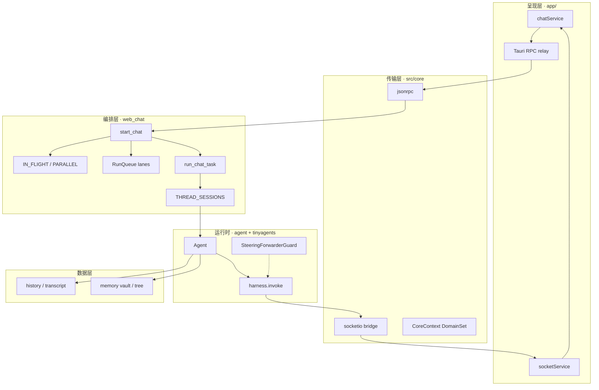

### I.0.2 一句话心智模型

```text
React chatSend
  → JSON-RPC channel_web_chat（立刻 request_id）
  → tokio::spawn → run_chat_task
  → THREAD_SESSIONS 复用 Agent（Parallel 除外）
  → Agent::turn → harness.invoke
  → mpsc → broadcast → Socket chat_delta / chat_done
```

---

## I.1 产品定位与设计哲学

### 是什么

**OpenHuman** 是桌面 / Web **个人 Agent 产品**：聊天、记忆树、审批、技能、MCP、Flows 同仓；Turn 引擎是 Agent + vendored tinyagents。

### 设计哲学

| 原则 | 含义 |
|------|------|
| **RPC 受理 ≠ 完成** | RPC 只回 `request_id`；正文与结束在 Socket |
| **QueueMode 显式** | 同 thread 第二条消息策略产品化（五态），默认 Interrupt |
| **core 无业务** | `src/core` 只路由；turn 在 `openhuman/` |
| **主 turn 可缓存** | `THREAD_SESSIONS` + fingerprint；Parallel **禁止**碰缓存 |
| **Steer 不破坏 pairing** | 注入发生在 harness iteration checkpoint |
| **取消是 drop** | CancellationToken → drop future；Steer forwarder 必须 RAII abort |

### 与同类边界

| | OpenHuman | Pi | Grok |
|--|-----------|-----|------|
| 形态 | 桌面超级助手 | 终端 Coding Harness | 终端/IDE Coding Agent |
| 中途改道 | QueueMode 五态 | steer / followUp | Interjection + Prompt 队列 |
| 默认抢占 | **Interrupt** | 由队列 API 决定 | 排队为主 |
| 完成通道 | Socket chat_done | AgentEvent settled | Gateway + oneshot |

---

## I.2 包依赖与边界

### I.2.1 逻辑依赖

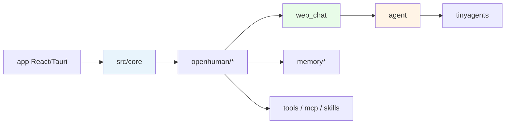

| 层 | 允许 | 禁止 |
|----|------|------|
| core | 调 openhuman ops | 实现 Agent::turn |
| web_chat | 持有 IN_FLIGHT、spawn turn | 实现模型 HTTP |
| agent/tinyagents | harness、工具适配 | 直接 emit Socket（经 bridge） |

### I.2.2 运行时调用链

```text
channel_web_chat
  └── start_chat
        ├── approval 短路？
        ├── QueueMode::Parallel → spawn_parallel_turn
        ├── Steer/Followup/Collect + IN_FLIGHT → RunQueue.push → return queued
        └── Interrupt → cancel 旧 IN_FLIGHT → spawn run_chat_task
              └── Agent::turn → assemble_turn_harness → invoke
                    └── SteeringForwarderGuard（50ms drain steers/collects）
```

---

## I.3 核心实体：设计与协作关系

| 实体 | 所在 | 生命周期 | 职责 | 持久化 |
|------|------|----------|------|--------|
| **IN_FLIGHT** | web_chat | 进程 | 每 thread 主 turn + RunQueue + cancel | 否 |
| **PARALLEL_IN_FLIGHT** | web_chat | 进程 | fork turn 旁路 | 否 |
| **RunQueue** | harness/run_queue | 随主 turn | steers / followups / collects 三车道 | 否 |
| **THREAD_SESSIONS** | web_chat | 进程 | fingerprint → Agent 缓存 | 否 |
| **Agent** | agent | 可跨 turn 复用 | history + turn | history/transcript |
| **SteeringHandle** | tinyagents | 单 turn | 接收 InjectMessage | 否 |
| **SteeringForwarderGuard** | tinyagents | 单 turn | 轮询 drain + Drop 清理 | 否 |
| **CoreContext** | core | 进程 | DomainSet / scope | 配置 |

字段级见 Part II。

---

## I.4 子系统协作图

| 子系统 | 核心 | 输入 | 输出 |
|--------|------|------|------|
| **呈现** | React / TUI | 用户发送 | RPC + 订阅 Socket |
| **传输** | jsonrpc + socketio | method / event | `request_id` / `chat_*` |
| **聊天编排** | `start_chat` / `IN_FLIGHT` | message + `queue_mode` | spawn 或 queued |
| **会话缓存** | `THREAD_SESSIONS` | fingerprint | Agent |
| **Turn 循环** | Agent + harness | user turn | AgentEvent |
| **中途转向** | RunQueue + Forwarder | steer / collect | InjectMessage |
| **长期记忆** | vault / tree / archivist | ingest / recall | 拼进上下文 |
| **工具执行** | SharedToolAdapter | tool_calls | results |

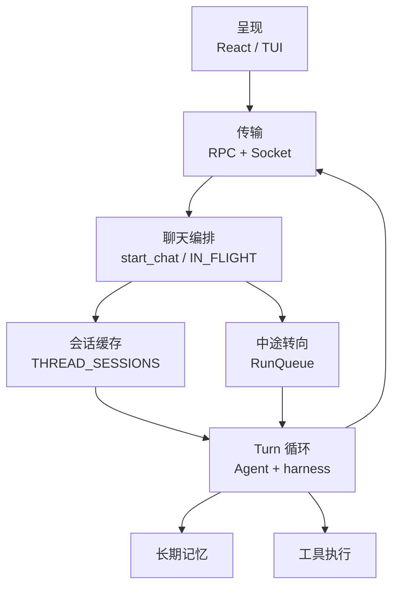

---

## I.5 关键时序图

### I.5.1 chatSend → chat_done

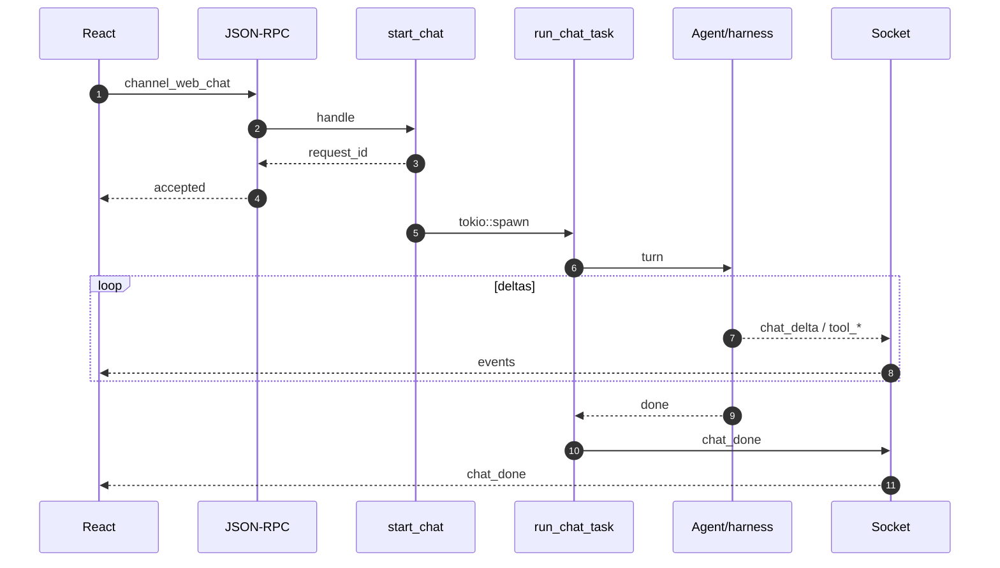

### I.5.2 Steer 注入（对齐 Pi 内层 steering）

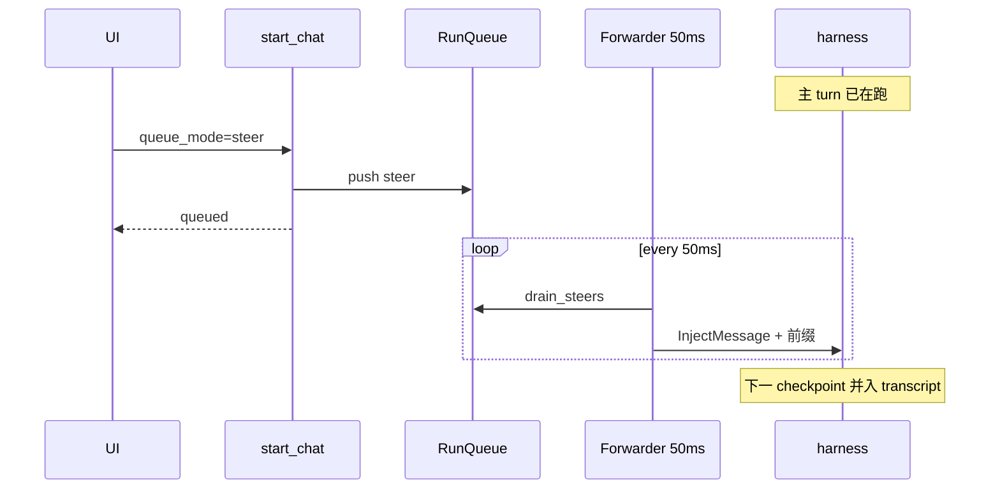

> Pi：`getSteeringMessages` 在 **内层 loop** 末尾拉取。  
> OpenHuman：独立任务 drain → `SteeringHandle`；语义同「中途修正」，实现不同。

### I.5.3 Followup（对齐 Pi 外层 followUp）

主 turn 结束后 `drain_followups` → 再 `start_chat`（仍标 followup）。  
这不是 harness 内注入，而是 **新 turn**——与 Pi 外层「agent 停后再跑」同构。
### I.5.4 委派子 Agent（`delegate_*`）

父 turn **不结束**；子在工具循环里跑独立 harness，结果 collapse 成一条 `tool_result`。

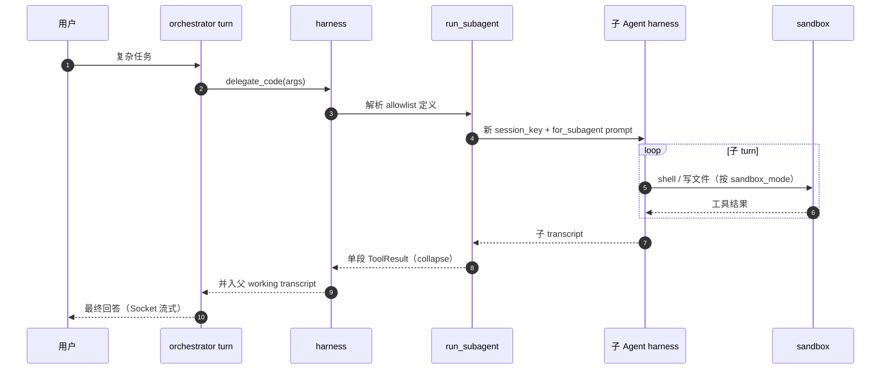

| 形态 | 入口 | 回父方式 | 典型场景 |
|------|------|----------|----------|
| 阻塞 `delegate_*` | orchestrator 工具 | turn 内 ToolResult | 研究、写码、只读规划 |
| `spawn_parallel_agents` | 一次扇出 | 多段结果合并 | 同构多路调研 |
| `spawn_async_subagent` | 后台登记 | **必须** `wait_subagent` 才进父上下文 | 长跑任务 |
| `QueueMode::Parallel` | `channel_web_chat` | append 会话本，非 tool_result | 同 thread 旁路第二问 |

---

## I.6 多份「对话副本」——谁才是真相

OpenHuman 里**不是只有一份 messages**。所谓「同步」，就是：某次操作改了哪一份状态，别的份何时跟上。

### 五本账

| 账本 | 实现 | 谁在用 | 持久？ |
|------|------|--------|--------|
| **A 会话本** | `Agent.history` + `session_raw/*.jsonl` | 跨 turn 对话真源 | jsonl 落盘 |
| **B 送模本** | harness working transcript | **本轮**模型所见 | 否；可被 compact 砍短 |
| **C 屏幕本** | Socket `chat_*` 事件 | UI；按 `request_id` 分轨 | 否 |
| **D 长期本** | vault / tree / **MEMORY.md** | 跨 session；召回拼 user | 是 |
| **E 控制面** | `IN_FLIGHT` + `RunQueue` | 打断/排队/Steer | 否 |

> Steer 先进入 E，再进 B；**不一定立刻改 A**。RPC 的 `request_id` 只是取号条；**没收到 `chat_done` 不算结束**。

### QueueMode 动哪本账

| 模式 | 实际发生 | 动哪本账 | 常见误解 |
|------|----------|----------|----------|
| **Interrupt**（默认） | cancel 旧 turn，开新 turn | E 换新；旧 B 丢弃；旧轨 `chat_error` | 默认不是「续写当前气泡」 |
| **Steer / Collect** | RunQueue → Forwarder 注入 | E → B；提交后才反映到 A | 不是立刻写历史文件 |
| **Followup** | 当前 turn 结束后再 `start_chat` | E 积压；整段结束再派发 | ≠ Steer 中途插话 |
| **Parallel** | fork 独立 B' | 完成后 append A；C 分轨 | ≠ 主 turn 共用一条气泡 |
| **fingerprint 变** | 重建 Agent | 缓存失效；A 从磁盘再载 | 换模型后配置未必已生效 |

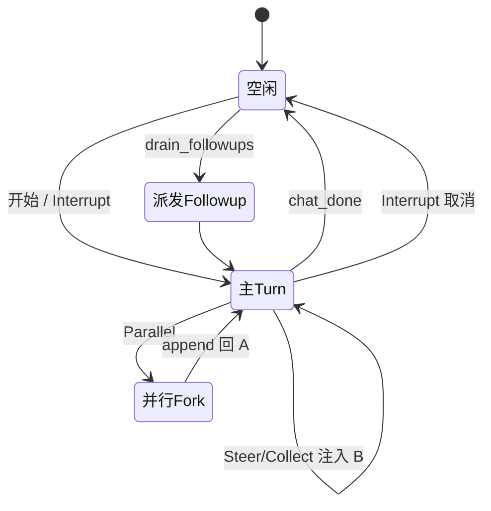

---

## I.7 运行时实体关系（对照源码，非概念 ER）

早期文档里的 `AgentSession` + `InboxQueue` + SQLite `messages` 表 **不是** 桌面聊天主路径。实现枢纽如下：

```mermaid
erDiagram
    THREAD ||--o| SESSION_ENTRY : "THREAD_SESSIONS"
    SESSION_ENTRY ||--|| AGENT : caches
    SESSION_ENTRY ||--|| FINGERPRINT : validates

    THREAD ||--o| IN_FLIGHT : "at most one main"
    IN_FLIGHT ||--o| RUN_QUEUE : optional
    IN_FLIGHT ||--|| CANCEL_TOKEN : owns

    AGENT ||--o{ CONVERSATION_MSG : history
    AGENT ||--o| TRANSCRIPT_JSONL : persists
    AGENT ||--o| MEMORY_LOADER : recall
    AGENT ||--o{ TOOL : visible subset

    AGENT ||--|| HARNESS : per_turn_assemble
    HARNESS ||--o| STEER_FORWARDER : optional

    CHANNEL_PROVIDER ||--o{ IM_THREAD : external
    IM_THREAD ..> AGENT : channels_runtime
```

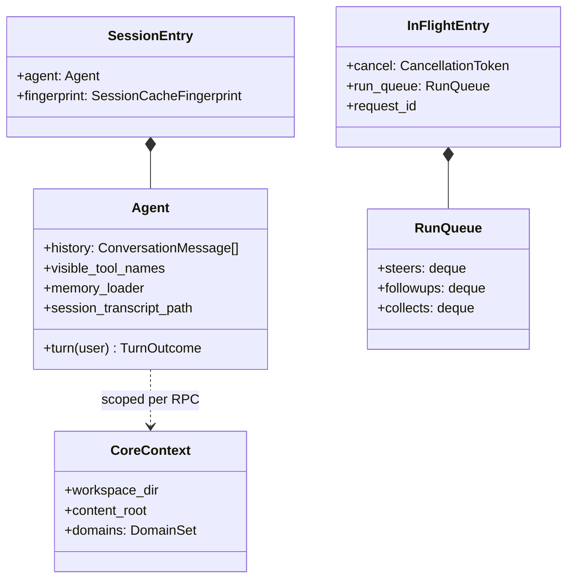

| 概念 | 源码位置 | 说明 |
|------|----------|------|
| UI `thread_id` | `threads/` + conversations JSONL | 聊天列表、标题、turn_state 镜像 |
| `THREAD_SESSIONS` | `web_chat/ops.rs` | 进程内 Agent 缓存 |
| `Agent` | `agent/harness/session` | 脑子：history、工具、记忆句柄 |
| `session_raw` | workspace 下 jsonl | cold resume；`.take()` 一次性前缀 |
| 子 `session_key` | `{ts}_{agent_id}` | `run_subagent` 隔离目录 |
| IM 会话 | `channels` + tinychannels | 外部 thread ≠ web thread |

### 消息四层变换


| 阶段 | 可被谁改写 | 落盘？ |
|------|------------|--------|
| JSONL / history | 每 turn extend | history 镜像在 jsonl |
| working transcript | Steer 注入、compact | 通常不落盘全文 |
| Provider messages | 适配器裁剪 | 否 |
| 长期记忆注入 | `memory_loader` | 只影响当次请求副本 |

tool_call / tool_result 在 transcript 中**成对**；Steer 故意等 harness checkpoint，避免插在 pair 中间。

---

## I.8 长生命周期陪伴：产品面 × 实现

**产品特质**（来自陪伴 Agent 设计）：跨天记忆、后台消化、多数据源汇入、本地优先、可读 MEMORY.md。

**实现映射**——不是独立「潜意识微服务」，而是同一进程里的域协作：

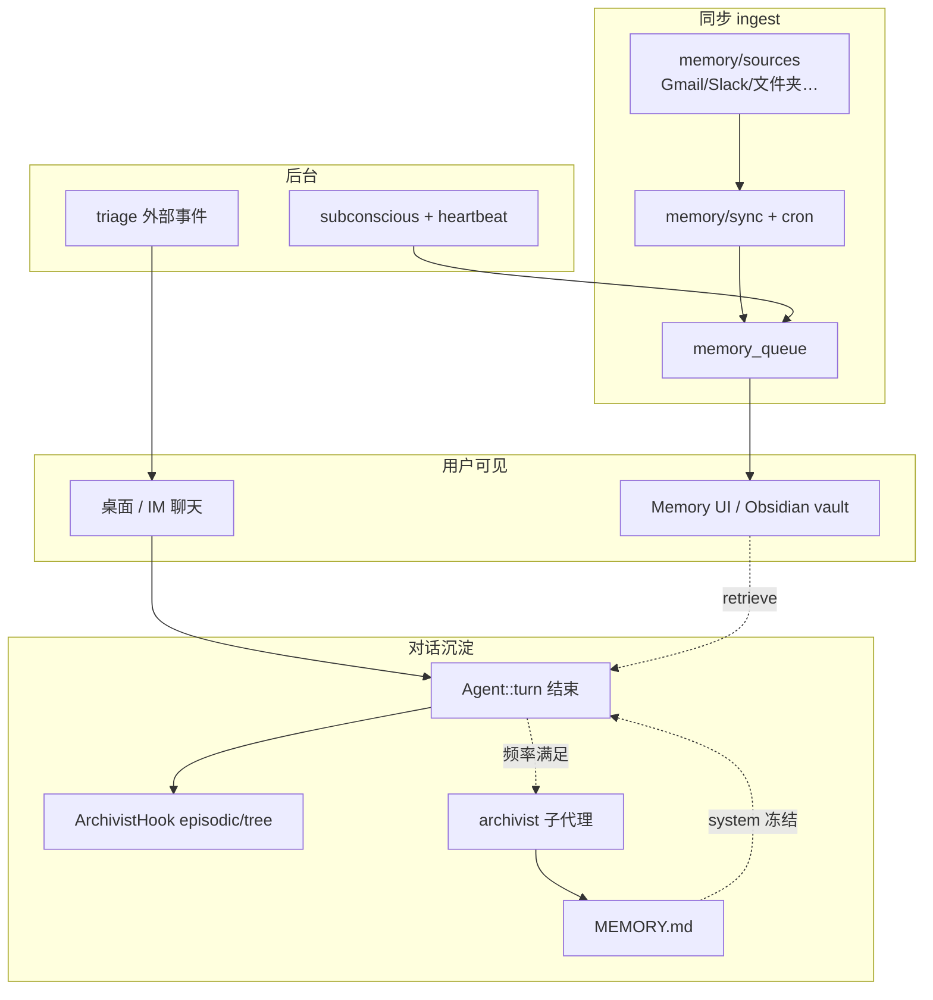

| 能力 | 触发 | 产出 | 阻塞聊天？ |
|------|------|------|------------|
| 对话 ingest | 每 turn 后 | episodic FTS、tree 节点 | 否（Hook 异步） |
| Session memory | token/工具次数/间隔 | archivist 写 **MEMORY.md** | 否（fork 子代理） |
| 外部源同步 | cron ~20min / 手动 | chunks → vault | 否 |
| 潜意识循环 | 空闲 + `subconscious_loop_enabled` | 聚类、摘要、待办候选 | 否 |
| Triage | webhook/cron 入站 | escalate → 开 turn / silence | 仅被 escalate 时 |

吉祥物 `dreaming` 态：UI 映射后台有任务（潜意识/同步）且前台空闲——**状态由 Socket/系统事件驱动**，前端不自主切 thinking。

---

## I.9 记忆双通路（短期对话 vs 长期知识库）

**核心边界**：压缩/树/向量 **不自动** 覆盖 `Agent.history`；召回 **按需注入当次请求**，默认 **不回写** history。

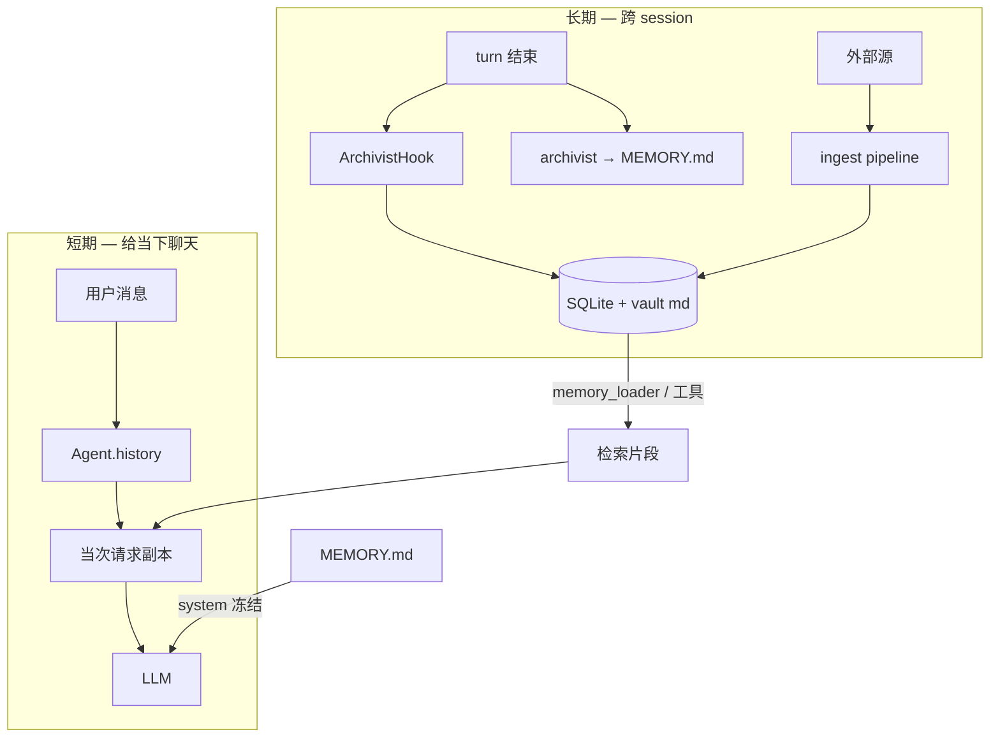

### 读：模型何时看见

| 侧 | 内容 | 机制 |
|----|------|------|
| **system** | SOUL / IDENTITY / USER / PROFILE | `SystemPromptBuilder` |
| **system** | **MEMORY.md** | orchestrator 默认 `omit_memory_md=false` |
| **user** | working.user.*、Prior conversations、cross-chat | `memory_loader.load_context` |
| **工具** | 深检索 | `delegate_retrieve_memory` / `memory_query` |

### 写：三条路径（勿混）

| 路径 | 执行者 | 写什么 | ≠ |
|------|--------|--------|---|
| A | ArchivistHook | episodic、segment、tree | MEMORY.md |
| B | archivist 子代理 | `update_memory_md` | 当场可读（异步） |
| C | transcript_ingest | `high.*` → Prior conversations | vault 全文 |

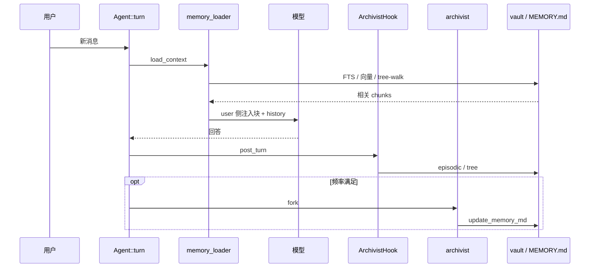

### Compact × Memory

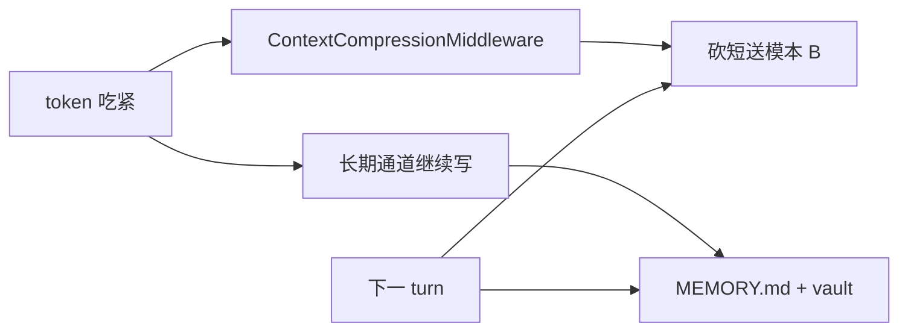

压缩砍 **当前对话视图**；`MEMORY.md` + vault 是跨 session 保险柜。

---

## I.10 多 Agent 三轨（选型一张表）

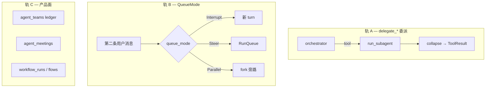

| 你想做什么 | 走哪条 | 关键结构 |
|------------|--------|----------|
| 专长任务（写码/调研/记忆） | 轨 A `delegate_*` | 子 session_key；`MAX_SPAWN_DEPTH=3` |
| 方案要人批 | `request_plan_review` + `delegate_plan` | PlanReviewGate；planner 只读沙箱 |
| 同会话并行第二问 | 轨 B **Parallel** | `PARALLEL_IN_FLIGHT`；禁碰 THREAD_SESSIONS |
| 中途改当前回答方向 | 轨 B **Steer** | 50ms Forwarder；checkpoint 注入 |
| 可恢复团队 DAG | 轨 C `agent_teams` | SQL ledger；不进主 chat 全文 |
| 会议旁听/发言 | 轨 C `agent_meetings` | meet feature |

**Plan 模式诚实说明**：无 Grok 式 `enter_plan_mode` 全局 edit gate；闸在 **人批** + **角色不写仓库**（orchestrator 委派 code_executor）。

---

## I.11 沙箱 · 工具 · 网关协作

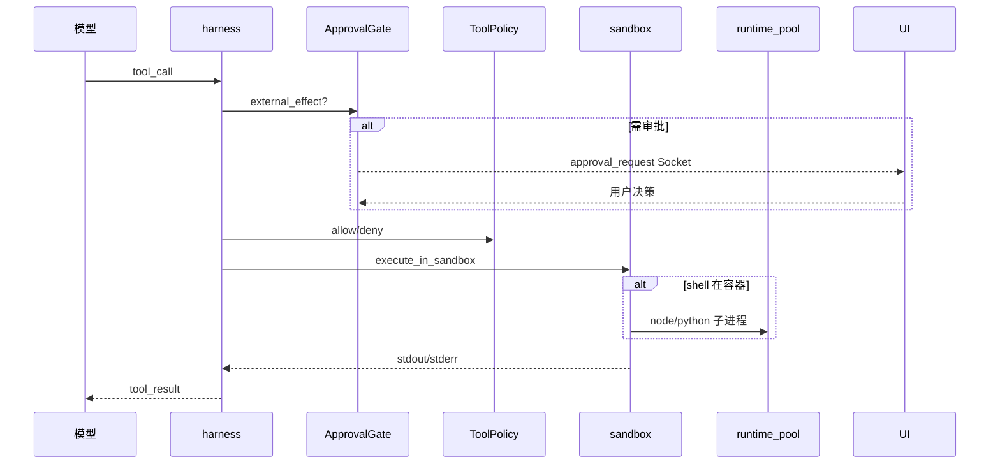

| 后端 `SandboxBackendKind` | 隔离方式 | 典型用途 |
|---------------------------|----------|----------|
| `None` | 宿主机直接执行 | 本地开发 |
| `Local` | cwd_jail（Landlock/Seatbelt） | 路径监禁 + 轻量隔离 |
| `Docker` | 容器挂载 workspace | 强隔离 shell |

三者与 **审批**、**ToolPolicy 频道天花板** 正交：sandbox 管「在哪跑」，审批管「能不能跑」。

### App ↔ Core 双通道

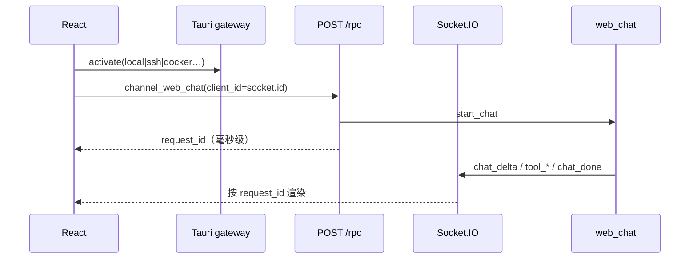

`gatewayService` 切换 core 后：RPC URL 变、Socket 需重连、**新进程内 THREAD_SESSIONS 为空**。

---

## I.12 vendor `tiny-*` 库：概念名 ↔ 源码（非事件总线）

旧文档称「16 模块全靠 tinybus」——**不准确**。实际是 **同进程 Rust 库依赖** + 少量 `DomainEvent`；主聊天走 **RPC + Socket + 直接函数调用**。

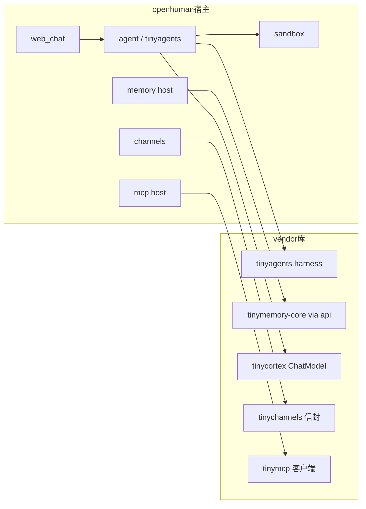

| 概念模块 | vendor / 宿主 | 真实职责 |
|----------|---------------|----------|
| Supervisor/Worker | `agent` + `harness/subagent_runner` | `delegate_*`；非独立进程 |
| agent.history | `Agent.history` | `ConversationMessage[]`；非 tinyruntime 包 |
| TokenJuice | `inference/tokenjuice` + memory ingest | 压缩/切块进 vault |
| 三层记忆树 | `memory_tree` / tinymemory | SQLite + md；检索 FTS/向量/tree-walk |
| Obsidian 镜像 | vault 导出 | SQLite 为索引真源；**禁止 md 反写库** |
| 潜意识宿主 | `subconscious` + `cron` + `heartbeat` | 非 tinyhosts 独立进程 |
| IM 通道 | `channels` + tinychannels | 入站 → harness turn |
| 工具沙箱 | `sandbox` + `cwd_jail` | 非 tinybox 独立服务 |
| MCP | `mcp/` host + tinymcp | 动态注册 + 审计 |
| 凭证 | `security/keyring` + `credentials` | 非 tinywallet 独立进程 |

---

## I.13 模块索引与扩展面

> 域目录全表：[MODULES.md](./MODULES.md) · 流程展开：[MODULES.md](./MODULES.md)

| 区域 | 路径 | 一句话 |
|------|------|--------|
| 受理 / 队列 | `web_chat/` | QueueMode、IN_FLIGHT、THREAD_SESSIONS |
| Turn | `agent/harness/session/turn/` | `Agent::turn` |
| 适配循环 | `agent/tinyagents/` | 中间件、Steer、SharedToolAdapter |
| 委派 | `harness/subagent_runner` | 子 session collapse |
| 记忆宿主 | `memory/` | RPC、guard、MEMORY 工具 |
| 沙箱 | `sandbox/` | Docker / Local / cwd_jail |
| 传输 | `src/core/` | jsonrpc、socketio、DomainSet |

| 运行表面 | 入口 | 完成信号 |
|----------|------|----------|
| Desktop WebView | `channel_web_chat` + Socket | `chat_done` |
| TUI / CLI | 同 RPC | 同 |
| IM channels | provider → runtime | 通道 outbound |
| Flows | 独立 registry | 自有事件 |
| MCP 外部宿主 | `openhuman mcp` stdio | 协议层 |

---

## I.14 依赖不变量

1. `src/core` **不实现** `Agent::turn`。  
2. Interrupt / Parallel **不得** `RunQueue::push`（源码 warn）。  
3. 任何 cancel 路径必须 `SteeringForwarderGuard::drop` → abort 轮询（#4456）。  
4. 召回进 **user**；改 system 打穿 prompt cache。  
5. `client_id` **必须** = `socket.id`。  
6. Obsidian md **不是** 记忆真源；读走 tinymemory SQLite/API。

---

## I.15 与 Pi / Grok 对照

| 主题 | Pi | OpenHuman | Grok |
|------|-----|-----------|------|
| 内层中途修正 | steering queue | **Steer** + Forwarder | Interjection |
| 停后再跑 | followUp 外层 | **Followup** drain | `pending_inputs` |
| 默认抢占 | API 选择 | **Interrupt** | 排队 / Cancel |
| 并行同会话 | subagent 扩展 | **Parallel** fork | 新 session |
| 完成信号 | agent_settled | **chat_done** | oneshot + Gateway |
| Plan 闸 | — | PlanReviewGate + 角色委派 | edit gate |


---

# Part II · 领域语义深潜

> **源码图册**（QueueMode、中间件、Agent 字段、RPC/Socket、实体关系）→ **[IMPLEMENTATION.md](./IMPLEMENTATION.md)**  
> **模块目录与分层流程** → **[MODULES.md](./MODULES.md)**  
> **陪伴产品用户视角** → **[PRODUCT.md](./PRODUCT.md)**

本节只保留 **Memory / Plan / 多 Agent** 的产品语义与因果（改 prompt 行为、写 MEMORY.md、选型委派时读这里）。与 Part I 图表互补，不重复实现细节。

# II.4 Memory · Plan · 多 Agent（整体设计）

> 这里讲 **产品语义与因果**，不讲文件目录。Prompt 原文中文见 [OPENHUMAN_RUNTIME_PROMPTS.md](./OPENHUMAN_RUNTIME_PROMPTS.md)。

---

## II.4.1 Memory：长短期怎么分、怎么读写、怎么个性化

### 心智模型

OpenHuman 的记忆是 **三套账**，不是一个「向量字段」：

| 层 | 白话 | 寿命 | 模型怎么看见 |
|----|------|------|--------------|
| **Turn / 会话本** | `Agent.history` + harness 工作 transcript | 本 session；可被 compact 砍短 | 每 turn 直接带进采样 |
| **Session 落盘** | `session_raw/*.jsonl`（+ 可读 sessions 视图） | 本 session，跨进程可 resume | 冷启动前缀 `.take()`，不是每条都灌 prompt |
| **跨会话长期** | vault/tree + episodic FTS + **`MEMORY.md`** | 跨 session | **从不整库灌**；见「读」 |

长期层再拆：

```text
MEMORY.md                 ← archivist 策展的「人读得懂的长期底料」（进 system）
memory_store / tree       ← SQLite chunks + 树 walk（按需 deep recall）
episodic FTS5             ← 按 turn 可检索的散文索引
working.user.*            ← 时区/偏好等事实（进 user，带 as-of 日期）
memory/conversations/*    ← UI 线程 JSONL（供 cross-chat）
```
```text
1. 用户对话产生消息 → ActiveTurn内存追加 Agent.history
2. Turn结束 → 会话原始流水落盘写入 session_raw/xxx.jsonl（备份，不检索）
3. 后台潜意识循环 subconscious‑loop 被触发（空闲或者定时心跳）
    ├─读取会话原始素材 / 第三方同步拉取的邮件文档
    ├─标准化转换为 Markdown
    ├─切分成 ≤3k token 的 Chunk
    ├─打分、实体、热度计算
    ├─写入 SQLite Memory‑Tree三层树形节点
    ├─给Chunk建立可选索引：FTS5全文索引 / embedding向量索引
    ├─双写同步导出 .md 文件写入Obsidian vault目录
    └─生成顶层全局快照 MEMORY.md
4. 检索阶段两种召回路径
    路径A：树遍历 tree‑walk → 沿着主题分支读取一批记忆
    路径B：关键词 → FTS5全文检索命中chunk
    路径C：语义查询 → 向量相似度召回chunk
```
**Session content / session memory**（产品语义）：不是 transcript 本身，而是频率满足后（token↑ / 工具次数 / 间隔 turns）**后台 fork `archivist`**，用 `update_memory_md` 把 durable 事实写进 workspace **`MEMORY.md`**。与 compaction **正交**——压缩改本轮送模本；session memory 是跨 session 的 markdown 底料。

路径根别混：`workspace_dir`（内部：DB / session_raw / conversations，Agent 不当成用户项目写）≠ `action_dir`（工具 cwd，用户项目）≠ `content_root`（vault 内容树）。

### 读：什么时候进模型

**1）System 侧（人格 + 策展长期）**

| 块 | 何时 | 意图 |
|----|------|------|
| SOUL / IDENTITY / USER（+ 可选 PROFILE） | `SystemPromptBuilder` | 人设与「记住/忘记」契约 |
| **`MEMORY.md`** | `omit_memory_md=false`（orchestrator 默认开） | 冻结进 session，利 KV cache |

子代理常用 `for_subagent`：可 `omit_identity` / 更瘦；**不**每 turn 倾倒 DateTime（保 cache）。

**2）User 侧召回（每 turn 可拼，不动 system）**

`memory_loader.load_context` → 拼在本 turn **user** 前/旁：

| 块 | 内容 |
|----|------|
| `[User working memory]` | 仅 `working.user.*`，带 `as of YYYY-MM-DD` |
| `[Prior conversations]` | 高优先级先前事实（可关） |
| `[Cross-chat context — historical; …]` | 优先 ConversationStore JSONL；fallback episodic |

**3）按需深挖（工具，不是每 turn 自动）**

orchestrator 有 `delegate_retrieve_memory`（allowlist → `agent_memory`）。  
旧行为「每 turn 先跑 memory 子代理」已去掉——贵、且经常没用。

> **因果**：召回 **不进 system**，避免打穿 prompt cache。曾取消自动大块 `[Memory context]` 语义全量注入——会把刚发的 user_msg 当 top hit **回声**。

### 写：什么时候落盘（三条路径，别混）

| 路径 | 谁 | 产物 | ≠ |
|------|----|------|---|
| **A. ArchivistHook** | post-turn 钩子（非 LLM） | episodic FTS → 段关时 prose → **memory_tree** | 不是改 MEMORY.md |
| **B. archivist 子代理** | 频率 `should_extract_session_memory` 后台 fork | 调 **`update_memory_md`** → **MEMORY.md** | 「dream」语义 |
| **C. transcript_ingest** | 同窗口启发式 | `high.*` 等 → 喂 Prior conversations | 也不是 MEMORY.md |

```text
turn 完成
  → A: ArchivistHook（episodic / segment / tree）
  → B:（频率）fork archivist → update_memory_md → MEMORY.md
  → C: transcript_ingest → high.* 事实
  → session 结束 → flush 未封段
```

聊天里用户说 remember：orchestrator 可直接 `memory_store`，再按协议调 `update_memory_md` 对账（见下）。  
`profile_memory_agent` 管 store/画像，**默认不**挂 `update_memory_md`。

没有 Grok 式 `/flush` `/dream` 用户命令；「dream」≈ 路径 B。

### 谁允许写 MEMORY.md（有 `update_memory_md`）

工具枚举门禁：只能改 **`MEMORY.md` | `SKILL.md`**（不是通用编辑器）。

| Agent | 写 MEMORY.md？ | Prompt 出处（不在 SOUL/USER） |
|-------|----------------|------------------------------|
| **`archivist`** | 主写手 | `archivist/prompt.md`：「Update MEMORY.md」、去重、脱敏 |
| **`orchestrator`** | 索引对账（`memory_store` 后必跟） | `orchestrator/prompt.md` Memory is direct work；loader **强制**带此工具 |
| **`skill_creator`** | 工具能写，主业是 **SKILL.md** | `skill_creator/agent.toml` |

`omit_memory_md=false` 只表示 **读进 system**（context_scout、profile_memory_agent、help…），**不等于**能写。

> `OPENHUMAN_RUNTIME_PROMPTS.md` 原先只收共享人格；写 MEMORY 的说明在 **agent 专属 prompt**，不是漏了源码。

### Compact × Memory（一条因果链）

```text
token 吃紧
  → harness ContextCompressionMiddleware 摘要替换送模本
  →（并行轨道）Archivist / session memory 继续沉淀长期
  → 下一 turn：system 仍有 MEMORY.md；user 侧仍有 working/prior/cross-chat
```

**原则**：Compact 砍短 **当前对话**；`MEMORY.md` + vault 是 **跨 session 保险**。Recovery 不是整库回灌。

### 个性化

| 来源 | 作用 |
|------|------|
| **SOUL** | 语气与协作风格 |
| **IDENTITY** | 使命与价值观 |
| **USER** | 记住/忘记边界；画像适配 |
| **PROFILE.md** | 引导/enrich 后的用户画像（orchestrator 默认带） |
| **`working.user.*`** | 时区、沟通偏好等动态事实 |
| **MEMORY.md** | archivist 沉淀的跨会话摘要 |

USER 契约（语义）：记角色/集成/长短偏好/反复话题/时区；忘未要求保留的敏感标识、机密细节、平台私聊、用户要求忘掉的。召回时标明「根据你以前告诉我的…」。

### 易错点

1. **ArchivistHook（树）≠ archivist agent（MEMORY.md）≠ transcript_ingest（high.*）**——三条写路径。  
2. 日志「Archivist 跑了」≠ 模型已经看见新 MEMORY.md——异步，当轮常不可读。  
3. `omit_memory_md` 控 **读**；`update_memory_md` 控 **写**——能看见 ≠ 能改。  
4. 压缩改的是 **B（送模本）**；`Agent.history` turn 后 extend 的是 outcome，不是压缩后全文。  
5. 丰富跨 session 知识靠路径 B；只靠瘦 transcript，下一会话几乎空。

---

## II.4.2 Plan：没有 Grok 式 Plan Mode，但有「审批闸 + 只读规划者」

### 诚实结论

**没有** `enter_plan_mode` / `exit_plan_mode` **全局模式机 + 编辑闸**（plan 期内禁止一切 `edit`/`apply_patch`）。  
`plan_exit` 只吐 `[plan_exit]` 标记，注释写明 harness 模式切换 **尚未接线**。

OpenHuman 用 **角色分工 + 用户审批暂停** 代替「模式开关」。

### 解决什么问题

复杂多步任务：先想清楚、让用户拍板，再委派干活——但 **不靠**「进 Plan 模式锁仓库」。

orchestrator **自己就不写代码 / 不 shell**（Staff Engineer 路由）；写操作靠委派 `code_executor` 等。闸在「人批不批」，不在「工具策略级 edit gate」。

### 状态机（白话）

```text
orchestrator 拟多步计划
  → request_plan_review(summary, steps)   # 尚未盲目执行 / 铺卡
  → 停车 PlanReviewGate（交互 turn）
       ├─ approved → todo 铺卡 → delegate_* 执行
       ├─ rejected → 不执行、不建卡
       └─ revise   → 带 feedback 再 park
  非交互 turn → 自动 approve（cron / 后台）
```

### 规划相关机制（做什么 / 不做什么）

| 机制 | 做什么 | **不**做什么 |
|------|--------|--------------|
| **`request_plan_review`** | 交互 turn **暂停**等 approve/reject/revise | 不锁工具面；非交互自动过 |
| **`planner`（`delegate_plan`）** | `sandbox_mode=read_only`；DAG/验收；可有 `todowrite`/`plan_exit` | 不写仓库；**无**全局 edit gate |
| **`todo` / `todowrite`** | 线程任务板；约定审批后再铺卡 | 不是「只能写 plan 文件」沙箱 |
| **`goal_set/get/complete`** | 线程级目标契约 | 不是 Grok Goal harness |
| **`agent_prepare_context` / context_scout** | 只读 scout → context bundle | 不进入只写 plan 文件模式 |
| **`workflow_builder` + tinyflows** | 另开流水线，产出 WorkflowGraph **提案** | 与聊天 Plan mode 无关 |
| **`plan_exit`** | 把 plan 文本标成 handoff | **不**切换 build 模式、**不**禁写 |

### 与 Grok Plan / Goal 对照

| | OpenHuman | Grok Plan mode | Grok Goal |
|--|-----------|----------------|-----------|
| 驱动 | orchestrator + 用户批 + 委派 | 同主 agent + 用户批 | 编排器自动推进 |
| 「闸」 | **PlanReviewGate** + 角色只读 | **Edit gate**（除 plan 文件） | Verifier 验收 |
| bash/写仓库 | orchestrator 无写工具；写靠委派 | plan 期仍可能用 bash 改环境 | Implementer 可写 |
| 提问 | 鼓励澄清 / review | 鼓励 ask_user | **禁止**追问 |

### 易错点

1. 看到 `plan_exit` ≠ 已进入只读 Plan 模式。  
2. planner 只读 ≠ 全产品 edit gate；orchestrator 若误配写工具，仍可能写。  
3. 别把 `workflow_builder` 当聊天 Plan mode。

---

## II.4.3 多 Agent：三条产品面，不要合成一条

OpenHuman **不是**「一个 `IN_FLIGHT` 里多个 running_task」。并行要么是 **新子 Agent 会话**，要么是 **同 thread 旁路聊天**。

### 轨 A：orchestrator 委派（主路径）

主聊天默认 **orchestrator**（`agent_tier=chat`）。`[subagents] allowlist` 在构建时合成 **`delegate_*`**（及 integrations 折叠工具）：

```text
orchestrator turn
  → 选 delegate_plan / delegate_code / delegate_retrieve_memory …
  → run_subagent（独立 session_key；可选独立 workspace）
  → 子用 for_subagent system（更瘦）
  → 子历史 collapse 成一条 tool_result 回父
```

层级约定：`chat` → `reasoning`（如 planner）或 `worker`；loader **禁同 tier 互 spawn**。

父可传工具 ceiling、MCP 继承、model hint。  
通用 `spawn_subagent` 仍可在注册表（trigger 等）；主聊天路径是 **allowlist→delegate_*** + `spawn_parallel_agents` / `spawn_async_subagent`。

| 异步形态 | 回父 |
|----------|------|
| 阻塞 `delegate_*` / `spawn_parallel_agents` | 结束 → 单段 `ToolResult` |
| `spawn_async_subagent` | 登记 running；`wait_subagent` / `steer_subagent`（完成了也要 wait 才能进父上下文） |

### 轨 B：QueueMode（同 thread 聊天车道）

`Interrupt | Steer | Followup | Collect | Parallel` 管的是 **用户消息怎么进主 turn**，不是 specialist 委派。

| | **轨 A 子代理** | **QueueMode::Parallel** |
|--|-----------------|-------------------------|
| 是什么 | 另一 Agent 定义 + 独立 session | 同 thread **旁路 fork 聊天** |
| 入口 | `delegate_*` / parallel_agents | `start_chat(queue_mode=parallel)` |
| 状态 | 子 harness；父 turn 内 tool | `PARALLEL_IN_FLIGHT`；不碰主 `IN_FLIGHT` |
| 回写 | collapse → 父 tool_result | fork 完成后 **append** 会话本 |

详见 Part I QueueMode / 多账本。

### 轨 C：Meetings / Teams（产品面，不是 ReAct 子循环）

| 面 | 是什么 | 不是什么 |
|----|--------|----------|
| **agent_meetings** | 会议机器人；可唤醒 orchestrator | harness 内多人格 ReAct |
| **agent_teams** | 可恢复 lead/worker 任务图 | 日常聊天委派；状态在 ledger，不塞主 chat context |

### 选型

| 场景 | 走哪条 |
|------|--------|
| 方案不清、要人拍板 | **request_plan_review** ± **delegate_plan** |
| 固定专长（研究/代码/记忆…） | **delegate_*** |
| 同构多路扇出 | **一次** `spawn_parallel_agents`（禁循环 spawn） |
| 长跑后台稍后再取 | **spawn_async_subagent** + wait |
| 同会话边聊边并行另一问 | **QueueMode::Parallel** |
| 会议旁听/发言 | **agent_meetings** |
| 可恢复团队依赖图 | **agent_teams** |

### 易错点

1. Parallel ≠ subagent。  
2. 子 fingerprint/workspace 不同 → 不共享 `THREAD_SESSIONS`。  
3. async 子 `completed` 仍须 `wait_subagent` 才能进父上下文。  
4. Memory 召回进 **user**；改 system 打穿 cache。


---

## 修订记录

| 版本 | 日期 | 说明 |
|------|------|------|
| **7.0** | 2026-09-04 | 文档重组：Part II 仅保留 II.4 语义；实现细节迁至 IMPLEMENTATION.md |
| 6.1 | 2026-09-04 | IMPLEMENTATION_REFERENCE 图册 |
| 6.0 | 2026-09-04 | 合并三份核心稿 |

**维护**：符号名 `grep`；路径以 `openhuman/src/` 为准。

