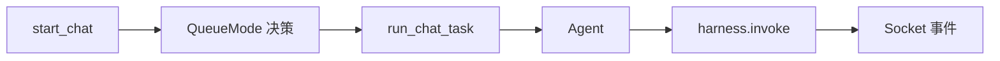
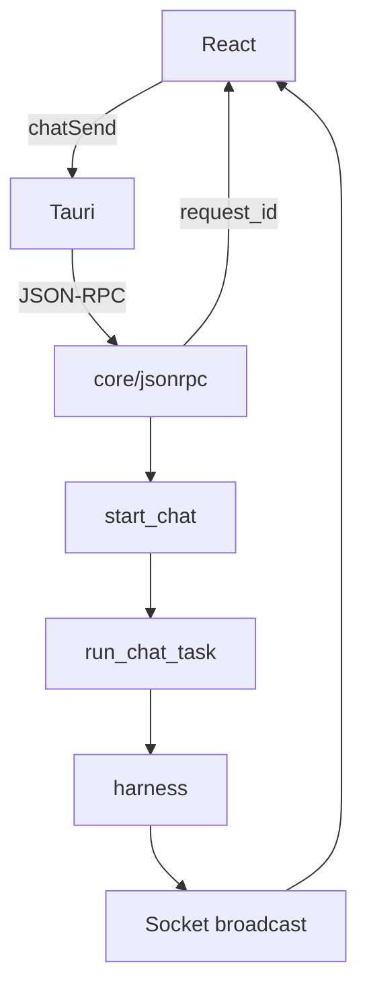

# OpenHuman 设计思想导读

> **阅读方式**：先读本导读（~40 分钟）→ [ARCHITECTURE.md Part I](./ARCHITECTURE.md#part-i--高层架构) → [IMPLEMENTATION.md](./IMPLEMENTATION.md)  
> **树形 / Transcript**：[JSONL_TRANSCRIPT_GUIDE.md](./JSONL_TRANSCRIPT_GUIDE.md)  
> **图解速览**：[diagrams/design-thinking-series.html](./diagrams/design-thinking-series.html)（浏览器打开）  
> **写法标准**：[PROGRESSIVE_ARCH_DOC_METHODOLOGY.md](../../docs/agent-doc-template/PROGRESSIVE_ARCH_DOC_METHODOLOGY.md)  
> **Pi 对照**：[pi/docs/DESIGN_THINKING_SERIES.md](../../pi/docs/DESIGN_THINKING_SERIES.md)  
> **跨项目**：[CROSS_AGENT_CONCEPT_MAP.md](../../docs/agent-doc-template/CROSS_AGENT_CONCEPT_MAP.md)

---

## 先建立一条运行路径

在打开 IMPLEMENTATION 图册之前，先把 **一次 chatSend** 的路径背下来：

```text
React chatSend
  → Tauri JSON-RPC channel_web_chat（立刻返回 request_id）
  → start_chat 决策 QueueMode
  → tokio::spawn run_chat_task
  → THREAD_SESSIONS 复用 Agent（Parallel 时 fork，不碰缓存）
  → Agent::turn → harness.invoke → tool_loop
  → mpsc → broadcast → Socket chat_delta / chat_done
```

**一句话记忆**：**RPC 只回凭证；正文走 Socket；编排归 web_chat；循环归 harness。**

---

## 第 1 步：先认识真实源码全景

**一句话**：OpenHuman 不是「React 套壳调 API」，而是 **呈现层 + 传输双通道 + web_chat 编排 + tinyagents harness + 记忆双通路**。

**为什么先看这里**：`src/core` 与 `src/openhuman` 刻意分离——前者 **无业务**，后者才有 QueueMode、Agent、memory。先认目录，才不会在错误层改 turn 逻辑。

### 目录地图

```text
openhuman/
├── app/                      React：chatService, socketService
├── src/core/                 JSON-RPC、Socket.IO、CoreContext（无 turn 业务）
└── src/openhuman/
    ├── web_chat/             start_chat, IN_FLIGHT, run_chat_task
    ├── agent/                Agent, harness, tool_loop, RunQueue
    ├── threads/              transcript, turn_state
    └── memory/               vault, tree, ingest
```

| 层 | 职责 | 关键文件 |
|----|------|----------|
| **呈现** | UI、发 RPC、收 Socket | `app/` |
| **传输** | 路由、鉴权、桥接 | `src/core/` |
| **编排** | QueueMode、并发槽 | `web_chat/ops*.rs` |
| **运行时** | LLM + 工具循环 | `agent/harness/` |
| **数据** | 短对话 + 长记忆 | `threads/`, `memory/` |

### 深潜

→ [ARCHITECTURE.md §I.0](./ARCHITECTURE.md#i0-总体框架一页纸) · [MODULES.md](./MODULES.md)

---

## 第 2 步：编排 vs 执行

**一句话**：**`web_chat` 决定「这条消息怎么排队」**；**`harness` 决定「这一轮 turn 怎么跑完」**——与 Pi 的 AgentSession vs Agent Loop 同构。

**为什么先看这里**：QueueMode 五态全在 `start_chat` 分支里决策；若误以为 harness 自己处理「第二条消息」，会看不懂 Steer / Interrupt 时序。

| | web_chat 编排 | Agent + harness |
|--|---------------|-----------------|
| **职责** | QueueMode、IN_FLIGHT、THREAD_SESSIONS | `turn`、LLM、tool_loop |
| **入口** | `start_chat` | `run_chat_task` → `harness.invoke` |
| **状态** | `SessionEntry`、`RunQueue` | Agent 实例、turn 内消息 |
| **类比 Pi** | AgentSession | Agent Loop |
| **类比 Codex** | `submission_loop` + 邮箱 | `run_turn` |



### 深潜

→ [IMPLEMENTATION.md §1](./IMPLEMENTATION.md) · [docs/AGENT_LOOP_AND_LIFECYCLE.md](../docs/AGENT_LOOP_AND_LIFECYCLE.md)

---

## 第 3 步：一次聊天任务的双层结构

**一句话**：**外层** `run_chat_task` 管 thread 级生命周期与缓存；**内层** harness `tool_loop` 管单 turn 内 LLM ↔ 工具往返。

**为什么先看这里**：Parallel 模式旁路 `THREAD_SESSIONS`、Steer 在 iteration checkpoint 注入——都发生在这两层之间的边界上。

### 外层：`run_chat_task`

```23:38:openhuman/src/openhuman/web_chat/run_task.rs
pub(crate) async fn run_chat_task(
    client_id: &str,
    thread_id: &str,
    request_id: &str,
    message: &str,
    ...
    run_queue: Arc<crate::openhuman::agent::harness::run_queue::RunQueue>,
    ...
    // When true, run as an isolated fork: build a fresh agent seeded from the
    // thread's history-at-start and never touch the shared `THREAD_SESSIONS`
    // cache, so a concurrent same-thread (parallel) turn cannot clobber ...
    fork: bool,
) -> Result<WebChatTaskResult, String> {
```

| 模式 | 外层行为 |
|------|----------|
| **默认 / Steer / Followup** | 复用 `THREAD_SESSIONS` 中 Agent |
| **Parallel** | `fork: true`，历史快照 + 独立 Agent，**禁止**碰共享缓存 |
| **Interrupt** | cancel 旧 `IN_FLIGHT`，spawn 新 task |

### 内层：harness tool_loop

```text
harness.invoke
  → 组装 prompt（含 MEMORY.md 注入）
  → LLM 流式
  → tool_calls → 中间件 → orchestrator
  → 结果回注 → 直到 turn 结束
```

### 深潜

→ [ARCHITECTURE.md §I.0.2](./ARCHITECTURE.md#i02-一句话心智模型) · `agent/harness/session/turn.rs`

---

## 第 4 步：双通道依赖与装配

**一句话**：**JSON-RPC 受理**；**Socket.IO 推送正文**——两条通道必须分开想，不能指望 RPC 返回 assistant 文本。

**为什么先看这里**：前端 bug 里最常见的是「RPC 成功了但界面没字」——因为字在 Socket 上。



| 通道 | 返回/推送 | 典型事件 |
|------|-----------|----------|
| **RPC** | `request_id`、错误码 | 受理成功 ≠ turn 完成 |
| **Socket** | 流式正文、生命周期 | `chat_delta`, `chat_done`, `chat_error` |
| **harness 内部** | turn 事件 | tool 开始/结束、审批 |

### 设计哲学（产品级）

| 原则 | 含义 |
|------|------|
| **RPC 受理 ≠ 完成** | 用户立刻拿到 `request_id`，用于关联 Socket |
| **core 无业务** | turn 逻辑只在 `src/openhuman/` |
| **取消是 drop** | `CancellationToken` → drop future → `chat_error` |

### 深潜

→ [IMPLEMENTATION.md §4](./IMPLEMENTATION.md) · [ARCHITECTURE.md §I.1](./ARCHITECTURE.md#i1-产品定位与设计哲学)

---

## 第 5 步：工具调用经过中间件链

**一句话**：LLM 的 `tool_calls` 不直达文件系统，而是 **Registry → 审批中间件 → orchestrator → 结果回注 harness**。

**为什么先看这里**：OpenHuman 是陪伴产品，**审批与可观测**与 Pi/Codex 同级重要；改工具可见性、改 block 策略都在这条链上。

```text
LLM tool_calls
  → ToolRegistry 解析 name + schema
  → 中间件链（allow / review / block / 压缩…）
  → orchestrator_tools（filesystem, git, delegate, …）
  → tool result → harness 消息列表
  → 下一轮 LLM 或 turn 结束
```

| 阶段 | 产品含义 |
|------|----------|
| **review** | 用户点批准才执行 |
| **block** | 直接拒绝并回注模型 |
| **delegate** | 走多 Agent 轨（见第 9 步） |

### 深潜

→ [IMPLEMENTATION.md §2](./IMPLEMENTATION.md) · [ARCHITECTURE.md §I.11](./ARCHITECTURE.md#i11-沙箱--工具--网关协作)

---

## 第 6 步：事件流与 UI 投影

**一句话**：用户在 React 里看到的 **每一个字**，都来自 Socket 对 harness 流的 **投影**，不是 RPC 响应体。

**为什么先看这里**：调试时要同时开「RPC 日志」和「Socket 日志」；只看 RPC 会以为 turn 卡住。

### 典型 Socket 序

```text
（RPC 已返回 request_id）
chat_delta*          assistant 片段
tool_progress*       工具进度（若启用）
approval_request     需用户确认
chat_done            本 request_id 正常结束
chat_error           取消 / 推理失败 / 预算超限
```

### 四层消息变换（与持久化对照）

```text
用户输入
  → start_chat 规范化（附件、注入扫描）
  → Agent turn 输入
  → harness API 消息形
  → transcript 落盘
  → Socket 投影（UI 所见）
```

**权威顺序**：以 `threads/` + harness 为准；UI 是最后一层投影。

### 深潜

→ [IMPLEMENTATION.md §4](./IMPLEMENTATION.md) · [JSONL_TRANSCRIPT_GUIDE.md](./JSONL_TRANSCRIPT_GUIDE.md)

---

## 第 7 步：QueueMode 五态 — 同 thread 的「第二条消息」

**一句话**：OpenHuman 把 Pi 的 steer/follow-up **产品化**为显式 RPC 参数；**默认 Interrupt**（取消当前 turn），与 Grok Interjection（不 abort）相反。

**为什么先看这里**：五态决定 **动哪本账**（见第 8 步）、是否 cancel、是否旁路并发——是 OpenHuman 相对 Pi/Codex **最有产品特色**的一层。

### 源码定义

```9:27:openhuman/src/openhuman/agent/harness/run_queue/types.rs
pub enum QueueMode {
    /// Abort the in-flight turn and start fresh (default, backward-compatible).
    #[default]
    Interrupt,
    /// Inject the message at the next safe iteration boundary ...
    Steer,
    /// Queue the message as a follow-up turn that fires after the current turn completes.
    Followup,
    /// Silently collect the message as additional context ...
    Collect,
    /// Run as an independent concurrent turn on the same thread ...
    Parallel,
}
```

### 五态对照（产品 × 实现 × Pi）

| 模式 | abort 当前 turn | 消息何时进模型 | 类比 Pi |
|------|-----------------|----------------|---------|
| **interrupt**（默认） | ✅ cancel | 新 turn 的 user | abort + 新 prompt |
| **steer** | ❌ | harness **下一 checkpoint** | `steeringQueue` |
| **collect** | ❌ | 同 steer，前缀「额外上下文」 | steer 变体 |
| **followup** | ❌ | **整段 turn 结束后**再跑 | `followUpQueue` |
| **parallel** | ❌ 旁路 | 独立 fork + 历史快照 | 独立 lane |

Steer 注入前缀：`[User steering message]`（见 IMPLEMENTATION §1.4 时序图）。

### 决策流（简图）

```text
start_chat
  → 审批回复? → ApprovalGate 短路
  → parallel? → spawn_parallel_turn (PARALLEL_IN_FLIGHT)
  → steer/followup/collect + IN_FLIGHT 存在? → RunQueue.push, return queued
  → interrupt? → remove IN_FLIGHT, cancel 旧 turn
  → spawn run_chat_task
```

### 校正 / 易错点

| 误解 | 事实 |
|------|------|
| QueueMode 是 subagent | **同 thread 聊天车道**；委派走 delegate 轨（Part II） |
| Steer = 立刻打断工具 | 在 **harness iteration checkpoint** 注入，不破坏 pairing |
| Parallel 复用 THREAD_SESSIONS | **`fork: true`**，禁止碰共享 Agent 缓存 |
| RPC 返回 queued 表示完成 | 只表示 **入队**；结束仍看 Socket |

### 深潜

→ [IMPLEMENTATION.md §1](./IMPLEMENTATION.md) · [MODULES.md §3.3](./MODULES.md) · [ARCHITECTURE.md §I.6](./ARCHITECTURE.md#i6-多份对话副本谁才是真相)

---

## 第 8 步：五本账与记忆双通路

**一句话**：**短时在 history/transcript**；**长效在 vault + MEMORY.md**；QueueMode 改的是 **哪本账在动**，不是同一棵树上的节点类型。

**为什么先看这里**：长生命周期陪伴产品的核心是 **对话压缩 ≠ 长期记忆丢失**；compact 只动短时账，vault ingest 走另一通路。

### 五本账

| 账 | 存储 | 内容 | QueueMode 影响 |
|----|------|------|----------------|
| **A — Socket 投影** | 无（流） | UI 所见 delta | 随 turn 生命周期 |
| **B — harness 工作集** | 内存 | 当前 turn 消息 | Steer 注入此层 |
| **E — history / transcript** | 持久 | thread 对话 | Interrupt 换新；Parallel 快照后 append |
| **vault / tree** | sqlite 等 | 长期知识 | ingest 异步，非 steer 目标 |
| **turn_state** | 运行时 | 审批 mirror | 与 request_id 绑定 |

### 记忆双通路

```text
通路 A — 短时对话
  transcript / history → compact → 仍属对话树

通路 B — 长效知识
  多源 ingest → memory vault / tree → MEMORY.md 注入下轮 prompt
```

**校正**：对话 compact **不替代** vault；潜意识 ingest 可在用户无感知时更新长期画像。

### 深潜

→ [JSONL_TRANSCRIPT_GUIDE.md](./JSONL_TRANSCRIPT_GUIDE.md) · [ARCHITECTURE.md §I.8–I.9](./ARCHITECTURE.md#i9-记忆双通路短期对话-vs-长期知识库)

---

## 第 9 步：tinyagents 核心与产品边界

**一句话**：**turn 引擎在 vendored tinyagents harness**；OpenHuman 的价值在 **QueueMode、记忆、审批、陪伴产品层**，不在重写 loop。

**为什么先看这里**：改 loop 语义应优先查 tiny-* 与 harness；改「用户第二条消息怎么办」在 web_chat。

| 边界 | OpenHuman 职责 |
|------|----------------|
| **tinyagents** | harness 协议、tool_loop、checkpoint |
| **Composio / MCP** | 外部工具与 OAuth |
| **多 Agent 三轨** | delegate / Parallel / teams（Part II） |
| **Plan** | 领域语义（**非** Codex `ModeKind::Plan` 同名） |
| **Flows / Skills** | 产品编排与 prompt 资产 |

### 与 Pi / Codex / Grok 一行对照

| 问题 | OpenHuman |
|------|-----------|
| 第二条消息默认行为 | **Interrupt**（cancel 重开） |
| 运行中改道 | **Steer**（checkpoint 注入） |
| turn 后再做 | **Followup**（drain 后 `start_chat`） |
| 并发旁路 | **Parallel**（fork + 快照） |
| RPC vs 流 | **双通道**（Codex 是 SQ/EQ 单协议不同投影） |

### 深潜

→ [ARCHITECTURE.md Part II §II.4](./ARCHITECTURE.md#ii4-memory--plan--多-agent整体设计) · [PRODUCT.md](./PRODUCT.md) · [MODULES.md 第三篇 tiny-*](./MODULES.md)

---

## 阅读路径建议

```text
1. 本导读（运行路径 + QueueMode）
2. ARCHITECTURE Part I（图表权威）
3. IMPLEMENTATION（改代码图册，含时序图）
4. JSONL_TRANSCRIPT_GUIDE（五本账 + 双通路）
5. Part II（记忆 / Plan / 委派领域语义）
6. MODULES（目录索引）
```

## 按任务速查

| 我要… | 打开 |
|--------|------|
| 理解 chatSend 全链路 | 本导读「先建立一条运行路径」 |
| 改 QueueMode / Interrupt | IMPLEMENTATION §1 |
| 改审批 / 中间件 | IMPLEMENTATION §2 |
| 对接前端 Socket | IMPLEMENTATION §4 |
| 改 MEMORY 注入 | ARCHITECTURE Part II §4.1 |
| 改委派 | Part II §4.2–4.3 + IMPLEMENTATION §6 |
