# OpenHuman 实现手册（源码图册）

> **版本**: 2.0 · 2026-09-04  
> **定位**: 改 Rust/前端时的 **唯一实现入口** — QueueMode、中间件、Agent 字段、RPC/Socket、实体、附录流程  
> **概念层**: [ARCHITECTURE.md](./ARCHITECTURE.md) Part I  
> **领域语义**（Memory/Plan/多 Agent 因果）: [ARCHITECTURE.md](./ARCHITECTURE.md#part-ii--领域语义深潜) Part II  
> **模块目录**: [MODULES.md](./MODULES.md)

本文是 **改代码时的图册**：QueueMode 五态、中间件全链、Agent 字段、RPC/Socket 事件、审批与委派。

---

## 1. QueueMode 五态（`start_chat`）

**入口**: `web_chat/ops.rs` → `start_chat`  
**参数**: RPC `queue_mode`：`interrupt` | `steer` | `followup` | `collect` | `parallel`（默认 `interrupt`）

### 1.1 总决策图

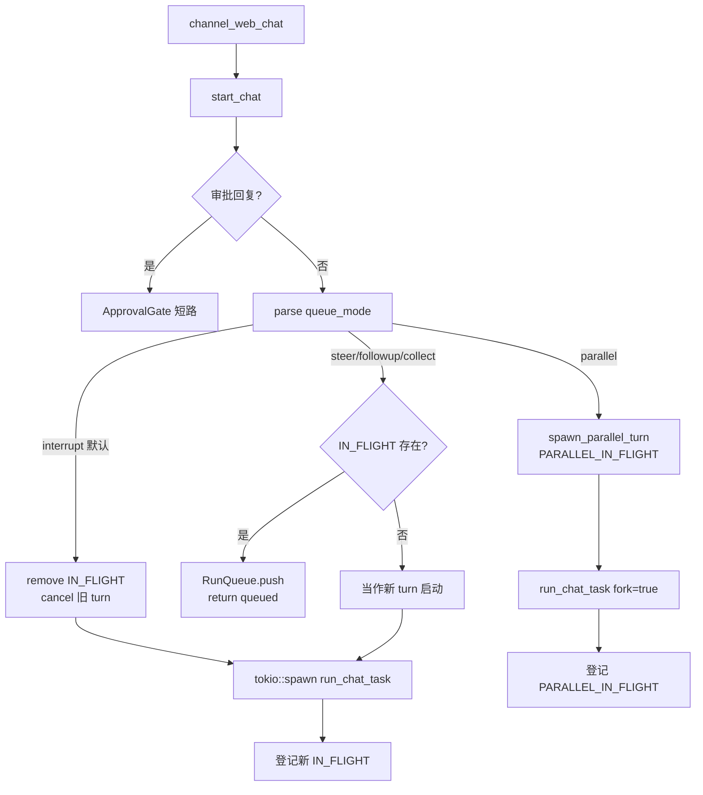

### 1.2 五态对照（产品 × 实现 × 账本）

| 模式 | abort 当前 turn | 消息何时进模型 | 核心结构 | 动哪本账（见 [ARCHITECTURE I.6](./ARCHITECTURE.md#i6-多份对话副本谁才是真相)） |
|------|-----------------|----------------|----------|--------------------------------|
| **interrupt** | ✅ cancel token | 新 turn 的 user | 替换 `IN_FLIGHT` | E 换新；旧 B 丢；旧轨 `chat_error` |
| **steer** | ❌ | 当前 turn **下一 checkpoint** | `RunQueue.steers` → Forwarder | E→B；A 滞后 |
| **collect** | ❌ | 同上，前缀「额外上下文」 | `RunQueue.collects` | 同 steer |
| **followup** | ❌ | **整段 turn 结束后** 再 `start_chat` | `drain_followups` | E 积压 |
| **parallel** | ❌ 旁路 | 独立 fork；历史快照 | `PARALLEL_IN_FLIGHT` | 独立 B'；append A |

### 1.3 Interrupt 时序

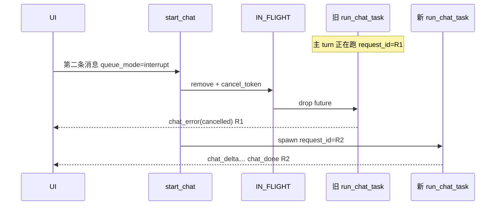

### 1.4 Steer 时序（#4456 Forwarder）

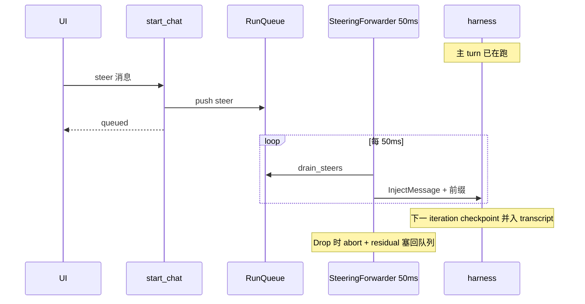

### 1.5 Followup 时序

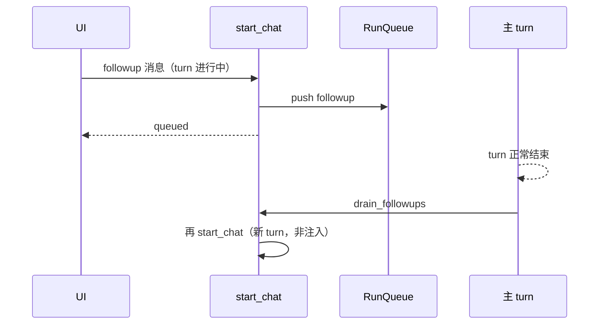

### 1.6 Parallel 时序

```mermaid
sequenceDiagram
    participant UI
    participant SC as start_chat
    participant MAIN as 主 IN_FLIGHT
    participant PAR as PARALLEL_IN_FLIGHT
    participant TS as THREAD_SESSIONS

    Note over MAIN: 主 turn R1 进行中
    UI->>SC: parallel 消息
    SC->>PAR: spawn fork=true
    Note over TS: Parallel 禁止读写 THREAD_SESSIONS
    PAR-->>UI: 独立 request_id=R2 流
    MAIN-->>UI: R1 流继续
    Note over UI: 必须按 request_id 分轨渲染
```

### 1.7 相关 RPC

| RPC 方法 | 作用 |
|----------|------|
| `openhuman.channel_web_chat` | 发送；返回 `request_id` |
| `openhuman.channel_web_cancel` | cancel；可指定 `request_id` |
| `openhuman.channel_web_queue_status` | 查看 RunQueue 深度 |
| `openhuman.channel_web_queue_clear` | 清空队列 |

### 1.8 `SessionCacheFingerprint`（何时重建 Agent）

| 字段 | 变了则重建 |
|------|------------|
| `model_override` | ✅ |
| `temperature` | ✅ |
| `target_agent_id` | ✅ |
| `provider_binding` | ✅ |
| `autonomy_signature` | ✅ |
| `model_registry_signature` | ✅（含 vision 开关） |
| `profile_signature` | ✅（SOUL/MEMORY/工具面） |

**Parallel (`fork=true`)**：永不碰 `THREAD_SESSIONS`，始终从历史快照建新 `Agent`。

---

## 2. 中间件全链（`assemble_turn_harness`）

**源码**: `agent/tinyagents/mod_part_04.rs` · `middleware_part_*.rs`

### 2.1 一图看全栈

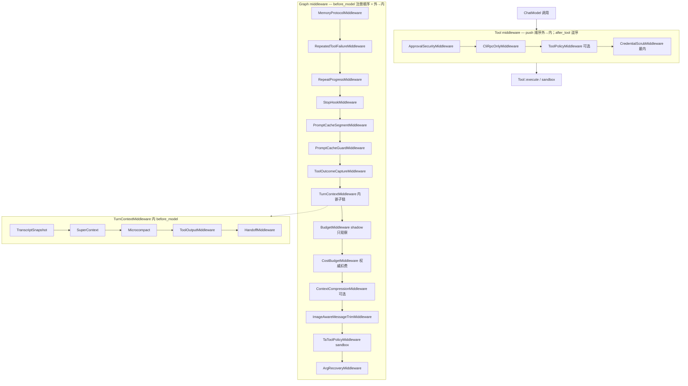

### 2.2 Graph 中间件明细

| # | 中间件 | 钩子 | 做什么 | 失败/暂停语义 |
|---|--------|------|--------|----------------|
| 1 | MemoryProtocolMiddleware | after_tool | 观察 memory 读→写→索引协议；违规追加纠正注 | 不 halt |
| 2 | RepeatedToolFailureMiddleware | after_tool | 同一错误连续 N 次 → steering halt | 暂停 run |
| 3 | RepeatProgressMiddleware | after_tool | 相同成功 tool+args 循环 → halt | 暂停 run |
| 4 | StopHookMiddleware | after_model | 预算/迭代上限等 stop_hooks 投票 | 暂停 run |
| 5 | PromptCacheSegmentMiddleware | before_model | 声明 KV cache 稳定前缀段 | — |
| 6 | PromptCacheGuardMiddleware | before_model | 检测 volatile 内容破坏 cache 布局 | 记录事件 |
| 7 | ToolOutcomeCaptureMiddleware | after_tool | 捕获**最终** cap 后 tool 结果供 UI/记录 | 须在 TurnContext **之前** push |
| 8 | TurnContextMiddleware | before/after | 见下表子链 | — |
| 9 | BudgetMiddleware (shadow) | before/after_model | **只观察** token；不 enforce | — |
| 10 | CostBudgetMiddleware | before_model | **权威** USD 日/月预算门 | 拒绝 model call |
| 11 | ContextCompressionMiddleware | before_model | 超 90% 窗口 → LLM 摘要旧消息 | 改 working transcript |
| 12 | ImageAwareMessageTrimMiddleware | before_model | 硬 cap；保护 system；图片 flat token | 删头部消息 |
| 13 | TaToolPolicyMiddleware | before_tool | 强制 adapter 声明的 sandbox 要求 | 拒绝 tool |
| 14 | ArgRecoveryMiddleware | before_tool | 修复畸形 JSON args | 可 coerce `{}` |

### 2.3 TurnContext 子链

| 子中间件 | 阶段 | 作用 |
|----------|------|------|
| TranscriptSnapshotMiddleware | before_model | 快照 transcript 供 handoff |
| SuperContextMiddleware | before_model | super_context 块注入 |
| MicrocompactMiddleware | before_model | 清空旧 tool body 占位 |
| ToolOutputMiddleware | after_tool | payload summarizer + tokenjuice + 字节 cap |
| HandoffMiddleware | after_tool | handoff 语义 |

**ToolOutput 四步**（对非 exempt 工具）：

1. 可选 **PayloadSummarizer**（超大结果 LLM 摘要）  
2. **TokenJuice** 压缩（agent 级 `tokenjuice_compression`）  
3. 单工具 char cap  
4. 共享 byte budget 回退  

**豁免**：`propose_workflow` 等 proposal 工具 compaction+truncation 全豁免；`get_tool_output_sample` 仅豁免 compaction。

### 2.4 Tool 中间件明细

| # | 中间件 | 顺序 | 作用 |
|---|--------|------|------|
| 1 | ApprovalSecurityMiddleware | 最外 | `external_effect` → `ApprovalGate` → Socket `approval_request` |
| 2 | CliRpcOnlyMiddleware | | CLI/RPC 专用工具禁止模型 loop 调用 |
| 3 | ToolPolicyMiddleware | | `ToolPolicy` + 频道 session 权限 |
| 4 | CredentialScrubMiddleware | 最内 | 结果脱敏（原始结果先 scrub） |

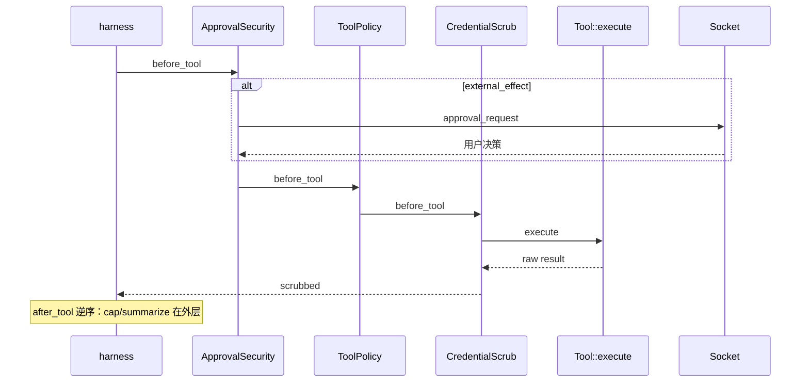

### 2.5 RunPolicy（harness 硬限制）

| 字段 | OpenHuman 默认 | 含义 |
|------|----------------|------|
| `max_model_calls` | `max_iterations`（有效 **10**） | 模型调用轮数上限 |
| `max_tool_calls` | iterations × 8 | 工具调用总上限 |
| `max_depth` | `MAX_SPAWN_DEPTH` = **3** | 子代理嵌套深度 |
| `max_wall_clock_ms` | **600000**（600s） | turn 墙钟 |
| retry | 3 次，500ms 指数退避 | 模型调用重试 |

环境变量：`OPENHUMAN_AGENT_TURN_TIMEOUT_SECS`（内层）· `OPENHUMAN_WEB_TURN_TIMEOUT_SECS`（外层 900s）。

---

## 3. Agent 字段全表

**定义**: `agent/harness/session/types.rs` · `Agent`  
**构建**: `AgentBuilder` → `build_session_agent` / `THREAD_SESSIONS` 复用

### 3.1 模型与采样

| 字段 | 类型 | 消费者 | 说明 |
|------|------|--------|------|
| `turn_model_source` | `TurnModelSource` | tinyagents | 每 turn 建 tiered ChatModel 集 |
| `model_name` | `String` | 路由、UI | 用户可见名 |
| `model_vision` | `bool` | image gate | BYOK vision 开关 |
| `temperature` | `f64` | ChatModel | profile 可覆盖 |

### 3.2 工具面（最易改错）

| 字段 | 说明 |
|------|------|
| `tools` | 全量 `Arc<Vec<Box<dyn Tool>>>` |
| `tool_specs` | 全量 spec |
| `visible_tool_specs` | **发给 provider 的 schema** |
| `visible_tool_names` | 主 agent 可见名；空=全部 |
| `subagent_tool_ceiling_names` | 委派 specialist 上限（可与主 agent 不同） |
| `tool_policy_session` | 频道权限快照 |
| `tool_dispatcher` | native vs prose 菜单 |
| `tool_policy` | `Arc<dyn ToolPolicy>` 异步策略 |
| `synthesized_tool_names` | 当前 `delegate_*` 合成工具名 |
| `pending_synthesized_tools_mask` | Arc 共享时待删的旧合成实例 |

**规则**：改可见性先动 `visible_tool_*`，再动 harness `CapabilityRegistry`；只改 `tools` 模型可能仍看不见。

### 3.3 记忆与上下文

| 字段 | 说明 |
|------|------|
| `memory` | 主 `Arc<dyn Memory>` |
| `shared_experience_memory` | dedicated profile 时合并 legacy |
| `memory_loader` | turn 前 recall |
| `last_memory_context` | 本 turn recall 文本；可转 subagent |
| `last_turn_citations` | UI source chips |
| `pending_citations` | 异步 recall JoinHandle（与推理重叠） |
| `context` | `ContextManager`：system builder、compact、session-memory 触发 |
| `trigger_memory_agent` | 定义级：是否在 prompt 前跑 memory agent |
| `tokenjuice_compression` | 工具结果 TokenJuice 配置 |

### 3.4 对话与 transcript

| 字段 | 真源角色 |
|------|----------|
| `history` | 进程内 `ConversationMessage[]`；每 turn extend |
| `cached_transcript_messages` | 冷启动 jsonl 前缀；首 turn `.take()` |
| `persisted_transcript_messages` | 上次落盘镜像；diff append |
| `session_transcript_path` | 固定 jsonl 路径 |
| `session_history` | `SessionHistory` seam |
| `session_history_locator` | 可注入测试 locator |
| `session_key` | `{unix_ts}_{agent_id}` |
| `session_parent_prefix` | 子代理目录链 |
| `session_raw_subdir` | `session_raw` 或 `session_raw-<profile>` |

### 3.5 身份与 profile

| 字段 | 可变性 | 用途 |
|------|--------|------|
| `agent_definition_id` | **不可变** | registry、`refresh_delegation_tools` |
| `agent_definition_name` | 可变 | transcript 路径 `{agent}` 组件 |
| `active_profile_id` | build 时固定 | experience scope、workspace guard |
| `personality_soul_md` | profile | IdentitySection |
| `personality_memory_md` | profile | 替代根 MEMORY.md |
| `memory_subdir` | profile | memory tree 子树 |
| `omit_profile` / `omit_memory_md` | 定义镜像 | system 冻结策略 |
| `workspace_descriptor` | optional | dedicated cwd |

### 3.6 Turn 运行时与控制

| 字段 | 说明 |
|------|------|
| `on_progress` | `mpsc::Sender<AgentProgress>` → Socket |
| `run_queue` | `Arc<RunQueue>` Steer/Followup |
| `post_turn_hooks` | 含 `ArchivistHook` |
| `archivist_hook` | session 结束 flush segment |
| `last_turn_usage_totals` | footer token/cost |
| `last_turn_hit_cap` | 撞 `max_iterations` |
| `pending_turn_overrides` | 下一 turn 一次性覆盖 |
| `event_session_id` / `event_channel` | 遥测 |

### 3.7 集成公告（mid-session）

| 字段 | 触发 |
|------|------|
| `connected_integrations` | Composio 工具包 |
| `connected_integrations_initialized` | 是否已预热 |
| `last_seen_integrations_hash` | 变更时 `refresh_delegation_tools` |
| `composio_integrations_rx` | 中途 connect 事件 |
| `announced_integrations` / `pending_integration_announcement` | 下条 user 注 |
| `announced_mcp_servers` / `pending_mcp_announcement` | MCP 同理 |
| `announced_skills` / `pending_skill_announcement` / `pending_skill_retraction` | Skill 目录变更 |
| `workflows` + `skill_events_rx` | workflow 磁盘变更 |
| `runtime_config` | Composio cache 热路径 |

### 3.8 路径与配置

| 字段 | 含义 |
|------|------|
| `workspace_dir` | 内部 DB、session_raw、conversations |
| `action_dir` | 工具默认 cwd（用户项目） |
| `config` | `AgentConfig` |
| `learning_enabled` / `explicit_preferences_enabled` | 学习与显式偏好注入 |
| `auto_save` | 会话自动保存 |
| `payload_summarizer` | orchestrator 超大 tool 结果摘要器 |

### 3.9 公开方法

| 方法 | 作用 |
|------|------|
| `turn(user, …)` | 主入口 |
| `run_single(msg)` | headless 单轮 |
| `set_on_progress` | 接 harness 事件 |
| `set_run_queue` | Steer/Followup 车道 |
| `set_agent_definition_name` | 改 transcript 名（不改 id） |
| `refresh_delegation_tools` | Composio 变更后重合成 delegate_* |
| `refresh_workflows` | Skill 安装变更 |

---

## 4. RPC 与 Socket 事件面

### 4.1 Web 聊天 RPC（完整参数）

**`openhuman.channel_web_chat`**

| 参数 | 必填 | 说明 |
|------|------|------|
| `client_id` | ✅ | **必须** = `socket.id` |
| `thread_id` | ✅ | UI 线程 id |
| `message` | ✅ | 用户正文 |
| `queue_mode` | | interrupt / steer / followup / collect / parallel |
| `model_override` | | 覆盖模型 |
| `temperature` | | 覆盖温度 |
| `profile_id` | | Agent profile |
| `locale` | | BCP-47；驱动回复语言 system 指令 |
| `speak_reply` | | TTS 播报最终回复 |
| `source` | | ptt / dictation / type |
| `session_id` | | PTT 关联 id |

**返回**（同步）：`{ accepted, request_id }` 或 `{ queued: true }` — **不是回答正文**。

**`openhuman.channel_web_cancel`**: `client_id`, `thread_id`, `request_id?`  
**`openhuman.channel_web_queue_status`**: `thread_id`  
**`openhuman.channel_web_queue_clear`**: `thread_id`

### 4.2 Socket 事件目录（`chatService.ts` 订阅）

| 事件名 | 阶段 | UI 用途 |
|--------|------|---------|
| `inference_start` | turn 开始 | loading / mascot thinking |
| `inference_heartbeat` | 每 ~20s | 长推理存活 |
| `iteration_start` | harness 新 iteration | 迭代指示 |
| `text_delta` | 流式 | 主气泡文字 |
| `thinking_delta` | 流式 | 思考块（若模型支持） |
| `tool_call` | 工具开始 | 时间线行 |
| `tool_args_delta` | 流式 args | 参数填充动画 |
| `tool_result` | 工具结束 | 时间线结果 |
| `subagent_*` | 委派 | 子代理进度面板 |
| `approval_request` | 审批 | 卡片停车 |
| `plan_review_request` | 计划审批 | PlanReviewGate UI |
| `task_board_updated` | todo | 任务板 |
| `chat_segment` | 分段 | 多气泡 |
| `chat_interim` | 中间态 | 临时 UI |
| `artifact_pending/ready/failed` | 制品 | 下载/预览 |
| **`chat_done`** | **成功终点** | 结束 loading；usage footer |
| **`chat_error`** | **失败终点** | 错误分类展示 |

**分轨键**：`request_id` + `seq`（单调序）。

### 4.3 事件管道

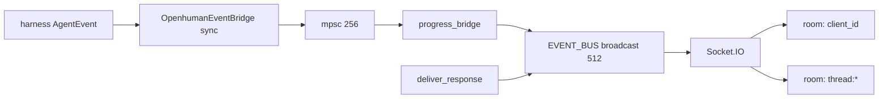

| 要点 | 说明 |
|------|------|
| `TurnCompleted` progress | ≠ UI 结束 |
| **`chat_done`** | 仅 `deliver_response` 发 |
| sync `on_event` | 不 await harness |

### 4.4 其它常见 RPC 族（按 DomainGroup）

| 前缀 | 域 | 示例 |
|------|-----|------|
| `openhuman.memory_*` | Memory | doc/chunk/query/sync |
| `openhuman.threads_*` | Threads | 列表、消息、标题 |
| `openhuman.config_*` | Config | 设置、profile |
| `openhuman.mcp_*` | MCP | registry、setup |
| `openhuman.skills_*` | Skills | 发现、运行 |
| `openhuman.flows_*` | Flows | 工作流图 |
| `openhuman.channel_*` | Channels | web + IM 配置 |
| `openhuman.approval_*` | Security | 审批决策写回 |

完整列表：`GET /schema` 或 `core/all.rs` `build_registered_controllers`。

---

## 5. web_chat 进程内实体

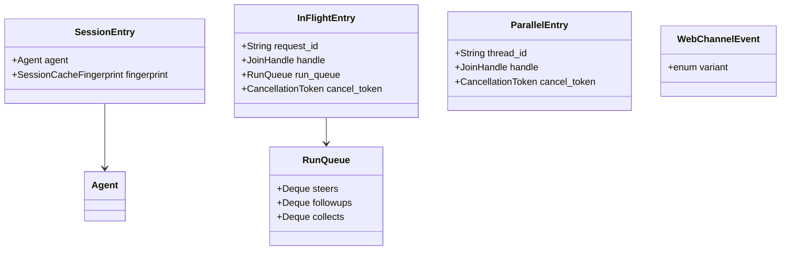

| 静态变量 | 类型 | 职责 |
|----------|------|------|
| `THREAD_SESSIONS` | `Mutex<HashMap<key, SessionEntry>>` | Agent 缓存 |
| `IN_FLIGHT` | `Mutex<HashMap<thread, InFlightEntry>>` | 主 turn |
| `PARALLEL_IN_FLIGHT` | `Mutex<HashMap<request_id, ParallelEntry>>` | 旁路 |
| `THREAD_BUDGET_SIGNALS` | 欠费误分类防护 | #3386 |
| `EVENT_BUS` | `broadcast(512)` | `WebChannelEvent` |

---

## 6. 委派与 Plan（实现速查）

### 6.1 `delegate_*` 合成规则

```text
orchestrator agent.toml [subagents] allowlist
  → collect_orchestrator_tools
  → 合成 delegate_<archetype> / delegate_<toolkit>
  → refresh_delegation_tools 随 Composio 连接集更新
```

子代理 **禁止** 注册 `delegate_*` / `spawn_subagent`（`mod_part_04` 硬拦）。

### 6.2 PlanReviewGate

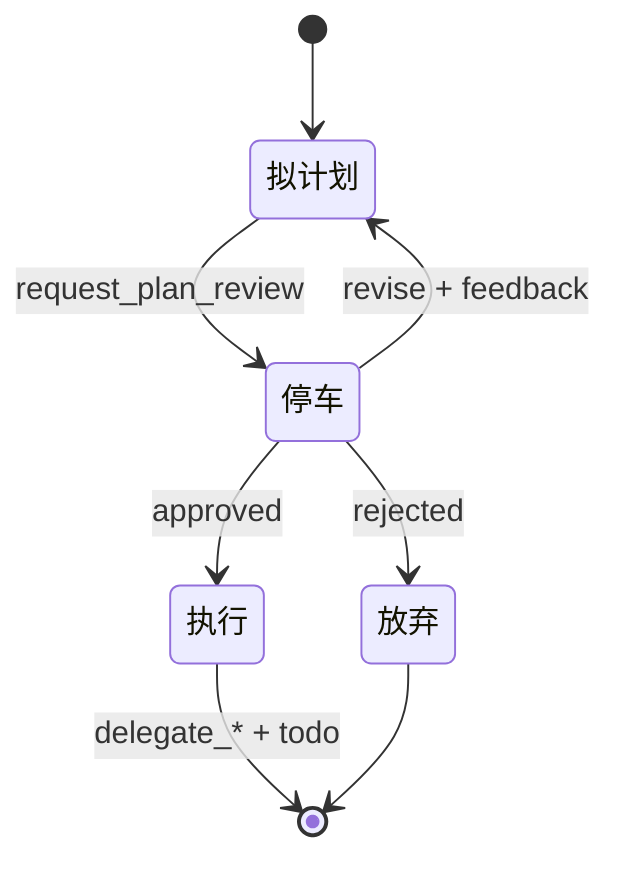

非交互 turn（cron）→ 自动 approve。

### 6.3 内置 Agent 角色

| id | tier | sandbox | 写 MEMORY.md |
|----|------|---------|--------------|
| orchestrator | chat | — | 对账时可 |
| planner | reasoning | read_only | 否 |
| code_executor | worker | 按策略 | 否 |
| researcher | worker | — | 否 |
| archivist | worker | — | **主写手** |
| skill_creator | worker | — | SKILL.md 主业 |

---

## 7. `run_chat_task` 逐步因果

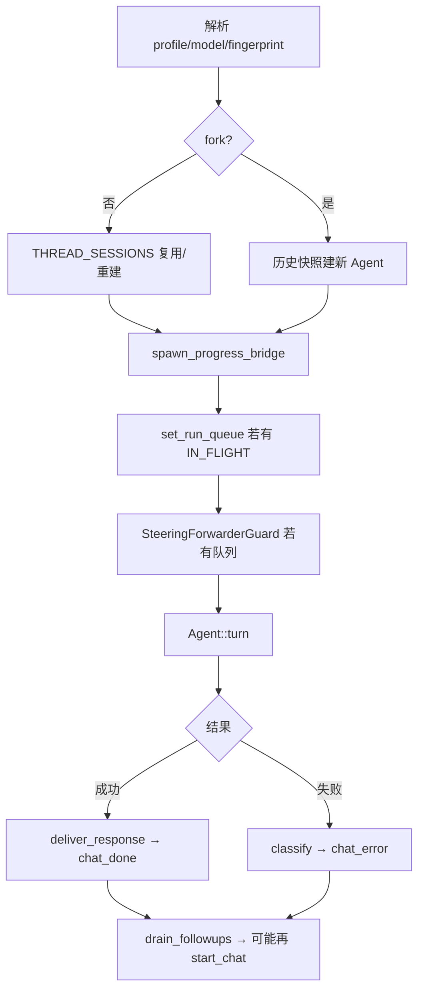

---

## 8. 易错点清单（改代码前扫一眼）

| # | 现象 | 根因 |
|---|------|------|
| 1 | await RPC 没回答 | 应订 Socket |
| 2 | 第二条消息掐掉第一条 | 默认 Interrupt |
| 3 | Steer 没立刻改回答 | 等 harness checkpoint |
| 4 | 取消后下条 Steer 乱套 | Forwarder 未 Drop（#4456） |
| 5 | 换模型配置没变 | fingerprint 未变/缓存未重建 |
| 6 | 收不到流式 | `client_id` ≠ `socket.id` |
| 7 | 模型看不到新工具 | 只改了 `tools` 未改 `visible_tool_*` |
| 8 | Parallel 气泡串线 | 未按 `request_id` 分轨 |
| 9 | async 子完成但父不知道 | 未 `wait_subagent` |
| 10 | 当轮看不见新 MEMORY.md | archivist 异步；下 turn system 才稳定 |

---

## 修订记录

| 版本 | 日期 | 说明 |
|------|------|------|
| 1.0 | 2026-09-04 | 首版：QueueMode、中间件、Agent 字段、RPC/Socket |
| **2.0** | 2026-09-04 | 合并 ARCHITECTURE Part II 技术附录；独立为 IMPLEMENTATION.md |

---

# 附录 D · 双层超时与 CoreBuilder 细节

## D.1 双层超时

| 层 | 默认 | 环境变量 | 断什么 |
|----|------|----------|--------|
| **内层 harness** | 600s | `OPENHUMAN_AGENT_TURN_TIMEOUT_SECS` | hung model/tool/subagent **mid-call** |
| **外层 web** | 900s | `OPENHUMAN_WEB_TURN_TIMEOUT_SECS`（0=关） | assembly/persist **卡死** harness 外 |

内层先触发 → `chat_error`（Timeout）；外层仅当整个 spawn future 永不完成。

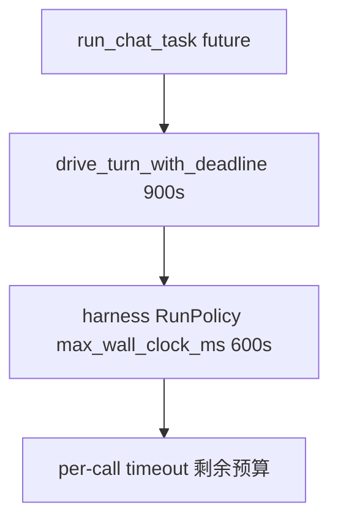

## D.2 CoreBuilder 与 CoreContext

**CoreBuilder**（`src/core/runtime/builder.rs`）在 `build()` 时合成 `CoreContext`：

| 字段/方法 | 职责 |
|-----------|------|
| `services: ServiceSet` | 是否起 HTTP、Socket、cron、memory_queue、harness_init… |
| `domains: DomainSet` | 哪些 `DomainGroup` 的 Controller / store / tools live |
| `host_kind` | Desktop / Headless / Embedded — 影响默认预设 |
| `build()` | 注册 Controller、种子 token、init store；**不绑端口** |
| `serve()` | 按 ServiceSet 起后台与 axum |

**CoreContext** 被每个 RPC handler `scope()` 注入：`workspace_dir` / `content_root`、`scope` 多租户过滤；Tauri 与 HTTP 共用 `invoke_method_inner`。

`web_chat` 域 **始终编译**；RPC 在 `DomainGroup::Channels`，注册不 gate — 产品核心聊天面。

## D.3 THREAD_SESSIONS 与 Budget 信号

```rust
static THREAD_SESSIONS: Lazy<Mutex<HashMap<String, SessionEntry>>> = ...
```

| 概念 | 说明 |
|------|------|
| `map_key` | `key_for(thread_id)` — 可能含 client 维度 |
| `SessionEntry` | `{ agent: Agent, fingerprint: SessionCacheFingerprint }` |
| 复用条件 | `entry.fingerprint == current_fp` |
| 失效 | model/profile/provider/temperature/target_agent 变 → 重建 |
| `fork: true` | Parallel：不碰缓存，从 history 快照建新 Agent |

**Budget 信号**（`THREAD_BUDGET_SIGNALS`，#3386）：

- managed 路由 credit 耗尽后 SSE 可能「空 200」
- 后续同 thread 空 turn 在 TTL 内可被重分类为 out-of-credits
- 信号按 **provider_binding** scoped，避免误伤已换 local/BYO 的 thread

## D.4 SharedToolAdapter 调用链

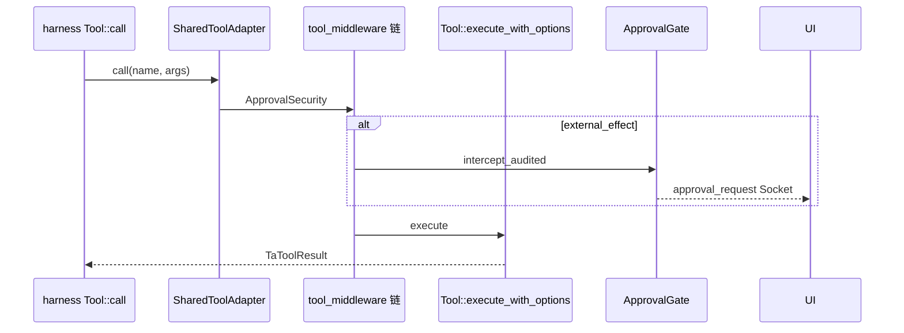

| 类型 | 文件 | 角色 |
|------|------|------|
| Agent `ToolPolicy` | `agent/tool_policy.rs` | async check → Allow/Deny/RequireApproval |
| `ToolPolicyMiddleware` | `tinyagents/middleware.rs` | 频道天花板 + policy |
| `ApprovalGate` | `approval/gate.rs` | 全局 HITL；`OPENHUMAN_APPROVAL_GATE=0` 可关 |

## D.5 与 Grok Build 对照（传输层）

| | OpenHuman | Grok Build |
|--|-----------|------------|
| 同步完成通道 | **无**（仅 RPC ack） | oneshot `PromptTurnResult` |
| 流式通道 | Socket.IO | ACP gateway SessionUpdate |
| 编排单元 | `web_chat` + `THREAD_SESSIONS` | `SessionActor` 队列 |
| 内层引擎 | vendored **tinyagents** harness | 自研 `process_conversation_turn` |

# 附录 A · 端到端流程（自 ARCHITECTURE Part II 迁入）

## A.1 全参与者 chatSend 时序

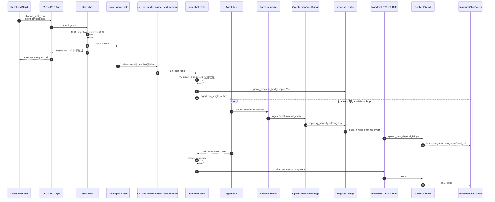

## A.2 异步边界

| ID | 类型 | 位置 | 载荷 / 语义 |
|----|------|------|-------------|
| A1 | `tokio::spawn` | `start_chat` | 整 turn future |
| A2 | `tokio::select!` biased | `run_turn_under_cancel_and_deadline` | cancel **或** turn 结果 |
| A3 | `tokio::time::timeout` | `drive_turn_with_deadline` | 外层 **900s** 兜底 |
| A4 | `CancellationToken` | per-turn | `channel_web_cancel`、Interrupt |
| A5 | `mpsc(256)` | progress_tx/rx | `AgentProgress` |
| A6 | `broadcast(512)` | `EVENT_BUS` | `WebChannelEvent` |
| A7 | `Mutex` async | `THREAD_SESSIONS`, `IN_FLIGHT` | Agent 缓存 / in-flight |
| A8 | sync `on_event` | `OpenhumanEventBridge` | harness → mpsc **不 await** |
| A9 | task-local | `with_origin`, `with_run_cancellation` | 审批、子 agent cancel |

## A.3 `Agent::turn` 外层阶段

| 阶段 | 行为 |
|------|------|
| 冻结/刷新 system | 首 turn 全量；后续差量 |
| super_context 门控 | orchestrator 首 turn 可选 context scout |
| `memory_loader.load_context` | 追加到 **user** 消息 |
| hooks PreTurn | — |
| `run_turn_via_tinyagents_session` | harness 入口 |
| 更新 `history`、usage、citations | 仅 **本 turn** conversation |
| `persist_session_transcript` | `session_raw/*.jsonl` |
| `post_turn_hooks` | ArchivistHook 等 |

## A.4 Steer/Collect 实现要点（#4456）

1. `SteeringForwarderGuard`：50ms 轮询 `drain_steers` / `drain_collects`  
2. Steer 前缀 `[User steering message]: `；Collect 前缀 `[Additional context from user]: `  
3. **Drop 一律** abort 轮询 + residual steer **塞回** `RunQueue`  
4. `RunQueue::push(Interrupt|Parallel)` 会 warn — 须在 `start_chat` 入口处理

## A.5 实体关系（实现向）

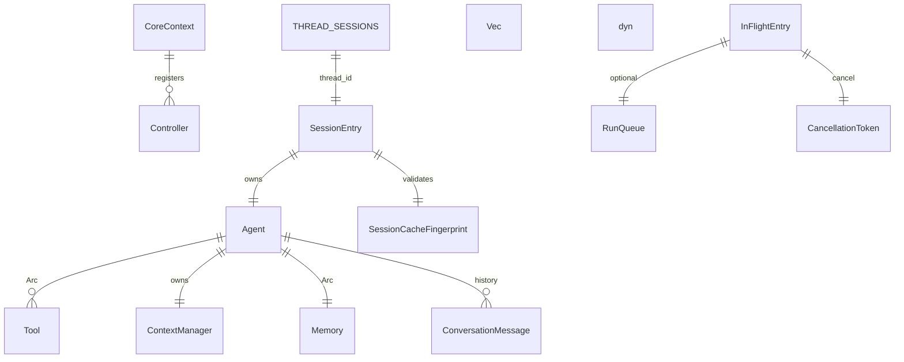

## A.6 CoreBuilder 与 DomainSet 预设

| 预设 | 典型场景 |
|------|----------|
| `full()` | 桌面全功能 |
| `harness()` | 嵌入式无 UI，仅进程内 invoke |
| `embedded()` | flows + medulla + channels，关 mcp/meet 等 |

## A.7 TurnStateStore 与 UI

| Phase | UI 表现 |
|-------|---------|
| assembling | 「准备中」 |
| inferencing | 流式 delta |
| tool_running | 工具时间线 |
| done / error | 结束态 |

RPC **不**携带 phase — Socket 事件更新 Redux。

## A.8 TinyagentsTurnOutcome

| 字段 | 消费者 |
|------|--------|
| `text` / `conversation` | UI、history.extend |
| `model_calls` / `tool_calls` | 遥测 |
| `input_tokens` / `charged_amount_usd` | footer |
| `hit_cap` | max_tool_iterations 暂停 |
| `early_exit_tool` | ask_user 澄清暂停 |

---

# 附录 B · Skill / MCP / Grok 对照

## B.1 Skill 体系

| 阶段 | 机制 |
|------|------|
| 发现 | `skills/ops_discover.rs` — user/project/profile 路径 |
| 注入 | system `## Installed Skills` 目录（#781 不把全文塞进 user） |
| 首 turn 冻结 | system skills 块冻结保 KV |
| mid-session | `pending_skill_announcement` 一次性 user 注 |
| 执行 | `run_skill` / `skill_runtime` 隔离 worker |

## B.2 MCP 与集成

| 层 | 工具示例 |
|----|----------|
| 静态 MCP | `mcp_list_servers`, `mcp_call_tool` |
| 动态 registry | `mcp_registry_*` ~11 工具 |
| Composio | `composio_*` 等 |
| Orchestrator prompt | `## Connected MCP Servers` + delegate |

`ServiceSet.mcp_boot` — 桌面启动 MCP server 进程。工具注册总入口：`tools/ops.rs` `build_agent_tools`。

## B.3 与 Grok Tool 对照

| | OpenHuman | Grok |
|--|-----------|------|
| 执行引擎 | tinyagents harness + middleware 栈 | Session `execute_tool_calls` |
| 适配器 | SharedToolAdapter | ToolBridge |
| 审批 | ApprovalGate middleware | Permission reverse-request |
| Skill | system 目录 + run_skill 隔离 | prompt_body 注入 |
| MCP | mcp_registry 动态 | McpState + register_mcp_tools |

---

# 附录 C · chatSend 叙事（白话）

1. **前端点发送**：RPC 很快回 `request_id`；字在 Socket 上。  
2. **`start_chat`**：默认 Interrupt；Steer/Collect/Followup/Parallel 见 §1。  
3. **`run_chat_task`**：非 Parallel 复用 `THREAD_SESSIONS`；Parallel 永远新建。  
4. **Turn 内**：harness 转，Socket 播；Steer 有 50ms forwarder。  
5. **结束**：`chat_done` 或 `chat_error`；Followup 可能再 `start_chat`。  

| 现象 | 原因 |
|------|------|
| await RPC 很久才「有字」 | 等错了通道 |
| 发第二条把第一条掐了 | 默认 Interrupt |
| 取消后 Steer 乱套 | Forwarder 未 Drop |

