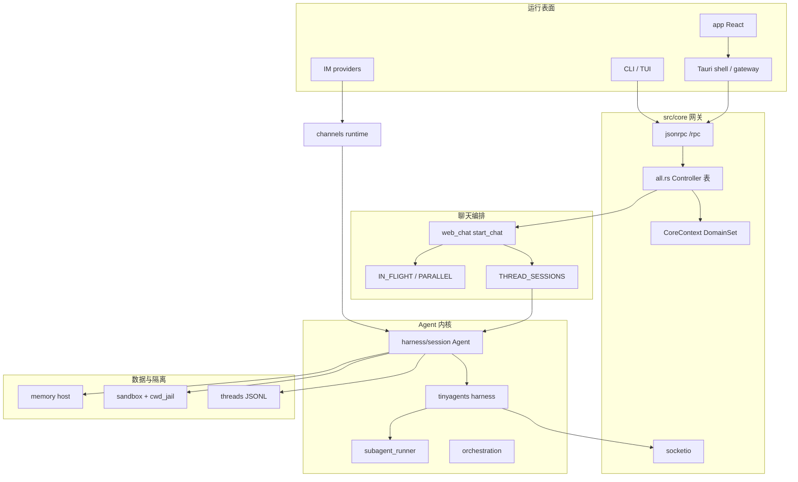
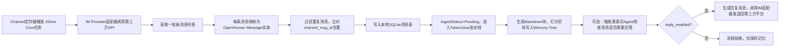
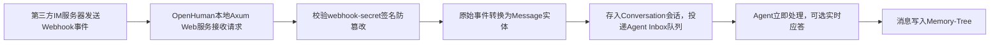
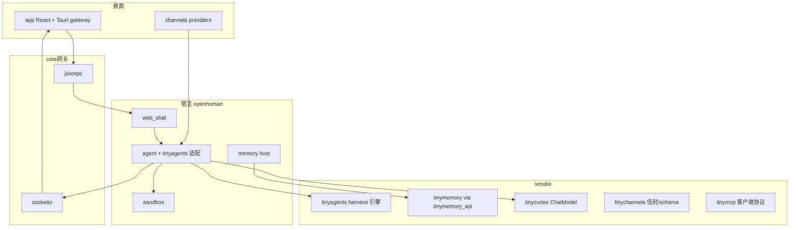
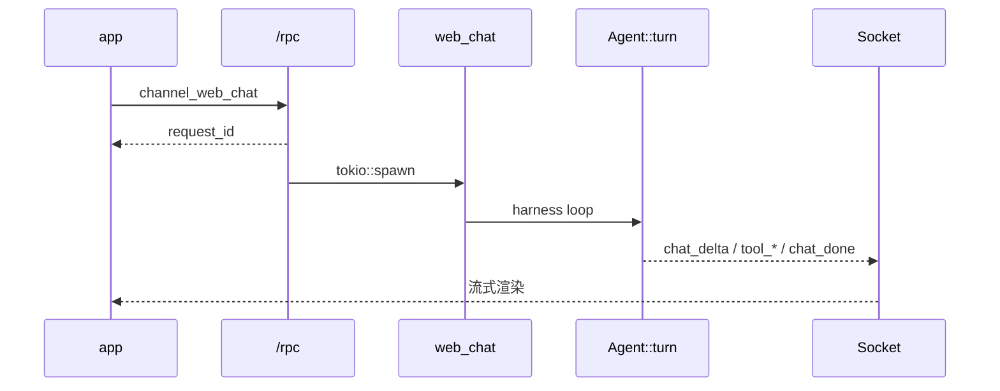
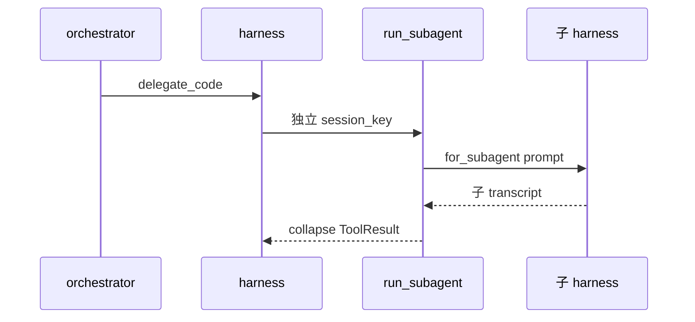
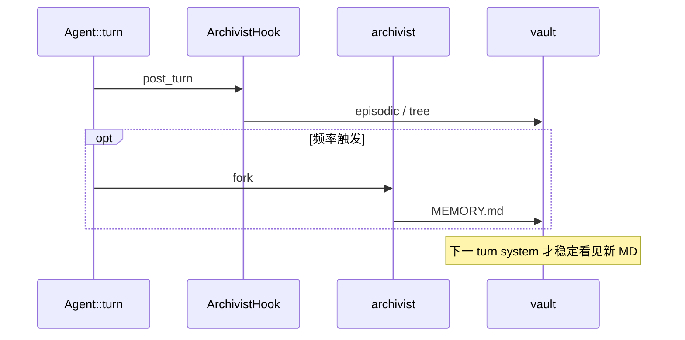

# OpenHuman 模块手册

> **版本**: 2.0 · 2026-09-04  
> **定位**: 目录在哪、每层干什么、端到端流程、vendor `tiny-*` 对照 — **三合一**，不丢内容  
> **架构概念**: [ARCHITECTURE.md](./ARCHITECTURE.md) · **实现图册**: [IMPLEMENTATION.md](./IMPLEMENTATION.md)

---

# 第一篇 · 分层与流程（按运行时层）

> 原 `MODULES_AND_FLOWS.md` 全文保留。

本文把产品拆成 **运行表面 → 传输网关 → 聊天编排 → Agent 内核 → 记忆 / 沙箱 / 工具**，每层写清：职责边界、内部子模块、关键类型、主流程。

---

## 0. 一页纸：真实分层（不是 tinybus 幻想图）

OpenHuman **不是**「16 个 tiny-* 包全靠事件总线互调」。运行时是：

```text
app/（React + Tauri）
  ├─ Gateway：选「连哪一个 core」（本机 / URL / Docker / SSH）
  ├─ JSON-RPC：受理（立刻 request_id）
  └─ Socket.IO：正文（chat_delta / tool_* / chat_done）

src/core/          ← 传输 + Controller 注册；不跑 Agent::turn
src/openhuman/     ← 业务域
  web_chat         ← 同 thread 队列、IN_FLIGHT、THREAD_SESSIONS
  agent            ← Agent::turn、harness、tinyagents 适配、委派
  memory           ← 宿主层；引擎在 tinymemory-core / tinymemory_api
  sandbox          ← 工具隔离后端 + cwd_jail
  channels         ← IM 入站（feature channels）
  tools / skills / mcp / inference / security / threads / platform / desktop
vendor/tiny*       ← 被 agent/memory/mcp/channels 适配，不是独立进程网状网
```



**硬规则**：`src/core` 禁止实现 turn；RPC 只回凭证；完成看 Socket。

---

## 1. App（呈现层）`app/`

### 1.1 职责

无状态视图 + 传输客户端。不跑 LLM、不持沙箱、不写 MEMORY.md。发送走 RPC，渲染走 Socket 事件按 `request_id` 分轨。

### 1.2 内部拆分

| 区域 | 路径 | 做什么 |
|------|------|--------|
| 页面 | `app/src/pages/` | Chat、Flows、Settings、Memory UI |
| 会话列表 | `features/conversations/` | thread 列表、标题 |
| 聊天运行时 | Redux `chatRuntimeSlice` 等 | 与 `threads/turn_state` 的 phase 对齐 |
| RPC | `services/coreRpcClient.ts` | `callCoreRpc` → 当前 gateway 的 `/rpc` |
| 聊天 | `services/chatService.ts` | `openhuman.channel_web_chat`；订 `chat_*` |
| Socket | `services/socketService.ts` / `coreSocket.ts` | `client_id` **必须等于** `socket.id` |
| Gateway | `services/gatewayService.ts` | 选 core 端点；凭证在 **Tauri store**，不进 renderer localStorage |
| 其它 | `harnessInitService`、`memorySourcesService`、`keyringApi` | 启动、记忆源、钥匙串 |

### 1.3 Gateway 内部细节

`gatewayService` 的「gateway」= **如何到达一个 OpenHuman core**：

| kind | 含义 |
|------|------|
| local | 本机 Tauri 内嵌 / 本机进程 core |
| URL | 别人已起的 HTTP core |
| Docker | 本机容器起 core |
| SSH / SSH+Docker | 远端机器上的 core |

激活 gateway 后，`core_rpc_url` + `core_rpc_token` 对 **所有** RPC 生效。壳层实现：`app/src-tauri/src/gateway/`。

### 1.4 主流程（桌面聊天）

```text
用户点发送
  → chatService.channel_web_chat({ thread_id, message, queue_mode, client_id })
  → RPC 立刻 { accepted, request_id }   // 不是回答
  → socketService 收 inference_start / text_delta / tool_call / chat_done
  → 同一 thread 第二条消息：queue_mode 决定打断/转向/排队/旁路（见 ARCHITECTURE I.6）
```

### 1.5 桌面专用域 `src/openhuman/desktop/`

| 子模块 | 职责 |
|--------|------|
| `app_state` | 桌面持久状态 |
| `dashboard` | 聚合面板 RPC |
| `notifications` | 系统通知 |
| `overlay` | 浮层窗 |
| `provider_surfaces` | 提供商 UI 描述 |
| `accessibility` | 无障碍 / 部分语音点击 |

Headless / embedded **不需要** 这组。

---

## 2. API / Gateway（传输层）`src/core/`

产品里常说的 **API** 就是 JSON-RPC 2.0；**进程内网关** 是 `CoreBuilder` + Controller 表。没有单独的「REST 业务 API」主路径。

### 2.1 文件地图

| 文件 | 职责 |
|------|------|
| `jsonrpc.rs` | `/rpc` 分发、`invoke_method`；feature `http-server` 才绑 Axum 监听、SSE、WS |
| `socketio.rs` | Socket.IO 桥：房间 `client_id`、`thread:` |
| `all.rs` | **全部** `RegisteredController`；`DomainGroup` 与目录家族 1:1 |
| `dispatch.rs` | 遗留分发（迁移中） |
| `cli.rs` | CLI 子命令走同一套 controller |
| `auth.rs` | RPC 认证 |
| `event_bus/` | 进程内 DomainEvent |
| `runtime/builder.rs` | `CoreBuilder`：`ServiceSet` × `DomainSet` × `host_kind` |
| `runtime/context.rs` | `CoreContext`：workspace、content_root、多租户 `scope` |

### 2.2 DomainGroup（裁剪轴）

Harness 族（`DomainSet::harness()` 开）：`Agent` / `Memory` / `Threads` / `Config` / `Security`。  
功能族（另加 Cargo feature）：`Flows` / `Skills` / `Mcp` / `Channels` / `Web3` / `Voice` / `Media`。  
`Platform`：`platform/`、`tools/`、`http_host/` 等无家族表面。  
`Desktop` / `Hosted`：桌面壳、托管后端，embedded 默认关。

`web_chat` **始终编译**；聊天 RPC 挂在 Channels 组但不被「关掉聊天」。

### 2.3 HTTP 表面（feature `http-server`）

| 路由 | 作用 |
|------|------|
| `POST /rpc` | JSON-RPC |
| `/schema` | 活着的 controller 列表 |
| health | 探活 |
| SSE / WS | 部分流式（主聊天仍以 Socket.IO 为准） |

`http_host` 域是另一回事：给目录起临时静态文件服务（Basic auth），**不是** 聊天 API。

### 2.4 调用链

```text
invoke_method_inner(method, params)
  → all.rs 查 RegisteredController
  → DomainSet.allows(DomainGroup) 否则 unknown-method
  → handler(params) 注入 CoreContext::scope()
  → 聊天：channel_web_chat → start_chat → tokio::spawn → 立刻返回 request_id
```

---

## 3. 聊天编排 `web_chat/`（Session 的「交通指挥」）

路径：`src/openhuman/web_chat/`。

### 3.1 子模块

| 文件 | 职责 |
|------|------|
| `ops.rs` | `start_chat`、`channel_web_chat` / `_cancel` / queue_*；`IN_FLIGHT` |
| `run_task.rs` | `run_chat_task`：fingerprint、复用 Agent、progress bridge、`Agent::turn` |
| `session.rs` | 组 system suffix、locale、model override |
| `types.rs` | `SessionEntry`、`InFlightEntry`、`QueueMode`、fingerprint |
| `event_bus.rs` | `WebChannelEvent` broadcast |
| `progress_bridge.rs` | harness 事件 → Socket 可消费事件（mpsc 256） |
| `presentation/` | `deliver_response`、分段、`chat_done` |
| `web_errors.rs` | 错误分类（预算、限流、provider） |

### 3.2 进程内状态（不落盘）

| 结构 | 粒度 | 含义 |
|------|------|------|
| `THREAD_SESSIONS` | thread → `{ Agent, fingerprint }` | 主 turn 缓存脑子 |
| `IN_FLIGHT` | 每 thread 一条 | 可 Interrupt/Steer 的主 turn + `RunQueue` |
| `PARALLEL_IN_FLIGHT` | `request_id` | QueueMode::Parallel 旁路 |
| `THREAD_BUDGET_SIGNALS` | provider_binding | 空 200 / 欠费误分类防护 |

Fingerprint 变（模型 / profile / temperature / target_agent / provider）→ **必须重建 Agent**。  
Parallel **禁止** 读写 `THREAD_SESSIONS`。

### 3.3 QueueMode 五态（产品语义）

| 模式 | 行为 |
|------|------|
| Interrupt（默认） | cancel 旧 turn，开新 turn |
| Steer | 注入当前 harness 下一 checkpoint（前缀 `[User steering message]`） |
| Collect | 同上，前缀「额外上下文」 |
| Followup | 当前 turn **结束后** 再 `start_chat` |
| Parallel | fork 历史快照，独立 `request_id` 流；完成后 append 会话 |

详情与「五本账」见 [ARCHITECTURE I.6 / II.1.8](./ARCHITECTURE.md#i6-多份对话副本谁才是真相原同步规则)。

### 3.4 超时

| 层 | 默认 | 环境变量 |
|----|------|----------|
| harness 墙钟 | 600s | `OPENHUMAN_AGENT_TURN_TIMEOUT_SECS` |
| web spawn 外层 | 900s | `OPENHUMAN_WEB_TURN_TIMEOUT_SECS`（0=关） |

取消：`CancellationToken` drop future；`SteeringForwarderGuard` 必须 Drop abort（#4456）。

---

## 4. 核心 Agent `agent/`

路径：`src/openhuman/agent/`。这是「脑子」，不是 IM Channel。

### 4.1 顶层子模块

| 模块 | 职责 |
|------|------|
| `harness/session` | **`Agent` 结构体**、`AgentBuilder`、`Agent::turn` |
| `harness/subagent_runner` | `run_subagent`：独立 session_key、瘦 prompt、结果 collapse |
| `harness/run_queue` | steers / followups / collects 三车道 |
| `harness/definition*` | Agent TOML：tier、sandbox_mode、tool scope、allowlist |
| `harness/archivist` | session-memory 频率 → fork archivist 写 MEMORY.md |
| `tinyagents/` | 适配 vendored harness：`assemble_turn_harness`、中间件、`SharedToolAdapter`、Steer forwarder |
| `registry/agents/` | 内置人格：orchestrator、planner、code_executor、researcher、archivist… |
| `orchestration/` | 产品控制面：teams、workflow_runs、async 子代理 ledger（**不是** ReAct 内循环） |
| `prompts/` | `SystemPromptBuilder`：SOUL / IDENTITY / USER / MEMORY.md |
| `triage/` | webhook/cron 入站分类 escalate/silence |
| `plan_review/` | `PlanReviewGate`：人批计划（不是 Grok edit gate） |
| `session_db` | run ledger / checkpoint |
| `tools/` | 内置 agent 工具：delegate、todo、ask_clarification、plan_exit… |
| `tool_policy` | Allow / Deny / RequireApproval |
| `progress` / `progress_sink` / `progress_tracing` | 流式进度与 OTel/Langfuse span |
| `turn_origin` | 任务本地信任标签（web / channel / cron / subconscious）→ 审批门 |
| `profiles` | 人格 profile、dedicated workspace |
| `task_dispatcher` | builtin vs workflow |
| `host_runtime` | NativeRuntime：本机 shell（与 sandbox 共用 `platform_shell`） |

### 4.2 `Agent` 内部（进程内会话对象）

定义：`harness/session/types.rs`。分组：

| 组 | 关键字段 | 注意 |
|----|----------|------|
| 模型 | `turn_model_source`, `model_name`, `temperature` | 每 turn 再建 ChatModel |
| 工具 | `tools` 全量 vs `visible_tool_*` 发给模型 | 只改 `tools` 模型可能看不见 |
| 记忆 | `memory`, `memory_loader`, `last_memory_context` | 召回拼 **user** |
| 对话 | `history`；`cached_transcript_messages` 冷启动一次性 `.take()` | ≠ SQLite messages 表幻想 |
| 身份 | `agent_definition_id` 不可变；`name` 可变 | transcript 路径用 name |
| 路径 | `workspace_dir` ≠ `action_dir` ≠ content vault | 别混 |
| 上下文 | `ContextManager` | trim / microcompact / autocompact |

公开入口：`turn`、`run_single`、`set_on_progress`、`set_run_queue`。

### 4.3 单 turn 流程（外层 + 内层）

**外层** `Agent::turn`（`harness/session/turn/core.rs`）：

```text
冻结/刷新 system（首 turn 全量，后续差量，保 KV cache）
  → 可选 super_context / context_scout（orchestrator 首 turn）
  → memory_loader.load_context 拼到 user
  → PreTurn hooks
  → run_turn_via_tinyagents_session
  → history.extend(本 turn conversation)
  → persist session_raw jsonl
  → post_turn hooks（ArchivistHook 等）
```

**内层** tinyagents loop：

```text
before_model 中间件链
  → ChatModel 流式
  → 若 tool_calls：SharedToolAdapter → tool 中间件 → Tool::execute
  → after_tool 逆序
  → 直到无 tool 或撞 max_model_calls（有效默认 10）
```

中间件全表见 [IMPLEMENTATION §2](./IMPLEMENTATION.md#2-中间件全链assemble_turn_harness)。

### 4.4 内置 Agent 角色（主聊天默认 orchestrator）

| 定义 | 典型能力 | 写仓库？ |
|------|----------|----------|
| orchestrator | 路由、`delegate_*`、计划审批、记忆对账 | 自己不 shell/写码 |
| planner | `sandbox_mode=read_only`，DAG/验收 | 否 |
| code_executor | 写文件、shell | 是（进沙箱） |
| researcher / retrieve_memory | 检索 | 否 |
| archivist | `update_memory_md` | 只 MEMORY.md / SKILL.md |
| skill_creator | SKILL.md | 技能文件 |

层级：`chat` → `reasoning` 或 `worker`；**禁止同 tier 互 spawn**。深度 `MAX_SPAWN_DEPTH = 3`。

---

## 5. 多 Agent（三条产品轨，不要合成一条）

### 5.1 轨 A：委派（主路径）

入口：orchestrator `subagents` allowlist → 合成 **`delegate_*`** 工具。

```text
父 turn 调 delegate_plan / delegate_code / …
  → harness::run_subagent
       独立 session_key、可选独立 workspace
       SystemPromptBuilder::for_subagent（更瘦）
  → 子跑完整 harness
  → 子历史 collapse 成一条 ToolResult 回父
```

异步变体：

| API | 回父时机 |
|-----|----------|
| 阻塞 `delegate_*` / `spawn_parallel_agents` | 结束即一段 ToolResult |
| `spawn_async_subagent` | 登记 running；必须 `wait_subagent` 才进父上下文；可用 `steer_subagent` |

实现分布：

- 执行循环：`harness/subagent_runner`
- 图扇出：`tinyagents` + `orchestration/spawn_parallel_graph`
- 可恢复团队图：`orchestration/agent_teams`（ledger，不塞主 chat 全文）
- 父工具：`agent/tools/delegate.rs`、`orchestration/tools`

### 5.2 轨 B：QueueMode::Parallel

同 thread **旁路聊天**，不是 specialist。状态在 `PARALLEL_IN_FLIGHT`。UI 必须按 `request_id` 分气泡。

### 5.3 轨 C：会议 / 团队产品面

| 模块 | 是什么 |
|------|--------|
| `agent_meetings`（meet feature） | 会议 bot，可唤醒 orchestrator |
| `orchestration/agent_teams` | lead/worker 任务图，状态在 SQL/JSON ledger |
| `orchestration/workflow_runs` | tinyflows 阶段 DAG 调度 |

选型表见 [ARCHITECTURE II.4.3](./ARCHITECTURE.md#ii43-多-agent三条产品面不要合成一条)。

---

## 6. Session 概念对照（最容易混）

OpenHuman 里至少 **五套「会话」**，不要用一个 AgentSession 类去套：

| 名字 | 真源 | 寿命 | 用途 |
|------|------|------|------|
| **UI thread** | `threads/` + conversations JSONL | 跨进程 | 聊天列表、标题、turn_state 镜像 |
| **THREAD_SESSIONS** | `web_chat` 内存 HashMap | 进程 | 复用 `Agent` |
| **Agent（session 对象）** | `harness/session` | 可跨 turn | history + 工具 + 记忆句柄 |
| **session_raw transcript** | `session_raw/*.jsonl` | 跨进程 | cold resume 前缀 |
| **子代理 session_key** | `{ts}_{agent_id}` + parent prefix | 随子任务 | 隔离 transcript |
| **IM Conversation** | `channels` + tinychannels | 外部会话 | Slack/Telegram thread ≠ web thread |

**没有** 文档早期幻想的「InboxQueue 持久表 + LlmMessage 即领域模型」作为主路径。  
发给模型的消息由 `history` + harness working transcript + 压缩中间件 **当轮组装**。

`threads/` 内部：`ops` / `schemas` / `turn_state` / `goals` / `todos` / `transcript_view` / `title`。  
`TurnStateStore` 的 assembling / inferencing / tool_running / done 经 Socket 同步前端。

---

## 7. Memory

### 7.1 宿主 vs 引擎

| 层 | 路径 | 职责 |
|----|------|------|
| 宿主 | `src/openhuman/memory/` | RPC、Agent 工具、guard、driver 绑定、Obsidian 桌面策略、PII scrub |
| 契约 | `tinymemory_api` | 新代码应依赖此 crate |
| 引擎 | `tinymemory-core`（vendor） | SQLite/向量、树、ingest、queue；**不进发布二进制的直接依赖叙事以 api 为准** |

宿主子模块：`ops`、`read_rpc`、`tools`、`query`、`guard`、`driver`、`agent`（记忆 agent）、`conversations` / `people` / `goals`（RPC 薄封装）、`safety`、`source_scope`。

### 7.2 产品三套账（实现口径）

| 层 | 存储 | 模型怎么看见 |
|----|------|----------------|
| Turn / 会话 | `Agent.history` + harness 工作副本 | 每 turn 采样 |
| Session 落盘 | `session_raw` jsonl | resume `.take()`，不是每条灌 prompt |
| 跨会话 | vault/tree + FTS + **MEMORY.md** | 从不整库灌 |

读：

- System：SOUL / IDENTITY / USER / 冻结的 MEMORY.md（orchestrator 默认）
- User：`memory_loader` → `[User working memory]`、`[Prior conversations]`、cross-chat
- 深挖：`delegate_retrieve_memory` / `memory_query` 工具，**不是每 turn 自动子代理**

写（三条，别混）：

1. **ArchivistHook** post-turn：episodic FTS / 段 / tree（非 LLM）  
2. **archivist 子代理**：频率触发 `update_memory_md` → MEMORY.md  
3. **transcript_ingest**：启发式 `high.*` 喂 Prior conversations  

压缩（ContextCompressionMiddleware）改 **送模本**，不改长期树。  
个性化块中文全文：[OPENHUMAN_RUNTIME_PROMPTS.md](./OPENHUMAN_RUNTIME_PROMPTS.md)。

### 7.3 与「三层记忆树」概念稿的关系

`sub_modle.md` / ARCHITECTURE 后半的 SourceTree/TopicTree/GlobalTree、TokenJuice 改 Message.markdown、Inbox 重启丢失等，是 **产品愿景/早期模型**。实现以 `memory_tree` + vault + MEMORY.md + FTS/向量 为准；外部源走 `memory/sources` + `memory/sync`（Composio 等），后台 `subconscious` / cron / `memory_queue` 消化。

---

## 8. Sandbox

路径：`src/openhuman/sandbox/`。

### 8.1 三件事分开

| 问题 | 谁负责 |
|------|--------|
| 工具 **在哪跑** | sandbox backend |
| 工具 **允不允许** | `tool_policy` + ApprovalGate |
| 要不要 **逃到宿主机** | `ElevatedOp` |

Gateway/core **永远在宿主机**。shell / fs / process 等进沙箱。

### 8.2 后端

| `SandboxBackendKind` | 行为 |
|----------------------|------|
| `None` | 直接宿主机（开发默认） |
| `Local` | `cwd_jail`：Linux Landlock / macOS Seatbelt / Windows AppContainer |
| `Docker` | 容器 + workspace mount、网络/CPU/内存上限 |

`cwd_jail/`：`jail` / `detect` / `noop` / 分平台实现。路径监禁 **无论** 选哪种 backend 都可以叠加。

Agent 定义里的 `sandbox_mode`（如 planner `read_only`）经 `harness/sandbox_context` 进当轮策略。  
执行入口：`ops::execute_in_sandbox`、`create_sandbox_backend`、`resolve_sandbox_policy`。

RPC：`sandbox.*`（schemas/ops）给 UI 看状态、切策略。

### 8.3 与 Runtime 池

`runtime/{node,python,pool}` 是 **语言运行时托管**（Node/Python 进程池），不是 Docker 沙箱本身。技能/脚本执行常：policy → sandbox cwd → runtime pool。

---

## 9. Tools · Skills · MCP · Inference

### 9.1 Tools `tools/`

| 子模块 | 职责 |
|--------|------|
| `ops.rs` | `build_agent_tools` + DomainSet 过滤 |
| `registry/` | 元数据、denials |
| `policy` / `agent_policy` | 频道天花板 |
| `toolpacks/` | 分组打包 |
| `impl/*`（分散在各域 `tools.rs`） | 具体 Tool trait |

执行链：harness → `SharedToolAdapter` → ApprovalSecurity → CliRpcOnly → ToolPolicy → CredentialScrub → `Tool::execute_with_options`。

### 9.2 Skills `skills/`（feature `skills`）

发现：`ops_discover`（user/project/profile 路径 + 信任文件）。  
注入：system `## Installed Skills` 目录，**不**把 SKILL 全文塞进 user（#781）。  
执行：`skill_runtime` 隔离 worker；正文不进主 transcript。

### 9.3 MCP `mcp/`

| 子模块 | 职责 |
|--------|------|
| `host` | 本进程 tinymcp 服务、配置转换、代理策略 |
| `registry` | 动态安装 RPC + agent 工具 + 远程描述注入扫描 |
| `audit` | 写操作审计 RPC |
| `server` | 把 OpenHuman **自己**暴露成 MCP Server（stdio/HTTP） |

协议客户端在 `tinymcp` crate。

### 9.4 Inference `inference/`

| 子模块 | 职责 |
|--------|------|
| `provider/` | 云/本地 ChatModel 路由、鉴权、错误 |
| `local/` | Ollama / LM Studio / Piper |
| `http/` | OpenAI 兼容 `/v1/chat/completions` |
| `embeddings/` | 向量 |
| `tokenjuice/` | 压缩/AST 相关（推理侧） |
| `voice/` | STT/TTS 实现（与产品 `voice/` 域配合） |

---

## 10. Channels（IM 网关，不是 web_chat）

路径：`src/openhuman/channels/`，feature `channels`。

| 子模块 | 职责 |
|--------|------|
| `providers/*` | Telegram、Discord、Slack、邮件、iMessage、QQ、Lark… |
| `runtime` / `relay_runtime` | 入站 → thread/session_key → 可能 cancel 旧任务 → 跑 harness |
| `host` | 通道进程生命周期 |
| `bus` | DomainEvent 入站信封 |
| `proactive` | 主动推送 |
| `cli` | **始终编译** 的 stdin REPL |

与 web 聊天 **平行**：IM 不走 `THREAD_SESSIONS` 同一套 UI 缓存；共享 Agent/harness 内核。

---

## 11. 其它横切模块（补齐地图）

| 家族 | 路径 | 要点 |
|------|------|------|
| 配置 | `config/`、`profiles` | 用户设置、workspace |
| 安全 | `security/approval`、`keyring`、`prompt_injection` | HITL 闸、`OPENHUMAN_APPROVAL_GATE` |
| 调度 | `cron/`、`heartbeat`、`subconscious` | 定时 prompt、潜意识循环 |
| 平台 | `platform/` | doctor、health、socket、update、cost、startup |
| 托管 | `hosted/`、`hosting/` | 远端后端；workspace 上云工具（feature hosting） |
| Medulla | `medulla/` | 与编排 world/presence 同步 |
| Flows | `flows/` + tinyflows | 与聊天 Plan **正交** |
| Web3 | `web3/` | wallet / swap / x402 |
| Voice/Meet/Media | feature 门控 | 语音会议、生图 |
| Search | `search/` | 搜索工具 |
| Integrations | `integrations/`、`composio` | 第三方能力折叠进 orchestrator |
| Hooks | `hooks/` | `hooks.json` 观察/闸，**永不 feature 裁掉** |
| Modules | `modules/` | 可加载模块注册（feature modules） |

---

## 12. 端到端流程清单

### 12.1 桌面 chatSend

见 §1.4 + ARCHITECTURE II.1.2 / II.7。

### 12.2 工具调用 + 审批

```text
模型 tool_call
  → ApprovalSecurityMiddleware
  → 若 external_effect：ApprovalGate 停车
  → Socket approval_request
  → 用户 RPC 决策
  → 若消息是审批回复：start_chat 短路，不进 QueueMode
  → Tool::execute（可能 execute_in_sandbox）
  → after_tool → 下一 iteration
```

### 12.3 委派子代理

见 §5.1。父 turn **不结束**；子是工具调用。

### 12.4 记忆读写（一轮对话）

```text
turn 前：load_context → user 块；system 已有 MEMORY.md（若未 omit）
turn 中：可选 memory 工具
turn 后：ArchivistHook；频率满足则 fork archivist 改 MEMORY.md
下一 turn：新 MEMORY.md 才进 system（异步，当轮常看不见）
```

### 12.5 IM 入站

```text
Provider webhook/poll
  → channels runtime 标准化信封
  → 映射 thread / conversation
  → harness 一轮（triage 可 silence）
  → outbound intent → Provider send
  → 记忆 ingest 异步
```

### 12.6 换 Gateway

```text
gatewayService.activate
  → Tauri 存凭证
  → 之后所有 callCoreRpc 打新 URL
  → Socket 需重连；THREAD_SESSIONS 在 **新 core 进程** 里是空的
```

---

## 13. 读源码顺序（建议）

1. `app/src/services/chatService.ts` + `coreRpcClient.ts` + `gatewayService.ts`  
2. `src/core/all.rs`（DomainGroup）+ `jsonrpc.rs` 入口  
3. `web_chat/ops.rs` → `run_task.rs`  
4. `agent/harness/session/turn/core.rs`  
5. `agent/tinyagents/mod.rs`（`assemble_turn_harness`）  
6. `agent/harness/subagent_runner`  
7. `memory/mod.rs` + `agent/harness` 里 memory_loader  
8. `sandbox/ops.rs` + `cwd_jail`  
9. `security/approval/gate.rs`  
10. `channels/runtime`（若做 IM）

核对符号：在 `openhuman/src/` 下 `grep`；路径以模块 `mod.rs` 文档注释为准。

---

## 14. 文档边界（避免再混）

| 文档 | 用途 |
|------|------|
| **本文** | 模块边界 + 内部拆分 + 流程（实现） |
| ARCHITECTURE.md | QueueMode、记忆/Plan、Pi/Grok 对照 |
| IMPLEMENTATION.md | 五态时序、中间件全链、Agent 字段、RPC/Socket |
| MODULES.md | 目录清单速查 |
| OPENHUMAN_RUNTIME_PROMPTS.md | 模型看见的中文 prompt |
| sub_modle.md / 长生命周期文档 | 早期 tiny-* 概念；**与实现冲突时以本文 + 源码为准** |

---

# 第二篇 · 域目录索引（按 `src/openhuman/`）

> 原 `PACKAGE_MODULES.md` 全文保留。权威列表仍以 `src/openhuman/mod.rs` 为准。

---

## 1. Agent 与编排（15+）

| 模块 | 路径 | 职责 |
|------|------|------|
| `agent` | `agent/` | Harness：Session、Turn、Transcript、Tool loop、Subagent、Prompt |
| `tinyagents` | `tinyagents/` | **适配层**：`run_turn_via_tinyagents_shared`、delegation 图、checkpoint、middleware |
| `agent_registry` | `agent_registry/` | 内置 Agent TOML（orchestrator、researcher、planner 等 30+） |
| `agent_orchestration` | `agent_orchestration/` | 团队、并行扇出、agent_teams 图 |
| `orchestration` | `orchestration/` | World model、presence、Medulla 同步 |
| `agent_memory` | `agent_memory/` | Agent 侧记忆上下文加载 |
| `agent_experience` | `agent_experience/` | 体验/反馈相关 |
| `agent_meetings` | `agent_meetings/` | Meet 后端 bot（feature meet） |
| `agent_tool_policy` | `agent_tool_policy/` | 工具策略 |
| `agentbox` | `agentbox/` | Agent 沙盒容器相关 |
| `harness_init` | `harness_init/` | Harness 启动初始化 |
| `plan_review` | `plan_review/` | 计划审查 |
| `team` | `team/` | 团队抽象 |
| `thread_goals` | `thread_goals/` | 线程目标 |
| `todos` | `todos/` | 待办 |
| `subconscious` | `subconscious/` | 后台反思循环 |
| `subconscious_triggers` | `subconscious_triggers/` | 潜意识触发器 |

**Agent 子树重点**:

```
agent/
├── harness/session/     # AgentBuilder, Agent::turn, transcript
├── harness/subagent_runner/
├── triage/              # 外部事件分类 escalate/silence
├── dispatcher.rs        # ToolDispatcher
├── prompts/             # 系统提示资源
└── task_dispatcher/     # 任务分发到 builtin/workflow
```

---

## 2. Memory 栈（12）

| 模块 | 职责 |
|------|------|
| `memory` | **编排**：sync/query/remember、ingest_pipeline、RPC `memory_*` |
| `memory_store` | **存储**：Markdown Vault + SQLite（chunks/entities/vectors/kv） |
| `memory_tree` | 桶密封、flush、摘要、树检索 |
| `memory_sync` | Composio / workspace / MCP 同步管道 |
| `memory_tools` | Agent 读写信记忆工具 |
| `memory_sources` | 数据源适配 |
| `memory_queue` | 抽取任务队列 |
| `memory_diff` | Git 变更账本 |
| `memory_goals` | 目标关联记忆 |
| `memory_conversations` | JSONL 线程/消息 |
| `memory_search` | 搜索门面 |
| `tinycortex` | vendored 记忆引擎适配缝 |
| `embeddings` | 向量嵌入 |
| `learning` | 学习相关（与通道解耦） |

详见 [MODULES.md §7 Memory](./MODULES.md#7-memory) 与 [ARCHITECTURE §II.4.1](./ARCHITECTURE.md#ii41-memory长短期怎么分怎么读写怎么个性化)。

---

## 3. 工具与运行时（12）

| 模块 | 职责 |
|------|------|
| `tools` | `Tool` trait、注册表、`tools/impl/*` 内置工具族 |
| `tool_registry` | 工具元数据注册 |
| `tool_status` / `tool_timeout` | 状态与超时 |
| `sandbox` | 沙箱后端（Docker/Landlock/Seatbelt） |
| `cwd_jail` | 工作目录监狱 |
| `runtime_node` | Node.js 托管运行时 |
| `runtime_python` / `runtime_python_server` | Python 运行时 |
| `runtime_pool` | 运行时池 |
| `javascript` | JS 执行辅助 |
| `search` | 搜索工具 |
| `tokenjuice` | Token 压缩（TokenJuice / AST） |

---

## 4. Skills 与 Flows（6，feature 门控）

| 模块 | Feature | 职责 |
|------|---------|------|
| `skills` | `skills` | SKILL.md 元数据、类型（load-bearing types 常开） |
| `skill_runtime` | `skills` | 工作流执行、`skill_executor` agent |
| `skill_registry` | `skills` | 远程目录 |
| `flows` | `flows` | 保存的 tinyflows 图、调度 |
| `tinyflows` | `flows` | 引擎适配 |
| `rhai_workflows` | `flows` | `.ragsh` Rhai 工作流工具 |

---

## 5. 推理与模型（2）

| 模块 | 职责 |
|------|------|
| `inference` | ChatModel 构造、OpenAI-compat HTTP、本地 whisper 等 |
| `provider_surfaces` | 提供商 UI 表面 |

---

## 6. MCP（4，feature `mcp`）

| 模块 | 职责 |
|------|------|
| `mcp_server` | 将 OpenHuman 暴露为 MCP Server |
| `mcp_registry` | Smithery 动态安装（SQLite） |
| `mcp_client` | TOML 静态 MCP 服务集（`sanitize`/`client` 常开） |
| `mcp_audit` | 写操作审计 |

---

## 7. 通道与 Web（8+）

| 模块 | Feature | 职责 |
|------|---------|------|
| `web_chat` | 常开 | 应用内聊天 RPC `channel.*` |
| `channels` | `channels` | Telegram/Discord/Slack/… 运行时 |
| `webview_accounts` / `webview_apis` / `webview_notifications` | `channels` | CEF 账号桥 |
| `whatsapp_data` | `channels` | WhatsApp 数据工具 |
| `composio` | — | Composio 集成 |
| `integrations` | — | 通用集成 |
| `webhooks` | — | Webhook 入站 |
| `credentials` | — | 凭证存储 |

---

## 8. 会话与线程（5）

| 模块 | 职责 |
|------|------|
| `threads` | 对话线程、消息、turn-state |
| `session_db` | Run ledger / checkpoint |
| `session_import` | 会话导入 |
| `context` | Prompt 组装、session-memory 触发 |
| `web_chat` | 与 UI 绑定的聊天通道 |

---

## 9. Web3 / 计费（6，feature `web3` 等）

| 模块 | 职责 |
|------|------|
| `wallet` | 多链钱包 |
| `web3` | Swap/bridge/dapp |
| `x402` | x402 支付 |
| `tinyplace` | Agent 社交网络、E2E |
| `billing` / `cost` | 计费与成本 |

---

## 10. Meet / Voice / Media（feature 门控）

| 模块 | Feature |
|------|---------|
| `voice`, `audio_toolkit` | `voice` |
| `meet`, `meet_agent` | `meet` |
| `media_generation`, `image` | `media` |

---

## 11. 平台与横切（40+）

| 类别 | 模块示例 |
|------|----------|
| 配置 | `config`, `profiles`, `app_state`, `dev_paths` |
| 安全 | `security`, `approval`, `encryption`, `prompt_injection`, `keyring`, `keyring_consent` |
| 调度 | `cron`, `scheduler_gate`, `heartbeat`, `task_sources` |
| 存储 | `file_storage`, `file_state`, `workspace`, `artifacts` |
| 可观测 | `monitor`, `proc_metrics`, `health`, `doctor`, `connectivity` |
| 更新 | `update`, `migration`, `migrations` |
| UI 支撑 | `dashboard`, `notifications`, `announcements`, `overlay`, `about_app` |
| 其他 | `devices`, `people`, `referral`, `recall_calendar`, `tls`, `socket`, `startup`, `service`, `util` |

---

## 12. `src/core` 传输模块（非 openhuman）

| 模块 | 职责 |
|------|------|
| `all.rs` | Controller 注册表、`DomainGroup` |
| `jsonrpc.rs` | `/rpc` HTTP |
| `cli.rs` | CLI 子命令 |
| `dispatch.rs` | 遗留分发（迁移中） |
| `runtime/` | `CoreBuilder`, `CoreRuntime`, `DomainSet`, `ServiceSet` |
| `event_bus/` | 事件总线 |
| `socketio.rs` | Socket.IO 桥 |
| `auth.rs` | RPC 认证 |

---

## 13. 如何读一个新域

1. 读 `README.md`（若有）
2. `schemas.rs` → RPC 方法名与参数
3. `ops.rs` → 业务逻辑
4. `store.rs` → 持久化
5. `tools.rs` → Agent 工具
6. `bus.rs` → 订阅了哪些 `DomainEvent`

注册点：在 `src/core/all.rs` 搜索 `namespace` 或模块 `all_registered_controllers`。

```mermaid
flowchart LR
A[React前端 chatSend 调用chatService.ts] --> B[JSON‑RPC调用 openhuman.channel_web_chat]
B --> C[Rust内核接收，生成Message实体]
C --> D[投递消息到Agent‑Session Inbox队列]
D --> E[触发 WebChannelEvent::inference_start 通过Socket.IO推送UI]
E --> F[Agent编排器取出消息]
F --> G[检索MemoryTree获取历史上下文]
G --> H[LLM推理，流式生成回答]
H --> I[逐块推送StreamChunk事件给前端]
I --> J[推理完成 InferenceComplete事件]
J --> K[Agent回答Message写入Conversation消息列表]
K --> L[消息送入TokenJuice压缩，写入Memory‑Tree]
```





## OpenHuman 完整数据流（入站 + 出站）

### 入站链路（用户上行）

```
IM平台事件 → TinyChannels‑Provider(适配器)
→ 标准化成 ChannelInboundEnvelope
→ 投递 Domain‑Event‑Bus
→ TurnDispatcher / ChannelInboundSink【消费 inbound】
    ├─生成 thread‑id(session_key)
    ├─查询活跃任务、旧任务cancel互斥
    └─chat‑harness 开启Agent Turn循环
→ Agent执行（可spawn子Agent，每个子会话独立Inbox队列）
```

### 出站链路（Agent 下行回复）

```
Agent输出 → ChannelOutboundIntent事件 → Domain‑Event‑Bus
→ ChannelManager / TinyChannels 出站分发器 【消费出站事件】
→ Provider发送API回IM → 送达用户
```


---

# 第三篇 · vendor `tiny-*` 概念对照

> 原 `sub_modle.md` 全文保留。


## 先纠正一个常见误解

| 旧说法（本文档 v1） | 实际情况 |
|---------------------|----------|
| 16 个 tiny-* **独立微服务** | 同仓库 **Rust 库**（`vendor/`），被 `openhuman` 宿主 **直接链接调用** |
| 模块间 **只靠 tinybus**，禁止函数调用 | 主路径：**JSON-RPC + Socket + `Agent::turn` 函数链**；`DomainEvent` 仅部分域（channels、memory sync） |
| `tinyruntime` 持有 `agent.history` | **`Agent.history`** 在 `agent/harness/session` |
| `tinybox` 独立沙箱进程 | **`sandbox/` + `cwd_jail`** 在宿主内选后端 |
| IM 消息先进 InboxQueue 再推理 | **web_chat**：`start_chat` → `run_chat_task`；**channels**：runtime 直接开 turn |

---

## 真实分层（一图）



---

## 概念名 → 源码映射表

| 概念 / 旧 tiny-* 名 | 读哪里 | 干什么 |
|---------------------|--------|--------|
| Supervisor / Worker | `agent/registry` + `harness/subagent_runner` | `delegate_*` 工具 → 子 harness |
| Planner | `planner` agent.toml | 只读沙箱 + `request_plan_review` |
| agent.history | `Agent.history` | `ConversationMessage[]` |
| TokenJuice 流水线 | `inference/tokenjuice` + memory ingest | 切块进 vault；**不**改写 history |
| 记忆树 / Chunk | `memory/` + tinymemory | SQLite + vault md；FTS/向量/tree-walk |
| Obsidian 镜像 | vault 导出 | **单向** SQLite → md |
| 潜意识循环 | `subconscious` + `cron` + `heartbeat` | 空闲消化 queue；非 tinyhosts 进程 |
| IM 通道 | `channels/providers/*` | 入站信封 → turn |
| 外部连接器 | `memory/sources` + `memory/sync` | Gmail/Slack/文件夹 ingest |
| MCP 网关 | `mcp/host` + tinymcp | 动态 server + 审计 |
| 沙箱 | `sandbox/` | None / Local jail / Docker |
| 凭证 | `security/keyring` | 密钥环；非独立 tinywallet 服务 |
| 工作流 | `flows/` + tinyflows | 与聊天 Plan **正交** |
| 对外 SDK | `tinyhumans-sdk`（若嵌入） | 薄 RPC 客户端；**不是**总线中枢 |

---

## 三条核心流程（校正版）

### 1. 用户聊天（桌面）



### 2. 委派子 Agent



### 3. 记忆：对话结束后的异步沉淀



---

## 依赖约束（仍成立）

1. **记忆引擎不反向拉起聊天 turn**（ingest 是队列/worker，不是 `delegate` 回环）。  
2. **Obsidian md 不作真源**；读记忆走 API/SQLite。  
3. **底层库不依赖** `web_chat` 编排细节（依赖方向：宿主 → vendor）。  
4. 长任务应用 **orchestration ledger** 或 **async subagent**，不要假设 Supervisor「挂起让出 CPU」——父 turn 在等 tool_result。

---

## 源码阅读顺序（精简）

1. `app/src/services/chatService.ts`  
2. `web_chat/ops.rs` → `run_task.rs`  
3. `agent/harness/session/turn/core.rs`  
4. `agent/tinyagents/mod.rs`（`assemble_turn_harness`）  
5. `harness/subagent_runner`  
6. `memory/mod.rs`  
7. `sandbox/ops.rs`

详细字段与中间件链 → [ARCHITECTURE Part II](./ARCHITECTURE.md#part-ii--源码深潜)。
