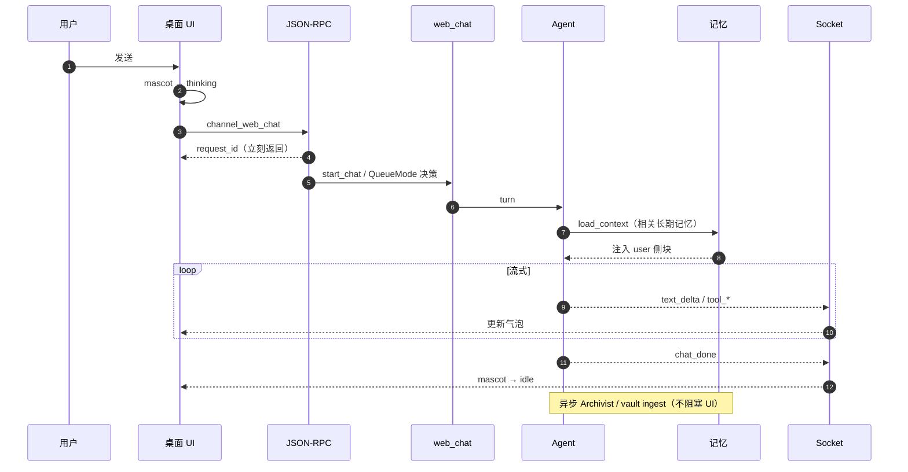
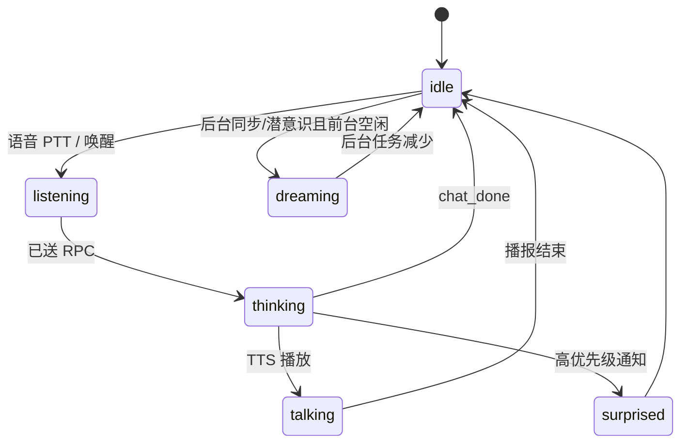
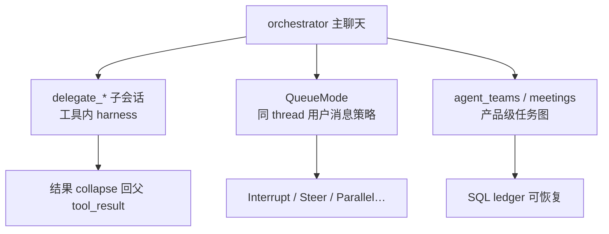
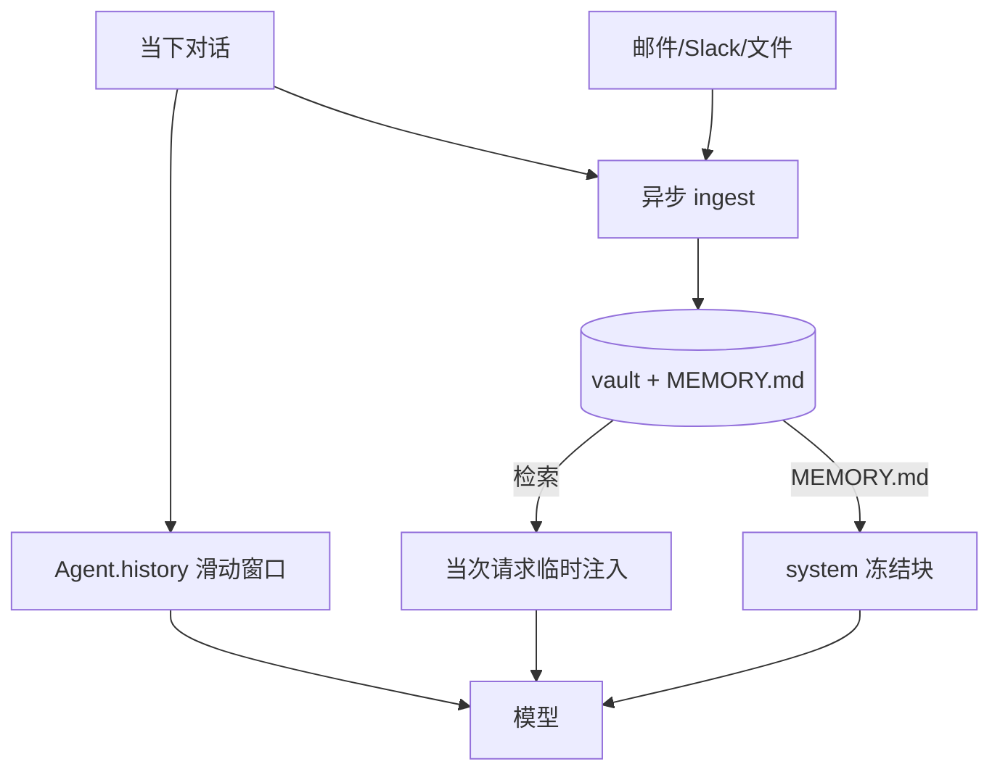
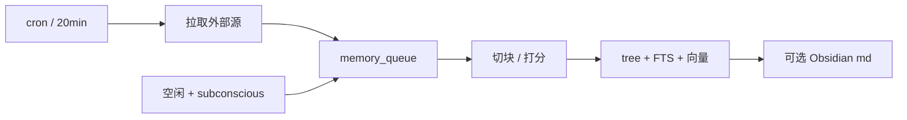
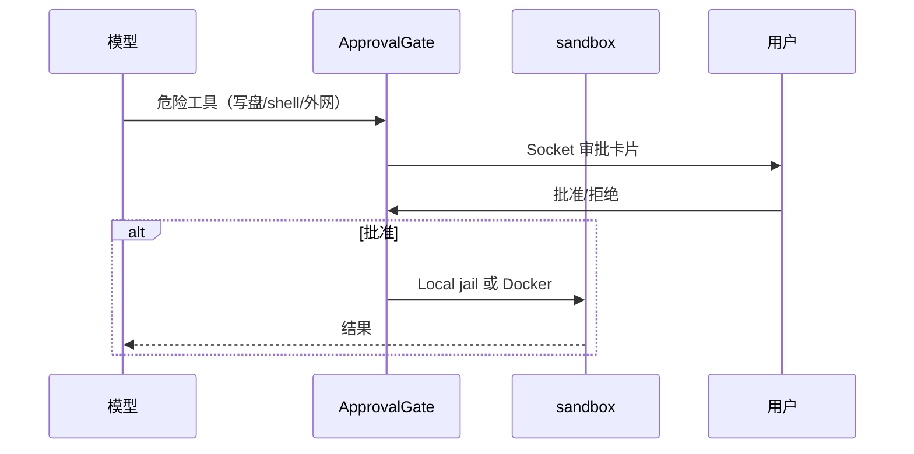

# OpenHuman 产品架构（长生命周期陪伴）

> **版本**：3.0 · 2026-09-04  
> **定位**：陪伴型产品的 **为什么** 与 **用户可感知行为**；实现见 [ARCHITECTURE.md](./ARCHITECTURE.md) · [IMPLEMENTATION.md](./IMPLEMENTATION.md) · [MODULES.md](./MODULES.md)。

---

## 1. 产品是什么

OpenHuman 是 **本地优先** 的个人 Agent：不只回答一次问题，而是 **跨天记住你**、在后台消化邮件/聊天/文档、用可读 MEMORY.md 与 vault 沉淀，并在桌面与 IM 上持续在场。

| 特质 | 用户可感知 | 实现锚点（源码） |
|------|------------|------------------|
| 长生命周期 | 昨天聊过的偏好今天仍记得 | MEMORY.md + vault 召回 |
| 陪伴在场 | 吉祥物状态、通知、托盘 | Socket 事件 → `mascotService` |
| 后台思考 | 空闲时「做梦」、同步邮件 | `subconscious` + `memory/sync` |
| 多源记忆 | 不只聊天，还有 Gmail/Slack | `memory/sources` ingest |
| 可委派 | 复杂事先规划再写码 | `delegate_*` + PlanReviewGate |
| 隐私本地 | 数据在 workspace，非纯云会话 | `workspace_dir` / vault |

**架构范式（实现）**：双通路记忆（短期 `history` vs 长期 vault）+ orchestrator 委派 + 异步潜意识 ingest — 见 [ARCHITECTURE §I.8–I.9](./ARCHITECTURE.md#i8-长生命周期陪伴产品面--实现)。

---

## 2. 用户眼里的一条消息（端到端）



**关键**：UI `await` RPC **拿不到回答**；回答只在 Socket 上。第二条消息默认 **Interrupt** 打断上一轮，不是自动排队续写。

---

## 3. UI 表现层：Backend-Driven

前端 **无业务真源**：不持久化 transcript、不跑推理。路径：`app/`（非旧稿 `ui/`）。



| 状态 | 典型驱动事件 |
|------|----------------|
| thinking | `inference_start`、工具进行中 |
| talking | TTS + viseme 帧 |
| dreaming | 系统事件：memory sync / subconscious 活跃 |
| surprised | 紧急通知、审批待处理 |

约束：**状态只能由内核事件改**，前端不自行从 idle 切 thinking。

---

## 4. 通信：双通道，不是「总线包办一切」

| 通道 | 承载 | 特点 |
|------|------|------|
| **JSON-RPC** `POST /rpc` | 命令、设置、**聊天受理** | `channel_web_chat` 只回 `request_id` |
| **Socket.IO** | 流式正文、工具时间线、审批 | `client_id` = `socket.id` |

```mermaid
flowchart LR
    UI[React] -->|命令| RPC[/rpc]
    UI -->|订阅| SIO[Socket.IO]
    RPC --> CORE[src/core 分发]
    CORE --> OH[openhuman 域]
    OH --> SIO
    SIO --> UI
```

**Gateway**（Tauri）：切换「连哪个 core」（本机 / 远程 URL / Docker / SSH）。切换后 RPC 基址变、Socket 重连、对方进程内会话缓存为空。

---

## 5. Agent 编排：一个脑子，三种并行语义



| 场景 | 用哪种 | 用户可见现象 |
|------|--------|----------------|
| 「帮我调研并写总结」 | `delegate_researcher` | 主聊天气泡内出现工具时间线 |
| 边等回答边问另一个问题 | `queue_mode=parallel` | **两条** request_id 流并行 |
| 回答过程中改要求 | `steer` | 当前 turn 下一 checkpoint 改向 |
| 跨天项目协作 | agent_teams | 任务板 / 会议面，非普通单聊 |

规划：**PlanReviewGate** 让人批步骤；**没有** Grok 式「只能改 plan 文件」的全局模式。详见 [ARCHITECTURE §I.10](./ARCHITECTURE.md#i10-多-agent-三轨选型一张表)。

---

## 6. 记忆：陪伴感的来源

### 6.1 双通路（必记）



- **聊天原文**走 history；被 compact 裁掉后，原文仍在 jsonl / vault，靠 **检索摘要** 捞回。  
- **用户说「记住这个」**：orchestrator 可 `memory_store` + `update_memory_md` 对账。  
- Prompt 中文全文：[OPENHUMAN_RUNTIME_PROMPTS.md](./OPENHUMAN_RUNTIME_PROMPTS.md)。

### 6.2 后台消化（长生命周期核心）



不阻塞正在进行的聊天；吉祥物 `dreaming` 可反映此阶段活跃。

---

## 7. 安全与沙箱（用户信任）



写代码、跑命令走 **code_executor** 委派 + 沙箱；orchestrator 本身不直接持写仓库工具。

---

## 8. 与旧版本文档的差异（勘误）

| 旧稿描述 | 更正 |
|----------|------|
| `ui/src/store/state.ts` | 现为 `app/src/` + `mascotService` 等 |
| `crates/rpc` + 全局 `SystemEvent` 总线 | `src/core/jsonrpc` + 域内 `DomainEvent`；聊天不靠总线 |
| `AgentSession` + `InboxQueue` 持久队列 | 进程内 `Agent` + `web_chat` 队列 |
| SQLite `messages` 表驱动 LLM | `Agent.history` + jsonl；memory 另库 |
| tinyhosts 独立潜意识服务 | `subconscious` 域 + cron |

---

## 9. 阅读路径

| 你想… | 读 |
|--------|-----|
| QueueMode / 中间件 / Agent 字段 / RPC | **[IMPLEMENTATION.md](./IMPLEMENTATION.md)** |
| 改聊天/队列/Steer | IMPLEMENTATION §1 |
| 改记忆注入/ MEMORY.md | [ARCHITECTURE II.4.1](./ARCHITECTURE.md#ii41-memory长短期怎么分怎么读写怎么个性化) |
| 改委派/子代理 | [ARCHITECTURE I.5.4](./ARCHITECTURE.md#i54-委派子-agentdelegate_) |
| 查目录 / 分层流程 | [MODULES.md](./MODULES.md) |
| tiny-* 概念对照 | [MODULES.md](./MODULES.md) 第三篇 |

**维护**：产品行为变更时先改 ARCHITECTURE Part I 图，再回写本节表格。
