# OpenManus — 架构概念图谱（全维度）

> **定位**：按 Session/Memory/Loop/Tool/队列/多 Agent/Plan 等维度逐项展开；**诚实标注有/无**。  
> **前置**：[ARCHITECTURE_PART1.md](./ARCHITECTURE_PART1.md) · [全量](../../OpenManus/docs/ARCHITECTURE_DESIGN.md)  
> **源码**: `OpenManus/app/`

---

## 目录

- [0. 全维度能力矩阵](#0-全维度能力矩阵)
- [1. 端到端全景](#1-端到端全景)
- [2. Session 与会话身份](#2-session-与会话身份)
- [3. Memory 与对话历史](#3-memory-与对话历史)
- [4. 长短期记忆](#4-长短期记忆)
- [5. 压缩 Compaction](#5-压缩-compaction)
- [6. Loop 双层结构](#6-loop-双层结构)
- [7. Tool 管线](#7-tool-管线)
- [8. Skill](#8-skill)
- [9. Sandbox 与执行隔离](#9-sandbox-与执行隔离)
- [10. 多 Turn](#10-多-turn)
- [11. 队列与中途输入](#11-队列与中途输入)
- [12. 多 Agent](#12-多-agent)
- [13. Plan 与任务规划](#13-plan-与任务规划)
- [14. App / Gateway / 客户端](#14-app--gateway--客户端)
- [15. 长时任务](#15-长时任务)
- [16. 缓存](#16-缓存)
- [17. 跨框架对照](#17-跨框架对照)

---

## 0. 全维度能力矩阵

| 维度 | OpenManus | 实现锚点 | 说明 |
|------|-----------|----------|------|
| **Session** | ❌ | — | 无 session_id；单次 `run()` |
| **短期 Memory** | ✅ | `Memory.messages` | 内存列表，cap 100 |
| **长期 Memory** | ❌ | — | 无 MEMORY.md / 向量 |
| **压缩** | ⚠️ 极简 | 尾截断 | 非 LLM 摘要 |
| **外层 Loop** | ⚠️ | `PlanningFlow` | 可选；默认无 |
| **内层 Loop** | ✅ | `BaseAgent.run` | think→act × max_steps |
| **Tool** | ✅ | `ToolCollection` | BaseTool + MCP 代理 |
| **Skill** | ❌ | — | 无 skill 模块 |
| **Sandbox** | ⚠️ | `SandboxManus`, Daytona | 变体级，非默认 |
| **多 Turn** | ✅ | max_steps 内多 step | 非跨 run |
| **队列** | ❌ reject | `state != IDLE` 抛错 | 无 steer/queue |
| **多 Agent** | ⚠️ | PlanningFlow executors | 非并行多 Role |
| **Plan** | ⚠️ | `PlanningFlow` + `PlanningTool` | Plan-and-Execute 示例 |
| **App 层** | ⚠️ | `main.py` CLI | 无 Web 主体 |
| **Gateway** | ❌ | — | |
| **长时任务** | ❌ | — | 无 checkpoint |
| **缓存** | ❌ | — | |

---

## 1. 端到端全景

### 1.1 默认单 Agent 路径

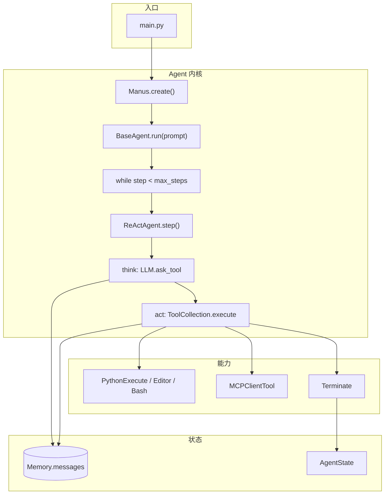
```mermaid
flowchart TB
    subgraph ENTRY["入口"]
        MAIN["main.py"]
    end

    subgraph AGENT["Agent 内核"]
        CREATE["Manus.create()"]
        RUN["BaseAgent.run(prompt)"]
        LOOP["while step < max_steps"]
        STEP["ReActAgent.step()"]
        THINK["think: LLM.ask_tool"]
        ACT["act: ToolCollection.execute"]
    end

    subgraph STATE["状态"]
        MEM[("Memory.messages")]
        ST["AgentState"]
    end

    subgraph TOOLS["能力"]
        LOCAL["PythonExecute / Editor / Bash"]
        MCP["MCPClientTool"]
        TERM["Terminate"]
    end

    MAIN --> CREATE --> RUN --> LOOP --> STEP
    STEP --> THINK --> ACT
    THINK --> MEM
    ACT --> MEM
    ACT --> LOCAL & MCP & TERM
    TERM --> ST
```

### 1.2 PlanningFlow 路径

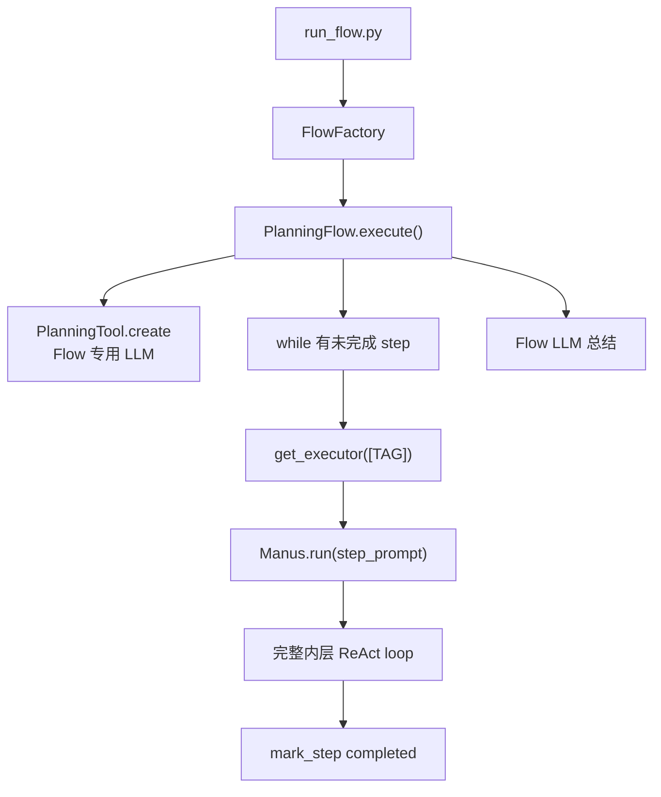
```mermaid
flowchart TB
    RF["run_flow.py"] --> FF["FlowFactory"]
    FF --> PF["PlanningFlow.execute()"]
    PF --> PL["PlanningTool.create<br/>Flow 专用 LLM"]
    PF --> LOOP["while 有未完成 step"]
    LOOP --> ROUTE["get_executor([TAG])"]
    ROUTE --> ER["Manus.run(step_prompt)"]
    ER --> INNER["完整内层 ReAct loop"]
    INNER --> MARK["mark_step completed"]
    PF --> SUM["Flow LLM 总结"]
```

### 1.3 端到端时序（Manus）

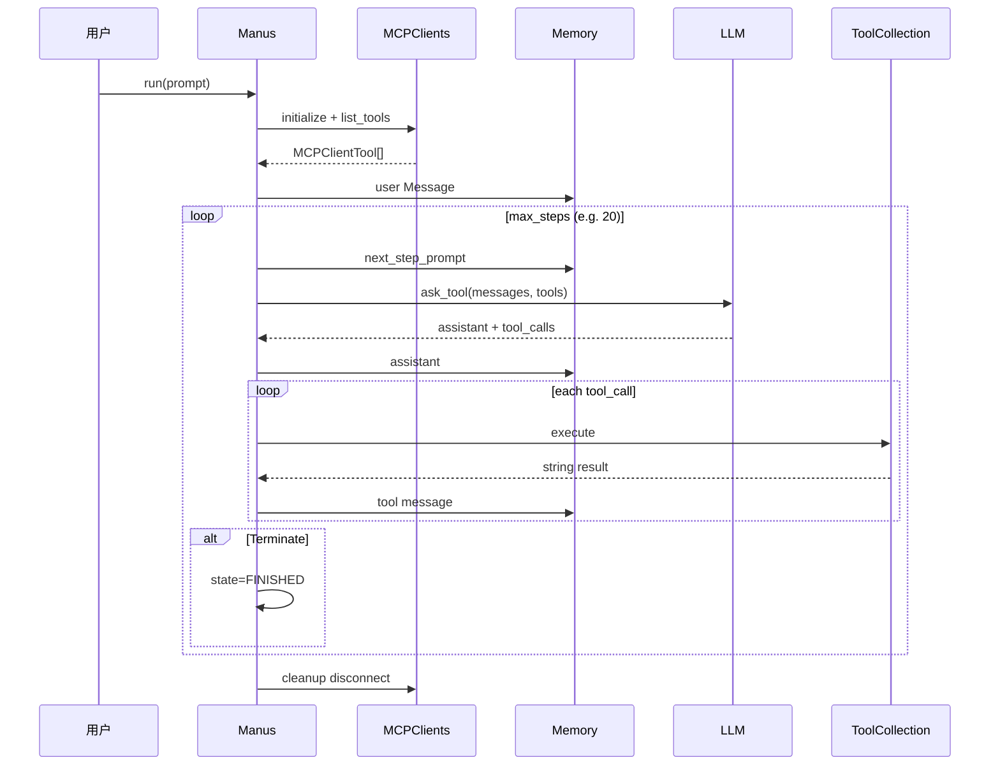
```mermaid
sequenceDiagram
    participant U as 用户
    participant M as Manus
    participant MCP as MCPClients
    participant Mem as Memory
    participant L as LLM
    participant T as ToolCollection

    U->>M: run(prompt)
    M->>MCP: initialize + list_tools
    MCP-->>M: MCPClientTool[]
    M->>Mem: user Message
    loop max_steps (e.g. 20)
        M->>Mem: next_step_prompt
        M->>L: ask_tool(messages, tools)
        L-->>M: assistant + tool_calls
        M->>Mem: assistant
        loop each tool_call
            M->>T: execute
            T-->>M: string result
            M->>Mem: tool message
        end
        alt Terminate
            M->>M: state=FINISHED
        end
    end
    M->>MCP: cleanup disconnect
```

---

## 2. Session 与会话身份

OpenManus **无 Session 抽象**：

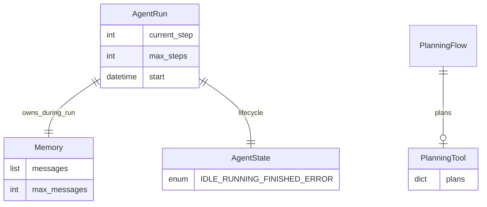
```mermaid
erDiagram
    AgentRun ||--|| Memory : owns_during_run
    AgentRun ||--|| AgentState : lifecycle
    PlanningFlow ||--o| PlanningTool : plans

    AgentRun {
        int current_step
        int max_steps
        datetime start
    }

    Memory {
        list messages
        int max_messages
    }

    AgentState {
        enum IDLE_RUNNING_FINISHED_ERROR
    }

    PlanningTool {
        dict plans
    }
```

| 概念 | 生命周期 | 持久化 |
|------|----------|--------|
| **一次 run()** | IDLE→RUNNING→FINISHED/IDLE | ❌ |
| **PlanningFlow** | execute() 全程 | ❌ plan dict |
| **MCP 连接** | create→cleanup | ❌ |

**对比**：无 `thread_id`、无 JSONL、无 resume。

---

## 3. Memory 与对话历史

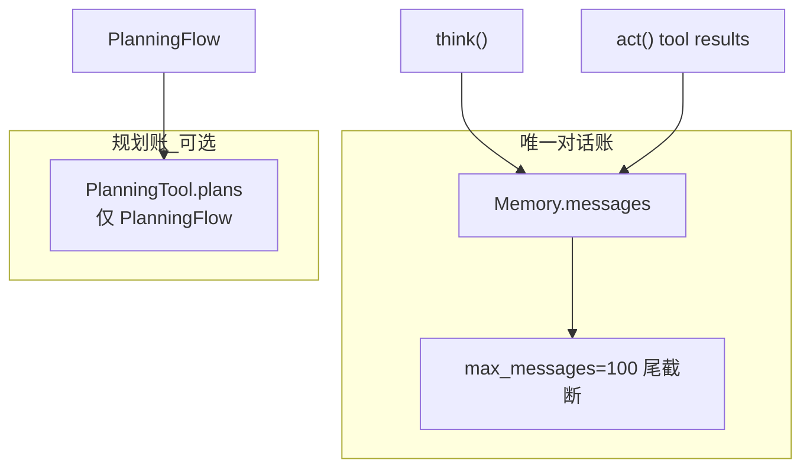
```mermaid
flowchart TB
    subgraph 唯一对话账
        MEM["Memory.messages"]
        CAP["max_messages=100 尾截断"]
    end

    subgraph 规划账_可选
        PLAN["PlanningTool.plans<br/>仅 PlanningFlow"]
    end

    THINK["think()"] --> MEM
    ACT["act() tool results"] --> MEM
    MEM --> CAP
    PF["PlanningFlow"] --> PLAN
```

| 字段 | 类型 | 写入者 |
|------|------|--------|
| user | Message | run() / think |
| assistant | Message + tool_calls | think |
| tool | Message | act |
| system | Message | 子类 system_prompt |

**无** 与 Session 分离的 system/context 层。

---

## 4. 长短期记忆

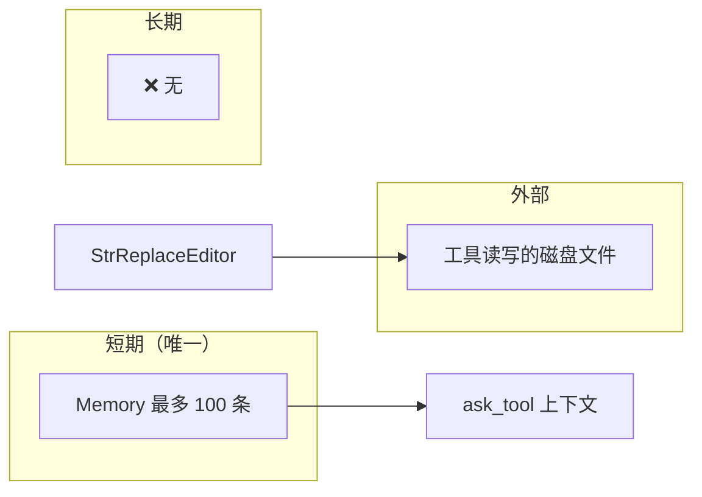
```mermaid
flowchart LR
    subgraph STM["短期（唯一）"]
        M["Memory 最多 100 条"]
    end

    subgraph LTM["长期"]
        X["❌ 无"]
    end

    subgraph 外部
        FILES["工具读写的磁盘文件"]
    end

    M --> LLM["ask_tool 上下文"]
    ACT["StrReplaceEditor"] --> FILES
```

| 类型 | OpenManus |
|------|-----------|
| 对话 STM | ✅ Memory |
| 向量 LTM | ❌ |
| 文件记忆 | ⚠️ 工具副作用，非框架 |
| USER.md / MEMORY.md | ❌ |

---

## 5. 压缩 Compaction

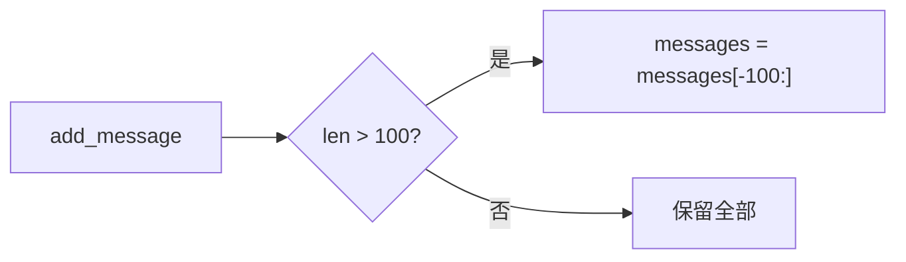
```mermaid
flowchart LR
    ADD["add_message"] --> CHECK{"len > 100?"}
    CHECK -->|是| TAIL["messages = messages[-100:]"]
    CHECK -->|否| KEEP["保留全部"]
```

| 机制 | OpenManus | Codex/OpenCode |
|------|-----------|----------------|
| LLM 摘要 | ❌ | ✅ |
| 尾截断 | ✅ 100 条 | — |
| 结构化交接 | ❌ | compaction 模板 |
| 可搜历史 | ❌ | rollout/search |

**后果**：长任务靠 **Terminate 前完成** 或 **PlanningFlow 分 step**，不靠压缩续命。

---

## 6. Loop 双层结构

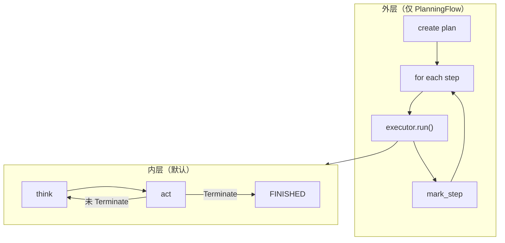
```mermaid
flowchart TB
    subgraph OUTER["外层（仅 PlanningFlow）"]
        O1["create plan"]
        O2["for each step"]
        O3["executor.run()"]
        O4["mark_step"]
        O1 --> O2 --> O3 --> O4 --> O2
    end

    subgraph INNER["内层（默认）"]
        I1["think"]
        I2["act"]
        I1 --> I2
        I2 -->|未 Terminate| I1
        I2 -->|Terminate| DONE["FINISHED"]
    end

    O3 --> INNER
```

### 状态机（内层）

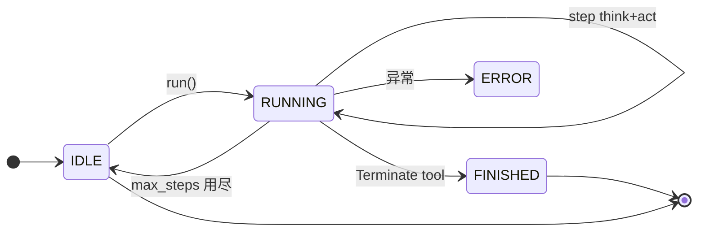
```mermaid
stateDiagram-v2
    direction LR
    [*] --> IDLE
    IDLE --> RUNNING: run()
    RUNNING --> RUNNING: step think+act
    RUNNING --> FINISHED: Terminate tool
    RUNNING --> IDLE: max_steps 用尽
    RUNNING --> ERROR: 异常
    FINISHED --> [*]
    IDLE --> [*]
```

| 参数 | Manus 默认 | 含义 |
|------|------------|------|
| max_steps | 20 | 内层 step 上限 |
| duplicate_threshold | 2 | 卡住检测 |

---

## 7. Tool 管线

### 7.1 模块图

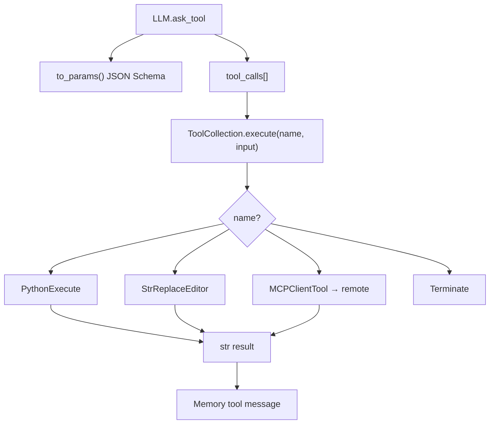
```mermaid
flowchart TB
    LLM["LLM.ask_tool"] --> SCHEMA["to_params() JSON Schema"]
    LLM --> CALLS["tool_calls[]"]
    CALLS --> TC["ToolCollection.execute(name, input)"]
    TC --> DISPATCH{"name?"}
    DISPATCH --> PY["PythonExecute"]
    DISPATCH --> ED["StrReplaceEditor"]
    DISPATCH --> MCP["MCPClientTool → remote"]
    DISPATCH --> TERM["Terminate"]
    PY & ED & MCP --> STR["str result"]
    STR --> MEM["Memory tool message"]
```

### 7.2 类图

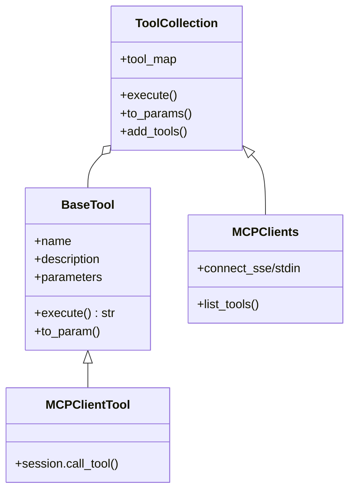
```mermaid
classDiagram
    class BaseTool {
        +name
        +description
        +parameters
        +execute() str
        +to_param()
    }

    class ToolCollection {
        +tool_map
        +execute()
        +to_params()
        +add_tools()
    }

    class MCPClients {
        +connect_sse/stdin
        +list_tools()
    }

    class MCPClientTool {
        +session.call_tool()
    }

    ToolCollection <|-- MCPClients
    BaseTool <|-- MCPClientTool
    ToolCollection o-- BaseTool
```

### 7.3 时序

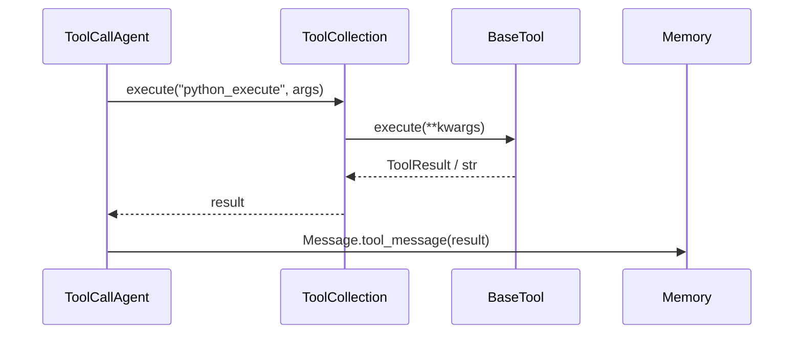
```mermaid
sequenceDiagram
    participant A as ToolCallAgent
    participant TC as ToolCollection
    participant BT as BaseTool
    participant M as Memory

    A->>TC: execute("python_execute", args)
    TC->>BT: execute(**kwargs)
    BT-->>TC: ToolResult / str
    TC-->>A: result
    A->>M: Message.tool_message(result)
```

---

## 8. Skill

| | OpenManus |
|--|-----------|
| Skill 模块 | ❌ 无 |
| 替代 | `app/prompt/` 静态 prompt 文件 |
| MCP 工具包 | ⚠️ 外部 server 当能力扩展 |
| 渐进加载 | ❌ |

---

## 9. Sandbox 与执行隔离

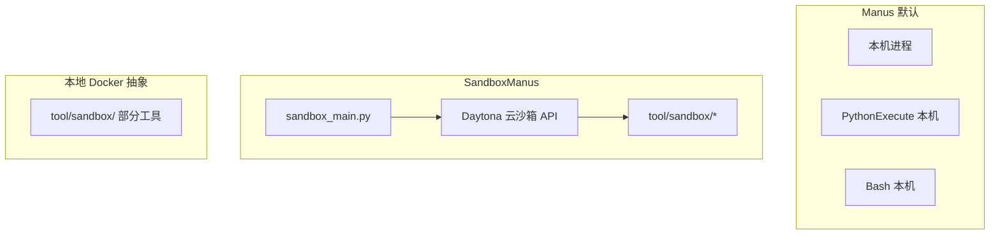
```mermaid
flowchart TB
    subgraph 默认["Manus 默认"]
        M["本机进程"]
        PE["PythonExecute 本机"]
        BASH["Bash 本机"]
    end

    subgraph 沙箱变体["SandboxManus"]
        SB["sandbox_main.py"]
        DAY["Daytona 云沙箱 API"]
        ST["tool/sandbox/*"]
        SB --> DAY --> ST
    end

    subgraph Docker["本地 Docker 抽象"]
        D["tool/sandbox/ 部分工具"]
    end
```

| 模式 | 入口 | 隔离级别 |
|------|------|----------|
| Manus | main.py | 无 |
| SandboxManus | sandbox_main.py | 云沙箱 |
| Docker tools | 可选 | 容器 |

**无** Codex/OpenHarness 式策略引擎。

---

## 10. 多 Turn

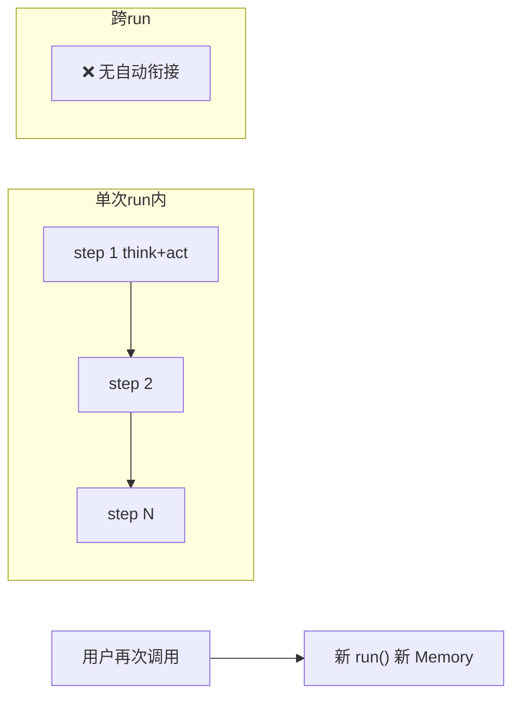
```mermaid
flowchart LR
    subgraph 单次run内
        S1["step 1 think+act"]
        S2["step 2"]
        S3["step N"]
        S1 --> S2 --> S3
    end

    subgraph 跨run
        X["❌ 无自动衔接"]
    end

    U["用户再次调用"] --> NEW["新 run() 新 Memory"]
```

| Turn 类型 | 支持 |
|-----------|------|
| step（内层） | ✅ max_steps |
| 用户多轮对话 | ⚠️ 需应用层多次调 run |
| Planning step（外层） | ✅ PlanningFlow |

---

## 11. 队列与中途输入

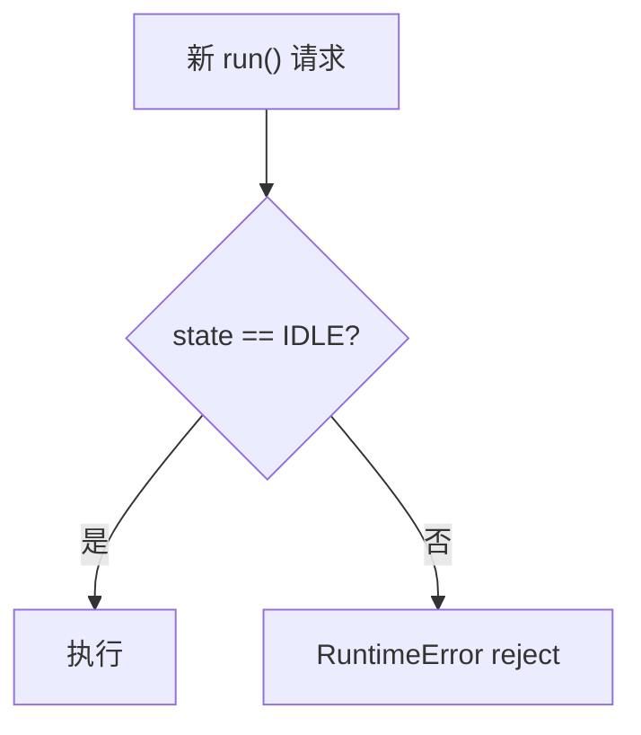
```mermaid
flowchart TB
    REQ["新 run() 请求"] --> CHECK{"state == IDLE?"}
    CHECK -->|是| RUN["执行"]
    CHECK -->|否| REJECT["RuntimeError reject"]
```

| 机制 | OpenManus |
|------|-----------|
| steer | ❌ |
| queue | ❌ |
| 并发 run | ❌ reject |
| AskHuman | ✅ 工具阻塞等人 |

**设计**：单用户单 run 状态机，非平台型会话。

---

## 12. 多 Agent

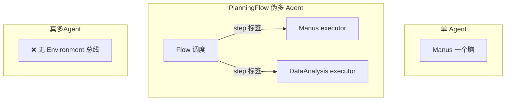
```mermaid
flowchart TB
    subgraph 默认["单 Agent"]
        MAN["Manus 一个脑"]
    end

    subgraph Flow["PlanningFlow 伪多 Agent"]
        PF["Flow 调度"]
        M["Manus executor"]
        DA["DataAnalysis executor"]
        PF -->|step 标签| M
        PF -->|step 标签| DA
    end

    subgraph 真多Agent
        NA["❌ 无 Environment 总线"]
    end
```

| 模式 | 并行 | 通信 |
|------|------|------|
| Manus | ❌ | — |
| PlanningFlow | ❌ 顺序 step | step_prompt 文本 |
| MetaGPT 式多 Role | ❌ | — |

---

## 13. Plan 与任务规划

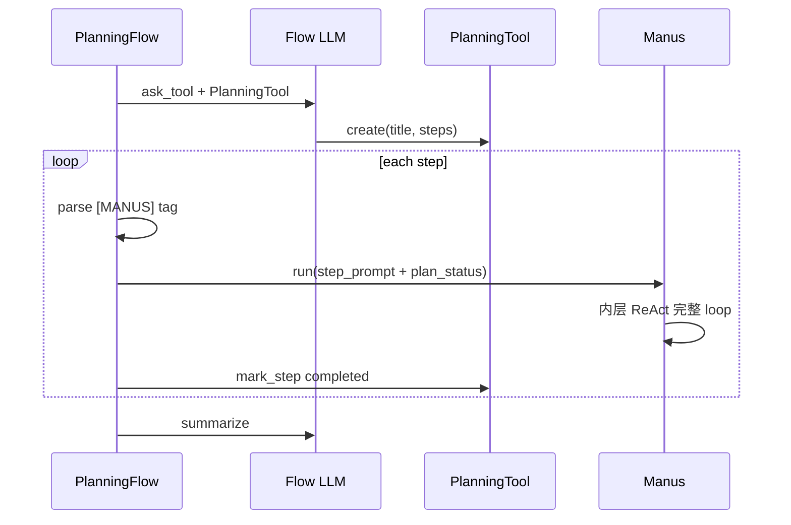
```mermaid
sequenceDiagram
    participant F as PlanningFlow
    participant L as Flow LLM
    participant P as PlanningTool
    participant E as Manus

    F->>L: ask_tool + PlanningTool
    L->>P: create(title, steps)
    loop each step
        F->>F: parse [MANUS] tag
        F->>E: run(step_prompt + plan_status)
        E->>E: 内层 ReAct 完整 loop
        F->>P: mark_step completed
    end
    F->>L: summarize
```

| 组件 | 职责 |
|------|------|
| **PlanningTool** | 内存 `plans` dict |
| **Flow LLM** | 与 executor **分离** |
| **PlanStepStatus** | not_started / in_progress / completed / blocked |
| **路由** | `[AGENT_NAME]` 正则，脆弱 |

**对比 MetaGPT Planner**：OpenManus 更轻，无 DAG 评审。

源码级逐步 message 导读：[PLAN_MODE_SOURCE_WALKTHROUGH.md](./PLAN_MODE_SOURCE_WALKTHROUGH.md)。

---

## 14. App / Gateway / 客户端

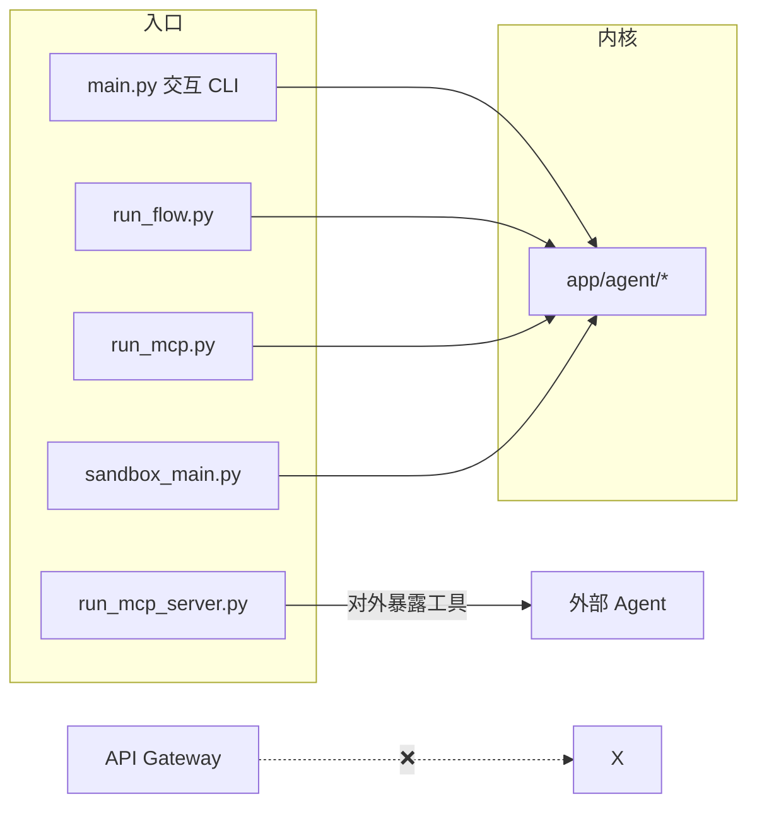
```mermaid
flowchart LR
    subgraph 入口
        M["main.py 交互 CLI"]
        RF["run_flow.py"]
        RM["run_mcp.py"]
        RS["run_mcp_server.py"]
        SM["sandbox_main.py"]
    end

    subgraph 内核
        AG["app/agent/*"]
    end

    M & RF & RM & SM --> AG
    RS -->|"对外暴露工具"| EXT["外部 Agent"]

    GW["API Gateway"] -.->|❌| X
```

| 入口 | Agent | 场景 |
|------|-------|------|
| main.py | Manus | 默认 |
| run_flow.py | PlanningFlow | 先计划 |
| run_mcp.py | MCPAgent | 纯 MCP |
| run_mcp_server.py | MCPServer | 工具服务端 |
| sandbox_main.py | SandboxManus | 云沙箱 |

---

## 15. 长时任务

| 能力 | OpenManus |
|------|-----------|
| 小时级 run | ⚠️ 靠 max_steps + 模型 |
| 中断恢复 | ❌ |
| 后台 Daemon | ❌ |
| Planning 多 step | ✅ 每 step 独立 run |

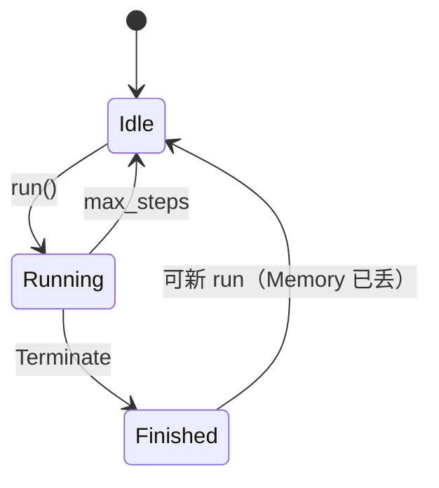
```mermaid
stateDiagram-v2
    [*] --> Idle
    Idle --> Running: run()
    Running --> Finished: Terminate
    Running --> Idle: max_steps
    Finished --> Idle: 可新 run（Memory 已丢）
```

---

## 16. 缓存

| 类型 | OpenManus |
|------|-----------|
| LLM 响应 | ❌ |
| Prompt / Epoch | ❌ |
| Tool 结果 | ❌ |
| MCP tool list | ⚠️ MCPAgent 每 5 step 刷新 |

---

## 17. 跨框架对照

| 维度 | OpenManus | MetaGPT | OpenCode | Codex |
|------|-----------|---------|----------|-------|
| Session | ❌ | Team 轮 | SessionV2 | Thread |
| Memory | 100 尾截断 | 消息+文件 | History+Epoch | history |
| 压缩 | 截断 | 落盘 | LLM 摘要 | 摘要/切窗 |
| Loop | think/act | react | Drain+Turn | run_turn |
| 队列 | reject | buffer | steer/queue | mailbox |
| 多 Agent | Flow | 核心 | subagent | spawn |
| Plan | PlanningFlow | Planner | todowrite | update_plan |
| Sandbox | Daytona 变体 | 弱 | 权限 | 四层 |
| Gateway | ❌ | ❌ | ❌ | app-server |

---

## 18. 改造路线图（若要补齐维度）

| 用户需求 | 建议借鉴 |
|----------|----------|
| Session + resume | Pi JSONL / Codex Rollout |
| 压缩 | OpenCode compaction / deer-flow middleware |
| steer/queue | OpenCode session_input |
| 多 Agent | MetaGPT Environment 或 deepagents MA |
| Gateway | deer-flow / nanobot |
| Skill | OpenCode Context Source |
| 长时任务 | Agent Framework Foundry hosting |

---

**返回**: [README.md](./README.md#文档全目录)
