# OpenManus 设计方案全景

> **循序渐进导读（图表为主，推荐先读）**：[docs/openmanus-architecture/DESIGN_THINKING_SERIES.md](../../docs/openmanus-architecture/DESIGN_THINKING_SERIES.md)  
> **架构 Part 1（类图 / Agent 五模块 / 时序）**：[docs/openmanus-architecture/ARCHITECTURE_PART1.md](../../docs/openmanus-architecture/ARCHITECTURE_PART1.md)  
> **本文档定位**：全量深潜（时序、对比、模块索引）。

> **文档状态**: Canonical  
> **源码范围**: `OpenManus/`  
> **Plan 模式源码导读（完整示例 + message 变化）**: [PLAN_MODE_SOURCE_WALKTHROUGH.md](./PLAN_MODE_SOURCE_WALKTHROUGH.md)  
> **核心入口**: `main.py`、`run_flow.py`、`run_mcp.py`、`run_mcp_server.py`、`sandbox_main.py`  
> **核心源码**: `app/agent/`、`app/flow/`、`app/tool/`、`app/mcp/`、`app/sandbox/`、`app/daytona/`  
> **定位**: 从整体框架、协议设计、模型设计、流程图、时序图、模块原理和横向对比完整拆解 OpenManus

---

## 目录

- [1. 一句话理解 OpenManus](#1-一句话理解-openmanus)
- [2. 总体架构](#2-总体架构)
- [3. 入口与运行模式](#3-入口与运行模式)
- [4. Agent 内核设计](#4-agent-内核设计)
- [5. 协议设计](#5-协议设计)
- [6. Model / LLM 设计](#6-model--llm-设计)
- [7. Tool 系统设计](#7-tool-系统设计)
- [8. Flow 与 Plan 设计](#8-flow-与-plan-设计)
- [9. MCP 设计](#9-mcp-设计)
- [10. Sandbox 与执行环境](#10-sandbox-与执行环境)
- [11. 端到端时序](#11-端到端时序)
- [12. 模块设计索引](#12-模块设计索引)
- [13. 状态、记忆与持久化边界](#13-状态记忆与持久化边界)
- [14. 错误处理与资源清理](#14-错误处理与资源清理)
- [15. 与 Hermes / deepagents / deer-flow / AgentScope 对比](#15-与-hermes--deepagents--deer-flow--agentscope-对比)
- [16. 设计优缺点与改造建议](#16-设计优缺点与改造建议)
- [17. 阅读源码路线](#17-阅读源码路线)

---

## 1. 一句话理解 OpenManus

OpenManus 是一个 **轻量 Manus-like Agent 实现**：核心是 `BaseAgent.run()` 驱动的 step 循环，`ReActAgent` 将每一步拆成 `think()` 与 `act()`，`ToolCallAgent` 用 OpenAI-style tool calling 让模型选择工具并把工具结果写回 `Memory`，外层再通过 `PlanningFlow`、`MCPAgent`、`SandboxManus` 扩展为规划、多工具协议和沙箱执行版本。

它不是一个重型多租户 Agent 平台，也不是 LangGraph 这类状态图框架。它更像一个易读的 Agent kernel：

```text
用户请求
  ↓
Agent.run()
  ↓
while step < max_steps:
  think(): LLM 选择工具
  act(): 执行工具并写回结果
  terminate 工具或 max_steps 结束
```

### 1.1 项目定位

| 维度 | OpenManus 的选择 |
|------|------------------|
| 核心范式 | ReAct + OpenAI tool calling |
| 编排方式 | 默认单 Agent；可选 `PlanningFlow` |
| 状态载体 | 内存中的 `Memory.messages` + `AgentState` |
| 工具系统 | `BaseTool` + `ToolCollection` |
| MCP | 客户端和服务端都有，但实现轻量 |
| Sandbox | 本地 Docker 抽象 + Daytona 云沙箱变体 |
| 持久化 | 无框架级 session/checkpoint，主要是内存态 |
| 适合场景 | 学习 Agent loop、快速原型、Manus-like 工具编排 |

### 1.2 非目标

OpenManus 当前没有把以下能力做成一等框架能力：

| 非目标 | 当前状态 |
|--------|----------|
| 多租户服务 | 无 Gateway / Web Service 主体 |
| 自动 checkpoint | `Memory` 在内存中，未内置持久化 |
| 长期记忆 | 无 `MEMORY.md` / vector memory / session search |
| 复杂多 Agent 调度 | 仅 `PlanningFlow` 简单按 step 选 executor |
| 权限审批系统 | 有 `AskHuman`，但没有 OpenHarness/Hermes 式权限层 |
| 图状态机 | 不使用 LangGraph / StateGraph |

---

## 2. 总体架构

### 2.1 分层架构图

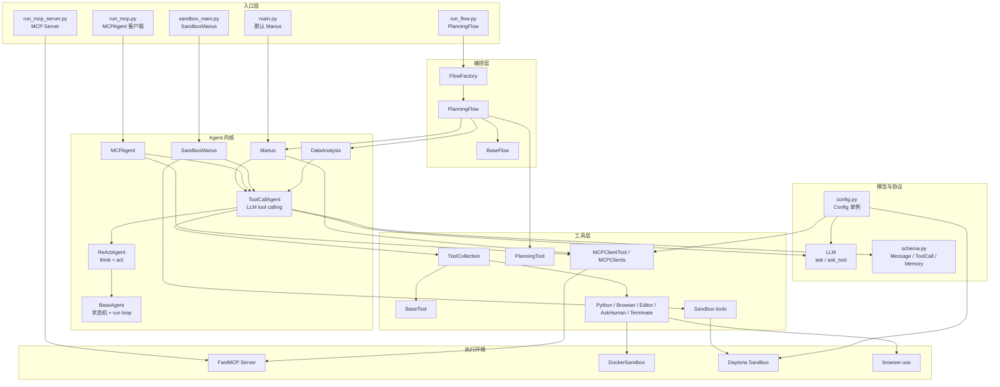

### 2.2 控制流与数据流

OpenManus 的核心数据流非常短：

```text
Message[] → LLM.ask_tool() → ToolCall[] → ToolCollection.execute()
          ↑                                      ↓
          └──────────── Memory.add_message(Tool Message)
```

也就是说，**Memory 是上下文缓存，ToolCollection 是动作分发器，LLM 是决策器**。

### 2.3 关键设计选择

| 设计点 | 选择 | 影响 |
--------|------|------|
| Agent loop | 手写 while loop | 易读、易改，但缺少 graph/checkpoint 能力 |
| ReAct 分层 | `step = think + act` | 结构清晰，便于复用 |
| Tool schema | OpenAI function calling 格式 | 兼容 `chat.completions` 工具调用 |
| Tool result | 字符串 observation 写回 memory | 简单，但结构化结果较弱 |
| Plan | Flow 外层控制，而非 Agent 内置模式 | Plan 逻辑独立，默认 Agent 不受影响 |
| MCP | ToolCollection 的远端代理 | MCP 工具与本地工具同一执行接口 |
| Sandbox | 两套：Docker 抽象 + Daytona Agent | 能力强，但路径与生命周期需要小心 |

---

## 3. 入口与运行模式

OpenManus 有五个主要入口，分别代表五种使用方式。

### 3.1 `main.py`：默认 Manus

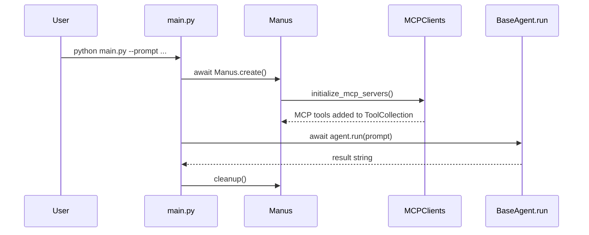

调用链：

```text
main.py
  └─ Manus.create()
       ├─ Manus()
       ├─ initialize_mcp_servers()
       └─ _initialized = True
  └─ agent.run(prompt)
  └─ agent.cleanup()
```

适合：本地通用任务、浏览器、Python 执行、文件编辑、MCP 工具混用。

### 3.2 `run_flow.py`：PlanningFlow

```text
run_flow.py
  ├─ agents = {"manus": Manus()}
  ├─ 可选 agents["data_analysis"] = DataAnalysis()
  ├─ FlowFactory.create_flow(FlowType.PLANNING, agents)
  └─ PlanningFlow.execute(prompt)
```

这个入口不是简单把 Plan 工具塞进 Agent，而是由外层 `PlanningFlow` 控制任务生命周期：

1. 先生成计划；
2. 找到第一个未完成步骤；
3. 选择 executor；
4. 把「当前计划状态 + 当前步骤」作为 prompt 交给 Agent；
5. Agent 自己跑完整 ReAct loop；
6. Flow 标记步骤完成；
7. 全部完成后总结。

适合：需要显式步骤管理的复杂任务。

### 3.3 `run_mcp.py`：MCPAgent 客户端

```text
run_mcp.py
  └─ MCPRunner
       ├─ MCPAgent()
       ├─ initialize(connection_type)
       │    ├─ stdio: python -m app.mcp.server
       │    └─ sse: connect to server_url
       └─ agent.run(prompt)
```

适合：只想测试 MCP 服务器工具、或把 OpenManus 当 MCP client。

### 3.4 `run_mcp_server.py`：OpenManus 作为 MCP Server

```text
run_mcp_server.py
  └─ MCPServer()
       ├─ register_all_tools()
       └─ FastMCP.run(transport="stdio")
```

默认暴露：

| 工具 | 实现 |
|------|------|
| `bash` | `app/tool/bash.py` |
| `browser` | `app/tool/browser_use_tool.py` |
| `editor` | `app/tool/str_replace_editor.py` |
| `terminate` | `app/tool/terminate.py` |

### 3.5 `sandbox_main.py`：SandboxManus

```text
sandbox_main.py
  └─ SandboxManus.create()
       ├─ initialize_mcp_servers()
       ├─ initialize_sandbox_tools()
       │    ├─ create_sandbox()
       │    ├─ get_preview_link(6080/8080)
       │    └─ add SandboxBrowser/Files/Shell/Vision tools
       └─ agent.run(prompt)
```

适合：希望让浏览器、文件、shell、视觉工具在 Daytona sandbox 中执行，而不是直接操作本机。

---

## 4. Agent 内核设计

### 4.1 类继承关系

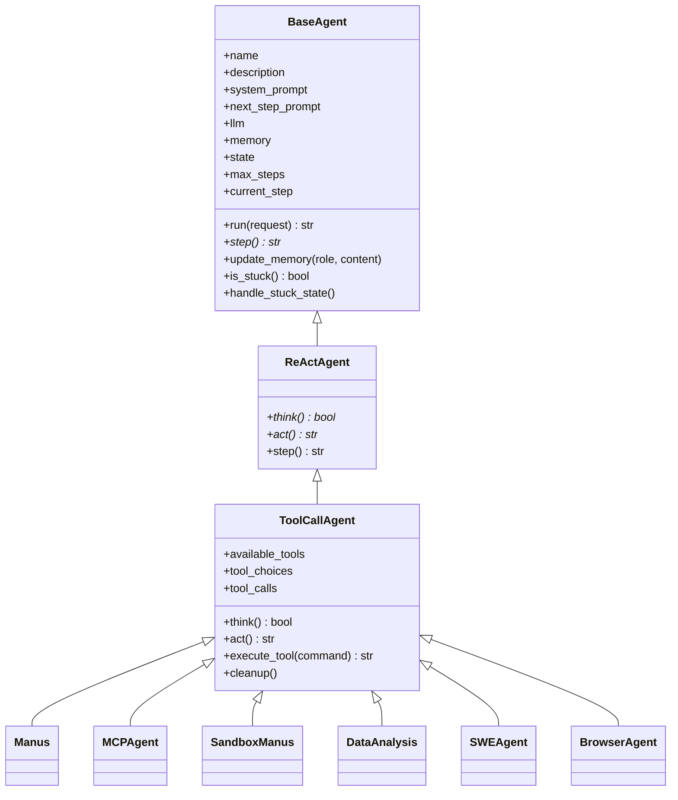

### 4.2 `BaseAgent`：状态机与主循环

`BaseAgent` 提供最底层能力：

| 字段 | 作用 |
|------|------|
| `name` / `description` | Agent 标识 |
| `system_prompt` | 每次 LLM 调用时作为 system message |
| `next_step_prompt` | 每轮 think 前追加到 memory 的 user message |
| `llm` | `LLM` 实例 |
| `memory` | `Memory`，保存消息列表 |
| `state` | `IDLE/RUNNING/FINISHED/ERROR` |
| `max_steps/current_step` | 循环上限 |
| `duplicate_threshold` | 卡死检测阈值 |

主循环伪代码：

```python
async def run(request):
    if state != IDLE:
        raise RuntimeError

    if request:
        update_memory("user", request)

    async with state_context(RUNNING):
        while current_step < max_steps and state != FINISHED:
            current_step += 1
            step_result = await step()
            if is_stuck():
                handle_stuck_state()

    await SANDBOX_CLIENT.cleanup()
    return results
```

关键点：

- `BaseAgent` 不知道工具，也不关心 LLM tool calling；
- 子类必须实现 `step()`；
- `state_context()` 负责进入 `RUNNING`，异常时置 `ERROR`；
- 结束时会调用全局 `SANDBOX_CLIENT.cleanup()`。

#### 4.2.1 源码级核心 loop 导读

核心文件：`app/agent/base.py`

这一段是 OpenManus 的真正 agent loop，不在 Flow、不在 Tool、不在 LLM：

```text
BaseAgent.run(request)
  1. 校验 state 必须是 IDLE
  2. 如果有 request，把用户输入转成 Message.user_message() 写入 Memory
  3. 进入 state_context(RUNNING)
  4. while current_step < max_steps and state != FINISHED:
       4.1 current_step += 1
       4.2 await self.step()
       4.3 is_stuck() 检查重复 assistant 内容
       4.4 results.append("Step N: ...")
  5. 如果达到 max_steps，把 current_step 清零，state 置回 IDLE
  6. await SANDBOX_CLIENT.cleanup()
  7. 返回按步骤拼起来的字符串
```

状态和数据变化表：

| 步骤 | 触发代码/方法 | `state` | `current_step` | `memory.messages` | `results` |
|------|---------------|---------|----------------|-------------------|-----------|
| 初始 | 调用 `run()` 前 | `IDLE` | 通常为 0 | 旧上下文或空 | 空 |
| 写入请求 | `update_memory("user", request)` | `IDLE` | 不变 | 追加 user message | 空 |
| 进入循环 | `state_context(RUNNING)` | `RUNNING` | 不变 | 不变 | 空 |
| 每轮开始 | `current_step += 1` | `RUNNING` | +1 | 不变 | 空 |
| 执行一步 | `await self.step()` | 可能仍 `RUNNING`，也可能被工具置为 `FINISHED` | 不变 | 由子类追加 assistant/tool | 产生 step_result |
| 卡死检测 | `is_stuck()` | 不变 | 不变 | 若卡死，只改 `next_step_prompt` | 不变 |
| 收集结果 | `results.append(...)` | 不变 | 不变 | 不变 | 追加一行 |
| 达到上限 | `current_step >= max_steps` | `IDLE` | 置 0 | 不变 | 追加 Terminated |
| 清理 | `SANDBOX_CLIENT.cleanup()` | 不变 | 不变 | 不变 | 不变 |

`state_context()` 的行为也很关键：

```text
previous_state = self.state
self.state = new_state
try:
    yield
except:
    self.state = ERROR
    raise
finally:
    self.state = previous_state
```

这意味着如果循环内没有显式保留 `FINISHED`，上下文管理器 finally 会把状态恢复到进入前的状态。当前代码在 `max_steps` 分支里显式把 `state` 设为 `IDLE`，而工具调用 `terminate` 会在循环条件中阻止继续执行。读这个实现时要注意：它是一个轻量状态机，不是持久状态图。

#### 4.2.2 卡死检测不是压缩

`is_stuck()` 只做重复 assistant 内容检测：

```text
取最后一条 message
如果最后一条没有 content → False
倒序统计之前 assistant message 中 content 完全相同的次数
duplicate_count >= duplicate_threshold → True
```

`handle_stuck_state()` 只是把下面这类提示拼到 `next_step_prompt` 前面：

```text
Observed duplicate responses. Consider new strategies...
```

它不会删除消息、不会总结上下文、不会压缩 memory。

### 4.3 `ReActAgent`：把一步拆成 think/act

`ReActAgent` 只做一件事：

```python
async def step(self):
    should_act = await self.think()
    if not should_act:
        return "Thinking complete - no action needed"
    return await self.act()
```

这让所有具体 Agent 可以复用同一套 ReAct 骨架。

### 4.4 `ToolCallAgent`：工具调用核心

`ToolCallAgent` 是 OpenManus 最重要的类。它把 ReAct 的 `think()` 和 `act()` 具体化。

#### Think 阶段

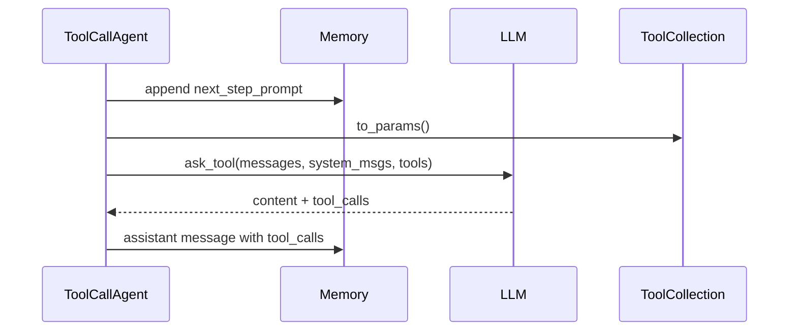

核心逻辑：

1. 如果有 `next_step_prompt`，追加成 user message；
2. 调用 `LLM.ask_tool()`；
3. 传入：
   - `messages=self.messages`
   - `system_msgs=[Message.system_message(self.system_prompt)]`
   - `tools=self.available_tools.to_params()`
   - `tool_choice=self.tool_choices`
4. 把模型返回内容写成 assistant message；
5. 若有 tool calls，返回 `True` 进入 `act()`。

#### 4.4.1 `think()` 源码级步骤

核心文件：`app/agent/toolcall.py`

```text
ToolCallAgent.think()
  1. 如果 self.next_step_prompt 存在：
       user_msg = Message.user_message(self.next_step_prompt)
       self.messages += [user_msg]

  2. 调 self.llm.ask_tool(...)
       messages = self.messages
       system_msgs = [Message.system_message(self.system_prompt)]
       tools = self.available_tools.to_params()
       tool_choice = self.tool_choices

  3. 如果捕获 TokenLimitExceeded：
       memory.add_message(assistant_message("Maximum token limit reached..."))
       state = FINISHED
       return False

  4. 从 response 中取：
       self.tool_calls = response.tool_calls or []
       content = response.content or ""

  5. 根据 tool_choice 分支：
       NONE: 不允许工具，只有 content 时写 assistant message
       REQUIRED: 没有 tool_calls 也返回 True，让 act() 抛 TOOL_CALL_REQUIRED
       AUTO: 没有工具但有 content 时返回 bool(content)

  6. 写 assistant message：
       有 tool_calls → Message.from_tool_calls(content, tool_calls)
       无 tool_calls → Message.assistant_message(content)

  7. 返回是否需要 act()
```

`think()` 的输入输出可以这样理解：

| 输入 | 来源 |
|------|------|
| `self.messages` | `Memory.messages` 当前完整上下文 |
| `self.system_prompt` | 具体 Agent 类，如 `Manus.system_prompt` |
| `available_tools.to_params()` | 所有本地/MCP/sandbox 工具 schema |
| `tool_choice` | `auto/none/required` |

| 输出 | 去向 |
|------|------|
| `self.tool_calls` | 暂存在 Agent 字段，供 `act()` 执行 |
| assistant message | 追加进 `Memory.messages` |
| `True/False` | 决定是否执行 `act()` |

#### Act 阶段

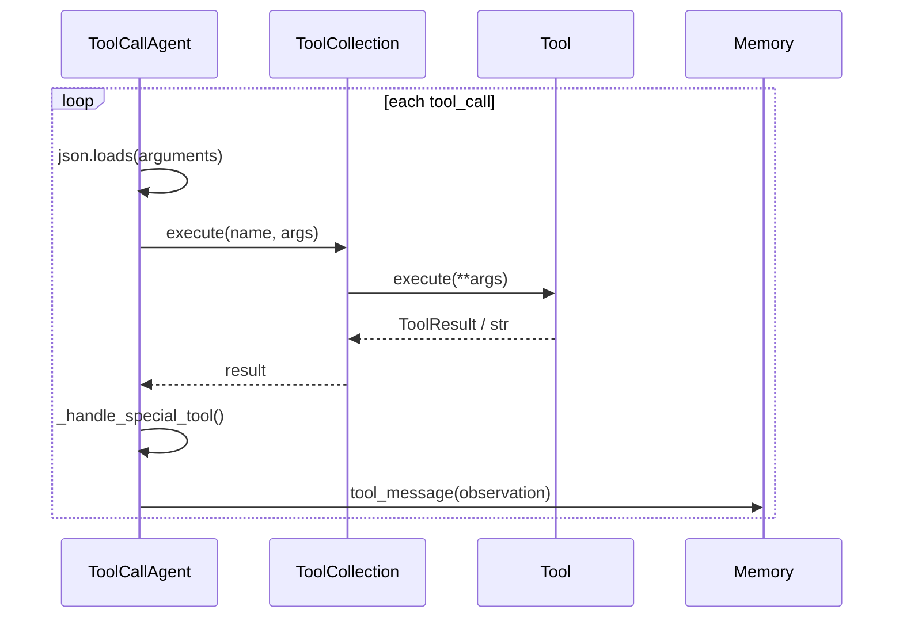

输出被统一包装成：

```text
Observed output of cmd `{name}` executed:
{str(result)}
```

#### 4.4.2 `act()` 与 `execute_tool()` 源码级步骤

核心文件：`app/agent/toolcall.py`

```text
ToolCallAgent.act()
  1. 如果没有 self.tool_calls：
       REQUIRED 模式 → raise ValueError("Tool calls required but none provided")
       其它模式 → 返回最后一条 message content

  2. 遍历每个 ToolCall：
       self._current_base64_image = None
       result = await execute_tool(command)
       如果 max_observe 存在 → result = result[:max_observe]
       生成 Message.tool_message(...)
       memory.add_message(tool_msg)
       results.append(result)

  3. 返回 "\\n\\n".join(results)
```

`execute_tool()` 是真正的工具分发点：

```text
execute_tool(command)
  1. 校验 command/function/name
  2. name 不在 available_tools.tool_map → 返回 Error: Unknown tool
  3. json.loads(command.function.arguments or "{}")
  4. available_tools.execute(name=name, tool_input=args)
  5. _handle_special_tool(name, result)
       默认：如果 name 在 special_tool_names 中 → state = FINISHED
  6. 如果 result 有 base64_image：
       self._current_base64_image = result.base64_image
  7. 返回 observation 字符串
```

这里有三个非常重要的实现细节：

| 细节 | 影响 |
|------|------|
| 工具调用是顺序执行 | 一个 assistant message 中多个 tool_call 会依次执行，不并行 |
| 错误写回为字符串 | JSON 解析失败、未知工具、工具异常都会变成 `Error: ...` observation，进入下一轮上下文 |
| `terminate` 是特殊工具 | 它不是外部 signal，而是普通工具结果触发 `state = FINISHED` |

#### 4.4.3 一轮 ReAct 后 Memory 长什么样

假设用户问“打开网页并总结”，模型调用 `browser_use`，一轮后 memory 近似为：

```text
[
  Message(role="user", content="打开网页并总结"),
  Message(role="user", content=NEXT_STEP_PROMPT),
  Message(
    role="assistant",
    content="我需要先打开网页。",
    tool_calls=[ToolCall(function.name="browser_use", arguments="{...}")]
  ),
  Message(
    role="tool",
    name="browser_use",
    tool_call_id="call_xxx",
    content="Observed output of cmd `browser_use` executed:\\n..."
  )
]
```

下一轮 `think()` 会把这 4 条消息全部发给 `LLM.ask_tool()`，这就是 OpenManus 的短期上下文机制。

### 4.5 `Manus`：通用 Agent

`Manus` 是默认入口使用的通用 Agent。

默认工具：

| 工具 | 作用 |
|------|------|
| `PythonExecute` | 执行 Python 代码 |
| `BrowserUseTool` | 浏览器自动化 |
| `StrReplaceEditor` | 文件查看/创建/替换/插入 |
| `AskHuman` | 极端情况下询问用户 |
| `Terminate` | 终止任务 |

扩展能力：

- 初始化时读取 `config.mcp_config.servers`；
- 根据 server 类型连接 SSE 或 stdio；
- 把新 MCP 工具加入 `available_tools`；
- 若最近几条消息使用了浏览器工具，会临时替换 `next_step_prompt`，注入浏览器上下文。

### 4.6 `MCPAgent`：纯 MCP 工具 Agent

`MCPAgent` 与 `Manus` 的区别：

| 项 | `Manus` | `MCPAgent` |
|----|---------|------------|
| 工具来源 | 本地工具 + MCP 工具 | 仅 MCP 工具 |
| 初始化 | `Manus.create()` 自动按 config 连接 | `initialize(connection_type, ...)` |
| 工具刷新 | 连接时加入 | 每 5 步 `_refresh_tools()` |
| system prompt | 通用 Manus prompt | MCP 专用 prompt |

`MCPAgent` 会把可用工具列表写入 system message：

```text
Available MCP tools: ...
```

工具新增/删除时，也会通过 system message 通知模型。

### 4.7 `SandboxManus`：Daytona 沙箱版

`SandboxManus` 的核心变化是：默认不把本地 `PythonExecute`、`BrowserUseTool`、`StrReplaceEditor` 暴露给模型，而是创建 Daytona sandbox 并暴露 sandbox tools。

```text
SandboxManus.create()
  ├─ initialize_mcp_servers()
  ├─ create_sandbox(password)
  ├─ get_preview_link(6080) → VNC
  ├─ get_preview_link(8080) → website
  └─ add SandboxBrowserTool / SandboxFilesTool / SandboxShellTool / SandboxVisionTool
```

---

## 5. 协议设计

OpenManus 虽然不是一个协议框架，但内部有几组稳定协议。

### 5.1 Message 协议

`Message` 是 OpenManus 的上下文基本单元：

| 字段 | 说明 |
|------|------|
| `role` | `system/user/assistant/tool` |
| `content` | 文本内容 |
| `tool_calls` | assistant 发起的工具调用 |
| `name` | tool message 的工具名 |
| `tool_call_id` | 对应 tool call id |
| `base64_image` | 多模态结果 |

消息流：

```text
UserMsg(prompt)
  ↓
AssistantMsg(content + tool_calls)
  ↓
ToolMsg(observation, tool_call_id, name)
  ↓
AssistantMsg(next decision)
```

### 5.2 ToolCall 协议

工具调用与 OpenAI function calling 对齐：

```json
{
  "id": "call_xxx",
  "type": "function",
  "function": {
    "name": "python_execute",
    "arguments": "{\"code\": \"print(1)\"}"
  }
}
```

OpenManus 处理流程：

1. `ToolCallAgent.think()` 接收模型返回的 `tool_calls`；
2. `ToolCallAgent.act()` 逐个执行；
3. `execute_tool()` 解析 `function.arguments`；
4. `ToolCollection.execute()` 分发到具体工具；
5. 工具结果写回 `Message.tool_message()`。

### 5.3 Tool schema 协议

所有工具继承 `BaseTool`，必须提供：

| 字段/方法 | 说明 |
|-----------|------|
| `name` | 工具名 |
| `description` | 给 LLM 的工具描述 |
| `parameters` | JSON Schema |
| `execute(**kwargs)` | 实际执行 |
| `to_param()` | 转为 OpenAI tools schema |

`to_param()` 输出格式：

```json
{
  "type": "function",
  "function": {
    "name": "...",
    "description": "...",
    "parameters": {...}
  }
}
```

### 5.4 Agent 状态协议

`AgentState` 是非常小的状态机：

| 状态 | 含义 |
|------|------|
| `IDLE` | 可接受新的 `run()` |
| `RUNNING` | 正在执行 step loop |
| `FINISHED` | 任务完成，通常由 `terminate` 触发 |
| `ERROR` | 异常状态 |

状态变化：

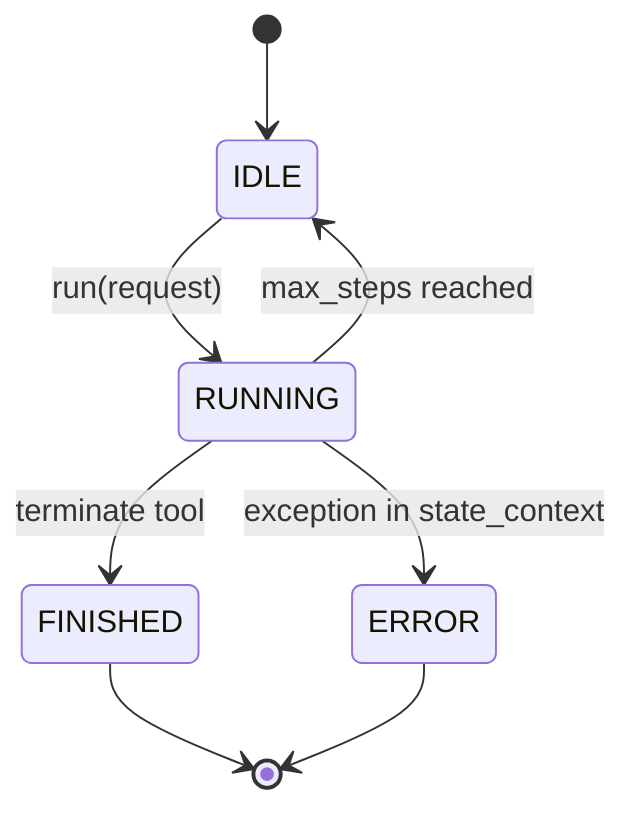

### 5.5 Plan 协议

`PlanningTool` 的命令协议：

| command | 作用 |
|---------|------|
| `create` | 创建计划 |
| `update` | 更新标题或步骤 |
| `list` | 列出计划 |
| `get` | 获取计划详情 |
| `set_active` | 设置当前计划 |
| `mark_step` | 标记步骤状态 |
| `delete` | 删除计划 |

计划数据结构：

```python
{
    "plan_id": "...",
    "title": "...",
    "steps": ["...", "..."],
    "step_statuses": ["not_started", "in_progress", "completed"],
    "step_notes": ["", "", ""],
}
```

步骤状态：

| 状态 | 显示 |
|------|------|
| `not_started` | `[ ]` |
| `in_progress` | `[→]` |
| `completed` | `[✓]` |
| `blocked` | `[!]` |

### 5.6 MCP 协议

OpenManus 同时实现 MCP client 和 MCP server。

客户端协议：

```text
connect_sse/connect_stdio
  ↓
ClientSession.initialize()
  ↓
ClientSession.list_tools()
  ↓
MCPClientTool(name=mcp_{server_id}_{tool})
  ↓
session.call_tool(original_name, kwargs)
```

服务端协议：

```text
BaseTool.to_param()
  ↓
MCPServer._build_signature()
  ↓
FastMCP.server.tool()(tool_method)
  ↓
tool_method(**kwargs) → tool.execute(**kwargs)
```

---

## 6. Model / LLM 设计

### 6.1 配置模型

`app/config.py` 使用 Pydantic `BaseModel` 定义配置结构，并通过自定义单例 `Config` 加载 `config/config.toml`。

主要配置：

| 配置类 | 用途 |
|--------|------|
| `LLMSettings` | 模型名、base_url、api_key、token、温度、api_type |
| `BrowserSettings` | 浏览器 headless、proxy、CDP、WSS |
| `SearchSettings` | 搜索引擎与 fallback |
| `SandboxSettings` | Docker 沙箱 image、work_dir、CPU/memory/timeout/network |
| `DaytonaSettings` | Daytona API、镜像、VNC 密码 |
| `MCPSettings` | MCP server_reference 与 `mcp.json` 中 servers |
| `RunflowSettings` | 是否启用 DataAnalysis Agent |

配置加载顺序：

```text
Config()
  ├─ _get_config_path()
  │    ├─ config/config.toml
  │    └─ fallback: config/config.example.toml
  ├─ _load_config()
  ├─ 构造 default LLM settings
  ├─ 读取 llm 子配置 overrides
  ├─ 读取 browser/search/sandbox/daytona/runflow
  └─ MCPSettings.load_server_config() → config/mcp.json
```

### 6.2 LLM 单例

`LLM` 按 `config_name` 缓存实例：

```python
LLM._instances: Dict[str, LLM]
```

Agent 初始化时：

```python
if self.llm is None or not isinstance(self.llm, LLM):
    self.llm = LLM(config_name=self.name.lower())
```

含义：

- `Manus` 会优先找 `llm.manus`；
- `Data_Analysis` 会优先找对应小写配置；
- 找不到则回退到 `llm.default`。

### 6.3 模型调用类型

| 方法 | 场景 | 返回 |
|------|------|------|
| `ask()` | 普通文本生成 | `str` |
| `ask_with_images()` | 多模态输入 | `str` |
| `ask_tool()` | 工具调用 Agent | `ChatCompletionMessage` |

### 6.4 token 与重试

`LLM` 内置：

- `TokenCounter`：统计文本、图片、tool_calls；
- `max_input_tokens`：累计输入 token 限制；
- `TokenLimitExceeded`：超限时抛出；
- `tenacity.retry`：对 OpenAIError / ValueError / Exception 做指数退避重试。

注意：当前实现统计的是 **累计 input tokens**，不是单次请求窗口压缩。没有自动 summarization。

---

## 7. Tool 系统设计

### 7.1 工具层架构

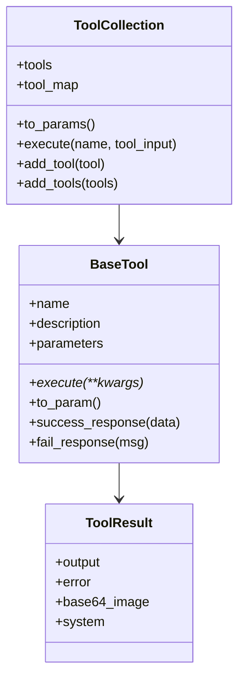

### 7.2 `ToolResult`

标准结果：

| 字段 | 用途 |
|------|------|
| `output` | 正常输出 |
| `error` | 错误输出 |
| `base64_image` | 图片/截图 |
| `system` | 工具系统消息 |

`__str__()` 规则：

```python
return f"Error: {self.error}" if self.error else self.output
```

这就是为什么工具结果最终可以被拼成 observation 字符串。

### 7.3 `ToolCollection`

职责：

1. 保存工具元组 `tools`；
2. 建立 `tool_map: name → tool`；
3. 提供 `to_params()` 给 LLM；
4. 提供 `execute(name, tool_input)` 给 Agent。

它没有复杂权限、tool group、deferred schema、缓存机制。

### 7.4 内置工具矩阵

| 工具 | 能力 | 主要使用方 |
|------|------|------------|
| `Terminate` | 结束任务 | 所有 Agent |
| `PythonExecute` | 子进程执行 Python 代码 | `Manus` |
| `Bash` | 持久 bash session | `SWEAgent`、MCP Server |
| `StrReplaceEditor` | 文件编辑 | `Manus`、`SWEAgent`、MCP Server |
| `BrowserUseTool` | 浏览器控制 | `Manus`、MCP Server |
| `AskHuman` | 向人提问 | `Manus`、`SandboxManus` |
| `PlanningTool` | 计划 CRUD | `PlanningFlow` |
| `MCPClientTool` | MCP 远端工具代理 | `Manus`、`MCPAgent` |
| `Sandbox*Tool` | Daytona 环境工具 | `SandboxManus` |

### 7.5 工具调用端到端

```text
模型返回:
  function.name = "str_replace_editor"
  function.arguments = "{\"command\":\"view\",\"path\":\"/tmp/a.py\"}"

ToolCallAgent.execute_tool()
  ├─ json.loads(arguments)
  ├─ available_tools.execute(name="str_replace_editor", tool_input=args)
  ├─ StrReplaceEditor.execute(...)
  ├─ ToolResult(output=...)
  └─ Message.tool_message("Observed output ...")
```

---

## 8. Flow 与 Plan 设计

> **源码逐步导读（sales.csv 完整示例 + 每步 Memory 快照）**：[PLAN_MODE_SOURCE_WALKTHROUGH.md](./PLAN_MODE_SOURCE_WALKTHROUGH.md)

### 8.1 Flow 不是 Agent

`Flow` 是 Agent 外层的编排器。它不直接执行工具，而是决定 **哪个 Agent 在什么时候执行什么任务**。

```text
Flow 负责：任务拆解、步骤调度、选择 Agent、收尾总结
Agent 负责：单个 step 内的 ReAct / tool calling
Tool 负责：实际动作
```

### 8.2 `BaseFlow`

`BaseFlow` 把输入 agents 统一成 dict：

```python
BaseAgent        → {"default": agent}
List[BaseAgent] → {"agent_0": a0, "agent_1": a1}
Dict[str, Agent] → 原样使用
```

并确定 `primary_agent_key`。

### 8.3 `FlowFactory`

当前只有一种 flow：

```python
FlowType.PLANNING → PlanningFlow
```

这说明 OpenManus 的 Flow 体系是可扩展骨架，但当前实现还很轻。

### 8.4 `PlanningFlow` 流程图

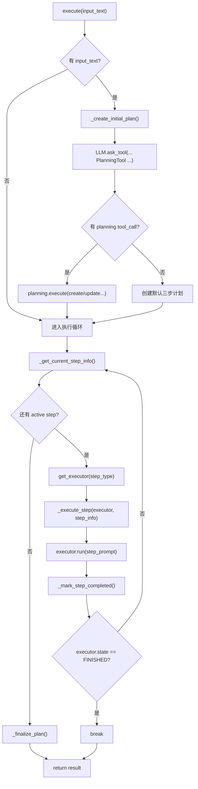

### 8.5 Plan 创建

`_create_initial_plan()` 不是硬编码拆步骤，而是让 LLM 调用 `PlanningTool`：

```text
system: You are a planning assistant...
user: Create a reasonable plan with clear steps...
tools: [planning_tool.to_param()]
tool_choice: auto
```

如果没有 tool call，则 fallback：

```text
Analyze request
Execute task
Verify results
```

### 8.6 多 Agent 选择

如果配置启用 `DataAnalysis`：

```toml
[runflow]
use_data_analysis_agent = true
```

`run_flow.py` 会加入：

```python
agents["data_analysis"] = DataAnalysis()
```

创建计划时，`PlanningFlow` 会把可用 agent 的 name/description 放入 planning system prompt，并提示模型在 step 中使用 `[agent_name]` 标记。

执行时：

```python
type_match = re.search(r"\[([A-Z_]+)\]", step)
step_info["type"] = type_match.group(1).lower()
executor = get_executor(step_type)
```

所以它的多 Agent 选择是 **文本约定 + executor key 匹配**，不是严格图编排。

### 8.7 PlanningFlow 源码级状态导读

核心文件：

- `app/flow/planning.py`
- `app/tool/planning.py`

`PlanningFlow` 自身持有四个关键字段：

| 字段 | 类型 | 作用 |
|------|------|------|
| `planning_tool` | `PlanningTool` | 计划的内存存储与 CRUD 工具 |
| `executor_keys` | `list[str]` | 哪些 Agent 可以执行步骤 |
| `active_plan_id` | `str` | 当前计划 ID，默认 `plan_{timestamp}` |
| `current_step_index` | `int | None` | 当前正在执行的步骤下标 |

`PlanningTool` 内部状态：

```python
plans: dict = {}
_current_plan_id: Optional[str] = None
```

一条 plan 的结构：

```python
{
    "plan_id": "plan_...",
    "title": "...",
    "steps": ["[MANUS] search info", "[DATA_ANALYSIS] analyze csv"],
    "step_statuses": ["not_started", "not_started"],
    "step_notes": ["", ""],
}
```

#### 8.7.1 创建计划：`_create_initial_plan()`

```text
输入：用户原始 request
  ↓
构造 system message:
  "You are a planning assistant..."
  如果有多个 executor，把 agent name/description 拼进去
  ↓
构造 user message:
  "Create a reasonable plan..."
  ↓
LLM.ask_tool(
  messages=[user_message],
  system_msgs=[system_message],
  tools=[planning_tool.to_param()],
  tool_choice=AUTO
)
  ↓
如果模型调用 planning:
  args = json.loads(tool_call.function.arguments)
  args["plan_id"] = active_plan_id
  planning_tool.execute(**args)
  ↓
如果没有 tool_call:
  创建默认三步计划
```

关键点：

- plan 不是规则引擎生成的，是 LLM 通过 `PlanningTool` 生成的；
- `plan_id` 由 Flow 强行覆盖，避免模型乱填；
- fallback 默认计划只有 `Analyze request / Execute task / Verify results`，可用但很粗。

#### 8.7.2 取当前步骤：`_get_current_step_info()`

```text
读取 plan_data = planning_tool.plans[active_plan_id]
  ↓
遍历 steps + step_statuses
  ↓
找到第一个 status in ["not_started", "in_progress"]
  ↓
构造 step_info = {"text": step}
  ↓
如果 step 里有 [AGENT_NAME]:
  step_info["type"] = lower(agent_name)
  ↓
planning_tool.execute(command="mark_step", step_status="in_progress")
  ↓
返回 (index, step_info)
```

这意味着：

- 被标成 `blocked` 的步骤不会被执行；
- 第一个未完成步骤优先，没有全局调度优化；
- `[AGENT_NAME]` 是文本约定，不是结构化字段。

#### 8.7.3 执行步骤：`_execute_step()`

```text
_get_plan_text()
  ↓
构造 step_prompt:
  CURRENT PLAN STATUS: ...
  YOUR CURRENT TASK: ...
  ↓
executor.run(step_prompt)
  ↓
_mark_step_completed()
  ↓
返回 step_result
```

这里有一个容易忽略的点：`executor.run(step_prompt)` 会进入完整 `BaseAgent.run()`，所以一个 plan step 内部仍然可能跑 20/30 个 tool-calling step。

```text
PlanningFlow step 1
  └─ Manus.run(step_prompt)
       ├─ ToolCallAgent step 1
       ├─ ToolCallAgent step 2
       └─ ...
```

#### 8.7.4 完成计划：`_finalize_plan()`

```text
_get_plan_text()
  ↓
LLM.ask(
  system="You are a planning assistant...",
  user="The plan has been completed..."
)
  ↓
返回 "Plan completed: ..."
```

如果 LLM 总结失败：

```text
primary_agent.run(summary_prompt)
```

再失败才返回固定错误文本。

#### 8.7.5 状态流转总表

| 阶段 | `PlanningTool.plans` | `current_step_index` | executor memory | 输出 |
|------|----------------------|----------------------|-----------------|------|
| 创建前 | 无 active plan | `None` | 未变化 | 无 |
| 创建后 | 新增 plan，steps 全是 `not_started` | `None` | 未变化 | plan created |
| 取步骤 | 当前 step 标为 `in_progress` | 当前 index | 未变化 | step_info |
| 执行中 | plan 状态不一定变化 | 当前 index | 追加 step_prompt、assistant、tool | step_result |
| 执行成功 | 当前 step 标为 `completed` | 当前 index | 保留执行上下文 | result 累加 |
| 无 active step | plan 全部 completed 或 blocked | `None` | 未变化 | final summary |

### 8.8 PlanningFlow 的局限

| 局限 | 源码原因 |
|------|----------|
| 无持久化 | `PlanningTool.plans` 是类字段 dict |
| 无并发 | `execute()` while 循环串行执行 |
| 无回滚 | `mark_step(completed)` 后没有 checkpoint |
| blocked 不处理 | `_get_current_step_info()` 只找 `not_started/in_progress` |
| agent 选择脆弱 | 依赖 step 文本中的 `[AGENT_NAME]` |
| step 粒度不可控 | LLM 生成步骤，fallback 只有三步 |

---

## 9. MCP 设计

### 9.1 总体拓扑

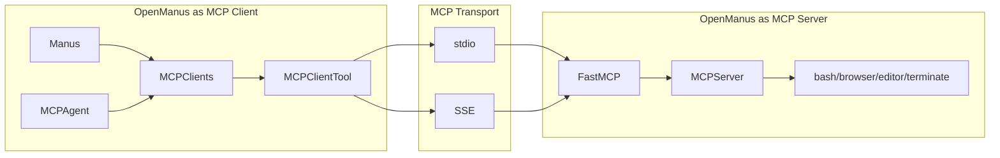

### 9.2 MCP Client

`MCPClients` 继承 `ToolCollection`，因此可以直接作为 Agent 的 `available_tools`。

连接流程：

```text
connect_stdio(command, args, server_id)
  ├─ stdio_client(StdioServerParameters)
  ├─ ClientSession(read, write)
  ├─ session.initialize()
  ├─ session.list_tools()
  └─ 每个远端 tool → MCPClientTool
```

工具命名：

```text
mcp_{server_id}_{original_name}
```

随后 sanitize：

- 非字母数字/`_`/`-` 替换为 `_`；
- 连续 `_` 合并；
- 首尾 `_` 删除；
- 超过 64 字符截断。

### 9.3 MCP Server

`MCPServer` 将 OpenManus 的 `BaseTool` 包装成 MCP tool。

关键点：

1. `tool.to_param()` 得到 OpenAI-style schema；
2. `_build_docstring()` 将 description + 参数说明转为函数 docstring；
3. `_build_signature()` 将 JSON Schema 类型映射到 Python annotation；
4. `self.server.tool()(tool_method)` 注册到 FastMCP。

### 9.4 MCPAgent 的工具刷新

`MCPAgent` 每 5 步执行：

```python
if self.current_step % self._refresh_tools_interval == 0:
    await self._refresh_tools()
```

`_refresh_tools()` 会：

- 调用 `mcp_clients.list_tools()`；
- 比较 `tool_schemas`；
- 发现新增/删除工具；
- 把变更写成 system message。

这让 MCPAgent 能适应远端工具变化，但它没有自动重建 `ToolCollection` 中已包装工具的完整机制，主要是 schema 侦测与提示。

---

## 10. Sandbox 与执行环境

OpenManus 有两套沙箱路径，容易混淆。

### 10.1 本地 Docker Sandbox

位置：`app/sandbox/`

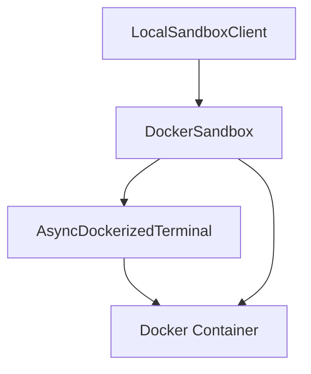

职责：

| 组件 | 作用 |
|------|------|
| `BaseSandboxClient` | 定义 run/copy/read/write/cleanup 接口 |
| `LocalSandboxClient` | 包装 `DockerSandbox` |
| `DockerSandbox` | 创建容器、文件读写、命令执行 |
| `AsyncDockerizedTerminal` | 容器内交互式 bash |
| `SANDBOX_CLIENT` | 全局单例 |

配置：

```toml
[sandbox]
use_sandbox = false
image = "python:3.12-slim"
work_dir = "/workspace"
memory_limit = "512m"
cpu_limit = 1.0
timeout = 300
network_enabled = false
```

### 10.2 Daytona Sandbox

位置：

- `app/daytona/sandbox.py`
- `app/daytona/tool_base.py`
- `app/tool/sandbox/*.py`
- `app/agent/sandbox_agent.py`

生命周期：

```text
SandboxManus.create()
  ├─ create_sandbox(password)
  │    ├─ DaytonaConfig
  │    ├─ Daytona.create(CreateSandboxFromImageParams)
  │    ├─ start_supervisord_session()
  │    └─ return Sandbox
  ├─ get_preview_link(6080) → VNC
  ├─ get_preview_link(8080) → website
  └─ add sandbox tools
```

Daytona 默认资源：

| 资源 | 值 |
|------|----|
| CPU | 2 |
| Memory | 4 |
| Disk | 5 |
| auto_stop_interval | 15 |
| auto_archive_interval | 24 * 60 |

### 10.3 两套沙箱的差异

| 维度 | 本地 Docker Sandbox | Daytona Sandbox |
|------|---------------------|-----------------|
| 入口 | `config.sandbox.use_sandbox` | `sandbox_main.py` / `SandboxManus` |
| 执行位置 | 本机 Docker | Daytona 云端 |
| 工具 | 本地工具可切到 SandboxFileOperator | 专用 `Sandbox*Tool` |
| 浏览器 | `BrowserUseTool` 本地浏览器 | sandbox 内浏览器 + VNC |
| 生命周期 | `SANDBOX_CLIENT.cleanup()` | `delete_sandbox()` |
| 适用 | 本地隔离执行 | 云端可视化环境 |

---

## 11. 端到端时序

### 11.1 默认 Manus：用户输入到工具执行

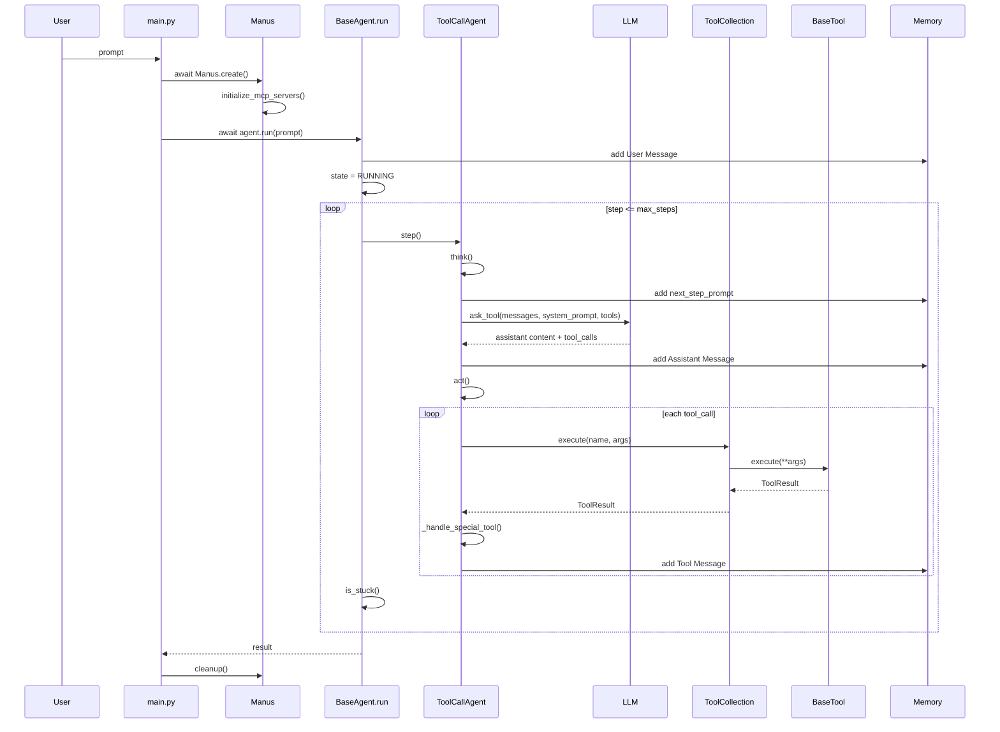

### 11.2 PlanningFlow：端到端任务规划

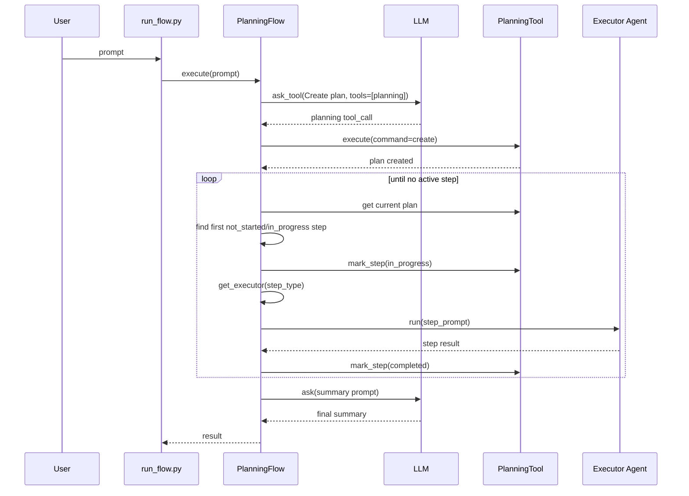

### 11.3 MCPAgent：远端工具调用

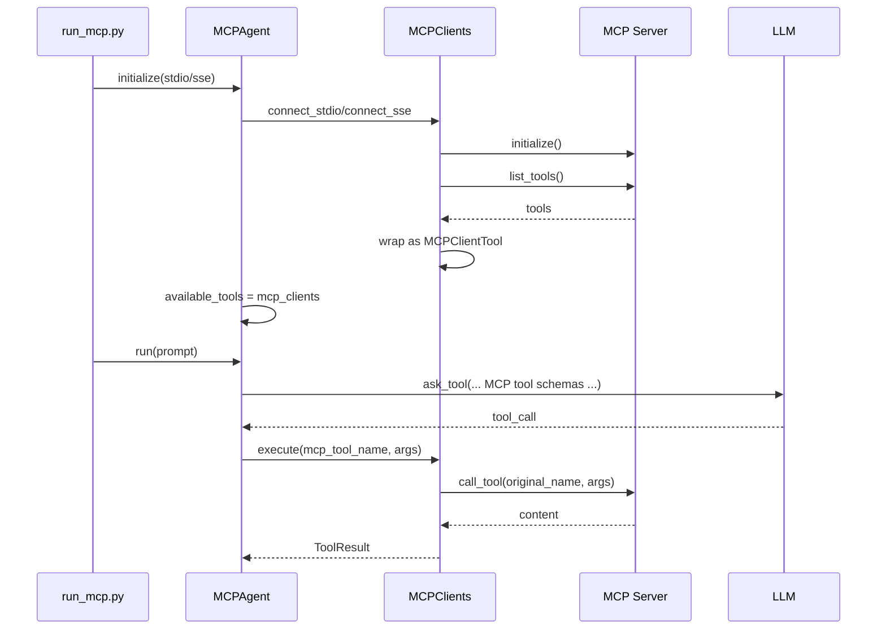

### 11.4 SandboxManus：Daytona 工具初始化

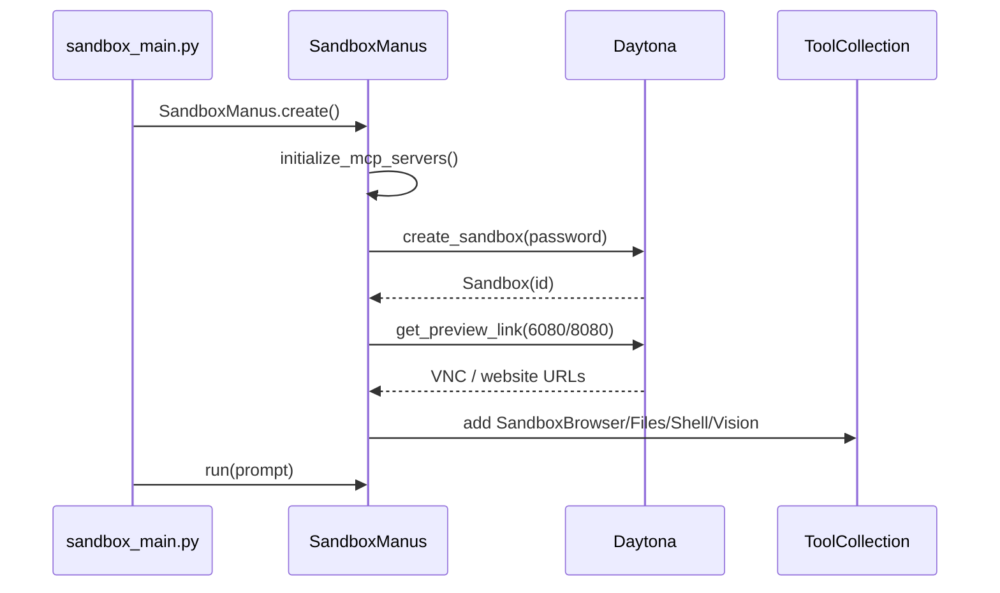

---

## 12. 模块设计索引

### 12.1 入口模块

| 文件 | 职责 |
|------|------|
| `main.py` | 默认 `Manus` CLI |
| `run_flow.py` | `PlanningFlow` CLI |
| `run_mcp.py` | MCP client CLI |
| `run_mcp_server.py` | MCP server 快捷入口 |
| `sandbox_main.py` | Daytona sandbox Agent CLI |

### 12.2 Agent 模块

| 文件 | 核心类 | 职责 |
|------|--------|------|
| `app/agent/base.py` | `BaseAgent` | 状态机、主循环、memory 更新 |
| `app/agent/react.py` | `ReActAgent` | `think()` / `act()` 抽象 |
| `app/agent/toolcall.py` | `ToolCallAgent` | LLM tool calling 与工具执行 |
| `app/agent/manus.py` | `Manus` | 默认通用 Agent |
| `app/agent/mcp.py` | `MCPAgent` | 远端 MCP 工具 Agent |
| `app/agent/sandbox_agent.py` | `SandboxManus` | Daytona 沙箱版 |
| `app/agent/data_analysis.py` | `DataAnalysis` | 数据分析与可视化 Agent |
| `app/agent/swe.py` | `SWEAgent` | Bash + editor 的软件工程 Agent |
| `app/agent/browser.py` | `BrowserAgent` / helper | 浏览器状态辅助 |

### 12.3 Flow 模块

| 文件 | 核心类 | 职责 |
|------|--------|------|
| `app/flow/base.py` | `BaseFlow` | 多 Agent 容器与 primary agent |
| `app/flow/planning.py` | `PlanningFlow` | 计划生成、步骤调度、总结 |
| `app/flow/flow_factory.py` | `FlowFactory` | 根据 `FlowType` 创建 flow |

### 12.4 Tool 模块

| 文件 | 核心类 | 职责 |
|------|--------|------|
| `app/tool/base.py` | `BaseTool`, `ToolResult` | 工具抽象与结果 |
| `app/tool/tool_collection.py` | `ToolCollection` | 工具注册与分发 |
| `app/tool/planning.py` | `PlanningTool` | plan CRUD |
| `app/tool/mcp.py` | `MCPClients`, `MCPClientTool` | MCP client 工具代理 |
| `app/tool/terminate.py` | `Terminate` | 终止 Agent |
| `app/tool/python_execute.py` | `PythonExecute` | Python 代码执行 |
| `app/tool/browser_use_tool.py` | `BrowserUseTool` | 浏览器自动化 |
| `app/tool/str_replace_editor.py` | `StrReplaceEditor` | 文件编辑 |

### 12.5 Runtime 模块

| 文件 | 职责 |
|------|------|
| `app/llm.py` | LLM 客户端、token 统计、tool calling |
| `app/schema.py` | Message / Memory / ToolCall / AgentState |
| `app/config.py` | 配置模型与加载 |
| `app/mcp/server.py` | FastMCP server |
| `app/sandbox/client.py` | Sandbox client 抽象 |
| `app/sandbox/core/sandbox.py` | Docker sandbox |
| `app/daytona/sandbox.py` | Daytona sandbox 生命周期 |

---

## 13. 状态、记忆与持久化边界

### 13.1 Memory 是什么

`Memory` 是一个简单消息列表：

```python
class Memory(BaseModel):
    messages: List[Message] = Field(default_factory=list)
    max_messages: int = Field(default=100)
```

行为：

- `add_message()` 追加消息；
- 超过 `max_messages` 时保留最后 100 条；
- 没有 summary；
- 没有 vector search；
- 没有 session persistence。

### 13.2 与 Hermes 的差异

Hermes 的文档中会强调 `MEMORY.md`、`USER.md`、session search、external memory provider。OpenManus 没有这些层。

| 记忆层 | Hermes | OpenManus |
|--------|--------|-----------|
| 系统 prompt 文件记忆 | `SOUL.md`、`MEMORY.md`、`USER.md` | 无 |
| 当前会话 | SQLite session | `Memory.messages` 内存列表 |
| 压缩 | conversation compression | 无 |
| 长期记忆 | memory provider | 无 |
| 会话恢复 | `--resume` / sessions | 无内置 |

### 13.3 当前边界

OpenManus 的设计更接近 **教学/原型 Agent kernel**：

```text
短期上下文：Memory.messages
任务终止：Terminate / max_steps
会话恢复：需要应用层自行实现
长期记忆：需要应用层自行扩展 Tool 或 Middleware
```

如果要增加持久化，最小改造点：

1. 在 `BaseAgent.run()` 开始时加载 session；
2. 在 `Memory.add_message()` 后写入 JSON/SQLite；
3. 在 `LLM.ask_tool()` 前做上下文压缩；
4. 结束时保存 `state/current_step/messages`。

### 13.4 Memory 源码级导读

核心文件：`app/schema.py`

`Memory` 的完整行为可以概括为：

```text
Memory
  ├─ messages: List[Message] = []
  ├─ max_messages: int = 100
  ├─ add_message(message)
  │    ├─ self.messages.append(message)
  │    └─ if len(messages) > max_messages:
  │           self.messages = self.messages[-max_messages:]
  ├─ add_messages(messages)
  │    ├─ extend
  │    └─ 同样保留最后 max_messages 条
  ├─ clear()
  ├─ get_recent_messages(n)
  └─ to_dict_list()
```

这不是 Hermes/Letta/AgentScope 意义上的 memory 子系统，而是 **对话上下文窗口缓存**。

| 问题 | OpenManus 当前答案 |
|------|--------------------|
| 是否有短期记忆？ | 有，`Memory.messages` |
| 是否有长期记忆？ | 无 |
| 是否有 session resume？ | 无 |
| 是否有 summary？ | 无 |
| 是否有向量检索？ | 无 |
| 是否有自动压缩？ | 无 |
| 超过 100 条怎么办？ | 直接保留最后 100 条，前面的物理丢弃 |

### 13.5 “截断”与“压缩”的区别

OpenManus 有 **截断**，没有 **压缩**。

```text
已有 100 条 message
新增第 101 条
  ↓
self.messages = self.messages[-100:]
  ↓
最老 1 条直接丢失，不进入 summary
```

这和 AgentScope / deepagents / Hermes 的压缩完全不同：

| 框架 | 行为 |
|------|------|
| OpenManus | 超过 `max_messages` 直接丢头部 |
| AgentScope v2 | 旧 context 进入 `summary`，保留近期 context |
| deepagents/deer-flow | SummarizationMiddleware 压缩旧消息 |
| Hermes | conversation compression + todo/memory reinjection |

因此如果任务很长，OpenManus 可能出现：

1. 早期用户约束被截掉；
2. 早期工具观察被截掉；
3. plan 外的关键背景丢失；
4. 模型不知道自己为什么走到当前状态。

### 13.6 TokenLimitExceeded 不是压缩

核心文件：`app/llm.py`

`LLM.ask()`、`ask_with_images()`、`ask_tool()` 都会：

```text
1. format_messages()
2. count_message_tokens(messages)
3. 如果有 tools，再加 tools schema token
4. check_token_limit(input_tokens)
5. 超限 → raise TokenLimitExceeded
```

`ToolCallAgent.think()` 捕获 token limit 后：

```text
memory.add_message(
  Message.assistant_message(
    "Maximum token limit reached, cannot continue execution: ..."
  )
)
state = FINISHED
return False
```

也就是说，token 超限后的行为是 **终止任务**，不是自动压缩后继续。

### 13.7 PlanningFlow 的 memory 边界

`PlanningFlow` 自己维护 `PlanningTool.plans`，但它不会自动注入到全局 memory。每执行一步时，它构造一个新的 `step_prompt`：

```text
CURRENT PLAN STATUS:
{plan_status}

YOUR CURRENT TASK:
You are now working on step {index}: "{step_text}"

Please only execute this current step...
```

然后调用：

```python
step_result = await executor.run(step_prompt)
```

这会把 `step_prompt` 当作新的 user message 写入 executor 的 `Memory.messages`。

所以 PlanningFlow 的状态有两份：

| 状态 | 存放位置 | 生命周期 |
|------|----------|----------|
| 计划结构 | `PlanningTool.plans[active_plan_id]` | Flow 实例内存 |
| 每步执行上下文 | executor 的 `Memory.messages` | Agent 实例内存 |

它没有把 plan 存到文件，也没有 checkpoint。如果进程退出，计划和执行上下文都会丢失。

### 13.8 如果要补真正 memory/compression，插入点在哪里

最小改造路径：

```text
Memory.add_message()
  → 加 session 持久化 hook

ToolCallAgent.think()
  → ask_tool() 前检查 token
  → 如果接近阈值，调用 summarize_messages()
  → 用 summary + recent messages 替换 self.memory.messages

PlanningFlow._mark_step_completed()
  → 持久化 planning_tool.plans

BaseAgent.run()
  → 支持 session_id / load / save
```

建议新增接口：

```python
class MemoryCompressor:
    async def compress(self, messages: list[Message]) -> tuple[str, list[Message]]:
        ...

class SessionStore:
    async def load(session_id: str) -> Memory:
        ...

    async def save(session_id: str, memory: Memory, state: AgentState) -> None:
        ...
```

这样可以保持 OpenManus 当前轻量结构，又不会把压缩逻辑塞进 `LLM` 或具体工具。

---

## 14. 错误处理与资源清理

### 14.1 Agent 错误处理

| 位置 | 行为 |
|------|------|
| `state_context()` | 异常时 `state = ERROR` |
| `ToolCallAgent.think()` | 捕获 token limit 并置 `FINISHED` |
| `execute_tool()` | JSON 错误/未知工具/执行异常转为 `Error: ...` |
| `PlanningFlow.execute()` | 总体异常返回 `Execution failed: ...` |
| `MCPAgent.think()` | MCP session 或工具为空时置 `FINISHED` |

### 14.2 防卡死

`BaseAgent.is_stuck()` 检查最近 assistant content 是否重复超过阈值：

```text
如果重复 assistant 内容 >= duplicate_threshold
  → handle_stuck_state()
  → 把“换策略”的提示追加到 next_step_prompt
```

这是一个轻量启发式，不是严格 loop detector。

### 14.3 资源清理

| 资源 | 清理位置 |
|------|----------|
| 通用 sandbox client | `BaseAgent.run()` 结束后 `SANDBOX_CLIENT.cleanup()` |
| 工具级 cleanup | `ToolCallAgent.cleanup()` 遍历工具 |
| Browser | `Manus.cleanup()` / `SandboxManus.cleanup()` |
| MCP sessions | `disconnect_mcp_server()` / `MCPAgent.cleanup()` |
| Daytona sandbox | `SandboxManus.cleanup()` → `delete_sandbox()` |
| MCP server browser | `MCPServer.cleanup()` |

注意：`ToolCallAgent.run()` 自身有 `finally: await self.cleanup()`，而 `main.py` 也会在 finally 调 `agent.cleanup()`，因此某些工具清理需要具备幂等性。

---

## 15. 与 Hermes / deepagents / deer-flow / AgentScope 对比

### 15.1 总览矩阵

| 维度 | OpenManus | Hermes | deepagents | deer-flow | AgentScope v2 |
|------|-----------|--------|------------|-----------|---------------|
| 核心 loop | 手写 ReAct + tool call | 命令式长期 agent loop | LangGraph middleware | LangGraph middleware 链 | Agent + middleware |
| Plan | `PlanningFlow` 外层 | todo + `/plan` skill | Todo middleware | `is_plan_mode` + todo | Skill/Task/Service 组合 |
| Memory | 内存 messages | SQLite + MEMORY/USER + provider | checkpoint + MemoryMiddleware | ThreadState + memory.json | context/summary + service storage |
| MCP | 轻量 client/server | 插件/网关能力 | 经 adapter | 一等 + deferred | MCPClient |
| Sandbox | Docker 抽象 + Daytona | local/docker/ssh/modal/daytona | backend protocol | Local/Docker/AIO | Local/Docker/E2B Workspace |
| 多 Agent | Flow 选 executor | delegate_task/kanban | subagent middleware | task subagent | Agent Team |
| 服务化 | 无主 Gateway | Gateway 多平台 | SDK/Platform | Gateway/Web | Agent Service |
| 复杂度 | 低 | 高 | 中 | 高 | 中高 |

### 15.2 与 Hermes

OpenManus 和 Hermes 都是命令式 Agent loop，但定位差异很大。

| 项 | OpenManus | Hermes |
|----|-----------|--------|
| 文档风格 | README 简单 | 大量系统文档 |
| 运行形态 | CLI 原型 | 长期个人助手 + Gateway |
| 记忆 | 内存 messages | MEMORY.md / USER.md / SQLite / provider |
| 工具 | 本地工具 + MCP | toolsets、skills、plugins、terminal backends |
| 子 Agent | PlanningFlow 简单 executor | delegate_task + kanban |
| 适合 | 学习和二次开发 | 个人生产力系统 |

### 15.3 与 deepagents / deer-flow

OpenManus 的 Plan 是 Flow 控制，deepagents/deer-flow 的 Plan 更像 Agent 内部 todo。

```text
OpenManus:
  Flow 先创建 plan → 每步调用 Agent.run(step_prompt)

deepagents/deer-flow:
  Agent 在同一个 ReAct loop 中随时 write_todos / update_todos
```

影响：

| 方面 | OpenManus PlanningFlow | deepagents/deer-flow Todo |
|------|------------------------|----------------------------|
| 规划与执行 | 分阶段 | 交织 |
| 状态位置 | `PlanningTool.plans` 内存 dict | graph state / thread state |
| checkpoint | 无 | 有 |
| 中途调整 | 通过 PlanningTool update | 模型随时改 todos |
| 多 Agent | step 文本匹配 executor | subagent tool / middleware |

### 15.4 与 AgentScope v2

AgentScope v2 是更完整的 SDK/Service 体系；OpenManus 是更轻的原型框架。

| 维度 | OpenManus | AgentScope v2 |
|------|-----------|---------------|
| Agent API | `agent.run(prompt)` | `reply()` / `reply_stream()` |
| 事件流 | 无统一 event bus | Event System |
| 权限 | 无系统权限层 | Permission System |
| Session | 无内置 | SDK state + Agent Service 多 session |
| Workspace | Docker/Daytona | Local/Docker/E2B Workspace |
| 适合 | 学习与改造 | 生产 SDK + 服务 |

---

## 16. 设计优缺点与改造建议

### 16.1 优点

| 优点 | 说明 |
|------|------|
| 易读 | 主循环、ReAct、ToolCall 分层清晰 |
| 易扩展工具 | 新建 `BaseTool` 并加入 `ToolCollection` 即可 |
| MCP 双向 | 既可作为 MCP client，也可作为 MCP server |
| Flow 思路清楚 | `PlanningFlow` 展示了外层编排如何复用 Agent |
| 沙箱路线完整 | 有本地 Docker 抽象，也有 Daytona 云环境 |
| 模块边界直观 | `agent/flow/tool/llm/schema/config` 分工明确 |

### 16.2 风险与不足

| 问题 | 影响 |
|------|------|
| 无 checkpoint/session | 进程退出后任务上下文丢失 |
| Memory 简单截断 | 超长任务会丢早期上下文 |
| Tool result 字符串化 | 结构化结果难以复用 |
| Plan 内存态 | `PlanningTool.plans` 不持久化 |
| 权限缺失 | 文件/浏览器/shell 工具缺少统一审批 |
| MCP 工具刷新不完整 | `MCPAgent` 检测 schema 变化，但动态重包能力有限 |
| 清理可能重复 | `run()` 和入口 finally 都可能调用 cleanup |
| 多 Agent 选择脆弱 | `[AGENT]` 文本约定依赖模型遵守 |

### 16.3 改造路线

#### 路线 A：做成可靠 CLI Agent

1. 增加 session 存储；
2. 增加 conversation compression；
3. 增加权限审批层；
4. 增加 checkpoint / rollback；
5. 增加配置化工具开关。

#### 路线 B：做成服务化 Agent

1. 增加 FastAPI Gateway；
2. 将 `Agent.run()` 改为 event stream；
3. 引入 session_id / user_id；
4. 持久化 messages、tool calls、artifacts；
5. sandbox per session 隔离。

#### 路线 C：做成 LangGraph-like 编排

1. 把 `AgentState` 从 enum 扩成 structured state；
2. 把 `think/act` 做成节点；
3. 把 Tool execution 做成独立节点；
4. `PlanningFlow` 改成可恢复状态机；
5. 引入 checkpointer。

#### 路线 D：强化 MCP 平台能力

1. `MCPClients` 支持热重建工具；
2. 增加 resource/prompt 支持；
3. 增加 tool namespace 冲突策略；
4. 支持 OAuth / headers；
5. 将 MCP server 工具配置化。

---

## 17. 阅读源码路线

### 17.1 30 分钟路线

```text
main.py
  → app/agent/manus.py
  → app/agent/base.py
  → app/agent/react.py
  → app/agent/toolcall.py
  → app/tool/base.py
  → app/tool/tool_collection.py
```

读完可以回答：默认 Agent 怎么从用户输入走到工具执行。

### 17.2 1 小时路线

```text
30 分钟路线
  → app/schema.py
  → app/llm.py
  → app/config.py
  → app/tool/python_execute.py
  → app/tool/browser_use_tool.py
  → app/tool/str_replace_editor.py
```

读完可以回答：模型、消息、工具 schema 如何拼起来。

### 17.3 2 小时路线

```text
1 小时路线
  → run_flow.py
  → app/flow/base.py
  → app/flow/planning.py
  → app/tool/planning.py
  → run_mcp.py
  → app/agent/mcp.py
  → app/tool/mcp.py
  → app/mcp/server.py
```

读完可以回答：Plan 和 MCP 如何扩展默认 Agent。

### 17.4 进阶路线

```text
sandbox_main.py
  → app/agent/sandbox_agent.py
  → app/daytona/sandbox.py
  → app/daytona/tool_base.py
  → app/tool/sandbox/*
  → app/sandbox/client.py
  → app/sandbox/core/sandbox.py
  → app/sandbox/core/terminal.py
```

读完可以回答：本地 Docker 与 Daytona 两套执行环境如何工作。

---

## 附录 A：端到端调用链速查

### A.1 默认 Agent

```text
main.py
  → Manus.create()
  → Manus.initialize_mcp_servers()
  → BaseAgent.run(prompt)
  → ReActAgent.step()
  → ToolCallAgent.think()
  → LLM.ask_tool()
  → ToolCallAgent.act()
  → ToolCollection.execute()
  → BaseTool.execute()
  → Message.tool_message()
  → Terminate or max_steps
```

### A.2 PlanningFlow

```text
run_flow.py
  → FlowFactory.create_flow(PLANNING)
  → PlanningFlow.execute(prompt)
  → _create_initial_plan()
  → PlanningTool.execute(create)
  → _get_current_step_info()
  → get_executor()
  → executor.run(step_prompt)
  → _mark_step_completed()
  → _finalize_plan()
```

### A.3 MCP

```text
run_mcp.py
  → MCPAgent.initialize()
  → MCPClients.connect_stdio/connect_sse()
  → ClientSession.list_tools()
  → MCPClientTool(...)
  → MCPAgent.run()
  → MCPClientTool.execute()
  → ClientSession.call_tool()
```

### A.4 Sandbox

```text
sandbox_main.py
  → SandboxManus.create()
  → create_sandbox()
  → start_supervisord_session()
  → get_preview_link()
  → add Sandbox tools
  → SandboxManus.run()
  → Sandbox tool execute()
```

---

## 附录 B：核心概念速查

| 概念 | 在 OpenManus 中的含义 |
|------|------------------------|
| Agent | 拥有 memory、state、LLM、tools 的执行体 |
| ReAct | 每 step 先 think 再 act |
| ToolCallAgent | 用 LLM tool calling 实现 ReAct |
| Memory | 内存消息列表，不是长期记忆 |
| Tool | 可被模型调用的动作 |
| ToolCollection | 工具注册表与分发器 |
| Flow | Agent 外层编排器 |
| PlanningFlow | 先 plan 后按 step 调用 Agent |
| MCPAgent | 只使用 MCP 远端工具的 Agent |
| MCPServer | 把 OpenManus 工具暴露为 MCP server |
| SandboxManus | 使用 Daytona sandbox 工具的 Agent |
| Terminate | 设置 `FINISHED` 的特殊工具 |

---

**最后更新**: 2026-06-08

