# OpenManus — 架构文档（第 1 部分）

> **版本**: 1.0（2026-09-09）· **源码**: `OpenManus/app/`  
> **体例参照**: [agent-framework/docs/ARCHITECTURE_PART1.md](../../agent-framework/docs/ARCHITECTURE_PART1.md)  
> **导读**: [DESIGN_THINKING_SERIES.md](./DESIGN_THINKING_SERIES.md) · **专题**: [ARCHITECTURE_PART2.md](./ARCHITECTURE_PART2.md) · **全维度**: [ARCHITECTURE_ATLAS.md](./ARCHITECTURE_ATLAS.md)  
> **全量深潜**: [OpenManus/docs/ARCHITECTURE_DESIGN.md](../../OpenManus/docs/ARCHITECTURE_DESIGN.md)

---

## 目录

- [§0 阅读导航](#0-阅读导航)
- [§1 项目定位与分层](#1-项目定位与分层)
  - [1.1 项目定位](#11-项目定位)
  - [1.2 分层架构](#12-分层架构)
- [§2 包地图与模块设计](#2-包地图与模块设计)
  - [2.1 app 结构](#21-app-结构)
  - [2.2 Agent 继承链](#22-agent-继承链)
- [§3 核心实体与类图](#3-核心实体与类图)
  - [3.1 协议实体](#31-协议实体)
  - [3.2 状态机](#32-状态机)
  - [3.3 Memory 截断](#33-memory-截断)
- [§4 Agent 设计 — 五大核心模块](#4-agent-设计--五大核心模块)
  - [4.1 模块总览](#41-模块总览)
  - [4.2 BaseAgent.run](#42--baseagentrun--外层循环)
  - [4.3 think](#43--think--模型决策)
  - [4.4 act](#44--act--工具副作用)
  - [4.5 ToolCollection](#45--toolcollection)
  - [4.6 Terminate 与卡住检测](#46--terminate-与卡住检测)
- [§5 think/act 内层循环](#5-thinkact-内层循环)
- [§6 PlanningFlow 外层编排](#6-planningflow--外层编排)
- [§7 端到端时序与示例](#7-端到端时序与示例)
- [§8 特点与优势](#8-特点与优势)
- [§9 边界与非目标](#9-边界与非目标)
- [附录 A 源码速查](#附录-a源码速查)

---

## §0 阅读导航

### 0.1 一句话心智模型

```text
用户 prompt
  → Manus.create()（可选 MCP 合并工具）
  → BaseAgent.run()
  → while step < max_steps && state != FINISHED:
        ReActAgent.step()
          think(): next_step_prompt → LLM.ask_tool(tools)
          act():   ToolCollection.execute(tool_calls)
        Terminate → FINISHED
  → cleanup()

可选外层: PlanningFlow.execute()
  → PlanningTool.create(plan)
  → 每 step: executor.run(step_prompt)  # 完整内层 ReAct
```

### 0.2 章节索引

| 章节 | 内容 | 关键源码 |
|------|------|----------|
| §1 | 项目定位与分层 | `app/agent/` |
| §2 | 包地图与模块设计 | `app/` 树 |
| §3 | 核心实体与类图 | `schema.py` |
| §4 | Agent 设计五大模块 | base → react → toolcall → manus |
| §5 | think/act 内层循环 | `toolcall.py` |
| §6 | PlanningFlow 外层编排 | `flow/planning.py` |
| §7 | 端到端时序与示例 | `main.py`, `run_flow.py` |
| §8 | 特点与优势 | — |
| §9 | 边界与非目标 | — |

### 0.3 与 MetaGPT 对照（同团队基因）

| | OpenManus | MetaGPT |
|--|-----------|---------|
| 编排 | 单 Agent + 可选 Flow | Team + Environment 多 Role |
| 协作 | PlanningFlow 步骤 | 消息总线 SOP |
| 状态 | 内存 Memory | 消息 + ProjectRepo |
| 定位 | **可读内核** | **公司式多 Agent** |

---

## §1 项目定位与分层

### 1.1 项目定位

**OpenManus** = **轻量 Manus-like Agent 内核**：

1. **手写 ReAct 循环** — 无 LangGraph、无 checkpoint
2. **think + act 分离** — 决策与副作用清晰
3. **OpenAI tool calling** — `LLM.ask_tool` + `ToolCollection`
4. **外层可选 PlanningFlow** — Plan-and-Execute 示例
5. **MCP 双向** — 客户端代理工具 + FastMCP 服务端

**故意不做**：多租户 Gateway、权限框架、向量长期记忆、统一事件流。

### 1.2 分层架构

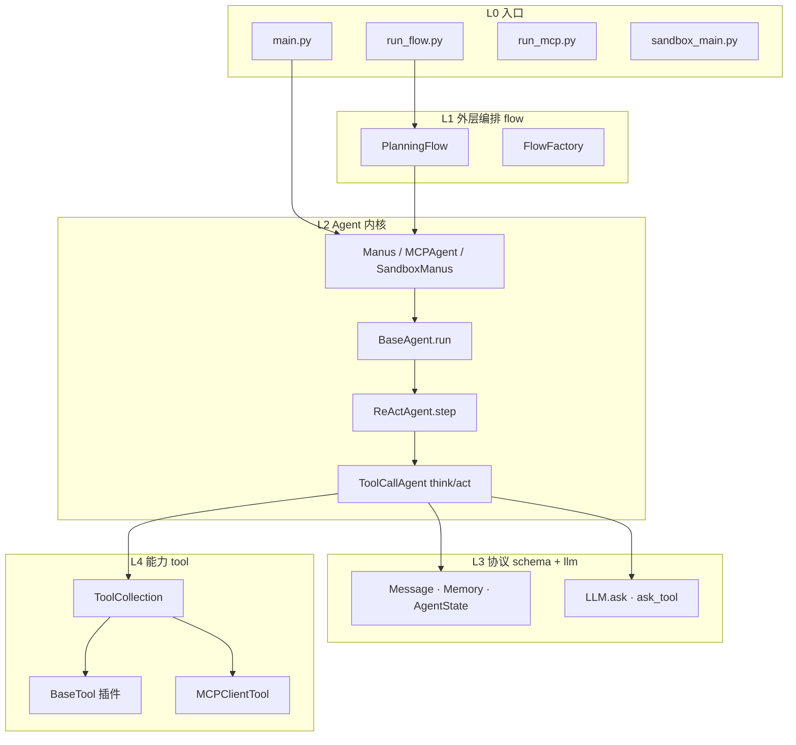

| 层 | 回答的问题 |
|----|------------|
| **入口** | 单 Agent / 计划 / MCP / 沙箱 |
| **flow** | 谁在多 step 间排班 |
| **agent** | 何时 think、何时停 |
| **schema/llm** | 消息长什么样、如何调模型 |
| **tool** | 如何执行副作用 |

---

## §2 包地图与模块设计

### 2.1 `app/` 结构

| 路径 | 职责 |
|------|------|
| `agent/base.py` | `run()` 循环、状态机、卡住检测 |
| `agent/react.py` | 抽象 `think()` / `act()` |
| `agent/toolcall.py` | OpenAI tool calling |
| `agent/manus.py` | 默认通用 Agent + MCP 接线 |
| `agent/mcp.py` | MCPAgent |
| `agent/sandbox_agent.py` | SandboxManus |
| `schema.py` | Message, Memory, ToolCall, AgentState |
| `llm.py` | 多 Provider、`ask` / `ask_tool` |
| `tool/base.py` | BaseTool ABC |
| `tool/tool_collection.py` | 统一 execute |
| `tool/planning.py` | PlanningTool 内存 plan |
| `tool/mcp.py` | MCPClients, MCPClientTool |
| `flow/planning.py` | PlanningFlow |
| `flow/flow_factory.py` | FlowType 工厂 |
| `mcp/server.py` | FastMCP 服务端 |

### 2.2 Agent 继承链

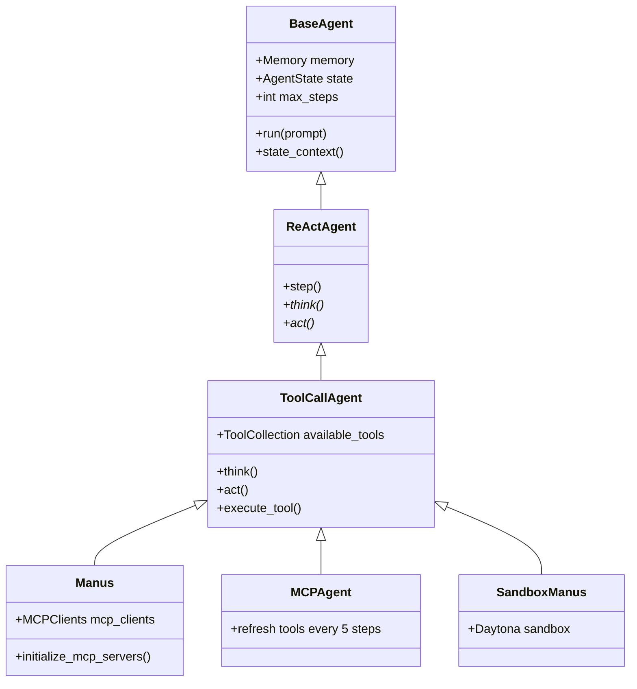

---

## §3 核心实体与类图

### 3.1 协议实体

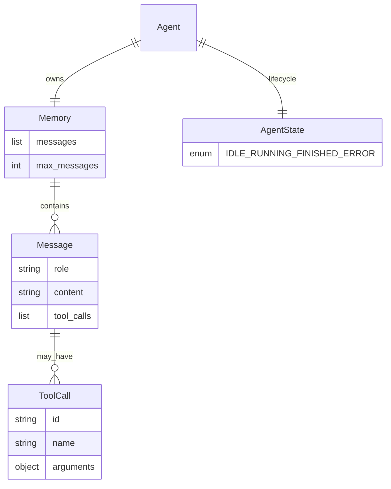

### 3.2 状态机

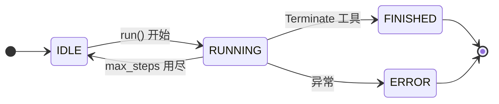

| 状态 | 含义 |
|------|------|
| **IDLE** | 可接受新 `run()` |
| **RUNNING** | `state_context()` 内 |
| **FINISHED** | `Terminate` 成功结束 |
| **ERROR** | 异常捕获 |

**校正**：`max_steps` 用尽 → 回到 **IDLE**，**不等于** FINISHED。

### 3.3 Memory 截断

- `max_messages=100` 尾截断（`schema.py`）
- 无持久化、无 compaction 策略

---

## §4 Agent 设计 — 五大核心模块

### 4.1 模块总览

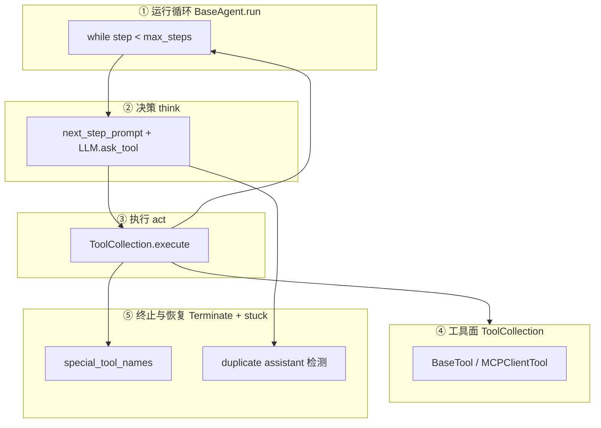

### 4.2 ① BaseAgent.run — 外层循环

**文件**: `app/agent/base.py`

```python
# 概念流程
async def run(self, request: str) -> str:
    if self.state != AgentState.IDLE: raise RuntimeError(...)
    self.memory.add_message(Message.user_message(request))
    async with self.state_context():  # → RUNNING
        while self.current_step < self.max_steps and self.state != FINISHED:
            self.current_step += 1
            step_result = await self.step()
            if self.is_stuck(): self.handle_stuck()
    if self.current_step >= self.max_steps:
        self.current_step = 0
        self.state = AgentState.IDLE
    return last_assistant_content
```

#### 这层“外层循环”到底循环什么？

`BaseAgent.run()` 是 Agent 的**总控循环**。它本身不负责让 LLM 思考，也不直接执行工具；它只负责反复调用一次 `self.step()`，直到任务完成或达到步数上限：

```text
run() 的 while
  ├── 第 1 轮：step() = think() → act()
  ├── 第 2 轮：step() = think() → act()
  ├── 第 3 轮：step() = think() → act()
  └── ...
```

因此，这里的“外层”是相对于 `step()` 内部的 `think/act` 而言的：

- **`run()`**：控制“还要不要继续下一轮”，维护 `current_step`，检查 `max_steps`、`FINISHED` 和卡住状态。
- **`step()`**：完成一轮 ReAct，通常依次调用一次 `think()` 和一次 `act()`。
- **`think()`**：读取 Memory，把当前上下文交给 LLM，得到下一步的工具调用决策。
- **`act()`**：执行 `think()` 选出的工具，并把工具结果写回 Memory。

要注意：源码里并不是在 `think()` 或 `act()` 函数内部再写一个 `while`。真正的 `while` 写在 `BaseAgent.run()` 中；“think/act 内层循环”是对下面这种**跨多次 `step()` 反复发生的行为循环**的概念描述：

```text
第 1 轮：think → act → 工具结果写入 Memory
第 2 轮：think → act → 工具结果写入 Memory
第 3 轮：think → act → 工具结果写入 Memory
```

每一轮的 `act()` 把观察结果写入 Memory，下一轮的 `think()` 再读取这些历史，因此 Agent 才能形成：

```text
思考 → 行动 → 观察 → 再思考
```

例如“分析 sales.csv 并写报告”可能经过：

```text
第 1 轮：think 选择读取 CSV      → act 执行读取
第 2 轮：think 选择统计数据      → act 执行分析
第 3 轮：think 选择创建报告      → act 写入 report.md
第 4 轮：think 调用 Terminate    → act 将状态设为 FINISHED
```

其中，`Terminate` 会让 `self.state` 变为 `FINISHED`，于是 `run()` 的循环条件不再满足；如果一直没有终止，循环最多执行 `max_steps` 轮。也就是说，`max_steps` 限制的是 **`step()` / think-act 轮数**，不是单个工具调用的数量。一次 `act()` 内部仍可能顺序执行 LLM 返回的多个 `tool_calls`。

### 4.3 ② think — 模型决策

**文件**: `app/agent/toolcall.py`

| 输入 | 输出 |
|------|------|
| Memory + `next_step_prompt`（合成 user） | assistant Message（含 `tool_calls`） |

- 调用 `llm.ask_tool(messages, tools=available_tools.to_params())`
- `tool_choices` 策略：`AUTO` / `REQUIRED` / `NONE`

### 4.4 ③ act — 工具副作用

| 步骤 | 行为 |
|------|------|
| 遍历 `tool_calls` | `execute_tool(name, args)` |
| 写回 Memory | `Message.tool_message(result)` |
| 特殊工具 | `Terminate` → `AgentState.FINISHED` |

### 4.5 ④ ToolCollection

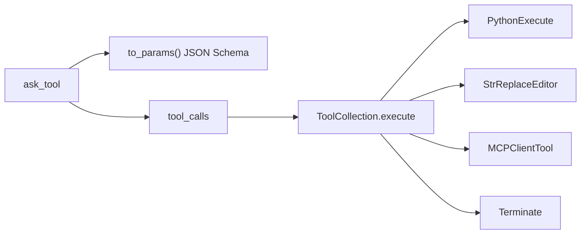

| 类别 | 代表工具 |
|------|----------|
| 代码/文件 | PythonExecute, StrReplaceEditor, Bash |
| 人机 | AskHuman |
| 规划 | PlanningTool |
| 控制 | Terminate |
| 远程 | MCPClientTool |
| 沙箱 | Sandbox*（Daytona） |

### 4.6 ⑤ Terminate 与卡住检测

**Terminate**（`app/tool/terminate.py`）：

- 参数 `status: "success" | "failure"`
- 在 `special_tool_names` 中 → `_handle_special_tool()` 设 FINISHED

**卡住检测**（`base.py`）：

- 连续重复 assistant `content` ≥ `duplicate_threshold=2`
- 改写 `next_step_prompt` 催促换策略

---

## §5 think/act 内层循环

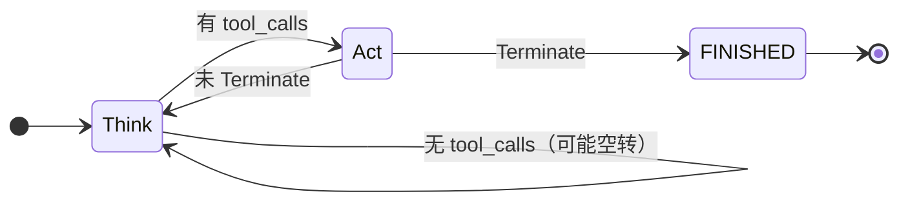

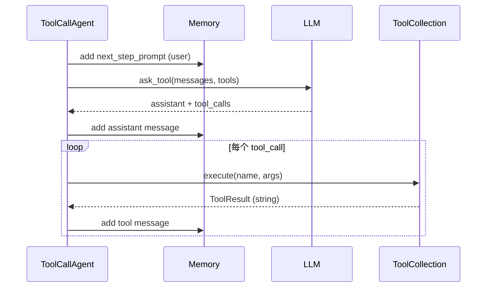

### max_steps 默认值

| Agent | max_steps | 文件 |
|-------|-----------|------|
| BaseAgent | 10 | `base.py` |
| ToolCallAgent | 30 | `toolcall.py` |
| Manus | 20 | `manus.py` |
| MCPAgent | 20 | `mcp.py` |

---

## §6 PlanningFlow — 外层编排

> **源码逐步导读（含完整示例与 Memory 快照）**：[PLAN_MODE_SOURCE_WALKTHROUGH.md](./PLAN_MODE_SOURCE_WALKTHROUGH.md)

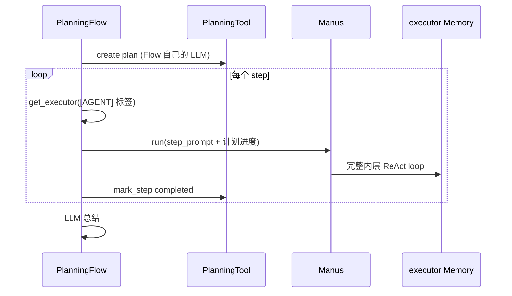

| 设计点 | 含义 |
|--------|------|
| **双 LLM** | 规划器与执行器分离 |
| **`[AGENT_NAME]` 标签** | 步骤路由约定（脆弱但简单） |
| **每 step 一次 `run()`** | 内层完整 ReAct；同一 executor 实例的 Memory **默认不 clear**，会跨 plan step 累积。见 [源码导读](./PLAN_MODE_SOURCE_WALKTHROUGH.md) |

**PlanStepStatus**: `not_started` → `in_progress` → `completed` / `blocked`

---

## §7 端到端时序与示例

### 7.1 默认 main.py 路径

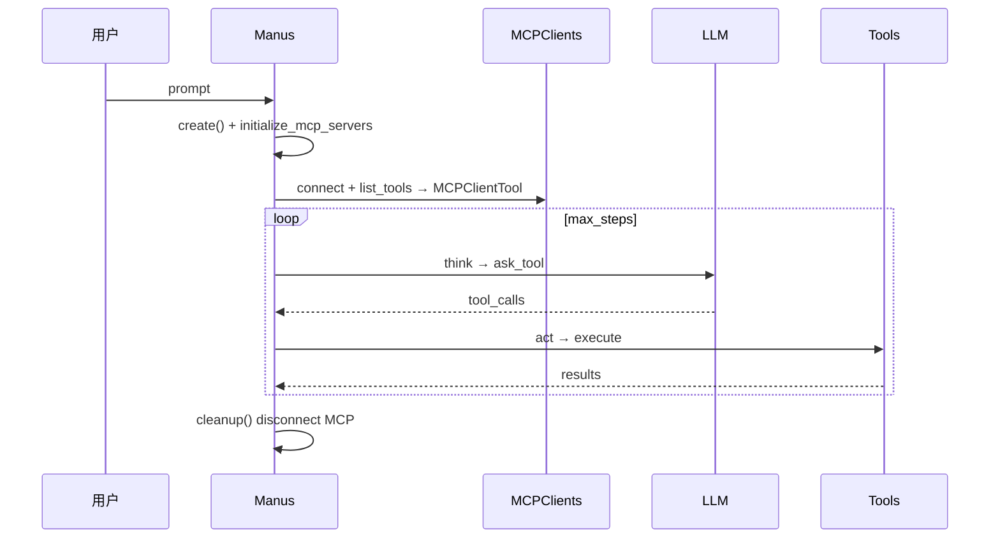

### 7.2 运行模式一览

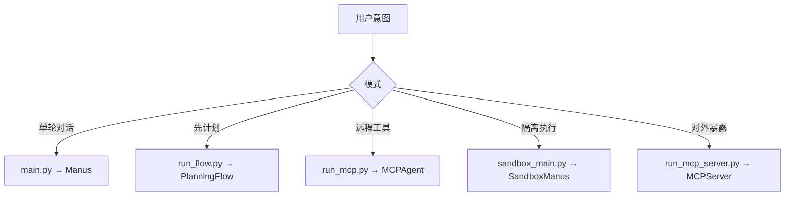

### 7.3 示例：PlanningFlow 三步计划

```text
用户: "分析 sales.csv 并写报告"

1. PlanningFlow LLM → PlanningTool.create
   steps: [1] 加载数据 [MANUS]  [2] 可视化 [DATA_ANALYSIS]  [3] 写报告 [MANUS]

2. step1 → Manus.run("加载 sales.csv…")  → 内层 5–15 次 think/act

3. step2 → DataAnalysis.run("画图…")

4. step3 → Manus.run("根据结果写 markdown 报告")

5. Flow LLM 总结全文返回用户
```

### 7.4 入口速查

| 入口 | 文件 |
|------|------|
| 默认 | `OpenManus/main.py` |
| 计划 | `OpenManus/run_flow.py` |
| MCP 客户端 | `OpenManus/run_mcp.py` |
| MCP 服务端 | `OpenManus/run_mcp_server.py` |
| 沙箱 | `OpenManus/sandbox_main.py` |

---

## §8 特点与优势

### 8.1 设计特点

| 特点 | 说明 |
|------|------|
| **极简内核** | ~数千行可读 ReAct，无图框架 |
| **think/act 清晰** | 教学 Agent loop 的最佳入口之一 |
| **ToolCollection 统一** | 本地工具与 MCP 同接口 |
| **PlanningFlow 示例** | Plan-and-Execute 不侵入默认 loop |
| **MCP 双向** | 既消费也暴露工具 |
| **多变体** | Manus / MCP / Sandbox 同继承链 |

### 8.2 相对优势（选型场景）

| 场景 | 为何选 OpenManus |
|------|------------------|
| **学习 Agent 原理** | 循环、状态、工具全在眼前 |
| **快速 Manus 原型** | 工具链齐全，改 prompt 即用 |
| **MCP 集成试验** | 客户端+服务端样板 |
| **不想引入 LangGraph** | 手写 while 循环可控 |
| **从 MetaGPT 瘦身** | 同团队基因，砍掉多 Role 复杂度 |

### 8.3 设计取舍（诚实）

| 优势 | 代价 |
|------|------|
| 简单可读 | 无 session 持久化 |
| 字符串 tool 结果 | 弱结构化下游 |
| `[AGENT]` 路由 | 脆弱，非类型安全 |
| 无权限层 | 生产需自建 harness |
| 每 step 新 Memory | PlanningFlow 跨步无共享上下文 |

### 8.4 与 Codex / MetaGPT 对照

| 维度 | OpenManus | MetaGPT | Codex |
|------|-----------|---------|-------|
| 编排 | 单 Agent + Flow | Team + bus | Session |
| 工具 | ToolCollection | Action/命令 | 四层安全 |
| 持久化 | 无 | ProjectRepo | Rollout |
| 多 Agent | PlanningFlow | 一等公民 | spawn |

---

## §9 边界与非目标

| 有 | 无（应用层自负） |
|----|------------------|
| 清晰 ReAct 模板 | Session DB |
| MCP 双向 | 权限审批框架 |
| PlanningFlow 示例 | 向量长期记忆 |
| Docker/Daytona 沙箱 | 统一事件流给 UI |
| AskHuman | steer/queue 细粒度 |

---

## 附录 A：源码速查

| 概念 | 路径 |
|------|------|
| run 循环 | `OpenManus/app/agent/base.py` |
| think/act | `OpenManus/app/agent/toolcall.py` |
| Manus | `OpenManus/app/agent/manus.py` |
| Memory/State | `OpenManus/app/schema.py` |
| LLM | `OpenManus/app/llm.py` |
| ToolCollection | `OpenManus/app/tool/tool_collection.py` |
| PlanningFlow | `OpenManus/app/flow/planning.py` |
| MCP | `OpenManus/app/tool/mcp.py` |
| 全量深潜 | `OpenManus/docs/ARCHITECTURE_DESIGN.md` |

---

**下一卷**: [ARCHITECTURE_PART2.md](./ARCHITECTURE_PART2.md) — 工具/MCP/沙箱深潜
