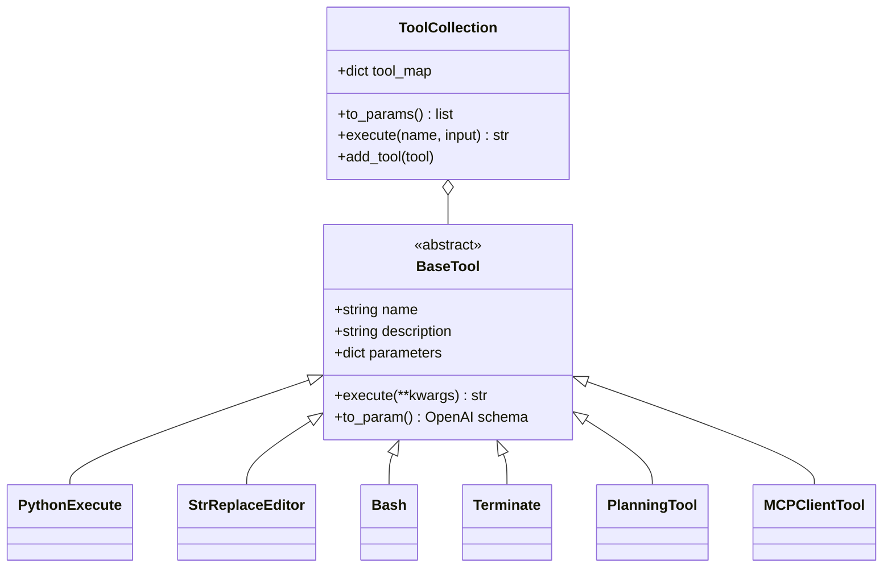
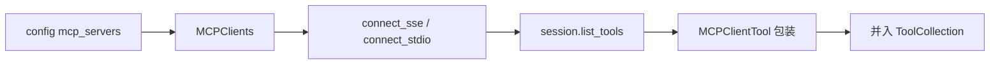
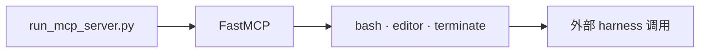
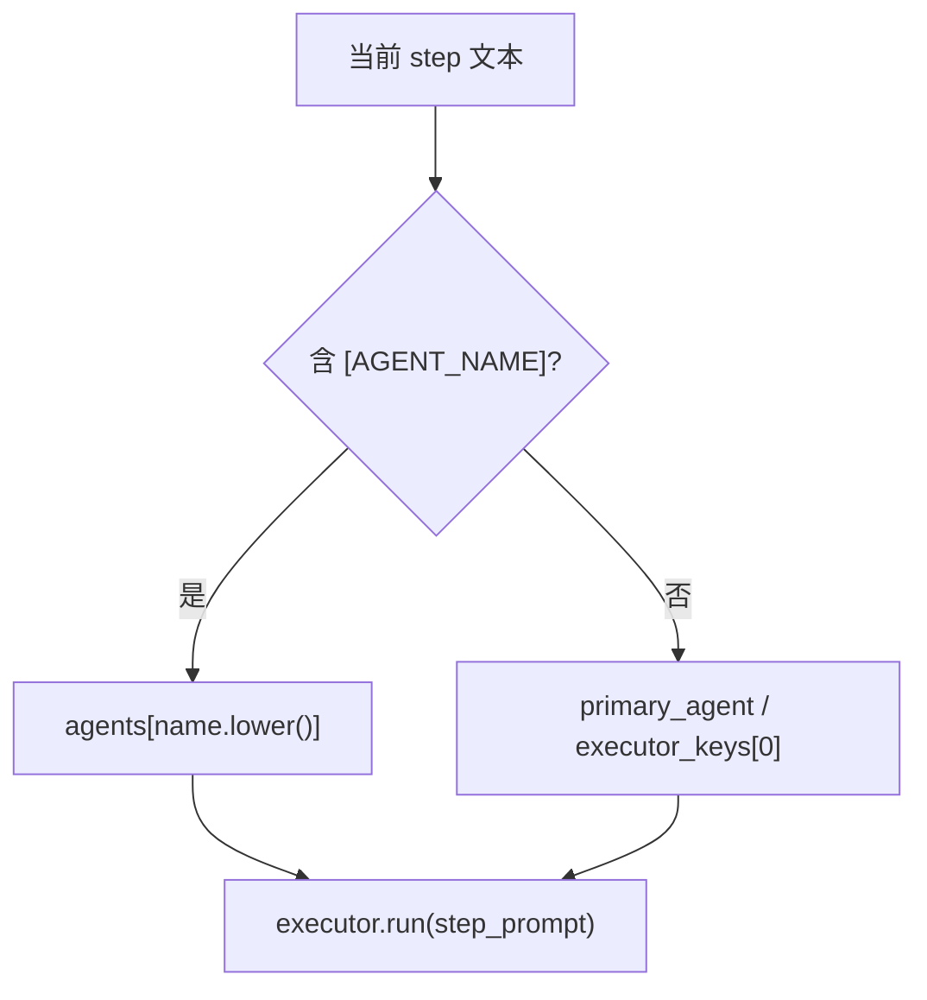
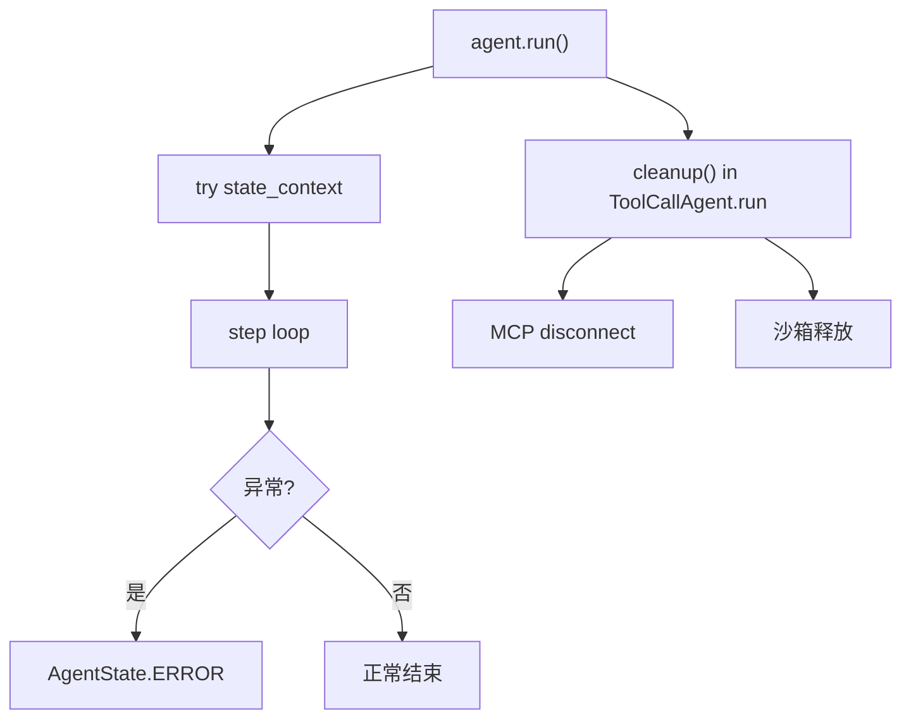

# OpenManus — 架构文档（第 2 部分）

> **专题深潜**: 工具系统 · MCP · PlanningFlow · 沙箱  
> **第 1 部分**: [ARCHITECTURE_PART1.md](./ARCHITECTURE_PART1.md)

---

## 目录

- [§1 工具系统设计](#1-工具系统设计)
  - [1.1 BaseTool 契约](#11-basetool-契约)
  - [1.2 内置工具一览](#12-内置工具一览)
  - [1.3 工具结果写回](#13-工具结果写回)
- [§2 MCP 双向扩展](#2-mcp-双向扩展)
  - [2.1 作为客户端](#21-作为客户端manus)
  - [2.2 作为服务端](#22-作为服务端fastmcp)
- [§3 PlanningFlow 深潜](#3-planningflow-深潜)
- [§4 沙箱与执行环境](#4-沙箱与执行环境)
- [§5 LLM 层要点](#5-llm-层要点)
- [§6 错误处理与清理](#6-错误处理与清理)
- [§7 改造建议](#7-改造建议架构师向)
- [§8 心智模型（五句）](#8-心智模型五句)

---

## §1 工具系统设计

### 1.1 BaseTool 契约



| 方法 | 作用 |
|------|------|
| `to_param()` | → OpenAI function JSON Schema |
| `execute()` | 副作用 + 字符串结果 |
| `ToolCollection.execute` | 按 name 分发，统一错误包装 |

### 1.2 内置工具一览

| 工具 | 文件 | 用途 |
|------|------|------|
| PythonExecute | `tool/python_execute.py` | 运行 Python 片段 |
| StrReplaceEditor | `tool/str_replace_editor.py` | 文件查看/编辑 |
| Bash | `tool/bash.py` | Shell 命令 |
| AskHuman | `tool/ask_human.py` | 人机交互 |
| PlanningTool | `tool/planning.py` | 内存 plan CRUD |
| Terminate | `tool/terminate.py` | 结束 run |
| Browser* | `tool/` + MCP | 浏览器自动化 |
| Sandbox* | `tool/sandbox/` | 隔离执行 |

### 1.3 工具结果写回

```text
ToolResult (string) → Message.tool_message(content=result) → Memory.messages
```

**取舍**：简单统一，但不利于结构化下游解析。

---

## §2 MCP 双向扩展

### 2.1 作为客户端（Manus）



**Manus 接线**（`agent/manus.py`）：

1. `initialize_mcp_servers()` — 读配置
2. `connect_mcp_server()` — 建立 session
3. `list_tools()` → 包装为 `MCPClientTool`
4. `available_tools.add_tools(...)`
5. `cleanup()` — disconnect

**MCPAgent**（`agent/mcp.py`）：

- 单 server 专用
- 每 5 步 `refresh_tools()` — 动态工具列表

### 2.2 作为服务端（FastMCP）



**文件**: `app/mcp/server.py`

---

## §3 PlanningFlow 深潜

> **逐步 message 导读**：[PLAN_MODE_SOURCE_WALKTHROUGH.md](./PLAN_MODE_SOURCE_WALKTHROUGH.md)

### 3.1 PlanningTool 内存模型

```python
# 概念结构
plans: dict[plan_id, {
    "title": str,
    "steps": list[str],
    "step_statuses": dict[int, PlanStepStatus],
}]
```

**命令**: `create`, `update`, `get`, `mark_step`, `list`

### 3.2 执行器路由



**脆弱点**：依赖正则 `[A-Z_]+` 标签，无类型检查。

### 3.3 双 LLM 架构

| LLM 实例 | 用途 |
|----------|------|
| Flow.llm | create plan、finalize 总结 |
| executor.llm | 内层 think/act |

### 3.4 与内层 Memory 隔离

```text
step1 Manus.run() → 同一 Manus.memory **追加** step_prompt（默认不 clear）
step2 若仍是 Manus → Memory 里还留着 step1 的 assistant/tool
step2 若换成 DataAnalysis → 另一份空 Memory；只能靠 step_prompt 里的计划文本
```

源码事实见 [PLAN_MODE_SOURCE_WALKTHROUGH.md](./PLAN_MODE_SOURCE_WALKTHROUGH.md)。Flow 不会自动把前步摘要注入下一步；跨 executor 时只有计划勾选表。

---

## §4 沙箱与执行环境

### 4.1 模式对比

| 变体 | 入口 | 隔离 |
|------|------|------|
| Manus | `main.py` | 本机进程 |
| SandboxManus | `sandbox_main.py` | Daytona 云沙箱 |
| Docker 工具 | `tool/sandbox/` | 容器级 |

### 4.2 SandboxManus

- 继承 ToolCallAgent
- 工具调用路由到远程沙箱 API
- 适合不可信代码执行

---

## §5 LLM 层要点

**文件**: `app/llm.py`

| 能力 | 说明 |
|------|------|
| 多 Provider | OpenAI、Azure、Ollama 等 |
| `ask()` | 纯文本对话 |
| `ask_tool()` | function calling |
| 重试 | 指数退避 |
| Token 计数 | 可选限制 |

---

## §6 错误处理与清理



| 场景 | 行为 |
|------|------|
| 非 IDLE 调 run | `RuntimeError` reject |
| 工具执行失败 | 错误字符串写 tool message，继续 loop |
| MCP 断开 | `cleanup()` finally |

---

## §7 改造建议（架构师向）

| 缺口 | 建议方向 |
|------|----------|
| 无持久化 | 加 SessionStore 或对接 Pi/Codex harness |
| 字符串观测 | ToolResult 结构化 + JSON schema |
| Planning 路由 | 类型化 executor 映射替代 `[TAG]` |
| 权限 | 借鉴 OpenHarness 四层或 Hermes interrupt |
| 跨 step 记忆 | Flow 层注入 summary 或共享 Memory 实例 |

---

## §8 心智模型（五句）

1. **内核 = while + think + act** — 无隐藏状态图。  
2. **工具一律 BaseTool** — MCP 只是代理。  
3. **Terminate 是唯一正常出口** — max_steps 只是保底。  
4. **Planning 在 Agent 外** — Flow 自己的 LLM + PlanningTool。  
5. **生产 harness 自负** — 框架故意保持轻薄。

---

**返回**: [ARCHITECTURE.md](./ARCHITECTURE.md) · [全量深潜](../../OpenManus/docs/ARCHITECTURE_DESIGN.md)

---

## §9 Hook / Plugin 扩展机制

OpenManus 当前没有像 OpenCode 那样的统一 Plugin + Hook Registry。它的扩展主要依靠继承、方法覆盖和工具注册。

```text
BaseTool / ToolCollection
Agent 子类
Flow 子类
LLM 包装器
cleanup()
```

| 目标 | OpenManus 当前做法 | 是否统一 Hook |
|---|---|---|
| Agent 开始/结束 | 覆盖 `run()`、使用 `cleanup()` | 否 |
| 每轮 step | 覆盖 `step()` | 否 |
| LLM 前后 | 覆盖 `think()` 或包装 `LLM` | 否 |
| 工具前后 | 覆盖 `execute_tool()` 或自定义 Tool | 否 |
| Flow 前后 | 自定义 `Flow` | 否 |
| 运行观察 | logger | 否，主要是日志 |

例如可以手动实现类似 Hook 的效果：

```python
class AuditedAgent(ToolCallAgent):
    async def execute_tool(self, command):
        await self.before_tool(command)
        result = await super().execute_tool(command)
        await self.after_tool(command, result)
        return result
```

但这要求开发者修改继承关系或包装调用链；没有类似 OpenCode 的：

```text
plugin → tool.execute.before → runtime
plugin → tool.execute.after  → runtime
```

OpenManus 的 MCP 是外部工具协议，不等于 Hook；`Terminate`、`AskHuman` 等是工具或控制工具，也不等于生命周期 Hook。
