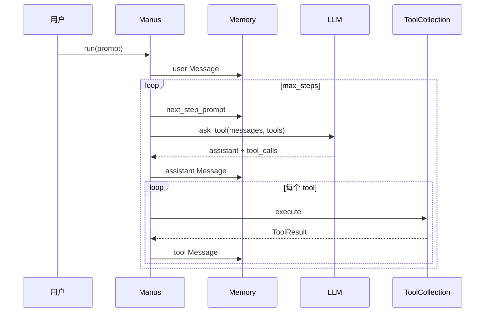
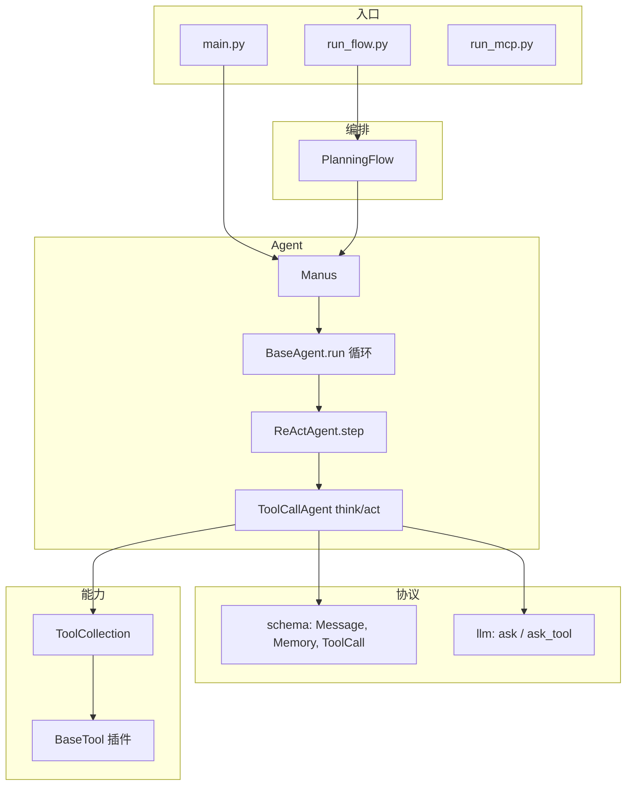
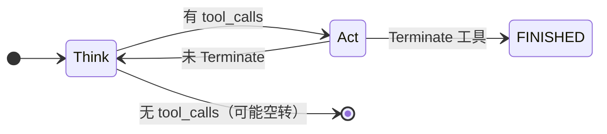
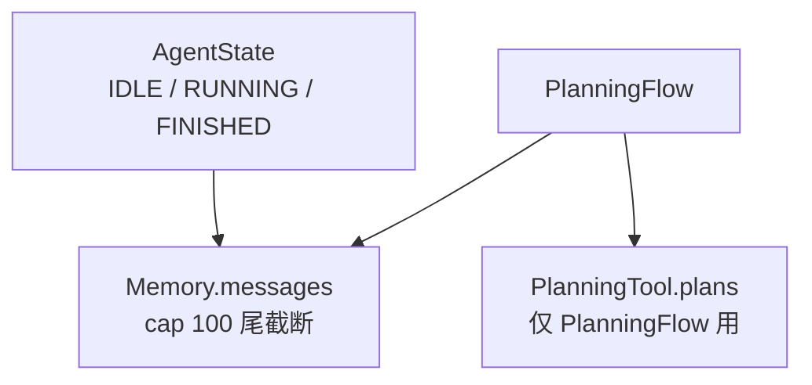
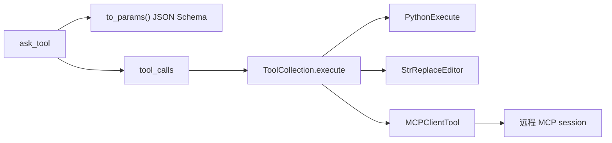
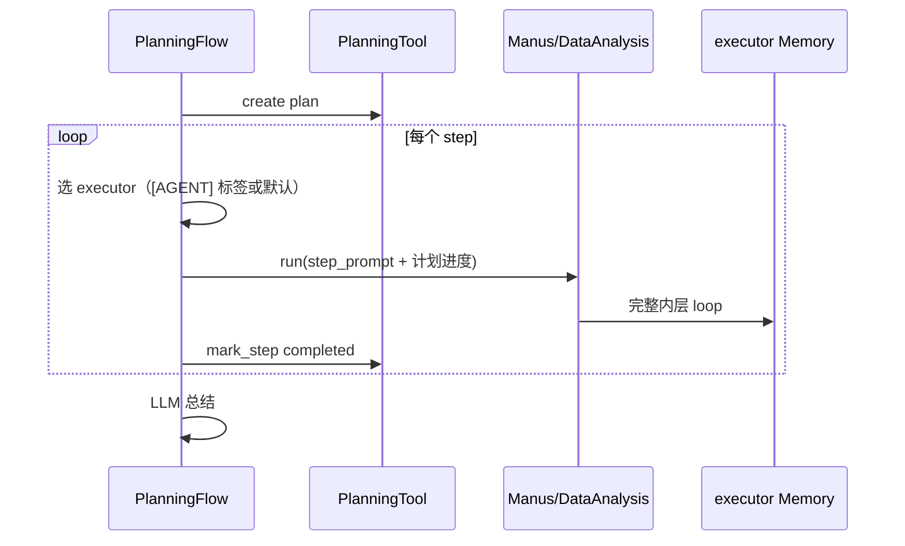
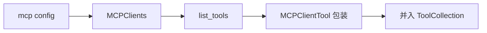
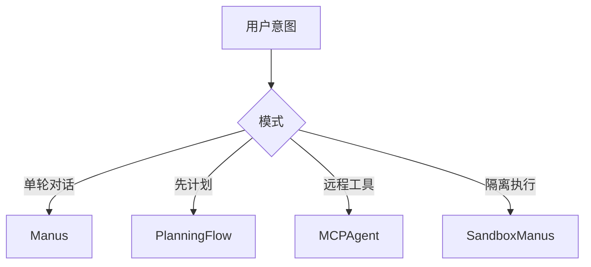

# OpenManus 设计思想导读

> **阅读方式**：先读本导读（~35 分钟）→ [**ARCHITECTURE_PART1.md**](./ARCHITECTURE_PART1.md)（图表权威）→ [ARCHITECTURE_PART2.md](./ARCHITECTURE_PART2.md) / [ARCHITECTURE_DESIGN.md](../../OpenManus/docs/ARCHITECTURE_DESIGN.md)（全量）  
> **体例参照**：[agent-framework/docs](../../agent-framework/docs/README.md)  
> **写法标准**：[PROGRESSIVE_ARCH_DOC_METHODOLOGY.md](../agent-doc-template/PROGRESSIVE_ARCH_DOC_METHODOLOGY.md)  
> **跨项目对照**：[CROSS_AGENT_CONCEPT_MAP.md](../agent-doc-template/CROSS_AGENT_CONCEPT_MAP.md) · [MetaGPT 架构](../metagpt-architecture/ARCHITECTURE.md)

---

## 目录

- [先建立一条运行路径](#先建立一条运行路径)
- [第 1 步：Agent kernel](#第-1-步一句话--agent-kernel不是平台)
- [第 2 步：分层](#第-2-步分层--schema--llm--agent--tool--flow)
- [第 3 步：think / act](#第-3-步内层循环--think--act)
- [第 4 步：状态三层](#第-4-步状态三层)
- [第 5 步：工具系统](#第-5-步工具系统)
- [第 6 步：PlanningFlow](#第-6-步planningflow--外层编排) · [源码导读](./PLAN_MODE_SOURCE_WALKTHROUGH.md)
- [第 7 步：MCP](#第-7-步mcp--双向扩展)
- [第 8 步：运行模式](#第-8-步运行模式一览)
- [第 9 步：边界与非目标](#第-9-步边界与非目标)
- [阅读路径](#阅读路径)

---

## 先建立一条运行路径

默认入口 `main.py` → **Manus** 单 Agent 路径：

```text
用户 prompt
  → Manus.create()（连接 MCP，合并工具）
  → BaseAgent.run(prompt)
  → while current_step < max_steps:
        ReActAgent.step()
          think(): 注入 next_step_prompt → LLM.ask_tool(tools)
          act():   ToolCollection.execute(每个 tool_call)
        Terminate → FINISHED
  → cleanup（MCP 断开、沙箱释放）
```

可选外层：`run_flow.py` → **PlanningFlow** 先建计划，再 **按 step 调用** 各 executor 的完整 `run()`。



---

## 第 1 步：一句话 — Agent kernel，不是平台

**一句话**：OpenManus = **可读的内核** — `Memory` 上的 ReAct + OpenAI tool calling；生产级会话/权限/事件流 **故意不做**。

| 是 | 不是 |
|----|------|
| 学习 Agent loop 的参考实现 | 多租户 Gateway |
| Manus-like 工具编排原型 | LangGraph 状态图 |
| MCP 双向集成示例 | 带 checkpoint 的长期 Harness |

与 MetaGPT：**同团队基因**，但 OpenManus **砍掉** 多 Role 消息总线，保留 **单 Agent + 可选 PlanningFlow**。

---

## 第 2 步：分层 — schema / llm / agent / tool / flow



| 层 | 回答的问题 |
|----|------------|
| **schema** | 消息与状态 **长什么样** |
| **llm** | 多 Provider、重试、token 计数 |
| **agent** | **何时** think、**何时** 停 |
| **tool** | **如何** 执行副作用 |
| **flow** | **谁** 在多个 step 间排班 |

---

## 第 3 步：内层循环 — think / act

**一句话**：`step() = think() + act()`；**think 负责决策，act 负责副作用**。



| 阶段 | 输入 | 输出 |
|------|------|------|
| **think** | Memory + `next_step_prompt`（合成 user） | assistant 消息（含 tool_calls） |
| **act** | tool_calls | tool 消息写回 Memory |

**特殊工具**：`Terminate` 在 `special_tool_names` 里 → `AgentState.FINISHED`。

**卡住检测**：连续重复 assistant 内容 → 改写 `next_step_prompt` 催促换策略。

---

## 第 4 步：状态三层



| 层 | 持久化 | 用途 |
|----|--------|------|
| AgentState | ❌ | 单次 `run()` 生命周期 |
| Memory | ❌ | LLM 上下文 |
| PlanningTool | ❌ | 步骤状态机 |

**校正**：`max_steps` 用尽 → 回到 IDLE，**不等于** FINISHED（除非 Terminate）。

---

## 第 5 步：工具系统

**一句话**：一切能力实现为 **`BaseTool`**，经 **`ToolCollection`** 统一 `execute` — MCP 也只是代理 Tool。



| 类别 | 代表 |
|------|------|
| 代码/文件 | PythonExecute、StrReplaceEditor、Bash |
| 人机 | AskHuman |
| 规划 | PlanningTool（内存 plan dict） |
| 控制 | Terminate |
| 远程 | MCPClientTool |
| 沙箱 | Sandbox*（Daytona） |

工具结果 **字符串化** 写回 Memory — 简单，但不利于结构化下游。

---

## 第 6 步：PlanningFlow — 外层编排

**一句话**：规划 **在 Agent 循环外** — Flow 用 **自己的 LLM** 调 `PlanningTool.create`，再让每个 **executor** 跑一整轮 ReAct。

逐步 message 导读：[PLAN_MODE_SOURCE_WALKTHROUGH.md](./PLAN_MODE_SOURCE_WALKTHROUGH.md)（`sales.csv` 完整示例）。



| 设计点 | 含义 |
|--------|------|
| 双 LLM | 规划器与执行器 **分离** |
| `[AGENT_NAME]` 标签 | 脆弱的步骤路由约定 |
| 每 step 一次 `run()` | 内层 Memory **默认不 clear**；同一 `Manus()` 实例跨 plan step **会累积消息**（详见 [源码导读](./PLAN_MODE_SOURCE_WALKTHROUGH.md)） |

---

## 第 7 步：MCP — 双向扩展

### 作为客户端（Manus / MCPAgent）



- **Manus**：多 server + 默认 Browser Use MCP  
- **MCPAgent**：单 server；每 5 步刷新工具列表  

### 作为服务端（FastMCP）

本地 `BaseTool` 暴露为 MCP tools（bash、editor、terminate），供外部 harness 调用。

---

## 第 8 步：运行模式一览

| 入口 | Agent | 场景 |
|------|-------|------|
| `main.py` | Manus | 默认通用 |
| `run_flow.py` | PlanningFlow + executors | 多步计划 |
| `run_mcp.py` | MCPAgent | 纯 MCP 工具面 |
| `run_mcp_server.py` | MCPServer | 对外暴露工具 |
| `sandbox_main.py` | SandboxManus | Daytona 云沙箱 |



---

## 第 9 步：边界与非目标

| 有 | 无（应用层自负） |
|----|------------------|
| 清晰 ReAct 模板 | Session DB |
| MCP 双向 | 权限审批框架 |
| PlanningFlow 示例 | 向量长期记忆 |
| Docker/Daytona 沙箱 | 统一事件流给 UI |

**与 MetaGPT**：OpenManus 是 **单脑 + 可选计划**；MetaGPT 是 **多 Role 公司 + SOP 订阅**。

**与 Codex**：OpenManus 无 Rollout、无四层安全；适合 **理解 loop**，不适合 **生产 harness 对照表**。

---

## 阅读路径

```text
DESIGN_THINKING_SERIES（本文）
  → ARCHITECTURE_PART1（分层 / 类图 / think·act 时序）
  → ARCHITECTURE_PART2（工具 / MCP / Planning 深潜）
  → OpenManus/docs/ARCHITECTURE_DESIGN.md（17 章全量）
```
