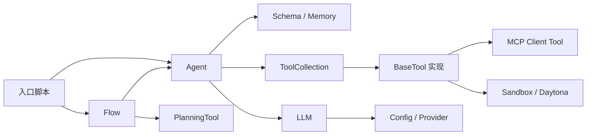
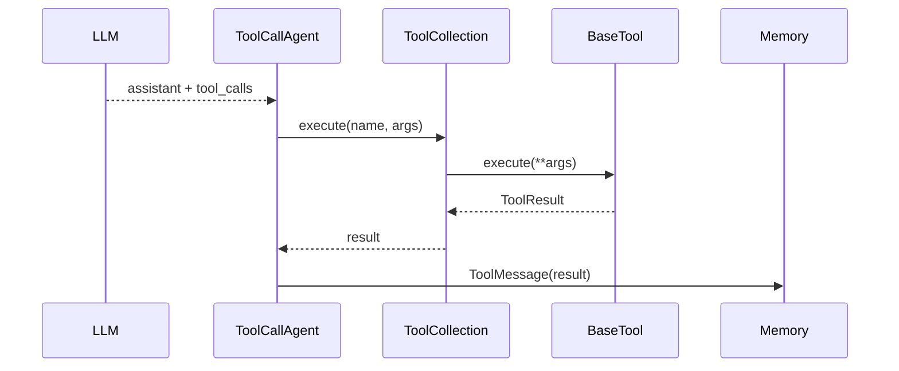

# OpenManus — 模块设计与模块交互

> **文档性质**：模块级设计说明。先描述当前源码事实，再指出边界；不把未来平台化方案冒充当前实现。

## 1. 依赖方向



依赖原则：

- 入口负责装配，不承载 Agent 决策；
- Flow 负责跨 Agent 的编排，不替代 Agent 内部循环；
- Agent 负责状态和 `think/act`，不直接实现每个工具；
- ToolCollection 负责统一分发，工具实现负责副作用；
- Schema 是消息协议，不应承担外部执行；
- MCP/Sandbox 是执行边界，结果必须转换回统一 ToolResult/Message 语义。

## 2. 核心模块说明

### 2.1 Flow 模块

**主要文件**：`app/flow/base.py`、`app/flow/planning.py`、`app/flow/flow_factory.py`

| 输入 | 输出 | 主要交互 |
|---|---|---|
| 用户请求、Agent 映射 | 最终摘要字符串 | 调用规划 LLM、PlanningTool、executor.run |

`PlanningFlow` 的职责边界：

```text
创建计划
  → 选择未完成步骤
  → 从 [AGENT] 标签路由 executor
  → 构造 step_prompt
  → 调 executor.run()
  → mark_step completed/blocked
  → finalize
```

它不会把整个 Plan 变成一个更大的 Agent Memory；计划保存在 `PlanningTool.plans`，executor 有自己的 Memory。

### 2.2 Agent 模块

继承链：

```text
BaseAgent
  → ReActAgent
    → ToolCallAgent
      → Manus / MCPAgent / SandboxManus / BrowserAgent
```

| 模块 | 责任 | 不负责 |
|---|---|---|
| `BaseAgent` | 状态、Memory、max_steps、cleanup | 具体 LLM tool call |
| `ReActAgent` | 定义 `step = think + act` | 具体工具实现 |
| `ToolCallAgent` | `ask_tool`、解析 ToolCall、执行工具 | 计划跨 executor 编排 |
| `Manus` | 通用工具集、MCP 接线 | Flow 调度 |
| `MCPAgent` | MCP 工具刷新/使用 | MCP server 本身 |
| `SandboxManus` | 沙箱执行接线 | 沙箱基础设施实现 |

### 2.3 LLM 模块

**主要文件**：`app/llm.py`

```text
Agent/Flow
  → ask() 或 ask_tool()
  → system messages + Memory + tool schemas
  → provider request
  → normalized Message / ToolCall
```

规划 LLM 和 executor LLM 在概念上可以分离：PlanningFlow 的 LLM 负责生成计划，Agent 的 LLM 负责完成具体步骤。

### 2.4 Tool 模块

**主要文件**：`app/tool/base.py`、`tool_collection.py`、各工具实现。

工具的统一接口是：

```text
BaseTool.to_param()  → 给 LLM 的 JSON Schema
BaseTool.execute()   → 产生 ToolResult
ToolCollection       → 按 name 找到并调用工具
```

调用阶段：



### 2.5 MCP 模块

MCP 在 Agent 看来是一个特殊的 `BaseTool`：

```text
MCP server
  → client initialize/list_tools
  → MCP tool metadata
  → MCPClientTool
  → ToolCollection
  → normal tool_call path
```

因此远程工具和本地工具共享模型暴露和 Agent 调用路径；区别在于副作用发生在外部 MCP server。

### 2.6 Sandbox 模块

Sandbox 是工具执行的外部资源边界，不是新的思考循环：

```text
Agent think
  → 选择 sandbox tool
  → Sandbox client 创建/获取环境
  → 执行命令或代码
  → 收集 stdout/stderr/files
  → 结果转成 ToolResult
  → 写入 Agent Memory
```

## 3. 关键交互契约

### 3.1 Agent ↔ LLM

| 项目 | 约定 |
|---|---|
| 输入 | system prompt、Memory messages、next_step_prompt、tool schema |
| 输出 | assistant content、零个或多个 ToolCall |
| 失败 | 解析错误、TokenLimitExceeded、provider 异常 |
| 下一步 | 有 ToolCall 进入 act；无调用按 tool_choice/内容决定是否继续 |

### 3.2 Agent ↔ ToolCollection

```text
Agent 只依赖工具名和统一 execute 协议；
ToolCollection 负责查找和调用；
具体工具负责参数语义和副作用；
Agent 将结果包装成 ToolMessage。
```

### 3.3 Flow ↔ PlanningTool

```text
Flow.active_plan_id
        ↓ 覆盖/传入
PlanningTool.execute(command=...)
        ↓
PlanningTool.plans[plan_id]
```

Flow 直接调用 PlanningTool，不经过 executor 的普通 `act()`。这保证 Flow 后续 `get/mark_step` 使用同一个计划 ID。

### 3.4 Flow ↔ Executor

Flow 通过 `step_prompt` 传递信息，而不是默认共享 executor Memory：

```text
plan status + 当前 step + 任务说明
  → executor.run(step_prompt)
  → executor 自己的 think/act loop
  → 返回字符串结果
```

跨 executor 的结构化数据主要依赖文件、计划文本和 prompt；当前没有统一的 artifact/result contract。

## 4. 状态变化与交互边界

| 事件 | 修改者 | 读取者 |
|---|---|---|
| Agent 开始运行 | `BaseAgent.run` | Agent、日志 |
| LLM 产生 tool call | `ToolCallAgent.think` | `act` |
| 工具完成 | 工具/ToolCollection | Agent Memory |
| Terminate | `execute_tool` / special handler | `BaseAgent.run` |
| Plan 创建 | `PlanningFlow` + `PlanningTool` | Flow、executor prompt |
| Plan step 更新 | `PlanningFlow` + `PlanningTool` | 后续 Flow step |
| MCP 工具发现 | MCP client | Agent ToolCollection |
| 资源清理 | Agent/入口 | MCP/Sandbox |

## 5. 模块设计中的已知限制

- `Memory` 是进程内消息列表，不是持久化消息库；
- Plan 是线性步骤状态，不是通用 DAG 调度器；
- 工具调用当前由 Agent 顺序处理多个 tool call，不能将其当作事务；
- 错误处理主要是返回字符串、设置 Agent 状态或抛异常，缺少统一错误码；
- 事件、权限、审计和取消没有统一模块；
- 类级/进程级可变状态需要谨慎处理并发。

## 6. 源码映射

| 能力 | 主要路径 |
|---|---|
| Agent 生命周期 | `OpenManus/app/agent/base.py` |
| ReAct step | `OpenManus/app/agent/react.py` |
| Tool calling | `OpenManus/app/agent/toolcall.py` |
| Manus 装配 | `OpenManus/app/agent/manus.py` |
| Flow | `OpenManus/app/flow/planning.py` |
| Plan storage | `OpenManus/app/tool/planning.py` |
| Tool registry | `OpenManus/app/tool/tool_collection.py` |
| Message/Memory | `OpenManus/app/schema.py` |
| LLM | `OpenManus/app/llm.py` |
| MCP | `OpenManus/app/tool/mcp.py`、`app/mcp/server.py` |
| Sandbox | `OpenManus/app/sandbox/`、`app/daytona/` |
