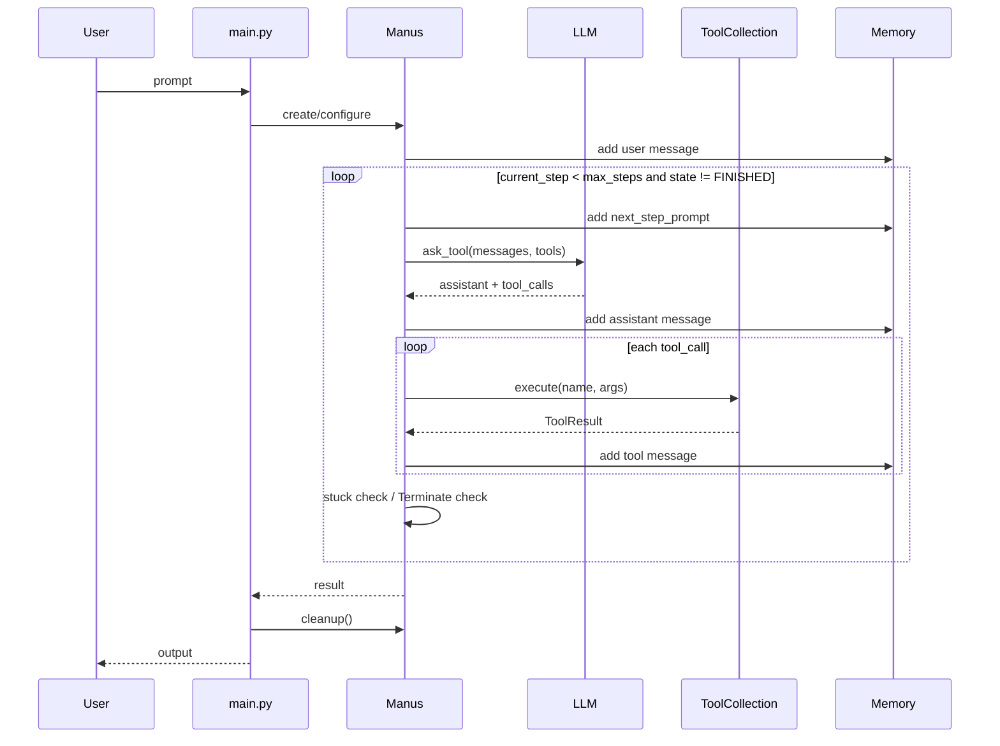
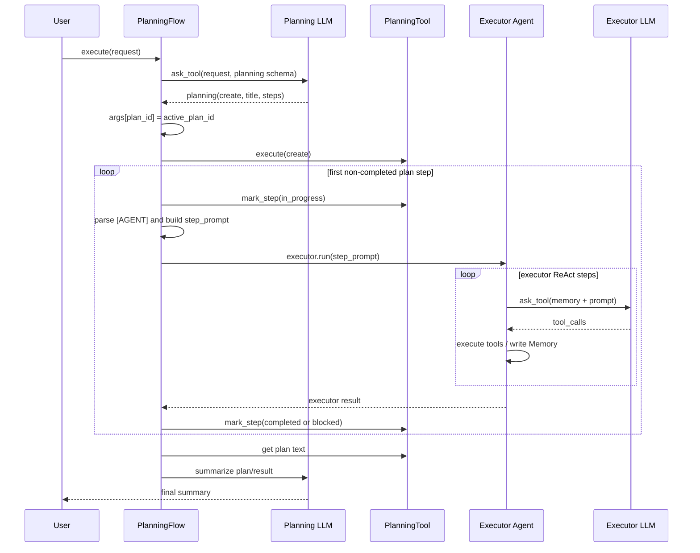
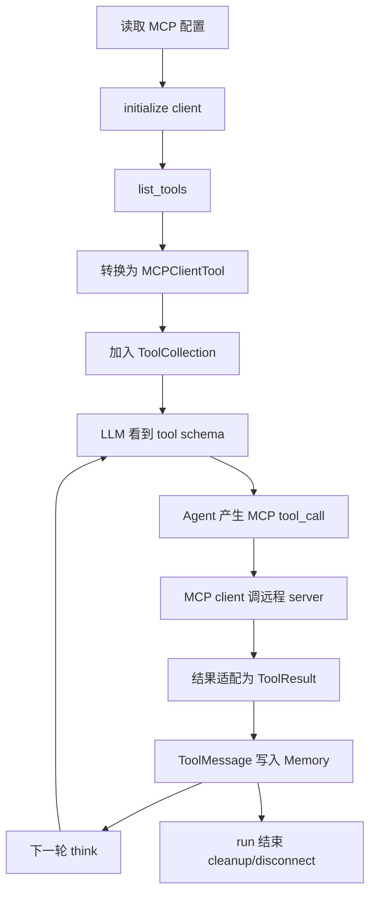
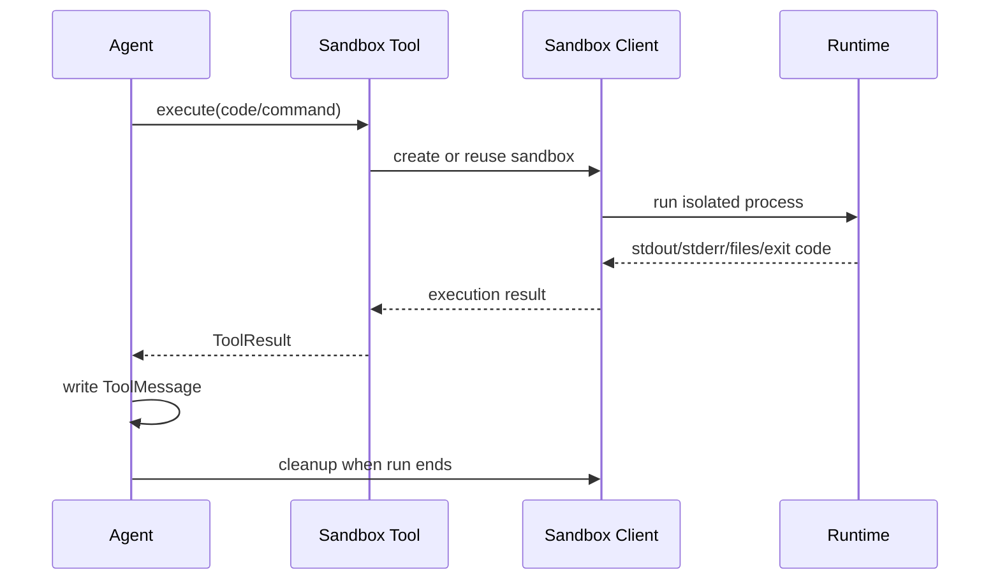
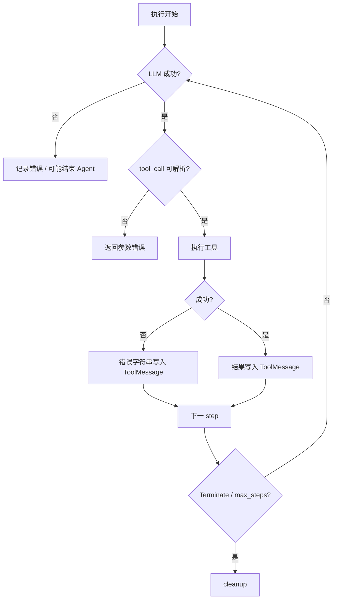

# OpenManus — 完整运行流程设计

> 本文把不同入口的流程放在同一套尺度下比较：**请求、Flow、Agent Run、Agent Step、Tool Call、Tool Execution**。

## 1. 运行单元层级

```text
一次用户请求
  ├── 可选 Flow.execute()
  │     ├── 计划创建
  │     └── 多个 PlanStep
  │           └── executor.run()
  │                 └── 多个 AgentStep
  │                       ├── think / LLM response
  │                       └── act / 一个或多个 ToolExecution
  └── 或直接 Agent.run()
```

## 2. 单 Agent 主流程



### 2.1 结束条件

| 条件 | 结果 |
|---|---|
| `Terminate` | Agent state 变为 `FINISHED`，退出 while |
| `max_steps` | reset 到 `IDLE` 并返回达到上限信息 |
| 异常 | `state_context` 进入 `ERROR`，异常向上抛出 |
| 卡住检测 | 修改 `next_step_prompt`，提示模型改变策略 |

## 3. PlanningFlow 完整流程



### 3.1 Plan 模式的三本账

```text
A. 规划 LLM 临时 messages：创建请求结束后通常丢弃
B. PlanningTool.plans：计划、步骤状态、备注
C. executor.memory：每个 Agent 实例自己的消息历史
```

它们的关系是：

```text
B → 生成 step_prompt → C
C 的字符串结果 → F → 更新 B
```

不是一个共享 Memory。

## 4. MCP 客户端流程



## 5. Sandbox 流程



## 6. 错误与恢复路径



当前实现的恢复含义要谨慎理解：

- 工具失败通常作为结果返回给 Agent，让下一轮自行决定；
- LLM/运行时异常可能直接结束当前运行；
- 没有通用 checkpoint，因此进程崩溃后不能从任意 step 自动恢复；
- Plan step 的 `blocked` 是计划状态，不等于持久化的失败任务队列。

## 7. 一次请求的时序快照

```text
用户请求
  ↓
入口创建 Agent/Flow
  ↓
[可选] Planning LLM 创建计划
  ↓
[可选] PlanningTool 保存计划
  ↓
选择当前 executor
  ↓
Agent.run(step_prompt)
  ↓
step 1: think → act → tool result
  ↓
step 2: think → act → tool result
  ↓
Terminate 或 max_steps
  ↓
Flow 标记计划步骤
  ↓
下一个步骤 / finalize
  ↓
cleanup
```

## 8. 图与文档的对应关系

| 主题 | 详细文档/图 |
|---|---|
| Agent 主循环 | `ARCHITECTURE_PART1.md` §4–§5、`diagrams/openmanus-baseagent-run.sequence.html` |
| Tool pipeline | `ARCHITECTURE_PART2.md`、`diagrams/openmanus-tool-pipeline.dataflow.html` |
| PlanningFlow | `PLAN_MODE_SOURCE_WALKTHROUGH.md`、`diagrams/openmanus-e2e-planning.sequence.html` |
| 三本账 | `PLAN_MODE_SOURCE_WALKTHROUGH.md`、`diagrams/openmanus-plan-message-stores.dataflow.html` |
| MCP | `ARCHITECTURE_PART2.md`、`diagrams/openmanus-mcp.architecture.html` |
