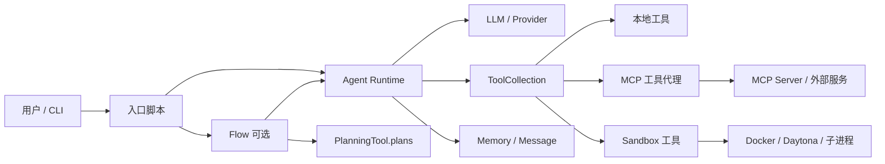
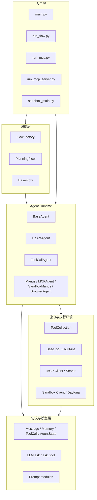
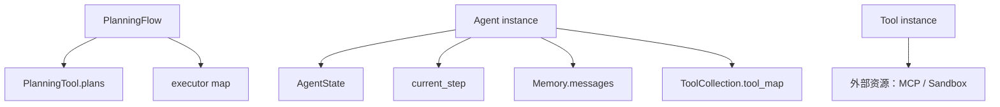

# OpenManus — 整体架构设计

> **文档性质**：当前源码架构总览（源码事实 + 明确标注的推断）  
> **证据范围**：`OpenManus/app/`、`OpenManus/main.py`、`OpenManus/run_flow.py`、`OpenManus/run_mcp*.py`、`OpenManus/sandbox_main.py`  
> **更新时间**：2026-09-22

## 1. 这份文档解决什么问题

`ARCHITECTURE_PART1.md` 主要解释 Agent 的 `run → step → think/act` 内核。本篇把视野扩大到整个仓库，回答四个问题：

1. 系统有哪些入口和运行模式？
2. 模块如何分层、谁调用谁？
3. 每个模块持有什么状态？
4. 一次请求如何经过 Flow、Agent、LLM、Tool、MCP/Sandbox 并结束？

OpenManus 的真实实现可以概括为：

```text
入口脚本
  → 可选 Flow 编排
  → Agent 运行时
  → LLM 决策
  → Tool 执行
  → Memory 写回
  → 下一轮 / Terminate / cleanup
```

它不是一个带持久化 Session、事件总线和 Gateway 的完整平台，而是一个**进程内 Agent 内核**，通过 Flow、MCP 和 Sandbox 扩展能力。

## 2. 系统上下文



### 2.1 外部参与者与边界

| 参与者 | 进入点 | 系统提供的能力 | 当前边界 |
|---|---|---|---|
| 用户/CLI | `main.py`、`run_flow.py` | 提交任务、获得文本结果 | 无统一 HTTP Session API |
| LLM Provider | `app/llm.py` | 文本和 tool calling 决策 | 进程内调用，无统一事件持久化 |
| 本地执行环境 | Python、Bash、文件工具 | 文件、代码、命令副作用 | 取决于运行入口和 sandbox 配置 |
| MCP Server | `run_mcp.py` / `app/tool/mcp.py` | 远程工具发现和调用 | 连接/重试语义较轻量 |
| Sandbox | `app/sandbox`、Daytona | 隔离执行 | 不是完整的作业编排平台 |

## 3. 五层模块架构



### 3.1 模块职责

| 层 | 主要模块 | 主要职责 | 持有的关键状态 |
|---|---|---|---|
| 入口 | `main.py` 等 | 创建对象、读取配置、启动/清理 | 进程级配置 |
| Flow | `app/flow/` | 计划创建、步骤路由、executor 调度 | `active_plan_id`、executor 映射 |
| Agent | `app/agent/` | 生命周期、ReAct 步骤、状态控制 | `state`、`current_step`、`memory` |
| 协议 | `schema.py` | 统一消息、工具调用、状态枚举 | `Message`、`ToolCall` |
| LLM | `llm.py` | 请求模型、tool schema、解析响应、重试 | provider 配置 |
| Tool | `app/tool/` | 工具注册、参数校验、执行、结果适配 | `tool_map` |
| MCP | `app/mcp/`、`tool/mcp.py` | 连接服务、发现远程工具、代理调用 | MCP client/session |
| Sandbox | `app/sandbox/`、`daytona/` | 隔离执行和资源清理 | sandbox handle |

## 4. 入口与装配拓扑

| 入口 | 装配结果 | 主流程 | 适用场景 |
|---|---|---|---|
| `main.py` | `Manus` | `Manus.run(prompt)` | 普通单 Agent |
| `run_flow.py` | `PlanningFlow` + 多 executor | `flow.execute(prompt)` | 先计划再分步执行 |
| `run_mcp.py` | MCP 配置 + `MCPAgent` | 连接 MCP 后运行 Agent | 消费远程工具 |
| `run_mcp_server.py` | FastMCP server | 暴露工具给外部客户端 | 提供远程工具 |
| `sandbox_main.py` | Sandbox + `SandboxManus` | 在隔离环境执行 | 代码/命令隔离 |

一个重要区别是：

```text
main.py：用户请求直接进入 Agent Memory
run_flow.py：用户请求先给 PlanningFlow 的规划 LLM，之后改写成 step_prompt
```

## 5. 状态所有权



| 状态 | 所有者 | 生命周期 | 是否有框架级持久化 |
|---|---|---|---|
| `Agent.state` | Agent 实例 | 一次运行及其状态切换 | 否 |
| `current_step` | Agent 实例 | 当前 Agent 对象 | 否 |
| `Memory.messages` | Agent 实例 | 默认跨该实例的多次调用 | 否 |
| `PlanningTool.plans` | PlanningTool | 当前进程 | 否 |
| `active_plan_id` | PlanningFlow | 当前 Flow | 否 |
| MCP session | MCP client/tool | Agent/Flow 生命周期 | 否 |
| Sandbox handle | Sandbox client | 一次执行资源生命周期 | 否 |

因此，进程退出后，Memory、plan、工具调用历史和运行句柄默认都会丢失。

## 6. 设计边界

### 已实现的核心能力

- 进程内 ReAct Agent；
- OpenAI 风格 tool calling；
- 本地工具与 MCP 工具统一到 `ToolCollection`；
- 可选 Plan-and-Execute；
- 可选 Sandbox 执行；
- Agent 状态、最大步数、卡住检测和 cleanup。

### 不应误认为已实现的平台能力

- Session/Run 持久化与崩溃恢复；
- 统一事件总线和实时订阅；
- 多租户 Gateway；
- 完整权限策略中心；
- 通用任务队列和长时任务恢复；
- Plan DAG、结构化跨 executor 数据契约。

## 7. 阅读顺序

1. 本文：系统地图、模块边界和状态所有权；
2. [`MODULES_AND_INTERACTIONS.md`](./MODULES_AND_INTERACTIONS.md)：模块接口与依赖；
3. [`RUNTIME_FLOWS.md`](./RUNTIME_FLOWS.md)：单 Agent、Plan、MCP、Sandbox 流程；
4. [`ARCHITECTURE_PART1.md`](./ARCHITECTURE_PART1.md)：Agent 内核源码导读；
5. [`PLAN_MODE_SOURCE_WALKTHROUGH.md`](./PLAN_MODE_SOURCE_WALKTHROUGH.md)：Plan 模式逐消息分析。
