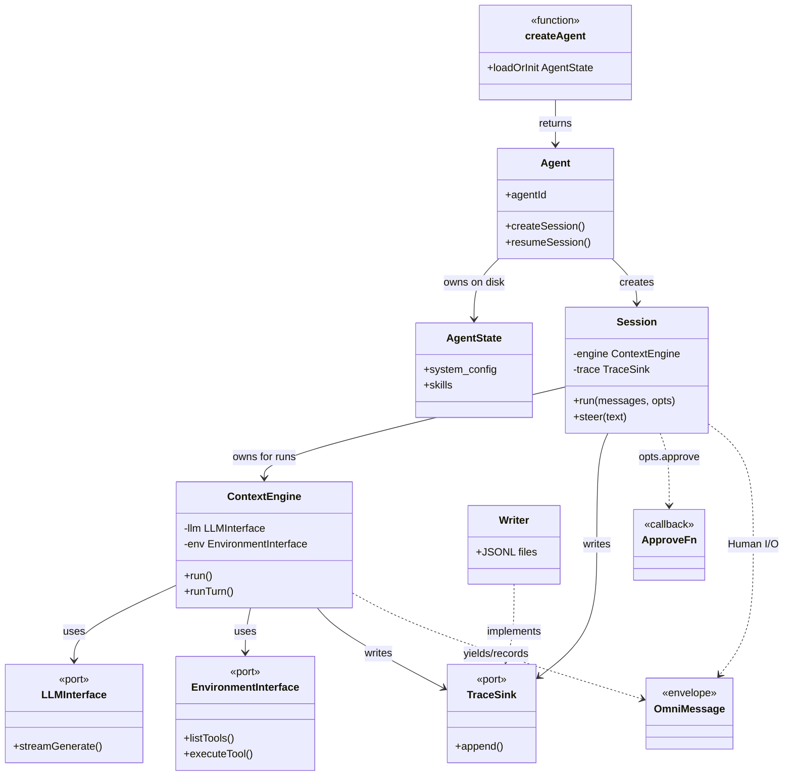

# 0 · 顶层设计与实体边界（Penguin）

> **本篇解决**：只靠流程图看不懂「谁封装什么、边界在哪、不该碰谁」。  
> **读完应能回答**：改审批该动谁？换模型该动谁？持久化真源是谁？为什么没有 Cordis？  
> 权威：`packages/core/src/{agent,session,engine,interfaces,trace,environment}.ts` 与官方 docs。

---

## 0. 文档质量铁律（本仓 doc-sn 强制）

后面任何 Penguin 文档若违反，视为「又水了」：

| 必须有 | 禁止只有 |
|--------|----------|
| **实体表**：拥有什么 / 不拥有什么 / 依赖谁 | 只有 mermaid 箭头、没有封装说明 |
| **写入归属**：这一步改了谁的状态、落了哪份文件 | 「然后系统处理…」空话 |
| **新词对照**：等于你已知的什么、**不是**什么 | 名词堆砌无对照 |
| **固定算法 vs 扩展点** 拆开写 | 把整段 while 说成「全可插」 |

详细约定见同目录 [DOC_QUALITY.md](./DOC_QUALITY.md)。

---

## 1. 顶层设计：要解决什么、故意不做什么

### 1.1 设计目标

| 目标 | 落在哪个实体 |
|------|----------------|
| 精简工具 + 文件 Skill，少抽象 | `Environment` 内置工具 + `Skill` 文件；**无插件运行时** |
| 流、存、内部传同一种消息 | **`OmniMessage`** 唯一信封 |
| 可恢复、可审计 | **`Trace` JSONL** 为 Session 恢复真源 |
| Human 进一出清晰 | **`Session.run`**：Prompt + approve → AsyncGenerator\<OmniMessage\> |
| 模型与工具可替换 | **`LLMInterface` / `EnvironmentInterface`**（端口） |
| 编排集中一处 | **`ContextEngine`**（ReAct while） |

### 1.2 故意不做（边界）

| 不做 | 原因 / 谁承担类似职责 |
|------|------------------------|
| Cordis / Profile / Bundle 插件树 | 产品选择：扩展用 Skill/MCP/配置，不热插 Driver |
| 持久 Inbox（splice/claim） | 用 **`steer` + carry-over**；排队不事件溯源 |
| Session 类写磁盘格式细节 | Session 持 `TraceSink`；**Writer** 管 JSONL |
| core 直连厂商 SDK | **`AgentHub` / GenerativeModel** 在 LLM 适配层 |
| 把 UI 渲染塞进 core | Human（CLI/Web）自己订 OmniMessage 流 |

---

## 2. 分层与包边界

```text
┌─────────────────────────────────────────────────────────┐
│ 表面：CLI / Web(server) / Desktop / SDK 调用方            │  只谈 Session.run / createAgent
└───────────────────────────┬─────────────────────────────┘
                            │ Human 边界（不是一个 interface 类）
┌───────────────────────────▼─────────────────────────────┐
│ packages/core                                             │
│  Agent ──创建──► Session ──拥有──► ContextEngine           │
│    │               │                    │                 │
│    │               │                    ├─ LLMInterface   │
│    │               │                    ├─ Environment    │
│    │               │                    └─ TraceSink      │
│    └─ AgentState / Project / Vault（磁盘配置）              │
└─────────────────────────────────────────────────────────┘
         │                                      │
         ▼                                      ▼
   ~/.penguin/data（Agent State, Trace…）    AgentHub（厂商协议）
```

| 层 | 包/目录 | 允许知道 | 禁止知道 |
|----|---------|----------|----------|
| 表面 | `cli` / `server` / `web` / `desktop` | Agent、Session API、OmniMessage | ContextEngine 私有方法 |
| 组合 | `Agent` / `createAgent` | 如何装 State、开 Session、接 Trace | ReAct 内层合并队列细节 |
| 编排 | `ContextEngine` | LLM/Env/Approve/Trace 端口 | HTTP、React、Cordis |
| 端口 | `interfaces.ts` | 流式生成、执行工具 | 具体 Bash 实现 |
| 适配 | `llm/`、`environment/` | AgentHub、本地工具 | Session 生命周期 |
| 真源 | `trace/` | JSONL append/replay | 业务审批策略 |

---

## 3. 核心实体目录（封装边界）

### 3.1 一览表

| 实体 | 一句话职责 | **拥有（封装）** | **不拥有 / 禁止渗入** | 主要协作者 |
|------|------------|------------------|----------------------|------------|
| **`createAgent`** | 唯一入口：空目录初始化或按 agentId 加载 | 解析 root、装 AgentState | Session 生命周期、ReAct | → `Agent` |
| **`Agent`** | 一个 Agent State 上的工厂：开/恢复多个 Session | agentId、project、vault、proxy 策略、子 Agent 深度策略 | 单次 run 的 turn 循环 | → `Session`、`Environment` 工厂、`Writer` |
| **`Session`** | 同一 Agent+Workspace 的连续对话；**Human I/O 边界** | `run`/`steer`、bootstrap（工具表+LLM）、meta、与 Engine 绑定 | 工具怎么 exec 的细节、UI 怎么画气泡 | → `ContextEngine`、`TraceSink`、`ApproveFn` |
| **`ContextEngine`** | ReAct 编排：LLM→审批→工具→再 LLM | turn/request 状态、MergeQueue、carry-over、compaction 触发、steer 缓冲 | 磁盘路径、HTTP、厂商 SDK | → `LLMInterface`、`EnvironmentInterface`、`TraceSink`、`ApproveFn` |
| **`LLMInterface`** | 模型端口：`streamGenerate` | 如何对流式 token/tool_call | 何时该停 Task、如何 approve | ← Engine；实现多为 GenerativeModel+AgentHub |
| **`EnvironmentInterface`** | 工具端口：`listTools` / `executeTool` | 工具注册表、MCP 连接、权限与 workspace 相对路径 | 何时发起 tool_call（那是 LLM+Engine） | ← Engine；实现 `Environment` |
| **`ApproveFn`** | 每个 tool_call 一次允许与否 | 由表面注入的策略（人或自动） | 不是 core 里的全局单例服务 | ← Engine 在 turn 内 await |
| **`OmniMessage`** | 统一消息信封 | 类型与 payload 约定 | 「怎么存文件」 | 全链路 |
| **`Trace` / `Writer`** | 追加 JSONL；恢复真源 | 文件切分、容错读、resume | 审批文案、模型选哪家 | ← Session/Engine 写；resume 时读回 Engine 状态 |
| **`AgentState`** | 磁盘上的人设/技能/系统配置 | `system_config.yaml`、AGENTS.md、skills、vault 引用 | 某次 Session 的 transcript | ← Agent 加载 |
| **`Project`** | 项目模型表与凭据配置 | `.project_config.toml` | Trace 内容 | ← Agent |
| **`Skill`** | 文件型扩展（SKILL.md） | 元数据+正文，渐进加载进提示 | 不能注册 Cordis 式服务 | ← Agent/提示组装 |
| **`Goal` 循环** | 多 Task 直到完成/阻塞/预算 | `runGoalLoop` 外环 | 替代 ContextEngine 内环 | → 多次 `Session`/`Engine` Task |
| **Subagent** | `run_subagent` 派生子 Session | 深度上限（默认 1）、继承代理策略 | 无限嵌套 Agent 网 | ← Environment 工具 → Agent |

### 3.2 类图（对象引用，不是部署图）



**读图规则**：箭头 =「创建或持有或调用」；`ApproveFn` 从表面注入，**不属于** Agent 单例字段的永久策略库。

---

## 4. 协作：一次 `session.run` 里谁干什么

### 4.1 谁说话、谁改状态

```text
Human(CLI/Web)
  └─ Session.run(prompt, { approve, signal })
        ├─ 首次：bootstrap() → Environment.listTools（可连 MCP）+ 建 LLM
        ├─ 写 Trace：session_meta / tool_list_ready / mcp_*（若有）
        └─ ContextEngine.run(...)
              ├─ 写 Trace + yield：request_begin / 模型流 / tool_call
              ├─ await ApproveFn(tool_call)     ← 表面注入，Engine 只 await
              ├─ Environment.executeTool       ← 工具副作用在此封装
              ├─ yield tool_call_output（完成序）
              └─ 无 tool_call → Task 结束；stop_reason 收束
```

| 步骤 | 执行实体 | 写入/副作用归属 |
|------|----------|-----------------|
| 校验/入队 prompt | Session / Engine | 内存上下文；Trace 记用户侧消息 |
| 调模型 | **LLMInterface** | 厂商 HTTP；Engine 记 request_* |
| 审批 | **ApproveFn**（表面） | 决策事件进流/Trace；不进 Environment |
| 跑工具 | **Environment** | 工作区文件/进程；输出变 OmniMessage |
| 持久化 | **TraceSink/Writer** | `PENGUIN_HOME/.../traces/*.jsonl` |
| 插话 | Session.steer → Engine 缓冲 | 下轮进模型；**无 Inbox 事件类型** |

### 4.2 恢复时边界

```text
Agent.resumeSession(sessionId)
  → Writer/readTrace 重放
  → 得到 initialEngineState + resumedHistory
  → 新 Session 带着这些构造 Engine
```

**真源是 Trace 文件**，不是「内存 messages 另存一份官方答案」。`resumedHistory` 是给前端展示的投影，Engine 状态来自重放。

---

## 5. 固定算法 vs 扩展点（避免再误解）

| 层次 | 内容 | 可换方式 |
|------|------|----------|
| **固定** | ContextEngine 内 ReAct：有 tool 就批→跑→再请求 | 改源码或 fork；**不是**装另一个 loop 插件 |
| **端口可换** | LLM / Environment 实现 | 换 GenerativeModel 配置、MCP、工具集 |
| **文件可扩** | Skill、Goal YAML、system_config | 丢文件 / 改配置 |
| **表面可扩** | approve 策略、UI、CLI | 注入回调与渲染 |
| **外环** | Goal loop、Subagent | 仍回调同一 Session/Engine 模型 |

对比 DSH：DSH 的「Loop 是插件」= 整包 `agent-loop` 可 `setFactory`；Penguin **默认不提供换 Driver 的一等组装机制**。

---

## 6. 新词速对照（防名词墙）

| Penguin | 熟悉概念 | 不是 |
|---------|----------|------|
| OmniMessage | 统一 DTO / 事件信封 | 仅 UI 视图模型 |
| ContextEngine | 应用服务里的 ReAct 编排器 | 可热插的 Cordis 插件包 |
| Session.run | 用例入口（一进一出） | 持久消息队列消费者 |
| Trace | Event log / JSONL WAL | SQL 里的 messages 表唯一形态 |
| ApproveFn | 策略回调（类似 beforeTool） | Filter 链框架 |
| Skill | 提示词+流程说明书文件 | npm 插件 / Bundle |
| steer | 运行中插 USER 文本 | DSH Inbox splice |
| Human 边界 | 端口上的 I/O 约定 | 某个 `class Human` |

与 DSH 实体对照详见 [ARCHITECTURE_PART3](./ARCHITECTURE_PART3.md) 与 deepseek-harness 的 `05-对照-Pi-与-DSH.md`（Pi）——Penguin 更接近「固定 Engine + 端口」，不是「Driver 工厂插件」。

---

## 7. 改代码时找谁（决策树）

```text
改「允不允许跑某工具」     → 表面 ApproveFn / 权限配置，不是改 Trace 格式
改「模型流怎么解析」       → llm / AgentHub，不是 Session
改「多一轮直到没 tool」    → ContextEngine（认清这是固定内核）
改「磁盘上人设与技能」     → AgentState / Skill 文件
改「崩溃后怎么续」         → Trace Writer + resume 路径
改「Web 气泡怎么画」       → web，只订 OmniMessage，不进 core
想「换一整套循环哲学」     → 当前产品边界外：要动 Engine 或自研编排（无 DSH 式 setFactory）
```

---

## 8. 接下来读什么

| 目的 | 文档 |
|------|------|
| 发消息逐步（仍要写归属） | [02](./02-总体架构与端到端.md) — 须按 DOC_QUALITY 看「谁写入」 |
| 子系统职责 | [03](./03-子系统全景.md) |
| Engine 源码 | [source/01-context-engine.md](./source/01-context-engine.md) |
| 写作标准 | [DOC_QUALITY.md](./DOC_QUALITY.md) |
