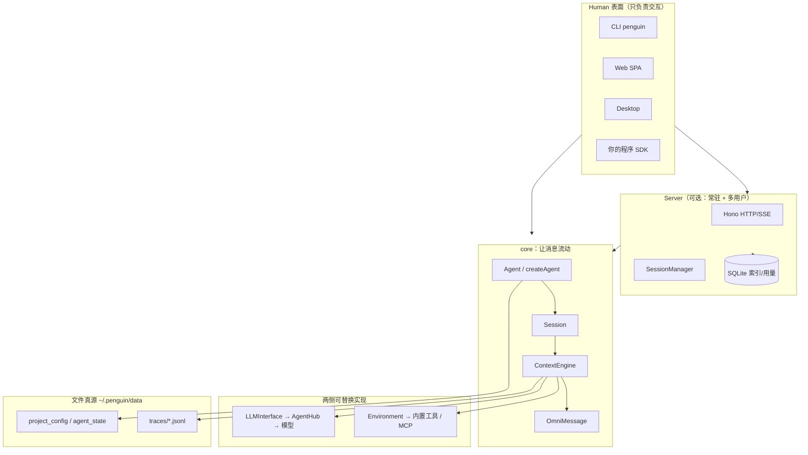
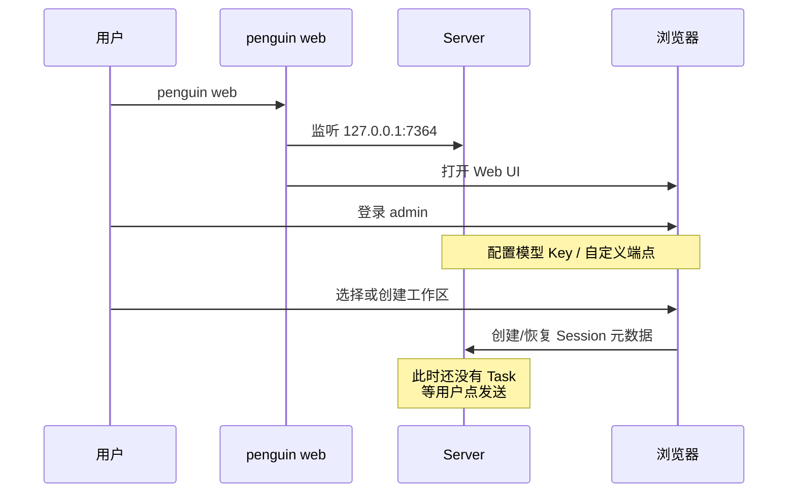
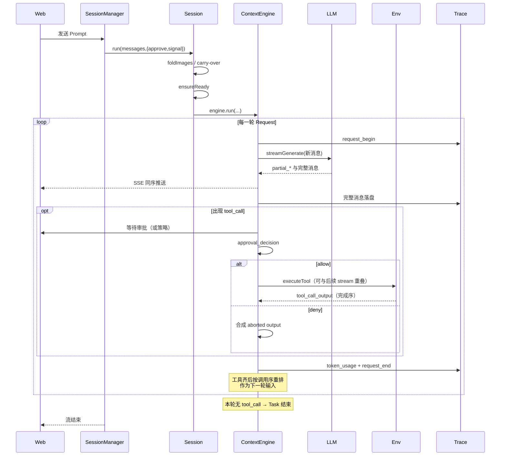

# 第二章 · 总体架构、模块分工与端到端

> **阅读顺序**：先 [00-顶层设计与实体边界](./00-顶层设计与实体边界.md)（封装表），再读本章。术语：[GLOSSARY.md](./GLOSSARY.md)。  
> 写作须符合 [DOC_QUALITY.md](./DOC_QUALITY.md)：流程图必须能对应「谁写入」；缺实体边界回 00。  
> 本章目标：谁调用谁、启动后发生什么、用户发一句话后数据怎么走——**禁止只记包名表**。

### 本章目录

1. [分层总图与口诀](#1-分层总图与口诀)  
2. [模块分工（带「为什么在这层」）](#2-模块分工带为什么在这层)  
3. [六层运行模型（讲清楚每一层）](#3-六层运行模型讲清楚每一层)  
4. [组装：从 createAgent 到可 run](#4-组装从-createagent-到可-run)  
5. [E2E：启动到浏览器可聊](#5-e2e启动到浏览器可聊)  
6. [E2E：用户发一句话（内环全故事）](#6-e2e用户发一句话内环全故事)  
7. [流序 vs 上下文序（最易晕的一点）](#7-流序-vs-上下文序最易晕的一点)  
8. [数据与 Trace 怎么流动](#8-数据与-trace-怎么流动)  
9. [扩展决策树](#9-扩展决策树)  
10. [本章总结](#10-本章总结)

---

## 1. 分层总图与口诀



**口诀（请背）：**

> Human 只调用 `session.run`；  
> 引擎只认识 OmniMessage；  
> 历史只相信 Trace 文件；  
> SQLite 只做索引，不争真源。

如果你改代码时发现自己在 Server 里重写 ReAct，或在 Web 里维护第二份 messages[]——路径已经偏了。

---

## 2. 模块分工（带「为什么在这层」）

| 包 | 干什么 | 为什么必须在这层 |
|----|--------|------------------|
| **core** | ContextEngine、OmniMessage、LLM/Env、State、Trace | 所有表面必须共享同一执行语义；逻辑放这里才能 CLI/Web 一致 |
| **cli** | 命令行 Human：chat/run/config，以及拉起 web/server | 终端交互与审批 UI；不复制引擎 |
| **server** | 鉴权、多会话互斥、SSE、用量、定时任务调度 | 需要常驻进程与多用户时才需要；仍 `session.run` |
| **web** | React SPA，按 OmniMessage 渲染 | **禁止**引擎逻辑；只消费协议 |
| **skills** | 内置 SKILL.md 库 | 与 core 解耦发布；安装时拷进 agent_state |
| **desktop** | Electron 壳 | 内嵌或附着 server；数据目录与 CLI 相同 |
| **docs/landing** | 文档与官网 | 产品沟通，不是运行时 |

判断归属的一句话（官方架构文）：

> **能编辑的与被记录的在文件层；让消息流动的在 SDK；需要常驻与多用户的在 Server；其余是渲染。**

---

## 3. 六层运行模型（讲清楚每一层）

```text
Project → Agent → Workspace → Session → Task → Request
```

把它想成「从组织到一次 HTTP 调用」的变焦：

| 层 | 人话 | 关键约束 |
|----|------|----------|
| **Project** | 一个项目空间：模型表、凭据、下面挂多个 Agent | `.project_config.toml`；Web 里用户↔项目可多对多 |
| **Agent** | 一个「角色/能力包」：恰好一份 Agent State | `system_config.yaml`、`AGENTS.md`、skills、vault |
| **Workspace** | 模型能看见并改动的文件根 | 显式目录必须已存在；否则可建临时 `workspaces/tmp-…` |
| **Session** | 同一 Agent+Workspace 下的一段连续对话 | **创建时锁定模型与 Workspace**；换模型 = 新 Session（handoff） |
| **Task** | 一次 `session.run` 的目标 | 内含 1..N 个 Request；无 tool_call 的最终答复结束 Task |
| **Request** | 一次 LLM API 调用 | 有 `request_begin`/`request_end`；回放用 end.status 判断是否提交 |

常见误解：

- 「Session = 一次提问」→ 错。一次提问是 Task。  
- 「换模型继续同一 Session」→ 产品上通常是新 Session，避免 thinking 块跨模型污染。

---

## 4. 组装：从 createAgent 到可 run

Penguin **没有** Profile / Bundle / Cordis patch。组装路径是函数 + 文件：

```text
createAgent({ agentId, projectId?, root? })
  │  目录空 → 初始化 agent_state（默认 skill 等）
  │  已有 → 加载配置与 vault
  ▼
agent.createSession({ workspaceDir, model? })
  │  挂上 Environment、Trace Writer、meta
  │  此时通常还没连 MCP、还没 new ContextEngine
  ▼
session.run(prompt, { approve, signal })
  │  ensureReady：listTools / MCP / GenerativeModel / new ContextEngine
  ▼
ContextEngine.run → 多轮 runTurn …
```

为什么 Session 构造要「快」、把连接放到第一次 run？

因为 MCP/模型准备可能要几秒；若放在构造函数，Web「点开会话」就会卡住且没有事件可渲染。懒 bootstrap 让 `mcp_connect_begin/end` 等事件能流式出现在 UI 上。

---

## 5. E2E：启动到浏览器可聊



开发态额外注意：根目录 `pnpm penguin` 常把数据指到 `~/.penguin/dev-data`，避免污染正式 `~/.penguin/data`。

**自检清单：**

1. 打开 http://127.0.0.1:7364 是否 200  
2. 模型页是否已有可用 `(provider, model)`  
3. 是否已选 Workspace（否则没法安全跑文件工具）

---

## 6. E2E：用户发一句话（内环全故事）

以 Web 为例（CLI 少了 SSE，多了终端渲染，引擎相同）：



逐步人话：

1. **Human 只提交增量 Prompt**，不提交「全量假历史」——历史在 GenerativeModel/Trace 侧维护。  
2. **每条完整消息边 yield 边写 Trace**，保证「看见的 ≈ 可回放的」。  
3. **审批在 tool_call 完整之后立刻发生**，且一次一个；但允许的执行不阻塞模型继续吐下一个 tool_call。  
4. **`request_end` 在 LLM 流结束时就发**，不等工具；迟到的工具输出可以出现在 end 之后。  
5. **下一轮开始前**，工具结果按**原始调用顺序**排好——这是模型上下文序，不是 UI 完成序。

---

## 7. 流序 vs 上下文序（最易晕的一点）

官方 message-flow 文档的核心洞见：

| 顺序 | 谁关心 | 规则 |
|------|--------|------|
| **流序（UI/Trace 可见）** | 前端打字机、轨迹时间线 | MergeQueue 按**到达/完成**交错 |
| **上下文序（喂模型）** | 下一轮 `streamGenerate` | tool 结果按 **call 原始顺序** 重排 |

例子：模型先调 A 再调 B，但 B 先跑完——

- 你在屏幕上先看到 B 的 output，再看到 A 的 output（流序）。  
- 下一轮送给模型时仍是 A 的结果在前、B 在后（上下文序）。  

如果你在自定义前端「按流序直接拼成 messages 再 POST 回后端当历史」，就会和引擎内部不一致。正确做法是：**只当渲染器**，历史以引擎/Trace 为准。

---

## 8. 数据与 Trace 怎么流动

```text
OmniMessage
  ├─► Human（CLI 渲染 / SSE）
  └─► Trace Writer（JSONL append）

不进 Trace 的：
  - partial_* 分片（完整消息会另写）
  - 带 origin 的子 Agent 内部消息（子 Session 自己的 Trace；父 Trace 留指针事件）
```

恢复：`resumeTrace` 读 JSONL，用 `request_end.status === "completed"` 判断哪些轮已提交。压缩成功会轮转到 `_002.jsonl` 等新文件——**一份 Trace 文件对应一份完整模型上下文段**。

---

## 9. 扩展决策树

```text
我想…
  改「怎么一轮轮想」          → 基本别改；调 max_turns / 压缩阈值
  换模型或网关                → project_config / 模型页 / AgentHub
  加工具（通用能力）          → Environment 内置或 MCP
  加领域流程/规范             → Skill（SKILL.md）
  长程自治直到目标完成        → Goal 模式
  委派子任务                  → run_subagent
  多用户/权限/用量            → Server 层
  换 UI                       → 新 Human；仍调 session.run
  想像 DSH 一样热插拔 loop    → Penguin 不做这件事；选错产品了
```

---

## 10. 本章总结

1. 架构是 **Human →（Server）→ Session/ContextEngine → LLM|Env → 文件 Trace**。  
2. 六层变焦：Project…Request；Session 锁模型与工作区。  
3. 组装是 **createAgent + 文件**，不是 Bundle。  
4. 发消息的故事核心是 **边流边记 + 审批串行执行并行 + 流序≠上下文序**。  
5. 扩展优先 Skill/MCP/配置，而不是 fork 引擎。

下一章：[03-子系统全景.md](./03-子系统全景.md)（每个子系统用完整段落讲，不只一行表）。
