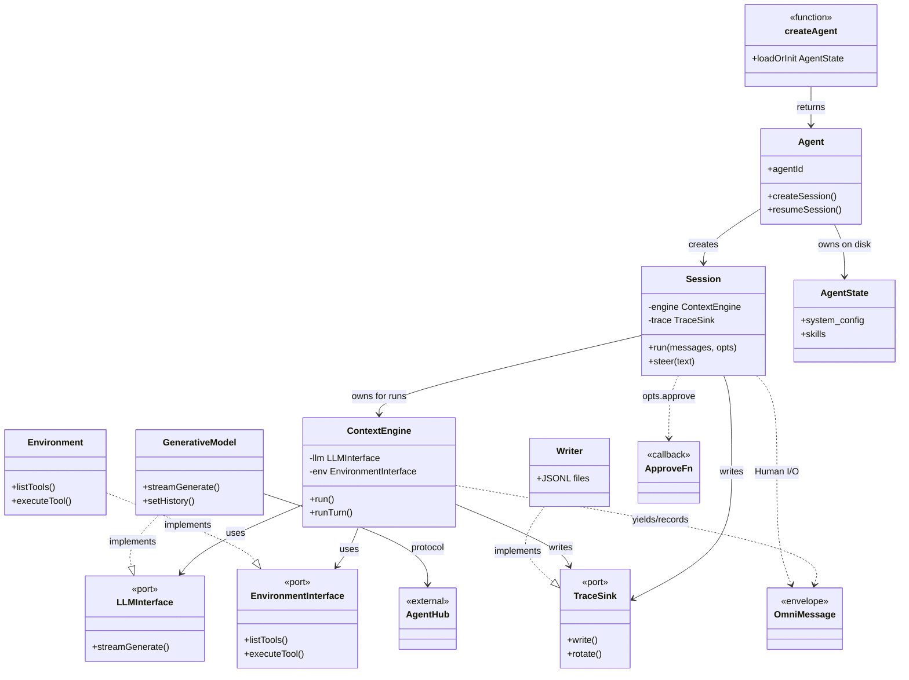
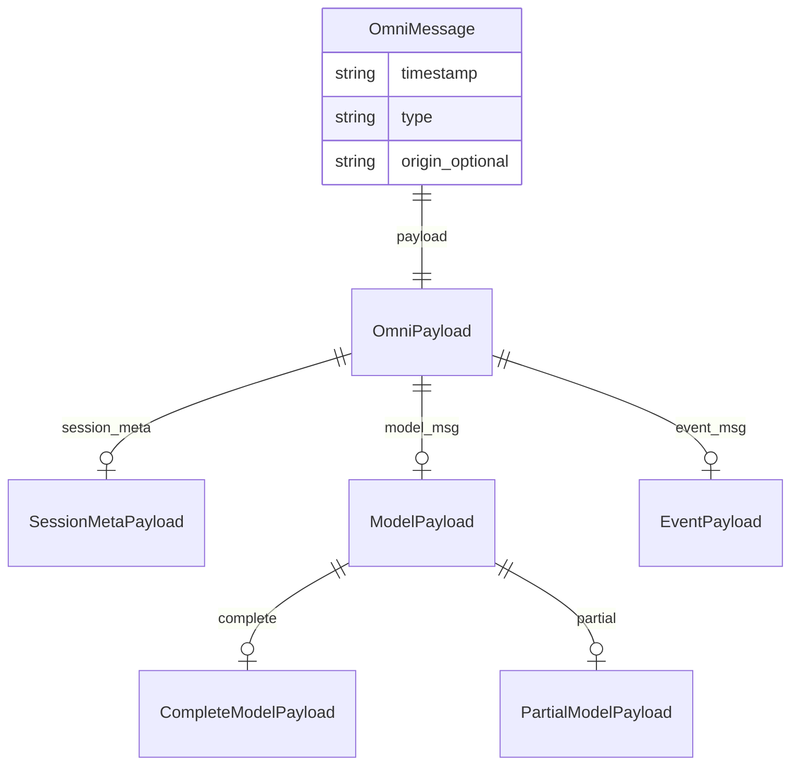
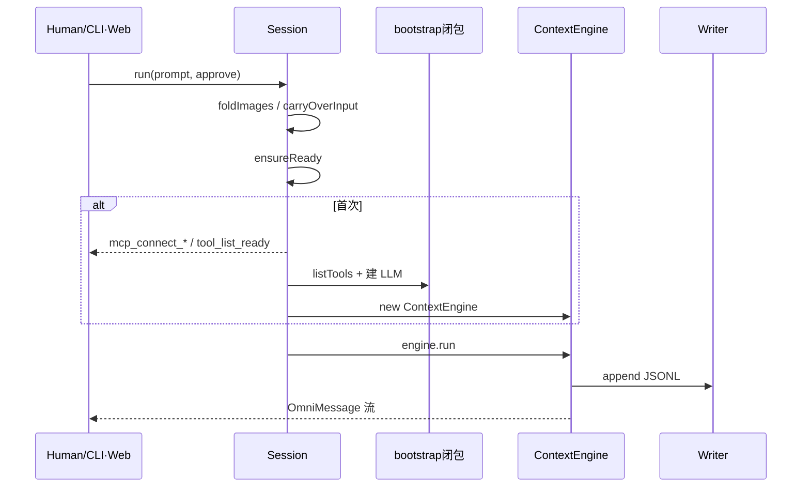
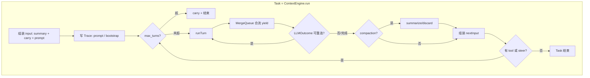
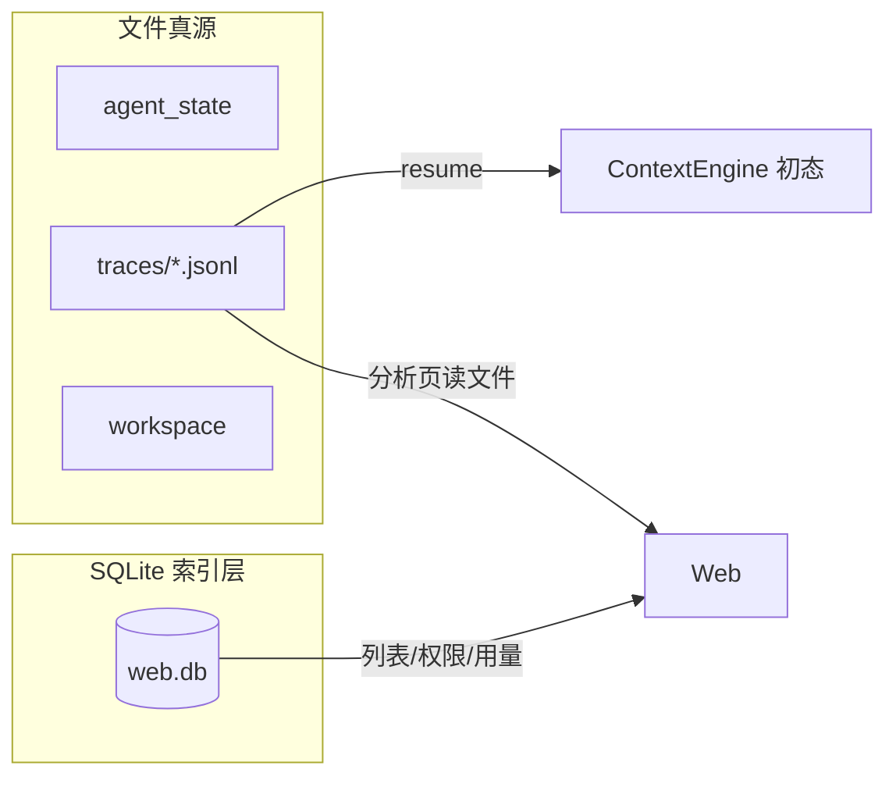
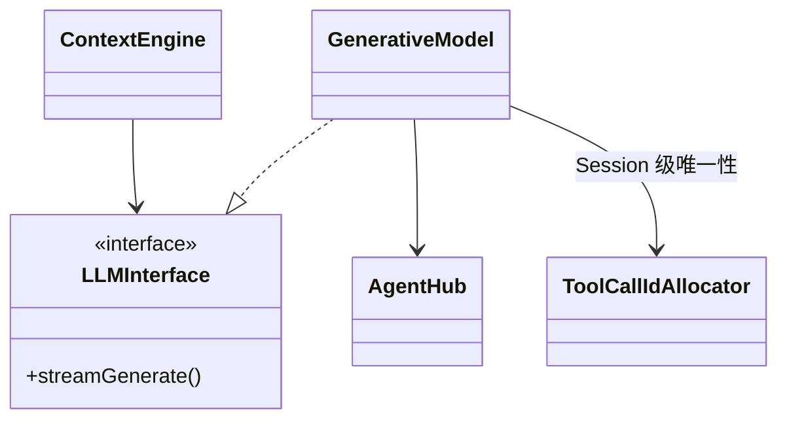

# PenguinHarness — 架构文档（第1部分）· 核心主干

> **主题**：产品命题 · 包边界 · 核心实体 · OmniMessage · Session / Human 边界 · ContextEngine · Trace · LLM / Environment 端口 · 与 DSH/Pi 对照 · 改代码决策树  
> **配套**：[00-顶层设计与实体边界.md](./00-顶层设计与实体边界.md) · [DOC_QUALITY.md](./DOC_QUALITY.md) · [GLOSSARY.md](./GLOSSARY.md) · [ARCHITECTURE_PART2.md](./ARCHITECTURE_PART2.md) · [ARCHITECTURE_PART3.md](./ARCHITECTURE_PART3.md)  
> **源码根**：`/Users/gqli/work/deepagents/penguin-harness/packages/core/src/`  
> **权威行为**：官方 `packages/docs/content/` + 本仓测试；本文是学习向中文长文，与源码冲突时以源码与官方 docs 为准。  
> **质量标准**：每节含设计目标/非目标、实体边界表、熟悉对照、写入归属、真实代码引用、类图/ER、DSH 对照（相关处）、节末小结——禁止「只有 TOC + 薄 mermaid」。

---

## 本卷目录

| 章节 | 内容 |
|------|------|
| [§0](#0-阅读导航--心智模型--要回答的问题) | 阅读导航 · 心智模型 · 五个必答问题 |
| [§1](#1-产品命题与故意不做) | 产品命题与故意不做（对标 Pi I.1） |
| [§2](#2-包依赖与边界) | packages/core、cli、server、web… |
| [§3](#3-核心实体总表--类图) | 实体总表 + 类图（对齐 00） |
| [§4](#4-omnimessage-数据模型) | 类型 · 谁产生 · 是否进 Trace · 是否进下一轮 LLM |
| [§5](#5-sessionrun--ensureready--bootstrap--human-边界) | Session.run / ensureReady / bootstrap / Human |
| [§6](#6-contextenginerun--runturn) | 完整控制流 · 审批串行 vs 工具并行 · MergeQueue · steer · carry-over · stop_reason |
| [§7](#7-trace路径appendresume与-sqlite-关系) | Trace 路径 · append · resume · SQLite |
| [§8](#8-llminterface--generativemodel--agenthub-边界) | LLM 端口与 AgentHub |
| [§9](#9-environmentinterface-边界端口定约) | Environment 端口（细节 PART2） |
| [§10](#10-与-dsh--pi-对照表) | 对照表 |
| [§11](#11-改代码决策树--本章总结) | 决策树 + 总结 |
| [附录 A](#附录-a--一次真实调用的写入归属全表无-goal) | 一次 run 的逐步写入归属 |
| [附录 B](#附录-b--常见误读-faq) | HumanInterface / 并行审批 / Trace 等 FAQ |
| [附录 C](#附录-c--源码索引导航本卷引用过的文件) | 绝对路径索引 |
| [附录 D](#附录-d--与00文档的差异说明防打架) | 与 00 短文分工 |
| [附录 E](#附录-e--心智模型卡片可裁切) | 一页心智卡片 |

---

# §0 阅读导航 · 心智模型 · 要回答的问题

## 0.1 设计目标（本卷）

| 目标 | 说明 |
|------|------|
| 建立「固定内核 + 端口」心智 | ContextEngine 的 ReAct while 是改源码级固定算法；可换的是 LLM/Environment/ApproveFn/Skill 文件 |
| 把封装边界说清楚 | 每实体：拥有 / 不拥有 / 依赖 / 禁止渗入 |
| 用写入归属读流程 | 每一步写清谁执行、改谁的内存、落哪份磁盘 |
| 对齐 00 与源码 | 与 [00-顶层设计与实体边界.md](./00-顶层设计与实体边界.md) 不打架；引用 `/Users/gqli/work/deepagents/penguin-harness/packages/core/src/` 真实符号 |

## 0.2 非目标（本卷）

| 非目标 | 去哪看 |
|--------|--------|
| 九个内置工具逐工具行为、MCP 传输细节 | [ARCHITECTURE_PART2](./ARCHITECTURE_PART2.md) |
| CLI/Web/Desktop 产品流、数据目录树全文 | [ARCHITECTURE_PART3](./ARCHITECTURE_PART3.md) |
| ContextEngine 每个私有方法逐行注释 | [source/01-context-engine.md](./source/01-context-engine.md) |
| Cordis / Profile / Bundle 插件树 | **Penguin 没有**——不要从 DSH 心智硬套 |

## 0.3 一句话心智模型

```text
Human（CLI / Web / SDK）
  └── Session.run(Prompt, { approve, signal })
        ├── ensureReady（首次：MCP + listTools + 建 LLM + new ContextEngine）
        └── ContextEngine.run  ←── 固定 ReAct while
              ├── LLMInterface.streamGenerate  → OmniMessage 流
              ├── ApproveFn(tool_call)         → 串行决策
              ├── EnvironmentInterface.executeTool → 并行副作用
              ├── MergeQueue                   → 合流 yield
              └── TraceSink / Writer           → JSONL 真源
```

六层运行模型（记不清时回 [GLOSSARY](./GLOSSARY.md)）：

```text
Project → Agent → Workspace → Session → Task → Request
```

上面管「装在哪、谁定义行为」；下面管「这一次怎么跑」。

## 0.4 熟悉对照（开篇速查）

| 新词 | 旧知识 | 不是什么 |
|------|--------|----------|
| OmniMessage | 统一 DTO / 事件信封 | 仅 UI 视图模型；也不是第二套「内部私有格式」 |
| ContextEngine | 应用服务里的 ReAct 编排器 | 可热插的 Cordis 插件包 / DSH Loop Driver |
| Session.run | 用例入口（一进一出） | 持久消息队列消费者 |
| Human 边界 | 端口上的 I/O 约定 | `class Human` / `HumanInterface` |
| Trace | Event log / JSONL WAL | Server SQLite 里的 messages 表 |
| ApproveFn | 策略回调（类似 beforeTool） | Filter 链框架 / 全局单例审批服务 |
| MergeQueue | 多生产者单消费者合流缓冲 | 持久 Inbox / DSH splice |
| steer | 运行中插 USER 文本 | DSH Inbox 事件溯源 |
| carry-over | 中断后待补输入 | Trace 里单独一种「合成事件类型」 |
| Skill | 提示词 + 流程说明书文件 | npm 插件 / Bundle |
| AgentHub | Provider 协议适配层 | core 直连厂商 SDK |

## 0.5 读完本卷必须能回答的五个问题

1. **为什么没有 `HumanInterface` 类？** Human 是三接口之一，却为什么在 `interfaces.ts` 里找不到第三个 interface？  
2. **一轮 Request 里，审批串行、工具并行如何同时成立？** 谁保证「流给 UI 的顺序」可以不同于「喂给下一轮模型的顺序」？  
3. **为什么 Trace JSONL 是恢复唯一真源？** Server SQLite 救不了对话正文吗？丢一个 `traces/...jsonl` 意味着什么？  
4. **改「允不允许跑某工具」该动谁？** 改「模型流怎么解析」该动谁？想「换一整套循环哲学」当前产品边界允不允许？  
5. **Penguin 相对 DSH 故意缺了什么？**（Cordis / Profile / Bundle / Inbox splice / Loop setFactory）缺了之后扩展路径是什么？

带着这五个问题读正文，比对着目录扫标题更有收获。

## 0.6 推荐阅读路径

| 读者 | 路径 |
|------|------|
| 第一次学 Penguin | §0 → §1 → §3 → §5 → §6 → §7 → §11 |
| 只关心恢复与备份 | §7 + §4 的「是否进 Trace」表 |
| 要嵌 SDK | §2 → §5 → §8 → §9 → §11 决策树 |
| 从 DSH/Pi 过来 | §1 + §10 先读，再回 §3/§6 消误解 |

## 0.7 本节小结

本卷不是「再列一遍模块名」，而是用真实调用链与边界表回答：内核固定在哪、端口可换在哪、历史存在哪、Human 为什么不是类。

---

# §1 产品命题与故意不做

> 对标 Pi 架构文档 I.1「产品命题」写法：先说要解决什么，再显式列出故意不做——否则读者会把 DSH/CrewAI 的插件心智硬套进来。

## 1.1 设计目标

| 目标 | 落在哪个实体 | 产品语言 |
|------|----------------|----------|
| 精简工具 + 文件 Skill，少抽象 | `Environment` 内置工具 + `Skill` 文件；**无插件运行时** | 更少工具、更低成本，对开放模型友好 |
| 流、存、内部传同一种消息 | **`OmniMessage`** 唯一信封 | 前后端与存储之间没有第二套私有格式 |
| 可恢复、可审计 | **`Trace` JSONL** 为 Session 恢复真源 | 分析页能复盘「当时发生了什么」 |
| Human 进一出清晰 | **`Session.run`**：Prompt + approve → `AsyncGenerator<OmniMessage>` | CLI / Web / SDK 都是不同宿主，同一边界 |
| 模型与工具可替换 | **`LLMInterface` / `EnvironmentInterface`**（端口） | core 不直连厂商 SDK；副作用不进引擎 |
| 编排集中一处 | **`ContextEngine`**（ReAct while） | 改循环哲学 = 改源码或 fork，不是装另一个 Driver |

README 式三句主张（与 [01-项目介绍与设计思路.md](./01-项目介绍与设计思路.md) 对齐）：

1. **更少工具、更低成本**，对 DeepSeek 等开放模型友好。  
2. **用 Agent 构建 Agent**——一句话生成带检索/脚手架的应用。  
3. **自进化**——Benchmark、Snapshot、Skill 自评自改。

## 1.2 故意不做（边界）

| 不做 | 原因 / 谁承担类似职责 |
|------|------------------------|
| Cordis / Profile / Bundle 插件树 | 产品选择：扩展用 Skill / MCP / 配置，不热插 Driver |
| 持久 Inbox（splice / claim） | 用 **`steer` + carry-over**；排队不事件溯源 |
| Session 类写磁盘格式细节 | Session 持 `TraceSink`；**Writer** 管 JSONL |
| core 直连厂商 SDK | **`AgentHub` / GenerativeModel** 在 LLM 适配层 |
| 把 UI 渲染塞进 core | Human（CLI/Web）自己订 OmniMessage 流 |
| `HumanInterface` 方法类 | Human **就是** `Session.run` 的入参与出参边界 |
| DSH 式 `setFactory` 换整包 Loop | ReAct while **固定**在 ContextEngine；要换哲学就改源码 |
| 用 SQLite 当对话正文真源 | SQLite 只存索引与聚合（见 §7） |

## 1.3 产品命题 → 架构公理（操作化）

1. **一种信封**：凡是「给人看 / 给人存 / 给引擎传」的，默认是 OmniMessage；加新事件类型 = 协议变更。  
2. **真源在文件**：Agent State、Skill、Trace 在磁盘；Server 库是索引层。  
3. **端口可换、内核固定**：LLM / Environment / ApproveFn 可注入；`runTurn` 的 while 不是插件。  
4. **审批是 Human 边界的一部分**：每个完整 `tool_call` 一次；子 Agent **继承**父审批回调。  
5. **中断可续、合成不落盘**：carry-over / pairing placeholder 可只在内存；Trace 只记真实消息。

## 1.4 与「智能体框架」一词对照

| 说法 | 是否贴切 |
|------|----------|
| Agent 运行时 / Harness | ✅ 核心是跑 Session |
| Agent 构建平台 | ✅ 强调 Skill、脚手架、评估中心 |
| Cordis 式可逆插件底座 | ❌ **没有**插件运行时 |
| 训练框架 | ❌ 不管权重 |
| 「全可插 Loop」 | ❌ 内核固定；端口可换 |

一句话记住：

> **固定三接口的 ReAct 引擎 + OmniMessage/Trace 真源 + 文件即定义的 Skill/配置 + 产品化 CLI/Web/Desktop。**

## 1.5 本节小结

Penguin 的命题是「少抽象、一种信封、文件真源、固定编排」。故意不做插件树与 Inbox，是为了让学习者把力气花在 Skill、端口与 Trace，而不是再学一套 Cordis 组装学。

---

# §2 包依赖与边界

## 2.1 设计目标 / 非目标

| 目标 | 说明 |
|------|------|
| 按事实来源切包 | 协议/执行在 core；常驻多用户在 server；渲染在 web/cli/desktop |
| 依赖单向 | `cli` / `server` → `core`；`web` → server API；禁止 web 直 import 引擎私有细节改行为 |

| 非目标 | 说明 |
|--------|------|
| 本卷展开每条 HTTP 路由 | 见 PART3 |
| 本卷展开 Skill 库分组 | 见 PART2 |

## 2.2 分层总图

```text
┌─────────────────────────────────────────────────────────┐
│ 表面：CLI / Web(server) / Desktop / SDK 调用方            │  只谈 Session.run / createAgent
└───────────────────────────┬─────────────────────────────┘
                            │ Human 边界（不是一个 interface 类）
┌───────────────────────────▼─────────────────────────────┐
│ packages/core                                             │
│  Agent ──创建──► Session ──拥有──► ContextEngine           │
│    │               │                    │                 │
│    │               │                    ├─ LLMInterface   │
│    │               │                    ├─ Environment    │
│    │               │                    └─ TraceSink      │
│    └─ AgentState / Project / Vault（磁盘配置）              │
└─────────────────────────────────────────────────────────┘
         │                                      │
         ▼                                      ▼
   ~/.penguin/data（Agent State, Trace…）    AgentHub（厂商协议）
```

## 2.3 包地图实体边界

| 层 | 包/目录 | **拥有** | **不拥有** | **依赖** | **禁止渗入** |
|----|---------|----------|------------|----------|--------------|
| 表面 | `packages/cli` | 终端交互、审批旗标、子命令 | ReAct 内层、Trace 格式细节 | core | ContextEngine 私有方法 |
| 表面 | `packages/web` | SPA 渲染、审批 UI | 业务引擎、对话真源 | server API | 直接改 core 循环 |
| 组合/常驻 | `packages/server` | HTTP/SSE、认证、SQLite 索引、并发互斥 | 第二套引擎 | core + node:sqlite | 把 messages 正文塞进 SQLite 当真源 |
| 引擎 | `packages/core` | OmniMessage、ContextEngine、Session、Trace Writer、端口 | 多用户、React 气泡 | AgentHub、本地 FS | Cordis、厂商 SDK 直连 |
| 扩展库 | `packages/skills` | 内置 SKILL.md | 运行时插件注册 | 被 state 拷贝安装 | 注册进程内服务 |
| 壳 | `packages/desktop` | Electron 壳 | 独立引擎 | 本地 server/数据约定 | 另造一套 Trace |
| 文档 | `packages/docs` / `landing` | 官方说明与落地页 | 运行时行为权威以外的「私货协议」 | — | 与 core 类型打架 |

```text
packages/
├── core/      → 引擎与 SDK（@prismshadow/penguin-core）
├── cli/       → 终端入口 penguin
├── server/    → HTTP + SSE + SQLite 索引
├── web/       → SPA 渲染
├── skills/    → 内置 Skill 库
├── desktop/   → Electron
├── docs/      → 官方文档
└── landing/   → 官网
```

## 2.4 core 内部目录（本卷相关）

| 路径 | 职责 | 本卷章节 |
|------|------|----------|
| `/Users/gqli/work/deepagents/penguin-harness/packages/core/src/agent.ts` | `createAgent` / `Agent` / create·resume Session | §3 §5 §7 |
| `/Users/gqli/work/deepagents/penguin-harness/packages/core/src/session.ts` | Human 边界、`run`/`ensureReady`/`steer` | §5 |
| `/Users/gqli/work/deepagents/penguin-harness/packages/core/src/engine/context-engine.ts` | ReAct、MergeQueue、carry-over | §6 |
| `/Users/gqli/work/deepagents/penguin-harness/packages/core/src/interfaces.ts` | LLM / Environment / ApproveFn 端口 | §3 §8 §9 |
| `/Users/gqli/work/deepagents/penguin-harness/packages/core/src/omnimessage/` | 信封类型与 builders | §4 |
| `/Users/gqli/work/deepagents/penguin-harness/packages/core/src/trace/` | Writer / resume | §7 |
| `/Users/gqli/work/deepagents/penguin-harness/packages/core/src/llm/` | GenerativeModel | §8 |
| `/Users/gqli/work/deepagents/penguin-harness/packages/core/src/environment/` | 工具实现 | §9 + PART2 |

## 2.5 熟悉对照

| 新词 | 旧知识 | 不是什么 |
|------|--------|----------|
| packages/core | SDK / 库内核 | 「整个产品」 |
| packages/server | 多用户 BFF + 索引库 | 对话正文数据库 |
| PENGUIN_HOME | 数据根（默认 `~/.penguin/data`） | 仅配置文件目录 |

## 2.6 写入归属（跨包一次发消息）

| 步骤 | 执行者 | 内存 | 磁盘/事件 |
|------|--------|------|-----------|
| 用户点发送 | Web / CLI | UI 本地草稿 | — |
| `session.run` | Session（core） | 折叠图片、拼 carryOver | 可能写 aborted bootstrap Trace |
| ReAct | ContextEngine | turn 状态、MergeQueue | Trace JSONL append |
| SSE 推流 | server | 连接态 | SQLite 可能记用量/索引，**不**代替 Trace |
| 画气泡 | web | React state | — |

## 2.7 DSH 对照（包切分）

| | Penguin | DSH（常见） |
|--|---------|-------------|
| 扩展 | Skill 文件 + MCP | Cordis Bundle / Profile |
| 编排 | 固定 ContextEngine | Loop 可 setFactory |
| 宿主 | cli/server/web 薄壳 | 常与插件生命周期缠在一起 |

## 2.8 本节小结

切包标准是事实来源：能编辑的与被记录的在文件层；让消息流动的在 core；需要常驻与多用户的在 server；其余是渲染。不要让 web「抄近路」改引擎行为。

---

# §3 核心实体总表 · 类图

> 与 [00-顶层设计与实体边界.md](./00-顶层设计与实体边界.md) §3 对齐并加厚。

## 3.1 设计目标 / 非目标

| 目标 | 说明 |
|------|------|
| 读者能指出「状态 X 由实体 Y 独占」 | 例如 pendingCarryOver 在 ContextEngine |
| 读者能指出「改需求 Z 该动哪个文件」 | 决策树见 §11 |

| 非目标 | 说明 |
|--------|------|
| 把 Goal 外环当成内环替代 | Goal 多次调用同一 Session/Engine 模型 |
| 把 AgentState 当 Session transcript | transcript 在 Trace |

## 3.2 核心实体总表

| 实体 | 一句话 | **拥有（封装）** | **不拥有** | **依赖** | **禁止渗入** |
|------|--------|------------------|------------|----------|--------------|
| **`createAgent`** | 唯一入口：空目录初始化或按 agentId 加载 | 解析 root、装 AgentState | Session 生命周期、ReAct | state 加载器 | 在入口里跑 while |
| **`Agent`** | 一个 Agent State 上的工厂：开/恢复多个 Session | agentId、project、vault、proxy、子 Agent 深度策略 | 单次 run 的 turn 循环 | ProjectConfig、Environment 工厂、Writer | HTTP、React |
| **`Session`** | 同一 Agent+Workspace 的连续对话；**Human I/O 边界** | `run`/`steer`、bootstrap、meta、与 Engine 绑定、标题素材 | 工具 exec 细节、UI 画气泡 | ContextEngine、TraceSink、ApproveFn | 厂商 SSE 解析 |
| **`ContextEngine`** | ReAct 编排：LLM→审批→工具→再 LLM | turn/request、MergeQueue、carry-over、compaction 触发、steer 缓冲 | 磁盘路径、HTTP、厂商 SDK | LLMInterface、EnvironmentInterface、TraceSink、ApproveFn | Cordis、Inbox |
| **`LLMInterface`** | 模型端口：`streamGenerate` | 流式 token/tool_call → OmniMessage；`LLMOutcome` | 何时停 Task、如何 approve | AgentHub（实现侧） | 审批策略 |
| **`EnvironmentInterface`** | 工具端口：`listTools` / `executeTool` | 工具注册表、MCP、权限、workspace 相对路径 | 何时发起 tool_call | 工作区 FS/进程 | ReAct while |
| **`ApproveFn`** | 每个 tool_call 一次允许与否 | 表面注入的策略 | 不是 core 全局单例服务 | 由 CLI/Server 注入 | Environment 内部「偷偷自批」绕过（子 Agent 应转发父回调） |
| **`OmniMessage`** | 统一消息信封 | 类型与 payload 约定 | 「怎么存文件」 | 全链路 | 第二套私有事件模型 |
| **`Trace` / `Writer`** | 追加 JSONL；恢复真源 | 文件切分、容错读、resume | 审批文案、模型选哪家 | FS | 业务审批策略 |
| **`AgentState`** | 磁盘上的人设/技能/系统配置 | `system_config.yaml`、AGENTS.md、skills、vault 引用 | 某次 Session 的 transcript | 路径约定 | Trace 内容 |
| **`Project`** | 项目模型表与凭据 | `.project_config.toml` | Trace 正文 | Agent 加载 | 会话消息 |
| **`Skill`** | 文件型扩展 | 元数据+正文，渐进加载 | Cordis 式服务注册 | Agent/提示组装 | 插件生命周期 |
| **`Goal` 循环** | 多 Task 直到完成/阻塞/预算 | `runGoalLoop` 外环 | 替代 ContextEngine 内环 | 多次 Session/Engine Task | 改写 ReAct |
| **Subagent** | `run_subagent` 派生子 Session | 深度上限（默认 1）、继承代理策略 | 无限嵌套 Agent 网 | Environment 工具 → Agent | 父 Trace 写入子正文 |

## 3.3 熟悉对照

| Penguin | 熟悉概念 | 不是 |
|---------|----------|------|
| Agent | 工厂 + 磁盘状态句柄 | 单次对话对象 |
| Session | 连续对话上下文 + Human API | 持久队列消费者 |
| ContextEngine | 编排应用服务 | 可热插 Driver |
| TraceSink | 写端口（可测试注入） | 必须是 Writer 类名才能跑（接口即可） |

## 3.4 类图（对象引用，不是部署图）



**读图规则**：

- 实线箭头 = 创建 / 持有 / 调用（引用关系）。  
- `..|>` = 实现端口（不是继承业务基类树）。  
- Penguin **几乎没有**深继承业务树；对比 MAF 的 Mixin 层，这里是「薄接口 + 组合」。  
- `ApproveFn` 从表面注入，**不属于** Agent 单例字段的永久策略库。

## 3.5 继承 vs 引用（刻意强调）

| 关系类型 | 例子 | 含义 |
|----------|------|------|
| 组合/持有 | Session 持有 ContextEngine | Session 生命周期覆盖引擎 |
| 端口实现 | GenerativeModel implements LLMInterface | 可换实现，不改引擎 |
| 回调注入 | ApproveFn | 每 run 可不同；非全局服务定位 |
| 外部库 | AgentHub | core 不拥有厂商协议细节 |

## 3.6 源码：`createAgent` 与 `Agent` 入口

```152:165:/Users/gqli/work/deepagents/penguin-harness/packages/core/src/agent.ts
/** Create or load an Agent. */
export async function createAgent(opts: CreateAgentOptions = {}): Promise<Agent> {
  const state = await loadOrInitAgentState(opts);
  const projectConfig = await loadProjectConfig(state.root, state.projectId);
  return new Agent(state, projectConfig, opts.proxyEnv);
}

export class Agent {
  constructor(
    readonly state: AgentState,
    readonly projectConfig: ProjectConfig,
    /** See {@link CreateAgentOptions.proxyEnv}; forwarded into every Session's Environment. */
    private readonly proxyEnv?: () => ProxyEnvPolicy | null,
  ) {}
```

```71:76:/Users/gqli/work/deepagents/penguin-harness/packages/core/src/agent.ts
/**
 * Maximum subagent spawn depth. Currently capped at 1 level (a subagent cannot spawn
 * another subagent); the depth mechanism is designed to support multiple levels —
 * raise this constant to allow deeper nesting.
 */
const MAX_SUBAGENT_DEPTH = 1;
```

## 3.7 固定算法 vs 扩展点（再钉一次）

| 层次 | 内容 | 可换方式 |
|------|------|----------|
| **固定** | ContextEngine 内 ReAct：有 tool 就批→跑→再请求 | 改源码或 fork；**不是**装另一个 loop 插件 |
| **端口可换** | LLM / Environment 实现 | 换 GenerativeModel 配置、MCP、工具集 |
| **文件可扩** | Skill、Goal YAML、system_config | 丢文件 / 改配置 |
| **表面可扩** | approve 策略、UI、CLI | 注入回调与渲染 |
| **外环** | Goal loop、Subagent | 仍回调同一 Session/Engine 模型 |

## 3.8 本节小结

实体表是本仓 doc-sn 的硬门槛：没有「拥有/不拥有」就谈不上架构。记住：Session 是 Human 边界；ContextEngine 是固定内核；Trace 是真源；ApproveFn 是注入回调。


---

# §4 OmniMessage 数据模型

## 4.1 设计目标 / 非目标

| 目标 | 说明 |
|------|------|
| 一种信封走完全程 | SDK 边界、Trace 格式、引擎内部通货同构 |
| 明确「谁产生 / 是否进 Trace / 是否进下一轮 LLM」 | 防「引擎先 yield 私有 payload，前端再特判」 |

| 非目标 | 说明 |
|--------|------|
| 把 partial_* 也写入 Trace | 完整消息会补写；文件要小 |
| 父 Trace 写入子会话正文 | 子 Session 自有 Trace；父只留 `subagent` 指针 |

## 4.2 实体边界

| | 内容 |
|--|------|
| **拥有** | `timestamp` / `type` / `payload` / 可选 `origin` 约定 |
| **不拥有** | 磁盘路径、Writer 实现、UI 组件 |
| **依赖** | 被 Session、Engine、LLM、Environment、Writer 共同使用 |
| **禁止渗入** | 第二套「仅前端」事件模型；引擎私有非 Omni 结构对外 yield |

## 4.3 熟悉对照

| 新词 | 旧知识 | 不是什么 |
|------|--------|----------|
| `session_meta` | 会话不变量快照 | 每轮 thinking_level（那是 run 参数） |
| `model_msg` | 对话消息（完整或 partial） | 仅 UI 气泡结构 |
| `event_msg` | 控制/审计/统计事件 | 必须喂给下一轮 LLM 的内容 |
| `origin` | 子会话来源链 | 空数组（缺省=主 Session） |
| `fidelity` | Provider 保真载荷 | Penguin 业务字段 |
| `stop_reason` | 六值终态协议 | 任意字符串 |

## 4.4 信封与三类外层 type

源码文件头把协议钉死：

```1:17:/Users/gqli/work/deepagents/penguin-harness/packages/core/src/omnimessage/types.ts
/**
 * OmniMessage — PenguinHarness's primary message protocol.
 *
 * All messages share one envelope: `timestamp` (ISO 8601 UTC), `type`, and `payload`.
 * The outer `type` falls into three categories:
 *   - `session_meta`: Session metadata;
 *   - `model_msg`: model input/output messages (both complete messages and streaming
 *     `partial_*` messages);
 *   - `event_msg`: control/statistics events during execution.
 *
 * Trace records only: `session_meta`, complete `model_msg`, and all `event_msg`;
 * the Human interface communicates using: complete `model_msg`, streaming `partial_*`, and all
 * `event_msg`.
 *
 * Docs: packages/docs/content/omni-message.{zh,en}.md (site path /docs/omni-message) documents
 * this protocol payload-for-payload — keep the page in sync when changing types here.
 */
```

```497:505:/Users/gqli/work/deepagents/penguin-harness/packages/core/src/omnimessage/types.ts
/** The unified message envelope. */
export interface OmniMessage<P extends OmniPayload = OmniPayload> {
  /** ISO 8601 UTC timestamp. */
  timestamp: string;
  type: OmniMessageType;
  payload: P;
  /** Nested-origin marker: the chain of child Session ids ordered outer-to-inner; absent = from the main Session (see MessageOrigin). */
  origin?: MessageOrigin[];
}
```

## 4.5 stop_reason 六值

```25:42:/Users/gqli/work/deepagents/penguin-harness/packages/core/src/omnimessage/types.ts
/**
 * The reason a model response or message generation ended. Only six protocol values are
 * allowed:
 *   - `completed`: finished normally, including completed text, thinking, tool requests, or
 *     tool output;
 *   - `failed`: a non-retryable error or tool execution failure;
 *   - `aborted`: user-initiated interruption or cancellation;
 *   - `timeout`: LLM request timed out;
 *   - `malformed`: the LLM response was malformed (e.g. AgentHub JSON parsing exception).
 *     Only LLM timeout / malformed trigger a context_engine reconnect;
 *   - `auth`: the LLM rejected the credentials (see `isAuthenticationError`) — a
 *     `failed`-shaped stop that no in-run retry can fix; hosts disable input until the
 *     model's API key is updated (only the model reference is fixed at Session creation —
 *     credentials come from the current Project config), after which the Session
 *     continues.
 * Docs: /docs/omni-message § "stop_reason".
 */
export type StopReason = "completed" | "failed" | "aborted" | "timeout" | "malformed" | "auth";
```

> 注：注释里「Only LLM timeout / malformed trigger reconnect」是历史措辞；**现行引擎**对 `failed`/`timeout`/`malformed` 都会在 run 内重连（见 §6.9 `RETRY_STATUSES`），唯独 `auth` 不重试。以 `context-engine.ts` 为准。

## 4.6 总表：类型 × 谁产生 × Trace × 下一轮 LLM × 流给 Human

| payload.type | 谁产生 | 进 Trace？ | 进下一轮 LLM？ | 流给 Human？ | 备注 |
|--------------|--------|------------|----------------|--------------|------|
| `session_meta` | Session / Agent 组装 | ✅ | ❌（不变量，不进 turn 输入组装） | ✅（首次/恢复展示） | 工具表已拆到 `tool_list_ready` |
| `text` / `thinking` / `tool_call` / `tool_call_output` 等完整 | LLM / Env / Human 输入 | ✅（无 origin） | ✅（历史由 GenerativeModel 持有；本轮新增由 Engine 组装） | ✅ | fidelity 必须保留以 resume |
| `partial_*` | LLM / Env 流式 | ❌ | ❌ | ✅ | 完整消息会随后补写 |
| `image_url` / `inline_data` | Human / 折叠路径 | ✅（完整） | 视模型 vision；无 vision 则 Session 折叠成路径文本 | ✅ | |
| `approval_decision` | ContextEngine（在 await ApproveFn 后） | ✅ | ❌ | ✅ | 审计用 |
| `request_begin` / `request_end` | ContextEngine | ✅ | ❌ | ✅（compaction 请求的 pair 可能 Trace-only） | resume 用 `request_end.status===completed` 判提交 |
| `token_usage` | GenerativeModel（正常完成） | ✅ | ❌ | ✅ | session/request 累计 |
| `compaction_begin` / `compaction_end` | ContextEngine | ✅ | ❌ | ✅ | |
| `mcp_connect_begin` / `end` | Session.ensureReady | ✅（成功路径由 Engine 在 input 后写） | ❌ | ✅ | aborted bootstrap 可能由 Session 自写 |
| `tool_list_ready` | Session.ensureReady | ✅ | ❌（工具 schema 随 LLM 配置，不靠此事件进历史） | ✅ | 从 session_meta 拆出 |
| `abort` | Session / Engine | ✅ | ❌ | ✅ | |
| `goal_finished` | Session goal loop | ✅（best-effort） | ❌ | ✅ | |
| `subagent` | ContextEngine（见子 session_meta） | ✅（父 Trace） | ❌ | ❌（通常不流） | 只记子 session_id |
| 带 `origin` 的任意消息 | 子 Session 转发 | ❌（父 Trace） | ❌（不回填父 tool） | ✅ | 子自有 Trace |

## 4.7 ER 风格：信封与 payload 联合



## 4.8 写入归属（协议层）

| 动作 | 执行者 | 写谁的状态 | 落盘 |
|------|--------|------------|------|
| yield partial_text | GenerativeModel → MergeQueue → Session.run | UI 订阅流 | 不写 Trace |
| 段结束后 append 完整 text | GenerativeModel | AgentHub history（实现内）+ Trace | Writer |
| approve 决策 | 表面 ApproveFn；Engine 发 `approval_decision` | — | Trace |
| 子 Agent 消息 | 子 Session | 子 Trace；父只 pointer | 父 `subagent` 事件 |

## 4.9 complete model payloads 细表

| type | role | 典型产生方 | fidelity？ |
|------|------|------------|------------|
| `text` | user/assistant | Human / LLM | 可选 |
| `thinking` | assistant | LLM | **常必需**（Claude signature / GPT encrypted reasoning） |
| `tool_call` | assistant | LLM | 可选 |
| `tool_call_output` | user | Environment | 否（配对靠 tool_call_id） |
| `image_url` | user | Human | — |
| `inline_data` / `inline_thinking` | — | 少见/模型相关 | 可选 |

丢失 thinking 的 fidelity → **某些模型 resume 直接坏**。这是 Trace 必须存完整消息、且 resume 必须 `setHistory` 的硬原因之一。

## 4.10 加事件类型 = 协议变更清单

1. 改 `/Users/gqli/work/deepagents/penguin-harness/packages/core/src/omnimessage/types.ts`  
2. 补 builders / 判别函数  
3. 确认 Writer `isRecordable` 是否应记录  
4. 确认 Engine 是否 yield / 是否喂模型  
5. 更新官方 `omni-message` docs 与 Web 渲染  
6. 加测试：resume / 分析页 / SSE  

禁止：引擎先 yield 一种私有 payload，前端再特判。

## 4.11 DSH 对照

| | Penguin OmniMessage | DSH 常见 |
|--|---------------------|----------|
| 统一性 | 一流/存/调度 | 常有 Inbox 事件与 UI 模型分叉 |
| 恢复判据 | `request_end` 成对 + completed | 依赖 Inbox/Driver 状态机更多 |

## 4.12 本节小结

学 Penguin，先把 OmniMessage 当成「唯一真相格式」。后面 Session、引擎、Trace 的行为，都是在规定：什么时候 yield、什么时候 write、什么时候喂给下一轮模型。

---

# §5 Session.run / ensureReady / bootstrap / Human 边界

## 5.1 设计目标 / 非目标

| 目标 | 说明 |
|------|------|
| Human = I/O 边界本身 | 输入 Prompt + approve + signal；输出 AsyncGenerator |
| 创建 Session 便宜、首次 run 可贵 | MCP/LLM 懒启动，并用事件暴露等待 |

| 非目标 | 说明 |
|--------|------|
| 在 Session 里实现 ReAct while | 那是 ContextEngine |
| 定义 `class Human` | 明确不做 |

## 5.2 实体边界：Session

| | 内容 |
|--|------|
| **拥有** | `run`/`runTask`/`runGoal`、`ensureReady`、`steer` 转发、meta 写入、标题素材、bootstrap 中断 carryOver |
| **不拥有** | MergeQueue、tool callOrder、厂商协议 |
| **依赖** | Environment、bootstrap 闭包、TraceSink、ContextEngine（懒创建） |
| **禁止渗入** | UI 组件、Cordis、把渲染逻辑塞进 yield 过滤「只给前端看」的私有类型 |

## 5.3 熟悉对照

| 新词 | 旧知识 | 不是什么 |
|------|--------|----------|
| Human 边界 | 端口上的一进一出 | HumanInterface 类 |
| ensureReady | 懒初始化 / 首次连接 | 每次 run 都重连 MCP（引擎已存在则 no-op） |
| bootstrap | 解析工具集 + 建 LLM | Session 构造时同步阻塞 |
| carryOverInput（Session） | bootstrap abort 时引擎尚不存在的输入寄存 | Engine 的 pendingCarryOver（那是 turn 级） |

## 5.4 文件头契约（无 HumanInterface）

```1:18:/Users/gqli/work/deepagents/penguin-harness/packages/core/src/session.ts
/**
 * Session — a continuous conversation context under the same Agent and Workspace.
 *
 * Human is the SDK's input/output boundary: there is no "Human
 * implementation/interface".
 *   - Input: the OmniMessage list (Prompt) passed to `run(newMessages, opts?)`, plus the abort
 *     signal `signal` and the per-call approval callback `approve` in `opts`;
 *   - Output: `run` streams OmniMessage via an async generator.
 *
 * Approval is a **within-turn interaction**: as soon as a tool_call finishes streaming, `approve`
 * is requested immediately, and it executes if allowed. Approvals for multiple tools happen one
 * at a time, but execution doesn't block the generation/approval of subsequent tools (execution
 * can overlap). GenerativeModel maintains history across turns/Tasks. A Task ends when a turn no
 * longer produces a tool_call (final reply).
 *
 * Rendering tool calls is not Session/core's responsibility: the CLI / Web frontend renders it
 * from the streamed OmniMessage on its own.
 * Docs: /docs/agent-loop; /docs/interfaces § "The Human boundary".
 */
```

`interfaces.ts` 同样写死「故不在此定义 Human interface」：

```1:16:/Users/gqli/work/deepagents/penguin-harness/packages/core/src/interfaces.ts
/**
 * Internal SDK interface contracts: LLM, Environment.
 *
 * `context_engine` only handles OmniMessage; protocol conversion and concrete implementations
 * are each interface's own responsibility.
 * Human is not an "interface/class with methods" but the SDK's input/output boundary itself:
 * output is streamed by `Session.run()` as an async generator, and input is delivered via
 * `run`'s `RunOptions` — approvals are requested one at a time through the injected `approve`
 * callback, and interruption goes through `signal`. Hence no Human interface is defined here.
 *
 * These types form the foundational contract shared by all units; implementing units integrate
 * against them.
 *
 * Docs: packages/docs/content/interfaces.{zh,en}.md (site path /docs/interfaces) explains each
 * contract and its extension seams — keep the page in sync when changing signatures here.
 */
```

## 5.5 ApproveFn

```92:98:/Users/gqli/work/deepagents/penguin-harness/packages/core/src/interfaces.ts
/**
 * Per-tool approval callback: the Human boundary gives allow/deny for each complete `tool_call`.
 * `context_engine` calls it once per tool call within a turn. Subagents forward the parent's
 * approval callback, so the child Agent **inherits the parent Agent's approval mode**.
 * Docs: /docs/interfaces § "ApproveFn".
 */
export type ApproveFn = (toolCall: OmniMessage<ToolCallPayload>) => Promise<ApprovalDecision>;
```

默认策略（引擎内）：未注入则 **deny**（保守，防无人值守误批）。

## 5.6 `run` / `runTask` 控制流

```296:320:/Users/gqli/work/deepagents/penguin-harness/packages/core/src/session.ts
  async *run(newMessages: OmniMessage[], opts?: SessionRunOptions): AsyncGenerator<OmniMessage> {
    if (opts?.goal) {
      // Rounds run with the caller's per-call options minus `goal` (each round is a plain Task).
      const { goal, ...roundOpts } = opts;
      yield* this.runGoal(newMessages, goal, roundOpts);
      return;
    }
    yield* this.runTask(newMessages, opts);
  }

  /** The single-Task path (a goal round runs one of these per round). */
  private async *runTask(
    newMessages: OmniMessage[],
    opts?: RunOptions,
  ): AsyncGenerator<OmniMessage> {
    // Folded before Trace and title material, so the path lines are what gets recorded.
    if (!this.modelHasVision) newMessages = await this.foldImages(newMessages);
    // A previously aborted bootstrap dropped these before the engine existed: they lead
    // this run's input (already folded by their own run), so the model finally sees them
    // and the engine's run-start write persists them.
    if (this.carryOverInput.length > 0) {
      newMessages = [...this.carryOverInput, ...newMessages];
      this.carryOverInput = [];
    }
    const ready = yield* this.ensureReady(opts?.signal);
```

### 写入归属表：`runTask`

| 步骤 | 执行实体 | 写入/副作用归属 |
|------|----------|-----------------|
| 无 vision 折叠图片 | Session | scratchpad 路径；随后 Trace/标题看到的是折叠后文本 |
| 拼 `carryOverInput` | Session | 内存队列清空并入本轮 input |
| `ensureReady` | Session | 首次：yield mcp_* / tool_list_ready；`new ContextEngine` |
| bootstrap abort | Session | 自写 Trace（input→connect→abort）；寄存 carryOverInput |
| `engine.run` | ContextEngine | Trace append；yield 流 |
| 标题素材 | Session | 仅内存，供 `generateTitle` |

## 5.7 `ensureReady`：懒 bootstrap

```373:400:/Users/gqli/work/deepagents/penguin-harness/packages/core/src/session.ts
  /**
   * First-run bootstrap: writes `session_meta`, resolves the toolset and builds the
   * engine — streaming the phase as it happens. With MCP Servers configured, the connect
   * + discovery wait is bracketed by one `mcp_connect_begin` / `mcp_connect_end` pair
   * (overall status + per-server outcomes; the wall time is the pair's timestamp
   * difference). The resolved toolset then flows as one `tool_list_ready` event — split
   * out of session_meta precisely so the meta never has to wait for this phase.
   *
   * The three messages are yielded live here, but their Trace writes are DEFERRED to the
   * engine (ContextEngineDeps.bootstrapRecords): the engine writes them right after this
   * run's input, so the connect phase belongs to the new turn in the Trace — after the
   * user's message — instead of dangling before it (their earlier timestamps keep the
   * file chronological, since the input message was created before the connect began).
   *
   * Returns false when `signal` aborts mid-bootstrap: the attempt is CANCELLED
   * (`cancelBootstrap` → the provider aborts pending connects and resets — the next run
   * reconnects from scratch), the pair closes with `status: "aborted"`, and a standard
   * abort event follows. The aborted records are stashed (abortedBootstrapRecords) for
   * the caller, which writes the turn to the Trace itself — input first, then the pair
   * and the abort — since no engine exists to do it; the input is also carried
   * (carryOverInput) so the next run delivers it to the model without re-writing it.
   * No-op returning true once the engine exists; a rejected
   * bootstrap (unreadable resume history, LLM construction) throws to the caller, and a
   * later run retries with a fresh attempt.
   */
  private async *ensureReady(signal?: AbortSignal): AsyncGenerator<OmniMessage, boolean> {
    await this.ensureMetaWritten();
    if (this.engine) return true;
```

关键纪律：

1. **live yield** 给前端看进度；  
2. **Trace 落盘顺序**故意：用户 input → mcp pair → tool_list_ready（由 Engine 在 `runToCompletion` 开头写）；  
3. abort 时 **Session 自己写 Trace**（引擎还不存在）。



## 5.8 SessionConfig 里「组装层塞进来的东西」

| 字段 | 谁填 | 用途 |
|------|------|------|
| `meta` | Agent.createSession / resume | session_id、provider、model_id、system_prompt、路径 |
| `bootstrap` | Agent 闭包 | 首次 listTools（可连 MCP）+ 建 LLM |
| `cancelBootstrap` | Agent | abort 时取消 MCP connect |
| `environment` | Agent | 工具端口实现 |
| `trace` | Writer | TraceSink |
| `createLLM` | Agent | compaction 后换新 LLM 对象 |
| `initialEngineState` / `resumedHistory` | resume 路径 | 重放结果 |
| `imagesDir` / `modelHasVision` | Agent | 折叠图片策略 |
| `goalFilePath` | Agent | Goal 模式 |

## 5.9 `steer` / `compact` / 无引擎时的语义

```550:553:/Users/gqli/work/deepagents/penguin-harness/packages/core/src/session.ts
  steer(input: OmniMessage[]): boolean {
    // No engine yet = no running Task to steer (the first run's bootstrap hasn't finished).
    return this.engine?.steer(input) ?? false;
  }
```

| API | 无引擎时 | 有引擎时 |
|-----|----------|----------|
| `steer` | `false`（宿主应改走普通 `run`） | 转发 Engine；Task 结束后队列丢弃 |
| `compact` | no-op（不 bootstrap，避免空 Session 留下可 resume 痕迹） | 转发 Engine |
| `compactability` | `"empty"` | Engine 判定 |

## 5.10 Goal 外环（边界，细节 PART2）

`opts.goal` 存在时：`run` → `runGoal` → 多轮 `runTask`。外环不替代内环；每一轮仍是 ContextEngine ReAct。Goal 文件路径由组装层注入 `goalFilePath`。

## 5.11 DSH 对照

| | Penguin Session | DSH |
|--|-----------------|-----|
| Human | run 边界 | 常有独立 Human/UI adapter 插件 |
| 插话 | steer 缓冲 | Inbox splice/claim |
| 启动 | 懒 bootstrap + 可见事件 | 视 Driver/Profile 而定 |

## 5.12 本节小结

Session = 产品边界 + 懒 bootstrap + Goal/标题旁路；真正的 ReAct 司机是首次 `ensureReady` 之后才出现的 `ContextEngine`。调试「第一次发消息很慢」先看 MCP 连接事件。


---

# §6 ContextEngine.run / runTurn

> 本卷最重的一节。读完应能用自己的话讲清：一轮 Request 怎么活、审批为何串行、工具为何并行、MergeQueue 合流、steer/carry-over、stop_reason 与重连。

## 6.1 设计目标 / 非目标

| 目标 | 说明 |
|------|------|
| 固定 ReAct while 可审计 | 有 tool_call → 批 → 跑 → 再请求，直到无 tool 且无 steer |
| 延迟与契约兼顾 | UI 看完成序；模型吃原始 callOrder |
| 中断可续 | pendingCarryOver / pendingSummary；合成内容尽量不进 Trace |

| 非目标 | 说明 |
|--------|------|
| 把 while 包装成「全插件」 | 改循环 = 改源码 |
| 持久 Inbox | 只有内存 steer 队列 |
| 在引擎里解析厂商 SSE | 那是 GenerativeModel/AgentHub |

## 6.2 实体边界：ContextEngine

| | 内容 |
|--|------|
| **拥有** | Task 循环、`runTurn`、MergeQueue、steeringQueue、pendingCarryOver、sessionTurns、compaction 触发与执行协调 |
| **不拥有** | 磁盘路径约定、HTTP、React、厂商 SDK、审批文案策略 |
| **依赖** | LLMInterface、EnvironmentInterface、TraceSink、ApproveFn、可选 createLLM/compaction |
| **禁止渗入** | Cordis、Inbox splice、UI 渲染、直接 `fetch` 模型 API |

## 6.3 熟悉对照

| 新词 | 旧知识 | 不是什么 |
|------|--------|----------|
| Task | 一次 `session.run`（无 Goal） | Goal 外环整段 |
| Request / Turn | 一次 `runTurn` / 一次 LLM 调用 | 整个 Session |
| MergeQueue | 多生产者合流队列 | 持久消息总线 |
| callOrder | 模型给出的 tool_call 原始序 | UI 完成序 |
| steer | 运行中插话缓冲 | Inbox 事件类型 |
| carry-over | 中断后待补输入 | Trace 里的合成事件行 |
| LLMOutcome | 生成器 return 值终态 | 抛出的异常 |

## 6.4 `run`：打开 steer 窗口

```455:472:/Users/gqli/work/deepagents/penguin-harness/packages/core/src/engine/context-engine.ts
  /**
   * Runs a Task to completion, streaming out OmniMessage. `newMessages` is this call's
   * Prompt (only the newly added input, not the full history — history is maintained by the
   * stateful GenerativeModel); `opts.signal` is the abort signal, `opts.approve` is the
   * per-tool approval callback.
   * Docs: /docs/agent-loop § "The loop at a glance".
   */
  async *run(newMessages: OmniMessage[], opts?: RunOptions): AsyncGenerator<OmniMessage> {
    // Steering window: only while this generator is being driven. The finally also covers
    // abort/failure exits — anything still queued is discarded (see steeringQueue).
    this.taskRunning = true;
    try {
      yield* this.runToCompletion(newMessages, opts);
    } finally {
      this.taskRunning = false;
      this.steeringQueue = [];
    }
  }
```

**写入归属**：`taskRunning`/`steeringQueue` 是 Engine 内存；`finally` 保证 abort 也关窗并丢未投递插话。

## 6.5 `steer` / `deliverSteering`

```474:494:/Users/gqli/work/deepagents/penguin-harness/packages/core/src/engine/context-engine.ts
  /**
   * Queues a steering message for the running Task: it is delivered with the next request
   * input as a standalone `[user_steering]` user message — alongside that turn's tool
   * outputs, or alone as the continuation input when the turn produced no tool calls.
   * ...
   */
  steer(input: OmniMessage[]): boolean {
    if (!this.taskRunning) return false;
    if (!input.some(carriesSteering)) return true;
    this.steeringQueue.push(input);
    return true;
  }
```

| 返回值 | 含义 | 宿主该做什么 |
|--------|------|----------------|
| `false` | 没有正在跑的 Task | 改走普通 `run` |
| `true` 且空内容 | 不入队，但仍表示「不是去开新 Task」 | 忽略空插话 |
| `true` 且有内容 | 已入队 | 等下一 Request 组装时投递 |

投递时：**yield + write Trace**（steer 是真用户输入，回放按位置归到下一 turn input）。

## 6.6 `runToCompletion`：Task 主循环骨架

```552:588:/Users/gqli/work/deepagents/penguin-harness/packages/core/src/engine/context-engine.ts
  private async *runToCompletion(
    newMessages: OmniMessage[],
    opts?: RunOptions,
  ): AsyncGenerator<OmniMessage> {
    const signal = opts?.signal;
    // Default approval policy: deny (conservative). CLI/Web will inject a real callback (interactive or permission-mode based).
    const approve: ApproveFn = opts?.approve ?? (async () => "deny");
    // Per-turn thinking level: applies to each of this run's LLM requests (reconnects included);
    // compaction requests are out of scope and keep the LLM default.
    const thinkingLevel = opts?.thinkingLevel;

    // Merge the Task-boundary compaction summary (the new context's first input, merged with
    // this Prompt), the carry-over left over from the last interruption, and this call's new
    // input, to form this Request's input.
    const summary = this.pendingSummary;
    this.pendingSummary = null;
    const carryOver = this.pendingCarryOver.map(downgradeCarriedGoalInput);
    this.pendingCarryOver = [];
    const prefix = summary ? [summary, ...carryOver] : carryOver;
    const input = prefix.length ? [...prefix, ...newMessages] : newMessages;

    // Input is written to Trace (Prompt record, incl. audit trail) but not replayed to
    // the render layer. carry-over is not written to Trace: real messages (tool outputs etc.)
    // are already written when produced; synthetic content (flatten text, backfilled
    // placeholders) is **sent to the model only, never persisted** — Trace records only real
    // messages, and resumption replay best-effort reconstructs from original messages.
    // Exception: the compaction summary, which is the new
    // context's first input record, is written as usual.
    if (summary) await this.write(summary);
    for (const msg of newMessages) await this.write(msg);
    if (this.pendingBootstrapRecords) {
      // First run only: the connect pair, then the toolset record, follow the input into
      // the Trace (see ContextEngineDeps.bootstrapRecords for the ordering rationale).
      for (const msg of this.pendingBootstrapRecords) await this.write(msg);
      this.pendingBootstrapRecords = null;
      if (this.deps.toolList) await this.write(this.deps.toolList);
    }
```

### 写入归属：`runToCompletion` 开头

| 步骤 | 执行 | 内存 | Trace |
|------|------|------|-------|
| 取 pendingSummary / pendingCarryOver | Engine | 清空字段 | summary 写；carry-over **不**重写（真实消息已写过；合成只喂模型） |
| 写 newMessages | Engine | — | ✅ Prompt 审计 |
| 写 bootstrapRecords + toolList | Engine | 清空 pendingBootstrapRecords | ✅ 落在用户 input 之后 |

循环尾部组装下一轮输入（工具输出 + steer）：

```783:800:/Users/gqli/work/deepagents/penguin-harness/packages/core/src/engine/context-engine.ts
      // Next-input assembly — the steering delivery point: everything queued so far becomes
      // standalone [user_steering] user messages riding alongside this turn's tool outputs
      // (or alone as the continuation input when the turn produced no tool calls, instead of
      // ending the Task — subject to the max-turns guard at the top of the loop).
      const steering = yield* this.deliverSteering();
      // No tool_call this turn and no steering left -> the Task ends (the final reply has
      // already been streamed out). A compaction stash, if any, rides the next run.
      if (!midTask && steering.length === 0) return;
      // Anything a failed compaction stashed mid-run (synthesized repair outputs from
      // rejected attempts) rides the very next request, ahead of the turn outputs so
      // tool_results stay contiguous and first.
      const stashed = this.pendingCarryOver;
      this.pendingCarryOver = [];
      nextInput = [...stashed, ...turnOutputs, ...steering];
      // Mid-task, but a committed compaction consumed the outputs and nothing else remains
      // to send: the run ends here — the failure was surfaced via compaction_end(failed),
      // the context is intact, and the next prompt continues from the committed state.
      if (nextInput.length === 0) return;
```

**Task 结束条件**：本轮无 tool 输出（`!midTask`）且 steer 队列空。

## 6.7 MergeQueue：合流点

```275:320:/Users/gqli/work/deepagents/penguin-harness/packages/core/src/engine/context-engine.ts
/**
 * Merge queue: lets multiple concurrent producers (the LLM stream consumer + several tool
 * executions) push OmniMessage entries; a single consumer (run's generator) pulls and
 * yields them in push order. Finishes once all producers are done and the queue is drained.
 * Docs: /docs/message-flow § "The merge point: MergeQueue".
 */
class MergeQueue {
  private items: OmniMessage[] = [];
  private producers = 0;
  private wake: (() => void) | null = null;

  /** Registers a producer. */
  addProducer(): void {
    this.producers += 1;
  }

  /** Deregisters a producer (its stream has finished). */
  removeProducer(): void {
    this.producers -= 1;
    this.signal();
  }

  /** Pushes a message and wakes the consumer. */
  push(msg: OmniMessage): void {
    this.items.push(msg);
    this.signal();
  }
  // ...
  async next(): Promise<OmniMessage | null> {
    for (;;) {
      if (this.items.length > 0) return this.items.shift()!;
      if (this.producers === 0) return null;
      await new Promise<void>((resolve) => {
        this.wake = resolve;
      });
    }
  }
}
```

| 生产者 | 推什么 |
|--------|--------|
| drive 协程（消费 LLM） | request_*、模型 partial/complete、approval_decision、deny 的 output |
| N 个 `executeOne` | partial/complete tool_call_output；子会话 origin 消息 |

| 消费者 | 行为 |
|--------|------|
| `runTurn` 的 `for(;;)` | `yield` 合流序列给上层 |

## 6.8 `runTurn`：审批串行 × 工具并行

```953:999:/Users/gqli/work/deepagents/penguin-harness/packages/core/src/engine/context-engine.ts
  /**
   * Runs one LLM turn: consumes the LLM stream, approving each complete tool_call immediately;
   * "allow" runs it concurrently (without blocking further stream consumption/approval), "deny"
   * feeds back an aborted output. partial/complete tool_call_output is yielded in completion
   * order. Returns all of this turn's tool outputs (for the next turn) and whether it was
   * interrupted midway.
   * Docs: /docs/agent-loop § "Lifecycle of a turn".
   */
  private async *runTurn(
    input: OmniMessage[],
    approve: ApproveFn,
    signal?: AbortSignal,
    thinkingLevel?: ThinkingLevelName,
    /** Retries already performed for this turn (from the caller's reconnect loop): lets request_end announce the NEXT attempt's planned backoff. */
    reconnectsSoFar = 0,
  ): AsyncGenerator<OmniMessage, TurnResult> {
    const queue = new MergeQueue();
    // Tool outputs are collected in **completion order** (for streaming yield to the frontend);
    // the tool_calls' **original order** is recorded separately, and reordered back to original
    // order when fed into the next LLM turn (async tool calls: feedback order is preserved).
    const toolOutputs: OmniMessage[] = [];
    const toolCalls: OmniMessage<ToolCallPayload>[] = [];
    const callOrder: string[] = [];
```

审批与并发启动：

```1062:1112:/Users/gqli/work/deepagents/penguin-harness/packages/core/src/engine/context-engine.ts
            let decision: ApprovalDecision;
            try {
              decision = await approve(tc);
            } catch (err) {
              const message = err instanceof Error ? err.message : String(err);
              process.stderr.write(`[penguin] approve callback threw: ${message}; denying.\n`);
              decision = "deny";
            }
            if (signal?.aborted) continue;
            // approve is a callback; context_engine emits its decision as an approval_decision
            // OmniMessage: pushed to the stream for frontend rendering, and written to Trace.
            const decisionMsg = approvalDecision(decision, toolCallId);
            queue.push(decisionMsg);
            await this.write(decisionMsg);
            if (decision !== "allow") {
              // User denied: feed back an aborted output, indicating the tool call was
              // manually canceled.
              const denied = toolCallOutput({
                output: "Tool call denied by user.",
                toolCallId,
                stopReason: "aborted",
              });
              queue.push(denied);
              await this.write(denied);
              toolOutputs.push(denied);
              continue;
            }
            // Approved: run concurrently, without blocking further consumption of the LLM
            // stream or approval of the next tool.
            queue.addProducer();
            void this.executeOne(tc, queue, toolOutputs, signal, approve).finally(() => {
              queue.removeProducer();
            });
          }
        }
      } finally {
        queue.removeProducer();
      }
    })();

    // Single consumer: yield merged messages one at a time until all producers are done and
    // the queue is drained.
    for (;;) {
      const msg = await queue.next();
      if (msg === null) break;
      yield msg;
    }
```

### 为什么「串行审批」和「并行工具」不矛盾？

```text
LLM 流仍在走
  └─ 完整 tool_call #1 → await approve（阻塞的是 drive 协程对「下一个审批」的推进）
        └─ allow → fire-and-forget executeOne #1（不 await 跑完）
  └─ 完整 tool_call #2 → await approve
        └─ allow → fire-and-forget executeOne #2
  └─ LLM 流结束 → token_usage + request_end（**不等待**工具跑完）
工具 #1/#2 的输出经 MergeQueue 按完成序 yield
全部结束后按 callOrder 重排 → 下一轮 LLM 输入
```

| 序 | 给谁 | 规则 |
|----|------|------|
| 完成序 | Human UI | 谁先跑完谁先出气泡 |
| callOrder | 下一轮 LLM | 与模型发出的 tool_call 一一配对 |

```1116:1131:/Users/gqli/work/deepagents/penguin-harness/packages/core/src/engine/context-engine.ts
    // Feed into the next turn: reordered to the original tool_call order (each tool_call has
    // exactly one output, see the executeOne invariant).
    const byId = new Map<string, OmniMessage>();
    for (const out of toolOutputs) {
      const id = (out.payload as { tool_call_id?: string }).tool_call_id;
      if (id !== undefined) byId.set(id, out);
    }
    const orderedOutputs: OmniMessage[] = [];
    const seen = new Set<string>();
    for (const id of callOrder) {
      if (seen.has(id)) continue; // Dedupe: feed back exactly one output per tool_call_id, to preserve pairing
      seen.add(id);
      const out = byId.get(id);
      if (out) orderedOutputs.push(out);
    }
    return { toolOutputs: orderedOutputs, toolCalls, assistantSegments, outcome };
```

## 6.9 stop_reason / 重连 / `RETRY_STATUSES`

```362:389:/Users/gqli/work/deepagents/penguin-harness/packages/core/src/engine/context-engine.ts
/**
 * LLM outcomes that reconnect in-run — everything but `auth`, which cannot be retried into
 * working. `failed` is included on purpose: the classifier producing it is an allowlist of
 * known transport codes and message vocabulary, so a gateway phrasing a transient fault its
 * own way lands here; retrying a genuinely permanent error costs the ladder and ends the same
 * way, while aborting a transient one destroys the turn.
 * ...
 */
const RETRY_STATUSES: readonly StopReason[] = ["failed", "timeout", "malformed"];

export function reconnectDelayMs(base: number, max: number, attempt: number): number {
  return Math.min(base * 2 ** (attempt - 1), max);
}
```

| status | 引擎策略 | 宿主常见动作 |
|--------|----------|--------------|
| `completed` | 正常 | — |
| `timeout` / `malformed` / `failed` | 同 run 内指数退避重连（默认最多 5 次） | Web 可显示 `retry_in_ms` 倒计时 |
| `aborted` | 停；构造 carry-over | 把控制权交还用户 |
| `auth` | **不重试** | 禁用输入直到改 API Key |

默认退避：2s、4s、8s、16s、30s ≈ 60s 耐心（issue #218）。

## 6.10 carry-over 规则（精要）

| 场景 | pendingCarryOver 里放什么 | 是否写 Trace |
|------|---------------------------|--------------|
| Request 发出前 abort | 本轮 input 原样 | input 已写；不再写合成 |
| max_turns 触顶 | 未提交的 nextInput（常为工具输出） | 真实 output 已写 |
| LLM 重连耗尽 | attemptInput / flatten 等 | 合成不落盘 |
| Goal 死轮被带回 | `downgradeCarriedGoalInput` 降级协议块 | 降级后文本喂模型 |

**安全不变量**：可重试的 LLM 失败**不会**提交进 AgentHub history；因此重连不会制造「未回答的 tool_use」。

## 6.11 `executeOne` 与子会话

```1148:1179:/Users/gqli/work/deepagents/penguin-harness/packages/core/src/engine/context-engine.ts
  private async executeOne(
    toolCall: OmniMessage<ToolCallPayload>,
    queue: MergeQueue,
    toolOutputs: OmniMessage[],
    signal?: AbortSignal,
    approve?: ApproveFn,
  ): Promise<void> {
    let completed = false;
    try {
      for await (const out of this.deps.environment.executeTool({
        toolCall,
        ...(signal ? { signal } : {}),
        // Pass through the parent approval callback: run_subagent uses this so the child
        // Session inherits the parent Agent's approval mode.
        ...(approve ? { approve } : {}),
      })) {
        queue.push(out);
        // Nested-session messages carrying an origin: forwarded to the frontend as a stream;
        // their content is not written to the parent Trace (the child Session has its own
        // Trace). When a direct child session's (origin length 1) session_meta arrives, write a
        // subagent pointer event to the parent Trace (recording only the child Session id), so
        // reopening the session can recursively expand child Traces — pointers for grandchild
        // sessions are recorded by the child Trace itself, so only depth 1 is recognized here.
        // Never fed back — a child session's tool_call_output has no pairing with the parent's
        // tool_call, and feeding it back by mistake would be rejected by the Provider.
        if (out.origin && out.origin.length > 0) {
          if (isSessionMeta(out) && out.origin.length === 1) {
            await this.write(subagentEvent(out.origin[0]!));
          }
          continue;
        }
        await this.write(out);
```

Environment 契约违反时：Engine 边界兜底成一条 `failed` output，保证 tool_use/tool_result 配对。

## 6.12 一轮生命周期总图



## 6.13 写入归属总表（一轮）

| 步骤 | 执行实体 | 内存 | 磁盘/事件 |
|------|----------|------|-----------|
| request_begin | Engine | — | Trace + yield |
| LLM 流 | LLMInterface | AgentHub history（完成时） | partial 不落；complete 落 |
| approve | 表面回调 | — | approval_decision 落 Trace |
| executeTool | Environment | 工作区副作用 | tool output 落 Trace（无 origin） |
| request_end / token_usage | Engine / LLM | sessionTurns 等 | Trace |
| steer 投递 | Engine | 清 steeringQueue | Trace + yield |
| 下一轮 input | Engine | nextInput | 不重复写已存在的 tool outputs |

## 6.14 固定 vs 扩展（Engine 专表）

| 固定（改源码） | 扩展点 |
|----------------|--------|
| while / MergeQueue / callOrder 重排 | ApproveFn |
| RETRY_STATUSES 集合与退避公式位置 | LLMInterface 实现 |
| carry-over 语义 | EnvironmentInterface 实现 |
| compaction 触发点在 turn 后 | compaction 配置 / createLLM |

## 6.15 DSH / Pi 对照

| | Penguin | DSH | Pi（概念） |
|--|---------|-----|------------|
| 循环 | 固定 ContextEngine | Loop Driver 可换 | 常强调显式命题与边界 |
| 插话 | steer 内存队列 | Inbox splice | — |
| 并行工具 | 有，保序回填 | 视实现 | — |

## 6.16 本节小结

一轮 = **流式模型 + 串行审批 + 并行工具 + MergeQueue 合流 + 保序回填**。这是 Penguin 与「简单 for-loop 调工具」最大的行为差：并行是为了延迟，保序是为了模型契约。更深逐行见 [source/01-context-engine.md](./source/01-context-engine.md)。


---

# §7 Trace：路径、append、resume 与 SQLite 关系

## 7.1 设计目标 / 非目标

| 目标 | 说明 |
|------|------|
| Trace JSONL = Session 恢复唯一真源 | resume 重放得到 history + carry-over + 引擎初态 |
| append-only + 容错 | 崩溃最多毁最后一行；读盘跳过坏行/残行 |
| 与 SQLite 职责切开 | 库只做索引与聚合 |

| 非目标 | 说明 |
|--------|------|
| 把 partial_* 写入 Trace | 完整消息已足够回放 |
| 父 Trace 复制子会话正文 | 只写 `subagent` 指针 |
| 用 SQLite 重建对话 | **做不到**——正文不在库里 |

## 7.2 实体边界

| 实体 | **拥有** | **不拥有** | **依赖** | **禁止渗入** |
|------|----------|------------|----------|--------------|
| `TraceSink` | write/rotate 端口 | 路径策略细节 | Engine/Session 调用 | 审批策略 |
| `Writer` | JSONL 文件、单写 append、串行链、rotate | 业务语义 | FS | UI |
| `resumeTrace` / `readTraceTolerant` | 重放算法、结构合法性 | 改写历史文件 | 解析 OmniMessage | 假装合成事件曾落盘 |
| Server SQLite | 用户/授权/用量/Session 索引 | 对话正文 | node:sqlite | 与 Trace 争真源 |

## 7.3 熟悉对照

| 新词 | 旧知识 | 不是什么 |
|------|--------|----------|
| Trace 文件 | WAL / event log | messages 表 |
| rotate | 新段文件（compaction 后） | 改写旧文件内容 |
| resume | 从 log 重建状态 | 从 SQLite SELECT 出 transcript |
| torn tail heal | 崩溃残行修复 | 事务回滚 |

## 7.4 路径约定

```text
<tracesDir>/<yyyy-mm-dd>/<sessionId>_<index3>.jsonl
```

典型：`~/.penguin/data/.../traces/2026-08-16/<sessionId>_001.jsonl`  
一个 Trace 文件 = **一份完整模型上下文**；compaction 成功可 `rotate()` → `_002`、`_003`…  
resume 找 **最高 index**（`findLatestTraceFile`）。

```1:17:/Users/gqli/work/deepagents/penguin-harness/packages/core/src/trace/writer.ts
/**
 * Trace writer — append-only JSON Lines.
 *
 * Docs: packages/docs/content/sessions-and-traces.{zh,en}.md (site path
 * /docs/sessions-and-traces) documents the file layout and recording rules.
 *
 * Design points:
 *   - Every observable action is appended to Trace; historical events are never modified in place
 *     (append-only).
 *   - One Trace file corresponds to one complete model context; when the context is compacted
 *     and a new segment is produced, `rotate()` starts a new, separately numbered file.
 *   - Only "recordable" messages are written: `session_meta`, complete `model_msg`, and all
 *     `event_msg`; streaming `partial_*` messages are skipped (the producer appends the
 *     corresponding complete message once the segment ends); nested child-session messages are
 *     never written (their spawn location is recorded via the `subagent` pointer event written by
 *     context_engine).
 *   - Path convention: `<tracesDir>/<yyyy-mm-dd>/<sessionId>_<index3>.jsonl`.
 */
```

## 7.5 `isRecordable` 规则

```63:66:/Users/gqli/work/deepagents/penguin-harness/packages/core/src/trace/writer.ts
function isRecordable(msg: OmniMessage): boolean {
  if (msg.origin && msg.origin.length > 0) return false;
  return isCompleteModelMessage(msg) || isEventMessage(msg) || isSessionMeta(msg);
}
```

| 跳过 | 原因 |
|------|------|
| `partial_*` | 完整消息会补写 |
| 带 `origin` | 子 Session 自有 Trace；父只留 pointer |

## 7.6 append 工程纪律（为何不用 `fs.appendFile`）

Writer 类注释写明：每次 append **单次 `write(2)`** 整行并关句柄；避免 Node `appendFile` 大 payload 分片导致进程死在中间留下「半行毒化后续」。并发上：同一 Writer 用 promise chain 串行化——LLM 流与并行工具都可能写（#215）。

**写入归属**：Engine/Session 调用 `trace.write`；失败只 reject 该次 promise，chain 继续（best-effort）；挂死的 append 会头阻塞——刻意为之以保序。

## 7.7 resume 重放产物

```1:25:/Users/gqli/work/deepagents/penguin-harness/packages/core/src/trace/resume.ts
/**
 * Trace replay — the core of Session resume.
 *
 * Replay produces two results: the **history** injected via setHistory (committed turns only),
 * and the **carry-over** input resent with the first `run` after resume. Resume is **best-effort**:
 * Trace only records real messages, so synthesized carry-over (`[turn_aborted]` flattening, pairing
 * placeholders) is never written to Trace — replay reconstructs from the original messages
 * (unanswered input is resent as-is, pairing placeholders are resynthesized as needed). History is
 * guaranteed to be **structurally valid** (turns complete, tool_call pairs matched), not a
 * byte-for-byte match of what AgentHub actually received; incomplete model output (thinking/text)
 * is allowed to be lost.
 *
 * Messages are attributed to a Request by **position**, not by content inspection:
 *   - Input = user-side messages accumulated after the previous `request` `stop` (the first
 *     Request is `session_meta`) and before this `start` (messages are written to Trace before
 *     being sent with the request); user-side messages that land between `start` and `stop`
 *     (output from parallel tools completing during the request) count toward the **next** turn's
 *     input.
 *   - Output = assistant messages between this `start` and `stop`.
```

`ResumeResult` 字段（概念）：

| 字段 | 用途 |
|------|------|
| `history` | `setHistory` 注入已提交轮 |
| `carryOver` | 下次 run 与新 Prompt 合并；含内存合成 pairing |
| `contextClosed` / `pendingSummary` | compaction 闭环 |
| `sessionTokens` / `sessionTurns` / `lastRequestTotal` | 引擎初态连续 |
| `renderMessages` | 前端展示投影（可含中断标记） |
| `meta` | 缺则不可 resume |

## 7.8 Agent.resumeSession 写入归属

```381:390:/Users/gqli/work/deepagents/penguin-harness/packages/core/src/agent.ts
  async resumeSession(opts: ResumeSessionOptions): Promise<Session> {
    const { sessionId } = opts;
    const dir = tracesDir(this.state.root, this.state.projectId, this.state.agentId);
    const located = await findLatestTraceFile(dir, sessionId);
    if (!located) {
      throw new Error(
        `Session does not exist: ${sessionId} (no matching Trace file found under ${dir}).`,
      );
    }
    const resumed = resumeTrace(await readTraceTolerant(located.path));
```

| 步骤 | 执行 | 内存 | 磁盘 |
|------|------|------|------|
| findLatestTraceFile | Agent | — | 读目录 |
| readTraceTolerant + resumeTrace | Agent | ResumeResult | 只读 |
| 校验 workspace / model 仍存在 | Agent | — | stat / Project 配置 |
| bootstrap 里 setHistory | 懒首次 run | LLM 对象历史 | — |
| 继续写原文件 | Writer(dateDir, startIndex) | — | 原 JSONL O_APPEND |

```text
Agent.resumeSession(sessionId)
  → Writer/readTrace 重放
  → 得到 initialEngineState + resumedHistory
  → 新 Session 带着这些构造；Engine 在首次 ensureReady 后带 initialState
```

**真源是 Trace 文件**，不是「内存 messages 另存一份官方答案」。`resumedHistory` 是给前端展示的投影。

## 7.9 与 SQLite 关系（server）

```1:6:/Users/gqli/work/deepagents/penguin-harness/packages/server/src/db/schema.ts
/**
 * SQLite table-creation SQL.
 *
 * SQLite stores only indexes and aggregates: users / login sessions / Project authorization /
 * Agent & Session indexes / usage summaries / error records / UI preferences. Agent State,
 * Trace, and Workspace still follow the local directory-based storage rules.
```

| 存 SQLite | 不存 SQLite |
|-----------|-------------|
| users / auth_sessions | OmniMessage 正文 |
| project 授权 | Trace JSONL |
| Session 索引 / 标题索引等 | Agent State 文件 |
| usage 汇总 / errors | Workspace 文件内容 |
| UI prefs / schedule 运行态 | Skill 正文 |

**丢 `traces/...jsonl` ≈ 丢可恢复历史**。只备份 `web.db` = 只备份「谁登录过、花了多少钱」。



## 7.10 备份清单（操作化）

优先备份：

1. `traces/`  
2. `agent_state/`（含 skills、system_config、vault）  
3. Project 配置与 workspace（若需要复现副作用）  

可选：SQLite（多用户/用量）。  

## 7.11 DSH 对照

| | Penguin | DSH |
|--|---------|-----|
| 会话真源 | Trace JSONL | 常混 Inbox/Driver 状态 |
| 索引库 | Server SQLite 明确「非正文」 | 视产品而定 |

## 7.12 本节小结

备份 Penguin 时**优先 `traces/` 与 `agent_state/`**。Writer append-only；resume best-effort 重建结构合法历史；SQLite 救不了对话正文。

---

# §8 LLMInterface / GenerativeModel / AgentHub 边界

## 8.1 设计目标 / 非目标

| 目标 | 说明 |
|------|------|
| 引擎只认 OmniMessage | 协议转换封在 LLM 实现内 |
| 永不向 Engine 抛异常 | 一律 `LLMOutcome` 收束 |
| core 不直连厂商 SDK | 经 AgentHub |

| 非目标 | 说明 |
|--------|------|
| 在 GenerativeModel 内做重试策略 | 重试属 ContextEngine |
| 在引擎里写「如果是 Claude…」 | 越界 |

## 8.2 实体边界

| 实体 | **拥有** | **不拥有** | **依赖** | **禁止渗入** |
|------|----------|------------|----------|--------------|
| `LLMInterface` | `streamGenerate` 契约 | 审批、何时停 Task | OmniMessage 类型 | Environment |
| `GenerativeModel` | Omni↔Uni 翻译、流式聚合、usage、中断收尾 | ReAct while、磁盘 Trace 路径策略 | AgentHub AutoLLMClient | ApproveFn 决策 |
| `AgentHub` | Provider 协议 / 状态历史 | Penguin 业务事件名 | 网络 | ContextEngine 私有状态 |
| `(provider, model_id)` | 二元组身份 | 拼接猜测 | Project 模型表 | 半边引用 |

## 8.3 熟悉对照

| 新词 | 旧知识 | 不是什么 |
|------|--------|----------|
| LLMInterface | 端口 / 策略接口 | 具体 DeepSeek client |
| GenerativeModel | 适配器 | 编排器 |
| LLMOutcome | Result 类型 | 抛错 |
| UniMessage | AgentHub 内部消息 | OmniMessage |
| thinkingLevel | 每 turn 参数 | session_meta 不变量 |

## 8.4 端口定义

```195:207:/Users/gqli/work/deepagents/penguin-harness/packages/core/src/interfaces.ts
/**
 * A stateful LLM object attached to a Session.
 * `streamGenerate` yields streaming `partial_*` messages as an async generator, and appends the
 * corresponding complete `model_msg` once each fragment ends; Token usage is emitted as a
 * `token_usage` event_msg. **Never throws to `context_engine`**: any interruption/exception is
 * closed off in well-formed structure and returned normally, and **must** report the terminal
 * state via `LLMOutcome` — error handling happens entirely inside the LLM interface, and
 * `context_engine` only decides subsequent actions based on the outcome.
 * Docs: /docs/interfaces § "LLMInterface".
 */
export interface LLMInterface {
  streamGenerate(parameters: GenerativeModelParameters): AsyncGenerator<OmniMessage, LLMOutcome>;
}
```

`GenerativeModelParameters.newMessages`：**本轮新增**，实现必须合并进单一 UniMessage（多 role 不接受一次乱塞）。

## 8.5 GenerativeModel 职责清单

```1:27:/Users/gqli/work/deepagents/penguin-harness/packages/core/src/llm/generative-model.ts
/**
 * GenerativeModel —— the SDK's LLM interface implementation.
 *
 * Responsibilities (protocol translation + streaming aggregation):
 *   1. Merge a group of OmniMessages that **share the same role** into a single AgentHub `UniMessage`;
 *   2. Issue the request via `AutoLLMClient.streamingResponseStateful` (stateful — AgentHub
 *      maintains history internally), translating streamed `UniEvent`s back into OmniMessages:
 *        - text/thinking/tool-call deltas → `partial_*` (before the first delta of each segment
 *          `yield` a `start`; after the segment ends `yield` a `stop`);
 *        - after a segment ends, append the full `model_msg` (thinking / text / tool_call);
 *        - a `token_usage` event_msg is produced **only on normal completion**
 *          (observability/Token).
 *   3. Interruption/error handling: `finishInterrupted` first closes any open
 *      streaming segments and backfills the complete message, then the output ends — never
 *      leaking a malformed structure. This interface **never retries internally** — it only
 *      labels, and `context_engine` owns the retry policy: every LLM error retries on the
 *      engine's ladder EXCEPT `auth`. ...
 *
 * `context_engine` only consumes OmniMessage; all Uni* protocol details are encapsulated here.
 * Docs: /docs/interfaces § "The built-in implementation: GenerativeModel".
 */
```

| 标签（LLM 侧） | 引擎策略 |
|----------------|----------|
| transport 形 → `timeout` | 重连 |
| JSON parse → `malformed` | 重连 |
| 其它 4xx 等 → `failed` | 仍重连（分类诚实，策略仍试） |
| 用户中断 → `aborted` | 停 |
| 凭据 → `auth` | 停 |

## 8.6 写入归属

| 步骤 | 执行 | 内存 | 磁盘 |
|------|------|------|------|
| streamGenerate | GenerativeModel | AgentHub `_history`（提交后） | 不直接写；Engine write Trace |
| setHistory（resume） | GenerativeModel | 注入历史 | 来自 Trace 重放 |
| compaction 换对象 | createLLM 工厂 | 新对象 + 延续 sessionTokens | Trace rotate |

## 8.7 类图（LLM 侧）



## 8.8 DSH 对照

| | Penguin | DSH |
|--|---------|-----|
| 模型适配 | AgentHub + GenerativeModel | 常绑具体 Provider 插件 |
| 重试所有权 | Engine | 视 Driver |

## 8.9 本节小结

换模型/换协议：动 `llm/` 与 AgentHub 配置，**不要**改 Session 或在 Engine 里特判厂商。重试策略在 Engine；标签在 GenerativeModel。

---

# §9 EnvironmentInterface 边界（端口定约）

> 细节（九工具、MCP 传输、截断、权限）留给 [ARCHITECTURE_PART2](./ARCHITECTURE_PART2.md)。这里只钉**端口**与**禁止越界**。

## 9.1 设计目标 / 非目标

| 目标 | 说明 |
|------|------|
| 副作用全在 Environment | 引擎只决定何时批、何时并发、如何保序 |
| 契约：不向 Engine 抛 | 恰好一条 complete `tool_call_output` 收束 |

| 非目标（本卷） | 说明 |
|----------------|------|
| 逐工具行为说明书 | PART2 |
| 在 Environment 里跑 ReAct | 禁止 |

## 9.2 实体边界

| | 内容 |
|--|------|
| **拥有** | `listTools` / `executeTool` / `toolPermission`；工具注册；MCP 连接；workspace 相对路径；可选 dispose/后台命令 |
| **不拥有** | 何时发起 tool_call；MergeQueue；Trace 路径策略；UI 渲染 |
| **依赖** | Workspace、ToolConfig、可选 SubagentRunner / VisionDescriber / vault / proxyEnv |
| **禁止渗入** | ContextEngine 私有状态；绕过 ApproveFn 的「内部自批主 Session 工具」（子 Agent 必须转发父 approve） |

## 9.3 熟悉对照

| 新词 | 旧知识 | 不是什么 |
|------|--------|----------|
| EnvironmentInterface | 工具端口 | 「整个产品的插件系统」 |
| ToolExecutionRequest | 已批准的调用 | 未审批的意图 |
| listTools | 工具 schema 发现 | Session 创建时阻塞点（懒到 bootstrap） |

## 9.4 端口源码

```370:391:/Users/gqli/work/deepagents/penguin-harness/packages/core/src/interfaces.ts
/**
 * Environment interface: executes approved tool calls within the Workspace.
 * `executeTool` yields `partial_tool_call_output` as an async generator and ends with exactly one
 * complete `tool_call_output`; nested session messages carrying an origin marker (e.g. forwarded
 * by run_subagent) pass through unchanged.
 *
 * **Rendering** of tool calls is not this interface's concern (nor core's): streaming rendering is
 * handled by the CLI / Web frontend itself.
 * Docs: /docs/interfaces § "EnvironmentInterface".
 */
export interface EnvironmentInterface {
  listTools(): Promise<ToolDefinition[]>;
  executeTool(request: ToolExecutionRequest): AsyncGenerator<OmniMessage>;
  /** Looks up a tool's permission level (for frontend permission-mode decisions); returns undefined for unknown tools. */
  toolPermission(name: string): ToolPermission | undefined;
  /** Background command processes this environment currently owns (host UI process list). Optional — standalone embedders may not track any. */
  listBackgroundCommands?(): BackgroundCommandInfo[];
  /** Kills one background command process by id (whole process group); false when the id is unknown. Optional, like listBackgroundCommands. */
  killBackgroundCommand?(processId: string): boolean;
  /** Releases runtime resources held by the environment (e.g. managed long-running command sessions); called by the host when the Session ends. Optional, idempotent. */
  dispose?(): void;
}
```

## 9.5 写入归属（端口层）

| 步骤 | 执行 | 内存/世界 | Trace |
|------|------|-----------|-------|
| listTools（含 MCP） | Environment | 可能连 MCP | Session 流 mcp_*；Engine 稍后落盘 |
| executeTool | Environment | 文件/进程/子 Session | Engine 写 output（无 origin） |
| run_subagent | Environment + Agent 组装 | 子 Session/子 Trace | 父 `subagent` 指针 |

## 9.6 与引擎的契约检查表

| 契约 | 谁保证 | 违约时 |
|------|--------|--------|
| 恰好一条 complete tool_call_output | Environment | Engine `executeOne` 兜底 failed output |
| 不抛到 Engine | Environment | 同上 |
| 子消息带 origin | 子 Session | 父不入 Trace、不回填 |
| approve 转发 | ToolExecutionRequest.approve | 子继承父审批模式 |

## 9.7 本节小结

Environment 是**副作用端口**。本卷只定边界；要换沙箱/加 MCP/改九工具，去 PART2，但不要把 ReAct 搬进 Environment。

---

# §10 与 DSH / Pi 对照表

## 10.1 设计目标

帮助从 DeepSeek Harness / Pi 文档过来的读者**快速卸载错误心智**：Penguin 没有 Cordis/Profile/Inbox，扩展靠 Skill+端口。

## 10.2 总对照表

| 维度 | Penguin | DSH（典型） | Pi 文档传统（概念对齐） |
|------|---------|-------------|-------------------------|
| 产品命题写法 | §1 目标/非目标显式 | 常强调插件可逆 | I.1 命题/边界 |
| 编排内核 | **固定** ContextEngine | Loop **可 setFactory** | 强调固定算法 vs 扩展点拆开 |
| 插件运行时 | **无**（Skill 文件） | Cordis / Bundle / Profile | — |
| Human | `Session.run` 边界，无类 | 常有 Human/UI 插件 | 端口思维 |
| 消息 | OmniMessage 一流/存/调度 | 常多套事件+Inbox | 统一协议偏好 |
| 插话 | steer 内存队列 | Inbox splice/claim | — |
| 持久真源 | Trace JSONL | 视 Driver/Inbox | 落盘先于信任 UI（Pi/LHH 同类主张） |
| 模型适配 | AgentHub + GenerativeModel | Provider 插件 | — |
| 多 Agent | Subagent 深度默认 1 | 常更自由的 Agent 网 | — |
| 扩展主路径 | Skill + MCP + 配置 | 装 Bundle | — |

## 10.3 「想找 X 时实际该看 Y」

| 你带着的 DSH 词 | Penguin 落点 | 不要去找 |
|-----------------|--------------|----------|
| Cordis service | Skill 文件 / MCP / 配置 | `packages/core` 里的 plugin registry（没有） |
| Profile / Bundle | Agent State 目录 + Project 配置 | 热插 Driver |
| Inbox | steer + carry-over | splice/claim API |
| Loop Driver | ContextEngine 源码 | setFactory |
| HumanInterface | Session.run + ApproveFn | interfaces.ts 第三个 interface |
| messages 表 | traces/*.jsonl | SQLite |

## 10.4 与 Pi「固定算法 vs 扩展点」同构处

Penguin 文档质量标准（DOC_QUALITY）与 Pi 系 PART 文档同构：

1. 设计目标/非目标  
2. 实体边界表  
3. 熟悉对照  
4. 写入归属  
5. 真实代码引用  
6. 类图分离继承/引用  

差异：Pi/MAF 常有更深继承与 Workflow；Penguin 是 **薄接口 + 组合 + 文件真源**。

## 10.5 本节小结

Penguin ≈「固定 Engine + 端口 + 文件 Skill + Trace 真源」。不是「可逆插件底座」。从 DSH 过来先删掉 Cordis/Inbox 期待，再读 §3/§6。

---

# §11 改代码决策树 · 本章总结

## 11.1 改代码决策树

```text
改「允不允许跑某工具」
  → 表面 ApproveFn / 权限模式 / toolPermission，不是改 Trace 格式，不是改 Writer

改「模型流怎么解析 / 哪家协议」
  → llm/GenerativeModel + AgentHub，不是 Session，不是 ContextEngine while

改「多一轮直到没 tool」的循环哲学
  → ContextEngine（认清这是固定内核；无 DSH setFactory）

改「磁盘上人设与技能」
  → AgentState / Skill 文件 / system_config.yaml

改「崩溃后怎么续」
  → Trace Writer + resume 路径（agent.resumeSession）

改「Web 气泡怎么画」
  → packages/web，只订 OmniMessage，不进 core

改「工具副作用 / 新内置工具 / MCP」
  → Environment（PART2），端口保持 executeTool 契约

改「多用户 / 登录 / 用量」
  → packages/server + SQLite，不把正文搬进库

想「换一整套循环哲学」
  → 当前产品边界外：要动 Engine 或自研编排（无 Cordis 式一等组装）
```

## 11.2 自检清单（对照 DOC_QUALITY）

- [x] 读者能指出状态由谁独占（§3/§6）  
- [x] 读者能指出改需求该动谁（§11.1）  
- [x] 新词有对照或链到 GLOSSARY（各节 熟悉对照）  
- [x] 有拥有/不拥有表（各主要节）  
- [x] 流程图有写入归属（§5/§6/§7）  

## 11.3 五个开篇问题的答案（压缩）

1. **无 HumanInterface**：Human 是 `Session.run` 的入参（Prompt/approve/signal）与出参（AsyncGenerator），不是第三个带方法的接口类。  
2. **串行审批 + 并行工具**：drive 协程里 `await approve` 一次一个；allow 后 `void executeOne` 不阻塞后续审批与 LLM 流；UI 看完成序，模型看 callOrder。  
3. **Trace 是真源**：SQLite 只索引；丢 JSONL 就丢可恢复对话。  
4. **改审批→ApproveFn；改模型解析→llm/AgentHub；换循环哲学→改 Engine（产品默认不提供插件换 Driver）**。  
5. **故意缺 Cordis/Profile/Inbox/setFactory**；扩展靠 Skill、MCP、配置与端口实现。

## 11.4 本章总结（十条）

1. **命题**：少抽象、一种信封、文件真源、固定编排。  
2. **切包**：core 流动消息；server 常驻与索引；web/cli 渲染；skills 文件库。  
3. **实体**：Agent 工厂；Session Human 边界；ContextEngine 内核；端口 LLM/Env；Trace 真源。  
4. **OmniMessage**：一流/存/调度；加类型=协议变更。  
5. **Session**：懒 bootstrap；Goal 外环；steer/compact 转发。  
6. **Engine**：ReAct while；MergeQueue；串行批、并行跑、保序回填。  
7. **Trace**：append-only JSONL；resume best-effort；SQLite 非正文。  
8. **LLM**：GenerativeModel 翻译；Engine 重试；AgentHub 协议。  
9. **Environment**：副作用端口；细节 PART2。  
10. **对照**：无 Cordis/Inbox；扩展靠 Skill+端口。

## 11.5 下一篇读什么

| 目的 | 文档 |
|------|------|
| Skills / 工具 / 模型 / Goal / Subagent / Compaction | [ARCHITECTURE_PART2.md](./ARCHITECTURE_PART2.md) |
| 产品表面、包地图、数据目录、对照散文 | [ARCHITECTURE_PART3.md](./ARCHITECTURE_PART3.md) |
| Engine 更深源码走读 | [source/01-context-engine.md](./source/01-context-engine.md) |
| 顶层边界速查 | [00-顶层设计与实体边界.md](./00-顶层设计与实体边界.md) |
| 写作标准 | [DOC_QUALITY.md](./DOC_QUALITY.md) |

---

# 附录 A · 一次真实调用的「写入归属」全表（无 Goal）

> 把 §5–§7 串成一张可打印的表。主语禁止「系统」。

| # | 谁执行 | 改谁的内存 | 落哪文件/事件 |
|---|--------|------------|----------------|
| 1 | CLI/Web Human | UI 草稿 | — |
| 2 | `Session.runTask` | 可能 `foldImages`；拼 `carryOverInput` | — |
| 3 | `Session.ensureMetaWritten` | `metaWritten=true` | Trace：`session_meta`（首次） |
| 4 | `Session.ensureReady` | — | **yield** `mcp_connect_*`（若有）；尚不写 Trace 这对 |
| 5 | `bootstrap()`（Agent 闭包） | Environment 连 MCP；新建 `GenerativeModel` | 网络/子进程（MCP） |
| 6 | `Session.ensureReady` | `this.engine = new ContextEngine(...)` | **yield** `tool_list_ready`；Trace 仍 defer |
| 7 | `ContextEngine.runToCompletion` | 清 `pendingSummary`/`pendingCarryOver` 拼 input | Trace：写 Prompt；再写 bootstrapRecords + toolList |
| 8 | `ContextEngine.runTurn` | MergeQueue producers++ | Trace+yield：`request_begin` |
| 9 | `LLMInterface.streamGenerate` | AgentHub 流式状态 | yield partial；complete 后 Engine write |
| 10 | `ApproveFn`（表面） | 宿主审批 UI 状态 | Engine 写 `approval_decision` |
| 11 | `Environment.executeTool` | 工作区文件/Shell | Engine 写 `tool_call_output`（无 origin） |
| 12 | `GenerativeModel`（完成） | 提交 AgentHub history | yield+write `token_usage`；Engine `request_end` |
| 13 | `ContextEngine` 组装 nextInput | `deliverSteering` 清队列 | steer 消息 write+yield |
| 14 | 无 tool 且无 steer | `taskRunning=false`；清 steeringQueue | Task 结束，生成器 return |

中断变体（摘）：

| 变体 | 谁写 Trace | 谁持有 carry |
|------|------------|--------------|
| bootstrap 中 abort | **Session**（input→connect→abort） | `Session.carryOverInput` |
| Request 前 abort | Engine 已写 input | `pendingCarryOver = input` |
| 工具跑到一半 abort | 已产生的 output 已写 | flatten/配对规则进 pendingCarryOver |
| LLM auth | request_end status=auth | 宿主禁用输入 |

---

# 附录 B · 常见误读 FAQ

### B.1 「三接口」不是三个 TypeScript interface 类吗？

**是两个端口类型 + 一个边界约定。** `LLMInterface` / `EnvironmentInterface` 在 `interfaces.ts`；Human 是 `Session.run` 形态本身。把 Human 做成第三个 class 会逼所有宿主实现同一套方法，但 CLI 与 Web 的输入设备完全不同——回调 + 生成器更贴切。

### B.2 为什么审批要串行？并行审批不可以吗？

产品选择：每个完整 `tool_call` **立刻**问一次，决策可依赖「前一个工具是否已批」的交互节奏；实现上 `await approve` 在 drive 协程内。工具**执行**仍并行。若改成完全并行审批，要改 Engine（固定内核），并重做 UI 竞态。

### B.3 `request_end` 为什么可以在工具还没跑完时发出？

因为 `request_end` 描述的是 **LLM Request** 的提交边界，不是 Task 边界。AgentHub 在流结束后提交 history；工具结果属于**下一轮 input**。resume 用 `request_end.status===completed` 判断「这一轮模型输出是否提交」。

### B.4 steer 丢了怎么办？

Task `finally` 会清空 `steeringQueue`。若用户在 Task 结束后才看到「插话没了」，那是预期：宿主应检查 `steer()===false` 并改走 `run`。

### B.5 为什么合成 carry-over 不写 Trace？

避免「假事件」污染审计；resume 从真实消息 best-effort 重建。否则会出现「Trace 里有一行模型其实从没见过的合成输出」的信任问题。

### B.6 Server 的 Session 表能不能当备份？

不能当对话备份。它是索引（列表、权限、并发互斥等）。备份必须包含 `traces/`。

### B.7 子 Agent 的消息为什么出现在父 UI，却不在父 Trace？

带 `origin`：流给 Human 以便实时看见；父 Trace 只留 `subagent` 指针，正文在子 Trace。分析页重开时按指针递归展开。

### B.8 想「只换 Loop、不换工具」——有官方钩子吗？

**没有**一等 `setFactory`。只能 fork/改 `ContextEngine`，或在外环（Goal）包一层仍回调同一 Engine。

### B.9 `maxTurns` 与 `maxSessionTurns`（compaction）区别？

| | maxTurns | maxSessionTurns（compaction 设置） |
|--|----------|-------------------------------------|
| 范围 | 单次 Task 内 LLM 轮数 | 跨 Task 的累计 Request（至 compaction 清零） |
| 触顶 | 停 Task + carry | 触发压缩检查 |

### B.10 模型引用为什么必须 `(provider, model_id)` 成对？

防「猜 provider」把凭据送到错误厂商。半边引用在 `createSession` 直接抛错（见 `agent.ts`）。

---

# 附录 C · 源码索引导航（本卷引用过的文件）

| 绝对路径 | 本卷用途 |
|----------|----------|
| `/Users/gqli/work/deepagents/penguin-harness/packages/core/src/interfaces.ts` | 端口、ApproveFn、LLMOutcome |
| `/Users/gqli/work/deepagents/penguin-harness/packages/core/src/session.ts` | Human 边界、run、ensureReady、steer |
| `/Users/gqli/work/deepagents/penguin-harness/packages/core/src/engine/context-engine.ts` | ReAct、MergeQueue、carry-over、重连 |
| `/Users/gqli/work/deepagents/penguin-harness/packages/core/src/omnimessage/types.ts` | 信封与 payload |
| `/Users/gqli/work/deepagents/penguin-harness/packages/core/src/trace/writer.ts` | append-only JSONL |
| `/Users/gqli/work/deepagents/penguin-harness/packages/core/src/trace/resume.ts` | 重放 |
| `/Users/gqli/work/deepagents/penguin-harness/packages/core/src/agent.ts` | createAgent、resumeSession、深度上限 |
| `/Users/gqli/work/deepagents/penguin-harness/packages/core/src/llm/generative-model.ts` | Omni↔AgentHub |
| `/Users/gqli/work/deepagents/penguin-harness/packages/server/src/db/schema.ts` | SQLite 非正文声明 |
| `/Users/gqli/work/deepagents/penguin-harness/doc-sn/00-顶层设计与实体边界.md` | 边界权威短文 |
| `/Users/gqli/work/deepagents/penguin-harness/doc-sn/DOC_QUALITY.md` | 写作铁律 |
| `/Users/gqli/work/deepagents/penguin-harness/doc-sn/GLOSSARY.md` | 术语 |

---

# 附录 D · 与「00」文档的差异说明（防打架）

| 主题 | 00 短文 | 本 PART1 |
|------|---------|----------|
| 实体表 | 有 | 加厚四列 + 类图 + 源码 |
| session.run 协作 | 简图 | 全写入归属 + ensureReady 纪律 |
| Engine | 点到为止 | §6 全控制流 |
| Trace/SQLite | 一句真源 | §7 专章 |
| 决策树 | 有 | §11 展开 + FAQ |

若源码变更导致边界变化：**先改 00，再改本卷**（DOC_QUALITY 约定）。

---

# 附录 E · 心智模型卡片（可裁切）

```text
┌──────────────────────────────────────────────┐
│  Human = Session.run(Prompt, approve, signal) │
│           ↓ AsyncGenerator<OmniMessage>       │
│  Session = 懒 bootstrap + 旁路(Goal/标题)      │
│           ↓                                   │
│  ContextEngine = 固定 ReAct while             │
│     ├─ LLMInterface（AgentHub）               │
│     ├─ ApproveFn（表面）                      │
│     ├─ EnvironmentInterface（副作用）         │
│     └─ TraceSink（JSONL 真源）                │
│                                               │
│  扩展：Skill 文件 / MCP / 配置 / 端口实现      │
│  没有：Cordis / Profile / Inbox / setFactory  │
└──────────────────────────────────────────────┘
```

---

*文档结束 · ARCHITECTURE_PART1 · PenguinHarness core 主干*
