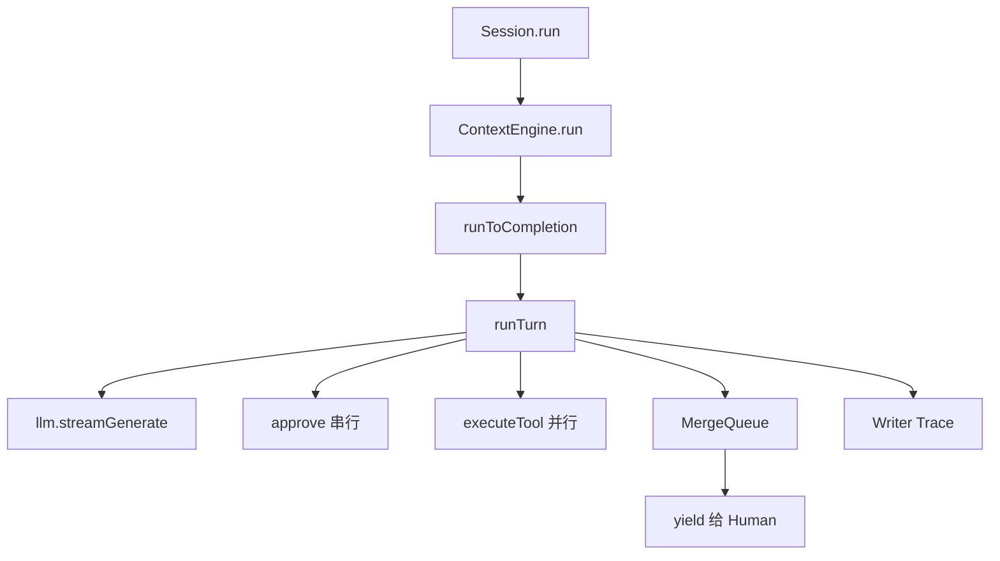

# 附录 A · `ContextEngine` 源码走读

> 文件：`packages/core/src/engine/context-engine.ts`  
> **阅读顺序第 9 步（可选）**｜先读 [PART1](../ARCHITECTURE_PART1.md)  
> 读法：白话 → 代码 → 注释 → 本节小结；文末 **本章总结**。  
> 官方对照：`packages/docs/content/agent-loop.zh.md`。

### 本章你会搞懂什么

1. 一次 Task 如何多轮跑完（总体流程图）
2. `MergeQueue` 如何把「一流 + 多工具流」合成一条 yield
3. 一轮里审批串行、工具并行、回填保序如何同时成立
4. steer / 中断补发 / 重连与调试入口

---

## 0. 类在系统中的位置

### 白话

`ContextEngine` 是 ReAct 司机。`Session` 在首次 `ensureReady` 成功后才 `new` 它；之后每次普通 Task 的 `run` 都进这里。它只认 OmniMessage，同步写 Trace，只通过 `LLMInterface` 与 `EnvironmentInterface` 碰外部世界。

应用代码应依赖 `Session` / `createAgent`，不要业务里直接 new 引擎——除非你在改 core 本身。



### 本节小结

引擎 = 编排；Session = 产品门面；Trace = 真源。三者职责不要搅在一起改。

---

## 1. `run`：Task 边界与 steer 窗口

### 白话

`run` 的入参 `newMessages` 是**本次新增 Prompt**，不是全量历史——历史由有状态的 `GenerativeModel` 维护。方法把 `taskRunning` 设为 true，驱动 `runToCompletion`，在 `finally` 里关掉窗口并清空 `steeringQueue`。因此：steer 只在 Task 活着时有效；abort/失败退出同样清队列。

### 代码

```455:472:packages/core/src/engine/context-engine.ts
  /**
   * Runs a Task to completion, streaming out OmniMessage. `newMessages` is this call's
   * Prompt (only the newly added input, not the full history — history is maintained by the
   * stateful GenerativeModel); `opts.signal` is the abort signal, `opts.approve` is the
   * per-tool approval callback.
   * Docs: /docs/agent-loop § "The loop at a glance".
   */
  async *run(newMessages: OmniMessage[], opts?: RunOptions): AsyncGenerator<OmniMessage> {
    // Steering window: only while this generator is being driven. The finally also covers
    // abort/failure exits — anything still queued is discarded (see steeringQueue).
    this.taskRunning = true;
    try {
      yield* this.runToCompletion(newMessages, opts);
    } finally {
      this.taskRunning = false;
      this.steeringQueue = [];
    }
  }
```

### 注释

| 片段 | 意思 |
|------|------|
| `taskRunning = true` | 打开 `steer` 受理窗口 |
| `runToCompletion` | 多轮循环：含重连、压缩触发、steer 投递等 |
| `finally` 清队列 | Task 结束未投递的插话丢弃；避免「幽灵插话」进下次无关 Task |

### 本节小结

宿主若在 `run` 已返回后还 `steer`，会得到 `false`——应改发新的 `run`。

---

## 2. `steer`：运行中插话（不是 Inbox）

### 白话

Task 运行期间，宿主可 `session.steer(input)` 排队用户消息而不打断当前循环。`input` 形状与 Prompt 相同。引擎在**下一次输入组装**时把它变成独立的 `[user_steering]…[/user_steering]` 用户消息：与该轮工具输出一起进下一 Request；若该轮无工具调用，则单独作为继续输入（Task **不会**因此结束）。

插话是真实用户输入：写入 Trace、推到输出流；恢复重放时按普通轮次输入处理。空输入（无文本无图）返回 true 但不入队——避免空标记块进模型。无 Task 时返回 false。

与 DeepSeek Harness 的 Inbox 不同：这里没有「两桶策略」，只有「当前 Task 的插话队列」，且在每次输入组装时排空（含压缩完成后的那次）。

### 代码

```474:494:packages/core/src/engine/context-engine.ts
  /**
   * Queues a steering message for the running Task: it is delivered with the next request
   * input as a standalone `[user_steering]` user message — alongside that turn's tool
   * outputs, or alone as the continuation input when the turn produced no tool calls.
   * ...
   */
  steer(input: OmniMessage[]): boolean {
    if (!this.taskRunning) return false;
    if (!input.some(carriesSteering)) return true;
    this.steeringQueue.push(input);
    return true;
  }
```

### 注释

| 返回值 | 宿主该怎么做 |
|--------|----------------|
| `false` | 没有跑着的 Task → 用普通 `run` 发新任务 |
| `true` 且入队 | 等当前轮边界投递 |
| `true` 但空输入 | 什么也不排；不要当成失败 |

### 本节小结

steer 绑定 Task 生命周期；没有 Inbox 两桶。移植旧 harness 功能时不要假设「先囤着、由别的插件策略消费」。

---

## 3. `MergeQueue`：多生产者单消费者

### 白话

一轮里同时有：驱动协程（消费 LLM 流 + 串行审批 + 派发工具）、以及若干 `executeOne` 工具流。它们都要往「给 Human 的那条异步生成器」里塞消息，但不能自己抢着 yield。

`MergeQueue` 就是进程内的小合流器：生产者 `addProducer` / `push` / `removeProducer`；消费者循环 `next()`，队列空但仍有生产者时挂起等待，生产者归零且队列空时返回 `null` 结束。

这解释了为何 UI 看到的工具输出是**完成序**，而下一轮喂模型可以另做**原始调用序**重排——合流只保证「事件不丢、不撕裂」，不负责模型侧配对顺序。

### 代码

```281:320:packages/core/src/engine/context-engine.ts
class MergeQueue {
  private items: OmniMessage[] = [];
  private producers = 0;
  private wake: (() => void) | null = null;

  /** Registers a producer. */
  addProducer(): void {
    this.producers += 1;
  }

  /** Deregisters a producer (its stream has finished). */
  removeProducer(): void {
    this.producers -= 1;
    this.signal();
  }

  /** Pushes a message and wakes the consumer. */
  push(msg: OmniMessage): void {
    this.items.push(msg);
    this.signal();
  }
  // ...
  /** Takes the next message; waits if empty but producers remain; returns null if empty and no producers remain. */
  async next(): Promise<OmniMessage | null> {
    for (;;) {
      if (this.items.length > 0) return this.items.shift()!;
      if (this.producers === 0) return null;
      await new Promise<void>((resolve) => {
        this.wake = resolve;
      });
    }
  }
}
```

### 注释

| API | 作用 |
|-----|------|
| `addProducer` | 登记一个尚未结束的源（驱动或某个工具） |
| `push` | 入队并唤醒消费者 |
| `removeProducer` | 源结束；可能让 `next` 发现「可以收工」 |
| `next === null` | 全部源结束且队列排空 → `runTurn` 停止 yield |

### 本节小结

读 `runTurn` 时先在心里画：`drive` 一个生产者 + 每个 allow 的工具一个生产者 → 单一 `for(;;)` 消费者对外 yield。

---

## 4. `runTurn`：一轮 Request 的完整生命周期

### 白话（对齐官方 agent-loop）

官方把一轮拆成六步，这里用源码语言复述：

1. 产出并 `write` `request_begin`——回放用这对边界判断请求是否发出。
2. `llm.streamGenerate({ newMessages: input })` 流式返回 partial 与完整消息；每条完整消息（及事件）`push` + `write`。
3. 每个 **complete 且 `stop_reason === "completed"`** 的 `tool_call`：记入 `callOrder`，立刻 `await approve`（串行）。抛错收敛为 deny。
4. deny → 合成 aborted 的 `tool_call_output`（文案 `Tool call denied by user.`）；allow → `queue.addProducer()` + 并发 `executeOne`，**不**等待它完成再继续读 LLM 流。
5. LLM 流结束：取生成器 **return value** `LLMOutcome`，产出 `request_end`（可带 `attempt` / `retry_in_ms`）——**不等待工具**。仍在跑的工具输出可出现在 `request_end` 之后。
6. 消费者排空 MergeQueue 后，按 `callOrder` 重排 `toolOutputs`，作为 `TurnResult` 返回给上层去组下一轮输入。无 tool_call 则 Task 可结束。

中断补发（carry-over）、自动重连（`failed`/`timeout`/`malformed`，默认最多 5 次指数退避）、压缩触发，在 `runToCompletion` 一层编排；`runTurn` 专注「单次 LLM Request + 本轮工具」。

### 代码：开场与开流

```953:999:packages/core/src/engine/context-engine.ts
  /**
   * Runs one LLM turn: consumes the LLM stream, approving each complete tool_call immediately;
   * "allow" runs it concurrently (without blocking further stream consumption/approval), "deny"
   * feeds back an aborted output. partial/complete tool_call_output is yielded in completion
   * order. Returns all of this turn's tool outputs (for the next turn) and whether it was
   * interrupted midway.
   * Docs: /docs/agent-loop § "Lifecycle of a turn".
   */
  private async *runTurn(
    input: OmniMessage[],
    approve: ApproveFn,
    signal?: AbortSignal,
    thinkingLevel?: ThinkingLevelName,
    reconnectsSoFar = 0,
  ): AsyncGenerator<OmniMessage, TurnResult> {
    const queue = new MergeQueue();
    const toolOutputs: OmniMessage[] = [];
    const toolCalls: OmniMessage<ToolCallPayload>[] = [];
    const callOrder: string[] = [];
    // ...
    queue.addProducer();
    const drive = (async () => {
      try {
        const startEvt = requestBegin();
        queue.push(startEvt);
        await this.write(startEvt);
        const gen = this.llm.streamGenerate({
          newMessages: input,
          ...(signal ? { signal } : {}),
          ...(thinkingLevel !== undefined ? { thinkingLevel } : {}),
        });
```

### 代码：审批后并发派发 + 消费者

```1062:1131:packages/core/src/engine/context-engine.ts
            let decision: ApprovalDecision;
            try {
              decision = await approve(tc);
            } catch (err) {
              const message = err instanceof Error ? err.message : String(err);
              process.stderr.write(`[penguin] approve callback threw: ${message}; denying.\n`);
              decision = "deny";
            }
            // ...
            if (decision !== "allow") {
              const denied = toolCallOutput({
                output: "Tool call denied by user.",
                toolCallId,
                stopReason: "aborted",
              });
              queue.push(denied);
              await this.write(denied);
              toolOutputs.push(denied);
              continue;
            }
            // Approved: run concurrently, without blocking further consumption of the LLM
            // stream or approval of the next tool.
            queue.addProducer();
            void this.executeOne(tc, queue, toolOutputs, signal, approve).finally(() => {
              queue.removeProducer();
            });
          }
        }
      } finally {
        queue.removeProducer();
      }
    })();

    for (;;) {
      const msg = await queue.next();
      if (msg === null) break;
      yield msg;
    }
    await drive;

    const byId = new Map<string, OmniMessage>();
    for (const out of toolOutputs) {
      const id = (out.payload as { tool_call_id?: string }).tool_call_id;
      if (id !== undefined) byId.set(id, out);
    }
    const orderedOutputs: OmniMessage[] = [];
    const seen = new Set<string>();
    for (const id of callOrder) {
      if (seen.has(id)) continue;
      seen.add(id);
      const out = byId.get(id);
      if (out) orderedOutputs.push(out);
    }
    return { toolOutputs: orderedOutputs, toolCalls, assistantSegments, outcome };
```

### 注释表

| 机制 | 人话 |
|------|------|
| `request_begin` / `request_end` | 回放判据；end 可带重试元数据 |
| 非 completed 的 tool_call | 中断收尾用，不派发、不入账本 |
| approve 抛错 → deny | 保守；避免半截 tool_use 无配对输出 |
| 完成序 yield | 前端先看到先完成的工具 |
| `orderedOutputs` | 下一轮 LLM 看到原始调用序 |
| `LLMOutcome` | 不抛异常；上层重连读 status |
| `write` 同步 | 看见 ≈ 可回放 |

### 本节小结

**并行跑、保序喂模型**——和「简单 await 每个工具再继续」不同。改这一段时，任何破坏 `tool_call`/`tool_call_output` 配对或 callOrder 的改动都会在 resume 与模型侧立刻炸。

---

## 5. 一次 followup 调用栈（带注释）

```text
session.run(prompt, { approve, signal })
  → foldImages / carryOverInput          // Session：无视觉折图；拼上次中断输入
  → ensureReady                          // 首次：MCP + LLM + new ContextEngine
  → ContextEngine.run
       → taskRunning=true
       → runToCompletion
            → （可选）deliverSteering / 压缩 / 重连循环
            → runTurn
                 → request_begin + Trace
                 → llm.streamGenerate
                 → 完整 tool_call? → approve → executeTool（并发）
                 → request_end（不等工具）
                 → MergeQueue 排空
                 → 按 callOrder 重排 outputs
            → 有 tool 输出? → 下一 runTurn
            → 无 tool_call → Task 结束
       → finally: taskRunning=false; steeringQueue=[]
```

官方总体流程 ASCII 图见 `agent-loop.zh.md`「总体流程」一节；上图是同一故事的「源码函数名」版。

### 本节小结

卡住时用这张栈自上而下问：是 Session bootstrap、是某次 runTurn、还是 Environment 工具没终态？

---

## 6. 中断、重连、压缩（引擎层要点）

### 白话

**中断（`signal`）**：产出 `abort`，构造补发内容给**下一次** `run`。场景 A：模型已提交 tool_call——已完成工具结果结构化补发，未完成者占位，保证配对。场景 B：模型输出未完成——压平为 `[turn_aborted]` 用户文本。补发进模型上下文，**不**假装写进「未发生」的 Trace 历史形态之外的东西；Trace 只记真实发生的消息。

**重连**：除 `auth` 外，LLM 侧 `failed`/`timeout`/`malformed` 在同一次 `run` 内重发，附 `[turn_retried]`；工具不重跑。默认最多 5 次，退避 2s…30s。`request_end` 的 `retry_in_ms` / `attempt` 给 Web 倒计时与 CLI `[重试]` 行。

**压缩**：阈值来自 token / 轮数 / 手动；summarize 或 discard；成功 rotate Trace 并换新 GenerativeModel（工具集保持以保缓存）；失败保留原上下文。细节见 PART2 §6 与官方文档。

### 本节小结

这三块的共性：**错误与控制面事件都收敛成 OmniMessage / Outcome**，而不是让异常穿透 `session.run` 让宿主无法做 carry-over。

---

## 7. 调试速查

| 现象 | 先看 |
|------|------|
| `steer` 总失败 | 是否仍在 `for await (session.run…)` 内（`taskRunning`） |
| 工具结果「顺序怪」 | UI 是完成序；模型下一轮是 `callOrder`——两者本就可不同 |
| 一直重连 | `LLMOutcome`；是否其实是 `auth`（不应重试） |
| Trace 缺边界 | `request_begin/end` 是否 `write`；bootstrap 中断是否走 Session 自写路径 |
| deny 后模型胡来 | 是否收到合成 aborted output；审批模式是否预期 |
| 压缩后历史「没了」 | 是否 rotate 到新 index；resume 是否读了最新分片 |

### 本节小结

大多数「引擎坏了」其实是：看错了顺序语义、或 Trace 分片没读到最新、或审批/中断状态机不符合预期。

---

## 本章总结

1. **`run` 框住 Task 与 steer 窗口**；结束必清队列。  
2. **`MergeQueue` 合流多生产者**；UI 完成序 ≠ 模型回填序。  
3. **`runTurn` = 一流 + 串行审批 + 并行工具 + 边界事件 + Trace 同步**。  
4. **无 Cordis / 无 Inbox**；插话、重连、压缩都是固定引擎语义。  
5. 改代码前用官方 `agent-loop.zh.md` 与本附录对照，避免只改症状路径。

下一篇：[02-environment-tools.md](./02-environment-tools.md)。
