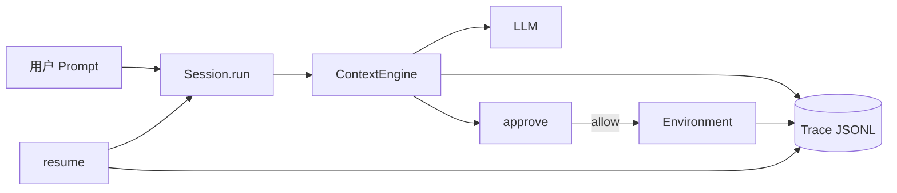

# 附录 C · Agent / Session / Trace 源码走读

> 文件：`packages/core/src/agent.ts`、`session.ts`、`trace/*`  
> **阅读顺序**：01 → 02 → **本篇**  
> 读法：白话 → 代码 → 注释 → 本节小结；文末 **本章总结**。  
> 官方对照：`packages/docs/content/sessions-and-traces.zh.md`。

### 本章你会搞懂什么

1. `createAgent` 装了什么（文件态 vs 运行态）
2. Session 为何懒 bootstrap，三条 API 路径如何咬合
3. Writer 追加规则与 resume 如何把 JSONL 变回可跑会话

---

## 1. 六层运行模型（先建立坐标）

### 白话

官方把运行拆成六层：Project → Agent → Workspace → Session → Task → Request。

| 概念 | 定义 |
|------|------|
| Project | 顶层；持有 `.project_config.toml` 模型与凭据 |
| Agent | 执行主体；恰好一份 `agent_state/`；可服务多 Workspace |
| Workspace | 模型可见的唯一文件范围；显式路径须已存在 |
| Session | 同一（Agent, Workspace）下连续对话；模型锁定 |
| Task | 一次 `run`（无 goal）的目标；由多 Request 组成 |
| Request | 一次 LLM API 调用 |

`createAgent` 管 **Agent 文件态**；`createSession` 定 Workspace/模型并挂 Environment + Writer；`session.run` 开 Task；`ContextEngine.runTurn` 跑 Request。

### 本节小结

搞混「换 Agent」和「换 Session」是常见错：换模型常是新 Session（`/model` handoff），不是改正在跑的 Session 的锁定字段。

---

## 2. `createAgent`：统一创建/加载

### 白话

`createAgent` 是统一入口：目录空则初始化 Agent State，否则按 `agentId` 加载。一个 Agent 一份 State，可多次 `createSession` 跑。Workspace **不**在 createAgent 时定死——在 createSession 时定。

初始化会落到：`system_config.yaml`、`AGENTS.md`、skills 安装列表、vault、路径树等（经 `loadOrInitAgentState`）。系统提示经 `assembleSystemPrompt` + 已装 Skill 元数据装配。子 Agent 深度常量 `MAX_SUBAGENT_DEPTH = 1`。

### 代码

```1:7:packages/core/src/agent.ts
/**
 * Agent and the `createAgent` entry point.
 *
 * `createAgent` is the unified way to create/load an Agent: it initializes Agent State
 * if the directory is empty, otherwise loads by agentId.
 * An Agent has exactly one Agent State and can run multiple times; the
 * Workspace is determined when a Session is created.
 */
```

```71:76:packages/core/src/agent.ts
/**
 * Maximum subagent spawn depth. Currently capped at 1 level (a subagent cannot spawn
 * another subagent); the depth mechanism is designed to support multiple levels —
 * raise this constant to allow deeper nesting.
 */
const MAX_SUBAGENT_DEPTH = 1;
```

```153:157:packages/core/src/agent.ts
export async function createAgent(opts: CreateAgentOptions = {}): Promise<Agent> {
  const state = await loadOrInitAgentState(opts);
  const projectConfig = await loadProjectConfig(state.root, state.projectId);
  return new Agent(state, projectConfig, opts.proxyEnv);
}
```

`createSession` 会先校验模型引用必须是完整 `(provider, model_id)` 对（或两者都省略用 Project 默认），避免半引用把凭据发错厂商——详见 `agent.ts` 中 `createSession` 开头校验逻辑。

### 注释

| 步骤 | 人话 |
|------|------|
| `loadOrInitAgentState` | 空目录脚手架 / 已有则加载 |
| `loadProjectConfig` | 读模型表与默认模型 |
| `new Agent(...)` | 尚无引擎、无 Trace Writer |
| 稍后 `createSession` | 定 workspace、选模型、挂 Environment + Writer、可选 resume |

### 本节小结

Agent = 行为定义（文件）；Session = 一次工作区上的对话运行时。createAgent 便宜；贵的在第一次 run 的 ensureReady。

---

## 3. Session：`run` / `ensureReady` / 旁路 API

### 白话

Session 对外暴露的核心能力：

| API | 人话 |
|-----|------|
| `run` | Goal 或 Task；流式 OmniMessage |
| `ensureReady`（私有） | 首次连 MCP、建 LLM、new ContextEngine |
| `steer` | 转给引擎；无引擎则 false |
| `compact` | 转给引擎压缩 |
| `runGoal` | 外环多 Task |
| `generateTitle` | 旁路一次性 LLM，不入历史/Trace |

PART1 已引用 `run` / `runTask` / `ensureReady` 头部。这里强调纪律：

- 图片折叠发生在写 Trace / 标题素材之前（无视觉模型）。
- bootstrap 事件 **live yield**，但 Trace 写入可 defer 到引擎，使顺序落在「用户输入之后」。
- bootstrap 中止：`ensureReady` 返回 false；Session 自写 Trace；`carryOverInput` 留给下次。

### 代码（复习 run 入口）

```296:320:packages/core/src/session.ts
  async *run(newMessages: OmniMessage[], opts?: SessionRunOptions): AsyncGenerator<OmniMessage> {
    if (opts?.goal) {
      const { goal, ...roundOpts } = opts;
      yield* this.runGoal(newMessages, goal, roundOpts);
      return;
    }
    yield* this.runTask(newMessages, opts);
  }

  private async *runTask(
    newMessages: OmniMessage[],
    opts?: RunOptions,
  ): AsyncGenerator<OmniMessage> {
    if (!this.modelHasVision) newMessages = await this.foldImages(newMessages);
    if (this.carryOverInput.length > 0) {
      newMessages = [...this.carryOverInput, ...newMessages];
      this.carryOverInput = [];
    }
    const ready = yield* this.ensureReady(opts?.signal);
```

```398:400:packages/core/src/session.ts
  private async *ensureReady(signal?: AbortSignal): AsyncGenerator<OmniMessage, boolean> {
    await this.ensureMetaWritten();
    if (this.engine) return true;
```

### 注释

| 现象 | 解释 |
|------|------|
| 创建 Session 很快 | 引擎尚未构建 |
| 第一次发消息慢 | MCP connect + 工具发现 |
| 取消连 MCP | 返回 false；输入进 carryOver；分析页仍可见中断 |
| Goal | 外环；内环仍 `runTask` → 引擎 |

### 本节小结

贵操作推迟到第一次 run，并用事件让 UI 看见等待——这是产品体验，不是实现疏忽。

---

## 4. Trace Writer：追加规则

### 白话（对齐 sessions-and-traces）

Trace 是 append-only JSONL，每行一个 OmniMessage 信封。

**写入：**

- 记：`session_meta`、完整 `model_msg`、全部 `event_msg`
- 不记：流式 `partial_*`（完整消息会补写）；带 `origin` 的子会话正文（父 Trace 只留 `subagent` 指针）
- `request_begin` / `request_end` 成对；回放以 `request_end.status === "completed"` 为该轮已提交判据
- 追加在 Writer 内串行；单次 `write(2)` 整行落下（不用会拆大包的 `appendFile`）
- 恢复续写前探测残行：若末尾无换行，先补换行再写，避免粘连
- 压缩成功可 `rotate` 到 `_002`…；一文件 = 一完整模型上下文

路径：`<tracesDir>/<yyyy-mm-dd>/<sessionId>_<index3>.jsonl`。

### 代码

```1:17:packages/core/src/trace/writer.ts
/**
 * Trace writer — append-only JSON Lines.
 *
 * Docs: packages/docs/content/sessions-and-traces.{zh,en}.md (site path
 * /docs/sessions-and-traces) documents the file layout and recording rules.
 *
 * Design points:
 *   - Every observable action is appended to Trace; historical events are never modified in place
 *     (append-only).
 *   - One Trace file corresponds to one complete model context; when the context is compacted
 *     and a new segment is produced, `rotate()` starts a new, separately numbered file.
 *   - Only "recordable" messages are written: `session_meta`, complete `model_msg`, and all
 *     `event_msg`; streaming `partial_*` messages are skipped (the producer appends the
 *     corresponding complete message once the segment ends); nested child-session messages are
 *     never written (their spawn location is recorded via the `subagent` pointer event written by
 *     context_engine).
 *   - Path convention: `<tracesDir>/<yyyy-mm-dd>/<sessionId>_<index3>.jsonl`.
 */
```

```151:175:packages/core/src/trace/writer.ts
  /**
   * Appends one message. Only written if it's a recordable message; streaming `partial_*` is
   * skipped. The first write to the current file `mkdir -p`s the date directory and probes a
   * pre-existing file for a crash-torn tail (see `probeTornTail`).
   *
   * The append is serialized on the instance chain, so the record lands as one uninterrupted
   * JSONL line even when other writes (or a rotation) are submitted concurrently; ...
   */
  async write(msg: OmniMessage): Promise<void> {
    if (!isRecordable(msg)) return;
    return this.enqueue(async () => {
      const path = this.currentPath();
      if (this.preparedIndex !== this.index) {
        await mkdir(dirname(path), { recursive: true });
        this.tornTail = await this.probeTornTail(path);
        this.preparedIndex = this.index;
      }
      const record = `${JSON.stringify(msg)}\n`;
      await this.appendRecord(path, this.tornTail ? `\n${record}` : record);
      this.tornTail = false;
    });
  }
```

### 注释

| 规则 | 人话 |
|------|------|
| append-only | 审计可信；不能改历史 |
| 跳过 partial_* | 文件小；回放仍完整 |
| 串行 enqueue | 并发生产者也不撕行 |
| tornTail heal | 崩溃残行不吞后续记录 |
| rotate | 新上下文新分片；resume 读最大 index |
| fidelity 原样 | 跨请求回放保兼容；故存信封不存派生格式 |

工具超长输出：Trace 与模型同窗（头 + 提示 + recovery 路径），不重复存归档正文。

### 本节小结

「看见 ≈ 可回放」靠引擎 `write` 与 Writer 串行追加共同保证。丢 JSONL = 丢可恢复会话。

---

## 5. `resume`：从文件回到可跑状态

### 白话

Trace 是恢复的**唯一**事实来源。`resumeTrace` / `resumeSession` 大致：

1. 定位该 Session **索引最大**的 Trace 文件；
2. 从文件内 `session_meta` 读运行配置（模型、系统提示、Workspace）——三者 Session 内不可变；
3. 将已提交历史回放进全新 LLM 上下文；
4. 重建 carry-over、轮数、Token 计数；
5. 继续追加同一文件。

保证结构合法：只回放已提交轮次；`tool_call` 与 output 配对；未完成 thinking/文本允许丢。坏行跳过并诊断。若最新文件以**完成的压缩**收尾，上下文已关闭——从空上下文恢复，summarize 模式会重建 `[context_summary]` 前置到下一轮输入。

前提：Workspace 与模型仍然存在。实现见 `packages/core/src/trace/resume.ts`；容错读 `readTraceTolerant`。

### 本节小结

resume 不是「读 SQLite 会话表」。迁移/备份务必带上 traces；压缩分片要带全 index。

---

## 6. 三条路径咬合

### 白话

把产品日常流量收成三条路径，便于排查：

```text
① 用户话
   Human → session.run → ensureReady? → ContextEngine.run
        → 流式 OmniMessage → CLI/SSE
        → Writer.append（完整消息/事件）

② 工具
   完整 tool_call → approve
        → allow: Environment.executeTool → tool_call_output（完成序 yield）
        → 全部终态后按 callOrder 回填 → 下一 Request
        → deny: 引擎合成 aborted output
        → 全程 approval_decision + output 进 Trace

③ 恢复
   选最新 Trace 分片 → resumeTrace
        → 重建 GenerativeModel 上下文 + Session 计数器
        → 继续 run / 追加同一 JSONL
```



### 本节小结

三条路径共享 OmniMessage 与 Trace；不存在「UI 一条历史、引擎另一条历史」。

---

## 7. 调试速查

| 问题 | 查 |
|------|-----|
| 第一次 run 很慢 | MCP `mcp_connect_*`；bootstrap 是否反复 abort |
| 恢复丢消息 | 是否读了最大 index；残行/坏行；压缩后是否应从 summary 起 |
| 子 Agent「父 Trace 里没有正文」 | 预期：只有指针；正文在子 Session Trace |
| Goal 不停 | GOAL 文件状态 / 预算；不是 runTurn 死循环必然 |
| `/model` 后历史没了 | 预期：新 Session 不注入旧历史；按 `[model_switch_from]` 路径自读 |
| 标题不对 | `generateTitle` 旁路；标题素材冻结时机在首个含用户文本的 Task |

### 本节小结

先分清「文件态 / 运行态 / 索引库」，再决定打开哪个目录或哪个函数。

---

## 本章总结

1. **`createAgent` 管文件态**；`createSession` 定 Workspace 与模型；引擎在首次 `ensureReady` 才出现。  
2. **Session API** 把 Goal、steer、compact、标题旁路拢在门面；ReAct 细节在 ContextEngine。  
3. **Writer**：append-only、跳过 partial_*、串行单次 write、可 rotate；**resume 只信 JSONL**。  
4. **三条路径**（用户话 / 工具 / 恢复）咬合在同一信封与同一 Trace 真源上。  

返回：[source/README.md](./README.md)｜机制总览：[ARCHITECTURE_PART1.md](../ARCHITECTURE_PART1.md)。
