# Pi Agent 架构设计文档

> **文档版本**：覆盖 `pi` monorepo 全包结构 + 源码级深潜  
> **阅读方式**：先读 **Part I（高层设计）** 建立全局地图，再读 **Part II（源码深潜）** 对照实现  
> **专题**：[EXTENSIONS.md](./EXTENSIONS.md)（Part I 基础 · Part II 多 Agent/Plan）· [SKILLS_LIFECYCLE.md](./SKILLS_LIFECYCLE.md) · [RUNTIME_PROMPT.md](./RUNTIME_PROMPT.md)  
> **图解导读（推荐先读）**：[DESIGN_THINKING_SERIES.md](./DESIGN_THINKING_SERIES.md) · [JSONL_TREE_GUIDE.md](./JSONL_TREE_GUIDE.md) · [docs 索引](./README.md)  
> **最后更新**：2026-08-04（Part I/II 去重与交叉引用）

---

## 文档结构

| 部分 | 受众 | 内容 |
|------|------|------|
| **Part I** | 架构师、新贡献者、SDK 集成方 | 产品定位、包依赖、模块全景、核心流程、数据模型（图表与时序的**唯一权威来源**） |
| **Part II** | 需要改具体函数的开发者 | 类型、循环、投影、压缩、扩展——带 `file:line`；重复图表已删，通过交叉引用指向 Part I |

---

## Part I 目录

- [I.0 总体框架（一页纸）](#i0-总体框架一页纸)
- [I.1 产品定位与设计哲学](#i1-产品定位与设计哲学)
- [I.2 包依赖与边界](#i2-包依赖与边界)
- [I.3 核心实体：设计与协作关系](#i3-核心实体设计与协作关系)
- [I.4 子系统协作图](#i4-子系统协作图)
- [I.5 关键时序图](#i5-关键时序图)
- [I.6 双状态源与同步规则](#i6-双状态源与同步规则)
- [I.7 会话与消息数据模型](#i7-会话与消息数据模型)
- [I.8 模块索引（全项目）](#i8-模块索引全项目)
- [I.9 扩展面与运行模式](#i9-扩展面与运行模式)
- [I.10 依赖规则与演进](#i10-依赖规则与演进)

## Part II 目录（源码深潜）

1. [总体架构：两层设计哲学](#1-总体架构两层设计哲学)
2. [消息投影（Message Projection）详解](#2-消息投影message-projection详解)
3. [完整 JSONL 会话文件示例](#3-完整-jsonl-会话文件示例)
4. [模块一：`agent/types.ts` — 基础类型系统](#4-模块一agenttypests--基础类型系统)
5. [模块二：`agent/agent-loop.ts` — 无状态双层循环](#5-模块二agentagent-loopts--无状态双层循环)
6. [模块三：`agent/agent.ts` — 有状态代理封装](#6-模块三agentagentts--有状态代理封装)
7. [模块四：`agent/harness/` — 会话桥接层](#7-模块四agentharness--会话桥接层)
8. [模块五：`coding-agent/session-manager.ts` — 会话持久化](#8-模块五coding-agentsession-managerts--会话持久化)
9. [模块六：`coding-agent/compaction/` — 上下文压缩系统](#9-模块六coding-agentcompaction--上下文压缩系统)
10. [模块七：`coding-agent/agent-session.ts` — 核心编排器](#10-模块七coding-agentagent-sessionts--核心编排器)
11. [模块八：`coding-agent/messages.ts` — 消息转换管道](#11-模块八coding-agentmessagests--消息转换管道)
12. [端到端数据流：从用户输入到 LLM 响应持久化](#12-端到端数据流从用户输入到-llm-响应持久化)
13. [存储后端：SQLite 行编码](#13-存储后端sqlite-行编码)
14. [扩展系统（Extension System）详解](#14-扩展系统extension-system-详解)
15. [系统提示词构建](#15-系统提示词构建)
16. [工具系统](#16-工具系统)
17. [pi-ai 通信层](#17-pi-ai-通信层)
18. [运行模式（Modes）](#18-运行模式modes)
19. [设计模式总结](#19-设计模式总结)

---

# Part I · 高层架构

## I.0 总体框架（一页纸）

Pi 的运行时可以概括为：**一种呈现方式（TUI/RPC/Print/SDK）+ 一个编排器（AgentSession）+ 一棵只追加的会话树（SessionManager）+ 一个无状态工具循环（runLoop）+ 一个多 Provider 通信层（pi-ai）**。

### I.0.1 逻辑分层与包映射

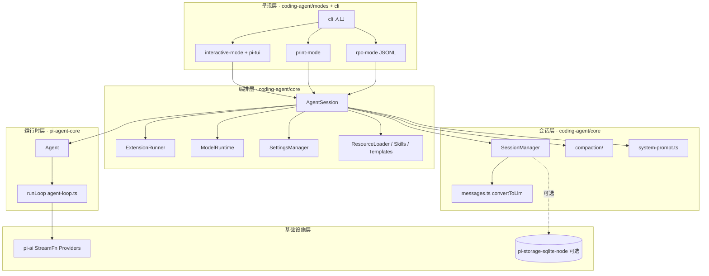

### I.0.2 运行时对象图（一次 `prompt()` 期间谁存在）

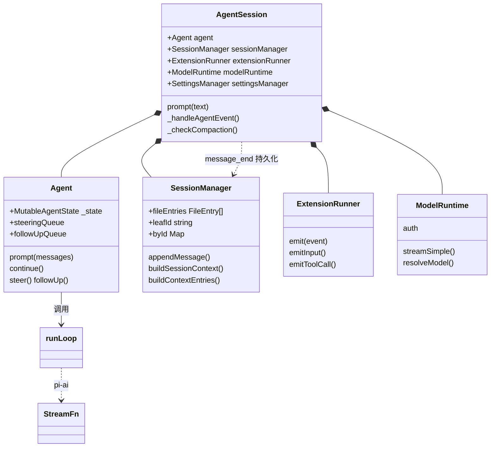

**读图要点**：

- **AgentSession** 是 Pi 产品里唯一「把会话、扩展、模型、Agent 绑在一起」的 Facade。  
- **Agent** 只关心「当前回合内存里的 messages + 循环」；**不直接读 JSONL 文件**。  
- **SessionManager** 是磁盘真相来源；`buildSessionContext()` 在每次需要完整历史时从树投影。  
- **coding-agent 默认不用 `AgentHarness`**：由 `AgentSession` 自己订阅 `Agent` 事件并写 `SessionManager`（与 agent 包里的 Harness 路径平行，语义对齐）。

### I.0.3 三条主数据通路

| 通路 | 方向 | 载荷 | 负责模块 |
|------|------|------|----------|
| **用户 IO** | 人 → Mode → AgentSession | 文本、图片、斜杠命令 | `modes/*`, `slash-commands` |
| **推理环** | Agent → runLoop → pi-ai | `AgentContext` → `Message[]` → 流式 Assistant | `agent-loop`, `ModelRuntime` |
| **持久化环** | AgentEvent → SessionManager | `SessionEntry` 追加 JSONL | `agent-session`, `session-manager` |

---

## I.1 产品定位与设计哲学

### 是什么

**Pi** 是一个 **可自扩展的终端 Coding Agent Harness**（[pi.dev](https://pi.dev)）：

- 默认给模型 `read` / `write` / `edit` / `bash` 等工具，在真实仓库里完成编码任务  
- 通过 **Extensions、Skills、Prompt Templates、Themes、Pi Packages** 扩展，而无需 fork 内核  
- 刻意 **不内置** sub-agent、plan mode 等「全家桶」——由扩展或第三方 Pi Package 提供  

### 设计哲学（RFC / README 对齐）

| 原则 | 含义 |
|------|------|
| **Minimal core** | 内核只做循环、会话、工具、Provider；高级能力外置 |
| **Adapt pi, don't fork** | 扩展系统是一等公民，行为用 TS 模块挂钩 |
| **Append-only session** | 会话是只追加的树；分支 = 移动 leaf，不删历史 |
| **Stateless loop** | `runLoop()` 无跨调用状态；状态在 `Agent` + `SessionManager` |
| **Provider-agnostic core** | `pi-agent-core` 不依赖具体 LLM；`pi-ai` 可单独使用 |
| **No built-in sandbox** | 权限 = 启动用户权限；隔离靠 Docker / Gondolin / OpenShell |

### 与同类产品的边界

| | Pi | 典型 IDE Agent | OpenHuman 类 |
|--|-----|----------------|--------------|
| 交付形态 | 终端 CLI + SDK + RPC | IDE 插件 | 桌面超级助手 |
| 扩展 | Extension 事件 + 工具注册 | 有限 | 内置编排/记忆树 |
| 会话 | JSONL 树 + 可选 SQLite | 各异 | SQLite + Wiki |
| 目标用户 | 开发者、可嵌入 SDK 的集成方 | IDE 用户 | 个人知识工作者 |

---

## I.2 包依赖与边界

### I.2.1 包依赖图（编译期）

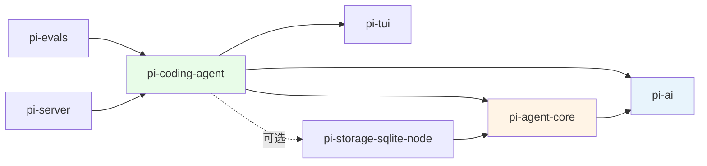

| 包 | 对外主要导出 | 禁止依赖 |
|----|--------------|----------|
| **pi-ai** | `Model`, `Message`, `StreamFn`, `streamSimple`, Providers | agent、coding-agent |
| **pi-agent-core** | `Agent`, `runLoop`, types, harness（SDK 嵌入用） | coding-agent |
| **pi-coding-agent** | `createAgentSession`, `AgentSession`, CLI `pi` | — |
| **pi-tui** | `TUI`, 组件 | agent（保持 UI 独立） |
| **pi-storage-sqlite-node** | SQLite `SessionStorage` 实现 | coding-agent |

### I.2.2 运行时依赖（谁调用谁）

```text
modes/interactive|print|rpc
    └── AgentSession.prompt()
            ├── ExtensionRunner.emit*()     [扩展，可短路]
            ├── Agent.prompt() / continue()
            │       └── runLoop()
            │               ├── transformContext (扩展 context 事件)
            │               ├── convertToLlm (coding-agent/messages)
            │               ├── ModelRuntime.streamSimple → pi-ai
            │               └── ToolDefinition.execute (core/tools)
            ├── SessionManager.append*()    [message_end 等]
            └── compact() / _checkCompaction [会话层]
```

### I.2.3 双实现对照（易混淆）

| 能力 | coding-agent（Pi CLI） | pi-agent-core/harness（通用嵌入） |
|------|------------------------|-----------------------------------|
| 会话存储 | `SessionManager` + JSONL | `Session` + `JsonlSessionStorage` |
| 消息投影 | `session-manager.ts:sessionEntryToContextMessages` | `harness/session/session.ts` 同名函数 |
| 转 LLM | `core/messages.ts:convertToLlm` | `harness/messages.ts:convertToLlm` |
| 编排入口 | **`AgentSession`** | **`AgentHarness`**（可选） |
| 压缩 | `core/compaction/` + AgentSession 触发 | `harness/compaction/` |

**原则**：语义一致、代码独立；改 Pi 产品行为优先改 `coding-agent`，改通用循环改 `agent`。

---

## I.3 核心实体：设计与协作关系

### I.3.1 实体总表

| 实体 | 所在包/文件 | 生命周期 | 职责（一句话） | 持久化 |
|------|-------------|----------|----------------|--------|
| **`AgentSession`** | coding-agent `agent-session.ts` | 进程/会话级 | 产品编排 Facade：prompt、扩展、压缩、模型、事件落盘 | 否（持有 SM） |
| **`Agent`** | agent `agent.ts` | 同 AgentSession | 有状态运行时：messages、队列、订阅 runLoop | 内存 |
| **`runLoop`** | agent `agent-loop.ts` | 单次 `prompt()` 调用 | 无状态双层循环：LLM ↔ 工具 ↔ steering/followUp | 无 |
| **`SessionManager`** | coding-agent `session-manager.ts` | 同会话文件 | JSONL 树：append、branch、buildSessionContext | **JSONL 文件** |
| **`SessionEntry`** | session-manager types | 永久 append | 树节点：message / compaction / leaf… | 每行 JSON |
| **`AgentMessage`** | agent `types.ts` | 内存 + 投影 | 运行时消息联合类型（含 custom） | 经 entry 间接 |
| **`Message`** | pi-ai | 单次 LLM 请求 | Provider API 格式（user/assistant/toolResult） | 否 |
| **`ExtensionRunner`** | coding-agent `extensions/runner.ts` | AgentSession 级 | 扩展事件总线、命令、工具注册 | 扩展配置在磁盘 |
| **`ModelRuntime`** | coding-agent `model-runtime.ts` | AgentSession 级 | 模型解析、auth、streamSimple 封装 | auth.json |
| **`SettingsManager`** | coding-agent `settings-manager.ts` | 全局/项目 | settings.json：模型、压缩、工具集 | settings 文件 |
| **`ToolDefinition`** | extensions/types | 注册后常驻 | 工具 schema + execute + UI render | 否 |
| **`CompactionEntry`** | SessionEntry 子类型 | 永久 | 压缩边界 + summary + firstKeptEntryId | JSONL |
| **`StreamFn`** | agent types / pi-ai | 注入 | 统一流式 LLM 调用签名 | 否 |

### I.3.2 会话树实体（存储层 ER）

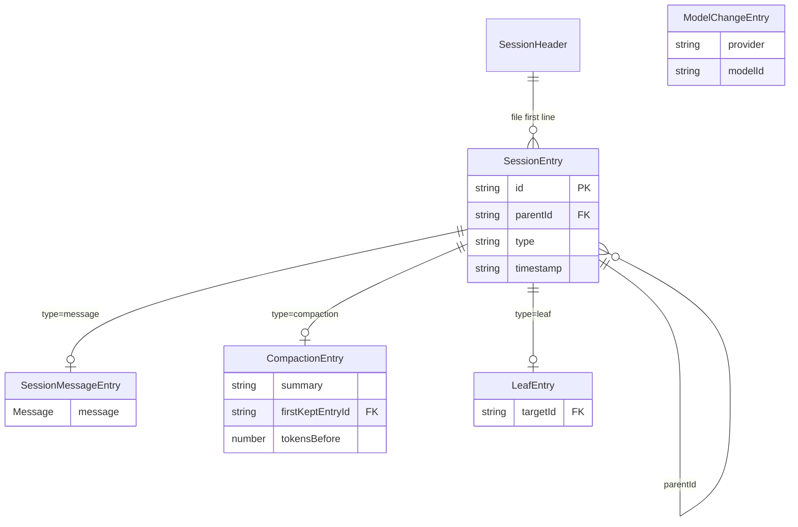

- **`leafId`**：当前活动分支末端，不删旧节点，只移动指针。  
- **`firstKeptEntryId`**：压缩后保留历史的起点，与 `buildContextEntries` 配合截断上下文。

### I.3.3 推理环实体协作

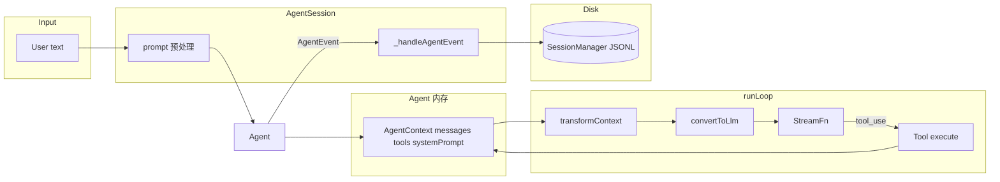

### I.3.4 `AgentContext` vs `AgentSession` 配置

| 字段 | 存在位置 | 何时刷新 | 来源 |
|------|----------|----------|------|
| `systemPrompt` | `Agent._state` | turn 开始 / `prepareNextTurn` | `buildSystemPrompt` + 扩展覆盖 |
| `messages` | `Agent._state` | 每 `message_end` 追加；压缩时整体替换 | 本轮 prompt + runLoop 产出 |
| `tools` | `Agent._state` | 工具集变更时 | `_toolRegistry` + 扩展工具 |
| `model` | `Agent._state` | `/model`、设置 | `ModelRuntime` |
| `thinkingLevel` | `Agent._state` | 用户切换 | `SettingsManager` |
| 历史全貌（含压缩前） | **仅 SessionManager** | append-only | JSONL 全树 |

---

## I.4 子系统协作图

### I.4.1 子系统划分

| 子系统 | 核心类 | 输入 | 输出 |
|--------|--------|------|------|
| **S1 呈现** | InteractiveMode, RpcMode | 键盘/stdio | `AgentSession.prompt()` |
| **S2 编排** | AgentSession | 用户文本 | AgentEvent 流 + settled |
| **S3 循环** | Agent + runLoop | AgentContext | 新 messages、tool 结果 |
| **S4 会话** | SessionManager | SessionEntry | AgentMessage[] 上下文 |
| **S5 模型** | ModelRuntime + pi-ai | Message[] + tools | AssistantMessage 流 |
| **S6 扩展** | ExtensionRunner | ExtensionEvent | 改写/取消/新工具 |
| **S7 压缩** | compaction + AgentSession | SessionEntry[] | CompactionEntry |

### I.4.2 子系统协作（组件级）

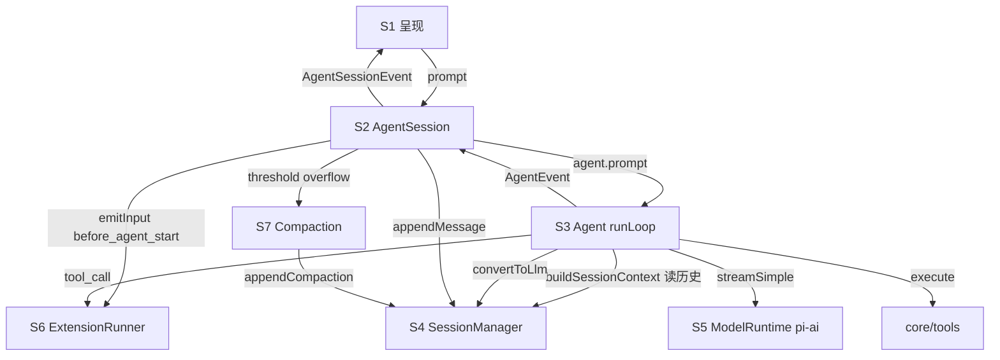

---

## I.5 关键时序图

### I.5.1 冷启动（Interactive 模式）

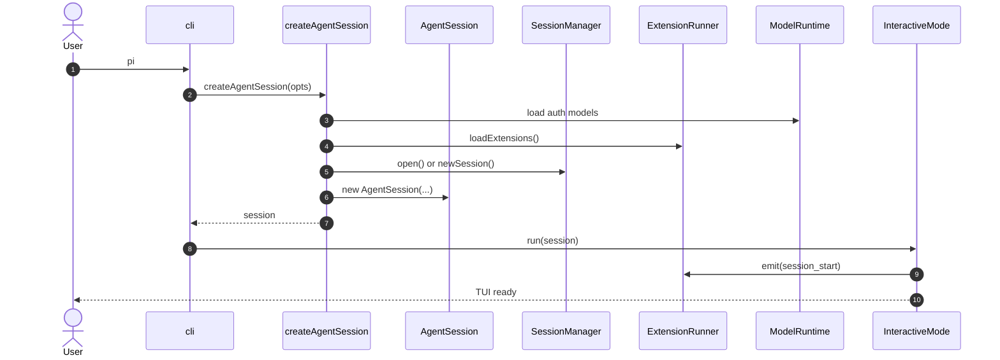

### I.5.2 用户一轮对话（含工具）

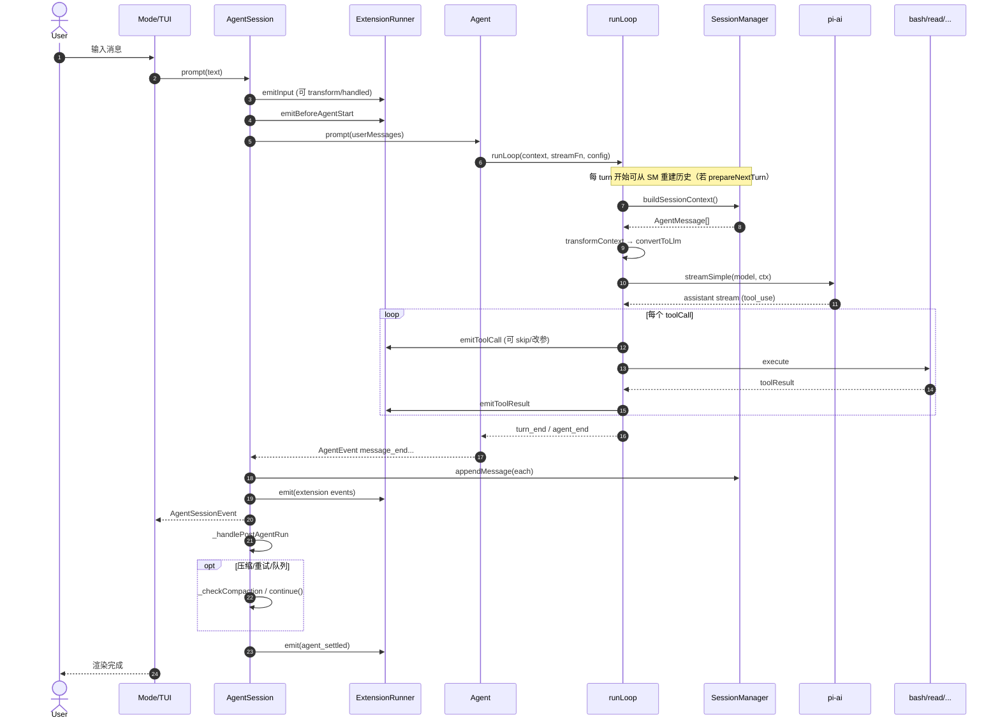

### I.5.3 runLoop 内层循环（Steering）

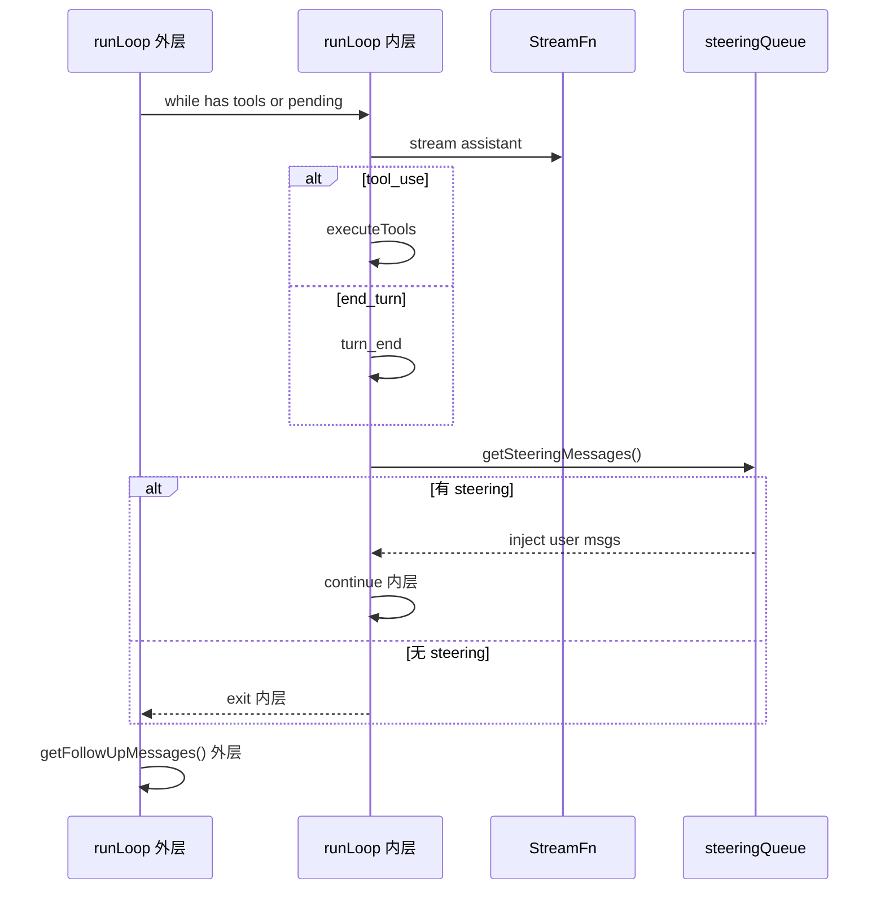

### I.5.4 自动压缩（threshold）

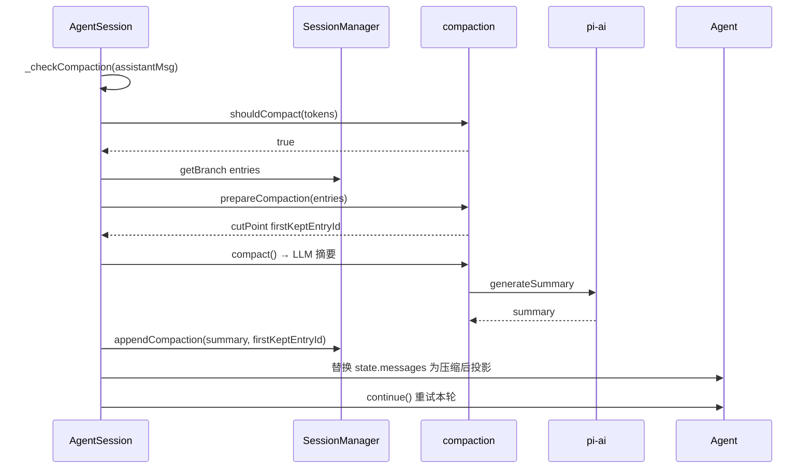

### I.5.5 扩展拦截工具

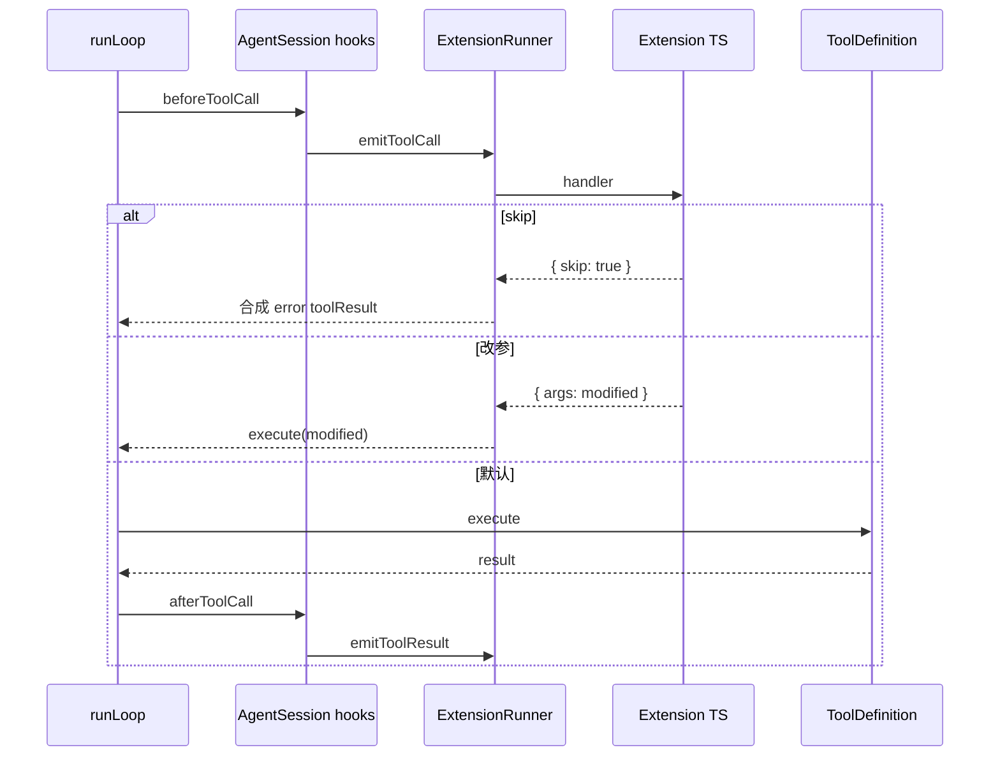

---

## I.6 双状态源与同步规则

Pi 同时存在 **两份「消息」相关状态**，这是读代码时最容易晕的地方。

| 状态 | 位置 | 内容 | 权威级 |
|------|------|------|--------|
| **A. 磁盘树** | `SessionManager.fileEntries` | 全历史 entry（含压缩前消息） | **持久化真相** |
| **B. 内存循环** | `Agent._state.messages` | 当前 LLM 看到的线性 AgentMessage[] | **推理真相** |

### 同步规则

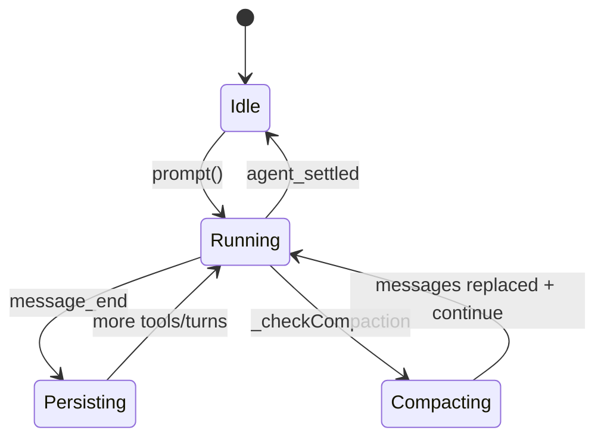

1. **`message_end`**：`Agent` 先 push 到 `_state.messages`，`AgentSession._handleAgentEvent` 再 `SessionManager.appendMessage()`。  
2. **压缩后**：`appendCompaction` 写磁盘；`Agent.state.messages` 被替换为 `buildSessionContext()` 新投影（旧消息仍在 JSONL，只是不进上下文）。  
3. **分支**：`leafId` 改变后，下次 `buildSessionContext` 走新路径；内存 messages 通常随新 prompt 重建或切换会话时重载。  
4. **扩展 `context` 事件**：只改**本轮**送给 LLM 的副本，不回写 JSONL（除非 `message_end` 返回替换消息）。

---

## I.7 会话与消息数据模型

### 存储形态

- **默认**：每会话一个 **JSONL 文件**（append-only，一行一个 entry）  
- **可选**：**SQLite**（`pi-storage-sqlite-node`），同一套 `SessionTreeEntry` 语义  
- **树结构**：`id` + `parentId` + `leaf` 指针指向当前活动分支末端  

### Entry 类型与 LLM 可见性

> 完整枚举（含接口名、持久化列）见 [附录 B：Entry 类型完整枚举](#附录-bentry-类型完整枚举)。

| type | 投影为 AgentMessage | 作用 |
|------|---------------------|------|
| `message` | 1 条 user/assistant/toolResult | 对话正文 |
| `compaction` | 1 条 `compactionSummary` | 压缩边界 + 摘要 |
| `branch_summary` | 1 条 `branchSummary` | 分支切换摘要 |
| `custom_message` | 1 条 `custom` | 扩展注入上下文 |
| `model_change` / `thinking_level_change` | 0 条 | 记录模型/思考级别（路径上用于解析设置） |
| `label` / `custom` / `session_info` / `leaf` | 0 条 | UI、扩展状态、叶指针 |

### 消息四层变换（固定管道）

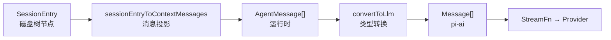

| 阶段 | 函数 | 空间 | 可否改变内容 |
|------|------|------|--------------|
| 投影 | `sessionEntryToContextMessages` | Entry → AgentMessage | 包装类型，不删 entry |
| 预处理 | `transformContext` | AgentMessage → AgentMessage | 扩展可增删改 |
| 转换 | `convertToLlm` | AgentMessage → Message | custom/bash 等 → user 消息 |
| 推理 | `StreamFn` | HTTP 流式 | — |

`buildContextEntries()` 在投影前做**压缩感知截断**：只保留最新 `compaction` + `firstKeptEntryId` 之后的路径片段。

---

## I.8 模块索引（全项目）

> 查文件路径用本节；查协作关系用 [I.3–I.5](#i3-核心实体设计与协作关系)。

### coding-agent `src/`

| 路径 | 职责 |
|------|------|
| `cli/` | `pi` 入口、子命令 |
| `core/agent-session.ts` | **编排 Facade** |
| `core/session-manager.ts` | **JSONL 会话树** |
| `core/messages.ts` | 自定义消息 + `convertToLlm` |
| `core/compaction/` | 压缩算法与 Prompt |
| `core/extensions/` | 扩展 loader/runner/types |
| `core/tools/` | 内置工具实现 |
| `core/model-runtime.ts` | 模型与 auth |
| `core/sdk.ts` | `createAgentSession` |
| `modes/interactive/` | TUI + 组件 |
| `modes/print-mode.ts` | Print 模式 |
| `modes/rpc/` | RPC JSONL |

### agent `src/`

| 路径 | 职责 |
|------|------|
| `types.ts` | 核心类型 |
| `agent-loop.ts` | `runLoop` |
| `agent.ts` | `Agent` |
| `harness/agent-harness.ts` | 通用嵌入桥接（Pi CLI 不经过此路径） |
| `harness/session/` | Jsonl 存储 + 上下文构建 |

### ai `src/`

| 路径 | 职责 |
|------|------|
| `api/stream.ts` | `StreamFn` |
| `providers/*` | Provider 适配 |
| `models.ts` | 模型目录 |

### 其他包

| 包 | 关键路径 |
|----|----------|
| pi-tui | `src/tui.ts`, `components/` |
| pi-storage-sqlite-node | `storage/session-entries.ts` |
| pi-evals | `src/pi-harness.ts` |

---

## I.9 扩展面与运行模式

### 扩展机制（与 AgentSession 的挂接点）

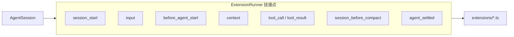

| 机制 | 配置位置 | 典型用途 |
|------|----------|----------|
| Extensions | `~/.pi/agent/extensions`, Pi Package | 事件、工具、命令、Provider |
| Skills | SKILL.md | 工作流说明注入 |
| Prompt Templates | 模板文件 | `/template` 展开 |
| Context Files | AGENTS.md 等 | system prompt 项目上下文 |
| Themes | JSON | TUI 主题 |

### 运行模式

| 模式 | 入口 | IO | 共享内核 |
|------|------|-----|----------|
| Interactive | `pi` | pi-tui | AgentSession |
| Print | `pi --print` | stdout | 同上 |
| RPC | `pi --rpc` | JSONL stdio | 同上 |
| SDK | `createAgentSession()` | 调用方自管 | 同上 |

---

## I.10 依赖规则与演进

### I.10.1 编译依赖（必须遵守）

```text
pi-coding-agent → pi-agent-core → pi-ai
                → pi-tui
                → pi-storage-sqlite-node (可选)

禁止：pi-ai → agent；agent → coding-agent
```

### I.10.2 运行时不变量

> Part II §19.2 补充实现侧细节（投影纯函数、扩展不可直改 Agent）。

1. **Session append-only**：不修改已有 entry；分支 = 新路径 + 移动 `leafId`。  
2. **runLoop 无状态**：跨 turn 状态只在 `Agent` + `SessionManager`。  
3. **扩展不直接写 Agent 内部**：经 `ExtensionRunner` 事件返回值生效。  
4. **压缩不删文件**：只追加 `compaction` entry，上下文投影时跳过旧消息。

### 演进方向

- 通用循环能力下沉 `pi-agent-core`；Pi 产品策略留 `coding-agent`。  
- 存储后端可插拔（JSONL 默认）。  
- **稳定集成面**：`createAgentSession`、Extension 事件 API、JSONL session 格式。

---

# Part II · 源码深潜

> **函数级、行号级** 解读。Part I 已覆盖架构图与时序；本节只展开实现细节，不重复高层图表。

### Part I ↔ Part II 对照

| Part I（概念 / 图） | Part II（源码） |
|---------------------|-----------------|
| [I.0 总体框架](#i0-总体框架一页纸) | §1 两层包哲学、行数 |
| [I.2 包依赖](#i2-包依赖与边界) | §1、[I.2.3 双实现对照](#i23-双实现对照易混淆) |
| [I.3 核心实体](#i3-核心实体设计与协作关系) | §4–§7 类型与 Agent/Harness |
| [I.5 时序图](#i5-关键时序图) | §5 runLoop、§10 prompt、§12 逐步追踪 |
| [I.6 双状态源](#i6-双状态源与同步规则) | §6 Agent 状态、§10 `_handleAgentEvent` |
| [I.7 消息四层变换](#i7-会话与消息数据模型) | §2 投影、§11 `convertToLlm` |
| [I.8 模块索引](#i8-模块索引全项目) | 各 § 源文件路径 |
| [I.9 扩展 / 模式](#i9-扩展面与运行模式) | §14 扩展、§18 模式 |
| [I.10 不变量](#i10-依赖规则与演进) | §19.2–19.3 |

---

## 1. 总体架构：两层设计哲学

> **高层图**：逻辑分层见 [I.0.1](#i01-逻辑分层与包映射)；包依赖见 [I.2.1](#i21-包依赖图编译期)；子系统协作见 [I.4](#i4-子系统协作图)。

Pi 的核心架构分为 **coding-agent**（产品编排）与 **agent**（通用循环）两个包层：

| 包 | 核心类（行数） | 职责 |
|----|----------------|------|
| **pi-coding-agent** | `AgentSession` (3325)、`SessionManager` (1713)、`Compaction` (970)、`ExtensionRunner`、`ModelRuntime`、`Tools` | Pi CLI/SDK 编排、JSONL 会话、压缩策略、扩展、内置工具 |
| **pi-agent-core** | `Agent` (578)、`runLoop` (793)、`AgentHarness` (1085)、`Session` (360)、`JsonlSessionStorage` (377)、`types.ts` (438) | 无状态循环、有状态 Agent、通用 Harness 嵌入路径 |

**为什么有两层？** `agent` 不含 Pi 特定逻辑；`coding-agent` 承载压缩、工具、扩展等应用策略。两层各有独立的 `sessionEntryToContextMessages()` 与 `convertToLlm()`——语义对齐、代码独立（对照 [I.2.3](#i23-双实现对照易混淆)）。

**Pi CLI 路径**：`AgentSession` 直接订阅 `Agent` 事件并写 `SessionManager`，**不经过** `AgentHarness`（Harness 供 SDK 嵌入）。

---

## 2. 消息投影（Message Projection）详解

### 2.1 什么是消息投影

**消息投影**是将存储层的 `SessionTreeEntry`（树节点）转换为运行时的 `AgentMessage[]`（LLM 上下文消息）的过程。

核心问题：存储层保存的是**树结构**（每个 entry 有 `id`/`parentId`），而 LLM 需要的是**线性消息数组**。消息投影就是这个"树→数组"的转换器。
```typescript
interface AgentSession {
  // 会话基础元数据（对应 JSONL 文件头部 SessionHeader）
  sessionId: string;
  workingDirectory: string;
  createdAt: string;
  parentSessionId?: string; // fork 来源会话

  // ✅ 核心可信数据源：完整树形事件节点列表
  entries: SessionEntry[];
  entryById: Map<string, SessionEntry>; // 索引加速查找
  leafId: string; // 当前活跃分支叶子节点（游标，控制当前走哪条分支）

  // 持有 Agent 实例
  agent: Agent;

  // 订阅回调（流式、生命周期事件）
  subscribe(callback: SessionEventHandler): () => void;

  // 核心方法
  appendEntry(entry: SessionEntry): Promise<void>; // 追加节点（追加式，不改旧数据）
  fork(newLeafId?: string): AgentSession; // 分支会话
  buildSessionContext(leafId: string): SessionContext; // ✅ 投影入口：从树生成LLM上下文
  run(): Promise<void>;
}
interface SessionEntryBase {
    type: string;          // 区分条目类型
id: string;            // 唯一短id
parentId: string | null; // 构建树形分支，根节点为null
timestamp: string;
}

// 联合类型（常用子类型）
type SessionEntry =
| SessionMessageEntry        // 对话消息：携带 AgentMessage
| CompactionEntry           // 压缩切点：summary、firstKeptEntryId（时序图的压缩实体）
| ModelChangeEntry
| ThinkingLevelChangeEntry
| BranchSummaryEntry
| CustomEntry;

interface SessionMessageEntry extends SessionEntryBase {
    type: "message";
message: AgentMessage;
}
interface AgentState {
    messages: AgentMessage[]; // ✅ 第二处：投影后缓存的消息数组
}
interface Agent {
    state: AgentState; // ✅ Agent 自身包含 AgentState
run(): Promise<void>;
continue(): Promise<void>;
}
#**AgentSession 持有整棵会话树 SessionEntry []（可信持久源）；
# buildSessionContext 从树投影得到 AgentMessage []，存入 Agent.state.messages 
# 作为本轮缓存视图，直接交给
# LLM；压缩会重新投影并覆盖 state.messages，重试本轮推理。**
```
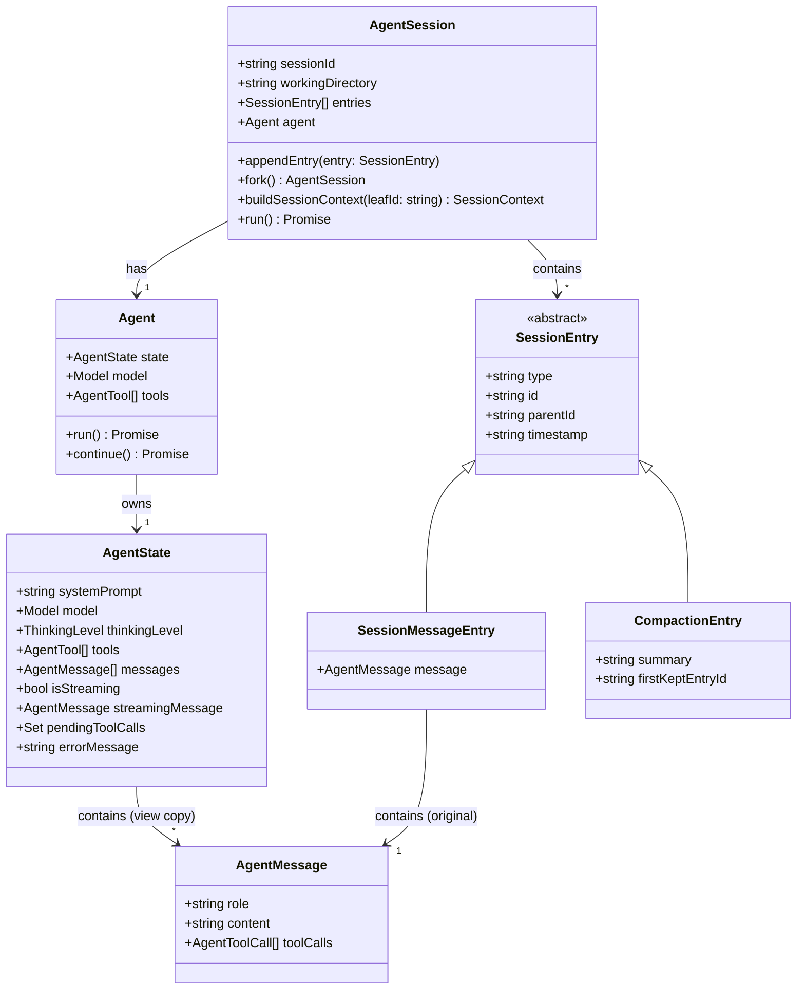
### 关系说明

1. `AgentSession`（顶层会话）**包含多个 `SessionEntry`**，持有一个 `Agent`
2. `Agent` 持有唯一 `AgentState`（运行视图）
3. `AgentState` 持有 `AgentMessage[]`：**投影后的视图副本，用于请求 LLM**
4. `SessionEntry` 是抽象基类，派生出 `SessionMessageEntry`、`CompactionEntry`
5. `SessionMessageEntry` 内部持有原始 `AgentMessage`（可信持久版本）
6. `AgentMessage` 纯数据载体，不引用其他实体
**关键特性：一个 entry 可能投影为 0、1 或多条消息。**

### 2.2 源码实现

coding-agent 版本位于 `coding-agent/src/core/session-manager.ts:383-408`：

```typescript
// session-manager.ts:383
export function sessionEntryToContextMessages(entry: SessionEntry): AgentMessage[] {
  // message entry → 直接返回 [entry.message]（1→1）
  if (entry.type === "message") {
    const message = entry.message;
    // 防御性处理：老版本/hand-edited 文件可能 content=null
    if ((message.role === "user" || message.role === "assistant" || message.role === "toolResult")
        && message.content == null) {
      return [{ ...message, content: [] }];
    }
    return [message];
  }
  // custom_message → 包装为 CustomMessage（1→1）
  if (entry.type === "custom_message") {
    return [createCustomMessage(entry.customType, entry.content ?? [], entry.display, entry.details, entry.timestamp)];
  }
  // branch_summary → 包装为 BranchSummaryMessage（1→1）
  if (entry.type === "branch_summary" && entry.summary) {
    return [createBranchSummaryMessage(entry.summary, entry.fromId, entry.timestamp)];
  }
  // compaction → 包装为 CompactionSummaryMessage（1→1）
  if (entry.type === "compaction") {
    return [createCompactionSummaryMessage(entry.summary, entry.tokensBefore, entry.timestamp)];
  }
  // model_change, thinking_level_change, label, custom, session_info → 0 条消息
  return [];
}
```

agent 包版本位于 `agent/src/harness/session/session.ts` 的 `sessionEntryToContextMessages()`，逻辑完全相同但独立实现。

### 2.3 投影规则总结表

> 与 [I.7 Entry 类型](#i7-会话与消息数据模型) 一致；完整 type 枚举见 [附录 B](#附录-bentry-类型完整枚举)。

| Entry Type | 投影结果 | 说明 |
|---|---|---|
| `message` (user/assistant/toolResult) | `[entry.message]` | 1→1 直接传递 |
| `custom_message` | `[CustomMessage]` | 1→1 包装为自定义消息类型 |
| `compaction` | `[CompactionSummaryMessage]` | 1→1 压缩摘要变为 user 消息 |
| `branch_summary` | `[BranchSummaryMessage]` | 1→1 分支摘要变为 user 消息 |
| `model_change` / `thinking_level_change` / `label` / `custom` / `session_info` / `leaf` | `[]` | 不参与 LLM 上下文（见附录 B） |

### 2.4 投影在上下文构建中的位置

```
JSONL 文件
  ↓ loadEntriesFromFile()
FileEntry[] (原始 JSON 解析)
  ↓ getEntries() (过滤掉 header)
SessionEntry[]
  ↓ buildSessionPath(leafId) — 从 leaf 沿 parentId 回溯到 root
path: SessionEntry[] (线性路径)
  ↓ buildContextEntries() — 压缩感知：找到最新 compaction，只保留 compaction + firstKeptEntryId 之后
contextEntries: SessionEntry[]
  ↓ .flatMap(sessionEntryToContextMessages)  ← 这就是"消息投影"
AgentMessage[] (运行时消息数组)
  ↓ convertToLlm() — 类型转换管道
Message[] (LLM API 可接受的格式)
```

---

## 3. 完整 JSONL 会话文件示例

以下是一个完整会话的 JSONL 文件，展示了用户发送消息 → 模型回复 → 工具调用 → 工具结果 → 上下文压缩 → 分支的完整生命周期。

```jsonl
{"type":"session","version":3,"id":"a1b2c3d4-e5f6-7890-abcd-ef1234567890","timestamp":"2025-01-15T10:00:00.000Z","cwd":"/home/user/myproject"}
{"type":"message","id":"00000001","parentId":null,"timestamp":"2025-01-15T10:00:01.000Z","message":{"role":"user","content":[{"type":"text","text":"帮我读一下 src/index.ts 的内容"}],"timestamp":1705312801000}}
{"type":"message","id":"00000002","parentId":"00000001","timestamp":"2025-01-15T10:00:05.000Z","message":{"role":"assistant","content":[{"type":"text","text":"好的，我来读取这个文件。"},{"type":"toolCall","id":"call_001","name":"read","input":{"path":"src/index.ts"}}],"stopReason":"tool_use","model":"claude-sonnet-4-20250514","provider":"anthropic","usage":{"inputTokens":150,"outputTokens":50,"cacheReadTokens":0,"cacheWriteTokens":0},"timestamp":1705312805000}}
{"type":"message","id":"00000003","parentId":"00000002","timestamp":"2025-01-15T10:00:06.000Z","message":{"role":"toolResult","toolCallId":"call_001","content":[{"type":"text","text":"1: import express from 'express';\n2: const app = express();\n3: app.listen(3000);"}],"isError":false,"timestamp":1705312806000}}
{"type":"message","id":"00000004","parentId":"00000003","timestamp":"2025-01-15T10:00:10.000Z","message":{"role":"assistant","content":[{"type":"text","text":"文件内容如下：\n\n```typescript\nimport express from 'express';\nconst app = express();\napp.listen(3000);\n```"}],"stopReason":"end_turn","model":"claude-sonnet-4-20250514","provider":"anthropic","usage":{"inputTokens":250,"outputTokens":80,"cacheReadTokens":150,"cacheWriteTokens":0},"timestamp":1705312810000}}
{"type":"thinking_level_change","id":"00000005","parentId":"00000004","timestamp":"2025-01-15T10:00:12.000Z","thinkingLevel":"medium"}
{"type":"message","id":"00000006","parentId":"00000005","timestamp":"2025-01-15T10:00:15.000Z","message":{"role":"user","content":[{"type":"text","text":"现在帮我修改端口为 8080"}],"timestamp":1705312815000}}
{"type":"message","id":"00000007","parentId":"00000006","timestamp":"2025-01-15T10:00:20.000Z","message":{"role":"assistant","content":[{"type":"text","text":"我来使用 edit 工具修改端口号。"},{"type":"toolCall","id":"call_002","name":"edit","input":{"path":"src/index.ts","oldText":"app.listen(3000)","newText":"app.listen(8080)"}}],"stopReason":"tool_use","model":"claude-sonnet-4-20250514","provider":"anthropic","usage":{"inputTokens":400,"outputTokens":60,"cacheReadTokens":250,"cacheWriteTokens":0},"timestamp":1705312820000}}
{"type":"message","id":"00000008","parentId":"00000007","timestamp":"2025-01-15T10:00:21.000Z","message":{"role":"toolResult","toolCallId":"call_002","content":[{"type":"text","text":"File edited successfully."}],"isError":false,"timestamp":1705312821000}}
{"type":"message","id":"00000009","parentId":"00000008","timestamp":"2025-01-15T10:00:25.000Z","message":{"role":"assistant","content":[{"type":"text","text":"已将端口从 3000 修改为 8080。"}],"stopReason":"end_turn","model":"claude-sonnet-4-20250514","provider":"anthropic","usage":{"inputTokens":500,"outputTokens":30,"cacheReadTokens":400,"cacheWriteTokens":0},"timestamp":1705312825000}}
{"type":"compaction","id":"00000010","parentId":"00000009","timestamp":"2025-01-15T10:05:00.000Z","summary":"<summary>\n用户在 /home/user/myproject 项目下工作。读取了 src/index.ts（Express 应用，3行代码），然后将端口从 3000 修改为 8080。\n\n<read-files>\n<file>src/index.ts</file>\n</read-files>\n<modified-files>\n<file>src/index.ts</file>\n</modified-files>\n</summary>","firstKeptEntryId":"00000006","tokensBefore":500,"usage":{"inputTokens":600,"outputTokens":100}}
{"type":"message","id":"00000011","parentId":"00000010","timestamp":"2025-01-15T10:05:30.000Z","message":{"role":"user","content":[{"type":"text","text":"再加一个 health check 端点"}],"timestamp":1705313130000}}
{"type":"message","id":"00000012","parentId":"00000011","timestamp":"2025-01-15T10:05:35.000Z","message":{"role":"assistant","content":[{"type":"text","text":"好的，我来添加 health check 端点。"}],"stopReason":"end_turn","model":"claude-sonnet-4-20250514","provider":"anthropic","usage":{"inputTokens":700,"outputTokens":20,"cacheReadTokens":600,"cacheWriteTokens":0},"timestamp":1705313135000}}
{"type":"leaf","id":"00000013","parentId":"00000012","timestamp":"2025-01-15T10:05:35.100Z","targetId":"00000012"}
```

### 3.1 关键结构解读

**树结构可视化（上述示例的 entry 关系）：**

```
null ← 00000001 (user: 帮我读一下...)
  ↑
  00000002 (assistant: 好的 + toolCall:read)
    ↑
    00000003 (toolResult: 文件内容)
      ↑
      00000004 (assistant: 文件内容如下...)
        ↑
        00000005 (thinking_level_change: medium)  ← 投影为 0 条消息
          ↑
          00000006 (user: 修改端口)  ← compaction.firstKeptEntryId 指向这里
            ↑                        ← 压缩后，这条之前的消息被摘要替代
            00000007 (assistant: edit toolCall)
              ↑
              00000008 (toolResult: 编辑成功)
                ↑
                00000009 (assistant: 已修改)
                  ↑
                  00000010 (compaction: 摘要)  ← 投影为 1 条 CompactionSummaryMessage
                    ↑
                    00000011 (user: health check)
                      ↑
                      00000012 (assistant: 好的)
                        ↑
                        00000013 (leaf: targetId=00000012)  ← 投影为 0 条消息
```

**消息投影结果（LLM 实际看到的消息数组）：**

```
[CompactionSummaryMessage,  ← 来自 entry 00000010
 user: "再加一个 health check 端点",  ← 来自 entry 00000011
 assistant: "好的，我来添加..."]  ← 来自 entry 00000012
```

注意 `firstKeptEntryId = "00000006"`，但 00000006-00000009 在 compaction 之后被跳过（因为它们在 compaction entry 之前），只有 compaction 之后的 entry（00000011, 00000012）被保留。

### 3.2 版本迁移说明

| 版本 | 变更 |
|---|---|
| v1 | 无 `id`/`parentId`，compaction 用 `firstKeptEntryIndex`（数组下标） |
| v2 | 添加 `id`/`parentId` 树结构，compaction 改用 `firstKeptEntryId` |
| v3 | `hookMessage` role 重命名为 `custom` |

迁移代码位于 `session-manager.ts:231-291`，`migrateToCurrentVersion()` 函数按顺序执行 v1→v2→v3 迁移。

---

## 4. 模块一：`agent/types.ts` — 基础类型系统

> 源文件：`packages/agent/src/types.ts`（438 行）

这是整个系统最基础的类型定义文件，定义了所有包共享的核心类型。

### 4.1 AgentMessage — 消息联合类型

```typescript
// types.ts:~50
type AgentMessage = Message | CustomAgentMessages[keyof CustomAgentMessages];
```

`Message` 是 LLM 原生消息（`user`/`assistant`/`toolResult`），`CustomAgentMessages` 是通过 TypeScript **声明合并**（declaration merging）扩展的自定义消息类型接口。任何包都可以通过声明合并向 `CustomAgentMessages` 添加新字段：

```typescript
// harness/messages.ts 中的声明合并
declare module "../types.ts" {
  interface CustomAgentMessages {
    bashExecution: BashExecutionMessage;
    custom: CustomMessage;
    branchSummary: BranchSummaryMessage;
    compactionSummary: CompactionSummaryMessage;
  }
}
```

### 4.2 AgentContext — LLM 调用上下文快照

```typescript
// types.ts:~80
interface AgentContext {
  systemPrompt: string;       // 系统提示词
  messages: AgentMessage[];   // 当前消息历史
  tools: AgentTool[];         // 可用工具列表
}
```

这是传给 `runLoop()` 的上下文快照。每次 turn 开始时创建，turn 期间不可变。

### 4.3 AgentLoopConfig — 循环配置回调

```typescript
// types.ts:~100
interface AgentLoopConfig {
  // 两级转换管道
  convertToLlm?: (messages: AgentMessage[]) => Message[];   // AgentMessage → LLM Message
  transformContext?: (messages: AgentMessage[]) => AgentMessage[];  // 上下文预处理

  // 消息队列控制
  getSteeringMessages?: () => AgentMessage[];
  getFollowUpMessages?: () => AgentMessage[];

  // 工具拦截
  beforeToolCall?: (ctx: BeforeToolCallContext) => Promise<...>;
  afterToolCall?: (ctx: AfterToolCallContext) => Promise<...>;

  // Turn 控制
  shouldStopAfterTurn?: (ctx: ShouldStopContext) => boolean;
  prepareNextTurn?: (ctx: PrepareNextTurnContext) => Promise<...>;
}
```

**`convertToLlm` vs `transformContext` 的区别：**
- `transformContext`：在 `AgentMessage` 空间操作（可以添加/删除/修改自定义消息）
- `convertToLlm`：将 `AgentMessage[]` 转为 LLM API 接受的 `Message[]`（类型转换，不是内容修改）

### 4.4 StreamFn — 统一流式调用签名

```typescript
// types.ts:~200
type StreamFn = (
  model: Model<any>,
  context: { systemPrompt: string; messages: Message[]; tools: ToolSpec[] },
  options: StreamOptions
) => AsyncIterable<StreamEvent>;
```

所有 LLM Provider（Anthropic/OpenAI/Google/Bedrock...）都实现这个统一接口。`StreamEvent` 包含 `partial`（增量文本）、`done`（完成）、`error`（错误）三种类型。

### 4.5 AgentEvent — 事件联合类型

```typescript
// types.ts:~250
type AgentEvent =
  | { type: "agent_start" }
  | { type: "agent_end"; messages: AgentMessage[] }
  | { type: "turn_start" }
  | { type: "turn_end"; message: AssistantMessage; toolResults: ToolResult[] }
  | { type: "message_start"; message: AgentMessage }
  | { type: "message_update"; message: AgentMessage }
  | { type: "message_end"; message: AgentMessage }
  | { type: "tool_execution_start"; toolCallId: string; toolName: string; args: unknown }
  | { type: "tool_execution_update"; toolCallId: string; partialResult: unknown }
  | { type: "tool_execution_end"; toolCallId: string; result: unknown; isError: boolean };
```

---

## 5. 模块二：`agent/agent-loop.ts` — 无状态双层循环

> 源文件：`packages/agent/src/agent-loop.ts`（793 行）

这是系统最核心的执行引擎。注意：**这个函数是无状态的**，所有状态由 `Agent` 类管理。

### 5.1 函数签名

```typescript
// agent-loop.ts:~50
export async function runLoop(
  context: AgentContext,          // 包含 systemPrompt, messages, tools
  streamFunction: StreamFn,       // LLM 流式调用函数
  config: AgentLoopConfig,        // 回调配置
  signal?: AbortSignal            // 中断信号
): Promise<AgentLoopResult>
```

### 5.2 循环结构

> **纠正**：LLM 调用在**内层循环**中，不是外层。外层循环仅处理 followUp 队列。

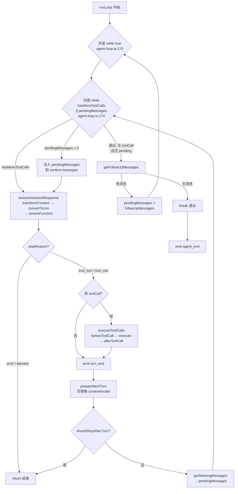

**关键区分**：
- **Steering Queue** → 在**内层**循环消费，turn 结束后注入，用于打断/修正当前思路
- **FollowUp Queue** → 在**外层**循环消费，agent 完全停止后才注入，用于启动新一轮对话

```
内层 while(hasMoreToolCalls || pendingMessages.length > 0)    ← 所有重活在这里
│                                                              （agent-loop.ts:174）
│  ① 注入 pendingMessages（steering 消息 / followUp 消息）
│     └─ pendingMessages → push 到 context.messages
│
│  ② streamAssistantResponse()                                ← LLM 调用在这里
│     ├─ transformContext(messages)    → AgentMessage[] 预处理
│     ├─ convertToLlm(messages)       → Message[] 类型转换
│     └─ streamFunction(model, ctx)   → 流式 LLM 调用
│
│  ③ 检查 stopReason
│     ├─ "error" / "aborted" → return（整个 runLoop 结束）
│     └─ "end_turn" / "tool_use" → 继续
│
│  ④ 如果有 toolCall → executeToolCalls()
│     ├─ beforeToolCall hook → 可修改参数或跳过
│     ├─ tool.execute(args) → 执行
│     ├─ afterToolCall hook → 可修改结果
│     └─ hasMoreToolCalls = !terminate
│
│  ⑤ emit turn_end
│
│  ⑥ prepareNextTurn() → 可替换 context / model / thinkingLevel
│
│  ⑦ shouldStopAfterTurn() → true 则 return（整个 runLoop 结束）
│
│  ⑧ pendingMessages = getSteeringMessages()
│     └─ 有消息 → 回到 ①（不退出内层循环）
│     └─ 无消息 && hasMoreToolCalls=false → 退出内层循环
│
└──────────────────────────────────────────────────────────────

外层 while(true)                                              ← 仅处理 followUp
│                                                              （agent-loop.ts:170）
│  内层循环退出后...
│
│  followUpMessages = getFollowUpMessages()
│    ├─ 有消息 → pendingMessages = followUpMessages → continue（重新进入内层）
│    └─ 无消息 → break（退出外层，runLoop 结束）
│
└──────────────────────────────────────────────────────────────
```
## 1. prepareNextTurn

**作用：本轮结束后，生成下一轮要用的快照（snapshot），支持动态修改下一轮上下文 / 模型配置**

```
type PrepareNextTurn = async (args: {
  message: AgentMessage;
  toolResults: AgentMessage[];
  context: AgentContext;
  newMessages: AgentMessage[];
}) => NextTurnSnapshot | undefined;
```

返回 `NextTurnSnapshot` 可选包含：

- `context`：新的上下文（AgentMessage []）
- `model`：切换模型
- `thinkingLevel`：调整思考等级

### 典型用途

1. **运行时动态切换模型、调整 system prompt、修改工具集**（改动只在下一轮生效，不会污染当前正在执行的 turn，隔离竞态）
2. **持久化刷盘、保存 checkpoint /save point**（AgentHarness 在这里 flush pending 会话写入）
3. **上下文压缩（compaction）**：在 turn 边界裁剪、摘要消息，返回新 context 给下一轮使用
4. 注入框架级元数据、审计信息

### 关键特性

- **不会中断当前 turn**：属于 turn 边界后置钩子
- 返回 `undefined` → 沿用原来的 context /model，不做变更
- 对比 `continue()`：`continue()` 是**同一 turn 内重投影重试**；`prepareNextTurn` 是 **turn 和 turn 之间修改快照**

## 2. shouldStopAfterTurn

**作用：本轮执行完毕后，判断是否直接终止整个 agentLoop，不再开启下一轮 turn**

```
type ShouldStopAfterTurn = async (args: {
  message: AgentMessage;
  toolResults: AgentMessage[];
  context: AgentContext;
  newMessages: AgentMessage[];
}) => boolean;
```

- 返回 `true`：立即触发 `agent_end`，退出循环，**不再检查 steer /followUp 队列，不再跑新 turn**
- 返回 `false`：正常继续，检查 steering/followup，决定是否开启下一轮

### 典型用途

1. **token 超限检测**：本轮结束发现上下文太长 → 返回 true，停止循环，交给外层做压缩（turn 边界压缩）
2. **最大 turn 数、预算、超时控制**
3. **人工审核节点**：跑完本轮后强制暂停，等待用户确认再继续
4. **目标完成判定**：本轮工具结果证明任务完成，主动终止 agent

### ⚠️ 重要区分（容易混淆）

1. 和工具返回 `terminate: true` 的区别
    - `terminate: true`：**仅跳过本轮工具后的自动 LLM 调用**，不会终止整个 agentLoop，仍然会检查 steer/followup
    - `shouldStopAfterTurn = true`：**直接结束整个 agent run，发出 agent_end**
2. 不会 abort 正在跑的流式 / 工具：它是**优雅停止（本轮完整跑完后退出）**，不是强制中断（abort）
**为什么外层循环存在？** Agent 完成一轮（`end_turn`、无工具）后内层退出，但 `AgentSession` 可能已通过 `followUp()` 入队新消息；外层循环负责消费后再进入内层。Steering / FollowUp 区分见上文 **关键区分** 与 [I.5.3](#i53-runloop-内层循环steering)。
   `prepareNextTurn` / `shouldStopAfterTurn` **属于 AgentLoop 层面的回调钩子（hook）**，是标准可自定义扩展点（hook 点），但和 `agent.subscribe("turn_end")` 事件回调不是同一套东西：

1. **它们是控制型钩子（可修改流程 / 返回数据影响后续执行）**：属于 `AgentLoopConfig` 配置项，传给底层 `agentLoop` 运行时调用，**有返回值，能改变执行行为**
2. `subscribe` 订阅事件（`turn_start`/`turn_end`）属于**观测型事件回调**：只读通知，一般不能直接修改下一轮上下文、不能终止循环

>
> 一句话区分：
>
>
> - 观测事件（subscribe）：只是通知你发生了什么，**不能改主流程**
> - prepareNextTurn / shouldStopAfterTurn：**执行控制点 Hook**，返回值直接决定下一轮怎么跑、要不要继续跑

## 1. 怎么作为 hook 点使用（伪代码示例）

```
const stream = agentLoop({
  model,
  convertToLlm,

  // ✅ Hook点1：每轮结束后，自定义下一轮快照（修改上下文/模型）
  prepareNextTurn: async (args) => {
    // args 包含本轮消息、工具返回、当前上下文
    const needCompact = judgeTokenOverflow(args.context);
    if (needCompact) {
      // 返回新快照：替换下一轮上下文、切换模型
      return {
        context: compactMessages(args.context)
      };
    }
    // 返回 undefined：沿用原有配置，不做修改
    return undefined;
  },

  // ✅ Hook点2：本轮跑完后，判断是否终止整个agentLoop
  shouldStopAfterTurn: async (args) => {
    // 自定义终止规则：最大轮次、token超限、任务完成
    if (args.context.messages.length > 20) {
      return true; // true → agent_end，退出循环
    }
    return false; // false → 继续下一轮turn
  }
});
```

>
> 特点：**上层业务自己实现，传入 loop 配置，底层循环固定位置调用，是官方预留扩展点**，典型 hook 设计模式。

## 2. 执行时序（hook 触发位置固定）

```
turn_end 事件广播（subscribe 观测回调，只读）
    ↓
【Hook 点 1】prepareNextTurn() → 返回 NextTurnSnapshot（可选修改下一轮上下文/模型）
    ↓
【Hook 点 2】shouldStopAfterTurn() → 返回 boolean，判断是否终止
    ↓
true → agent_end，退出循环
false → 检查 steer/followUp 队列，开启下一轮 turn
```

## 3. 和 subscribe 事件回调的关键差异

表格

| 类型 | 例子 | 是否 Hook | 能力 | 是否可修改流程 |
| --- | --- | --- | --- | --- |
| AgentLoop 控制钩子 | prepareNextTurn / shouldStopAfterTurn | ✅ 控制型 Hook | 返回值影响后续执行（改上下文、终止循环） | ✅ 可以 |
| 生命周期订阅事件 | agent.subscribe("turn_end", callback) | ⚠️ 观测回调（不是控制 hook） | 日志、UI 渲染、埋点审计 | ❌ 不能直接修改主循环上下文、无法终止 loop |

## 4. 重要边界说明

1. **hook 生效范围：turn 边界（turn_end 之后）**
   只能控制**下一轮**，**不能干预当前正在执行的 turn 内部**；本轮中途要重投影重试，仍然用 `continue()`
2. **多个 hook 如何组合？**
   原生 agentLoop 里这两个回调都是**单函数**，不像洋葱中间件（middleware）天然支持多插件链式组合；
   如果需要多个插件注册 hook，上层自己封装组合器（多个 prepareNext 按顺序执行，合并 snapshot）
3. 区分另一层：Harness / Extension 还有另一套 HookEvent（before_provider_request /tool_call），用于**单 turn 内部拦截**，和这一组 turn-boundary hook 属于不同分层扩展点

## 5. 常见业务使用场景（hook 自定义）

1. `prepareNextTurn` hook 实现：turn 边界上下文压缩、动态切换模型、动态注入 system prompt、自动保存 checkpoint
2. `shouldStopAfterTurn` hook 实现：自定义最大 turn 限制、预算控制、任务完成自动终止、人工审核暂停

## 一句话总结

**prepareNextTurn、shouldStopAfterTurn 是官方预留的 turn 边界控制型 Hook 点，可以自定义实现来修改下一轮运行快照、控制 Agent 循环终止；区别于只能观测的 subscribe 生命周期事件回调。**
1. **底层循环控制回调（无 pi.on，写在 agentLoop config）**`prepareNextTurn`、`shouldStopAfterTurn`、`beforeToolCall`
   用途：控制 agent 循环启停、turn 边界快照、工具预拦截
2. **扩展可修改 / 拦截 Hook（pi.on，业务插件核心）**`project_trust`、`resources_discover`、`session_before_switch`、`session_before_fork`、`session_before_compact`、`session_before_tree`、`input`、`user_bash`、`before_agent_start`、`context`、`before_provider_headers`、`before_provider_request`、`message_end`、`tool_call`、`tool_result`
3. **纯观测只读事件（日志、埋点、UI 渲染，不能改主流程）**
   其余所有：session_start/shutdown、agent_start/agent_end、turn_start/turn_end、message_start/update、tool_execution_xxx、model_select、thinking_level_select
### 5.3 关键源码：两级转换点

```typescript
// agent-loop.ts: streamAssistantResponse() 内部
// 第一步：transformContext（AgentMessage[] → AgentMessage[]）
const transformedMessages = config.transformContext
  ? await config.transformContext(context.messages)
  : context.messages;

// 第二步：convertToLlm（AgentMessage[] → Message[]）
const llmMessages = config.convertToLlm
  ? config.convertToLlm(transformedMessages)
  : transformedMessages as Message[];

// 第三步：调用 LLM
const stream = streamFunction(model, {
  systemPrompt: context.systemPrompt,
  messages: llmMessages,
  tools: toolSpecs,
}, options);
```

### 5.4 工具执行流程

```typescript
// agent-loop.ts:~400
// 三阶段工具执行：
// 1. prepareToolCall — beforeToolCall hook，可修改参数
const prepared = await config.beforeToolCall?.({ toolCall, args });
if (prepared?.skip) { /* 跳过执行，使用 prepared.result */ }

// 2. executePreparedToolCall — 实际执行
const result = await tool.execute(finalArgs, signal);

// 3. finalizeExecutedToolCall — afterToolCall hook，可修改结果
const finalResult = await config.afterToolCall?.({ toolCall, args, result });
```

工具执行支持两种模式：
- **sequential**：逐个执行，每个结果立即可见
- **parallel**：所有工具同时执行（`Promise.all`），适用于无依赖的工具调用

### 5.5 stopReason=length 处理

```typescript
// agent-loop.ts: failToolCallsFromTruncatedMessage()
// 当 LLM 响应因 max_tokens 截断时（stopReason="length"），
// 所有未执行的 toolCall 都被 fail 掉，返回错误信息给 LLM
if (assistantMessage.stopReason === "length") {
  for (const toolCall of pendingToolCalls) {
    failToolCall(toolCall, "Response was truncated before this tool call could be executed");
  }
}
```

---

## 6. 模块三：`agent/agent.ts` — 有状态代理封装

> 源文件：`packages/agent/src/agent.ts`（578 行）

### 6.1 Agent 类核心结构

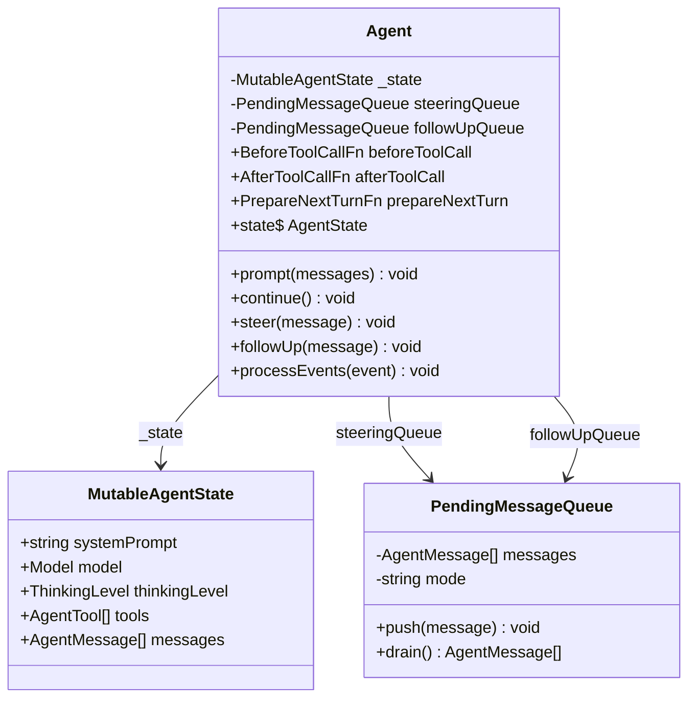

```typescript
class Agent {
  // 有状态
  private _state: MutableAgentState;

  // 回调钩子（由 AgentSession 设置）
  beforeToolCall?: BeforeToolCallFn;
  afterToolCall?: AfterToolCallFn;
  prepareNextTurn?: PrepareNextTurnFn;

  // 消息队列
  private steeringQueue: PendingMessageQueue;
  private followUpQueue: PendingMessageQueue;

  // 核心方法
  async prompt(messages: AgentMessage | AgentMessage[]): Promise<void>;
  async continue(): Promise<void>;
  steer(message: AgentMessage): void;
  followUp(message: AgentMessage): void;
}
```

### 6.2 MutableAgentState — 防御性状态管理

```typescript
// agent.ts:~80
interface MutableAgentState {
  systemPrompt: string;
  model: Model<any> | undefined;
  thinkingLevel: ThinkingLevel;
  tools: AgentTool[];
  messages: AgentMessage[];
}
```

`tools` 和 `messages` 使用 **getter/setter 防御性拷贝**：

```typescript
// agent.ts 内部
get state(): AgentState {
  return {
    ...this._state,
    tools: [...this._state.tools],      // 返回副本
    messages: [...this._state.messages], // 返回副本
  };
}
```

但注意：`AgentSession` 层会直接修改 `agent.state.messages`（如压缩后替换消息数组），这是因为 Agent 的 setter 会接受新数组。

### 6.3 PendingMessageQueue — 双模式队列

```typescript
// agent.ts:~150
class PendingMessageQueue {
  private messages: AgentMessage[] = [];
  private mode: "all" | "one-at-a-time" = "all";

  // "all" 模式：drain 时一次返回所有消息
  // "one-at-a-time" 模式：drain 时只返回第一条
  drain(): AgentMessage[] { ... }
}
```

- **Steering Queue**：消息在 turn 结束后（`turn_end` 事件后）注入，打断当前 LLM 思路
- **FollowUp Queue**：消息在 agent 即将停止时注入（外层循环），用于连续对话

### 6.4 prompt() vs continue() 调用链

```
prompt(messages):
  → agent.state.messages.push(messages)
  → runAgentLoop()
      → runLoop(context, streamFn, config)  ← 进入双层循环

continue():
  → 检查 steering queue → 有消息则 runAgentLoopContinue()
  → 检查 followUp queue → 有消息则 runAgentLoopContinue()
  → 都没有则 no-op
```

### 6.5 processEvents() — 状态 Reducer

```typescript
// agent.ts:~300
// Agent 订阅自己的事件来维护状态：
processEvents(event: AgentEvent): void {
  switch (event.type) {
    case "message_end":
      this._state.messages.push(event.message);  // 完成的消息入历史
      break;
    case "tool_execution_start":
      this._pendingToolCalls.push(event.toolCallId);
      break;
    case "tool_execution_end":
      this._pendingToolCalls.remove(event.toolCallId);
      break;
  }
}
```

---

## 7. 模块四：`agent/harness/` — 会话桥接层

> Harness 层是 `agent` 包中连接"无状态循环"和"持久化存储"的桥梁。

### 7.1 Session 类 — 上下文构建

> 源文件：`packages/agent/src/harness/session/session.ts`（360 行）

```typescript
class Session {
  constructor(
    storage: SessionStorage,          // JSONL 或 SQLite 存储后端
    contextBuildOptions?: { ... }     // 上下文构建选项
  )

  // 核心方法：构建 LLM 上下文
  async buildSessionContext(): Promise<AgentMessage[]> {
    const contextEntries = await this.buildContextEntries();
    return contextEntries.flatMap(sessionEntryToContextMessages);  // ← 消息投影
  }

  // 压缩感知的上下文条目构建
  async buildContextEntries(): Promise<SessionTreeEntry[]> {
    return defaultContextEntryTransform(
      await this.storage.getPathToRootOrCompaction()
    );
  }

  // 追加各类 entry
  async appendMessage(message: AgentMessage): Promise<string>;
  async appendCompaction(summary: string, ...): Promise<string>;
  async appendModelChange(provider: string, modelId: string): Promise<string>;
}
```

**`defaultContextEntryTransform()`** 的压缩感知逻辑：

```typescript
// session.ts:~200
function defaultContextEntryTransform(entries: SessionTreeEntry[]): SessionTreeEntry[] {
  // 从后往前找最新的 compaction entry
  let latestCompaction: SessionTreeEntry | null = null;
  for (let i = entries.length - 1; i >= 0; i--) {
    if (entries[i].type === "compaction") {
      latestCompaction = entries[i];
      break;
    }
  }

  if (!latestCompaction) return entries;  // 无压缩，返回全部

  // 找到 firstKeptEntryId 的位置
  const compactionIdx = entries.indexOf(latestCompaction);
  const firstKeptIdx = entries.findIndex(e => e.id === latestCompaction.firstKeptEntryId);

  // 结果：[compaction] + [firstKeptEntry 到 compaction 之间的条目] + [compaction 之后的条目]
  return [
    latestCompaction,
    ...entries.slice(firstKeptIdx, compactionIdx),
    ...entries.slice(compactionIdx + 1),
  ];
}
```

### 7.2 AgentHarness 类 — 事件驱动桥接

> 源文件：`packages/agent/src/harness/agent-harness.ts`（1085 行）

`AgentHarness` 是 harness 层的核心类，它：
1. 拥有 `Session` 实例（存储层）
2. 拥有 `Agent` 实例（循环层）
3. 通过事件订阅将两者连接

**AgentHarness 组件关系与事件流：**

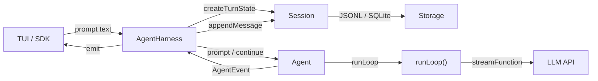

#### 7.2.1 createTurnState() — Turn 状态快照

```typescript
// agent-harness.ts:~300
private createTurnState(): AgentContext {
  const messages = this.session.buildSessionContext();  // ← 消息投影发生在这里
  const systemPrompt = this.parseSystemPrompt();
  return {
    systemPrompt,
    messages,
    tools: this.agent.state.tools,
  };
}
```

#### 7.2.2 createLoopConfig() — 循环配置工厂

```typescript
// agent-harness.ts:~350
private createLoopConfig(): AgentLoopConfig {
  return {
    convertToLlm: (messages) => convertToLlm(messages),  // 使用 harness 层的转换函数
    transformContext: (messages) => {
      // 触发 context hook，允许外部修改上下文
      return this.emitContextHook(messages);
    },
    prepareNextTurn: async () => {
      // 1. 先 flush 延迟写入
      await this.flushPendingSessionWrites();
      // 2. 重建 turn 状态
      return this.createTurnState();
    },
    getSteeringMessages: () => this.drainSteerQueue(),
    getFollowUpMessages: () => this.drainFollowUpQueue(),
  };
}
```

#### 7.2.3 handleAgentEvent() — 持久化逻辑

```typescript
// agent-harness.ts:~500
async handleAgentEvent(event: AgentEvent): Promise<void> {
  switch (event.type) {
    case "message_end":
      // 每条完成的消息立即持久化
      await this.session.appendMessage(event.message);
      break;

    case "turn_end":
      // Turn 结束时 flush 延迟写入队列
      await this.flushPendingSessionWrites();
      this.emit({ type: "save_point" });
      break;

    case "agent_end":
      await this.flushPendingSessionWrites();
      this.phase = "idle";
      this.emit({ type: "settled" });
      break;
  }
}
```

#### 7.2.4 PendingSessionWrites — 延迟写入机制

```typescript
// agent-harness.ts:~200
// 不是每条消息都立即写磁盘。AgentHarness 维护一个延迟写入队列：
private pendingSessionWrites: SessionTreeEntry[] = [];

// turn 期间的新消息先入队
this.pendingSessionWrites.push(entry);

// turn_end 时统一 flush
async flushPendingSessionWrites(): Promise<void> {
  for (const entry of this.pendingSessionWrites) {
    await this.session.storage.appendEntry(entry);
  }
  this.pendingSessionWrites = [];
}
```

---

## 8. 模块五：`coding-agent/session-manager.ts` — 会话持久化

> 源文件：`packages/coding-agent/src/core/session-manager.ts`（1713 行）

这是 coding-agent 包自己的会话管理器，与 agent 包的 `Session`/`JsonlSessionStorage` **并行存在但独立实现**。

### 8.1 SessionManager 类核心结构

**SessionManager 与 Entry 类型体系：**

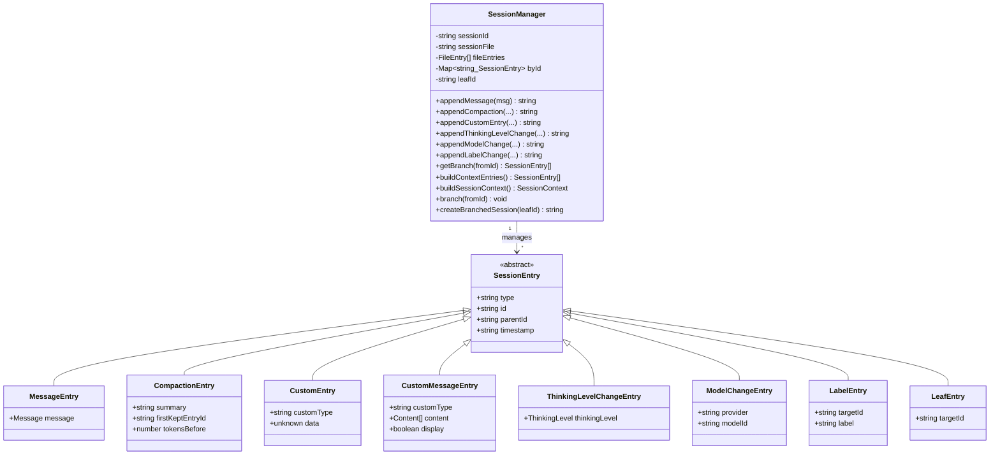

```typescript
// session-manager.ts:855
class SessionManager {
  private sessionId: string = "";
  private sessionFile: string | undefined;
  private sessionDir: string;
  private cwd: string;
  private persist: boolean;
  private flushed: boolean = false;
  private fileEntries: FileEntry[] = [];     // 内存中的完整 entry 列表
  private byId: Map<string, SessionEntry>;    // id → entry 索引
  private labelsById: Map<string, string>;    // targetId → label 文本
  private leafId: string | null = null;       // 当前叶节点 ID

  // 核心 CRUD
  appendMessage(message: Message | CustomMessage | BashExecutionMessage): string;
  appendCompaction(summary, firstKeptEntryId, tokensBefore, ...): string;
  appendCustomEntry(customType, data?): string;
  appendCustomMessageEntry(customType, content, display, details?): string;
  appendThinkingLevelChange(thinkingLevel): string;
  appendModelChange(provider, modelId): string;
  appendLabelChange(targetId, label): string;
  appendSessionInfo(name): string;

  // 树遍历
  getBranch(fromId?): SessionEntry[];          // 从 leaf 到 root 的路径
  buildContextEntries(): SessionEntry[];       // 压缩感知的上下文条目
  buildSessionContext(): SessionContext;        // 完整的 LLM 上下文
  getTree(): SessionTreeNode[];                // 完整树结构（用于 UI 展示）

  // 分支操作
  branch(branchFromId): void;                  // 移动 leaf 指针
  branchWithSummary(branchFromId, summary): string;  // 分支 + 摘要
  createBranchedSession(leafId): string;       // 提取路径为新会话
}
```

### 8.2 _persist() — 智能写入策略

```typescript
// session-manager.ts:1015
_persist(entry: SessionEntry): void {
  if (!this.persist || !this.sessionFile) return;

  // 关键优化：在第一个 assistant 消息到达之前，不创建文件
  const hasAssistant = this.fileEntries.some(e => e.type === "message" && e.message.role === "assistant");
  if (!hasAssistant) {
    if (this.flushed) {
      // 已 flush 过但没 assistant？直接追加
      appendFileSync(this.sessionFile, `${JSON.stringify(entry)}\n`);
    } else {
      // 还没 flush，等 assistant 到达时一起写
      this.flushed = false;
    }
    return;
  }

  if (!this.flushed) {
    // 第一次 flush：创建文件并写入所有累积的 entries
    const fd = openSync(this.sessionFile, "wx");  // "wx" = 排他创建
    for (const e of this.fileEntries) {
      writeFileSync(fd, `${JSON.stringify(e)}\n`);
    }
    closeSync(fd);
    this.flushed = true;
  } else {
    // 后续 entry 直接追加
    appendFileSync(this.sessionFile, `${JSON.stringify(entry)}\n`);
  }
}
```

这个设计避免了"用户还没发消息就创建空文件"的问题。

### 8.3 buildContextEntries() — 压缩感知上下文构建

```typescript
// session-manager.ts:418
export function buildContextEntries(entries, leafId, byId): SessionEntry[] {
  const path = buildSessionPath(entries, leafId, byId);  // leaf→root 路径

  // 找路径上最新的 compaction
  let compaction = null;
  for (const entry of path) {
    if (entry.type === "compaction") compaction = entry;
  }
  if (!compaction) return path;  // 无压缩，返回完整路径

  // 构建结果：[compaction] + [firstKeptEntryId 到 compaction 之间] + [compaction 之后]
  const contextEntries = [compaction];
  let foundFirstKept = false;
  for (let i = 0; i < compactionIdx; i++) {
    if (path[i].id === compaction.firstKeptEntryId) foundFirstKept = true;
    if (foundFirstKept) contextEntries.push(path[i]);
  }
  contextEntries.push(...path.slice(compactionIdx + 1));
  return contextEntries;
}
```
buildContextEntries：沿着当前活跃分支回溯，根据压缩切点裁剪会话树，选出真正参与 LLM 上下文的原始 SessionEntry 列表，作为 buildSessionContext 的输入。
### 8.4 buildSessionContext() — 完整上下文构建

```typescript
// session-manager.ts:461
export function buildSessionContext(entries, leafId, byId): SessionContext {
  const path = buildSessionPath(entries, leafId, byId);
  const { thinkingLevel, model } = getSessionContextSettings(path);
  const messages = buildContextEntries(entries, leafId, byId)
    .flatMap(sessionEntryToContextMessages);  // ← 消息投影
  return { messages, thinkingLevel, model };
}
```

---

## 9. 模块六：`coding-agent/compaction/` — 上下文压缩系统

> 源文件：`packages/coding-agent/src/core/compaction/compaction.ts`（970 行）
> 辅助文件：`packages/coding-agent/src/core/compaction/utils.ts`（159 行）

### 9.1 三种触发条件

> 自动压缩时序见 [I.5.4 自动压缩（threshold）](#i54-自动压缩threshold)。

| 触发类型 | 条件 | 来源 | 是否自动重试 |
|---|---|---|---|
| **manual** | 用户手动执行 `/compact` | `AgentSession.compact()` | N/A |
| **threshold** | `contextTokens > contextWindow - reserveTokens` | `_checkCompaction()` | 否 |
| **overflow** | LLM 返回 context overflow 错误 | `_checkCompaction()` | 是（一次） |

```typescript
// compaction.ts: shouldCompact()
export function shouldCompact(contextTokens: number, contextWindow: number, settings: CompactionSettings): boolean {
  return contextTokens > contextWindow - settings.reserveTokens;
}
```

### 9.2 Token 估算策略

```typescript
// compaction.ts: estimateTokens()
export function estimateTokens(message: AgentMessage): number {
  // 简单启发式：字符数 / 4
  if (message.role === "user" || message.role === "assistant") {
    return Math.ceil(contentText(message.content, "").length / 4);
  }
  if (message.role === "toolResult") {
    return Math.ceil(contentText(message.content, "").length / 4);
  }
  // 自定义消息类型也按字符数估算
  return Math.ceil(JSON.stringify(message).length / 4);
}

// compaction.ts: estimateContextTokens()
export function estimateContextTokens(messages: AgentMessage[]): { tokens: number; lastUsageIndex: number | null } {
  // 策略：找最后一个有 usage 数据的 assistant 消息
  // 用它的 usage.inputTokens 作为基准，加上后续消息的估算
  for (let i = messages.length - 1; i >= 0; i--) {
    if (messages[i].role === "assistant" && (messages[i] as AssistantMessage).usage) {
      const usage = (messages[i] as AssistantMessage).usage;
      let tokens = usage.inputTokens + usage.outputTokens;
      // 加上这条消息之后的新消息
      for (let j = i + 1; j < messages.length; j++) {
        tokens += estimateTokens(messages[j]);
      }
      return { tokens, lastUsageIndex: i };
    }
  }
  return { tokens: 0, lastUsageIndex: null };
}
```

### 9.3 切点查找算法

```typescript
// compaction.ts: findCutPoint()
function findCutPoint(messages: AgentMessage[], keepRecentTokens: number): number {
  // 从后往前累积 tokens，直到 >= keepRecentTokens
  let accumulated = 0;
  for (let i = messages.length - 1; i >= 0; i--) {
    accumulated += estimateTokens(messages[i]);
    if (accumulated >= keepRecentTokens) {
      // 找到切点，但要确保不切在 toolResult 上
      // 只切在 user/assistant/bashExecution/custom/branchSummary/compactionSummary
      while (i > 0 && messages[i].role === "toolResult") {
        i--;  // 向前移动，确保完整的工具调用对
      }
      return i;
    }
  }
  return 0;
}
```

### 9.4 prepareCompaction() — 准备阶段

```typescript
// compaction.ts: prepareCompaction()
export function prepareCompaction(entries: SessionEntry[], settings: CompactionSettings): CompactionPreparation | null {
  // 1. 构建消息投影
  const messages = entries.flatMap(sessionEntryToContextMessages);

  // 2. 找前一个 compaction（确定 boundaryStart）
  const prevCompaction = findPreviousCompaction(entries);
  const boundaryStart = prevCompaction ? prevCompaction.firstKeptEntryId : null;

  // 3. 找切点
  const cutPoint = findCutPoint(messages, settings.keepRecentTokens);
  if (cutPoint <= 0) return null;  // 没有足够的内容可压缩

  // 4. 分割消息
  const messagesToSummarize = messages.slice(0, cutPoint);
  const turnPrefixMessages = messages.slice(cutPoint);

  // 5. 检查是否 split turn（切点落在 turn 中间）
  const isSplitTurn = turnPrefixMessages.length > 0
    && turnPrefixMessages[0].role === "toolResult";

  return {
    messagesToSummarize,
    turnPrefixMessages: isSplitTurn ? turnPrefixMessages : [],
    firstKeptEntryId: ...,
    tokensBefore: ...,
    isSplitTurn,
  };
}
```
# 一句话结论

**压缩准备阶段：原始数据来源是 SessionEntry []；摘要生成阶段会投影成 AgentMessage [] 做摘要；压缩完成后持久写入 CompactionEntry（属于 SessionEntry）；后续重建上下文时又走 buildContextEntries（操作 SessionEntry）**pi.dev

完整分层拆解：

## 1）触发压缩 → 拿到整条分支 SessionEntry []

`prepareCompaction` 输入：当前分支完整 `SessionEntry[]`（可信源）

- 扫描整条 DAG 分支，定位压缩切点 `firstKeptEntryId`
- 区分：待摘要区间、保留尾部区间

>
> 这一层操作对象仍然是 **SessionEntry**

## 2）生成摘要：转成 AgentMessage [] 再喂给摘要 LLM

把待压缩区间内的 entries，执行投影，得到 `AgentMessage[]`（`messagesToSummarize`），调用 LLM 生成摘要文本

>
> 摘要计算用的是 **AgentMessage[]**，方便统一序列化送入摘要模型

## 3）压缩结果持久化：新增 CompactionEntry（属于 SessionEntry）

摘要完成后，append 一条 `CompactionEntry` 到会话树（jsonl 持久化）：

- 旧版：`summary + firstKeptEntryId`
- 新版：增加 `retainedTail: AgentMessage[]`（直接保存精简后的消息快照，加速后续重建上下文）pi.dev

>
> **落盘存储的仍然是 SessionEntry**，AgentMessage 只是内嵌在 CompactionEntry / SessionMessageEntry 里面的字段

## 4）压缩后重建上下文（buildContextEntries /buildSessionContext）

1. `buildContextEntries`：遍历分支 SessionEntry，识别 CompactionEntry，按切点裁剪 → 返回有效 SessionEntry []
2. `buildSessionContext`：把筛选后的 entries → 再次投影为 AgentMessage []，覆盖 `agent.state.messages`，然后 `continue()` 本轮重试 LLMpi.dev
### 9.5 compact() — 主压缩函数

```typescript
// compaction.ts: compact()
export async function compact(
  preparation: CompactionPreparation,
  model: Model<any>,
  apiKey: string | undefined,
  headers: Record<string, string> | undefined,
  customInstructions: string | undefined,
  signal: AbortSignal | undefined,
  thinkingLevel: ThinkingLevel,
  streamFn: StreamFn,
  env: Record<string, string> | undefined,
  retrySettings: RetrySettings,
  retryCallbacks: RetryCallbacks | undefined,
): Promise<CompactionResult> {
  // Split turn 时需要两次 LLM 调用：
  if (preparation.isSplitTurn) {
    // 调用 1：对历史消息生成摘要
    const historySummary = await generateSummaryWithUsage(
      preparation.messagesToSummarize, model, apiKey, headers,
      customInstructions, signal, thinkingLevel, streamFn, env,
      retrySettings, retryCallbacks,
      null,  // 无 previousSummary
      SUMMARIZATION_PROMPT,  // 或 UPDATE_SUMMARIZATION_PROMPT
    );

    // 调用 2：对 turn 前缀生成摘要
    const turnPrefixSummary = await generateSummaryWithUsage(
      preparation.turnPrefixMessages, model, apiKey, headers,
      customInstructions, signal, thinkingLevel, streamFn, env,
      retrySettings, retryCallbacks,
      null,
      TURN_PREFIX_SUMMARIZATION_PROMPT,
    );

    // 合并两个摘要
    summary = historySummary.text + "\n" + turnPrefixSummary.text;
    usage = mergeUsage(historySummary.usage, turnPrefixSummary.usage);
  } else {
    // 单次 LLM 调用
    const result = await generateSummaryWithUsage(...);
    summary = result.text;
    usage = result.usage;
  }

  // 提取文件操作信息
  const fileOps = extractFileOperations(preparation.messagesToSummarize, prevCompactionDetails);
  if (fileOps) {
    summary += "\n" + formatFileOperations(fileOps);
  }

  return { summary, firstKeptEntryId, tokensBefore, estimatedTokensAfter, usage, details };
}
```

### 9.6 三种摘要 Prompt

| Prompt | 用途 | 关键差异 |
|---|---|---|
| `SUMMARIZATION_PROMPT` | 首次压缩 | "Summarize the following conversation" |
| `UPDATE_SUMMARIZATION_PROMPT` | 增量更新 | "Update the previous summary with new information"，带 `previousSummary` 参数 |
| `TURN_PREFIX_SUMMARIZATION_PROMPT` | Split turn 前缀 | "Summarize this partial turn (tool calls without results)" |

### 9.7 文件操作追踪

```typescript
// compaction/utils.ts
interface FileOperations {
  read: Set<string>;     // 被读取的文件路径
  written: Set<string>;  // 被写入的文件路径
  edited: Set<string>;   // 被编辑的文件路径
}

function extractFileOpsFromMessage(message: AgentMessage): FileOperations {
  // 从 assistant message 的 toolCall 中提取
  // 工具名 "read" → read 集合
  // 工具名 "write" → written 集合
  // 工具名 "edit" → edited 集合
}

function formatFileOperations(ops: FileOperations): string {
  // 输出 XML 格式：
  // <read-files><file>path</file></read-files>
  // <modified-files><file>path</file></modified-files>
}
```

---

## 10. 模块七：`coding-agent/agent-session.ts` — 核心编排器

> 源文件：`packages/coding-agent/src/core/agent-session.ts`（3325 行）

`AgentSession` 是整个系统最大的类，组合了所有子系统。组件关系见 [I.0.2 运行时对象图](#i02-运行时对象图一次-prompt-期间谁存在)、[附录 A](#附录-a关键数据结构关系图)。

### 10.1 类结构概览

```typescript
class AgentSession {
  readonly agent: Agent;                    // 代理核心
  readonly sessionManager: SessionManager;  // 会话存储
  readonly settingsManager: SettingsManager;// 配置管理

  // 消息队列（UI 展示用）
  private _steeringMessages: string[] = [];
  private _followUpMessages: string[] = [];
  private _pendingNextTurnMessages: CustomMessage[] = [];

  // 压缩状态
  private _compactionAbortController: AbortController | undefined;
  private _autoCompactionAbortController: AbortController | undefined;
  private _overflowRecoveryAttempted = false;

  // 重试状态
  private _retryAttempt = 0;

  // Bash 执行状态
  private _bashAbortController: AbortController | undefined;
  private _pendingBashMessages: BashExecutionMessage[] = [];

  // 扩展系统
  private _extensionRunner: ExtensionRunner;

  // 模型管理
  private _modelRuntime: ModelRuntime;

  // 工具注册
  private _toolRegistry: Map<string, AgentTool>;
  private _toolDefinitions: Map<string, ToolDefinitionEntry>;

  // 系统提示词
  private _baseSystemPrompt = "";
  private _systemPromptOverride?: string;
}
```

### 10.2 prompt() 完整流程

```typescript
// agent-session.ts:1114
async prompt(text: string, options?: PromptOptions): Promise<void> {
  // 1. 扩展命令处理（/command）
  if (text.startsWith("/")) {
    const handled = await this._tryExecuteExtensionCommand(text);
    if (handled) return;
  }

  // 2. 扩展 input hook（可拦截/变换输入）
  if (this._extensionRunner.hasHandlers("input")) {
    const inputResult = await this._extensionRunner.emitInput(text, images, source, streamingBehavior);
    if (inputResult.action === "handled") return;
    if (inputResult.action === "transform") { text = inputResult.text; images = inputResult.images; }
  }

  // 3. Skill 命令展开（/skill:name）+ 提示词模板展开
  let expandedText = this._expandSkillCommand(text);
  expandedText = expandPromptTemplate(expandedText, [...this.promptTemplates]);

  // 4. 流式行为处理
  if (this.isStreaming) {
    if (options.streamingBehavior === "followUp") return this._queueFollowUp(expandedText);
    else return this._queueSteer(expandedText);
  }

  // 5. 验证模型和 API Key
  if (!this.model) throw new Error("No model selected");
  if (!hasConfiguredAuth(this.model.provider)) throw new Error("No API key");

  // 6. 预检查压缩（捕获上次中止的响应）
  const lastAssistant = this._findLastAssistantMessage();
  if (lastAssistant) await this._checkCompaction(lastAssistant, false);

  // 7. 构建消息数组
  const messages: AgentMessage[] = [];
  messages.push({ role: "user", content: [{ type: "text", text: expandedText }], timestamp: Date.now() });
  // 注入 pendingNextTurnMessages
  for (const msg of this._pendingNextTurnMessages) messages.push(msg);
  this._pendingNextTurnMessages = [];

  // 8. before_agent_start 扩展事件
  const result = await this._extensionRunner.emitBeforeAgentStart(expandedText, images, systemPrompt, options);
  if (result?.messages) {
    for (const msg of result.messages) messages.push({ role: "custom", ... });
  }
  if (result?.systemPrompt !== undefined) {
    this._systemPromptOverride = result.systemPrompt;
    this.agent.state.systemPrompt = result.systemPrompt;
  }

  // 9. 执行 agent
  await this._runAgentPrompt(messages);
}
```

### 10.3 _runAgentPrompt() — Agent 执行循环

```typescript
// agent-session.ts:1061
private async _runAgentPrompt(messages: AgentMessage[]): Promise<void> {
  this._isAgentRunActive = true;
  try {
    await this.agent.prompt(messages);       // 首次执行
    while (await this._handlePostAgentRun()) { // 后处理循环
      await this.agent.continue();            // 继续执行
    }
  } finally {
    this._systemPromptOverride = undefined;
    this._flushPendingBashMessages();
    await this._emitAgentSettled();
  }
}
```

### 10.4 _handlePostAgentRun() — 后处理决策树

```typescript
// agent-session.ts:1075
private async _handlePostAgentRun(): Promise<boolean> {
  const msg = this._lastAssistantMessage;
  if (!msg) return false;

  // 1. 检查是否可重试错误
  if (this._isRetryableError(msg) && await this._prepareRetry(msg)) return true;

  // 2. 检查是否需要压缩
  if (await this._checkCompaction(msg)) return true;

  // 3. 检查队列中是否有消息（扩展在 agent_end 时注入的）
  return this.agent.hasQueuedMessages();
}
```

### 10.5 _handleAgentEvent() — 事件持久化

```typescript
// agent-session.ts:595
private _handleAgentEvent = async (event: AgentEvent): Promise<void> => {
  // 1. 用户消息开始时，从队列中移除（UI 更新）
  if (event.type === "message_start" && event.message.role === "user") {
    const messageText = contentText(event.message.content, "");
    const steeringIndex = this._steeringMessages.indexOf(messageText);
    if (steeringIndex !== -1) { this._steeringMessages.splice(steeringIndex, 1); this._emitQueueUpdate(); }
    else { /* 检查 followUp 队列 */ }
  }

  // 2. 先发给扩展
  await this._emitExtensionEvent(event);

  // 3. 通知所有监听器
  this._emit(event);

  // 4. 持久化
  if (event.type === "message_end") {
    if (event.message.role === "custom") {
      this.sessionManager.appendCustomMessageEntry(...);
    } else if (["user", "assistant", "toolResult"].includes(event.message.role)) {
      this.sessionManager.appendMessage(event.message);
    }
    // bashExecution, compactionSummary, branchSummary 在其他地方持久化
  }
};
```

### 10.6 _checkCompaction() — 压缩检查

```typescript
// agent-session.ts:1953
private async _checkCompaction(assistantMessage: AssistantMessage, skipAbortedCheck = true): Promise<boolean> {
  const settings = this.settingsManager.getCompactionSettings();
  if (!settings.enabled) return false;

  // 跳过已中止的消息
  if (skipAbortedCheck && assistantMessage.stopReason === "aborted") return false;

  // 跳过来自不同模型的消息（避免模型切换后误触发）
  const sameModel = this.model && assistantMessage.provider === this.model.provider
    && assistantMessage.model === this.model.id;

  // 跳过压缩边界之前的旧消息
  const compactionEntry = getLatestCompactionEntry(this.sessionManager.getBranch());
  if (compactionEntry && assistantMessage.timestamp <= new Date(compactionEntry.timestamp).getTime()) return false;

  // Case 1: Overflow — LLM 返回 context overflow
  if (sameModel && isContextOverflow(assistantMessage, contextWindow)) {
    const willRetry = assistantMessage.stopReason !== "stop";
    if (this._overflowRecoveryAttempted) { /* 已尝试过，放弃 */ return false; }
    this._overflowRecoveryAttempted = true;
    // 移除错误消息（已持久化到 session，但从 agent state 中删除以便重试）
    if (messages[messages.length - 1].role === "assistant") {
      this.agent.state.messages = messages.slice(0, -1);
    }
    return await this._runAutoCompaction("overflow", willRetry);
  }

  // Case 2: Threshold — 上下文接近阈值
  let contextTokens = calculateContextTokens(assistantMessage.usage);
  if (shouldCompact(contextTokens, contextWindow, settings)) {
    return await this._runAutoCompaction("threshold", false);
  }
  return false;
}
```

---

## 11. 模块八：`coding-agent/messages.ts` — 消息转换管道

> 源文件：`packages/coding-agent/src/core/messages.ts`（196 行）

### 11.1 自定义消息类型定义

```typescript
// messages.ts
interface BashExecutionMessage {
  role: "bashExecution";
  command: string;
  output: string;
  exitCode: number;
  excludeFromContext?: boolean;  // !! 前缀命令可排除
  timestamp?: number;
}

interface CustomMessage<T = unknown> {
  role: "custom";
  customType: string;
  content: string | (TextContent | ImageContent)[];
  display: boolean;
  details?: T;
  timestamp?: number;
}

interface CompactionSummaryMessage {
  role: "compactionSummary";
  summary: string;
  tokensBefore: number;
  timestamp?: number;
}

interface BranchSummaryMessage {
  role: "branchSummary";
  summary: string;
  fromId: string;
  timestamp?: number;
}
```

### 11.2 convertToLlm() — 类型转换函数

```typescript
// messages.ts: convertToLlm()
export function convertToLlm(messages: AgentMessage[]): Message[] {
  const result: Message[] = [];
  for (const message of messages) {
    switch (message.role) {
      case "user":
      case "assistant":
      case "toolResult":
        result.push(message);  // 原生类型直接传递
        break;

      case "bashExecution":
        if (!message.excludeFromContext) {
          result.push({ role: "user", content: formatBashExecution(message) });
        }
        break;

      case "custom":
        result.push({ role: "user", content: formatCustomMessage(message) });
        break;

      case "compactionSummary":
        result.push({
          role: "user",
          content: `${COMPACTION_SUMMARY_PREFIX}\n<summary>\n${message.summary}\n</summary>\n${COMPACTION_SUMMARY_SUFFIX}`,
        });
        break;

      case "branchSummary":
        result.push({
          role: "user",
          content: `<summary>\n${message.summary}\n</summary>`,
        });
        break;
    }
  }
  return result;
}
```

**关键设计决策：**
- `bashExecution` 转为 `user` 消息（因为 LLM 需要看到命令输出）
- `compactionSummary` 包裹在 `<summary>` XML 标签中，并添加前缀/后缀提示
- `excludeFromContext` 的 bash 消息（如 `!!` 前缀命令）被完全过滤

---

## 12. 端到端数据流：从用户输入到 LLM 响应持久化

以一次完整的用户交互为例，追踪数据从输入到持久化的完整路径。时序图见 [I.5.2 用户一轮对话](#i52-用户一轮对话含工具)。

```
用户在 TUI 输入 "帮我读一下 src/index.ts"
│
├─ 1. TUI → AgentSession.prompt(text)
│     └─ 扩展命令检查（不以 / 开头，跳过）
│     └─ 扩展 input hook（无 handler，跳过）
│     └─ Skill/Template 展开（无匹配，跳过）
│     └─ 模型验证（this.model 存在，this.modelRuntime.hasConfiguredAuth() 通过）
│     └─ 预检查压缩（_checkCompaction → shouldCompact → false）
│
├─ 2. 构建消息数组
│     └─ messages = [{ role: "user", content: [{ type: "text", text: "帮我读一下..." }], timestamp }]
│     └─ 注入 _pendingNextTurnMessages（如果有）
│     └─ before_agent_start 扩展事件（无修改）
│
├─ 3. _runAgentPrompt(messages)
│     └─ agent.prompt(messages)
│         └─ state.messages.push(messages)
│         └─ runAgentLoop()
│             └─ runLoop(context, streamFn, config)
│
├─ 4. runLoop() 内部
│     ├─ createTurnState() 或 prepareNextTurn()
│     │   └─ session.buildSessionContext()
│     │       └─ buildContextEntries() → flatMap(sessionEntryToContextMessages)
│     │       └─ 结果：AgentMessage[]
│     │
│     ├─ transformContext(messages)  ← 第一级转换（AgentMessage[] → AgentMessage[]）
│     │   └─ 触发 context hook
│     │
│     ├─ convertToLlm(messages)  ← 第二级转换（AgentMessage[] → Message[]）
│     │   └─ bashExecution → user message
│     │   └─ compactionSummary → user message with <summary> tags
│     │   └─ custom → user message
│     │
│     ├─ streamFunction(model, llmContext)  ← LLM 调用
│     │   └─ 流式事件：partial → message_update
│     │   └─ 完成：done → message_end
│     │
│     ├─ 检查 stopReason
│     │   ├─ "tool_use" → 执行工具
│     │   │   ├─ beforeToolCall hook → ExtensionRunner.emitToolCall()
│     │   │   ├─ tool.execute(args) → BashTool/ReadTool/...
│     │   │   └─ afterToolCall hook → ExtensionRunner.emitToolResult()
│     │   │
│     │   ├─ toolResult → push to context.messages
│     │   └─ 回到步骤 4（再次调用 LLM）
│     │
│     └─ "end_turn" → 跳出循环
│
├─ 5. 事件持久化（_handleAgentEvent）
│     ├─ message_end(user) → sessionManager.appendMessage()
│     ├─ message_end(assistant) → sessionManager.appendMessage()
│     ├─ message_end(toolResult) → sessionManager.appendMessage()
│     └─ turn_end → flushPendingSessionWrites()
│
├─ 6. _handlePostAgentRun()
│     ├─ 检查重试 → false
│     ├─ 检查压缩 → _checkCompaction()
│     │   └─ calculateContextTokens(usage) → 未超阈值 → false
│     └─ 检查队列 → false
│
└─ 7. _emitAgentSettled()
      └─ extensionRunner.emit("agent_settled")
      └─ _isAgentRunActive = false
      └─ _resolveIdleWaitIfIdle()
```

---

## 13. 存储后端：SQLite 行编码

> 源文件：`packages/storage/sqlite-node/src/sqlite/storage/session-entries.ts`（218 行）

SQLite 后端将 `SessionTreeEntry` 拆分为关系表列：

```typescript
// session-entries.ts
interface SessionEntryRow {
  session_id: string;    // 所属会话 ID
  id: string;            // Entry UUID（短 ID）
  entry_seq: number;     // 序号（用于排序）
  parent_id: string | null;  // 父 entry ID（树结构）
  type: string;          // "message" | "compaction" | "leaf" | ...
  timestamp: string;     // ISO 时间戳
  payload: string;       // JSON.stringify(剩余字段)
}
```

### 13.1 encodeEntry() — Entry → Row

```typescript
function encodeEntry(entry: SessionTreeEntry, sessionId: string, seq: number): SessionEntryRow {
  const { type, id, parentId, timestamp, ...rest } = entry;
  return {
    session_id: sessionId,
    id,
    entry_seq: seq,
    parent_id: parentId,
    type,
    timestamp,
    payload: JSON.stringify(rest),  // 类型特定字段存入 payload
  };
}
```

### 13.2 decodeEntry() — Row → Entry

```typescript
function decodeEntry(row: SessionEntryRow): SessionTreeEntry {
  const payload = JSON.parse(row.payload);
  switch (row.type) {
    case "message": return { type: "message", id: row.id, parentId: row.parent_id, timestamp: row.timestamp, ...payload };
    case "compaction": return { type: "compaction", ... };
    // ... 每种类型独立还原
  }
}
```

---

## 附录 A：关键数据结构关系图

```
AgentSession
  ├── agent: Agent
  │     ├── _state: MutableAgentState
  │     │     ├── systemPrompt: string
  │     │     ├── model: Model
  │     │     ├── tools: AgentTool[]
  │     │     └── messages: AgentMessage[]
  │     ├── steeringQueue: PendingMessageQueue
  │     └── followUpQueue: PendingMessageQueue
  │
  ├── sessionManager: SessionManager
  │     ├── fileEntries: FileEntry[]
  │     ├── byId: Map<string, SessionEntry>
  │     └── leafId: string | null
  │
  ├── _extensionRunner: ExtensionRunner
  ├── _modelRuntime: ModelRuntime
  └── settingsManager: SettingsManager
```

## 附录 B：Entry 类型完整枚举

| type | 接口名 | 参与 LLM 上下文 | 持久化到 JSONL | 说明 |
|---|---|---|---|---|
| `session` | `SessionHeader` | N/A | 第一行 | 会话头部（非 entry） |
| `message` | `SessionMessageEntry` | 是 | 是 | user/assistant/toolResult 消息 |
| `thinking_level_change` | `ThinkingLevelChangeEntry` | 否 | 是 | 思考级别变更记录 |
| `model_change` | `ModelChangeEntry` | 否 | 是 | 模型切换记录 |
| `compaction` | `CompactionEntry` | 是（投影为 CompactionSummaryMessage） | 是 | 压缩摘要 |
| `branch_summary` | `BranchSummaryEntry` | 是（投影为 BranchSummaryMessage） | 是 | 分支摘要 |
| `custom` | `CustomEntry` | 否 | 是 | 扩展状态存储 |
| `custom_message` | `CustomMessageEntry` | 是（投影为 CustomMessage） | 是 | 扩展注入的上下文消息 |
| `label` | `LabelEntry` | 否 | 是 | 用户标记/书签 |
| `session_info` | `SessionInfoEntry` | 否 | 是 | 会话显示名称 |
| `leaf` | `LeafEntry` | 否 | 是 | 叶指针移动记录 |

---

## 14. 扩展系统（Extension System）详解

> 源文件：`packages/coding-agent/src/core/extensions/types.ts`（1695 行）
> 源文件：`packages/coding-agent/src/core/extensions/runner.ts`（1224 行）
> 源文件：`packages/coding-agent/src/core/extensions/loader.ts`

### 14.1 扩展能力矩阵

> 挂接点总览见 [I.9 扩展机制](#i9-扩展面与运行模式)；工具拦截时序见 [I.5.5 扩展拦截工具](#i55-扩展拦截工具)。

扩展是 TypeScript 模块，可以注册以下资源：

| 能力 | 注册方式 | 说明 |
|---|---|---|
| **事件监听** | `on("event_type", handler)` | 订阅 30+ 种生命周期事件 |
| **工具注册** | `registerTool(definition)` | 注册 LLM 可调用的工具 |
| **命令注册** | `registerCommand({ name, handler })` | 注册 `/command` 斜杠命令 |
| **快捷键** | `registerShortcut({ key, handler })` | 注册键盘快捷键 |
| **Provider** | `registerProvider(config)` | 注册自定义 LLM Provider |
| **UI 组件** | `ctx.ui.setWidget/setFooter/setHeader` | 自定义终端 UI 组件 |
| **资源发现** | `on("resources_discover", handler)` | 提供额外的 skills/prompts/themes 路径 |

### 14.2 ExtensionRunner 类核心结构

```typescript
// runner.ts:266
class ExtensionRunner {
  private extensions: Extension[];       // 已加载的扩展列表
  private runtime: ExtensionRuntime;     // 运行时环境
  private uiContext: ExtensionUIContext;  // UI 上下文（按模式不同实现）
  private mode: ExtensionMode;           // "tui" | "rpc" | "json" | "print"
  private cwd: string;
  private sessionManager: SessionManager;

  // 通用事件发射
  async emit<T>(event: ExtensionEvent): Promise<T | undefined>;

  // 专用事件方法（更强类型安全）
  async emitBeforeAgentStart(prompt, images, systemPrompt, options): Promise<BeforeAgentStartCombinedResult>;
  async emitInput(text, images, source, streamingBehavior): Promise<InputEventResult>;
  async emitMessageEnd(event): Promise<AgentMessage | undefined>;
  async emitToolCall(event): Promise<ToolCallResult | undefined>;
  async emitToolResult(event): Promise<ToolResultResult | undefined>;

  // 扩展能力查询
  hasHandlers(type: string): boolean;
  getCommand(name: string): RegisteredCommand | undefined;
  createCommandContext(): ExtensionCommandContext;

  // 生命周期
  invalidate(staleMessage: string): void;  // 标记所有 ctx 为过期
}
```

### 14.3 事件处理链

`emit()` 方法按顺序调用所有注册了该事件类型的扩展 handler：

```typescript
// runner.ts 内部
async emit<T>(event: ExtensionEvent): Promise<T | undefined> {
  let combinedResult: T | undefined;
  for (const ext of this.extensions) {
    const handlers = ext.handlers.get(event.type);
    if (!handlers) continue;
    for (const handler of handlers) {
      try {
        const result = await handler(event, this.createContext());
        combinedResult = mergeResults(combinedResult, result);  // 合并多个 handler 的结果
      } catch (error) {
        this.emitError({ extensionPath: ext.path, event: event.type, error });
      }
    }
  }
  return combinedResult;
}
```

### 14.4 完整事件类型枚举

| 事件类型 | 触发时机 | 可返回值 |
|---|---|---|
| `session_start` | 会话启动/加载/恢复 | — |
| `session_before_switch` | 切换会话前 | `{ cancel?: boolean }` |
| `session_before_compact` | 压缩前 | `{ cancel?: boolean; compaction?: CompactionResult }` |
| `session_compact` | 压缩后 | — |
| `session_shutdown` | 扩展销毁前 | — |
| `resources_discover` | 启动时资源发现 | `{ skillPaths?, promptPaths?, themePaths? }` |
| `input` | 用户输入 | `{ action: "continue" \| "transform" \| "handled" }` |
| `before_agent_start` | Agent 循环前 | `{ message?: AgentMessage; systemPrompt?: string }` |
| `agent_start` / `agent_end` | Agent 循环开始/结束 | — |
| `agent_settled` | 完全空闲（无重试/压缩/队列） | — |
| `turn_start` / `turn_end` | 每个 Turn 开始/结束 | — |
| `message_start` / `message_update` / `message_end` | 消息生命周期 | `message_end` 可返回替换消息 |
| `tool_call` | 工具执行前 | `{ skip?: boolean; args?: modified }` |
| `tool_result` | 工具执行后 | `{ content?, details?, isError?, usage? }` |
| `context` | 每次 LLM 调用前 | `{ messages?: modified }` |
| `model_select` | 模型切换 | — |
| `user_bash` | 用户 `!`/`!!` 命令 | — |
| `before_provider_request` | HTTP 请求前 | `{ payload?: modified }` |
| `before_provider_headers` | 请求头组装后 | 直接修改 headers |
| `project_trust` | 项目信任检查 | `{ trusted: "yes" \| "no" \| "undecided" }` |

### 14.5 ExtensionContext — 扩展的上帝视角

每个 handler 接收的 `ExtensionContext` 提供：

```typescript
interface ExtensionContext {
  ui: ExtensionUIContext;           // UI 操作（弹窗、通知、Widget、自定义组件）
  mode: ExtensionMode;              // "tui" | "rpc" | "print"
  cwd: string;                      // 工作目录
  sessionManager: ReadonlySessionManager;  // 只读会话访问
  model: Model<any> | undefined;    // 当前模型
  thinkingLevel?: ThinkingLevel;    // 当前思考级别
  signal: AbortSignal | undefined;  // 中断信号

  // 操作方法
  abort(): void;                    // 中断当前操作
  shutdown(): void;                 // 关闭 pi
  isIdle(): boolean;                // 是否空闲
  hasPendingMessages(): boolean;    // 是否有队列消息
  getContextUsage(): ContextUsage;  // 上下文使用率
  compact(options?): void;          // 触发压缩
  getSystemPrompt(): string;        // 获取当前系统提示词
}
```

`ExtensionCommandContext` 额外提供会话控制方法：`newSession()`, `fork()`, `switchSession()`, `navigateTree()`, `reload()`。

---

## 15. 系统提示词构建

> 源文件：`packages/coding-agent/src/core/system-prompt.ts`（163 行）

### 15.1 buildSystemPrompt() 函数签名

```typescript
// system-prompt.ts:28
function buildSystemPrompt(options: BuildSystemPromptOptions): string;

interface BuildSystemPromptOptions {
  customPrompt?: string;                    // 自定义提示词（替换默认）
  selectedTools?: string[];                 // 活跃工具列表
  toolSnippets?: Record<string, string>;    // 工具一行描述
  promptGuidelines?: string[];              // 额外 guideline
  appendSystemPrompt?: string;              // 追加内容
  cwd: string;                              // 工作目录
  contextFiles?: Array<{ path, content }>;  // 项目上下文文件（AGENTS.md 等）
  skills?: Skill[];                         // 已加载的技能
}
```

### 15.2 系统提示词组装顺序

```
1. 自定义提示词 OR 默认提示词模板
   ├─ 默认模板包含：角色定义 + Available tools 列表 + Guidelines + Pi docs 路径
   └─ 自定义模板：直接使用 customPrompt

2. appendSystemPrompt（扩展追加内容）

3. <project_context> 区块
   └─ 每个 contextFile 包裹在 <project_instructions path="..."> 中

4. Skills 区块（仅当 read 工具可用时）
   └─ formatSkillsForPrompt(skills)

5. Current working directory: /path/to/project
```

### 15.3 系统提示词的动态更新

`AgentSession._rebuildSystemPrompt()` 在以下情况触发重建：
- 工具集变更（`setActiveToolsByName()`）
- 扩展注册/注销工具
- `before_agent_start` 事件返回新的 `systemPrompt`

每次 Turn 开始时，`_installAgentNextTurnRefresh()` 确保使用最新的系统提示词：

```typescript
// agent-session.ts:526
this.agent.prepareNextTurnWithContext = async (turn, signal) => {
  return {
    ...previousSnapshot,
    context: {
      ...previousContext,
      systemPrompt: this._systemPromptOverride ?? this._baseSystemPrompt,
      tools: this.agent.state.tools.slice(),
    },
    model: this.agent.state.model,
    thinkingLevel: this.agent.state.thinkingLevel,
  };
};
```

---

## 16. 工具系统

> 源文件：`packages/coding-agent/src/core/tools/` 目录

### 16.1 内置工具清单

| 工具名 | 源文件 | 功能 | 执行模式 |
|---|---|---|---|
| `bash` | `tools/bash.ts` | 执行 shell 命令 | sequential |
| `read` | `tools/read.ts` | 读取文件内容 | parallel |
| `write` | `tools/write.ts` | 写入新文件 | sequential |
| `edit` | `tools/edit.ts` | 编辑现有文件（字符串替换） | sequential |
| `edit-diff` | `tools/edit-diff.ts` | 编辑文件（diff 格式） | sequential |
| `find` | `tools/find.ts` | 按 glob 模式查找文件 | parallel |
| `grep` | `tools/grep.ts` | 正则搜索文件内容 | parallel |
| `ls` | `tools/ls.ts` | 列出目录内容 | parallel |

### 16.2 ToolDefinition 接口

```typescript
// extensions/types.ts:443
interface ToolDefinition<TParams, TDetails, TState> {
  name: string;                    // LLM 调用时使用的工具名
  label: string;                   // UI 显示标签
  description: string;             // LLM 看到的描述
  promptSnippet?: string;          // 系统提示词中的一行描述
  promptGuidelines?: string[];     // 追加到系统提示词的 guideline
  parameters: TParams;             // TypeBox JSON Schema
  executionMode?: ToolExecutionMode;  // "sequential" | "parallel"
  constrainedSampling?: false | ConstrainedSamplingConfig;

  // 核心执行方法
  execute(
    toolCallId: string,
    params: Static<TParams>,
    signal: AbortSignal | undefined,
    onUpdate: AgentToolUpdateCallback<TDetails> | undefined,
    ctx: ExtensionContext,
  ): Promise<AgentToolResult<TDetails>>;

  // 自定义渲染
  renderCall?: (args, theme, context) => Component;
  renderResult?: (result, options, theme, context) => Component;
}
```

### 16.3 工具拦截链

工具执行经过三层拦截：

```
LLM 返回 toolCall
  ↓
1. Agent.beforeToolCall hook（AgentSession._installAgentToolHooks() 设置）
  → ExtensionRunner.emitToolCall()
  → 扩展可修改参数或跳过执行
  ↓
2. ToolDefinition.execute(params)
  → 实际工具执行
  ↓
3. Agent.afterToolCall hook
  → ExtensionRunner.emitToolResult()
  → 扩展可修改结果
```

### 16.4 工具注册流程

```typescript
// AgentSession 构造函数中
this._buildRuntime({ activeToolNames, includeAllExtensionTools: true });

// _buildRuntime() 内部：
// 1. 收集内置工具
const baseTools = this._baseToolsOverride ?? {
  bash: createLocalBashTool(),
  read: createReadTool(),
  write: createWriteTool(),
  edit: createEditTool(),
  find: createFindTool(),
  grep: createGrepTool(),
  ls: createLsTool(),
};

// 2. 包装为 ToolDefinition
for (const [name, tool] of Object.entries(baseTools)) {
  const definition = createToolDefinitionFromAgentTool(name, tool);
  this._toolDefinitions.set(name, { definition, sourceInfo });
  this._toolRegistry.set(name, tool);
}

// 3. 合并扩展注册的工具
for (const tool of this._extensionRunner.getTools()) {
  this._toolDefinitions.set(tool.name, { definition: tool, sourceInfo });
  this._toolRegistry.set(tool.name, wrapRegisteredTool(tool));
}

// 4. 设置 agent.state.tools
this.agent.state.tools = Array.from(this._toolRegistry.values());
```

---

## 17. pi-ai 通信层

> 源文件：`packages/ai/src/`

### 17.1 核心抽象

```
pi-ai
├── types.ts          — Message, Model, Provider, Usage 等基础类型
├── models.ts         — Model 注册表
├── api/
│   ├── stream.ts     — StreamFn 统一调用接口
│   └── providers.ts  — Provider 注册和发现
├── providers/        — 85+ Provider 适配器
│   ├── anthropic/    — Claude 系列
│   ├── openai/       — GPT/o1/o3 系列
│   ├── google/       — Gemini 系列
│   ├── bedrock/      — AWS Bedrock
│   ├── ollama/       — 本地模型
│   └── ...
└── utils/
    ├── retry.ts      — 重试逻辑
    ├── overflow.ts   — 上下文溢出检测
    └── provider-retry.ts — Provider 级重试
```

### 17.2 StreamFn 统一调用签名

```typescript
type StreamFn = (
  model: Model<any>,
  context: { systemPrompt: string; messages: Message[]; tools: ToolSpec[] },
  options: StreamOptions
) => AsyncIterable<StreamEvent>;

// StreamEvent 类型
type StreamEvent =
  | { type: "partial"; delta: string; event?: AssistantMessageEvent }
  | { type: "done"; message: AssistantMessage }
  | { type: "error"; error: Error };
```

### 17.3 Model 类型

```typescript
interface Model<TProvider = unknown> {
  id: string;                    // 模型 ID（如 "claude-sonnet-4-20250514"）
  provider: string;              // Provider ID（如 "anthropic"）
  contextWindow: number;         // 上下文窗口大小（tokens）
  maxOutputTokens?: number;      // 最大输出 tokens
  reasoning?: boolean;           // 是否支持推理/思考
  input?: ("text" | "image" | "audio")[];  // 支持的输入类型
}
```

### 17.4 Provider 认证体系

```typescript
interface Provider {
  id: string;
  name: string;
  models: Model[];
  streamFn: StreamFn;
  auth: AuthMethod;
}

type AuthMethod =
  | { type: "api_key"; envVar: string }     // 环境变量 API Key
  | { type: "oauth"; loginUrl: string }     // OAuth 登录
  | { type: "none" };                       // 无需认证
```

认证信息存储在 `~/.pi/agent/auth.json` 中，`ModelRuntime` 负责解析和缓存。

---

## 18. 运行模式（Modes）

> 源文件：`packages/coding-agent/src/modes/`

### 18.1 三种模式对比

> 模式总表见 [I.9 运行模式](#i9-扩展面与运行模式)。下表补充 **TUI / Print / RPC** 的 IO 与 UI 差异。

| 特性 | Interactive (TUI) | Print | RPC |
|---|---|---|---|
| **多行编辑** | 是 | 否 | 否 |
| **快捷键** | 是 | 否 | 否 |
| **流式输出** | 差分渲染 | 逐行输出 | JSON 事件流 |
| **UI 弹窗** | 支持 | 不支持 | 不支持 |
| **ExtensionUIContext** | 完整实现 | noOpUIContext | RPC UI 实现 |

### 18.2 模式与 AgentSession 的关系

所有模式共享同一个 `AgentSession` 类。模式层只负责：

1. **IO 适配**：将用户输入转为 `AgentSession.prompt()` 调用
2. **事件渲染**：订阅 `AgentSessionEvent` 并渲染到对应输出
3. **UI 上下文**：提供模式特定的 `ExtensionUIContext` 实现

```typescript
// 伪代码：Interactive Mode
const session = new AgentSession(config);
const ui = new TUI();
const uiContext = createInteractiveUIContext(ui, session);

session.subscribe((event) => {
  switch (event.type) {
    case "message_start": ui.renderMessageStart(event); break;
    case "message_update": ui.renderMessageDelta(event); break;
    case "message_end": ui.renderMessageEnd(event); break;
    case "tool_execution_start": ui.renderToolStart(event); break;
    // ...
  }
});

// 用户输入循环
while (true) {
  const input = await ui.readInput();
  await session.prompt(input);
}
```

---

## 19. 设计模式总结

### 19.1 关键设计模式

| 模式 | 应用位置 | 说明 |
|---|---|---|
| **声明合并** | `CustomAgentMessages` | TypeScript 接口扩展，无需修改基类 |
| **策略模式** | `StreamFn`, `SessionStorage` | 统一接口，多种实现（Provider/存储后端） |
| **观察者模式** | `AgentEvent`, `AgentSessionEvent` | 事件订阅/发射解耦 |
| **Reducer 模式** | `Agent.processEvents()` | 事件驱动的状态更新 |
| **工厂模式** | `SessionManager.create/open/inMemory` | 多种创建方式 |
| **延迟写入** | `PendingSessionWrites`, `_persist()` | 批量 IO，减少磁盘操作 |
| **两级转换管道** | `transformContext` → `convertToLlm` | 分离内容变换和类型转换 |
| **树结构 + 投影** | `SessionTreeEntry` → `AgentMessage[]` | 存储为树，使用时投影为线性数组 |

### 19.2 关键不变量

与 [I.10 运行时不变量](#i10-依赖规则与演进) 一致，实现侧补充：

3. **消息投影是纯函数**：`sessionEntryToContextMessages()` 不修改输入，每次调用都重新计算。
5. **扩展不能直接修改 Agent 状态**：扩展通过 `ExtensionRunner` 事件返回值生效，不能直接操作 `agent.state`。

### 19.3 性能关键路径

```
用户输入 → prompt()
  → buildSessionContext()          O(n) 遍历 entry 路径
    → buildContextEntries()         O(n) 找 compaction + 过滤
    → flatMap(sessionEntryToContextMessages)  O(n)
  → transformContext()              O(n) 扩展 hook
  → convertToLlm()                  O(n) 类型转换
  → streamFunction()                网络 IO
  → tool.execute()                  工具执行
  → appendMessage()                 O(1) 追加写入
```

压缩后上下文大小被控制在 `contextWindow - reserveTokens` 以内，确保不会触发 overflow。
