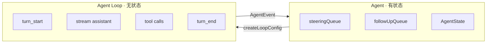
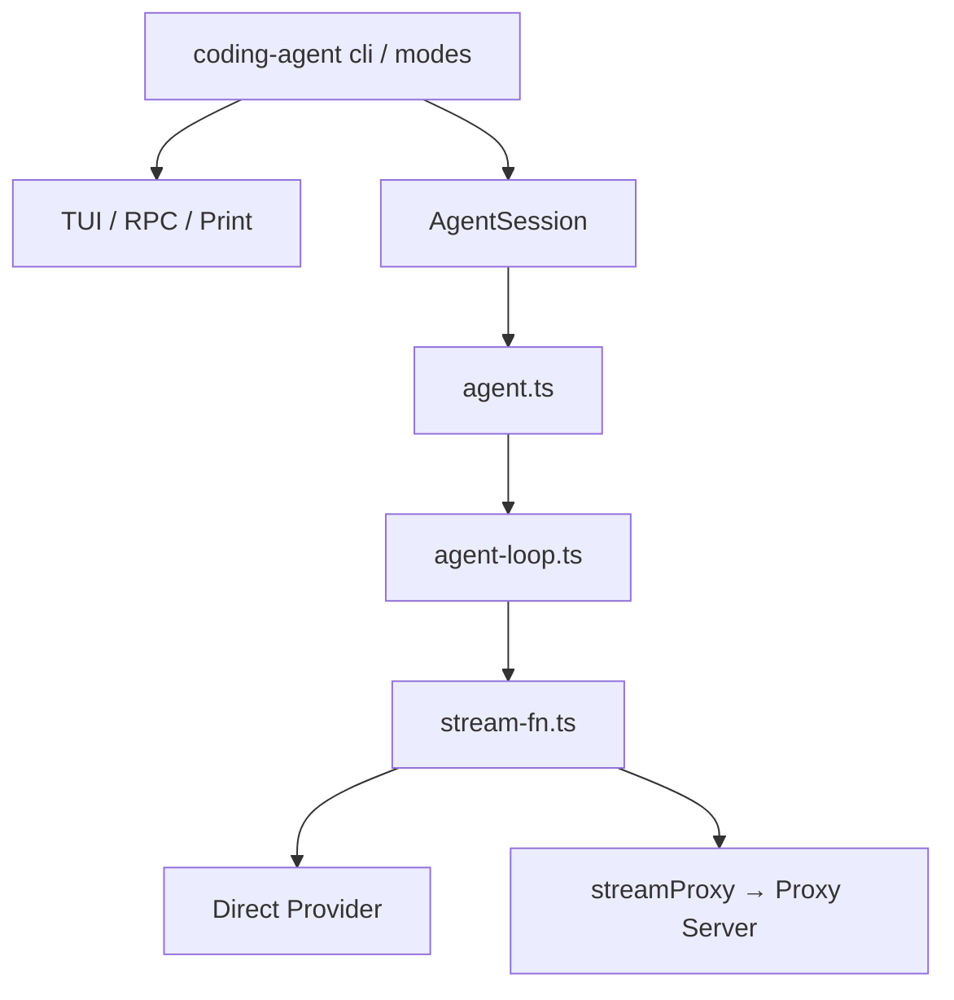
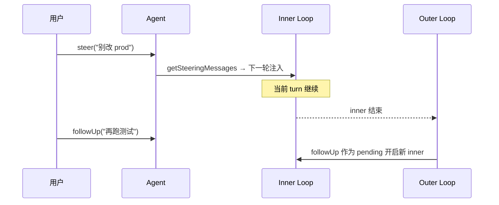

# Pi Agent 设计思想导读（九幕）

> **阅读方式**：先读本导读（~30 分钟）→ [ARCHITECTURE.md Part I](./ARCHITECTURE.md#part-i--高层架构) → Part II 源码深潜  
> **树形 / JSONL**：[JSONL_TREE_GUIDE.md](./JSONL_TREE_GUIDE.md)  
> **跨项目对照**：[CROSS_AGENT_CONCEPT_MAP.md](../../docs/agent-doc-template/CROSS_AGENT_CONCEPT_MAP.md)  
> **外部参考**：[Pi 设计思想图解](https://mp.weixin.qq.com/s/WB24MCub0fosrhZOlEiSAQ)（微信公众号；本文以本仓库源码为准）

---

## 第 1 幕：先认识真实源码全景

**一句话**：`pi-agent-core` 不是几个 UI 文件，而是 **最小核心（`packages/agent`）+ 编排壳（`coding-agent`）+ 多扩展边界**。

**为什么先看这里**：设计思想都落在具体文件上；先建立目录地图，后面每一幕才能对上号。

### 模块全景

```text
packages/agent/src/
├── agent.ts              ← 有状态 Agent（队列、生命周期）
├── agent-loop.ts         ← 无状态双层循环
├── stream-fn.ts          ← 模型流式边界
├── proxy.ts              ← 代理壳
├── search/               ← 会话搜索边界
└── harness/              ← 持久化运行时（Session、Lane、JSONL）
```

| 模块 | 职责 | 源码 |
|------|------|------|
| **Agent** | 状态、队列、subscribe | `agent.ts` |
| **Agent Loop** | turn 内 LLM ↔ 工具 | `agent-loop.ts` |
| **Harness** | entries、lanes、commit | `harness/session/` |
| **coding-agent** | CLI、TUI、AgentSession 编排 | `packages/coding-agent/` |

### 深潜

→ [ARCHITECTURE.md §I.0–I.2](./ARCHITECTURE.md#i0-总体框架一页纸) · [§I.8 模块索引](./ARCHITECTURE.md#i8-模块索引全项目)

---

## 第 2 幕：Agent 管状态，Agent Loop 管执行

**一句话**：**Agent 像总控台**，**Agent Loop 像发动机**——管理与执行分离。

| | Agent (`agent.ts`) | Agent Loop (`agent-loop.ts`) |
|--|-------------------|------------------------------|
| **状态** | `AgentState`、messages、tools | 每轮 `AgentContext` 快照 |
| **队列** | `steeringQueue`、`followUpQueue` | 通过 `getSteeringMessages` / `getFollowUpMessages` 注入 |
| **API** | `prompt()`、`continue()`、`abort()`、`steer()`、`followUp()` | `runAgentLoop()`、`runAgentLoopContinue()` |
| **事件** | `subscribe(listener)` | `emit(AgentEvent)` |



### 深潜

→ [ARCHITECTURE.md §I.3](./ARCHITECTURE.md#i3-核心实体设计与协作关系) · [Part II §5–§6](./ARCHITECTURE.md#5-模块二agentagent-loopts--无状态双层循环)

---

## 第 3 幕：一个运行，其实是双层循环

**一句话**：**内循环**解决当前 turn（工具 + steering）；**外循环**在 Agent 将结束时吃掉 **follow-up**。

```156:273:pi/packages/agent/src/agent-loop.ts
async function runLoop(...) {
	let pendingMessages = (await config.getSteeringMessages?.()) || [];
	// Outer loop: continues when queued follow-up messages arrive after agent would stop
	while (true) {
		let hasMoreToolCalls = true;
		// Inner loop: process tool calls and steering messages
		while (hasMoreToolCalls || pendingMessages.length > 0) {
			// ... stream assistant → executeToolCalls → turn_end
			pendingMessages = (await config.getSteeringMessages?.()) || [];
		}
		const followUpMessages = (await config.getFollowUpMessages?.()) || [];
		if (followUpMessages.length > 0) {
			pendingMessages = followUpMessages;
			continue;
		}
		break;
	}
}
```

| 循环 | 触发 | 典型场景 |
|------|------|----------|
| **Inner** | `hasMoreToolCalls` 或 `pendingMessages`（steering） | 工具链、运行中改方向 |
| **Outer** | inner 结束后 `followUpQueue` 非空 | Agent 本要停，再追加一轮任务 |

Inner 步骤：`prepareNextTurn` → 注入 pending → `streamAssistantResponse` → `executeToolCalls` → `turn_end` → 再 poll steering。

### 深潜

→ [ARCHITECTURE.md §I.5 时序](./ARCHITECTURE.md#i5-关键时序图) · [Part II §5](./ARCHITECTURE.md#5-模块二agentagent-loopts--无状态双层循环)

---

## 第 4 幕：pi-agent-core 的依赖关系

**一句话**：**`cli` 总装配**；**agent-loop 只依赖类型上的 tools**；**llm 边界在 stream-fn**。



| 模块 | 运行时依赖 | 类型依赖 |
|------|------------|----------|
| `AgentSession` | `Agent`, `SessionManager`, extensions | harness types |
| `Agent` | `agent-loop`, `stream-fn` | `types.ts` tools |
| `agent-loop` | `stream-fn`, tool execute | `AgentTool` 类型 |

### 深潜

→ [ARCHITECTURE.md §I.2 包依赖](./ARCHITECTURE.md#i2-包依赖与边界) · [EXTENSIONS.md](./EXTENSIONS.md)

---

## 第 5 幕：工具调用经过运行时管线

**一句话**：不是直接 `execute()`，而是 **校验 → beforeToolCall → execute → afterToolCall**，并可 **parallel / sequential**。

```text
toolCall
  → validateToolArguments
  → beforeToolCall → block? → blocked result
  → execute()
  → tool_execution_update（流式参数 diff 等）
  → afterToolCall
  → toolResult（可带 terminate: true）
```

| 配置 | 行为 |
|------|------|
| `toolExecution: "parallel"` | 多工具并发（默认，除非工具声明 sequential） |
| `toolExecution: "sequential"` | 逐个执行 |
| `terminate: true` on all results | 可跳过下一轮自动 LLM（`hasMoreToolCalls = false`） |

Harness 路径另有 **effect gate**（`harness/execution/effect-gate.ts`）：外部副作用在 drive pass 内受控准入。

### 深潜

→ [ARCHITECTURE.md Part II §16 工具系统](./ARCHITECTURE.md#16-工具系统) · `agent-loop.ts` `executeToolCalls`

---

## 第 6 幕：一切变化都变成事件流

**一句话**：Agent **不只返回最终结果**，而是把过程 **持续广播** 给 UI / RPC / 测试。

典型 `AgentEvent` 顺序：

```text
agent_start → turn_start → message_start → message_update* → message_end
  → tool_execution_start → tool_execution_update* → tool_execution_end
  → turn_end → … → agent_end
```

| 消费者 | 用法 |
|--------|------|
| TUI | 流式 assistant、工具进度条 |
| RPC mode | JSONL 事件行 |
| 测试 | `subscribe` 断言事件序 |

### 深潜

→ `packages/agent/src/types.ts` `AgentEvent` · [ARCHITECTURE.md §I.5](./ARCHITECTURE.md#i5-关键时序图)

---

## 第 7 幕：Steering 与 Follow-up

**一句话**：**steering 发生在运行中（inner loop）**；**follow-up 发生在 Agent 本要结束时（outer loop）**。

| | `steer()` | `followUp()` |
|--|-----------|--------------|
| **队列** | `steeringQueue` | `followUpQueue` |
| **注入时机** | turn 内、工具轮之间 | inner 全部结束后 |
| **适合** | 改方向、补约束 | 收尾后再做一步 |
| **API** | `agent.steer(message)` | `agent.followUp(message)` |



### 深潜

→ `agent.ts` `steeringQueue` / `followUpQueue` · [ARCHITECTURE.md §I.5 steering 时序](./ARCHITECTURE.md#i5-关键时序图)

---

## 第 8 幕：Harness 让 Agent 变成可恢复的持久化运行时

**一句话**：**Session + Lane + 三存储**，支撑崩溃恢复、并行 lane、长期运行。

### Session 结构（概念 → 源码）

| 图解概念 | Pi 实现 | 说明 |
|----------|---------|------|
| **Entry Tree** | `Entry` + `parentId` | append-only 对话树 |
| **Facts** | 投影后的 `AgentMessage[]` / compaction summary | 模型所见上下文 |
| **Lanes** | `harness/runtime/lane.ts` | `main` / 子 agent / 并行轨 |
| **Usage Ledger** | `commit` 中 `usage` writes | token / cost 行 |

### 三种持久化

| 存储 | 源码 | 语义 |
|------|------|------|
| **entries** | `EntryWrite` → JSONL / SQLite | append-only，树节点 |
| **registers**（可变状态） | `value` / `list` writes in `commit.ts` | 当前可变键值、列表 |
| **usage ledger** | `insertUsage` | 用量审计 |

### Effect sandwich（Harness drive）

```text
commit intent（规划写入）
  → external effect（工具 / 副作用，经 effect gate）
  → commit settlement（落库、推进 lane 状态机）
```

对应 `harness/runtime/drive/*` 与 `session/commit.ts`。

### 深潜

→ [JSONL_TREE_GUIDE.md](./JSONL_TREE_GUIDE.md) · [ARCHITECTURE.md Part II §3、§7–§8](./ARCHITECTURE.md#3-完整-jsonl-会话文件示例)

---

## 第 9 幕：最小核心，边界可扩展

**一句话**：**Core 只定义最小契约**；Search、Proxy、StreamFn、Harness、Extensions **延迟到边界**。

| 边界 | 能力 |
|------|------|
| **StreamFn** | Direct Provider 或 `streamProxy()` |
| **Search** | `search(text)` → `AsyncIterable<SessionSearchHit>` |
| **Proxy** | 远程模型中转 |
| **Extensions** | 工具、hook、mode、多 agent |

近期增强（产品演进方向，以 changelog 为准）：parallel toolExecution、terminate hooks、search refactor。

### 深潜

→ [EXTENSIONS.md](./EXTENSIONS.md) · [pi-plugins-design.md](./pi-plugins-design.md) · `packages/agent/src/search/` · `proxy.ts`

---

## 阅读路径建议

```text
1. 本文件（九幕）
2. ARCHITECTURE Part I（图表权威）
3. JSONL_TREE_GUIDE（树 + 投影）
4. RUNTIME_PROMPT / SKILLS_LIFECYCLE（按需）
5. ARCHITECTURE Part II（改代码时）
```

## 与微信公众号图解的对应

| 图解页 | 本文件 |
|--------|--------|
| 1 源码全景 | 第 1 幕 |
| 2 Agent vs Loop | 第 2 幕 |
| 3 双层循环 | 第 3 幕 |
| 4 依赖关系 | 第 4 幕 |
| 5 工具管线 | 第 5 幕 |
| 6 事件流 | 第 6 幕 |
| 7 Steering / Follow-up | 第 7 幕 |
| 8 Harness | 第 8 幕 |
| 9 最小核心 | 第 9 幕 |
