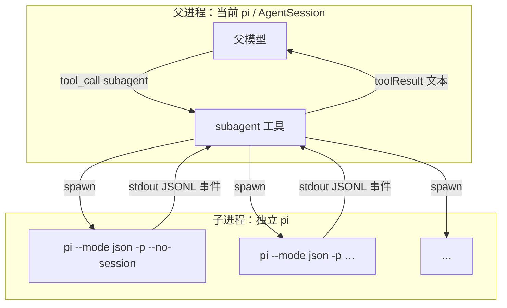
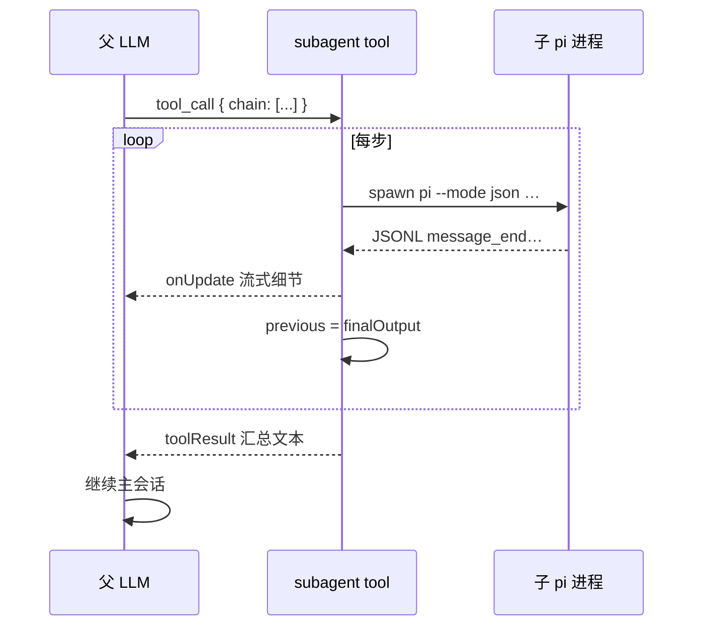
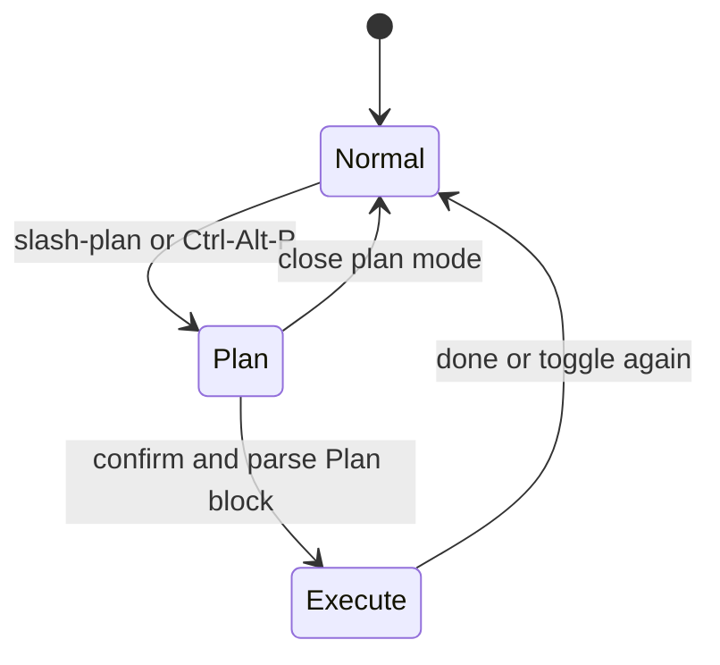
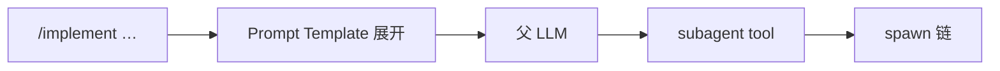

# Pi Extensions：设计、使用与编排深潜

> 源码：`packages/coding-agent/src/core/extensions/`  
> 官方教程：`packages/coding-agent/docs/extensions.md`  
> 示例：`packages/coding-agent/examples/extensions/`  
> **阅读方式**：先读 **Part I（Extension 基础）**，再读 **Part II（多 Agent / Plan 编排）**  
> 最后更新：2026-08-04

---

## 文档结构

| 部分 | 受众 | 内容 |
|------|------|------|
| **Part I** | 扩展作者、新贡献者 | 是什么、架构、事件、安装、示例、安全 |
| **Part II** | 做编排 / 多 Agent 的开发者 | Subagent、Plan-mode、Template 工作流、设计提炼 |

---

## Part I 目录

- [I.1 是什么？](#i1-是什么)
- [I.2 如何设计（架构）](#i2-如何设计架构)
- [I.3 如何使用](#i3-如何使用)
- [I.4 设计心智模型](#i4-设计心智模型)

## Part II 目录

- [II.1 内核缺什么，扩展补什么](#ii1-内核缺什么扩展补什么)
- [II.2 编排所需的钩子（对照表）](#ii2-编排所需的钩子对照表)
- [II.3 方案 A：Subagent —— 进程隔离多 Agent](#ii3-方案-asubagent--进程隔离多-agent)
- [II.4 方案 B：Plan Mode —— 同进程策略编排](#ii4-方案-bplan-mode--同进程策略编排)
- [II.5 方案 C：Prompt Template 编排工作流](#ii5-方案-cprompt-template-编排工作流)
- [II.6 三种编排模型对比](#ii6-三种编排模型对比)
- [II.7 扩展体系如何支撑编排（设计提炼）](#ii7-扩展体系如何支撑编排设计提炼)
- [II.8 若你要自己做编排：最小配方](#ii8-若你要自己做编排最小配方)
- [II.9 源码与相关文档](#ii9-源码与相关文档)

---

# Part I · Extension 基础

## I.1 是什么？

**Extension（扩展）** 是一个 TypeScript 模块，在 Pi 启动时被加载，通过 **`ExtensionAPI`（约定上叫 `pi`）** 挂到 AgentSession 生命周期上。

它不是子进程，也不是 MCP 服务器，而是 **跑在 Pi 同进程里的插件**：能拦工具、改上下文、注册新工具/命令、画 TUI、写会话状态。

```text
┌─────────────────────────────────────────────────────────┐
│  AgentSession（编排）                                     │
│     ↕ ExtensionRunner.emit(event)                        │
│  ┌─────────────────────────────────────────────────────┐│
│  │ Extension A  Extension B  Extension C  …            ││
│  │  on(tool_call)  registerTool()  registerCommand()   ││
│  └─────────────────────────────────────────────────────┘│
│     ↕                                                    │
│  Agent → runLoop → LLM / Tools                          │
└─────────────────────────────────────────────────────────┘
```

**和 Skills 的区别：**

| | Extension | Skill |
|--|-----------|-------|
| 形态 | `.ts` 代码 | `SKILL.md` 文档（+ 脚本） |
| 执行方 | **Pi 进程**直接跑你的代码 | **模型**读说明后再调工具 |
| 能力 | 拦工具、注册工具、UI、命令 | 工作流提示、按需加载 |
| 权限 | 与 `pi` 同权限（危险） | 间接，靠模型是否听话 |

---

## I.2 如何设计（架构）

### I.2.1 三层组件

| 组件 | 文件 | 职责 |
|------|------|------|
| **Loader** | `extensions/loader.ts` | 发现路径、用 jiti 加载 TS、收集注册表 |
| **Runner** | `extensions/runner.ts` | `emit(event)` 顺序调用 handler、合并返回值 |
| **Types / API** | `extensions/types.ts` | `ExtensionAPI`、事件类型、`ToolDefinition`、`ExtensionContext` |

### I.2.2 设计原则

1. **事件驱动，不直接改 `Agent` 内部**  
   扩展只能通过 `pi.on(...)` 的返回值 / `register*` 影响行为。

2. **顺序链式**  
   同一事件上多个扩展按加载顺序执行；结果可合并（如多个 handler 改 `args`）。

3. **错误隔离**  
   单个扩展抛错 → 上报 → 默认继续（不拖死整个 session）。

4. **模式感知 UI**  
   `ctx.ui` 在 TUI / Print / RPC 下实现不同；Print 模式可能是 no-op。

5. **会话可持久化扩展状态**  
   `pi.appendEntry({ type: "custom", ... })` 写入 JSONL，分支时自动跟着树走。

### I.2.3 扩展能注册什么（能力矩阵）

| API | 作用 |
|-----|------|
| `pi.on(event, handler)` | 订阅生命周期事件 |
| `pi.registerTool(def)` | 给 LLM 新工具（进 tools schema） |
| `pi.registerCommand(name, …)` | 用户 `/command` |
| `pi.registerShortcut(…)` | 快捷键 |
| `pi.registerProvider(…)` | 自定义 LLM Provider |
| `pi.registerFlag(…)` | CLI 标志 |
| `ctx.ui.*` | notify / confirm / select / custom TUI |
| `pi.appendEntry(…)` | 持久化自定义 entry |
| `setActiveTools` / `getActiveTools` | 动态切换活跃工具集（重建 system + tools） |

### I.2.4 事件生命周期


| 事件 | 典型用途 | 可返回 |
|------|----------|--------|
| `input` | 改写用户输入 / 自行处理 | `continue` / `transform` / `handled` |
| `before_agent_start` | 注入消息、改 systemPrompt | `{ messages?, systemPrompt? }` |
| `context` | 每次调 LLM 前改消息列表 | `{ messages? }` |
| `tool_call` | 权限门、改参、拦截 | `{ block?, reason?, args? }` |
| `tool_result` | 改写工具结果 | `{ content?, isError? }` |
| `session_before_compact` | 自定义压缩 | `{ cancel?, compaction? }` |
| `agent_settled` | 收尾、通知 | — |

完整事件表见官方 `packages/coding-agent/docs/extensions.md`。架构总册见 [ARCHITECTURE.md](./ARCHITECTURE.md) Part II §14。

### I.2.5 与核心循环的挂钩点

```text
用户输入
  → ExtensionRunner.emitInput          ← 可短路
  → emitBeforeAgentStart               ← 可改 system / 注入消息
  → Agent.prompt → runLoop
       → transformContext ← emit(context)
       → convertToLlm → StreamFn
       → beforeToolCall ← emit(tool_call)
       → tool.execute
       → afterToolCall ← emit(tool_result)
  → message_end 持久化
  → emit(agent_settled)
```

**设计要点**：扩展 **不能** 改 `runLoop`；编排通过 **工具表面**（LLM 可调）和 **策略表面**（拦工具 / 改消息 / 改活跃工具集）实现。详见 [II.7](#ii7-扩展体系如何支撑编排设计提炼)。

---

## I.3 如何使用

### I.3.1 放哪里

| 路径 | 范围 |
|------|------|
| `~/.pi/agent/extensions/*.ts` | 全局 |
| `~/.pi/agent/extensions/*/index.ts` | 全局（目录） |
| `.pi/extensions/*.ts` | 项目（需信任项目） |
| `pi -e ./my-ext.ts` | 临时测试 |
| Pi Package 的 `extensions/` | `pi install` 安装 |

改完后在交互模式可用 **`/reload`** 热重载（自动发现目录内的扩展）。

### I.3.2 最小例子

`~/.pi/agent/extensions/hello.ts`：

```typescript
import type { ExtensionAPI } from "@earendil-works/pi-coding-agent";
import { Type } from "typebox";

export default function (pi: ExtensionAPI) {
  pi.on("session_start", async (_e, ctx) => {
    ctx.ui.notify("hello extension loaded", "info");
  });

  pi.on("tool_call", async (event, ctx) => {
    if (event.toolName === "bash" && String(event.input.command ?? "").includes("rm -rf")) {
      const ok = await ctx.ui.confirm("危险操作", "允许执行 rm -rf？");
      if (!ok) return { block: true, reason: "用户拒绝" };
    }
  });

  pi.registerTool({
    name: "greet",
    label: "Greet",
    description: "Greet someone by name",
    parameters: Type.Object({
      name: Type.String({ description: "Name to greet" }),
    }),
    async execute(_id, params) {
      return {
        content: [{ type: "text", text: `Hello, ${params.name}!` }],
        details: {},
      };
    },
  });

  pi.registerCommand("hello", {
    description: "Say hello",
    handler: async (args, ctx) => {
      ctx.ui.notify(`Hello ${args || "world"}!`, "info");
    },
  });
}
```

运行：

```bash
pi -e ~/.pi/agent/extensions/hello.ts
# 或放入自动发现目录后直接 pi，再 /hello
```

### I.3.3 常见模式 → 官方示例

| 你想做 | 看示例 |
|--------|--------|
| Todo 列表 | `examples/extensions/todo.ts` |
| Plan 模式 | `examples/extensions/plan-mode/`（深潜 [II.4](#ii4-方案-bplan-mode--同进程策略编排)） |
| 多 Agent 编排 | `examples/extensions/subagent/`（深潜 [II.3](#ii3-方案-asubagent--进程隔离多-agent)） |
| 权限门 | `permission-gate.ts`, `confirm-destructive.ts` |
| 保护路径 | `protected-paths.ts` |
| 自定义压缩 | `custom-compaction.ts` |
| 沙箱 / SSH | `sandbox/`, `ssh.ts`, `gondolin/` |

### I.3.4 安全注意

- 扩展 = **任意代码 + 你的用户权限**  
- 只装信任来源；`pi install` 的 package 同理  
- 项目 `.pi/extensions` 仅在 **信任该项目** 后加载  

---

## I.4 设计心智模型

> Extension = **对 AgentSession 生命周期的 TypeScript 钩子 + 注册表**；  
> 内核保持最小，Plan / MCP / Todo / Subagent 都用同一套钩子「装上去」，而不是写进 `runLoop`。

---

# Part II · 多 Agent / Plan / 编排

> **结论先行**：Pi **内核没有** Subagent、Plan、编排器。  
> 示例用 **同一套 Extension 设计** 把它们装上去——本节解剖 `examples/extensions/subagent` 与 `plan-mode`，反推扩展体系如何支撑「产品级」能力。

## II.1 内核缺什么，扩展补什么

| 能力 | 内核 | 示例扩展如何补 |
|------|------|----------------|
| 多 Agent 并行/串行 | ❌ | `subagent` **工具** + 子进程 `pi --mode json` |
| 独立上下文窗口 | ❌ | 每个子 agent **新进程、新会话**（`--no-session`） |
| Plan / 只读模式 | ❌ | `setActiveTools` + `tool_call` 拦截 bash |
| 工作流预设 | ❌ | Prompt Template 文案驱动「请调 subagent chain」 |
| Todo / 进度 | ❌ | `appendEntry` + UI widget + 消息标记 |

内核只保证：**单 AgentSession + 工具循环 + 扩展钩子**。  
编排 = **在钩子上写策略**，不是第二套 runtime。

---

## II.2 编排所需的钩子（对照表）

> API 与事件总览见 [I.2](#i2-如何设计架构)。下表为 **Subagent** 与 **Plan-mode** 示例中的实际用法对照。

| 原语 | Subagent 用法 | Plan-mode 用法 |
|------|---------------|----------------|
| `registerTool` | 注册 `subagent` 工具 | — |
| `setActiveTools` | — | 关掉 edit/write |
| `on("tool_call")` | — | 拦危险 bash |
| `on("before_agent_start")` | — | 注入 `[PLAN MODE ACTIVE]` |
| `on("context")` | — | 退出 plan 时滤掉旧 plan 上下文 |
| `on("message_end")` | — | 解析 `Plan:` / `[DONE:n]` |
| `appendEntry` | — | 持久化 plan 状态 |
| `ctx.ui` | 确认项目级 agents；渲染子进程进度 | 通知、进度 widget |
| Prompt Template | `/implement` 等驱动调用链 | — |

---

## II.3 方案 A：Subagent —— 进程隔离多 Agent

路径：`packages/coding-agent/examples/extensions/subagent/`

### II.3.1 架构总览



**不是**内核里的 `runAgent` 递归（对比 Claude Code）。  
**是**：父 agent 调一个普通工具 → 工具里 `child_process.spawn` 再跑一个完整 `pi`。

### II.3.2 Agent 定义（Markdown，不是 Skill）

`agents/scout.md`：

```yaml
---
name: scout
description: Fast codebase recon …
tools: read, grep, find, ls, bash
model: claude-haiku-4-5
---
You are a scout. Quickly investigate…
（system prompt 正文）
```

`agents.ts` → `discoverAgents(cwd, scope)`：

| 字段 | 用途 |
|------|------|
| `name` / `description` | 出现在 `subagent` 工具描述里，供父模型选型 |
| `tools` | 传给子进程 `--tools read,grep,…` |
| `model` | `--model …` |
| `systemPrompt` | 正文写入临时文件，`--append-system-prompt <file>` |
| `source` | `user`（`~/.pi/agent/agents`）或 `project`（`.pi/agents`） |

默认 **只加载 user 级** agents（安全：项目 md 可诱导任意 bash）。`agentScope: "both"` 时交互确认。

### II.3.3 子进程启动参数（核心）

```typescript
const args = ["--mode", "json", "-p", "--no-session"];
if (agent.model) args.push("--model", agent.model);
if (agent.tools?.length) args.push("--tools", agent.tools.join(","));
if (agent.systemPrompt.trim()) {
  // 写临时文件
  args.push("--append-system-prompt", tmpPromptPath);
}
args.push(`Task: ${task}`);

spawn(piCommand, args, { cwd, stdio: ["ignore", "pipe", "pipe"] });
```

| 参数 | 含义 |
|------|------|
| `--mode json` | 子进程 stdout 打 JSON 事件流（给父工具解析） |
| `-p` / print | 非 TUI，跑完退出 |
| `--no-session` | **不写父会话 JSONL** → 上下文隔离 |
| `--tools` | 限制子 agent 工具面（scout 无 write） |
| `--append-system-prompt` | 注入角色提示（不替换整个默认 system，而是追加） |
| 末尾字符串 | 当作用户任务（print 模式消息） |

`getPiInvocation()`：优先复用当前 `node/bun` + 脚本路径，否则回退 `pi` 二进制。

### II.3.4 三种编排模式（工具参数）

父模型调用同一个 `subagent` 工具，三种互斥参数：

| 模式 | 参数 | 行为 |
|------|------|------|
| **Single** | `{ agent, task }` | 一个子进程 |
| **Parallel** | `{ tasks: [{agent,task},…] }` | 最多 8 任务，并发上限 4 |
| **Chain** | `{ chain: [{agent, task},…] }` | 顺序执行；`task` 里 `{previous}` 替换为上一步最终输出 |

Chain 示例语义：

```text
scout → planner（task 含 {previous}）→ worker（再含 {previous}）
```

这就是 **无图引擎的线性编排**：状态 = 上一步 stdout 解析出的最终文本。

### II.3.5 父进程如何消费子进程

1. 读 stdout 行 → `JSON.parse`  
2. 关注 `message_end` 事件，累积 messages / usage  
3. `onUpdate` 把部分结果推给 TUI（折叠视图：工具调用预览 + turns/tokens）  
4. `AbortSignal` → `proc.kill`（Ctrl+C 可传到子进程）  
5. 返回给父模型的 `toolResult`：最终输出文本（并行时每任务 cap 50KB）



### II.3.6 隔离边界（设计意图）

| 维度 | 行为 |
|------|------|
| 上下文 | 全新进程，无父 messages |
| 会话文件 | `--no-session`，不污染父 JSONL |
| 工具 | 子 agent frontmatter 限制 |
| 模型 | 可更便宜（scout → haiku） |
| cwd | 可覆盖（单任务 `cwd`） |
| 失败 | exitCode / stderr 回传父模型 |

**代价**：冷启动、无共享 KV cache、IPC 是文本而非共享内存。

### II.3.7 与「内核嵌套 Agent」对比

| | Pi 示例 Subagent | Claude Code 式 runAgent |
|--|------------------|-------------------------|
| 实现位置 | Extension 工具 | 运行时一等公民 |
| 隔离 | OS 进程 | 同进程隔离上下文 |
| 通信 | JSONL stdout | 内存消息 / task-notification |
| 扩展性 | 换 spawn 策略即可 | 改内核 |

Pi 哲学：**编排策略属于应用层扩展，不属于 harness 内核。**

---

## II.4 方案 B：Plan Mode —— 同进程策略编排

路径：`packages/coding-agent/examples/extensions/plan-mode/`

### II.4.1 两种阶段 = 两种策略配置



| 阶段 | 工具集 | bash | 注入上下文 |
|------|--------|------|------------|
| **Plan** | 去掉 edit/write；保留 read/bash/grep/find/ls… | allowlist 只读 | `[PLAN MODE ACTIVE]…` |
| **Execute** | 恢复全工具 | 正常 | 执行说明 + `[DONE:n]` 约定 |
| **Normal** | 默认 | 正常 | `context` 事件滤掉残留 plan 消息 |

### II.4.2 用到的扩展钩子（逐步）

**① 切换工具面（策略编排核心）**

```typescript
pi.setActiveTools(getPlanModeTools(...));  // 禁用 edit/write
// …
pi.setActiveTools(toolsBeforePlanMode);    // 恢复
```

`setActiveTools` → AgentSession 重建 system + `agent.state.tools`。  
**同一 Agent、同一会话**，只改「能调什么」。

**② 拦工具（二次闸门）**

```typescript
pi.on("tool_call", async (event) => {
  if (!planModeEnabled || event.toolName !== "bash") return;
  if (!isSafeCommand(command))
    return { block: true, reason: "Plan mode: …" };
});
```

即使模型幻觉出 `rm`，也被扩展挡掉。

**③ 注入行为规范（before_agent_start）**

返回 `message: { customType: "plan-mode-context", content: "[PLAN MODE ACTIVE]\n…" }`  
→ 变成进上下文的 custom → convertToLlm 成 user 消息。  
告诉模型：只读、用 questionnaire、输出 `Plan:` 编号列表。

**④ 清洗历史（context）**

退出 plan 后，从本轮 LLM 上下文 **过滤** 含 `[PLAN MODE ACTIVE]` / `plan-mode-context` 的消息，避免模式泄漏。

**⑤ 解析模型输出（message_end）**

- 从 assistant 文本抽 `Plan:\n1. …` → todos  
- 执行阶段认 `[DONE:n]` → 勾选 → 更新 widget  
- UI：`ctx.ui.setWidget("plan-todos", …)` / `setStatus`

**⑥ 持久化（appendEntry）**

```typescript
pi.appendEntry("plan-mode", { enabled, todos, executing, toolsBeforePlanMode });
```

写入 JSONL `custom` entry → resume 会话可恢复 plan 状态（扩展在 session_start 重建内存）。

### II.4.3 Plan 编排的本质

```text
不是多 Agent，而是：
  同一 Agent
  + 动态工具策略（setActiveTools）
  + 工具拦截（tool_call）
  + 提示注入（before_agent_start）
  + 输出协议（Plan: / [DONE:n]）
  + UI 与会话状态
```

这是 **策略机叠在 Extension 上**，不是进程编排。

---

## II.5 方案 C：Prompt Template 编排工作流

`subagent/prompts/implement.md`：

```markdown
---
description: scout → planner → worker
---
Use the subagent tool with the chain parameter…
1. scout …
2. planner … {previous}
3. worker … {previous}
```

用户输入 `/implement add Redis caching`：

1. `expandPromptTemplate` 把模板展开成 **user 消息**  
2. 父模型读到「请用 subagent chain…」  
3. 模型调用 `subagent` 工具  

**编排逻辑在自然语言里**，执行引擎仍是 Extension 工具。  
Template = 工作流 UI/快捷方式；Tool = 执行器。



---

## II.6 三种编排模型对比

| | Subagent 进程链 | Plan 策略机 | Template 驱动 |
|--|-----------------|-------------|---------------|
| 隔离 | 强（新进程） | 无（同会话） | 取决于被调工具 |
| 实现 | registerTool + spawn | setActiveTools + hooks | prompts/*.md |
| 状态传递 | `{previous}` 文本 | 同 messages + todos | 文案引导 |
| 适用 | 侦察/规划/实现分角色 | 安全只读→再改代码 | 一键工作流 |
| 成本 | 多次冷启动 | 低 | 低 |

可组合：`/implement`（Template）→ `subagent` chain（进程）← Plan 管主会话是否只读。

---

## II.7 扩展体系如何支撑编排（设计提炼）

### II.7.1 扩展提供的「编排积木」

| 积木 | API | 编排含义 |
|------|-----|----------|
| **工具表面** | `registerTool` | 把「启动子世界」暴露给 LLM |
| **工具闸门** | `on("tool_call")` | 策略拒绝/改参 |
| **工具目录** | `setActiveTools` | 动态能力剖面 |
| **提示注入** | `before_agent_start` / `context` | 模式说明、清洗历史 |
| **输出协议** | `message_end` 解析 | 从自然语言抽结构化状态 |
| **持久状态** | `appendEntry` | 跨 resume |
| **人机确认** | `ctx.ui.confirm` | 信任边界 |
| **可观测** | `onUpdate` + 自定义 render | 子进程流式 UI |
| **入口糖** | Command / Shortcut / Flag / Template | 用户如何切入编排 |

### II.7.2 为什么不进内核？

官方 Philosophy：子 agent / plan「有很多做法」。  
示例证明：**扩展表面足够表达** 进程编排与策略编排，内核保持：

- 单循环 `runLoop`  
- 单会话树  
- 通用钩子  

换隔离模型（线程内嵌套 Agent、远程 worker）只需换 Extension，不必 fork Pi。

### II.7.3 与 Skills 的协作关系

```text
Skill          → 教模型「怎么做一件专业事」（读说明书）
Prompt Template→ 教模型「调哪个编排工具、什么顺序」
Extension Tool → 真正执行编排（spawn / 改工具集）
Extension Hook → 强制策略（拦 bash、注入模式）
```

四层叠在一起才是完整「产品工作流」；**内核只提供后两者的挂钩点 + Skill/Template 加载器**。

---

## II.8 若你要自己做编排：最小配方

### 进程型多 Agent（抄 subagent）

1. `registerTool("my_crew", …)`  
2. `spawn("pi", ["--mode","json","-p","--no-session", …])`  
3. 解析 JSONL → `toolResult`  
4. 用 frontmatter md 定义角色  

### 同会话 Plan（抄 plan-mode）

1. `setActiveTools` 切换剖面  
2. `on("tool_call")` 二次过滤  
3. `before_agent_start` 注入模式文案  
4. `message_end` 解析协议标记  
5. `appendEntry` 持久化  

### 工作流入口

1. 写 `prompts/foo.md` 描述调用顺序  
2. 用户 `/foo` → 模型调你的工具  

---

## II.9 源码与相关文档

| 主题 | 路径 |
|------|------|
| Subagent 扩展 | `examples/extensions/subagent/index.ts` |
| Agent 发现 | `examples/extensions/subagent/agents.ts` |
| 角色定义 | `examples/extensions/subagent/agents/*.md` |
| 工作流模板 | `examples/extensions/subagent/prompts/*.md` |
| Plan 扩展 | `examples/extensions/plan-mode/index.ts` |
| Extension 源码 | `packages/coding-agent/src/core/extensions/` |
| Skill 流程 | [SKILLS_LIFECYCLE.md](./SKILLS_LIFECYCLE.md) |
| 运行时 prompt | [RUNTIME_PROMPT.md](./RUNTIME_PROMPT.md) |
| 架构总册 | [ARCHITECTURE.md](./ARCHITECTURE.md) Part I §I.9、Part II §14 |
| 官方长文 | `packages/coding-agent/docs/extensions.md` |

---

## 一句话

> Pi 的「多 Agent / 编排 / Plan」= **Extension 工具与钩子的应用模式**：  
> **Subagent** 用子进程换隔离上下文；**Plan** 用工具集+拦截换安全策略；**Template** 用自然语言把两者串成工作流——三者都建立在同一套 Extension 设计上，而不是第二套内核。
