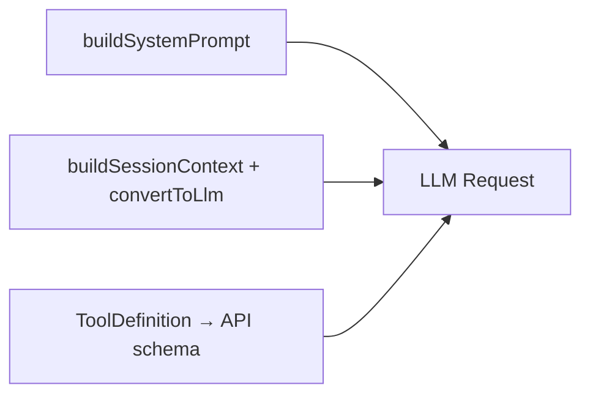

# Pi 发给大模型的完整运行时 Prompt

> 目标：还原 **一次 LLM 请求** 里模型实际看到的全部内容。  
> 源码锚点：`system-prompt.ts`、`skills.ts`、`messages.ts`、`tools/*`、`agent-loop.ts`  
> 说明：下文中的 system / messages 字面量已译为中文便于阅读；**运行时源码仍为英文**。  
> 最后更新：2026-07-28

---

## 0. 请求长什么样（不是只有 system）

Pi 调模型时（经 `convertToLlm` + `StreamFn`）本质是：

```json
{
  "model": "<provider/model-id>",
  "system": "<见 §1 System Prompt>",
  "messages": [ "<见 §2 Messages，已是 user/assistant/toolResult>" ],
  "tools": [ "<见 §3 Tools JSON Schema>" ]
}
```

另外还有 Provider 级参数（thinking level、max tokens、headers 等），**不算 prompt 正文**，此处不展开。


# PI 框架：完整构建 LLM Request 请求全流程（含各环节职责、输入输出）

>
> 整体目标：从会话持久文件（jsonl + memory.md）→ 组装成符合大模型厂商规范的完整 API 请求体，用于调用 LLM
> 前置说明：每一轮 LLM 调用前，都会完整执行这套投影构建链路（`continue()` 重试 / `prompt()` 新会话 都会走）

## 完整时序总览

```
1. buildContextEntries 【筛选原始可信事件】
        ↓
2. buildSessionContext 【投影框架统一消息视图 + 注入长期记忆 memory.md】
        ↓
3. convertToLlm 【框架消息 → 厂商原生消息格式】
        ↓
4. buildSystemPrompt 【构建系统提示词】
        ↓
5. ToolDefinition 转换为工具 schema 【工具描述组装】
        ↓
6. 合并全部组件，组装完整 LLM Request
        ↓
7. before_provider_headers / before_provider_request Hook 拦截修改请求
        ↓
8. 发送 HTTP 请求给 LLM 服务商
```

---

## 分步详解：输入、输出、核心作用、关键规则

### 1. buildContextEntries

✅ **定位**：会话 DAG 原始事件筛选层

- 输入：当前会话 leafId（活跃分支末端节点）、完整会话树（jsonl 持久化的所有 SessionEntry）
- 作用：
    1. 沿着 parentId 回溯整条会话分支，收集所有 SessionEntry
    2. 识别分支上所有 `CompactionEntry`（压缩切点），按规则裁剪：保留摘要 + 切点之后未压缩的原始事件
    3. 输出裁剪后、本轮上下文可用的原始事件数组
- 输出：`SessionEntry[]`（可信原始事件，包含消息、压缩记录、模型变更事件等）

>
> ⚠️ 本阶段**不转换消息格式，不加载 memory.md，不做摘要计算**，只做切片筛选

### 2. buildSessionContext

✅ **定位**：统一消息视图投影层（短期会话 + 长期记忆合并点，memory.md 在这里接入）

- 输入：`SessionEntry[]`（上一步筛选后的事件）
- 作用：
    1. 遍历 SessionEntry，映射为框架统一消息 `AgentMessage`：
        - SessionMessageEntry → user/assistant/tool/tool_result AgentMessage
        - CompactionEntry → 生成摘要占位 AgentMessage
        - model_change /thinking_level_change：提取配置，覆盖本轮运行参数，不进入消息列表
    2. 【长期记忆接入】读取独立文件 `memory.md`（跨会话长期记忆），封装为 AgentMessage，追加到消息头部（可选，业务控制是否注入）
    3. 输出结构化上下文：`{ messages: AgentMessage[], model, thinkingLevel }`
- 输出：`AgentMessage[]`（本轮完整对话视图 = 短期会话历史 + 可选长期记忆 memory.md）

>
> ✅ 红框中 `buildSessionContext` 负责产出框架内部标准消息数组

### 3. convertToLlm

✅ **定位**：消息格式适配层

- 输入：`AgentMessage[]`（框架统一消息视图）
- 作用：把框架自定义的 AgentMessage，翻译成各大 LLM 厂商兼容的原生消息结构（OpenAI / Anthropic 等消息数组规范）
- 输出：厂商标准消息数组 `Array<ChatMessage>`

>
> ✅ 红框中 `convertToLlm` 完成消息的厂商适配，两者共同构成对话上下文部分

### 4. buildSystemPrompt

✅ **定位**：系统提示组装层

- 输入：会话配置、技能模板、agent 角色定义、thinkingLevel
- 作用：拼接角色指令、行为约束、能力边界，生成完整 system 系统提示词
- 输出：system prompt 字符串

### 5. ToolDefinition → API schema

✅ **定位**：工具描述组装层

- 输入：当前 Agent 挂载的所有 ToolDefinition（工具名称、描述、入参 json schema）
- 作用：转换为 LLM 可识别的 function /tool call schema 定义，告知大模型可以调用哪些工具
- 输出：厂商标准 tools 数组

### 6. 合并组装完整 LLM Request

把前面三部分合并：

1. system prompt
2. convertToLlm 产出的对话消息数组
3. tools 工具 schema
   额外补充：temperature、max_tokens、thinking 参数等模型运行配置

>
> 得到完整请求 payload

### 7. Hook 扩展拦截（可选修改请求）

1. `before_provider_headers`：修改 HTTP 请求头
2. `before_provider_request`：拦截完整 payload，替换、修改最终请求体（最高权限扩展点）

### 8. 发送 HTTP 请求，调用大模型服务

---

# 关键概念边界澄清

1. **memory.md 位置**：`buildSessionContext` 阶段加载注入，属于**长期记忆**
    - 不会存入会话 jsonl，不属于 SessionEntry
    - 压缩 Compaction 只处理短期会话的 SessionEntry，**不会自动压缩 memory.md**
2. **压缩流程在链路中的位置**
   压缩是在上一轮 run 结束后的 `_handlePostAgentRun` / `continue()` 前置执行，追加 CompactionEntry；
   本轮构建请求时，由 `buildContextEntries` 识别压缩切点，自动裁剪历史。
3. **和 Hook 的联动**
    - `context` Hook：在 buildSessionContext 之后、convertToLlm 之前，临时裁剪 / 修改 AgentMessage 视图（临时生效，不持久化）
    - `before_provider_request`：最终 payload 修改，离发送最近的拦截点

# 补充：两种调用入口，本链路执行差异

1. `session.prompt()`：全新一轮 run，追加用户 SessionMessageEntry，完整执行整套构建链路
2. `continue()`：本轮 run 内部重试（压缩后重试 LLM），不新增用户消息，仍然完整执行：buildContextEntries → buildSessionContext → convertToLlm 投影新上下文，再发起 LLM 请求
---

## 1. System Prompt（完整默认模板）

由 `buildSystemPrompt()` 组装。默认路径（无 `customPrompt`）结构如下。

### 1.1 骨架（源码字面量 · 中文译写）

```text
你是一名专家级编程助手，运行在 pi（一套 coding agent 运行时）中。你通过读取文件、执行命令、编辑代码和写入新文件来帮助用户。

可用工具：
- read：读取文件内容
- bash：执行 bash 命令（ls、grep、find 等）
- edit：用精确文本替换做文件编辑，一次调用可包含多处互不重叠的修改
- write：创建或覆盖文件
[若启用 find/grep/ls，且提供了 promptSnippet，则追加对应行]
[扩展工具仅当 registerTool 时带了 promptSnippet 才会出现在此列表]

除上述工具外，按项目情况你还可能用到其他自定义工具。

指南：
- 用 bash 做 ls、rg、find 这类文件操作
  （仅当只有 bash、没有独立 grep/find/ls 工具时）
- 用 read 查看文件，不要用 cat 或 sed。
- 查看 PI_* 环境变量以了解当前模型和会话详情。
  （bash 工具默认开启 exposeSessionEnvironment 时）
- 用 edit 做精确修改（edits[].oldText 必须与原文完全一致）
- 同一文件多处互不相关的修改，请在一次 edit 调用的 edits[] 里写多项，不要多次调用 edit
- 每一项 edits[].oldText 都对照原始文件匹配，而不是在前面的 edit 已经应用之后。不要产出重叠或嵌套的 edit。相近改动请合并为一项。
- edits[].oldText 尽量短，但仍须在文件中唯一。不要用大段未改动区域来「垫高」匹配串。
- write 仅用于新建文件或整文件重写。
- 回复保持简洁
- 处理文件时清晰展示文件路径
[扩展工具的 promptGuidelines 也会并入这里]

Pi 文档（仅当用户询问 pi 本身、其 SDK、扩展、主题、skills 或 TUI 时再读）：
- 主文档：<绝对路径>/packages/coding-agent/README.md
- 附加文档：<绝对路径>/packages/coding-agent/docs
- 示例：<绝对路径>/packages/coding-agent/examples（扩展、自定义工具、SDK）
- 阅读 pi 文档或示例时：把 docs/... 解析到「附加文档」下，把 examples/... 解析到「示例」下，不要相对当前工作目录
- 被问及时可查：扩展（docs/extensions.md、examples/extensions/）、主题（docs/themes.md）、skills（docs/skills.md）、提示词模板（docs/prompt-templates.md）、TUI 组件（docs/tui.md）、快捷键（docs/keybindings.md）、SDK 集成（docs/sdk.md）、自定义 Provider（docs/custom-provider.md）、添加模型（docs/models.md）、pi 包（docs/packages.md）、环境变量（docs/environment-variables.md）
- 处理 pi 相关话题时，先读文档和示例，并沿 .md 交叉引用再动手实现
- 务必完整阅读 pi 的 .md 文件，并跟随链接到相关文档（例如 TUI API 细节见 tui.md）

[可选 appendSystemPrompt —— 设置 / 扩展追加]

[可选 project_context —— 见 §1.2]

[可选 available_skills —— 见 §1.3，且仅当 read 工具可用]

当前工作目录：/path/to/project
```

**要点：**

- 「可用工具」只是 **一行摘要**；真正的参数 schema 在请求的 `tools` 字段（§3）。  
- 工具没提供 `promptSnippet` → **不会**进可用工具列表（扩展工具常如此）。  
- 「回复保持简洁」/「清晰展示文件路径」**恒定**加入指南。

### 1.2 `<project_context>`（有 AGENTS.md 等时）

```text
<project_context>

项目专属说明与指南：

<project_instructions path="/abs/path/AGENTS.md">
（文件全文）
</project_instructions>

</project_context>
```

可有多个 `project_instructions`（多份 context file）。

### 1.3 Skills 段（`formatSkillsForPrompt`）

```text


下列 skills 为特定任务提供专用说明。
当任务与某 skill 的描述匹配时，用 read 工具加载该 skill 文件。
skill 文件中的相对路径，请相对 skill 目录解析（SKILL.md 的父目录 / 该路径的 dirname），并在工具命令中使用解析后的绝对路径。

<available_skills>
  <skill>
    <name>pdf-tools</name>
    <description>提取与处理 PDF 文件</description>
    <location>/Users/you/.pi/agent/skills/pdf-tools/SKILL.md</location>
  </skill>
  …
</available_skills>
```

- `disableModelInvocation: true` 的 skill **不进**此段（只能 `/skill:name`）。  
- 只有 **name / description / location**，**没有** SKILL.md 正文（渐进披露）。

### 1.4 自定义 system prompt

若 ResourceLoader / 设置提供了 **整段替换** `customPrompt`：

- 用自定义正文替换默认「你是一名专家级编程助手…」整段  
- **仍追加**：`appendSystemPrompt`、`project_context`、skills、`当前工作目录`

### 1.5 运行时可被扩展改写

`before_agent_start` 可返回 `systemPrompt`，覆盖本轮 `Agent.state.systemPrompt`（见 AgentSession）。  
`context` 事件只改 **messages**，不改 system。

---

## 2. Messages（对话历史，发给模型前）

### 2.1 构建管道

```text
SessionManager 树 (SessionEntry[])
  → buildContextEntries()     // 压缩感知截断
  → flatMap(sessionEntryToContextMessages)
  → AgentMessage[]
  → transformContext()        // 扩展 context 钩子
  → convertToLlm()
  → Message[]                 // 仅 user | assistant | toolResult
```

### 2.2 各类型变成什么

| AgentMessage.role | convertToLlm 结果 |
|-------------------|-------------------|
| `user` / `assistant` / `toolResult` | 原样 |
| `bashExecution`（用户 `!` 命令） | `user`：`已执行 \`cmd\`\n\`\`\`\noutput\`\`\`` |
| `bashExecution` + `excludeFromContext`（`!!`） | **丢弃** |
| `custom` | `user`：扩展注入文本 |
| `compactionSummary` | `user`：见下方前缀/后缀 |
| `branchSummary` | `user`：分支摘要包裹 |

### 2.3 压缩摘要消息（完整字面量 · 中文译写）

```text
此点之前的对话历史已压缩为如下摘要：

<summary>
（LLM 生成的 summary 正文，可能含 <read-files> 等）
</summary>
```

### 2.4 分支摘要消息

```text
以下是本对话曾离开又返回的那条分支的摘要：

<summary>
（分支摘要正文）
</summary>
```

### 2.5 一轮典型 messages 示例（压缩后）

```json
[
  {
    "role": "user",
    "content": [
      {
        "type": "text",
        "text": "此点之前的对话历史已压缩为如下摘要：\n\n<summary>\n用户在项目里改了端口…\n</summary>"
      }
    ]
  },
  {
    "role": "user",
    "content": [{ "type": "text", "text": "再加一个 health check" }]
  },
  {
    "role": "assistant",
    "content": [
      { "type": "text", "text": "好的，我来加。" },
      {
        "type": "toolCall",
        "id": "call_1",
        "name": "read",
        "arguments": { "path": "src/index.ts" }
      }
    ]
  },
  {
    "role": "toolResult",
    "toolCallId": "call_1",
    "content": [{ "type": "text", "text": "1: …" }],
    "isError": false
  }
]
```

---

## 3. Tools（与 system 并列的 schema）

每个活跃 `ToolDefinition` 转成 Provider tool spec，大致：

```json
{
  "name": "read",
  "description": "读取文件内容。支持文本文件与图片 …",
  "parameters": { "$schema": "…", "type": "object", "properties": { "path": …, "offset": …, "limit": … } }
}
```

### 3.1 默认内置工具（名称 + description 来源）

| name | description（摘要） | promptSnippet（进 system 列表） |
|------|---------------------|--------------------------------|
| `read` | 读文件；支持图片；有行数/字节截断 | 读取文件内容 |
| `bash` | 执行 bash；stdout/stderr；截断与超时 | 执行 bash 命令… |
| `edit` | 精确字符串替换；可多段 edits[] | 精确文件编辑… |
| `write` | 新建/整文件覆盖 | 创建或覆盖文件 |
| `find` / `grep` / `ls` | 可选启用 | 各自一句 snippet |

**完整 `description` 以各 `tools/*.ts` 中 `ToolDefinition.description` 为准**（比 system 里一行 snippet 长得多）。模型主要靠 **tools[].description + parameters** 学会怎么调工具。

### 3.2 扩展工具

`pi.registerTool({ name, description, parameters, … })` → 同样进入本次请求的 `tools` 数组。

---

## 4. 拼成「一次完整请求」的文字还原

下面是一次 **默认四工具 + 一个 skill + 一份 AGENTS.md + 用户一句话** 时，模型侧「逻辑视图」（system 为字符串，messages/tools 为结构）：

### System（字符串）

```text
你是一名专家级编程助手，运行在 pi（一套 coding agent 运行时）中。你通过读取文件、执行命令、编辑代码和写入新文件来帮助用户。

可用工具：
- read：读取文件内容
- bash：执行 bash 命令（ls、grep、find 等）
- edit：用精确文本替换做文件编辑，一次调用可包含多处互不重叠的修改
- write：创建或覆盖文件

除上述工具外，按项目情况你还可能用到其他自定义工具。

指南：
- 用 bash 做 ls、rg、find 这类文件操作
- 用 read 查看文件，不要用 cat 或 sed。
- 查看 PI_* 环境变量以了解当前模型和会话详情。
- 用 edit 做精确修改（edits[].oldText 必须与原文完全一致）
- 同一文件多处互不相关的修改，请在一次 edit 调用的 edits[] 里写多项，不要多次调用 edit
- 每一项 edits[].oldText 都对照原始文件匹配，而不是在前面的 edit 已经应用之后。不要产出重叠或嵌套的 edit。相近改动请合并为一项。
- edits[].oldText 尽量短，但仍须在文件中唯一。不要用大段未改动区域来「垫高」匹配串。
- write 仅用于新建文件或整文件重写。
- 回复保持简洁
- 处理文件时清晰展示文件路径

Pi 文档（仅当用户询问 pi 本身、其 SDK、扩展、主题、skills 或 TUI 时再读）：
- 主文档：/…/packages/coding-agent/README.md
- 附加文档：/…/packages/coding-agent/docs
- 示例：/…/packages/coding-agent/examples（扩展、自定义工具、SDK）
- 阅读 pi 文档或示例时：把 docs/... 解析到「附加文档」下，把 examples/... 解析到「示例」下，不要相对当前工作目录
- 被问及时可查：扩展（docs/extensions.md、examples/extensions/）、主题（docs/themes.md）、skills（docs/skills.md）、提示词模板（docs/prompt-templates.md）、TUI 组件（docs/tui.md）、快捷键（docs/keybindings.md）、SDK 集成（docs/sdk.md）、自定义 Provider（docs/custom-provider.md）、添加模型（docs/models.md）、pi 包（docs/packages.md）、环境变量（docs/environment-variables.md）
- 处理 pi 相关话题时，先读文档和示例，并沿 .md 交叉引用再动手实现
- 务必完整阅读 pi 的 .md 文件，并跟随链接到相关文档（例如 TUI API 细节见 tui.md）

<project_context>

项目专属说明与指南：

<project_instructions path="/proj/AGENTS.md">
# 项目规则
使用 TypeScript strict 模式。
</project_instructions>

</project_context>


下列 skills 为特定任务提供专用说明。
当任务与某 skill 的描述匹配时，用 read 工具加载该 skill 文件。
skill 文件中的相对路径，请相对 skill 目录解析（SKILL.md 的父目录 / 该路径的 dirname），并在工具命令中使用解析后的绝对路径。

<available_skills>
  <skill>
    <name>example-skill</name>
    <description>示例 skill 描述</description>
    <location>/Users/you/.pi/agent/skills/example-skill/SKILL.md</location>
  </skill>
</available_skills>
当前工作目录：/proj
```

### Messages

```json
[
  {
    "role": "user",
    "content": [{ "type": "text", "text": "帮我读一下 src/index.ts" }]
  }
]
```

### Tools

```json
[
  { "name": "read", "description": "读取文件内容。…", "parameters": { "…" } },
  { "name": "bash", "description": "执行一条 bash 命令。…", "parameters": { "…" } },
  { "name": "edit", "description": "用精确文本替换编辑单个文件。…", "parameters": { "…" } },
  { "name": "write", "description": "…", "parameters": { "…" } }
]
```

（`parameters` 完整 JSON Schema 见各 `packages/coding-agent/src/core/tools/*.ts` 中 TypeBox schema。）

---

## 5. 谁在何时重建 System

| 时机 | 行为 |
|------|------|
| 会话启动 / 工具集变更 | `_rebuildSystemPrompt(activeToolNames)` |
| 扩展注册/注销工具 | 同上 |
| `before_agent_start` 返回 `systemPrompt` | **本轮**覆盖，跑完清掉 override |
| 每 turn `prepareNextTurn` | 使用 `_systemPromptOverride ?? _baseSystemPrompt` |

---

## 6. 与「Prompt 文档」相关的源码索引

| 内容 | 文件 |
|------|------|
| System 组装 | `core/system-prompt.ts` → `buildSystemPrompt` |
| Skills XML | `core/skills.ts` → `formatSkillsForPrompt` |
| 历史转换 | `core/messages.ts` → `convertToLlm` |
| 压缩前后缀 | `COMPACTION_SUMMARY_PREFIX/SUFFIX` |
| 工具 description / snippet / guidelines | `core/tools/{read,bash,edit,write,…}.ts` |
| 注入点 | `core/agent-session.ts` → `_rebuildSystemPrompt` |
| 发给 Provider | `agent-loop.ts` → `streamFunction(model, { systemPrompt, messages, tools })` |

---

## 7. 刻意不在 System 里的东西

| 内容 | 去哪了 |
|------|--------|
| 工具完整参数定义 | `tools[]` schema |
| 会话 JSONL 元数据（model_change、leaf…） | 不投影进 messages |
| Skill 全文 | 模型自己 `read` location |
| Extension 源码 | 不进 prompt；只通过钩子改行为/注册工具 |
| 用户 `!!` bash | `excludeFromContext`，不进 messages |

---

**一句话**：发给大模型的 = **`system`（角色+工具摘要+指南+文档路径+项目上下文+skills 索引+cwd）+ `messages`（投影并 convert 后的对话）+ `tools`（完整 JSON Schema）**。
