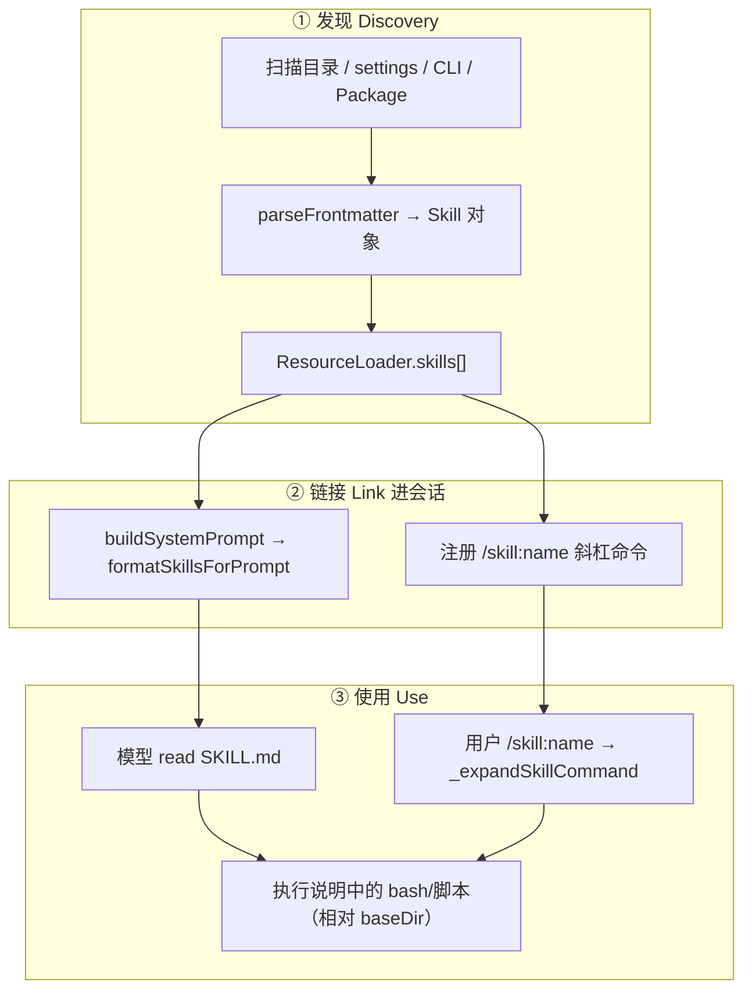
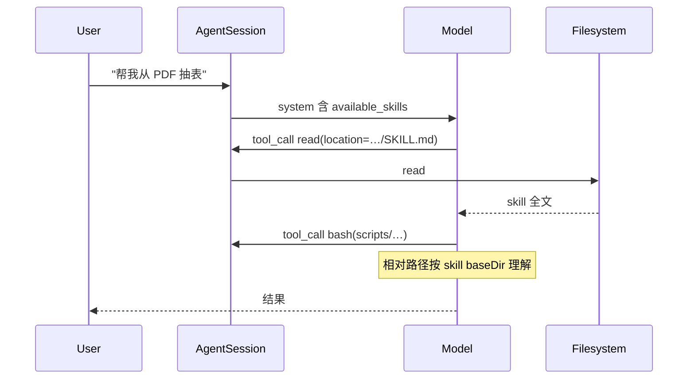
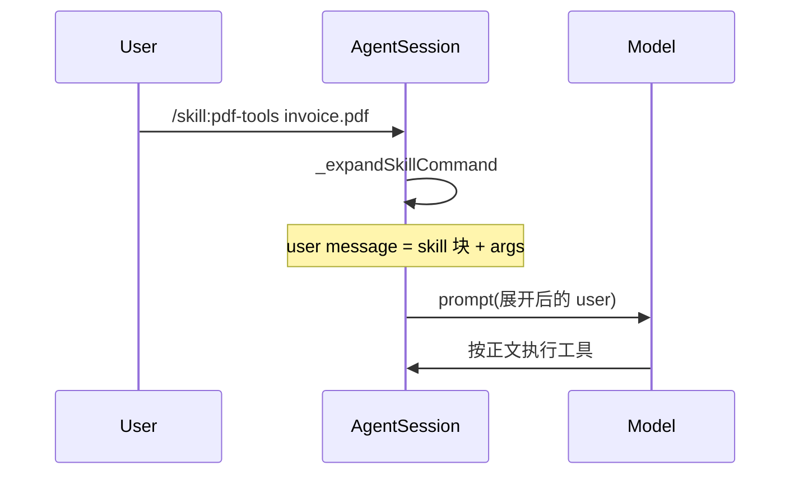

# Pi Skills：加载 · 链接 · 使用完整流程

> 源码：`packages/coding-agent/src/core/skills.ts`、`resource-loader.ts`、`agent-session.ts`、`system-prompt.ts`  
> 规范：[Agent Skills](https://agentskills.io/specification)  
> 最后更新：2026-07-28

---

## 1. Skill 是什么（在 Pi 里的精确定义）

Skill = **磁盘上的能力包**（通常是 `SKILL.md` + 可选脚本/资源），运行时被解析成：

```typescript
interface Skill {
  name: string;
  description: string;
  filePath: string;      // SKILL.md 绝对路径
  baseDir: string;       // 资源相对路径的根
  sourceInfo: SourceInfo;
  disableModelInvocation: boolean;  // true → 不进 system，只能 /skill:name
}
```

**关键设计：渐进披露（Progressive Disclosure）**

| 阶段 | 模型看到什么 | 谁加载正文 |
|------|--------------|------------|
| 启动后 | 仅 name / description / location（XML） | — |
| 任务匹配时 | — | 模型自己 `read` location |
| 用户 `/skill:name` | 整份正文注入到 **user 消息** | AgentSession 读盘展开 |

Skill **不是** Extension：不跑你的 TS，只给模型「说明书」。

---

## 2. 总流程图



---

## 3. ① 加载（Discovery）

### 3.1 来源与优先级

`loadSkills()` 聚合多源，同名 skill **后写覆盖前写**（视 source 合并策略）：

| 来源 | 路径 | 条件 |
|------|------|------|
| User 全局 | `~/.pi/agent/skills/` | 默认 |
| User 标准目录 | `~/.agents/skills/` | 默认 |
| Project | `.pi/skills/`、`.agents/skills/`（cwd 向上） | **项目已信任** |
| Settings | `settings.json` 的 `skills: [...]` | 显式路径 |
| CLI | `--skill <path>`（可重复） | 即使 `--no-skills` 仍加载显式路径 |
| Package | `pi install` 包内 `skills/` 或 manifest | 安装后 |
| Extension | `resources_discover` 可贡献路径 | 扩展声明 |

禁用默认发现：`pi --no-skills`（显式 `--skill` 仍有效）。

### 3.2 目录扫描规则

```text
skills/
├── foo.md                 # 部分根目录允许：单文件即 skill
└── my-skill/
    ├── SKILL.md           # 标准形态（递归发现）
    ├── scripts/helper.sh
    └── references/...
```

- 含 `SKILL.md` 的目录 → 递归发现  
- `.gitignore` / `.ignore` / `.fdignore` 参与过滤  
- Frontmatter 必填语义：`name`、`description`（校验宽松，有 diagnostic）

### 3.3 Frontmatter

```yaml
---
name: pdf-tools
description: Extract and manipulate PDF files
disable-model-invocation: false   # true = 不进 system 的 <available_skills>
---

# 正文：工作流、何时用、如何调脚本…
```

解析后：`disable-model-invocation` → `Skill.disableModelInvocation`。

### 3.4 ResourceLoader 角色

```text
createAgentSession / reload
  → ResourceLoader 收集 skillPaths
  → loadSkills({ cwd, agentDir, skillPaths, includeDefaults })
  → this.skills = Skill[]
  → AgentSession._rebuildSystemPrompt() 读 getSkills()
```

`/reload` 会重新跑发现与 system 重建。

---

## 4. ② 链接（Link into Runtime）

Skill 加载后，通过两条通道「挂」到会话上。

### 4.1 通道 A：System Prompt（给模型索引）

`formatSkillsForPrompt(skills)` → 拼进 `buildSystemPrompt()`：

```text
The following skills provide specialized instructions for specific tasks.
Use the read tool to load a skill's file when the task matches its description.
When a skill file references a relative path, resolve it against the skill directory …

<available_skills>
  <skill>
    <name>pdf-tools</name>
    <description>…</description>
    <location>/abs/path/SKILL.md</location>
  </skill>
</available_skills>
```

**链接语义：**

- `location` = 模型应用 `read` 的绝对路径  
- 正文中的相对路径 → 相对 **skill 目录（baseDir）** 解析  

仅当 **`read` 工具在活跃工具集中** 时才注入（否则模型无法加载正文）。

`disableModelInvocation === true` 的 skill **不出现在 XML**。

### 4.2 通道 B：斜杠命令（给用户强制加载）

设置 `enableSkillCommands`（默认 true）时，每个 skill 注册为：

```text
/skill:<name> [args…]
```

在 `AgentSession.prompt()` 里，输入若以 `/skill:` 开头：

```text
_expandSkillCommand(text)
  → 读 skill.filePath
  → stripFrontmatter → body
  → 变成 user 消息正文：

<skill name="pdf-tools" location="/abs/SKILL.md">
References are relative to /abs/pdf-tools.

（SKILL.md 正文）
</skill>

（可选用户 args）
```

然后当作普通 user 消息进入 `agent.prompt()` —— **整份说明书进上下文**，无需模型先 `read`。

`steer()` / `followUp()` 同样会展开 `/skill:`。

### 4.3 两种链接对比

| | System 索引 | `/skill:name` 展开 |
|--|-------------|---------------------|
| Token 成本 | 低（仅元数据） | 高（全文） |
| 触发 | 模型自主判断 | 用户强制 |
| disable-model-invocation | 隐藏 | 仍可用命令加载 |
| 典型场景 | 「有个 PDF 技能也许有用」 | 「必须按这个技能做」 |

---

## 5. ③ 使用（Use）

### 5.1 模型自主路径（最常见）



模型可能忽略索引不 `read` —— 可用提示词或 `/skill:` 强制。

### 5.2 用户命令路径



### 5.3 Skill 内资源如何「链接」到工具

Skill 正文约定（system 里也写了）：

> When a skill file references a relative path, resolve it against the skill directory…

例如 SKILL.md：

```markdown
Run: `bash scripts/extract.sh "$1"`
```

模型应调用：

```text
bash → command: bash /abs/.../pdf-tools/scripts/extract.sh invoice.pdf
```

而不是相对 cwd。**链接点 = `baseDir` / `location` 的 dirname。**

### 5.4 UI 层解析

`parseSkillBlock()` 可识别展开后的 `<skill name=… location=…>` 块，供 TUI 渲染「技能调用」消息样式（与普通 user 区分）。

---

## 6. 与 Extension / Prompt Template 的边界

| 机制 | 加载 | 进 system？ | 强制执行？ |
|------|------|-------------|------------|
| **Skill** | md 发现 | 元数据 XML | `/skill:` 展开全文 |
| **Prompt Template** | prompts/*.md | 通常不 | `/templatename` 展开 |
| **Extension** | .ts | 否（可改 system） | 事件钩子 / 工具 |

工作流编排示例（`/implement`）往往是 **Prompt Template**，正文里写「请调用 subagent 工具 chain…」——模板链接到 **Extension 注册的工具**，而不是 Skill。

---

## 7. 安全与信任

- Skill 可指示模型跑任意 bash / 读任意路径 → **与用户同权**  
- 项目 `.pi/skills`、`.agents/skills` 需 **信任项目**  
- 第三方 Pi Package 的 skills：安装前审查  

---

## 8. 源码索引

| 步骤 | 符号 / 文件 |
|------|-------------|
| 发现 | `loadSkills`, `loadSkillsFromDir` → `skills.ts` |
| 聚合 | `ResourceLoader.updateSkillsFromPaths` |
| System 链接 | `formatSkillsForPrompt` → `buildSystemPrompt` |
| 命令展开 | `AgentSession._expandSkillCommand` |
| 块解析 | `parseSkillBlock` |
| Prompt 文档 | [RUNTIME_PROMPT.md](./RUNTIME_PROMPT.md) §1.3 |

---

## 9. 一句话

> **加载**把磁盘变成 `Skill[]`；**链接**用 system XML + `/skill:` 命令挂到会话；**使用**要么模型 `read` location，要么用户命令把全文塞进 user 消息，再按 `baseDir` 解析相对资源。
