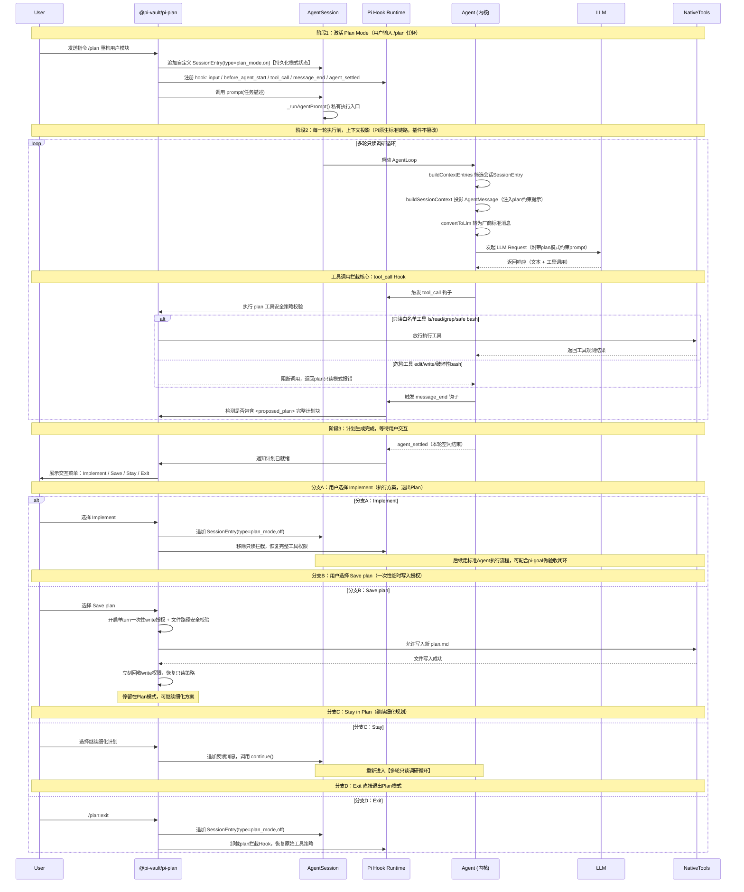

# Pi 核心扩展生态源码级设计原理（最终合并版）

> 面向本地源码运行 Pi 的开发者。覆盖 Pi 扩展机制底层契约、`/plan` 命令与 Plan 插件的端到端链路（含协作图与时序图），以及五大核心扩展（pi-mcp-adapter / context-mode / pi-subagents / pi-goal / pi-hermes-memory）的架构、流程、状态机与设计取舍。
>
> 本文**不贴源码、不做逐行走读**，只分析原理、架构、流程与设计逻辑。

---

## 第零章 Pi 扩展底层契约

Pi 核心仅内置 `read / write / edit / bash` 四个基础工具，所有复杂能力均通过**扩展（Extension）**注入。扩展与核心交互有两种范式：

| 范式 | 机制 | 代表扩展 |
|---|---|---|
| 注册式（加法） | `pi.registerTool()` 注册新工具、`pi.registerCommand()` 注册斜杠命令 | pi-mcp-adapter、pi-subagents |
| 钩子式（拦截） | `pi.on(event, handler)` 订阅生命周期事件，拦截/注入/修改行为 | context-mode、pi-hermes-memory |

### 0.1 七种能力注入

| 注入能力 | 注册 API | 触发方 | 经 LLM？ | 说明 |
|---|---|---|---|---|
| 命令 Command | `pi.registerCommand()` | 用户 `/xxx` | 否（零 token） | handler 由扩展开发者实现 |
| 工具 Tool | `pi.registerTool()` | 模型自己决定 | 是 | 进 tools 列表，模型可见 |
| 快捷方式 Shortcut | `pi.registerShortcut()` | 用户按快捷键 | 否 | 如 `Ctrl+Alt+P` 切计划模式 |
| Skill 知识 | `skills/` 目录 + `pi.skills` | 模型按描述调用 | 是 | Markdown 知识/工作流注入上下文 |
| Hook/事件 | `pi.on(event, handler)` | Pi core 生命周期 | — | 拦截/注入/修改行为 |
| CLI Flag | `pi.registerFlag()` | 启动参数 | — | 如 `pi --plan` |
| MCP Server | pi-mcp-adapter 代理 | 模型 via `mcp` 工具 | 是 | 接入外部 MCP 生态 |

### 0.2 关键生命周期事件

`session_start` → `before_agent_start`（每轮 agent 调用前）→ `tool_call` / `tool_result`（每次工具调用前后）→ `agent_end` → `session_before_compact`（压缩前）→ `session_shutdown`。

### 0.3 命令设计是 Pi 自家标准，非行业通用协议

- `pi.registerCommand()` 是 **Pi 自己的标准功能**（框架原生 API），类似 VSCode 的 `vscode.commands.registerCommand`。
- 斜杠命令 `/xxx` 的 UX 形态是**行业通用约定**（ChatGPT/Claude Code/Cursor/Gemini CLI 都用 `/`），但各家注册机制各自实现、互不兼容。
- 没有跨 agent 通用的"slash command 协议"——MCP 只解决工具/资源，不解决命令/UI。

### 0.4 AgentSession 与扩展的关系（重要澄清）

**`AgentSession` 不在扩展 handler 里创建，也不由扩展驱动其 LLM 循环。**

- `createAgentSession()` 是 SDK 层工厂，在 Pi 进程启动时由 Core 调用，封装 cwd 服务、资源管理器、认证、模型注册表、会话管理器和工具配置。
- 扩展拿到的 `pi`（`ExtensionAPI`）提供原语：`pi.sendUserMessage()` 编程式触发已有 AgentSession 进入新一轮；`pi.setActiveTools()` 动态切换工具集；`pi.on()` 订阅事件。
- **时序分离**：handler 执行时 AgentSession 已存在且空闲 → handler 调用 `sendUserMessage` 把消息入队 → **handler 返回后**，Core 的 AgentSession 循环才从队列取消息开始新一轮 `prompt()` → LLM 调用。

> 扩展是"旁观者+控制者"：订阅事件、向 AgentSession 发消息、切换工具集，但**绝不直接操作 AgentSession 内部循环**。

---

## 第零章补遗 扩展命令机制与 Plan 插件端到端链路

### A. Plan 插件用到的五种触发方式

1. **命令触发**：用户打 `/plan`（最常见）。
2. **CLI flag 触发**：`pi --plan` 启动即进入计划模式。
3. **Skill 触发**：用户消息匹配 skill 的 `trigger` 关键词 → Skill Loader 注入 `SKILL.md` → 模型按描述调用 plan 能力。
4. **事件触发**：其他扩展 `emit("plan:start")` → pi-plan 监听后进入计划模式（扩展间 RPC）。
5. **工具触发**：模型通过 `registerTool` 注册的 `plan_tool` 调用进入（少见）。

### B. @pi-vault/pi-plan 的四/五支柱

命令注册（`/plan`、`/plan:tools`、`/plan:exit`）+ 动态工具集切换（`setActiveTools` 收缩/恢复）+ Hook 注入（`before_agent_start` 追加计划模式指令）+ Skill 加载（`skills/plan-mode/SKILL.md`）+ 消息注入（`sendMessage` 把规划请求/计划内容注入对话）。

### C. 完整协作图（实体 + 消息流）

下图含 Pi Core 内部五个组件链路（终端 UI → Slash 管线 → Extension Registry → AgentSession → Tool Registry/Hook Dispatcher → LLM），标注了 Skill 加载与非指令触发方式。两张图均为直接绘制的 PNG（实体完整、时序清晰），不依赖 base64/PlantUML。


### D. 完整时序图（五阶段消息流）

下图按"阶段1 命令匹配/handler执行(零token) → 阶段2 工具集收缩+计划模式注入 → 阶段3 AgentSession驱动LLM循环(受限探索) → 阶段4 用户审批/菜单交互 → 阶段5 计划实施(AgentSession驱动/全权限)"五个阶段展开，并附非指令触发方式说明。


## 第一章 pi-mcp-adapter 单代理工具网关

### 1.1 职责边界
解决 MCP 生态接入的 Token 成本：用**一个约 200 token 的代理工具 `mcp`**替代上百个工具定义，成本从 O(n) 压到 O(1)，实测降低约 98.7% 上下文 token 消耗。

### 1.2 架构分层
- **入口层** `index.ts`：注册唯一代理工具 `mcp` 与 `/mcp` 命令，异步触发 `initializeMcp()`。
- **状态层** `state.ts`：`McpExtensionState` 集中状态。
- **代理层** `proxy-modes.ts`：`executeCall/Search/Describe/Connect/Status/Auth*` 按参数优先级路由。
- **管理层** `server-manager.ts` + `lifecycle.ts`：Transport 创建（stdio/SSE/StreamableHTTP/WS）、健康检查、idle 超时、backoff 重连。
- **缓存层** `metadata-cache.ts`：工具/资源元数据持久化，config hash 校验，离线可用。
- **辅助层**：`npx-resolver`（直解二进制，跳过 143MB npm 父进程）、`mcp-oauth-provider`（OAuth 2.1+PKCE）、`tool-approval`（危险操作确认）、`mcp-output-guard`（50KiB/2000 行截断）。

### 1.3 四大核心设计模式
1. **单代理工具**：不论后端多少 server，对 Pi 只暴露一个 `mcp` 工具，模式解析按参数优先级路由。
2. **惰性连接**：默认 `lifecycle:"lazy"`，只有真正被调用时才连接；`eager`/`keep-alive` 在初始化阶段主动连。
3. **元数据缓存**：工具 schema 持久化到磁盘，带 config hash 校验；`search`/`describe` 无需 server 在线。
4. **生命周期管理**：30s 健康检查、idle 超时断开、failureTracker 实现 backoff 重连。

### 1.4 "不先连怎么知道工具有哪些"（发现与激活解耦）
- **发现期（启动时，零连接成本）**：Pi 读取本地配置文件，本地运行 MCP Server 初始化阶段，Server 把能力清单（工具+参数 schema）以 JSON 打印到 Stdout，Pi 读取后缓存；远端进程可立即退出或休眠，**无需长连接**。
- **激活期（调用时，Lazy 发生在这里）**：模型决定调用某工具 → `mcp` 代理才真正执行配置里的命令行、启动 Server 进程、建立 Stdio 连接传输数据，用完后按 idle 超时断开。
- 故"发现工具"靠**本地静态配置+启动时一次性元数据拉取**，"建立连接"靠 **Lazy 模式在调用瞬间唤醒**。

### 1.5 与 Pi 运行时交互
- **同步阶段（session 启动前）**：`pi.registerTool("mcp", schema)` 注册唯一代理工具；若 `directTools:true` 把高频 MCP 工具提升为 Pi 原生工具。
- **异步阶段（`session_start` 事件）**：加载元数据缓存（离线 hydrate）→ 仅连 `eager`/`keep-alive` server（最多并发 10）→ 启动 30s 健康检查。

### 1.6 设计取舍
| 取舍 | 选择 | 理由 |
|---|---|---|
| 代理 vs 直注 | 代理工具 | O(1) token，替代 O(n) 注册 |
| 连接时机 | 惰性 | Pi 启动快，连接按需 |
| 元数据 | 持久缓存 | 离线可发现，零连接成本 |
| npx 执行 | 直解二进制 | 跳过 143MB 父进程，降低延迟 |
| 输出 | 截断+落盘 | 防大输出灌爆上下文 |

> **核心洞察**：用一次间接寻址换上下文窗口——模型通过 `mcp`"电话总机"按需拨号。

---

## 第二章 context-mode 上下文虚拟化层

### 2.1 职责边界
解决工具输出灌爆上下文窗口：通过钩子拦截原生工具调用，原始数据引流到 SQLite/FTS5 知识库，仅向模型返回摘要，实测 **315KB→5.4KB，节省 98%**。

### 2.2 架构分层
- **Hook 拦截层（Pi 侧 extension.js）**：`tool_call`（路由强制，拦截 bash 内联 HTTP）、`tool_result`（事件抽取）、`session_start`（初始化会话 DB 行）、`session_before_compact`（构建 ≤2KB 快照）、`before_agent_start`（BM25 检索注入）。
- **沙箱执行层（MCP Server 侧）**：每次 `ctx_execute` spawn 独立子进程，脚本间内存/状态不共享，原始数据永不离开沙箱，仅 stdout 返回。
- **知识库层（SQLite+FTS5）**：所有沙箱输出分块索引；BM25+Porter stemming；标题加权 5x；RRF 融合 FTS5 MATCH/trigram；邻近重排+Levenshtein 模糊纠正。
- **快照层**：PreCompact 构建优先级分层 XML 快照 ≤2KB 存入 `session_resume`；SessionStart（source:compact）恢复快照并构建 15 类 Session Guide 注入上下文。
- **工具层（ctx_* 工具集）**：`ctx_execute`/`ctx_batch_execute`/`ctx_execute_file`/`ctx_index`/`ctx_search`/`ctx_fetch_and_index`/`ctx_stats`/`ctx_doctor`。

### 2.3 四层防御
1. **沙箱隔离**：原始数据不进上下文，是 98% 节省的根本。
2. **知识库索引**：输出分块存入 FTS5，BM25+RRF 检索。
3. **会话连续性**：压缩前 ≤2KB 分层快照，压缩后 BM25 恢复，模型从上次用户提示处继续。
4. **意图驱动过滤**：输出>5KB 且提供 intent 时，索引全文后仅返回与 intent 匹配的片段。

### 2.4 Token 到底在哪减少（数据流量虚拟化）
- **输入端拦截（98% 节省）**：模型请求读/分析数据 → context-mode 拦截并交给沙箱 → 沙箱处理完只把结论（如 Top5 IP）送回上下文，45KB 原始日志被物理隔离在沙箱外。
- **输出端压缩（会话不中断）**：上下文窗口满时，常规压缩会丢信息；context-mode 用 ≤2KB 分层快照替代，恢复时模型读 2KB 精准摘要而非大段历史。
- 类比操作系统虚拟内存：模型看到的是"视图"而非"数据"。

### 2.5 事件抽取（15 类，优先级分层）
P1 关键：文件操作/任务/计划/规则/用户提示/决策；P2 高：用户纠正/Git/错误/约束/阻塞器；P3 普通：MCP 工具/子代理/技能/外部引用；P4 低：意图/大数据引用。

### 2.6 设计取舍
| 取舍 | 选择 | 理由 |
|---|---|---|
| 拦截方式 | Hook 强制路由 | 平台 Hook ~98% 合规；仅 SYSTEM.md ~60% |
| 输出 | 沙箱隔离 | 原始数据不进上下文，98% 节省根本 |
| 检索 | BM25+RRF | 精确匹配+子串模糊 |
| 压缩恢复 | ≤2KB 分层快照 | 关键状态永存，低优先级可丢 |
| 存储引擎 | node:sqlite(Linux+Node≥22.5) | 避免 better-sqlite3 SIGSEGV 风险 |

> **核心洞察**：数据虚拟化——模型看到"视图"而非"数据"，像虚拟内存让进程看到连续地址空间。

---

## 第三章 pi-subagents 子代理编排引擎

### 3.1 职责边界
解决单 agent 上下文污染与能力瓶颈：启动多个独立会话的子代理，各拥独立上下文/工具集/模型配置，跑完带回结果。

### 3.2 五层架构
- **入口层** `index.ts`：注册 `Agent`/`steer_subagent` 工具与 `/agents` 命令，创建 AgentWidget UI，注册跨扩展 RPC 处理器。
- **工具层**：`Agent`（派生子代理）、`steer_subagent`（运行中引导）、`get_subagent_result`（获取结果）。
- **编排层** `agent-manager.ts`：维护 Agent 状态 Map、`runningBackground` 计数器+`queue` 数组、并发上限 `maxConcurrent=4`、前台 `spawnAndWait`/后台 `spawn`、完成后 `drainQueue`、GroupJoinManager（30s 超时批量通知）。
- **执行层** `agent-runner.ts`：通过 Pi 的 `createAgentSession()` 创建子会话、`buildAgentPrompt`、`forkConversation`、订阅 session 事件跟踪 turn/工具活动、两轮截断（soft limit steering + grace abort）、返回 RunResult。
- **配置层** `agent-types.ts` + `default-agents.ts` + `custom-agents.ts`：统一注册表（默认+自定义合并，优先级 project>global>default）、`resolveType` 大小写不敏感+fallback、`getToolNamesForType` 实例化工具。

### 3.3 内置 Agent 类型（角色，非模式）
scout（Haiku，只读侦察）/ researcher / planner（Sonnet，只读规划，产出 plan.md）/ worker（Sonnet，完整工具实施）/ reviewer（只读审查）/ oracle（第二意见）/ context-builder / delegate。自定义 agent：在 `.pi/agents/*.md`（项目级）或 `~/.pi/agent/agents/*.md`（全局）放 Markdown，YAML frontmatter 定义 `tools/model/thinking/max_turns`，body 为 system prompt。**注意 description 加引号，避免含"冒号+空格"的 plain scalar 导致所有 subagent 调用失败。**

### 3.4 执行模式（前台 vs 后台）
- **前台**（`run_in_background:false`）：父 agent 阻塞等待，子代理跑完结果内联返回；绕过并发队列；实时流式更新 UI；适用顺序依赖任务。
- **后台**（`run_in_background:true`）：立即返回 agent ID 不阻塞；`runningBackground<maxConcurrent` 立即启动否则进 FIFO 队列；`spawn(...,{detached:true})` 独立进程，结果写 `status.json`/`events.jsonl`，父会话退出子代理仍可跑完；`get_subagent_result` 取结果，`steer_subagent` 中途改方向。

### 3.5 编排模式（single/chain/parallel/parallel+aggregator）
- **Single**：一个 agent 一个 task。
- **Parallel**：多个独立 agent 并行，受 `maxConcurrent` 限制，超出排队；注意写密集型任务应串行化避免冲突。
- **Parallel+Aggregator**：并行跑完 → aggregator 通过 `{previous}` 收所有结果合并（如 reviewer 产出风险评估）。
- **Chain**：串行，`{previous}` 逐步传递，任一步失败 chain 立即停止。

### 3.6 两维度组合矩阵
| | 前台（阻塞） | 后台（异步） |
|---|---|---|
| Single | 委派小任务立即用结果 | 派一个立即返回 ID，稍后取 |
| Parallel | 多个并行，全部完成父才继续 | 多个并行立即返回 ID 列表，父继续 |
| Chain | 整条链跑完父才继续 | 整条链后台跑，父不阻塞 |
| Parallel+Aggregator | 并行+合并后父继续 | 全流程后台，父不阻塞 |

### 3.7 进阶特性
- **上下文模式**：forked（继承父上下文，默认）/ fresh（干净启动，完全隔离）。
- **Worktree 隔离**：`isolation:"worktree"`，各并行 agent 在独立 git worktree 跑，改动自动提交到 `pi-agent-*` 分支，避免文件系统冲突。
- **定时调度**：`schedule:"0 0 9 * * 1"` 或 `+10m`，PID 锁持久化。
- **会话恢复**：`Agent({resume:"<agent-id>",prompt:"继续"})` 按 ID 恢复保留完整上下文。
- **优雅轮次上限**：到 `max_turns` 先发"wrap up"收尾，给 5 个 grace 轮次后再硬中断，保证拿到干净局部结果。
- **Orchestrator 模式**：`PI_ORCHESTRATOR_MODE=1` 把父会话变纯编排器，移除 read/bash/edit/write，只保留 subagent/subagent_kill/subagent_resume。
- **跨扩展 RPC**：通过 `pi.events` 发射 `subagents:created/started/completed/failed/steered`，其他扩展可监听/调用。

### 3.8 三家实现对比
| | @tintinweb/pi-subagents | @narumitw/pi-subagents | nicobailon/pi-subagents |
|---|---|---|---|
| 范式 | Claude Code 风格单 agent | 通用编排 | 通用编排+高级特性 |
| 内置 agent | 3 种 | 4 种 | 8 种 |
| 编排模式 | 前台/后台+并发队列 | single/chain/parallel/parallel+aggregator | 同左 |
| Worktree | 基础 | — | 高级 |
| 定时调度 | 有 | — | 有 |
| 跨扩展 RPC | 有 | — | 有（pi-intercom） |
| 成熟度 | v0.14.3 早期 | v0.1.36 | v0.24.0 成熟（20K 行 TS） |

### 3.9 推荐工作流
`clarify → planner → worker → fresh reviewers → worker`（scout 侦察 → planner 规划 → worker 实施 → 多 reviewer 独立审查 → worker 按反馈修复）。这是 pi-subagents **内部自动流水线**；需人工审批时应在前接入独立 plan 插件，形成"交互式规划→自动执行"混合范式。

> **核心洞察**：上下文分片——把问题拆成多个独立上下文并行处理，MapReduce 式（Map 分片并行，Reduce 汇总）。

---

## 第四章 Plan 插件体系（@pi-vault/pi-plan 与 @plannotator/pi-extension）

### 4.1 @pi-vault/pi-plan（官方收录主流）
- **定位**：给 Pi 增加**只读计划模式**，产出"决策完整"的实现计划。
- **安全模型**：进入计划模式后内置 `edit`/`write` 默认禁用，`bash` 仅允许只读白名单，变更类命令被拦截。
- **核心命令**：`/plan`（开启/立即规划）、`/plan:tools`（启用可选工具）、`/plan:exit`（退出恢复工具集）、`pi --plan`（启动时进入）。快捷键 `Ctrl+Alt+P`。
- **工作流**：探索仓库 → 澄清意图 → 产出**唯一一个** `<plan>` 块 → 用户选"实现此计划"/"保存计划"。计划保存到工作区根目录小写 `.md` 文件，保存后计划模式保持激活。

### 4.2 @plannotator/pi-extension（审批流+注解反馈）
- agent 写 Markdown 计划并调用 `plannotator_submit_plan`。
- Plannotator 打开计划供**审批或注解反馈**。
- 批准后 Pi 进入执行模式并跟踪 checklist 进度。
- 支持 `executionMode:"external"`：批准后 emit `plannotator:plan-approved`，让**其他扩展（如 pi-subagents 的 worker）监听接管执行**——这是与 pi-subagents 联动的关键点。

### 4.3 两者对比
| 维度 | @pi-vault/pi-plan | @plannotator/pi-extension |
|---|---|---|
| 模式切换 | `/plan` 进入只读计划模式 | agent 提交计划后进入审批 |
| 工具限制 | edit/write 禁用，bash 白名单 | 审批前受限，审批后执行 |
| 交互 | 多轮澄清+菜单（Implement/Save/Stay/Exit） | 审批+注解反馈 |
| 执行接管 | 计划注入新轮次由模型实施 | external 模式 emit 事件让扩展接管 |
| 计划持久化 | 保存到工作区 `.md` | checklist 跟踪进度 |

### 4.4 planner 子代理 vs 独立 plan 插件（辨析）
| 维度 | pi-subagents 的 planner | @pi-vault/pi-plan 插件 |
|---|---|---|
| 形态 | 子代理角色（8 内置角色之一） | 独立扩展 |
| 触发 | 被父 agent 通过 `subagent` 委派 | 用户 `/plan` 或 `pi --plan` |
| 模式切换 | 无独立模式，一次子代理调用 | 进入独立"计划模式"，禁用 edit/write |
| 交互性 | 一次性产出计划后返回 | 多轮澄清/审批/保存/注解 |
| 生命周期 | 随子代理调用结束 | 贯穿规划→执行周期 |
| 工具限制 | 只读（read/grep/find/ls） | 禁用 edit/write，bash 白名单 |
| 计划持久化 | 输出 plan.md | 保存为工作区 `.md` |

**一句话**：planner 子代理=流水线上的"规划专家"（产出计划交 worker）；plan 插件=IDE 级"计划模式"（交互式澄清/审批/保存/执行）。两者可协同。

---

## 第五章 pi-goal 持久目标与自治续跑

### 5.1 职责边界
解决长任务跨轮自治推进：移植 OpenAI Codex 的 goal mode，用户设一个持久目标，agent 自动续跑直到完成，支持暂停/恢复/替换。

### 5.2 架构组成
- **入口层** `index.ts`：注册 `/goal` 命令（含子命令）、3 个模型工具（`get_goal`/`create_goal`/`update_goal` 仅允许 `{status:"complete"}`）、替换 TUI footer 为多行状态指示器。
- **存储层** `goal/store.ts`：目标以 JSON 文件存活跃会话目录，版本化 schema，无持久会话回退到扩展目录。
- **续跑引擎** `goal/continuation.ts`：监控 assistant `stopReason`，目标活跃且 turn 干净结束时注入隐藏 continuation 提示；过时续跑保护（目标被 clear/pause/replace 则取消）；无进展抑制（上一轮无工具调用则不续跑）。
- **状态机** `goal/types.ts`：`active | paused | blocked | budgetLimited | complete`。
- **命令层/UI 层/格式化与错误层**。

### 5.3 目标状态机
`/goal <obj>` → `active` →（Esc/`/goal pause` ↔ `/goal resume`）`paused`；（tokensUsed>tokenBudget）`budgetLimited`；（`update_goal{status:"complete"}`）`complete`（终态，仅模型可标记）。

### 5.4 续跑引擎五步原理
1. 监控 `stopReason`。
2. 干净结束判定：仅 `active` 且 turn 干净结束（`stop`/`toolUse`/`length`）才注入；工具错误/用户中断/无工具调用（无进展抑制）不续跑。
3. 隐藏 continuation 提示：含目标文本（**XML 转义，作为不可信 user data 包裹**避免变高优先级指令）、token 使用、审计指引（要求重述目标为具体交付物，需求映射到可验证证据）。
4. 过时续跑保护：目标在 turn 期间被 clear/pause/replace → 已排队 continuation 改写为 no-op 并中止当前 turn，防竞态。
5. Generation-based 调度：一轮结束可能产生新一代续跑，同一时刻仅一代活跃，避免嵌套爆炸。

### 5.5 与 Pi 运行时交互时序（非交互 `pi -p`）
`session_start`（加载配置/读 `--goal` 标志）→ `before_agent_start`（若 `--goal` 推导待定则从 `event.prompt` 推导并 `setGoal`）→ `agent_start→turn_start→message(user/assistant)→turn_end` → `agent_end`（从 `event.messages` 构建 transcript，调用 evaluator 模型判断：Met→标记 achieved 清除目标 Pi 停止；Impossible→停止告知原因；Not yet→`sendUserMessage(continue)` 触发新一轮）→ `agent_settled` → `session_shutdown`。**无需扩展自己维护缓冲区**（`agent_end` 的 `event.messages` 是完整对话）。

### 5.6 多 fork 变体
- @amaster.ai：从对话自动推导可测量目标条件，TUI 需确认，非交互跳过；独立 evaluator 模型判断达成。
- code-yeongyu：严格对齐 Codex goal spec，JSON 存会话目录，TUI footer 多行指示器。
- hiennguyen9874：强调恢复处理，提供 `/goal:create` prompt 模板与 `pi-goal-writer` skill 起草可审计完成契约。

> **核心洞察**：目标状态机+隐藏续跑压力——通过状态机约束生命周期（用户掌控，模型只能标记完成）、续跑引擎施加"继续"压力、过时保护避免竞态、独立 evaluator 防幻觉完成，四机制让 Pi 具备长任务自治推进能力，无需改动核心 418 行。

---

## 第六章 pi-hermes-memory 跨会话持久记忆

### 6.1 职责边界
解决 Pi 会话结束即遗忘：移植 Nous Research Hermes Agent 记忆系统，跨会话持久化事实/偏好/失败经验，SQLite FTS5 全文搜索历史会话，后台学习循环自动提炼。

### 6.2 架构组成
- **入口层** `index.ts`：注册 4 个事件钩子、记忆工具、命令。
- **存储层** `store/`：`MemoryStore`（MEMORY.md≤5K 字符/USER.md/failures.md/项目级 projects-memory/&lt;proj&gt;/MEMORY.md）、`SkillStore`（skills/*.md）、`DatabaseManager`（sessions.db SQLite FTS5 全文本索引）。
- **处理器层** `handlers/`：`background-review.js`（每 10 轮/15 工具调用触发）、`correction-detector.js`（用户纠错即时保存）、`session-flush.js`（会话结束/压缩前冲刷）、`auto-consolidate.js`（容量满自动合并）、`skill-auto-trigger.js`。
- **工具层** `tools/`：`memory_tool.js`（add/search/consolidate）、`skill_tool.js`、`session-search-tool.js`（跨会话历史搜索）。
- **安全层**：content-scanner 拦截密钥/token/SSH key。

### 6.3 四类知识存储
Memory（MEMORY.md 全局事实）/ User Profile（USER.md）/ Failures（failures.md）/ Skills（skills/*.md 过程型）/ Session DB（sessions.db 历史会话 FTS5）。两层：Global `~/.pi/agent/memory/` + Project `~/.pi/agent/projects-memory/<project-name>/`。

### 6.4 四个核心事件钩子
1. `session_start`：从磁盘加载全局+项目级记忆到内存。
2. `before_agent_start`：**默认 `memoryMode:"policy-only"`**——system prompt 只注入记忆使用策略，具体内容由模型通过 `memory_search` 按需检索（避免上下文污染、记忆变教条、过时记忆干扰）。
3. `tool_call`/`tool_result`：每 10 轮/15 工具调用触发 background-review；用户纠错触发 correction-detector 立即保存。
4. `session_before_compact`/会话结束：session-flush 把值得记住的内容写入 MEMORY.md/skills，确保会话结束前最后反思不丢失。

### 6.5 后台学习循环
每 10 轮/15 工具调用 → background-review（通过子进程 `pi -p` 调用，每次消耗 1 次 LLM API）扫描近期对话，提炼新事实/用户偏好/失败教训/可复用流程 → 写入对应 Markdown → 同步到 SQLite FTS5。**自动合并**：MEMORY.md 达 5K 字符上限时自动合并相似条目，旧值保留为 `superseded` 历史，项目与全局可 `promote/demote`。

### 6.6 安全
每次写入经 content-scanner 拦截 API key/token/SSH key；Context Fencing（tag 机制）防 prompt injection。

### 6.7 与 Pi 运行时交互时序
用户"记住：项目用 pnpm" → correction-detector 检测 → memory_tool add（content-scanner 扫描→追加 MEMORY.md 格式 `§ 项目包管理器: pnpm [timestamp]`→同步 FTS5）。下次会话：`session_start` 加载 → `before_agent_start` 注入 policy-only 策略 → 模型需相关信息时 `memory_search`→FTS5 检索返回"项目包管理器: pnpm"。

> **核心洞察**：记忆虚拟化+后台学习循环——记忆不是"全量灌入上下文"而是"注册检索接口"；不是被动等用户说"记住"而是主动回顾提炼；Markdown 是人类可审阅主存储，SQLite FTS5 是机器可检索索引。

---

## 第七章 五大扩展协同架构

```
┌─────────────────────────────────────────────────┐
│              Pi 核心（418 行）                     │
│         read / write / edit / bash                │
│         事件钩子 + 工具注册 + 命令注册              │
├─────────────────────────────────────────────────┤
│ 工具接入层：pi-mcp-adapter（O(1) MCP 网关）       │
│ 上下文层：context-mode（98% 节省 + FTS5）          │
│ 编排层：pi-subagents（多 agent 委派）              │
│ 长任务层：pi-goal（持久目标 + 自治续跑）           │
│ 记忆层：pi-hermes-memory（跨会话记忆 + 学习循环）  │
│ 计划层：@pi-vault/pi-plan / @plannotator（规划审批）│
└─────────────────────────────────────────────────┘
```

### 端到端 `/goal` 工作流示例
```
用户 /goal migrate auth module to OAuth2
  → pi-goal：创建持久目标，启动隐藏 continuation 引擎
  → 每轮 agent 工作中：
      pi-hermes-memory：before_agent_start 注入 policy-only 策略；
        模型 memory_search 检索"项目用 pnpm""上次 OAuth 迁移失败原因"；
        background-review 每 10 轮自动提炼新记忆
      pi-subagents：派 scout 侦察代码库，派 worker 实施
      context-mode：拦截 bash，700KB 构建日志引流到 SQLite 仅返摘要
      pi-mcp-adapter：按需连接数据库/浏览器 MCP Server
  → 目标完成时：pi-goal 标记 complete 停止续跑；
    pi-hermes-memory 把"OAuth 迁移完成"写入持久记忆，下次新会话自动生效
```

### Plan 与 subagents 协同范式
用 plan 插件做交互式规划与审批，用 pi-subagents 的 planner 做自动规划，用 worker 子代理做实际执行；Plannotator external 模式批准后 emit 事件让 worker 接管。

---

## 第八章 本地源码调试指引

### 通用步骤
1. 克隆扩展源码（pi-mcp-adapter / context-mode / pi-subagents / pi-goal / pi-hermes-memory）。
2. 本地安装：`cd your-pi-source && pi install ./path/to/extension`（全局）或 `+ -l`（项目级）。
3. 重启 Pi，观察启动日志 `[Extensions]` 行确认加载。
4. 在扩展源码关键位置加 `console.log`，重启观察。

### 各扩展关键调试断点
| 扩展 | 关键断点 |
|---|---|
| pi-mcp-adapter | `index.ts` 的 `mcpAdapter()`；`server-manager.ts` MCP 连接；`continuation.ts` 续跑决策 |
| context-mode | `extension.ts` 的 `tool_call`/`tool_result` 钩子；`store.ts` FTS5 写入；`snapshot.ts` 压缩快照 |
| pi-subagents | `agent-manager.ts` 的 `spawn()` 并发控制；`async-execution.ts` 的 `spawn(...,{detached:true})` |
| pi-goal | `continuation.ts` 续跑提示注入；`store.ts` 目标 JSON 写入；`types.ts` 状态机转换 |
| pi-hermes-memory | `index.ts` 的 `before_agent_start`（记忆注入）；`background-review.js` 学习循环；`correction-detector.js` 纠错保存 |

### 一站式安装脚本
```bash
# 核心 5 件套
pi install npm:pi-mcp-adapter
pi install npm:context-mode
pi install npm:pi-subagents
pi install npm:pi-goal
pi install npm:pi-hermes-memory
# 计划插件（二选一或都装）
pi install npm:@pi-vault/pi-plan
pi install npm:@plannotator/pi-extension
# 补全 4 件套
pi install npm:pi-web-access
pi install npm:pi-lens
pi install npm:@juicesharp/rpiv-todo
pi install npm:@juicesharp/rpiv-ask-user-question
# 可选增强
pi install npm:@plannotator/pi-extension
pi install npm:@narumitw/pi-statusline
pi install npm:@vigolium/piolium
pi update --all
```

---

## 第九章 设计思想总结

1. **极简核心+插件化**：核心仅 4 工具，能力全由扩展注入，保证核心稳定与可扩展。
2. **两种范式互补**：注册式（新增能力）与钩子式（拦截/增强原生能力）覆盖所有场景且互不冲突。
3. **O(1) 成本优先**：pi-mcp-adapter 的 O(1) 工具接入、context-mode 的 98% 上下文节省、pi-subagents 的上下文分片、pi-goal 的状态机续跑、pi-hermes-memory 的记忆虚拟化，均以"用一次间接寻址/虚拟化换上下文窗口"为共同哲学。
4. **控制反转**：扩展通过原语（registerCommand/Tool/on/sendUserMessage/setActiveTools）与 Core 的 AgentSession 协作，但绝不直接操作 AgentSession 内部循环——这种解耦让扩展深度定制行为而不破坏会话一致性。
5. **生态组合拳**：工具从哪来（mcp-adapter）+ 数据往哪去（context-mode）+ 计算怎么编排（subagents）+ 长任务怎么跑（goal）+ 经验怎么积累（hermes-memory）+ 计划怎么审批（plan 插件）= Pi 从"四个工具的极简 harness"变成生产级编程 agent。

---

## 附录 A 扩展速查表

| 扩展 | 解决什么 | 范式 | 核心机制 |
|---|---|---|---|
| pi-mcp-adapter | 工具定义太啰嗦 | 注册式 | 单代理工具 O(1)+惰性连接+元数据缓存 |
| context-mode | 工具输出太啰嗦 | 钩子式 | 沙箱隔离+FTS5+BM25+RRF+分层快照 |
| pi-subagents | 单 agent 能力不足 | 注册式 | 前台/后台+四种编排+并发队列 |
| pi-goal | 长任务跨轮推进 | 注册式+钩子式 | 目标状态机+隐藏续跑+evaluator |
| pi-hermes-memory | 会话结束即忘 | 钩子式 | policy-only 注入+后台学习+FTS5 |
| @pi-vault/pi-plan | 交互式规划审批 | 注册式+钩子式 | 只读计划模式+工具集切换+消息注入 |
| @plannotator/pi-extension | 计划审批+注解 | 注册式+钩子式 | 提交计划+审批反馈+external 事件接管 |

## 附录 B 高频 FAQ

1. **MCP 不先连怎么知道工具有哪些？** 靠本地静态配置+启动时一次性元数据拉取（零连接成本）；Lazy 连接在模型调用某工具的瞬间才唤醒 Server 进程。
2. **context-mode 在哪减少 token？** 输入端沙箱隔离（原始数据不进上下文，98% 节省）+ 输出端 ≤2KB 分层快照（压缩后可恢复，不丢关键状态）。
3. **planner 子代理 vs 独立 plan 插件？** planner 是流水线上的只读规划角色（一次性、无审批）；plan 插件是 IDE 级交互式计划模式（多轮澄清/审批/保存/执行），两者可协同。
4. **多扩展会冲突吗？** 不会——扩展各自占据 agent 运行一个维度，通过 Core 的事件总线与 AgentSession 原语协作，互不直接修改彼此状态；同类扩展（如多个 statusline）需注意互斥，按需选用。


# @pi-vault/pi-plan 原理与完整时序文档
> 文档版本：V1.0
> 适配：Pi 框架，扩展 `@pi-vault/pi-plan`
> 包含：设计目标、架构分层、Hook清单、源码结构、实现原理、完整Mermaid时序图、边界说明、工作流示例

## 一、核心定位
**@pi-vault/pi-plan** 是 Pi Vault 维护的标准 Plan Mode 扩展插件，采用外挂 Extension Hook 方案实现，**不侵入 Pi 内核源码**，实现「先只读调研生成方案 → 用户审批后再执行」的规划模式，对齐 Claude Code Plan 模式。

核心特性：
1. 默认只读安全：`edit` / `write` 破坏性工具默认禁用，bash 命令白名单管控
2. 模式状态持久化：自定义 `SessionEntry` 存储Plan状态，会话重启、上下文压缩(compaction)后可恢复
3. 多交互分支：生成计划后支持 `Implement / Save / Stay / Exit` 四种操作
4. 双层安全防护：Prompt软约束 + `tool_call` Hook 运行时硬拦截，防止模型幻觉修改文件
5. Save Plan 一次性临时授权：仅本轮允许写入新md计划文件，写入完成自动回收写入权限

## 二、设计目标
1. 隔离「方案调研规划阶段」和「代码实现修改阶段」，防止Agent未经审批改动业务代码
2. 提供标准化结构化计划输出（`<proposed_plan>`），方便人工评审
3. 兼容Pi原生全链路：`buildContextEntries` / `buildSessionContext` / `convertToLlm`、压缩、人机确认、`continue()` 续跑
4. 可与 `pi-goal` 组合使用：Plan产出方案 → Implement执行 → Goal Judge自动验收交付物

## 三、整体架构 & 使用Hook清单
所有能力依托Pi原生扩展Hook实现，不修改内核 `AgentSession` / `Agent` 逻辑

| Hook 点位 | 在 pi-plan 中的作用 | 类型 |
|---|---|---|
| `input` | 拦截 `/plan` `/plan:tools` `/plan:exit` 斜杠命令，切换模式 | 可拦截控制Hook |
| `session_start` | 会话恢复时扫描历史SessionEntry，还原Plan活跃状态、工具白名单配置 | 观测+恢复逻辑 |
| `before_agent_start` | Plan激活时注入专用规划提示词，约束Agent仅做代码调研、输出结构化计划 | 上下文注入Hook |
| `tool_call` | 核心拦截点，阻断edit/write/危险bash；实现Save一次性临时授权 | 运行时拦截Hook |
| `context` | LLM请求前微调消息视图，标记Plan模式 | 消息视图修改Hook |
| `message_end` | 检测Agent输出 `<proposed_plan>` 完整计划块，触发UI菜单 | 观测事件 |
| `agent_settled` | Turn执行完毕空闲后，渲染计划就绪交互菜单 | 观测事件 |

### 分层实现方案
1. **命令/UI层**：注册斜杠命令、状态栏标识、交互选择菜单
2. **状态管理层**
   - 内存：会话维度Plan状态、工具白名单配置
   - 持久化：自定义 `type: plan_mode` SessionEntry，写入会话DAG jsonl，支持压缩与会话恢复
3. **工具安全策略层（tool-policy）**
   - 默认白名单：read / grep / find / ls / 安全只读bash
   - 默认阻断：edit / write / git变更操作 / 破坏性shell命令
   - `/plan:tools`：用户手动选择性放开写入工具权限（持久保存偏好）
4. **Prompt约束层**：before_agent_start注入规划专用system prompt，约束Agent行为
5. **模式切换控制**：启停Plan模式，动态挂载/卸载工具拦截策略

## 四、源码目录结构
```

src/
├─ extension.ts          # 扩展入口，注册全部 Hook、斜杠命令
├─ mode-state.ts         # Plan 内存状态管理、SessionEntry 持久读写
├─ tool-policy.ts        # tool_call 拦截逻辑、bash 白名单、save 临时授权
├─ prompts/              # 内置规划专用 prompt 模板
├─ commands.ts           # /plan/plan:tools /plan:exit 命令处理逻辑
├─ ui-widget.ts          # TUI 状态栏、计划就绪交互菜单
└─ save-plan-flow.ts     # Save Plan 一次性写入授权、文件路径安全校验

```

## 五、关键实现细节
1. **状态持久化**
Plan启停状态存入自定义 `SessionEntry`，作为会话一等事件，`buildContextEntries`、compaction压缩正常处理；会话resume时通过 `session_start` 扫描历史事件恢复模式。
> 和 pi-goal 的状态持久化方案完全一致。

2. **双层安全防护**
- 软约束：注入规划提示词，引导Agent只读调研
- 硬拦截：`tool_call` Hook 在工具执行前拦截写入类调用，即使模型幻觉也无法执行修改

3. **Save Plan 特殊流程**
仅用户选择保存计划的单turn启用一次性写入权限；强校验：仅允许新建md文件、禁止覆盖已有文件、禁止路径穿越；本轮结束自动回收写入权限，回归只读策略。

4. **LLM请求链路兼容性**
插件**不会改动原生投影链路**：
`buildContextEntries → buildSessionContext → convertToLlm → LLM Request`
注入的规划提示，会被封装为标准 `AgentMessage` 并入上下文投影。

## 六、完整Mermaid时序图
### 主时序：进入Plan Mode → 多轮只读调研 → 生成计划 → 用户分支选择


### 补充时序：会话重启恢复 Plan 模式


生成失败，请重试

```
sequenceDiagram
    participant User
    participant Session as AgentSession
    participant PlanExt as @pi-vault/pi-plan
    participant Agent as Agent(内核)

    User->>Session: 恢复历史会话 resume
    Session->>PlanExt: 触发 session_start Hook
    PlanExt->>Session: 遍历全部 SessionEntry
    PlanExt->>PlanExt: 检索 plan_mode 事件，恢复内存模式状态、工具策略
    Session->>Agent: 正常执行 run，保持plan只读拦截生效
```

生成失败，请重试


## 七、能力边界 & 同类扩展对比

表格

| 包 | 防护机制 | 状态持久化 | Save Plan | Tool 独立 opt-in |
| --- | --- | --- | --- | --- |
| @pi-vault/pi-plan | before_agent_start prompt + tool_call 双层拦截 | ✅ 自定义 SessionEntry | ✅ 一次性临时授权 + 路径校验 | ✅ edit/write 独立开关 |
| @juanibiapina/pi-plan | 仅注入 system prompt 软约束 | ❌ 扫描消息恢复 | ❌ 无 | ❌ |
| @bacnh85/pi-plan | tool 拦截 + 独立规划模型 | 外部 plan.md 文件 | ✅ write_plan 专用工具 | ✅ |

### pi-plan vs pi-goal 分工

1. **pi-plan**：前置只读调研，产出人工评审计划文档；人机审批后开启修改权限
2. **pi-goal**：执行阶段，独立 Judge 裁判循环，自动验收交付物，多轮续跑直到目标完成

>
> 推荐组合：`/plan` 生成方案 → Implement 退出规划模式 → pi-goal 闭环验收执行

## 八、标准完整工作流示例

1. 安装插件

```
pi install npm:@pi-vault/pi-plan
# 重载扩展
/reload
```

2. 启动规划模式

```
/plan implement auth refactor
```

3. Agent 进入只读模式，调研代码，输出结构化 `<proposed_plan>`
4. 用户菜单选择：
    - Implement：退出规划，放开写入工具，开始改造
    - Save plan：一次性授权写入，保存 plan.md，保留规划模式
    - Stay：继续细化方案
    - Exit：直接关闭规划模式

## 九、兼容说明

1. 不新建会话 fork，复用同一个 Session DAG，所有事件可回放、可压缩
2. `continue()`、高危工具 pending 人机确认、compaction 上下文压缩均正常兼容
3. Plan 自定义 SessionEntry 属于标准事件，压缩逻辑不会特殊剔除

```

## 保存操作步骤
1. 全选上面所有代码块内文本（从 # @pi-vault/pi-plan 一直到文档末尾）
2. 复制
3. 本地新建文本文件，粘贴
4. 文件另存为：`pi-plan.md`，编码推荐 UTF-8

如果你需要，我还可以输出 **精简无注释版本** 或者 导出适配 GitBook / MkDocs 的文档格式。
```
