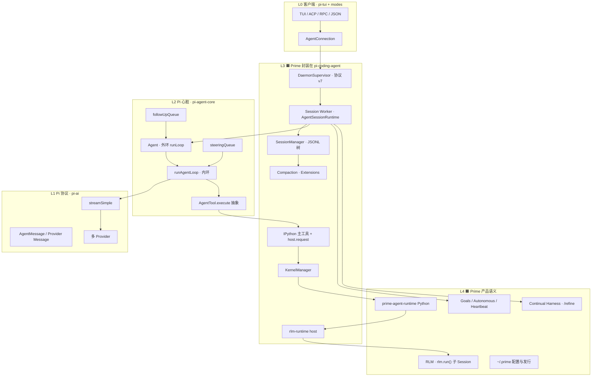
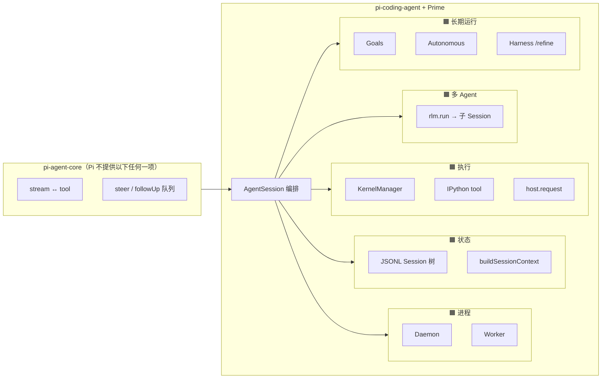
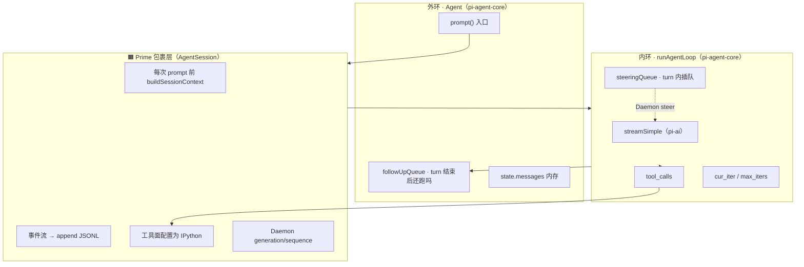
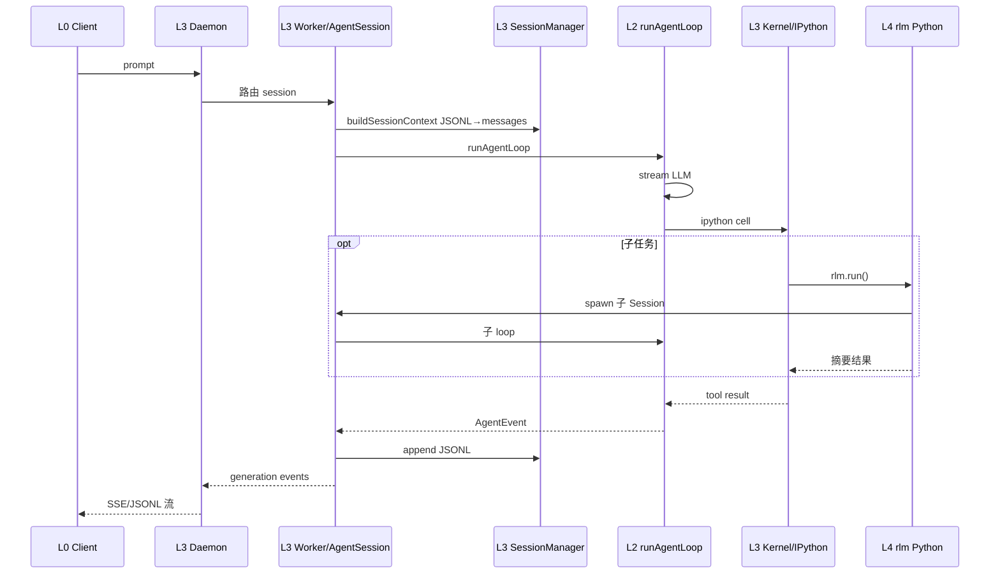
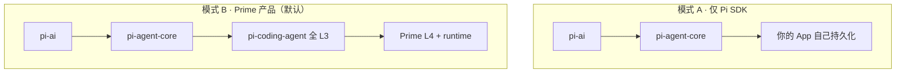

# Pi 栈架构图（含 Prime 封装层）

> **读图方式**：**灰色 = Pi 各包固有能力**；**橙色 = Prime 产品封装**（在 `pi-coding-agent` + `prime-agent-runtime` 里实现）。  
> **效果对照**：[PI_AND_PRIME.md §4](../prime-agent-architecture/_archive/PI_AND_PRIME.md#4-prime-在-pi-之上封装了什么)

---

## 1. 总览：一张图看全栈

### 图例

| 标记 | 含义 | 能否单独 `npm install` 嵌入 |
|------|------|------------------------------|
| **L1–L2 灰底** | **Pi 循环与 LLM 协议** | ✅ `pi-ai` + `pi-agent-core` 即可跑 loop |
| **L3 橙底** | **coding-agent 产品壳**（Prime 默认全开） | 需 `pi-coding-agent` |
| **L4 橙底** | **Prime Intellect 产品决策** | 同仓库 + Python runtime |

---

## 2. 封装边界：Prime 能力画在 Pi 哪一层上

**这是你问的「Prime 封装了什么」在架构图上的落点：**

| 你听到的名词 | 在图上位置 | Pi 有没有 | Prime 加了什么 **效果** |
|--------------|------------|-----------|-------------------------|
| **Daemon** | L3 `P_DM` | ❌ | 后台门卫；**关 UI 会话还在**；attach 重放 |
| **Worker** | L3 `P_WK` | ❌ | 一会话一间办公室；**loop 不在 TUI 进程** |
| **IPython** | L3 `P_IPY` | ❌（可有别的 tool） | **单主工具**；状态在变量里 |
| **KernelManager** | L3 `P_KM` | ❌ | 真 Jupyter 进程；注入 `rlm` |
| **RLM** | L3 `P_RLMH` + L4 `P_RLM` | ❌ | cell 里 `rlm.run()` → **子 Session** |
| **Goals** | L4 `P_GOL` | ❌ | **跨多轮总目标**，不是单句 prompt |
| **steer** | L2 `SQ` | ✅ **Pi 原生** | Prime 用 Daemon `steer` **注入**该队列 |
| **runAgentLoop** | L2 `RAL` | ✅ **Pi 原生** | Prime 在 Worker 里 **调用**它 |

---

## 3. 双环：Pi 心脏在图中的位置

Prime 所有「办公室 / 笔记本 / 隔间」都 **包在** 这对环外面。

| 环 | 回答的问题 | 没有 Prime 时 |
|----|------------|----------------|
| **内环** | 这一轮里：采样 → 工具 → 要否 steer？ | 同进程 SDK 照样转 |
| **外环** | 这一轮结束后：还有 follow-up 吗？ | 同左 |
| **🟧 包裹层** | 记在哪、谁持久跑、用什么工具、子任务怎么拆？ | **不存在** → 只是内存 loop |

---

## 4. 运行时数据流（同一张图的「动」）

用户发一句 `prompt` 时，**数据**经过哪些层（对照上图编号）：

---

## 5. 两种用法：图上剪哪一层

| | **模式 A** | **模式 B（Prime）** |
|--|------------|---------------------|
| **典型入口** | `new Agent(); agent.prompt()` | `AgentConnection.prompt()` → Daemon |
| **持久化** | 你自己 | JSONL 树 + compaction |
| **工具** | 任意 `AgentTool[]` | **IPython 主路径** |
| **子 Agent** | 你自己编排 | `rlm.run()` |
| **提升** | 轻、可嵌入 | **长时 coding + 可重连 + 可审计** |

---

## 6. 包 ↔ 图层对照（改代码时用）

| npm 包 | 图层 | 核心类型 |
|--------|------|----------|
| `pi-tui` | L0 | TUI 组件 |
| `pi-ai` | L1 | `streamSimple`, `Message` |
| `pi-agent-core` | L2 | `Agent`, `runAgentLoop`, queues |
| `pi-coding-agent` | L3 🟧 | `AgentSession`, `Daemon`, `Kernel`, `SessionManager` |
| `prime-agent-runtime` | L4 🟧 | `rlm`, `harness`（Python） |

构建顺序：`tui` → `ai` → `agent` → `coding-agent`。

---

## 7. 延伸阅读

| 主题 | 文档 |
|------|------|
| Prime 封装六决策（文字） | [PI_AND_PRIME §4](../prime-agent-architecture/_archive/PI_AND_PRIME.md) |
| Agent vs AgentSession 表 | [PI_AND_PRIME §5](../prime-agent-architecture/_archive/PI_AND_PRIME.md) |
| 源码目录树 | [ARCHITECTURE_PART1 §1.2.5](../prime-agent-architecture/_archive/ARCHITECTURE_PART1.md) |
| 跨项目 steer 对照 | [CROSS_AGENT_CONCEPT_MAP](../agent-doc-template/CROSS_AGENT_CONCEPT_MAP.md) |
| 九幕设计思想 | [DESIGN_THINKING_SERIES](../pi-agent/DESIGN_THINKING_SERIES.md) |
