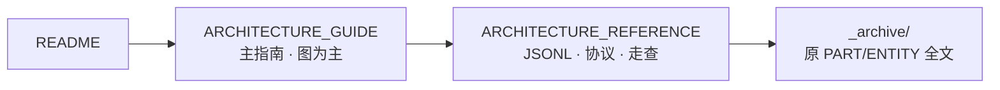

# Prime Agent — 架构导航

> **从这里开始** → [**ARCHITECTURE_GUIDE.md**](./ARCHITECTURE_GUIDE.md)（是什么 / 为什么 / Pi 关系 / 怎么做）

---

## 文档地图

| 文档 | 章节 |
|------|------|
| [ARCHITECTURE_GUIDE](./ARCHITECTURE_GUIDE.md#目录) | 一是什么 · 二为什么 · 三Pi关系 · 四端到端 · 五模块 · 六机制 · 七对照 · **八外部文章** |
| [EXTERNAL_ARTICLES](./EXTERNAL_ARTICLES_SYNTHESIS.md#目录) | 三篇微信整合 · 选型 · Factorio 治理 |
| [ARCHITECTURE_REFERENCE](./ARCHITECTURE_REFERENCE.md#目录) | 三层真相 · JSONL · Daemon · loop · ER · 场景 |

---

## 10 分钟速览

1. **Pi = 心脏** — `runAgentLoop` + steer/followUp → [GUIDE §6.1](./ARCHITECTURE_GUIDE.md#61-双环-loop)
2. **Prime = 壳** — Daemon、JSONL、IPython、RLM → [GUIDE §三](./ARCHITECTURE_GUIDE.md#三与-pi-的整体关系)
3. **客户端不跑 loop** → [GUIDE §4.2](./ARCHITECTURE_GUIDE.md#42-端到端时序带注释)
4. **Turn 不落盘** → [REFERENCE §1](./ARCHITECTURE_REFERENCE.md#1-三层真相模型)
5. **rlm ≠ steer** → [GUIDE §6.5](./ARCHITECTURE_GUIDE.md#65-rlm-子-session)

返回：[README.md](./README.md)
