# Prime Agent 架构指南（深入浅出）

> **源码**: `prime-agent/` monorepo（`pi-ai` → `pi-agent-core` → `pi-coding-agent` + `prime-agent-runtime`）  
> **技术参考**: [ARCHITECTURE_REFERENCE.md](./ARCHITECTURE_REFERENCE.md)（JSONL / 实体 / 走查场景）  
> **归档深潜**: [_archive/](./_archive/)（原 PART1–3、ENTITY 全文）

---

## 目录

- [一、是什么](#一是什么)
- [二、为什么这样设计](#二为什么这样设计)
- [三、与 Pi 的整体关系](#三与-pi-的整体关系)
- [四、怎么做到的（端到端）](#四怎么做到的端到端)
- [五、模块设计图](#五模块设计图)
  - [5.0 Archify 交互式图解](#50-archify-交互式图解)
- [六、核心机制](#六核心机制)
  - [6.1 双环 Loop](#61-双环-loop)
  - [6.2 Session 与 JSONL](#62-session-与-jsonl)
  - [6.3 IPython 与 host.request](#63-ipython-与-hostrequest)
  - [6.4 steer 与 follow-up](#64-steer-与-follow-up)
  - [6.5 RLM 子 Session](#65-rlm-子-session)
  - [6.6 Compaction 与 Harness](#66-compaction-与-harness)
  - [6.7 Goals 与 Autonomous](#67-goals-与-autonomous)
- [七、特点、边界与对照](#七特点边界与对照)
- [八、外部文章解读（整合）](#八外部文章解读整合)

---

## 一、是什么

### 1.1 一句话

**Prime Agent** = 在 **Pi 双环 Agent 栈** 之上，做成 **可断开重连、可编程子任务、可长期运行** 的编码/研究 Agent 产品：

- **进程**：Daemon 托管 Session Worker（客户端不跑 loop）
- **工具**：模型 **主要只见 IPython**（cell 里写 Python，副作用走 host）
- **状态**：**JSONL 树** 单账本（非 Turn 表）
- **子任务**：**`rlm.run()`** 在 cell 里 spawn **子 Session**（非 steer）
- **长期**：Harness / Goals / Compaction 跨多轮精炼上下文

### 1.2 三个名字别混

| 名字 | 指什么 |
|------|--------|
| **Pi（设计轴）** | 双环、`runAgentLoop`、`steeringQueue` / `followUpQueue` |
| **Pi（代码轴）** | npm 包 `pi-ai`、`pi-agent-core`、`pi-coding-agent`（在 **同一 monorepo**） |
| **Prime（产品）** | 发行名 + `~/.prime` + Python `prime-agent-runtime` + RLM/Goals 叙事 |

**Prime ≠ 外部再套一层 Pi** —— Pi 包就在 `prime-agent/packages/` 里，Prime 是在最上面加 **进程、持久化、IPython、RLM**。

### 1.3 30 秒数据流

```text
TUI / RPC / ACP
  → AgentConnection（客户端边界）
  → DaemonSupervisor 路由
  → Session Worker · AgentSession
  → runAgentLoop：stream → IPython cell → host.request → 追加消息
  → SessionManager → ~/.prime/agent/sessions/<id>.jsonl
```

---

## 二、为什么这样设计

| 痛点 | 典型 Agent | Prime 的选择 | 效果 |
|------|------------|--------------|------|
| 关终端任务就死 | 同进程 loop | **Daemon + Worker** | attach 重连，generation 续播 |
| 工具 schema 爆炸 | bash/read/write/MCP 并列 | **单主工具 IPython** | 状态在变量里；组合用代码 |
| 子任务污染父上下文 | 子输出贴进聊天 | **`rlm.run()` 子 Session** | 父只见函数返回值 |
| 长对话撑爆窗口 | 仅内存 messages | **JSONL + Compaction 节点** | 可审计、可分支、可折叠 |
| 多轮忘了总目标 | 靠用户重复 | **Goals + Harness** | 跨 Turn 状态在 Session 层 |
| 循环与产品缠在一起 | 一切写在一个 loop | **Pi 心脏无盘、无 Daemon** | 可嵌入 SDK；Prime 加壳 |

**设计哲学**：**Pi 管怎么转；Prime 管在哪转、记什么、用什么工具、子任务怎么拆。**

---

## 三、与 Pi 的整体关系

### 3.1 全栈一张图

> **图例**：白/灰底 = **Pi 固有能力**；**🟧** = **Prime 封装**（在 `pi-coding-agent` + Python runtime）

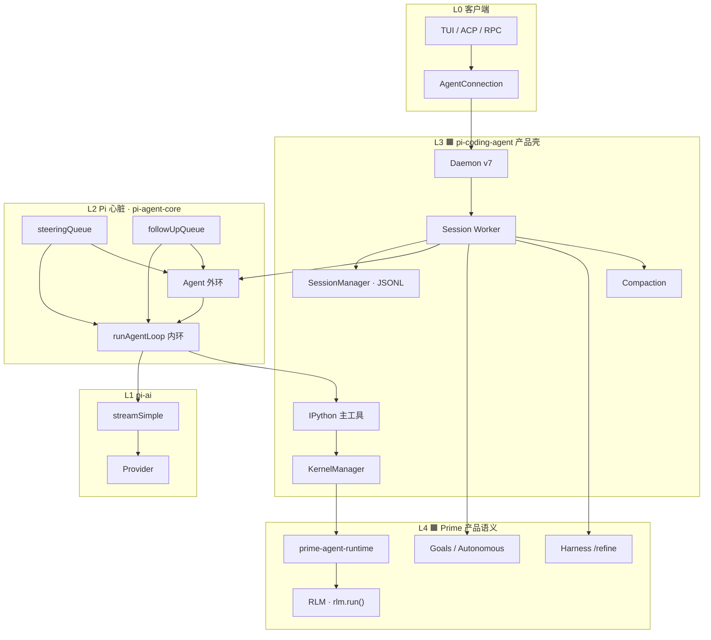

### 3.2 依赖方向（monorepo 真源）

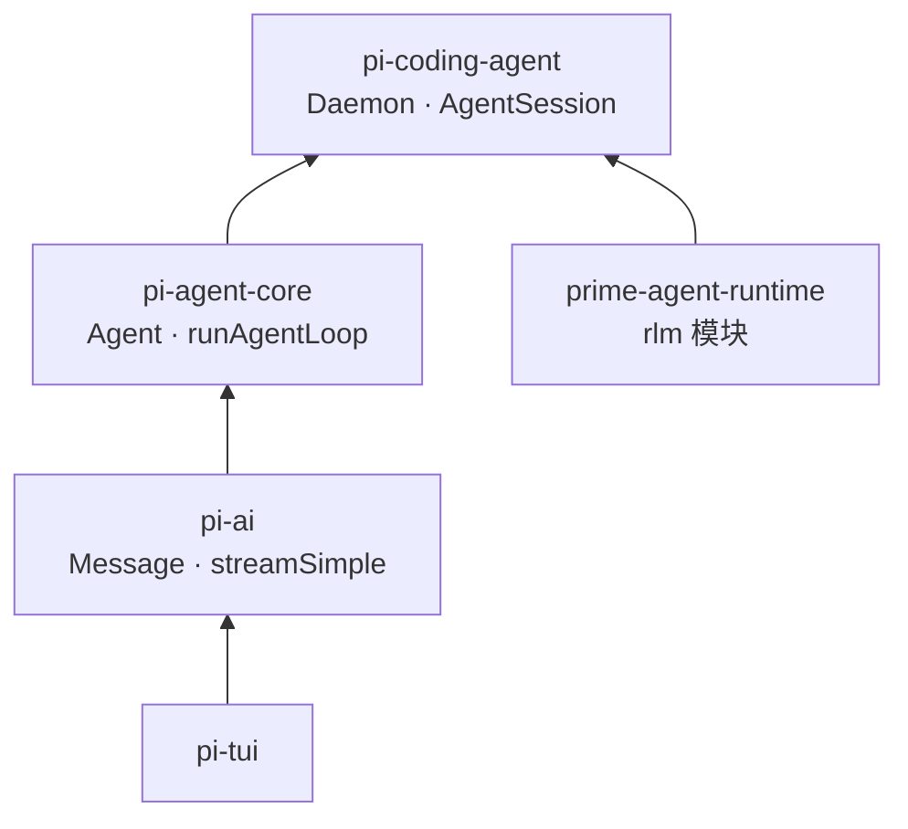

构建顺序：`tui` → `ai` → `agent` → `coding-agent`。

### 3.3 Prime 封装了什么（对照 Pi）

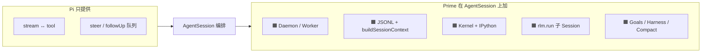

| 能力 | Pi 有？ | Prime 加的效果 |
|------|---------|----------------|
| `runAgentLoop` | ✅ | Worker 里调用 |
| steer 队列 | ✅ | Daemon `steer` 注入 |
| Daemon | ❌ | 关 UI 会话还在 |
| JSONL 树 | ❌ | 审计、分支、resume |
| IPython 主工具 | ❌ | 变量态 + 代码组合 |
| `rlm.run()` | ❌ | 编程式子 Agent |
| Goals | ❌ | 跨轮总目标 |

### 3.4 `Agent` vs `AgentSession`（封装边界）

| 维度 | `Agent`（Pi） | `AgentSession`（Prime） |
|------|---------------|-------------------------|
| 角色 | 循环「把手」 | 产品编排 + 持久化 |
| 消息 | 内存 `state.messages` | `SessionManager` → JSONL |
| 循环 | 调 `runAgentLoop` | 订阅事件 `appendMessage` |
| 工具 | `AgentTool.execute` | Kernel + IPython 包装 |
| 子 Agent | 无 | `rlm-runtime` |
| 压缩 | 无 | `CompactionEntry` |

**可只用 Pi**：`pi-agent-core` + `pi-ai` 可嵌入别的产品；**Prime 默认路径**是全套 coding-agent + Daemon。

---

## 四、怎么做到的（端到端）

### 4.1 四层进程 — 谁持有执行权

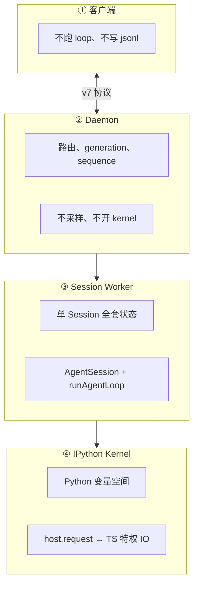

### 4.2 端到端时序（带注释）

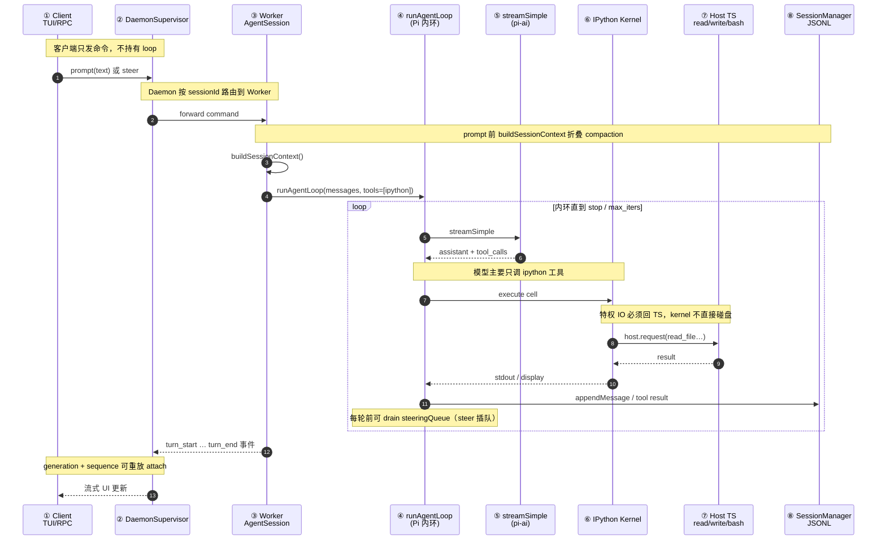

### 4.3 冷启动到第一句回复（简化）

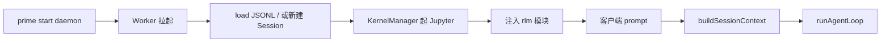

---

## 五、模块设计图

### 5.0 Archify 交互式图解

> 由 [Archify](https://github.com/tt-a1i/archify) 生成，可在浏览器中缩放、追踪关系、切换明暗主题。源码规格见 `diagrams/*.json`。

完整 **10 张** Archify 交互图见 [diagrams/README.md](./diagrams/README.md)（`showcase` 质量档）。

| 图 | 类型 | 打开 |
|----|------|------|
| 架构总览 | architecture | [stack.html](./diagrams/prime-agent-stack.html) · [规范名](./diagrams/prime-agent-stack.architecture.html) |
| 单轮时序（简） | sequence | [turn.html](./diagrams/prime-agent-turn.html) · [规范名](./diagrams/prime-agent-turn.sequence.html) |
| 端到端详版 | sequence | [e2e.html](./diagrams/prime-agent-e2e.html) · [规范名](./diagrams/prime-agent-e2e.sequence.html) |
| RLM 子 Session | sequence | [rlm.html](./diagrams/prime-agent-rlm.html) · [规范名](./diagrams/prime-agent-rlm.sequence.html) |
| JSONL 数据流 | dataflow | [jsonl.html](./diagrams/prime-agent-jsonl.html) · [规范名](./diagrams/prime-agent-jsonl.dataflow.html) |
| 冷启动 | workflow | [cold-start.html](./diagrams/prime-agent-cold-start.html) · [规范名](./diagrams/prime-agent-cold-start.workflow.html) |
| steer / follow-up | workflow | [steer.html](./diagrams/prime-agent-steer.html) · [规范名](./diagrams/prime-agent-steer.workflow.html) |
| Compaction / Harness | workflow | [compaction.html](./diagrams/prime-agent-compaction.html) · [规范名](./diagrams/prime-agent-compaction.workflow.html) |
| 双环 Loop | architecture | [dual-loop.html](./diagrams/prime-agent-dual-loop.html) · [规范名](./diagrams/prime-agent-dual-loop.architecture.html) |
| Goals | workflow | [goals.html](./diagrams/prime-agent-goals.html) · [规范名](./diagrams/prime-agent-goals.workflow.html) |

### 5.1 `pi-coding-agent` 模块总览

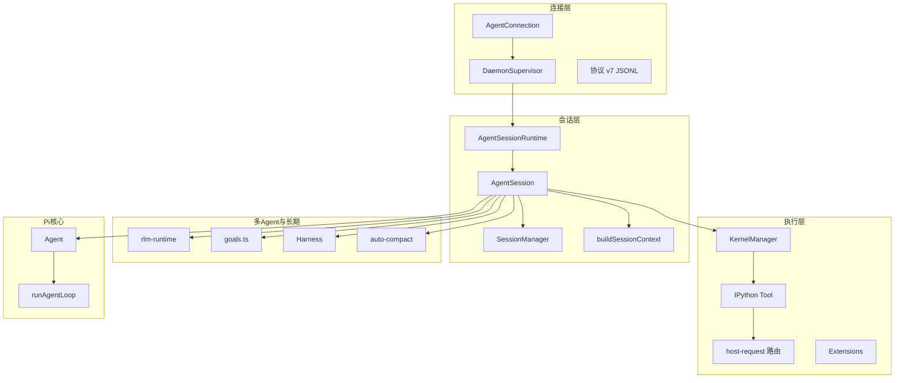

### 5.2 包职责表

| 包 | npm | 职责 |
|----|-----|------|
| `packages/ai` | `pi-ai` | Message、Provider、`streamSimple` |
| `packages/agent` | `pi-agent-core` | `Agent`、`runAgentLoop`、双队列 |
| `packages/coding-agent` | `pi-coding-agent` | Daemon、AgentSession、Kernel、RLM |
| `prime-agent-runtime` | Python | kernel 内 `rlm`、harness 注入 |
| `packages/tui` | `pi-tui` | 终端 UI |

### 5.3 类关系（简化）

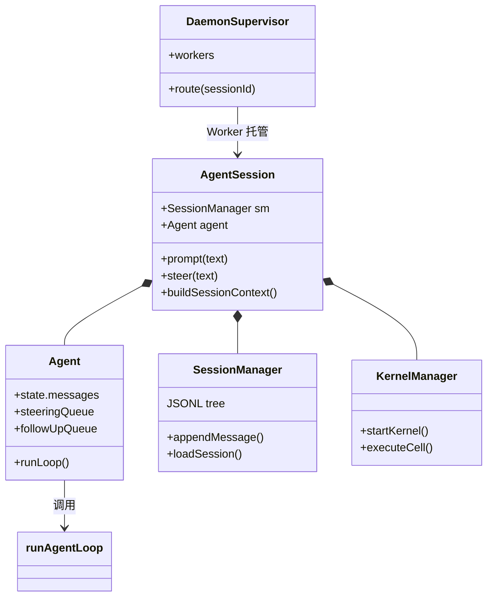

---

## 六、核心机制

### 6.1 双环 Loop

**Pi 心脏**：外环管「这一轮结束后还跑吗」，内环管「这一轮里 sample→tool→steer」。

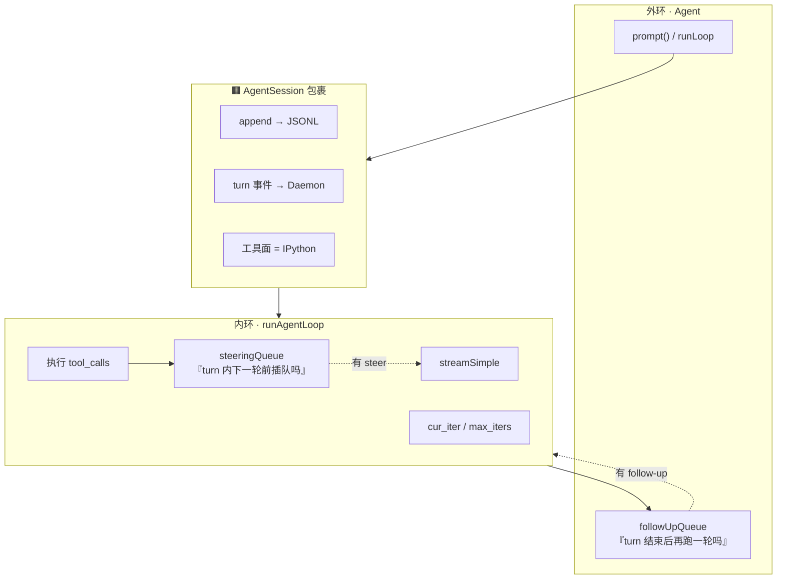

| 环 | 回答问题 | 典型 API |
|----|----------|----------|
| **内环** | 本次采样后工具怎么跑、要不要 steer？ | `runAgentLoop` |
| **外环** | 本次 turn 结束后还继续吗？ | `followUpQueue` |
| **包裹层** | 记在哪、谁持久跑？ | `AgentSession` |

### 6.2 Session 与 JSONL

**三句话**：

1. **Turn 不落盘** — 只有 `turn_start`/`turn_end` **运行时事件**  
2. **JSONL 树是真相** — 每条 `SessionEntry` 有 `parentId`，可分支  
3. **LLM 吃的是视图** — 每次 `buildSessionContext()` 折叠 compaction 后现算 `messages[]`

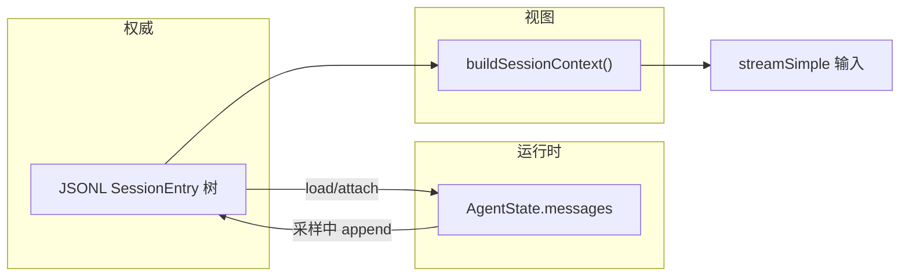

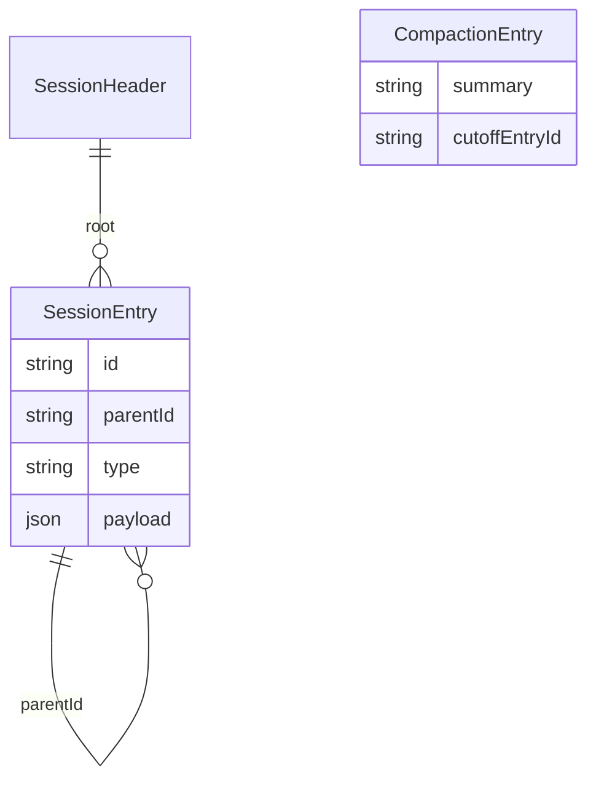

→ 字段级见 [ARCHITECTURE_REFERENCE §2](./ARCHITECTURE_REFERENCE.md#2-jsonl-与-buildsessioncontext)

### 6.3 IPython 与 host.request

**为什么 IPython 做主工具？**

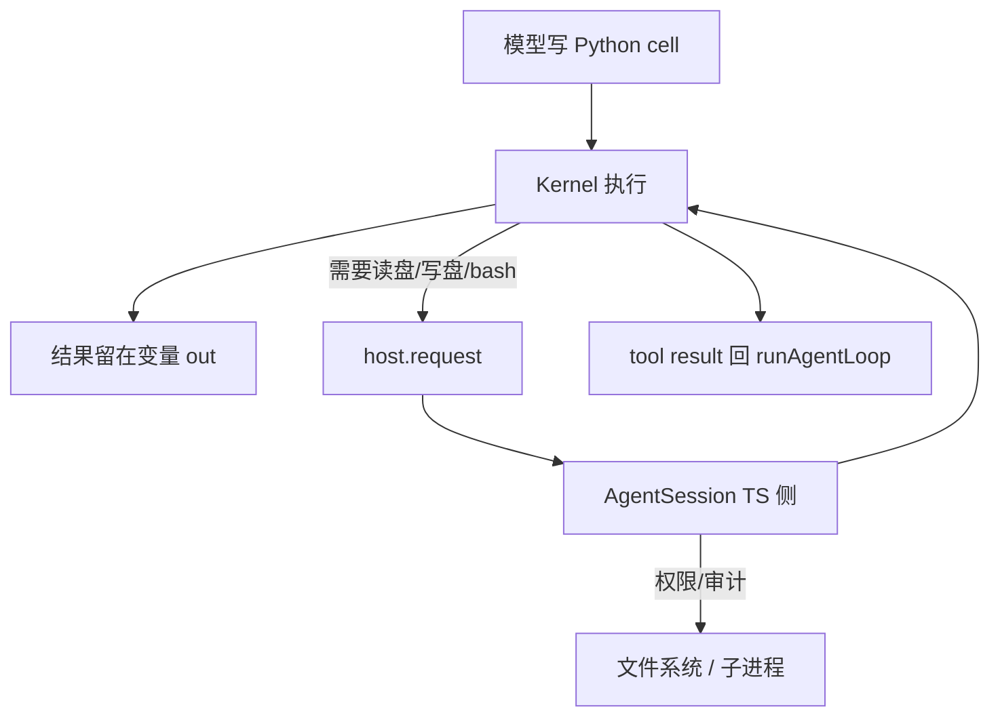

| 对比 | 多 tool ReAct | Prime IPython |
|------|---------------|---------------|
| 状态 | 在 chat history | 在 **kernel 变量** |
| 组合 | 多次 tool call | **一段 Python** |
| 子任务 | spawn 或贴摘要 | **`rlm.run()`** |

→ Daemon v7 与 host.request 对照全文：[RUNTIME_BRIDGES.md](./RUNTIME_BRIDGES.md)

### 6.4 steer 与 follow-up

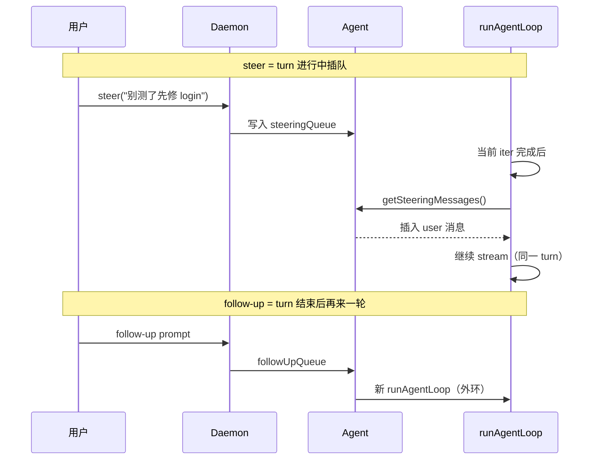

| | steer | 新 prompt | rlm.run() |
|--|-------|-----------|-----------|
| **层级** | Pi 队列 | 外环新 turn | 子 Session |
| **上下文** | 同一 Session | 同一 Session | **隔离**子 JSONL |
| **类比** | 插嘴 | 下一轮对话 | 调函数 |

### 6.5 RLM 子 Session

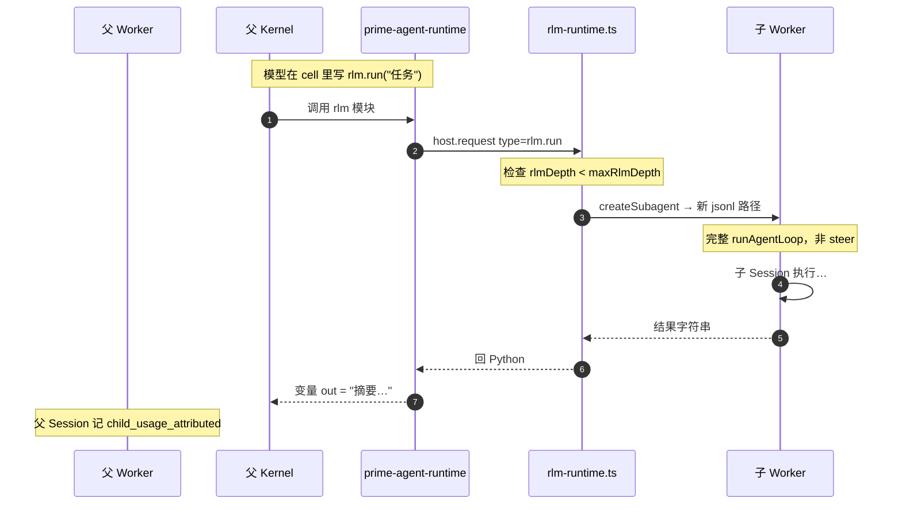

**要点**：子任务 **不进父 chat 全文**；父 loop 只见到 **一次 ipython tool 的返回值**。

### 6.6 Compaction 与 Harness

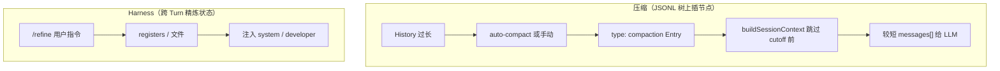

| 机制 | 存哪 | 模型何时看见 |
|------|------|--------------|
| **Compaction** | JSONL `CompactionEntry` | 下次 `buildSessionContext` |
| **Harness** | `~/.prime` + Session 元数据 | prompt 前合并 |
| **原始历史** | JSONL 仍保留 | 审计/分支，不删行 |

### 6.7 Goals 与 Autonomous

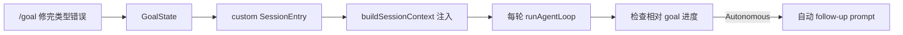

| 组件 | 作用 |
|------|------|
| **Goals** | 跨多轮 OKR，非单条 user message |
| **Autonomous** | 预算内自动续跑直到 cleared |
| **Heartbeat** | Daemon 侧健康/调度（产品层） |

均在 **`AgentSession`**，**不在** `pi-agent-core`。

→ 原理对照 + **各举一例**（修 TS 类型 + refine 记踩坑）：[**GOALS_AND_REFINE.md**](./GOALS_AND_REFINE.md)

---

## 七、特点、边界与对照

### 7.1 Prime 擅长

| 特点 | 说明 |
|------|------|
| 可断开重连 | Daemon + JSONL + generation |
| 编程式子 Agent | `rlm.run()` 像函数 |
| 变量态编码 | IPython 减少 chat 膨胀 |
| 可审计历史 | JSONL 树可分支 |
| Pi 可嵌入 | 心脏与产品壳分离 |

### 7.2 非目标 / 边界

| 无 / 弱 | 说明 |
|---------|------|
| 多工具并列 schema | 产品选择 IPython 为主 |
| Turn 表持久化 | 故意只有事件 |
| 无 Daemon 的轻量路径 | 可用纯 Pi SDK，但不是默认 Prime |
| 多租户 Gateway | 需自建 |

### 7.3 与 Codex / OpenCode 对照

| 维度 | Prime | Codex | OpenCode |
|------|-------|-------|----------|
| 进程 | Daemon+Worker | Thread+Session | Drain 进程内 |
| 主工具 | IPython | 多工具 | 多工具 |
| 子 Agent | rlm.run 子 Session | spawn Thread | subagent Session |
| 持久化 | JSONL 树 | Rollout | SQLite EventV2 |
| steer | steeringQueue | pending_input | session_input steer |

---

## 八、外部文章解读（整合）

三篇 Prime 微信公众号文章（[AI Online](https://mp.weixin.qq.com/s/zT8bzaPFIJokbYx96AT8Og)、[拾码备忘录](https://mp.weixin.qq.com/s/LbPrfXMn84wiqSZt4NRBbA)、[应用研究社](https://mp.weixin.qq.com/s/LRD-XwsGrGaKRx4JBCNxtw)）及 Pi 架构图解（[九包三层](https://mp.weixin.qq.com/s/WB24MCub0fosrhZOlEiSAQ)）与源码架构的对照、**§11 逐篇摘录**、选型决策树、Factorio 治理案例，见专文：

**[EXTERNAL_ARTICLES_SYNTHESIS.md](./EXTERNAL_ARTICLES_SYNTHESIS.md)**

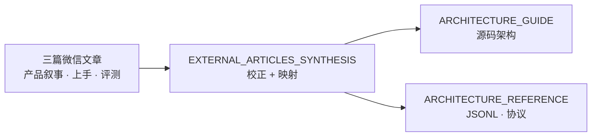

| 文章贡献 | 整合位置 |
|----------|----------|
| RLM + Harness「为什么」 | SYNTHESIS §2 |
| `@` / `!` / `!!` / `/tree` | SYNTHESIS §5 |
| 与 Codex/CC/**Pi** 话术校正 | SYNTHESIS §3 |
| ARC 评测与 Stars≠就绪 | SYNTHESIS §6 |
| Factorio 作弊 → Harness 风险 | SYNTHESIS §7 |
| 选型决策树 | SYNTHESIS §8 |

---

## 延伸阅读

| 主题 | 文档 |
|------|------|
| JSONL / 实体 / 走查 | [ARCHITECTURE_REFERENCE.md](./ARCHITECTURE_REFERENCE.md) |
| 原 PART 全文 | [_archive/](./_archive/) |
| 跨项目 Pi 列 | [CROSS_AGENT_CONCEPT_MAP](../agent-doc-template/CROSS_AGENT_CONCEPT_MAP.md) |

**返回**: [README.md](./README.md)
