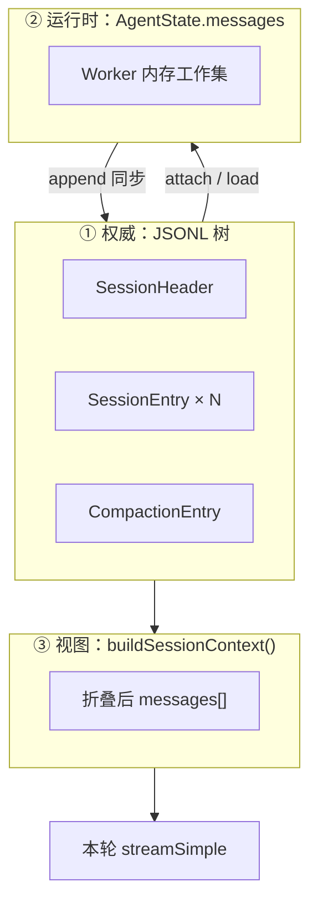
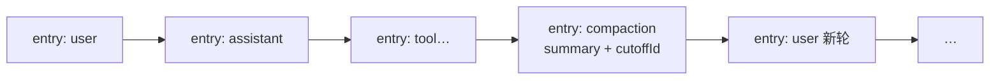
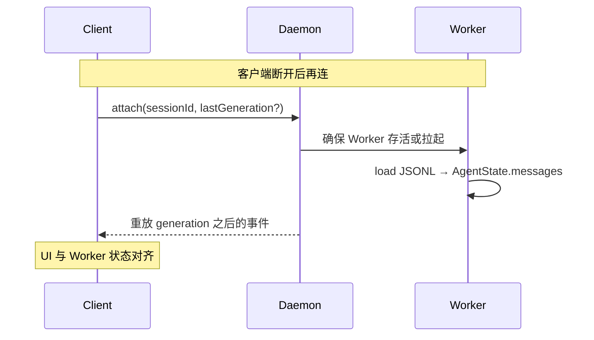
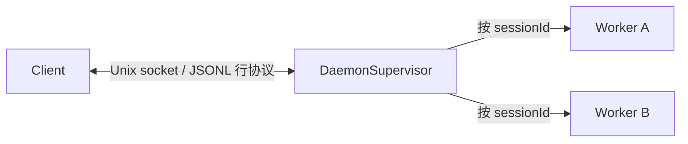
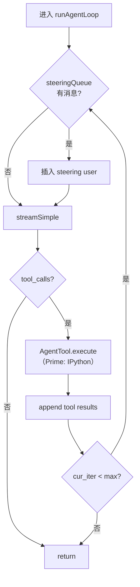
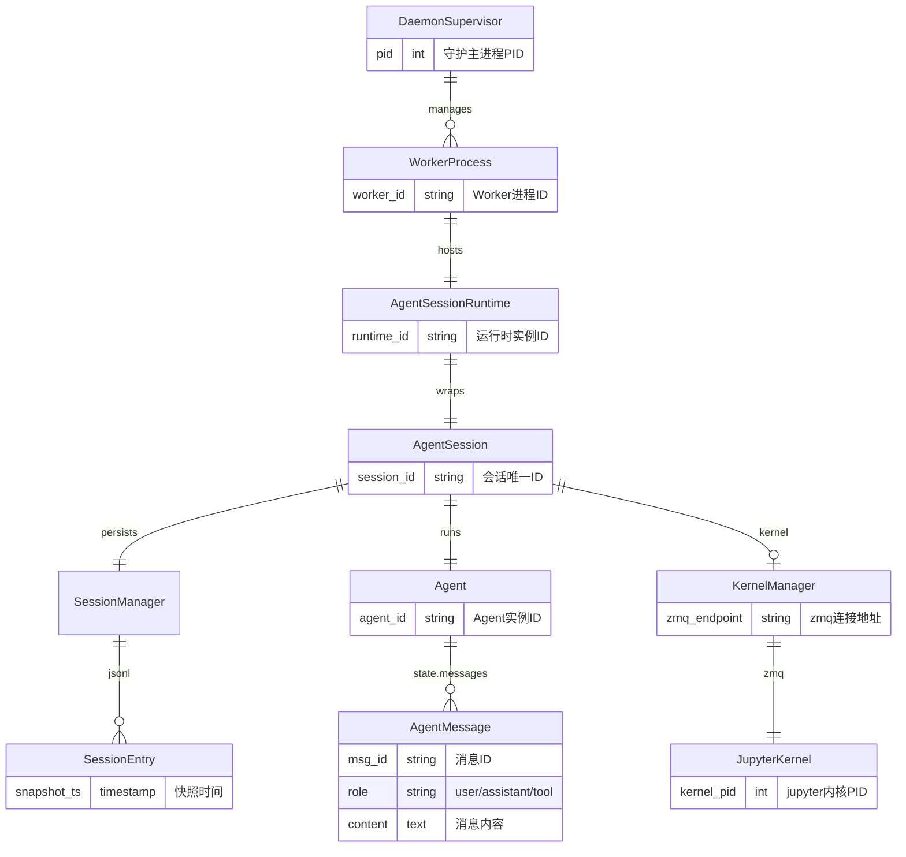
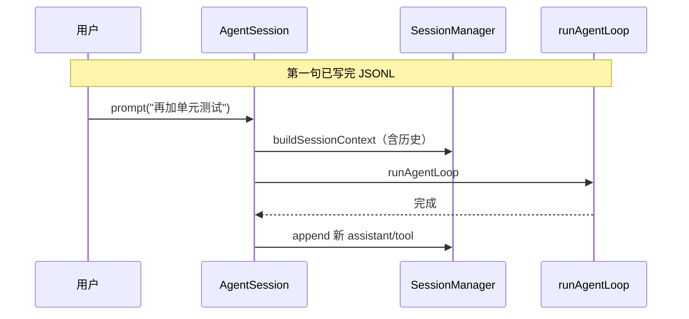

# Prime Agent 技术参考

> **主指南（是什么 / 为什么 / 怎么做）**：[ARCHITECTURE_GUIDE.md](./ARCHITECTURE_GUIDE.md)  
> **归档全文**：[_archive/](./_archive/)（PART1–3、ENTITY、WALKTHROUGH 原稿）

---

## 目录

- [1. 三层真相模型](#1-三层真相模型)
- [2. JSONL 与 buildSessionContext](#2-jsonl-与-buildsessioncontext)
- [3. Daemon v7 协议要点](#3-daemon-v7-协议要点)
- [3.1 host.request（执行面）](#31-hostrequest执行面)
- [4. runAgentLoop 内层步骤](#4-runagentloop-内层步骤)
- [5. 实体关系图](#5-实体关系图)
- [6. 走查场景](#6-走查场景)
- [7. 源码速查](#7-源码速查)

---

## 1. 三层真相模型



| 层 | 易错点 |
|----|--------|
| JSONL | **有** `parentId` 可分支；compaction **不删**旧行 |
| Turn 事件 | **无** turn_id 落盘；UI「一轮」≠ 表一行 |
| buildSessionContext | 每次 prompt **重新算**；与磁盘 messages 数组 **不同构** |

---

## 2. JSONL 与 buildSessionContext

### 2.1 Entry 类型（常见）

| type | 含义 |
|------|------|
| `message` | user / assistant / tool |
| `compaction` | 摘要节点 + cutoff 指针 |
| `custom` | Goals 等扩展状态 |

### 2.2 Compaction 在树上的位置



**buildSessionContext 逻辑（概念）**：

```text
walk JSONL tree from root
  skip entries before latest compaction cutoff（或按策略折叠）
  merge Harness / Goals 片段到 system/developer
  return messages[] for runAgentLoop
```

### 2.3 attach / resume



---

## 3. Daemon v7 协议要点



| 概念 | 作用 |
|------|------|
| **generation** | 连接代次；attach 时对齐 |
| **sequence** | 事件单调序号；重放游标 |
| **steer** | 转发到 Worker → steeringQueue |
| **prompt** | 新 turn / follow-up |

**边界**：Daemon **不**跑 `runAgentLoop`、**不**开 Kernel。

→ 完整说明（含 capability、命令族、与 host.request 对照）：[**RUNTIME_BRIDGES.md**](./RUNTIME_BRIDGES.md)

### 3.1 host.request（执行面）

| 项 | 说明 |
|----|------|
| **形态** | Jupyter Comm target `"host.request"` |
| **方向** | Python cell → `KernelManager` → `AgentSession.dispatchHostRequest` |
| **用途** | 读/写文件、bash、`rlm.run` 子 Session、MCP、Goals 等特权 IO |
| **与 Daemon 关系** | Daemon = 客户端控制面；host.request = Worker 内 kernel↔TS，客户端不可见 |

```text
模型 ipython cell → 纯 Python 在 kernel
  → 需副作用时 host.request → TS 策略校验 → 结果回 cell → tool result
```

→ 时序、类型表、安全语义：[RUNTIME_BRIDGES.md §二](./RUNTIME_BRIDGES.md#二hostrequest)

---

## 4. runAgentLoop 内层步骤



| 参数 | 典型来源 |
|------|----------|
| `messages` | `buildSessionContext()` |
| `tools` | `[ipython]` + extensions |
| `getSteeringMessages` | `Agent.steeringQueue` drain |

**源码**：`packages/agent/src/agent/run-agent-loop.ts`（路径以仓库为准）

---

## 5. 实体关系图



---

## 6. 走查场景

### 6.1 场景 A：第二句话（同 Session 续聊）



### 6.2 场景 B：steer 中途改道

```text
Turn 进行中 → 用户 steer → steeringQueue
→ 当前 iter 结束 → drain steer 消息进 messages
→ 继续 stream（不新开 Session）
```

### 6.3 场景 C：rlm.run 子任务

```text
cell: out = rlm.run("扫描 TODO", timeout=120_000)
→ 子 Worker + 子 jsonl
→ 子 loop 完整执行
→ 返回字符串给 out
→ 父 Session 仅多一条 tool result
```

### 6.4 场景 D：auto-compact

```text
token 超阈值 → 插入 CompactionEntry
→ 下次 buildSessionContext 用摘要替代 cutoff 前内容
→ JSONL 原行仍在（审计）
```

→ 更细步骤见 [_archive/CORE_RUNTIME_WALKTHROUGH.md](./_archive/CORE_RUNTIME_WALKTHROUGH.md)

---

## 7. 源码速查

| 主题 | 路径（`prime-agent/` 下） |
|------|---------------------------|
| runAgentLoop | `packages/agent/src/` |
| AgentSession | `packages/coding-agent/src/` |
| SessionManager / JSONL | `packages/coding-agent/src/session/` |
| Daemon | `packages/coding-agent/src/daemon/` |
| KernelManager | `packages/coding-agent/src/kernel/` |
| rlm-runtime | `packages/coding-agent/src/rlm/` |
| goals | `packages/coding-agent/src/goals/` |
| Python rlm | `prime-agent-runtime/` |

---

**返回**: [ARCHITECTURE_GUIDE.md](./ARCHITECTURE_GUIDE.md) · [README.md](./README.md)
