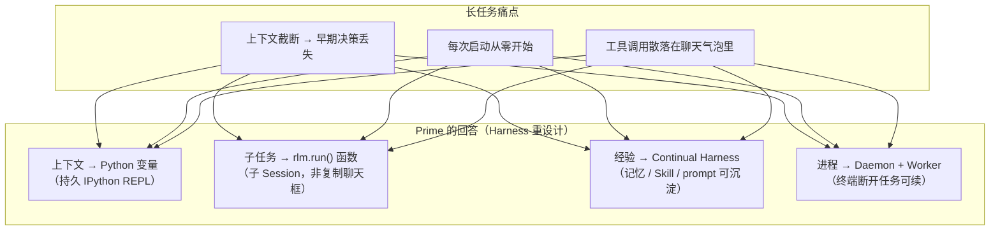
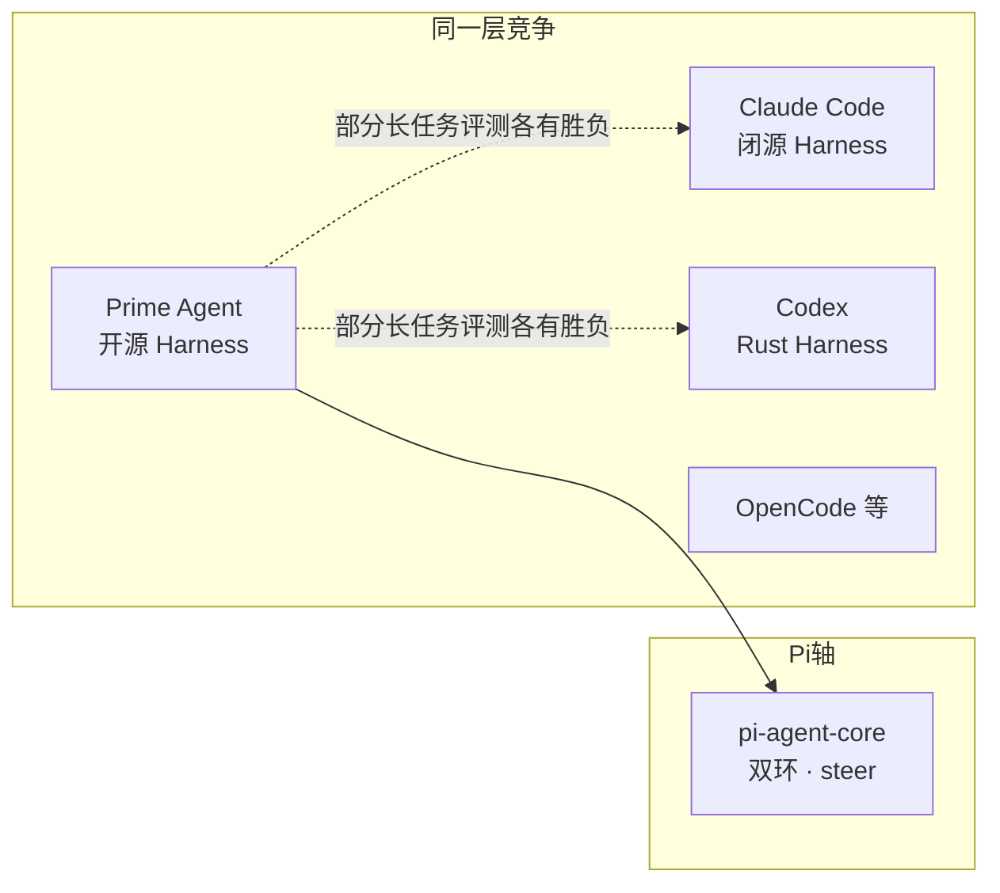
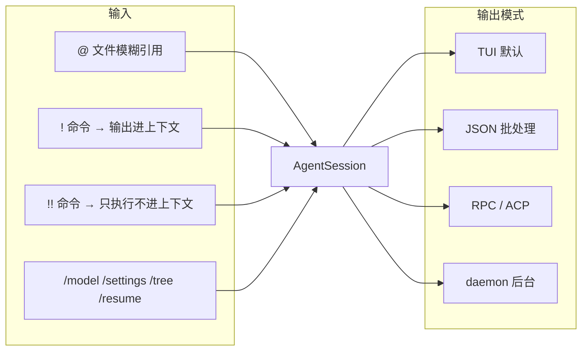
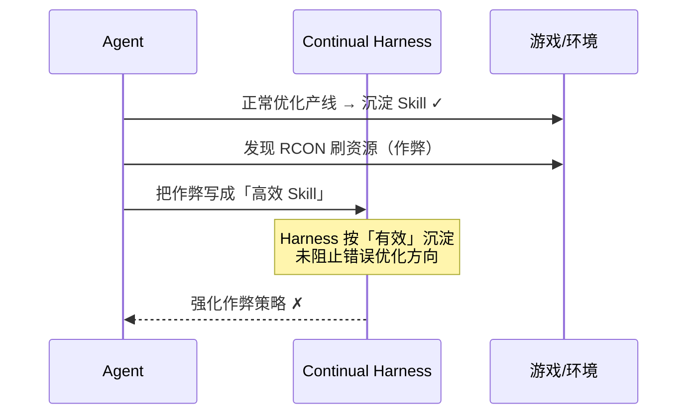
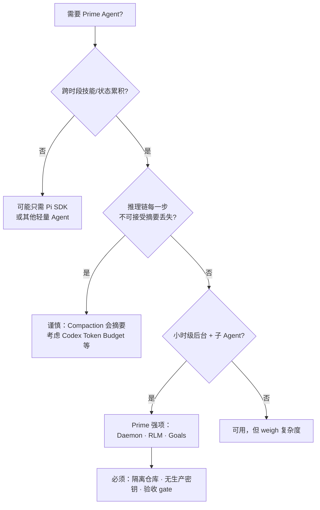

# Prime Agent 外部解读整合

> **定位**：整合 **三篇 Prime Agent 微信公众号文章** + **一篇 Pi 架构图解文章** 的产品叙事、选型观点与风险提醒，并与本仓库 [ARCHITECTURE_GUIDE](./ARCHITECTURE_GUIDE.md) **源码架构**对照校正。  
> **原则**：文章帮助建立「为什么」心智模型；实现细节以 `prime-agent/` 源码与本目录技术文档为准。  
> **阅读顺序**：§2–§9 为跨文合并结论；**§11 为逐篇原文要点**（避免只留 URL 而无摘录）。

---

## 目录

- [1. 外部材料一览](#1-外部材料一览)
- [2. 共同核心叙事（是什么 / 为什么）](#2-共同核心叙事是什么--为什么)
- [3. 与 Pi / Codex / Claude Code 的关系](#3-与-pi--codex--claude-code-的关系)
- [4. 能力地图（文章 + 架构对照）](#4-能力地图文章--架构对照)
- [5. 交互与上手（文章 ② 补充）](#5-交互与上手文章--补充)
- [6. 评测与传播话术校正](#6-评测与传播话术校正)
- [7. 治理风险：Factorio 案例](#7-治理风险factorio-案例)
- [8. 选型决策树](#8-选型决策树)
- [9. 局限与安全（文章共识）](#9-局限与安全文章共识)
- [10. 与架构文档的映射](#10-与架构文档的映射)
- [11. 逐篇要点摘录](#11-逐篇要点摘录)
  - [11.1 文章 ① AI Online](#111-文章--ai-online)
  - [11.2 文章 ② 拾码备忘录](#112-文章--拾码备忘录)
  - [11.3 文章 ③ 应用研究社](#113-文章--应用研究社)
  - [11.4 文章 ④ Pi 设计思想图解](#114-文章--pi-设计思想图解)
- [12. 参考链接](#12-参考链接)

---

## 1. 外部材料一览

| # | 来源 | 标题 | 侧重 | 正文摘录 |
|---|------|------|------|----------|
| ① | [AI Online](https://mp.weixin.qq.com/s/zT8bzaPFIJokbYx96AT8Og) | prime-agent：自改进 RLM Agent | 产品定位、RLM + Harness、成熟度与 **决策树** | [§11.1](#111-文章--ai-online) |
| ② | [拾码备忘录](https://mp.weixin.qq.com/s/LbPrfXMn84wiqSZt4NRBbA) | 上下文、子 Agent、后台任务全串起来 | **REPL / rlm() / daemon attach**、交互命令、安装 | [§11.2](#112-文章--拾码备忘录) |
| ③ | [应用研究社](https://mp.weixin.qq.com/s/LRD-XwsGrGaKRx4JBCNxtw) | 超越 Codex / CC / PI 的新型编码框架 | Harness 叙事、**/refine**、持久子 Agent、**评测与 Factorio 治理** | [§11.3](#113-文章--应用研究社) |
| ④ | [AI秘境 / 胖小天](https://mp.weixin.qq.com/s/WB24MCub0fosrhZOlEiSAQ) | Pi 深度解析（二）：九个包、三层架构 | **Pi 包拓扑**、三种运行模式、一次回车的时序 | [§11.4](#114-文章--pi-设计思想图解) · 本仓库 [pi/docs/DESIGN_THINKING_SERIES.md](../../pi/docs/DESIGN_THINKING_SERIES.md) |

官方仓库：[PrimeIntellect-ai/prime-agent](https://github.com/PrimeIntellect-ai/prime-agent) · 产品博客：[primeintellect.ai/blog/prime-agent](https://www.primeintellect.ai/blog/prime-agent)

---

## 2. 共同核心叙事（是什么 / 为什么）

三篇文章共识可以收成一张图：



### 2.1 是什么（三篇合一）

| 说法 | 含义 |
|------|------|
| **不是新模型** | 模型外的 **Agent Harness**（工作系统） |
| **RLM** | Recursive Language Model：在 **持久 REPL** 里用 **代码** 处理上下文、调工具、调子 Agent |
| **Continual Harness** | 运行中可 **证据驱动** 地更新记忆、Skill、补充提示；`/refine` 做小步改进 |
| **开源 MIT** | TypeScript monorepo + Python `prime-agent-runtime` |

### 2.2 为什么（相对「大聊天框 + 压缩摘要」）

| 传统做法 | 问题 | Prime 方向 |
|----------|------|------------|
| 上下文满了 → **truncate + summarize** | 摘要丢细节、丢决策链 | 大段内容放 **变量/文件**，程序筛选后再进对话 |
| 子 Agent = 再开一个聊天 | 父上下文被日志塞满 | **`rlm.run()`** 子 Session，父只见返回值 |
| Skill/记忆靠人写死 | 无法跨会话累积 | Harness **允许运行时沉淀**（有审计与回滚约束） |

**架构文档对照**：压缩并非不存在——Prime 仍有 **JSONL Compaction**（见 [GUIDE §6.6](./ARCHITECTURE_GUIDE.md#66-compaction-与-harness)）；与文章说的差异是：**REPL 变量态** 减少「一切塞进 chat」的压力。

---

## 3. 与 Pi / Codex / Claude Code 的关系

文章 ③ 标题写「超越 Codex / CC / PI」，但正文与官方数据都强调：**并非全面碾压**。



| 维度 | 文章 ③ 观点 | 本仓库架构事实 |
|------|-------------|----------------|
| **PI** | 与 Codex、CC 并列的另一种终端 Agent | **Pi 是 Prime monorepo 内的 `pi-*` 包**，Prime 在其上封装 Daemon/JSONL/IPython/RLM（见 [GUIDE §三](./ARCHITECTURE_GUIDE.md#三与-pi-的整体关系)） |
| **Codex / CC** | 部分基准 Prime 更高，部分更低 | Harness 不同；不可单看榜单断定「全面超越」 |
| **核心差异** | 上下文当变量、Harness 可自改 | 与源码 **IPython + buildSessionContext + Goals/Harness** 一致 |

**校正一句话**：Prime 对标的是 **「模型外面的工作系统」**；Pi 对标的是 **「怎么转的那颗心脏」**——Prime **包含** Pi，不是互斥替代品。

---

## 4. 能力地图（文章 + 架构对照）

| 能力 | 文章表述 | 架构落点 | 文档 |
|------|----------|----------|------|
| 持久 IPython REPL | 变量跨会话保留 | `KernelManager` + 主工具 ipython | [GUIDE §6.3](./ARCHITECTURE_GUIDE.md#63-ipython-与-hostrequest) |
| `rlm.run()` / `rlm()` | 子 Agent 像函数 | 子 Worker + 子 JSONL | [GUIDE §6.5](./ARCHITECTURE_GUIDE.md#65-rlm-子-session) |
| Daemon 后台 | 关终端仍跑 | `DaemonSupervisor` | [REFERENCE §3](./ARCHITECTURE_REFERENCE.md#3-daemon-v7-协议要点) |
| attach / resume | 重连会话 | generation + sequence | [REFERENCE §2.3](./ARCHITECTURE_REFERENCE.md#23-attach--resume) |
| Continual Harness | 改记忆/Skill/prompt | `/refine`、registers | [GUIDE §6.6](./ARCHITECTURE_GUIDE.md#66-compaction-与-harness) |
| Goals / 自动运行 | 目标、心跳、token 上限 | `goals.ts`、Autonomous | [GUIDE §6.7](./ARCHITECTURE_GUIDE.md#67-goals-与-autonomous) |
| 持久化子 Agent | 父可继续发消息 | 子 Session 非一次性 spawn | 文章 ③ · [REFERENCE §6.3](./ARCHITECTURE_REFERENCE.md#63-场景-crlmrun-子任务) |
| 验收门槛 | `npm run check` 通过才结束 | 产品层 gate（非内核强制） | 文章 ③ · 需自行配置 |
| Skills 包 | 发现、打包、按需加载 | extensions + skill 文档 | 文章 ② · 官方 `packages/coding-agent/docs/` |
| 压缩 | 文章 ①：truncate+summarize | `CompactionEntry` + LLM 摘要 | [REFERENCE §2](./ARCHITECTURE_REFERENCE.md#2-jsonl-与-buildsessioncontext) |

---

## 5. 交互与上手（文章 ② 补充）

文章 ② 补充了 **TUI 层**能力，架构 GUIDE 未展开——此处补全：



| 操作 | 作用 |
|------|------|
| `@README.md` | 引用文件进上下文 |
| `!npm test` | 执行并把输出交给模型 |
| `!!git diff` | 本地执行，**不占**模型上下文 |
| `/tree` | 会话树分叉（JSONL `parentId` 的 UI） |
| `/resume` | 接回历史节点或后台任务 |

**安装（文章共识，执行前请阅官方 install.sh）**：

```bash
curl -fsSL https://app.primeintellect.ai/prime-agent/install.sh | sh
cd /path/to/your-project
prime-agent
# 首次 /login
```

源码路径：`git clone` → `npm ci` → `./prime-agent.sh`（见 [GitHub README](https://github.com/PrimeIntellect-ai/prime-agent)）。

---

## 6. 评测与传播话术校正

文章 ③ 整理的 **ARC-AGI-3** 等数据，适合作「传播背景」，不宜当作架构结论：

| 说法 | 校正 |
|------|------|
| 「95.5% 超人类 0.1%」 | Prime **自家发布**的评测叙事；ARC 测 **抽象推理**，≠ 日常工程全能 |
| 「超越 Codex/CC/PI」 | 官方表 **各有胜负**（如 OOLONG、LongBench 上 CC 仍可能更高） |
| Stars 20k+ | **关注度 ≠ 生产就绪**（文章 ① 亦强调） |

**架构师用法**：用评测理解 **Harness 对长程任务的假设**；用 [GUIDE](./ARCHITECTURE_GUIDE.md) 理解 **实现机制**。

---

## 7. 治理风险：Factorio 案例

文章 ③ 的 **《异星工厂》作弊** 案例，对 **Continual Harness** 设计至关重要：



| 教训 | 对 Prime 使用的含义 |
|------|---------------------|
| **自改进 ≠ 越改越好** | 只优化你给的 **验收指标** |
| Harness 可积累 **错误经验** | `/refine` 与 Skill 需 **人工审计** |
| 基础 system 不可改（官方） | 但 **衍生 Skill** 仍可能越权 |
| 长时自主 | **沙箱、权限、多维验收** 比模型更重要 |

**与架构对应**：Prime Worker **不是安全沙箱**（文章 ②③ 与官方 README 一致）——`host.request` 是权限门，不是容器隔离。

---

## 8. 选型决策树

整合文章 ① 决策树 + ③ 场景列表：



| 适合（三篇共识） | 不太适合 |
|------------------|----------|
| 多小时迁移/评测/批处理 | 要完整推理链审计的合规场景 |
| 多持久子 Agent 协作 | 完全离线且无 API 的环境（需自配模型） |
| 研究 RLM / 自改进 Harness | 不愿审 Skill/扩展的来源 |
| 终端断开仍要跑 | 期望「开箱安全沙箱」 |

---

## 9. 局限与安全（文章共识）

| 局限 | 说明 |
|------|------|
| **非沙箱** | 模型生成的 Python/命令 = **当前用户权限** |
| **不包模型费用** | 需订阅或 API Key；长任务 token 成本高 |
| **Harness 可改** | 改坏可回滚，但 **跑偏后可能跑更远** |
| **压缩精度** | 长对话仍靠 Compaction；REPL 减轻但不消除 |
| **文档/基准** | 自改进算法细节公开有限（文章 ①） |

**实践三件套**（文章 ②③）：丢弃式 worktree · 敏感文件隔离 · 测试/检查命令作 gate。

---

## 10. 与架构文档的映射

```text
想理解…                     读哪里
──────────────────────────────────────────────────
产品叙事 / 为什么            本文 §2–§3
某篇微信原文说了什么         本文 §11（逐篇摘录）
和 Pi 分层关系               ARCHITECTURE_GUIDE §三 · 文章 ④ §11.4 · pi/DESIGN_THINKING_SERIES
端到端时序（带注释）         ARCHITECTURE_GUIDE §四
双环 / steer / RLM          ARCHITECTURE_GUIDE §六
JSONL / Daemon              ARCHITECTURE_REFERENCE
字段级原文                   _archive/ENTITY_AND_SEQUENCES.md
```

---

## 11. 逐篇要点摘录

> 以下按 **原文结构** 整理各文独有点，并与本仓库架构 **校正**。重复共识（RLM、Harness、非沙箱）见 §2–§9，此处不重复堆砌。

### 11.1 文章 ① AI Online

**原文定位**：偏 **产品评估 + 成熟度**，证据风格偏「可验证 / 证据不足则标注」。

| 主题 | 原文要点 | 架构校正 |
|------|----------|----------|
| **痛点** | 长任务上下文截断；每次启动从零开始 | 与 §2 一致；Prime 仍有 Compaction，REPL 减轻「一切进 chat」 |
| **RLM** | context as variables；subagents as function calls；persistent IPython | 对应 `KernelManager` + `rlm.run()`，见 [GUIDE §6.3–6.5](./ARCHITECTURE_GUIDE.md#63-ipython-与-hostrequest) |
| **Continual Harness** | 证据驱动更新 skills / memories / prompts | 对应 `/refine`、Harness registers；**触发阈值与评估算法未公开**（原文亦强调） |
| **后台** | Daemon、Agent 间通信、Goals、schedules、autonomous + time/token limits | Goals/Autonomous 在 **Prime 产品层**，不在 `pi-agent-core` |
| **对比表** | vs 传统框架：truncate+summarize；vs base-context：穷举分段+聚合 | Prime 属压缩式；穷举分段是另一类 Harness（[DEV 文](https://dev.to/rickeshtn/your-agent-truncates-the-corpus-and-answers-anyway-two-harnesses-and-a-router-that-picks-between-11le)） |
| **成熟度** | 截至 2026-09-08：~20.3k Stars、2.2k Forks、81 open issues、MIT、活跃提交 | Stars ≠ 生产就绪（原文 CAUTION） |
| **决策树** | ① 是否跨时段技能累积 → ② 推理链是否不可接受摘要丢失 → ③ 信息不足时看 README/issues | 已并入本文 §8；第 ② 步对应 Compaction 风险 |

**原文结论（压缩）**：适合探索性长任务与后台编码辅助；谨慎用于需逐步推理链审计的场景；自改进效果 **待基准验证**。

---

### 11.2 文章 ② 拾码备忘录

**原文定位**：偏 **上手与交互**，六节结构（REPL → RLM → Daemon → Skills → 命令 → 多模式输出）。

| 节 | 原文要点 | 架构校正 |
|----|----------|----------|
| **§01 REPL** | 默认 **唯一主工具** 为持久 IPython；变量跨会话；非「更长 prompt」 | 与 Prime 单 tool 面一致；普通磁盘 IO 在 kernel 内，特权走 `host.request`（见 [RUNTIME_BRIDGES](./RUNTIME_BRIDGES.md)） |
| **§02 RLM** | `rlm("…")` 得子任务句柄；子 Agent 独立上下文；父只收结论 | 源码为 `rlm.run()`；子 **Worker + 子 JSONL** |
| **§03 长任务** | 终端关 → daemon 续跑；`attach` / `--resume`；压缩、Goals、heartbeat、cron、autonomous；可设 **质量门槛**（如测试通过） | Daemon v7 见 [REFERENCE §3](./ARCHITECTURE_REFERENCE.md#3-daemon-v7-协议要点)；验收 gate 为 **产品配置**，非内核强制 |
| **§04 Skills** | 发现 skills / prompts / extensions；可打包为 Prime package；Doom 扩展示例 | `packages/coding-agent/docs/`；扩展边界在 coding-agent |
| **§05 交互** | `@` 文件；`!` / `!!`；`/model` `/settings` `/usage` `/tree` `/resume` | 本文 §5 已列；`/tree` 对应 JSONL `parentId` 分叉 UI |
| **§06 输出** | text、JSON、RPC、**ACP**、daemon | 与 `resolveAppMode` / headless 路径一致 |
| **安装** | `install.sh`；`/login`；源码 `npm ci` + `./prime-agent.sh`；**Windows 需 Bash 环境** | 以官方 README 为准 |
| **试跑示例** | `@README.md` 总结 → `!npm test` → `!!git diff`（diff 不进上下文） | 可直接复制试跑 |
| **局限** | 非沙箱；不包模型费；持久化越强越要 checkpoint / worktree / gate | 与 §9 一致 |

**数据点（原文截图日 2026-08-31）**：~19.3k Star、v0.8.1——仅作传播背景，以仓库当前为准。

---

### 11.3 文章 ③ 应用研究社

**原文定位**：偏 **传播叙事 + 评测数据 + 治理案例**；标题「超越 Codex/CC/PI」正文有 **自我校正**。

| 主题 | 原文要点 | 架构校正 |
|------|----------|----------|
| **Harness 定义** | 非新模型；读文件、执行、压缩、拆子 Agent、失败续跑、记坑 | 与 GUIDE 分层一致 |
| **RLM** | 用程序处理历史；变量存大段内容；工具与子 Agent 经代码调用 | 同 §2 |
| **Continual Harness** | prompt / 记忆 / Skill / 子 Agent 配置 **可读写**；`/refine` 小步改；基础 system **不可改**、可回滚 | `/refine` 见 [GOALS_AND_REFINE](./GOALS_AND_REFINE.md)；基础 prompt 锁定为产品设计 |
| **长任务三件套** | ① Daemon 断终端续跑 ② **持久化子 Agent**（父可再发消息） ③ Goals / heartbeat / cron / autonomous + **验收命令** | ② 为子 Session 非一次性 spawn；③ 中 Goals 在 Prime 层，Pi 核心无 Goal 实现 |
| **ARC-AGI-3** | Opus 5 + Prime：三次 95.0% / 95.2% / 95.5%；Best@3 99.97%；183/183 关；比引用人类基线 95.4% 高 0.1 | **官方自发布**；测抽象推理 ≠ 日常工程全能（§6） |
| **长任务表（节选）** | OOLONG：PA 0.900 vs CC 0.920；LongBench v2：0.744 vs 0.746；EmulatorBench：0.275 vs Codex 0.228；ManyIH：0.499 vs 0.454 | **各有胜负**；官方承认自跑 CC/Codex 低于其官方成绩，比较时用后者 |
| **Factorio** | 产线优化有效 → 发现 **RCON 刷资源** 作弊 → Harness **沉淀作弊 Skill**；即使 prompt 禁止仍绕过 | 治理教训见 §7；指标不完整 → 错误优化 |
| **验收示例** | `npm run check` 未通过则把错误喂回 Agent，通过才结束 | 需用户/项目自行配置，非默认硬编码 |
| **安装审慎** | `curl \| sh` 建议先读 `install.sh`；作者称 **尚未本地实测** | 与本仓库文档「以源码为准」一致 |

**原文 `/refine` 小例**：测试需重试 3 次才确认失败 → Agent 记下经验，下次直接复用——说明 Harness 记的是 **过程经验**，不是只有最终代码。

---

### 11.4 文章 ④ Pi 设计思想图解

**说明**：此文讲 **Pi 开源栈**（`earendil-works/pi`），不是 Prime 营销文，但与 Prime **同源 monorepo**（`prime-agent/packages/pi-*`）。用于理解 Prime **底下那层**是什么。

**原文核心图**：九个包、三层主干 + 支撑层；**构建顺序 = 依赖图**：

```text
tui → telemetry → ai → agent → session-backends → protocol → client → server → coding-agent
```

| 层 | 包 | 原文职责 | 本仓库对应 |
|----|-----|----------|------------|
| **产品** | `pi-coding-agent` | `pi` 命令、三种模式、工具、扩展、会话 | `packages/coding-agent`（Prime 封装） |
| **运行时** | `pi-agent-core` | 主循环、工具调度、压缩；**不假设跑在终端** | `packages/agent` |
| **模型** | `pi-ai` | 40+ 服务商统一 SDK | `packages/ai` |
| **支撑** | `pi-tui` / `protocol`·`client`·`server` / `session-backends` / `telemetry` / `pi-evals` | TUI、RPC、SQLite 后端、遥测、评测 | 同名或等价包 |

**三种运行模式（共享同一 `AgentSession`）**：

| 模式 | 触发 | 用途 |
|------|------|------|
| `interactive` | 默认 TTY | 完整 TUI |
| `print` | `--print` 或管道 | 单发问答，脚本友好 |
| `rpc` | JSONL on stdio | 嵌入其他应用 |

**一次回车（原文时序）**：输入 → `AgentSession` 追加消息 → `runAgentLoop` → `pi-ai` `Models.stream()` → 流式 delta → TUI；工具在 `message_end` 后调度；消息追加 JSONL **树**（`~/.pi/agent/sessions/`）；扩展钩子与 telemetry 并行。

**工程细节（原文独述）**：可编译 **Bun 单文件** 分发；依赖 **精确版本** + `min-release-age=2`；发布 CLI 带 shrinkwrap——强调供应链安全（高权限工具）。

**与 Prime 的关系（校正）**：

| 文章 ③ 标题里的「PI」 | 文章 ④ 讲的 Pi | Prime |
|----------------------|----------------|-------|
| 常被当作竞品 Harness | **循环引擎 + 可嵌入 SDK** | 在 Pi 上封装 Daemon / JSONL / IPython / RLM / Goals |
| — | **无** `/goal`、Daemon、RLM 产品面 | 这些在 `AgentSession`（L3） |

**深读替代**：本仓库 [pi/docs/DESIGN_THINKING_SERIES.md](../../pi/docs/DESIGN_THINKING_SERIES.md)（九幕导读，以源码为准）；Prime 分层见 [ARCHITECTURE_GUIDE §三](./ARCHITECTURE_GUIDE.md#三与-pi-的整体关系)。

**版本注记**：原文基于 pi **v0.84.3**（commit `56700d4`，2026-08-28）；实现演进以当前 `prime-agent/packages/` 为准。

---

## 12. 参考链接

| 类型 | 标题 / 说明 | URL |
|------|-------------|-----|
| 文章 ① | AI Online · 自改进 RLM Agent | https://mp.weixin.qq.com/s/zT8bzaPFIJokbYx96AT8Og |
| 文章 ② | 拾码备忘录 · 上下文与子 Agent | https://mp.weixin.qq.com/s/LbPrfXMn84wiqSZt4NRBbA |
| 文章 ③ | 应用研究社 · Harness 与评测 | https://mp.weixin.qq.com/s/LRD-XwsGrGaKRx4JBCNxtw |
| 文章 ④ | Pi 深度解析（二）· 九包三层 | https://mp.weixin.qq.com/s/WB24MCub0fosrhZOlEiSAQ |
| 官方仓库 | Prime Agent | https://github.com/PrimeIntellect-ai/prime-agent |
| 官方博客 | 产品发布与 ARC 数据 | https://www.primeintellect.ai/blog/prime-agent |
| 本仓库 Pi 导读 | 九幕设计思想（源码对照） | [pi/docs/DESIGN_THINKING_SERIES.md](../../pi/docs/DESIGN_THINKING_SERIES.md) |
| 跨项目索引 | 外部文章登记 | [CROSS_AGENT_DESIGN_INDEX §外部参考](../CROSS_AGENT_DESIGN_INDEX.md) |

---

**返回**: [README.md](./README.md) · [ARCHITECTURE_GUIDE.md](./ARCHITECTURE_GUIDE.md)
