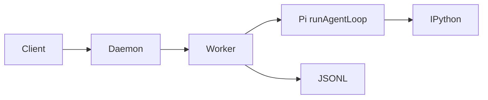

# Prime Agent 架构设计文档中心

> **项目**: [PrimeIntellect-ai/prime-agent](https://github.com/PrimeIntellect-ai/prime-agent)（本仓库 `prime-agent/`）  
> **重构日期**: 2026-09-09 — 原 11 篇合并为 **2 篇主文档 + 归档**

Prime Agent = **Pi 双环栈** + **Daemon/Worker** + **IPython 主工具** + **JSONL 树** + **RLM 子 Session** 的长期运行编码 Agent。

---

## 文档结构（仅 2 篇 + 归档）

| 文档 | 读什么 | 约时 |
|------|--------|------|
| **[ARCHITECTURE_GUIDE.md](./ARCHITECTURE_GUIDE.md)** | **主入口**：是什么 → 为什么 → Pi 关系 → 怎么做 → 模块图 → 机制 | 45min |
| [ARCHITECTURE_REFERENCE.md](./ARCHITECTURE_REFERENCE.md) | JSONL、Daemon、runAgentLoop、走查场景 | 25min |
| [**RUNTIME_BRIDGES.md**](./RUNTIME_BRIDGES.md) | **Daemon v7** 控制面 + **host.request** 执行面（对照与源码锚点） | 15min |
| [**GOALS_AND_REFINE.md**](./GOALS_AND_REFINE.md) | **`/goal` 与 `/refine`** 原理 + 各举一例 | 10min |
| [**EXTERNAL_ARTICLES_SYNTHESIS.md**](./EXTERNAL_ARTICLES_SYNTHESIS.md) | **三篇 Prime + 一篇 Pi 微信文**整合；§11 逐篇摘录 | 25min |
| [_archive/](./_archive/) | 原 PART1–3、ENTITY 等全文 | 改代码深潜 |

| 导航 | [ARCHITECTURE.md](./ARCHITECTURE.md) |

### 交互式图解（Archify）

| 图 | 说明 |
|----|------|
| [stack](./diagrams/prime-agent-stack.html) | 架构总览 |
| [turn](./diagrams/prime-agent-turn.html) | 单轮时序（简） |
| [e2e](./diagrams/prime-agent-e2e.html) | 端到端详版 |
| [rlm](./diagrams/prime-agent-rlm.html) | RLM 子 Session |
| [jsonl](./diagrams/prime-agent-jsonl.html) | JSONL 数据流 |
| [cold-start](./diagrams/prime-agent-cold-start.html) | 冷启动 |
| [steer](./diagrams/prime-agent-steer.html) | steer / follow-up |
| [compaction](./diagrams/prime-agent-compaction.html) | Compaction / Harness |
| [dual-loop](./diagrams/prime-agent-dual-loop.html) | 双环 Loop |
| [goals](./diagrams/prime-agent-goals.html) | Goals |

完整索引：[diagrams/README.md](./diagrams/README.md) · 规格源：`diagrams/*.json`

---

## 30 秒心智模型

```text
Pi（pi-agent-core）   = 怎么转：stream → tool → steer → 再 stream
Prime（coding-agent） = 在哪转：Worker、JSONL、IPython、rlm 子 Session
Prime（产品）         = 为什么：长期 coding、可断开、可编程子 Agent
```



---

## 阅读路径

| 你是谁 | 路径 |
|--------|------|
| **第一次读** | [ARCHITECTURE_GUIDE](./ARCHITECTURE_GUIDE.md) 全文（含 Pi 关系 §三） |
| **读过三篇微信文** | [EXTERNAL_ARTICLES_SYNTHESIS](./EXTERNAL_ARTICLES_SYNTHESIS.md) 对照校正 |
| **要画架构图** | GUIDE §三全栈图 + §五模块图 |
| **要改持久化/RLM** | GUIDE §六 → [REFERENCE](./ARCHITECTURE_REFERENCE.md) |
| **Daemon / host.request** | [RUNTIME_BRIDGES](./RUNTIME_BRIDGES.md) |
| **Goal / Refine 怎么用** | [GOALS_AND_REFINE](./GOALS_AND_REFINE.md) |
| **要字段级原文** | [_archive/ENTITY_AND_SEQUENCES.md](./_archive/ENTITY_AND_SEQUENCES.md) |
| **架构师对照** | GUIDE §七 + [Codex](../codex-architecture/README.md) |

---

## 与 Pi 文档

Pi 栈主图：[ARCHITECTURE_GUIDE §三](./ARCHITECTURE_GUIDE.md#三与-pi-的整体关系) · [pi-architecture/PI_STACK_ARCHITECTURE.md](../pi-architecture/PI_STACK_ARCHITECTURE.md)。  
Pi 九幕设计思想：[pi-agent/DESIGN_THINKING_SERIES.md](../pi-agent/DESIGN_THINKING_SERIES.md) · [HTML 图解](../pi-agent/diagrams/design-thinking-series.html)。  
统一入口：[pi-architecture/README.md](../pi-architecture/README.md)。

---

## 与 Codex / DeepTutor 对照

| 维度 | Prime | Codex | DeepTutor |
|------|-------|-------|-----------|
| 主工具 | IPython | 多工具 | 多 L1 Tool |
| 持久化 | JSONL 树 | Rollout | SQLite |
| 子 Agent | `rlm.run()` | spawn | subagent |
| 进程 | Daemon+Worker | 进程内 Session | WS TurnRuntime |

---

**维护者**: Deep Agents Team
