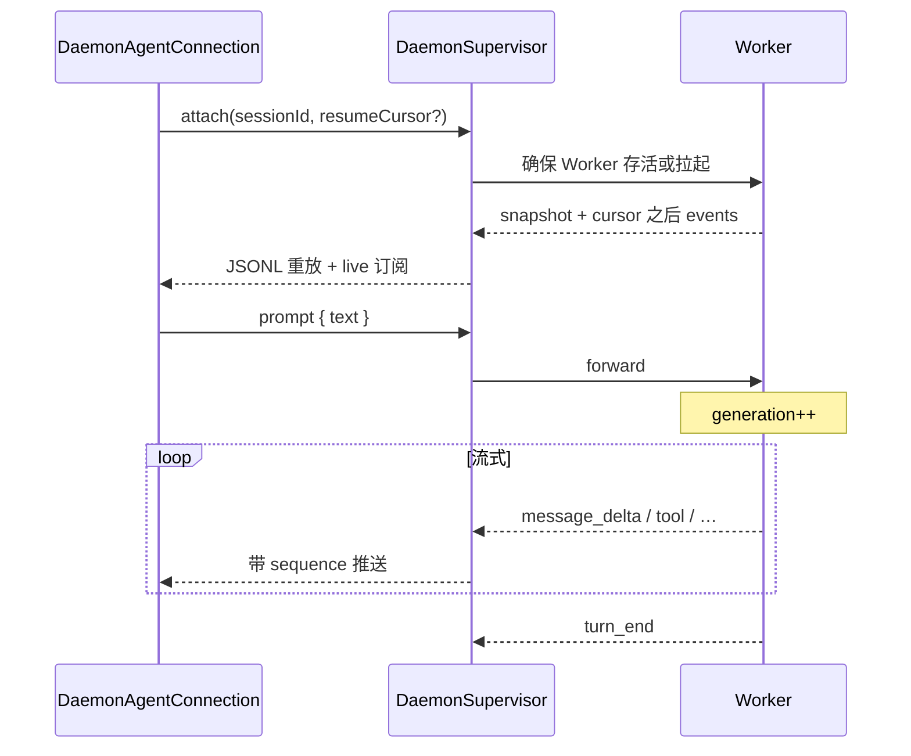
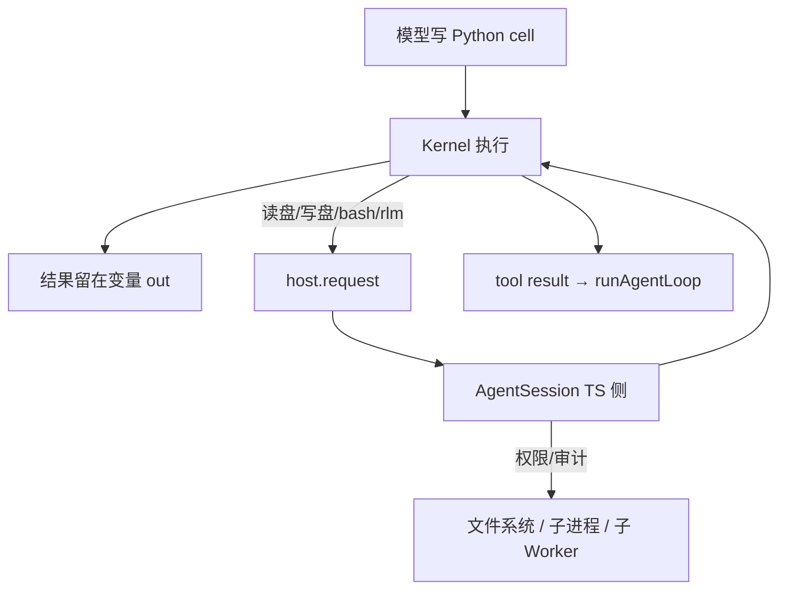
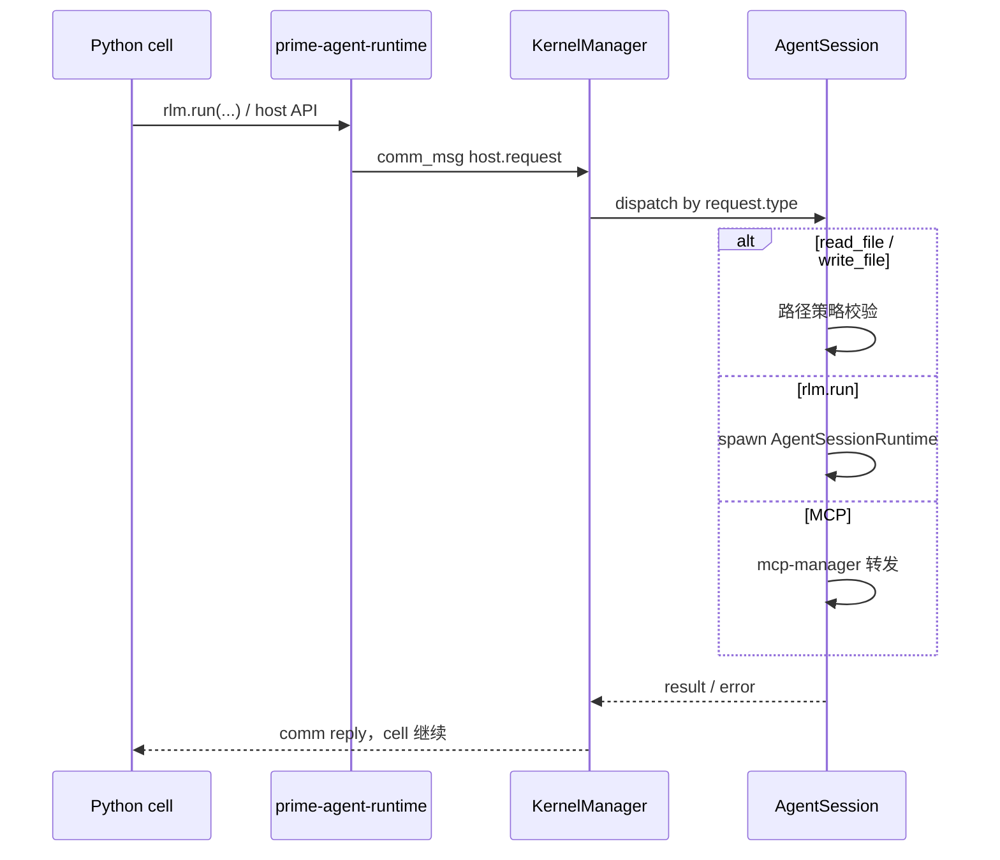
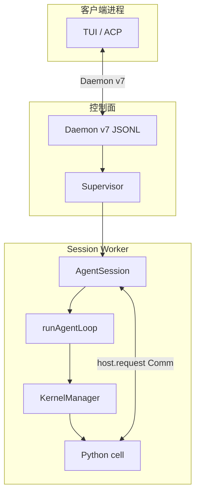

# Prime Agent 运行时桥接：Daemon v7 与 host.request

> **主指南**：[ARCHITECTURE_GUIDE.md](./ARCHITECTURE_GUIDE.md) · **技术参考**：[ARCHITECTURE_REFERENCE.md](./ARCHITECTURE_REFERENCE.md)  
> **整理日期**：2026-09-10  
> **源码锚点**：`prime-agent/packages/coding-agent/src/modes/daemon/daemon-protocol.ts`、`core/kernel/index.ts`、`core/rlm-runtime.ts`

Prime Agent 有两条容易混淆的「桥」：

| 桥 | 谁 ↔ 谁 | 职责 |
|----|---------|------|
| **Daemon v7** | TUI/客户端 ↔ Daemon Supervisor | 控制面：Session、prompt、steer、事件重放 |
| **host.request** | IPython Kernel ↔ TypeScript Host | 执行面：cell 内特权 IO、子 agent、MCP |

客户端 **看不见** `host.request`；Daemon **不跑** `runAgentLoop`。

---

## 一、Daemon v7 协议

### 1.1 一句话

**Unix socket 上的 JSONL 行协议**，用于管理 Session Worker、转发 `prompt`/`steer`，并把 Worker 事件用 **`generation` + `sequence`** 有序推给客户端。Daemon 自身不执行 LLM 采样。

### 1.2 分层

```text
TUI / ACP / RPC 客户端
    ↕  Daemon v7（JSONL，Unix socket）
DaemonSupervisor
    ↕  私有二进制帧（4-byte length + JSON，客户端不可见）
Session Worker（每 session 一个）
    → AgentSession → runAgentLoop → JSONL
```

价值：**detach 后 Worker 继续跑**，再 **`attach` 重放事件** 恢复 UI。

### 1.3 协议标识

| 常量 | 值 | 含义 |
|------|-----|------|
| `DAEMON_PROTOCOL_NAME` | `prime-agent.daemon` | 协议名 |
| `DAEMON_PROTOCOL_VERSION` | **7** | 主版本（不兼容才 bump） |
| `DAEMON_SCHEMA_REVISION` | **20**（文档锚点） | 能力增量修订，可向后兼容 |
| `DAEMON_SCHEMA_ID` | `protocol-7-schema-20-ed994cc39507` | Schema 指纹 |

### 1.4 核心概念

| 概念 | 作用 |
|------|------|
| **generation** | 一次 `prompt`（或 steer 触发的续跑）的代次；防多轮流式串流 |
| **sequence** | 会话内单调序号；`attach` 从 `{ generation, sequence }` **重放** 之后事件 |
| **attach** | 绑定 session、拉 snapshot、重放历史 + 订阅 live |
| **prompt** | 新 turn / follow-up |
| **steer** | 中途改道 → Worker `steeringQueue` |
| **cancel** | 中断当前执行 |

事件信封（概念形状）：

```typescript
{
  type: "event",
  generation: string,
  sequence: number,
  event: /* message_delta, tool_*, turn_end, ... */
}
```

命令：每条 `DaemonCommand` 可有 `id`；响应 `{ type: "response", id, ok, result? | error? }`。

### 1.5 命令族（逻辑分组）

| 分组 | 典型 `type` |
|------|-------------|
| 生命周期 | `list`, `create`, `attach`, `reattach`, `detach`, `kill` |
| 执行 | `prompt`, `prompt_and_wait`, `steer`, `cancel` |
| 队列 | `mutate_queued_message` |
| RLM | `delete_rlm_subagent`、depth 相关 |
| Side 旁路 | `start_side_question`, `execute_bash` |
| Heartbeat | `heartbeat_catalog`, `heartbeat_management` |
| 大 session | `slim_attach`、chunked snapshot |

完整列表见 `daemon-protocol.ts` 的 `DaemonCommand`。

### 1.6 Capability 协商

attach 时客户端与服务端交换 capability；新能力须 gate，旧 daemon 仍能启动。

- **客户端**：`attach_snapshot`, `event_sequence`, `slim_attach`, `chunked_snapshot`, `client_owned_sessions` …
- **服务端（额外）**：`delete_rlm_subagent`, `session_input_admission`, `rlm_quiescence_barrier`, `authoritative_child_roster`, `transient_bash` …

变更规则：

1. 不兼容 → bump `DAEMON_PROTOCOL_VERSION`
2. 可选能力 → `DaemonServerCapability` gate
3. 新命令若成启动必需 → 必须 gate

### 1.7 attach 时序



### 1.8 Daemon 边界

| Daemon 做 | Daemon 不做 |
|-----------|-------------|
| 路由、attach、重放、Worker 健康 | `runAgentLoop` |
| 转发 prompt / steer / cancel | 开 Jupyter Kernel |
| generation / sequence 事件泵 | 直接读写 JSONL（Worker 内 SessionManager） |

---

## 二、host.request

### 2.1 一句话

**IPython Kernel（Python）→ TypeScript Host（`AgentSession`）** 的特权回调通道。模型在 cell 里跑 Python；需要读盘、写盘、bash、spawn 子 agent、MCP 等操作时，经 **Jupyter Comm** 交给 TS 执行，结果回到 cell。

### 2.2 技术形态

| 项 | 说明 |
|----|------|
| **Comm target** | `"host.request"`（`HOST_COMM_TARGET`） |
| **传输** | Jupyter Comm（ZMQ kernel） |
| **方向** | `prime-agent-runtime` → `KernelManager` → `AgentSession.dispatchHostRequest` |
| **载荷** | `{ type: "...", ... }`，按 `type` 分发 handler |

JSON 示例（`rlm.run`）：

```json
{
  "target": "host.request",
  "request": {
    "type": "rlm.run",
    "prompt": "Research CVE-2024-xxxx in parallel",
    "options": { "timeout": 300000 }
  }
}
```

### 2.3 为什么需要它（单工具面）



| 对比 | 传统多 tool ReAct | Prime + host.request |
|------|-------------------|----------------------|
| 工具面 | read_file、bash、patch… | 主要是 **ipython** |
| 状态 | chat history | **kernel 变量** |
| 组合 | 多次 tool call | **一段 Python** |
| 子任务 | spawn / 贴摘要 | **`rlm.run()`** |

`host.request` **不是**给模型看的又一个 tool schema，而是 **Python 运行时回 Host 的特权桥**。

### 2.4 调用时序



### 2.5 常见 `request.type`

| type | TS 侧行为 | 阻塞 cell？ |
|------|-----------|-------------|
| `read_file` / `write_file` | 工作区路径策略、大小限制 | 是 |
| `rlm.run` | 创建子 `AgentSessionRuntime`，完整 `runAgentLoop` | 是（至子 agent 完成） |
| `agent_message` | 跨 session 消息路由 | 是 |
| `goal.*` | Goals 状态读写 | 是 |
| MCP 代理 | `mcp-manager` catalog | 是 |
| harness / skill | continual harness 快照 | 是 |

Handler：`createHostRequestHandler((payload, context) => ...)`  
`HostRequestContext`：`requestId`, `generation`, `signal`, `isCurrent()`（防 dispose 后回复）。

### 2.6 与 `rlm.run()` 的关系

```text
父 cell: out = rlm.run("扫描 TODO", timeout=120_000)
  → host.request type=rlm.run
  → 子 Worker + 子 jsonl
  → 子 runAgentLoop（非 steer）
  → 返回字符串给 out
  → 父 Session 仅多一条 ipython tool result
```

子任务全文 **不进** 父 chat；父 loop 只见 **一次 ipython 返回值**。

### 2.7 安全语义

Prime Worker **不是容器级沙箱**。`host.request` 是 **权限门 + 策略校验**（路径、RLM depth、审批），不是 Docker 隔离。见 [EXTERNAL_ARTICLES_SYNTHESIS](./EXTERNAL_ARTICLES_SYNTHESIS.md)。

---

## 三、两条桥的对照



| 问题 | 用哪条桥 |
|------|----------|
| 断线后怎么恢复 UI？ | Daemon v7 `attach` + generation/sequence 重放 |
| 用户 steer / 新 prompt？ | Daemon v7 `steer` / `prompt` |
| cell 里怎么读文件？ | `host.request` `read_file` |
| cell 里怎么起子 agent？ | `host.request` `rlm.run` |
| 协议版本怎么演进？ | Daemon：VERSION + SCHEMA_REVISION + capability |

---

## 四、源码速查

| 主题 | 路径（相对 `prime-agent/packages/coding-agent/src/`） |
|------|------------------------------------------------------|
| Daemon v7 类型与命令 | `modes/daemon/daemon-protocol.ts` |
| Supervisor / attach | `modes/daemon/daemon-supervisor.ts` |
| 客户端连接 | `modes/daemon/daemon-agent-connection.ts` |
| Worker 私有帧 | `modes/daemon/daemon-worker-protocol.ts` |
| Comm target | `core/kernel/index.ts` — `HOST_COMM_TARGET` |
| Host 分发 | `core/agent-session.ts` — `dispatchHostRequest` |
| RLM spawn | `core/rlm-runtime.ts` |
| Python 侧 API | `prime-agent-runtime`（注入 kernel venv） |

---

## 五、延伸阅读

| 文档 | 内容 |
|------|------|
| [ARCHITECTURE_GUIDE §6.3](./ARCHITECTURE_GUIDE.md#63-ipython-与-hostrequest) | IPython 主工具 + host.request 图 |
| [ARCHITECTURE_REFERENCE §3](./ARCHITECTURE_REFERENCE.md#3-daemon-v7-协议要点) | Daemon 精简版 |
| [_archive/ARCHITECTURE_PART3 §1](./_archive/ARCHITECTURE_PART3.md#第1章daemon-协议-v7-深潜) | Daemon 命令全集、capability 列表 |
| [_archive/ARCHITECTURE_PART2 §2](./_archive/ARCHITECTURE_PART2.md#第2章kernelmanager-与-host-request) | KernelManager 与 Host Request 深潜 |
| [_archive/ENTITY_AND_SEQUENCES §10.5](./_archive/ENTITY_AND_SEQUENCES.md#105-ipython-host-requestkernel--ts) | host.request JSON 示例 |
