# Prime Agent 完整架构设计文档（第一部分）

> **版本**: 2.0 · **整理**: 2026-09-01  
> **设计原理导读（图表为主，推荐先读）**：[DESIGN_THINKING_SERIES.md](./DESIGN_THINKING_SERIES.md) · [RUNTIME_AND_PERSISTENCE.md](./RUNTIME_AND_PERSISTENCE.md)  
> **本文档定位**：源码级深潜（含字段表与实现锚点），改代码时查阅。  
> **体例参照**: [`docs/codex-architecture/ARCHITECTURE_PART1.md`](../codex-architecture/ARCHITECTURE_PART1.md)

---

## 目录

- [第1章：定位与设计原则](#第1章定位与设计原则)（含 §1.2 分层架构）
- [第2章：Monorepo 包地图](#第2章monorepo-包地图)
- [第3章：进程模型 — Client / Daemon / Worker / Kernel](#第3章进程模型--client--daemon--worker--kernel)
- [第4章：Daemon 协议 v7 深潜](#第4章daemon-协议-v7-深潜)
- [第5章：AgentSession 与 Agent 分工](#第5章agentsession-与-agent-分工)
- [第6章：Turn 与 Message 三层模型](#第6章turn-与-message-三层模型)
- [第7章：runAgentLoop — 四层深潜](#第7章runagentloop--agent-包核心循环四层深潜)
- [第8章：端到端路径与对照](#第8章端到端路径与对照)

---

## 第1章：定位与设计原则

### 1.1 核心定位

Prime Agent 面向 **长时运行** 的编码与研究任务，由 Prime Intellect 维护。它不是「又一个 ChatGPT CLI」，而是 **RLM（Recursive Language Model）+ Continual Harness** 驱动的持久运行时：

1. **上下文在 IPython 变量里** — 模型通过单一主工具（IPython cell）编程式操作环境
2. **子 Agent 是函数调用** — `rlm.run("task", options)` 在 Python 内 spawn 完整子 Session
3. **Daemon 默认** — 交互 TUI 不持有执行权；Session Worker 进程跑 `AgentSession`
4. **JSONL 树即真相** — 会话历史为 append-only 的 `SessionEntry` 树，支持分支与 compaction

### 1.2 分层架构

本节分四层阅读：**进程分层总览** → **全栈实体全景** → **源码级核心实体** → **控制面/数据面**。实体字段与时序深潜另见 [ENTITY_AND_SEQUENCES.md §1–2](./ENTITY_AND_SEQUENCES.md#1-实体总览与包含关系)。

#### 1.2.1 进程分层总览（Client / Daemon / Worker / Kernel）

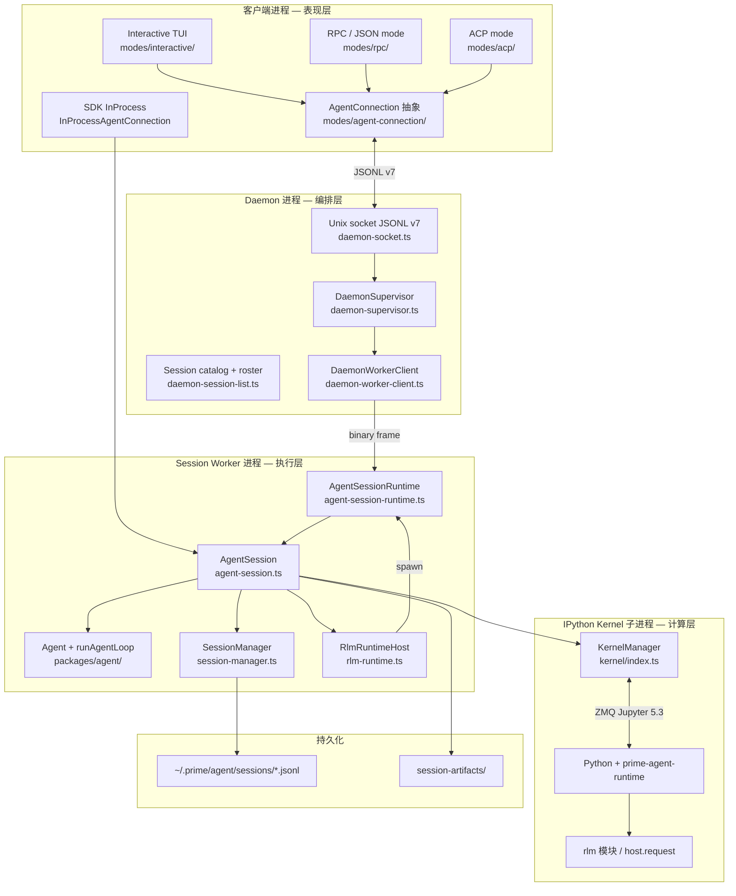

**四层边界**（与 §3 对照）：

| 层 | 进程 | 持有状态 | 禁止 |
|----|------|----------|------|
| **Client** | TUI / RPC / ACP / SDK | UI 状态、`DaemonAgentConnection` 游标 | 直接 `runAgentLoop`、写 jsonl |
| **Daemon** | `prime-agent daemon` supervisor | 路由表、worker roster、catalog | LLM 采样、IPython 执行 |
| **Worker** | 每 session 子进程 | `AgentSession` + kernel + scheduler | 跨 session 共享 kernel（默认隔离） |
| **Kernel** | IPython 子进程 | Python 命名空间、`rlm` 桥 | 未经 host 的特权 FS 操作 |

#### 1.2.2 全栈实体全景（客户端 · Daemon · Worker · 持久化）

> **重要**：下图覆盖开源 monorepo 内全部产品实体与调用链；后续精简文档时**不得删除**本节，仅可增补。

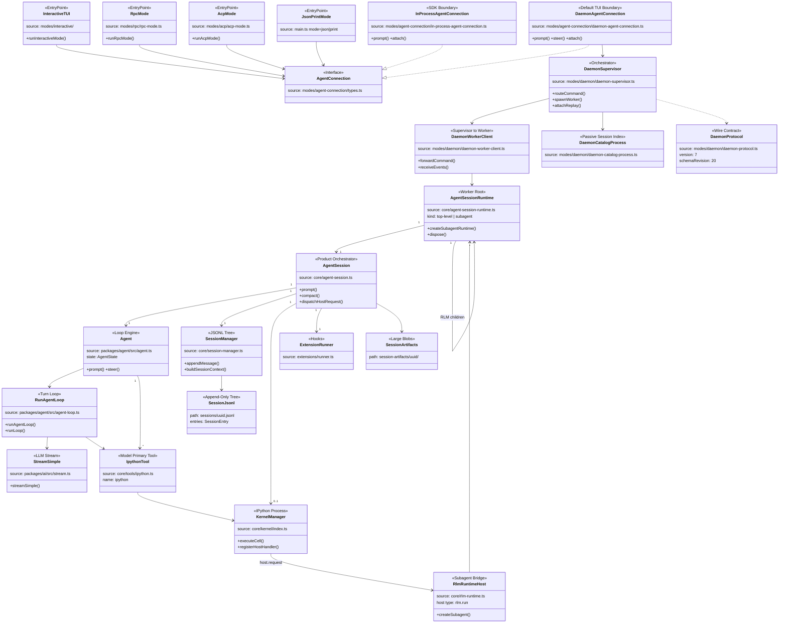

#### 1.2.3 运行时核心实体（源码级 classDiagram）

下图与 §1.2.2 互补：只画 **TypeScript 源码内** 的真实类型与字段（非概念别名）。`Turn` 在领域术语中存在；源码里对应 `runAgentLoop` 内的 `turn_start` / `turn_end` 事件相，**无持久化 turn_id**。

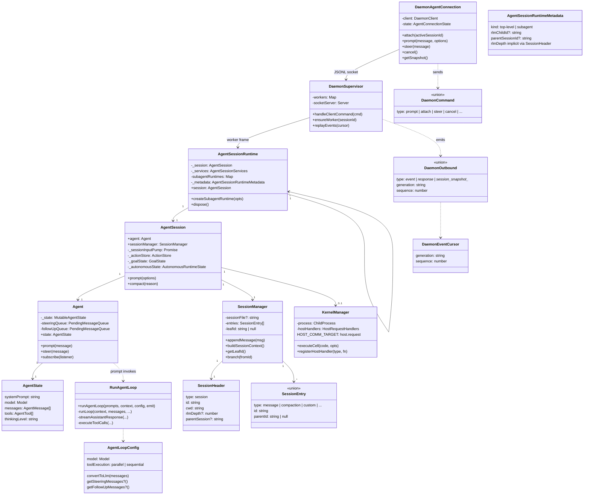

#### 1.2.4 核心实体属性速查

| 实体 | 源码 | 核心属性 | 关系 |
|------|------|----------|------|
| **DaemonAgentConnection** | `modes/agent-connection/daemon-agent-connection.ts` | `client`, `state`, snapshot assembly | 客户端唯一执行 API；JSONL socket |
| **InProcessAgentConnection** | `modes/agent-connection/in-process-agent-connection.ts` | 直接持有 `AgentSessionRuntime` | SDK / 测试绕过 Daemon |
| **DaemonSupervisor** | `modes/daemon/daemon-supervisor.ts` | workers map, socket server, catalog | 路由命令；不跑 LLM |
| **DaemonWorkerClient** | `modes/daemon/daemon-worker-client.ts` | binary frame 4-byte length + JSON | Supervisor ↔ Worker 私有协议 |
| **AgentSessionRuntime** | `core/agent-session-runtime.ts` | `_session`, `subagentRuntimes`, `_metadata` | Worker 根；RLM 子 runtime 树 |
| **AgentSession** | `core/agent-session.ts` | `agent`, `sessionManager`, `_sessionInputPump`, `_actionStore` | 产品编排；持久化/compaction/goals |
| **Agent** | `packages/agent/src/agent.ts` | `state`, `steeringQueue`, `followUpQueue` | 纯循环引擎；不管 jsonl |
| **SessionManager** | `core/session-manager.ts` | `entries[]`, `leafId`, `sessionFile` | append-only 树；`buildSessionContext` |
| **SessionHeader** | `session-manager.ts` L75 | `id`, `cwd`, `rlmDepth`, `parentSession` | jsonl 首行 |
| **SessionEntry** | `session-manager.ts` L94–223 | `id`, `parentId`, `type`, payload | 树节点；compaction 折叠点 |
| **KernelManager** | `core/kernel/index.ts` | ZMQ dealer/sub, `hostHandlers` | IPython 进程；`HOST_COMM_TARGET` |
| **IpythonTool** | `core/tools/ipython.ts` | `execute` → `KernelManager.executeCell` | 模型主工具 |
| **RlmRuntimeHost** | `core/rlm-runtime.ts` | `createSubagent`, depth limits | `host.request` type `rlm.run` |
| **runAgentLoop** | `packages/agent/src/agent-loop.ts` L247 | `emit`, `runLoop`, tool parallel exec | Turn = 事件相 |
| **DaemonCommand** | `daemon-protocol.ts` L365+ | `type`, `activeSessionId`, payload | 控制面入队 |
| **DaemonOutbound** | `daemon-protocol.ts` | `generation`, `sequence`, event body | 控制面 + UI 事件 |
| **AgentMessage** | `packages/agent/src/types.ts` | user / assistant / toolResult / custom | Agent 层真相 |
| **Message** | `packages/ai` | Provider 层 LLM 消息 | `convertToLlm` 边界 |

**三层 ID / 真相对照**（领域术语 ↔ 源码）：

| 层级 | 概念实体 | 源码锚点 | 持久化 |
|------|----------|----------|--------|
| L0 | **Session** | `SessionHeader.id` (UUID v7) | `sessions/<id>.jsonl` 文件名 |
| L1 | **SessionEntry** | `entry.id` + `parentId` | jsonl 每行；树/DAG |
| L2 | **Turn** | `turn_start` / `turn_end` 事件 | **无** turn_id；Daemon `generation` |
| L3 | **Tool batch** | `executeToolCalls` 一轮 | `message` entry 内 toolCalls + toolResult |
| L4 | **RLM child** | `rlmChildId` / 子 session id | 子 jsonl + `child_usage_attributed` |

#### 1.2.5 `packages/` 仓库分层目录

```text
prime-agent/
├── packages/
│   ├── 表现层 / 产品入口 (coding-agent)
│   │   └── coding-agent/
│   │       ├── src/main.ts                 # CLI 多 mode 入口
│   │       ├── src/cli/                    # daemon launch, doctor, schedule
│   │       ├── src/modes/
│   │       │   ├── interactive/            # TUI 主交互
│   │       │   ├── daemon/                 # Supervisor, protocol v7, worker client
│   │       │   ├── agent-connection/       # DaemonAgentConnection, InProcess
│   │       │   ├── rpc/                    # stdin/stdout JSON 命令
│   │       │   ├── acp/                    # JSON-RPC 2.0 NDJSON (编辑器)
│   │       │   └── json/                   # 单行事件输出
│   │       ├── src/core/
│   │       │   ├── agent-session.ts        # 产品编排 (~11k LOC)
│   │       │   ├── agent-session-runtime.ts
│   │       │   ├── session-manager.ts      # JSONL 树 + buildSessionContext
│   │       │   ├── kernel/                 # KernelManager, ZMQ, snapshot
│   │       │   ├── tools/ipython.ts        # 模型主工具
│   │       │   ├── rlm-runtime.ts          # RLM host handlers
│   │       │   ├── compaction/             # compact, branch-summarization
│   │       │   ├── extensions/             # runner, hooks
│   │       │   ├── goals.ts, autonomous.ts, cron-jobs.ts
│   │       │   └── mcp/                    # mcp-manager (TS catalog)
│   │       ├── skills/                     # 可安装 Python skill 包
│   │       └── docs/                       # 用户文档
│   ├── 循环引擎 (agent)
│   │   └── agent/src/
│   │       ├── agent.ts                    # Agent 类, queues
│   │       ├── agent-loop.ts               # runAgentLoop, runLoop
│   │       └── types.ts                    # AgentMessage, AgentLoopConfig
│   ├── LLM 层 (ai)
│   │   └── ai/src/
│   │       ├── stream.ts                   # streamSimple
│   │       ├── providers/                  # OpenAI, Anthropic, ...
│   │       └── mcp.ts                      # MCP catalog 类型
│   └── UI 库 (tui)
│       └── tui/src/                        # 终端组件、编辑器、markdown
├── prime-agent-runtime/                    # Python: kernel 内 rlm, harness, MCP
│   └── src/rlm/
└── ~/.prime/agent/                         # 运行时数据（非仓库）
    ├── sessions/*.jsonl
    ├── session-artifacts/
    ├── kernel-venv/
    └── settings.json, auth.json
```

构建顺序：`tui` → `ai` → `agent` → `coding-agent`。

#### 1.2.6 控制面与数据面分离

| 平面 | 载体 | 谁读写 | 源码锚点 |
|------|------|--------|----------|
| **控制面（客户端）** | `DaemonCommand` JSONL 行 | Client 写 → Supervisor → Worker | `daemon-protocol.ts` `DaemonCommand` |
| **控制面（回执）** | `DaemonResponse` / `DaemonOutbound` | Worker → Supervisor → Client | `generation` + `sequence` 游标 |
| **数据面（模型）** | `AgentMessage[]` → `convertToLlm` → `Message[]` | `runAgentLoop` 每轮只追加内存 messages | `agent-loop.ts` `streamAssistantResponse` |
| **数据面（审计）** | `SessionEntry` jsonl 树 | `SessionManager.append*` append-only | `session-manager.ts` `_persist` |
| **数据面（UI 投影）** | `AgentSessionEvent` → Daemon 事件 | Worker 泵送；Client attach 重放 | `agent-session.ts` 事件监听器 |
| **特权桥** | `host.request` comm | Python cell ↔ TS `AgentSession` | `kernel/index.ts` `HOST_COMM_TARGET` |

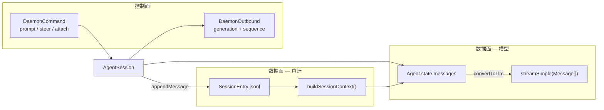

**关键分离**：

1. 客户端 **永不** 直接调用 `runAgentLoop`；唯一入口是 `AgentConnection.prompt()` → Daemon `prompt` 命令（或 InProcess 等价路径）。
2. **Turn 不落盘** — UI 用 `turn_start`/`turn_end` 与 `generation` 关联；历史真相是 `SessionEntry`，不是 Turn 表。
3. **Compaction 不删 jsonl** — 追加 `type: compaction` 节点；`buildSessionContext` 在读取时折叠，模型只见 summary + `firstKeptEntryId` 之后的消息。
4. Worker 私有帧（Supervisor ↔ Worker）与客户端 v7 JSONL **不同协议**；客户端只见 `daemon-protocol.ts` 类型。

### 1.3 设计不变量

| # | 不变量 | 违反时的症状 | 源码锚点 |
|---|--------|--------------|----------|
| 1 | **TUI 不直接持有 AgentSession** | 测试/attach 无法复用 | `DaemonAgentConnection` |
| 2 | **Agent 包不管持久化** | 在 loop 内写盘导致双写 | `packages/agent` vs `AgentSession` |
| 3 | **模型主工具是 IPython** | 多工具面破坏 RLM 心智模型 | `core/tools/ipython.ts` |
| 4 | **Host request 做特权** | Python 直接写敏感路径 | `HOST_COMM_TARGET` |
| 5 | **Compaction 是 SessionEntry** | 重写 messages 数组丢失审计 | `type: compaction` |
| 6 | **Turn 无持久化 ID** | 在 jsonl 找 turn_id 失败 | `turn_start` 事件相 only |
| 7 | **Daemon 协议演进有门控** | 新旧客户端互斥崩溃 | capability + `DAEMON_PROTOCOL_VERSION` |

### 1.4 非目标

- Worker/Kernel **不是** OS 级沙箱 — 模型生成的 Python 以 **用户权限** 运行
- Daemon 协议 **不是** 最终远程 gateway 协议 — 但类型 JSON 可序列化以便未来代理

### 1.5 与 Codex / DeepTutor 一句话对照

| | Prime Agent | Codex | DeepTutor |
|--|-------------|-------|-----------|
| 主工具 | IPython | shell/patch/MCP | 多 Tool |
| 进程 | Daemon Worker | 单 Session loop | WS TurnRuntime |
| 子 Agent | `rlm.run()` | `spawn_agent` Thread | BaseAgent 编排 |
| 历史 | JSONL 树 | Rollout + ResponseItem | SQLite messages |

---

## 第2章：Monorepo 包地图

### 2.1 依赖方向

```
@earendil-works/pi-tui          ← 纯 UI（Ratatui 组件）
@earendil-works/pi-ai           ← LLM providers, Message 基类型, streamSimple
@earendil-works/pi-agent-core   ← Agent, runAgentLoop（无产品逻辑）
@earendil-works/pi-coding-agent ← CLI, Daemon, AgentSession, Kernel, RLM, Compaction
prime-agent-runtime (Python)    ← kernel 内 rlm 桥、harness
```

构建顺序：`tui` → `ai` → `agent` → `coding-agent`。

### 2.2 包职责表

| 包 | npm 名 | 关键路径 | 职责 |
|----|--------|----------|------|
| `packages/tui` | `pi-tui` | `src/tui.ts` | 终端 UI、编辑器、markdown 流 |
| `packages/ai` | `pi-ai` | `src/providers/` | Provider、`streamSimple`、`Message` |
| `packages/agent` | `pi-agent-core` | `src/agent-loop.ts` | 通用 Agent 循环 |
| `packages/coding-agent` | `pi-coding-agent` | `src/core/` | 产品全部逻辑 |
| `prime-agent-runtime` | Python | `src/rlm/` | Kernel 内 `rlm` 模块 |

配置根目录默认 `~/.prime/agent/`（`piConfig.configDir` 可覆盖）。

### 2.3 coding-agent 核心目录

| 目录 | 内容 |
|------|------|
| `core/agent-session.ts` | 编排层（~11k LOC） |
| `core/session-manager.ts` | JSONL 树读写、`buildSessionContext` |
| `core/kernel/` | `KernelManager`、ZMQ Jupyter |
| `core/rlm-runtime.ts` | RLM host、子 Session spawn |
| `core/compaction/` | 压缩纯函数 + 设置 |
| `core/tools/ipython.ts` | 模型主工具 |
| `modes/daemon/` | Supervisor、Worker、协议 |
| `modes/agent-connection/` | `DaemonAgentConnection` |
| `modes/rpc/`、`modes/acp/` | 无头集成 |

---

## 第3章：进程模型 — Client / Daemon / Worker / Kernel

### 3.1 四层进程图

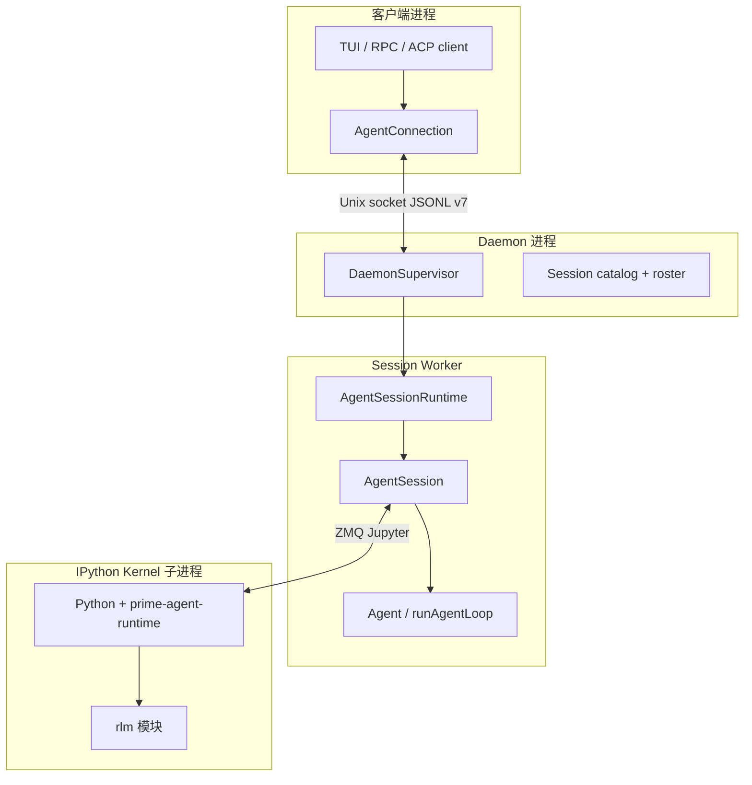

### 3.2 边界职责

| 边界 | 职责 | 禁止 |
|------|------|------|
| **AgentConnection** | 客户端唯一执行 API；隐藏 Daemon 或 in-process | 直接调 `runAgentLoop` |
| **DaemonSupervisor** | 路由、attach、跨 session 消息、worker 健康 | 跑 LLM 采样 |
| **Session Worker** | 一个根 session 树 + scheduler + 所有 RLM 子 runtime | 共享 kernel 给无关 session（默认可配置隔离） |
| **Kernel** | 执行模型 Python；host request 回 TS | 直接访问未授权路径（须经 host handler） |

### 3.3 Worker 私有协议

Supervisor ↔ Worker 使用 **二进制帧**（4-byte length + JSON），与客户端 Daemon JSONL **不同**。客户端永远只见 v7 命令/事件信封。

### 3.4 两种连接模式

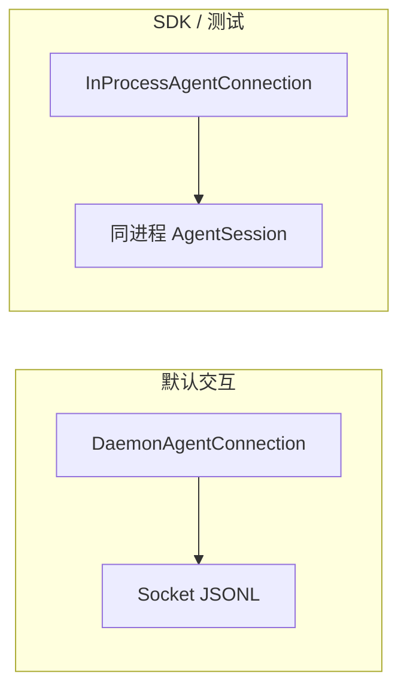

---

## 第4章：Daemon 协议 v7 深潜

### 4.1 版本与 Schema

```52:68:prime-agent/packages/coding-agent/src/modes/daemon/daemon-protocol.ts
export const DAEMON_PROTOCOL_NAME = "prime-agent.daemon";
export const DAEMON_PROTOCOL_VERSION = 7;
export const DAEMON_COMMAND_ENVELOPE_MIN_PROTOCOL_VERSION = 7;
// Revision 9-20: RLM depth, roster, quiescence, input pause, ...
export const DAEMON_SCHEMA_REVISION = 20;
export const DAEMON_SCHEMA_ID = "protocol-7-schema-20-ed994cc39507";
```

| 概念 | 说明 |
|------|------|
| **Protocol version** | 不兼容变更时 bump（当前 **7**） |
| **Schema revision** | 能力增量修订（当前 **20**），可向后兼容 |
| **Capability gate** | 新命令/事件须协商 `DaemonServerCapability` |
| **Generation** | 每次 prompt 递增；事件带 `generation` 防串流 |
| **Sequence** | `DaemonEventCursor { generation, sequence }` 支持 attach 重放 |

### 4.2 变更规则（AGENTS.md）

1. 不兼容变更 → bump `DAEMON_PROTOCOL_VERSION`
2. 可选能力 → server capability gate；客户端 attach 时检查
3. 更新 compatibility maps + 双向兼容测试
4. 新命令若成为启动必需 → 必须 gate，否则旧 daemon 仍能启动

### 4.3 Server Capabilities（节选）

| Capability | 用途 |
|------------|------|
| `attach_snapshot` / `event_sequence` | 基础 attach 与重放 |
| `slim_attach` / `chunked_snapshot` | 大 session 分块快照 |
| `delete_rlm_subagent` | 删除 RLM 子 agent |
| `side_question_transcript` | 多轮 side question |
| `transient_bash` | 不记入 session 的 bash |
| `session_input_admission` / `session_input_pause` | 输入准入与暂停 |
| `rlm_quiescence_barrier` | headless 完成前等待 RLM 静默 |
| `authoritative_child_roster` | 子 agent 权威列表 |

### 4.4 命令/事件信封

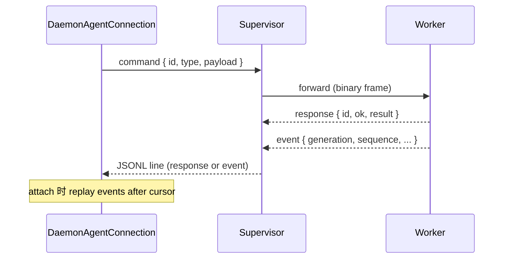

**主要命令族**（逻辑分组）：

- **Session 生命周期**：`attach`、`detach`、`list_sessions`、`delete_session`
- **执行**：`prompt`、`steer`、`cancel`、`mutate_queued_message`
- **RLM**：spawn 相关、`delete_rlm_subagent`、depth 设置
- **Agent 间**：`agent_message` 路由（schema rev 13+ 收窄 roster）
- **Side**：`start_side_question`、`execute_bash`（transient）
- **Heartbeat / cron**：`heartbeat_catalog`、`heartbeat_management`

### 4.5 与远程网关的关系

协议类型 **JSON 可序列化** — `DaemonAgentConnection` 抽象已隔离 TUI 与传输，未来 gateway 可代理本地 socket 而不泄漏传输细节到 `InteractiveMode`。

---

## 第5章：AgentSession 与 Agent 分工

### 5.1 设计原理

**Agent**（`pi-agent-core`）是 **纯循环引擎**；**AgentSession**（`coding-agent`）是 **产品编排层**。分离使 SDK 可嵌入非 coding-agent 产品，且测试可 mock 持久化。

### 5.2 对照表

| | `Agent` (`pi-agent-core`) | `AgentSession` (`coding-agent`) |
|--|---------------------------|----------------------------------|
| 消息数组 | `state.messages`（内存） | 经 `SessionManager` 持久化到 JSONL |
| 工具执行 | `AgentTool.execute` | 配置 kernel、extensions 包装 IPython |
| 循环 | `runAgentLoop` | 调用 + 订阅事件转 `appendMessage` |
| 压缩/目标/自主 | 无 | compaction、goals、autonomous |
| 子 Agent | 无 | `AgentSessionRuntime` + `rlm-runtime` |
| Steering | `steeringQueue` | Daemon `steer` 注入 |
| System prompt | `context.systemPrompt` | harness + base instructions |

### 5.3 AgentSession 关键字段

```1008:1066:prime-agent/packages/coding-agent/src/core/agent-session.ts
export class AgentSession {
	readonly agent: Agent;
	readonly sessionManager: SessionManager;
	private _goalState: GoalState;
	private _autonomousState: AutonomousRuntimeState;
	private _compactionOperation: Promise<void> | undefined;
	private _actionStore = new ActionStore<QueuedSessionAction>();
	// kernel, mcp, extensions, rlm children...
}
```

### 5.4 `prompt()` 阶段表

| 阶段 | 行为 | 文件锚点 |
|------|------|----------|
| P1 | `_sessionInputPump` 串行化入队 | `agent-session.ts` |
| P2 | `buildSessionContext()` + 新 user message | `session-manager.ts` |
| P3 | Extensions `before_turn` hooks | `extensions/runner.ts` |
| P4 | `_dispatchPreparedTurn` → `agent.prompt` → `runAgentLoop` | `agent.ts` |
| P5 | 订阅 `AgentEvent` → `appendMessage` / 触发 compaction | 事件处理器 |
| P6 | Goals / autonomous 后续调度 | `goals.ts`, `autonomous.ts` |
| P7 | `turn_end` 广播给 Daemon | worker 事件泵 |

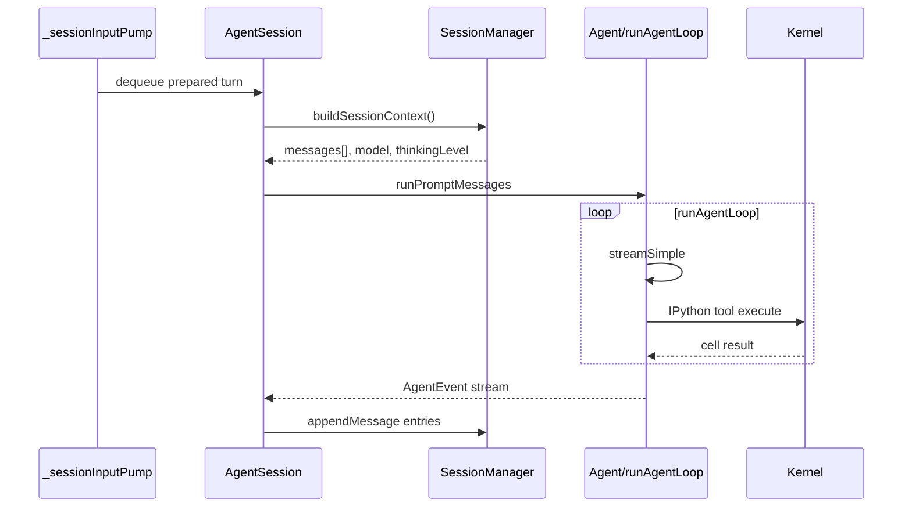

### 5.5 输入队列语义

| 队列 | 所有者 | 语义 |
|------|--------|------|
| `Agent.steeringQueue` | `packages/agent` | mid-turn 插入；`runLoop` 每轮前 `getSteeringMessages` |
| `Agent.followUpQueue` | 同上 | turn 结束后继续同一 agent loop |
| `ActionStore` | `AgentSession` | Session 级动作（非 steer 进 loop） |

---

## 第6章：Turn 与 Message 三层模型

### 6.1 Turn 是事件相，不是表行

- `turn_start`：本轮 prompt 进入 `runAgentLoop`
- `turn_end`：assistant 终态 + 本轮 `toolResults`
- **无 `turn_id` 写入 jsonl** — Daemon 用 `generation` 标识一次 prompt 派生的流式代次

### 6.2 Message 三层投影

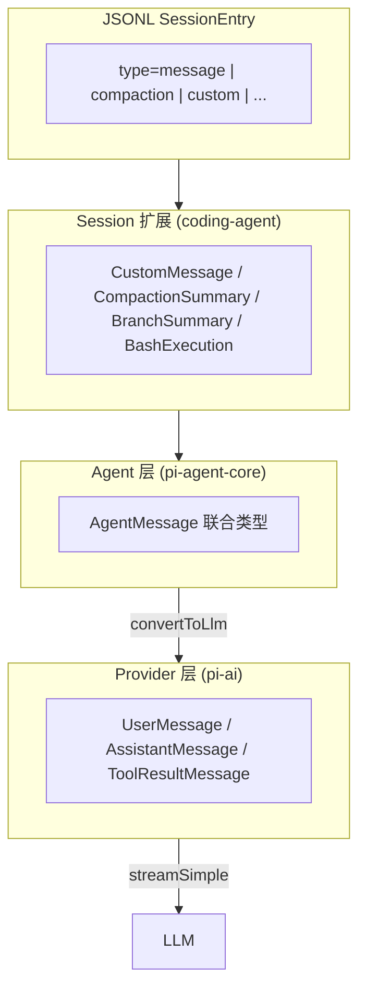

| 层 | 内容 |
|----|------|
| Provider | `packages/ai` 的 `UserMessage` / `AssistantMessage` |
| Agent | `AgentMessage` 联合（含 toolResult） |
| Session 扩展 | `CustomMessage`、`CompactionSummaryMessage`、`BranchSummaryMessage` 等 |

### 6.3 SessionEntry 树

每条持久化记录有 `id` + `parentId`，形成 **树/DAG**（分支用 `branch_summary`）。

```75:99:prime-agent/packages/coding-agent/src/core/session-manager.ts
export interface SessionHeader {
	type: "session";
	version?: number;
	id: string;
	timestamp: string;
	cwd: string;
	parentSession?: string;
	rlmDepth?: number;
	git?: GitContext;
}

export interface SessionEntryBase {
	type: string;
	id: string;
	parentId: string | null;
	timestamp: string;
}
```

**Entry 类型全集**（节选）：

| `type` | 载荷 | 进入模型上下文？ |
|--------|------|------------------|
| `message` | `AgentMessage` | 是 |
| `compaction` | summary + `firstKeptEntryId` | 摘要消息是 |
| `branch_summary` | 分支摘要 | 是 |
| `custom` / `custom_message` | Goals、harness 等 | 视类型 |
| `model_change` / `thinking_level_change` | 审计 | 影响 `buildSessionContext` 元数据 |
| `child_usage_attributed` | RLM token 归因 | 否（审计/UI） |
| `session_state` / `agent_status` | 快照 | 否 |

---

## 第7章：runAgentLoop — Agent 包核心循环（四层深潜）

> 体例对齐 Codex [PART1 §4](../codex-architecture/ARCHITECTURE_PART1.md#第4章agent-loop--四层循环与源码级设计)。Prime 的 Turn 对应 `turn_start`/`turn_end` 事件相，无 `ActiveTurn` struct。

### 7.0 设计原理（必须先读）

| 原理 | 含义 | 违反时的症状 |
|------|------|--------------|
| **AgentMessage 贯穿** | 仅在 LLM 边界 `convertToLlm` | 在 loop 内混用 Provider 类型导致 custom 消息丢失 |
| **事件驱动持久化** | 所有副作用经 `AgentEventSink` | 在 `runAgentLoop` 内写 jsonl → 双写 |
| **Steer/Follow-up 内建** | 外层 `while(true)` 多 turn 串联 | 每 steer 新开 loop → 丢失 context |
| **工具并行默认** | `executeToolCallsParallel` | 强制串行拖慢独立 IPython cell |
| **Abort 可恢复** | `raceWithAbort` + 部分 assistant 保留 | 硬 kill 丢 partial stream |

**四层调用栈**（自外向内）：

```text
L1  AgentSession._dispatchPreparedTurn  → 订阅 AgentEvent → SessionManager.append
L2  Agent.prompt / runAgentLoop         → agent_start, turn_start/end, agent_end
L3  runLoop                             → poll steer → stream → tools → continuation
L4  streamAssistantResponse             → streamSimple SSE 状态机
L5  executeToolCalls → ipython AgentTool → KernelManager.executeCell
```

### 7.1 L1：`AgentSession` — 编排与持久化（不跑模型）

**文件**: `core/agent-session.ts` — `_dispatchPreparedTurn`, `_sessionInputPump`

| 阶段 | 行为 | 锚点 |
|------|------|------|
| 入队 | `_sessionInputPump` 串行化 prepared turn | `prompt()` → pump |
| 上下文 | `buildSessionContext()` + 新 user message | `session-manager.ts` |
| Hooks | Extensions `before_turn` | `extensions/runner.ts` |
| 委派 | `agent.prompt` → `runAgentLoop` | `agent.ts` L328 |
| 订阅 | `AgentEvent` → `appendMessage` / compaction | 事件处理器 |
| 广播 | `turn_end` → Daemon generation 事件 | worker 事件泵 |

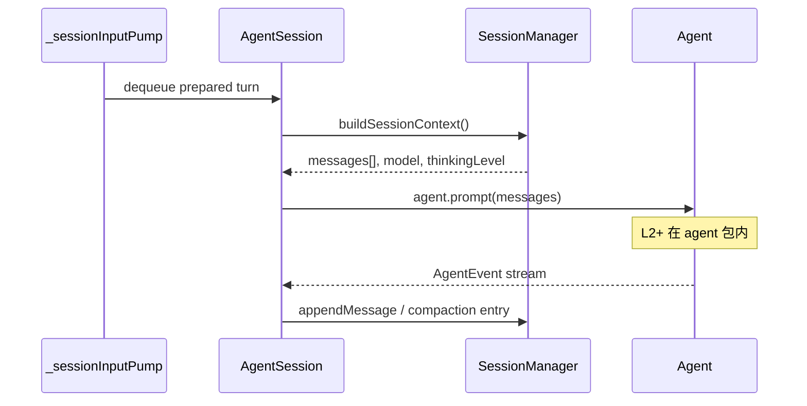

**L1 禁止**：在 `AgentSession` 内直接 `streamSimple`；必须通过 `Agent` 委托。

### 7.2 L2：`runAgentLoop` — Turn 级外层（一次用户 prompt）

**文件**: `packages/agent/src/agent-loop.ts` L247–269

```247:269:prime-agent/packages/agent/src/agent-loop.ts
export async function runAgentLoop(
	prompts: AgentMessage[],
	context: AgentContext,
	config: AgentLoopConfig,
	emit: AgentEventSink,
	signal?: AbortSignal,
	streamFn?: StreamFn,
): Promise<AgentMessage[]> {
	const newMessages: AgentMessage[] = [...prompts];
	// ...
	await emit({ type: "agent_start" });
	await emit({ type: "turn_start" });
	// ...
	await runLoop(currentContext, newMessages, config, signal, emit, streamFn);
	return newMessages;
}
```

| 事件 | 时机 |
|------|------|
| `agent_start` | loop 入口 |
| `turn_start` | 每轮用户/steer 进入采样前 |
| `turn_end` | assistant 终态 + `toolResults[]` |
| `agent_end` | `shouldStopAfterTurn` 或队列耗尽 |

`agentLoopContinue`（L215）用于 **无新 user** 的续跑（retry、overflow recovery）— context 末条必须是 user 或 toolResult。

### 7.3 L3：`runLoop` — 内层状态机（stream ↔ tools ↔ poll）

**文件**: `agent-loop.ts` `runLoop`（~L304+）

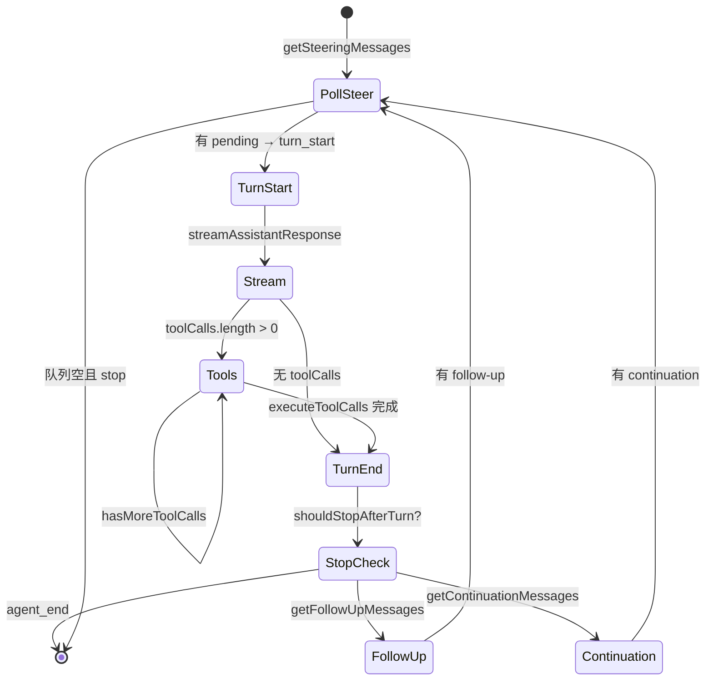

| 配置回调 | 所有者 | 用途 |
|----------|--------|------|
| `getSteeringMessages` | `Agent.steeringQueue` drain | mid-turn 用户插入 |
| `getFollowUpMessages` | `Agent.followUpQueue` | turn 尾自动继续 |
| `getContinuationMessages` | `AgentSession` autonomous | overflow / 自动续写 |
| `shouldStopBeforeTurn` | autonomous 预算 | turn 前阻断 |
| `shouldStopAfterTurn` | goal / autonomous | turn 后优雅退出 |

### 7.4 L4：`streamAssistantResponse` — 单次 LLM 采样

**文件**: `agent-loop.ts` — 包装 `streamFn`（默认 `streamSimple`）

| SSE 事件 | Agent 侧行为 |
|----------|--------------|
| `text` / `thinking` | 累积 `streamingMessage`；`message_update` |
| `tool_call` | 加入 `pendingToolCalls` |
| `usage` | 合并 token 计数 |
| `done` / `error` | 终态 assistant；`message_end` |

`transformContext`（可选）在 `convertToLlm` **之前**作用于 `AgentMessage[]`（与 Codex `ContextManager` 不同 — Prime 主要在 Session 层 `buildSessionContext` 折叠）。

### 7.5 L5：工具执行 — IPython 为主路径

```mermaid
sequenceDiagram
    participant Loop as runLoop
    participant Prep as prepareToolCall
    participant Tool as ipython AgentTool
    participant KM as KernelManager
    participant PY as Python kernel
    participant AS as AgentSession host

    Loop->>Prep: validateToolArguments
    Prep->>Tool: execute(id, args, signal, onUpdate)
    Tool->>KM: executeCell(code)
    KM->>PY: Jupyter execute_request
    PY->>AS: comm host.request (可选)
    AS-->>PY: host reply
    PY-->>KM: execute_reply
    KM-->>Tool: stdout + result
    Tool-->>Loop: AgentToolResult
    Loop->>Loop: createToolResultMessage
```

| 模式 | 配置 | 行为 |
|------|------|------|
| `parallel`（默认） | `toolExecution: "parallel"` | prepare 串行；execute 并发 |
| `sequential` | `toolExecution: "sequential"` | 逐个 finalize |
| `terminate: true` | 所有 tool results | 结束内层 tool 循环 |

`beforeToolCall` / `afterToolCall`（extensions + Agent options）可 block 或改写 tool result。

### 7.6 `TurnContext` 等价物 — AgentContext 冻结

Prime 无 Rust `TurnContext` struct；等价物为每次 `runLoop` 迭代时的：

| 冻结快照 | 字段 |
|----------|------|
| `AgentContext` | `messages`, `systemPrompt`, `tools` |
| `AgentLoopConfig` | `model`, `thinkingLevel`, `convertToLlm`, callbacks |
| `AbortSignal` | 本轮 cancel |

模型/思考级别变更通过 `SessionManager.appendModelChange` 写入 jsonl，下轮 `buildSessionContext` 读取。

### 7.7 取消、中断与错误

| 路径 | 行为 |
|------|------|
| 用户 cancel | Daemon `cancel` → `AbortSignal` → `stopReason: "aborted"` |
| IPython 超时 | tool result `isError`；loop 继续 |
| Provider 错误 | stream `error` 事件；assistant `stopReason: "error"` |
| Overflow | `AgentSession` 触发 compaction 或 continuation |

### 7.8 端到端时序（四层合一）

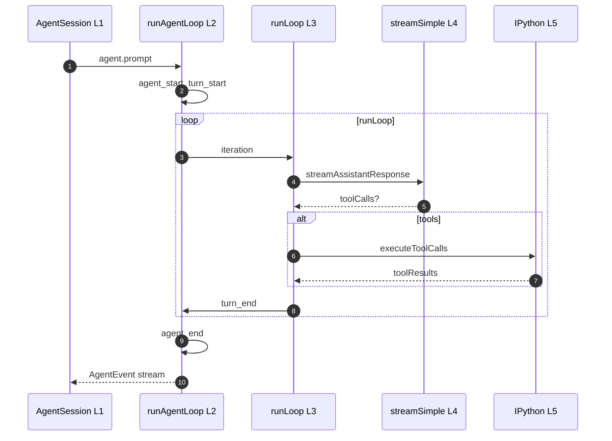

### 7.9 与 Codex `run_turn` 对照

| | Prime `runAgentLoop` | Codex `run_turn` |
|--|-------------------|------------------|
| 位置 | 独立 npm 包 `pi-agent-core` | `codex-core` 内 |
| Turn 实体 | 事件相 | `ActiveTurn` struct |
| 持久化 | L1 `AgentSession` 订阅 | Session 内联 `record_conversation_items` |
| 工具面 | IPython 单工具 | shell/patch/MCP 多工具 |
| Steer | `steeringQueue` poll | `TurnInputQueue` |
| Step 概念 | 无独立 struct；一次 stream+tools 为一「步」 | `StepContext` 每次采样冻结 |

### 7.10 调试与修改指南

| 要改… | 先读… |
|-------|-------|
| Turn 边界事件 | `agent-loop.ts` `turn_start`/`turn_end` emit 点 |
| 并行工具 | `executeToolCallsParallel` |
| 持久化时机 | `agent-session.ts` AgentEvent 处理器 |
| Steer 语义 | `agent.ts` `PendingMessageQueue` |
| Provider 流 | `packages/ai/src/stream.ts` |

---

## 第8章：端到端路径与对照

### 8.1 交互式 TUI 第一问

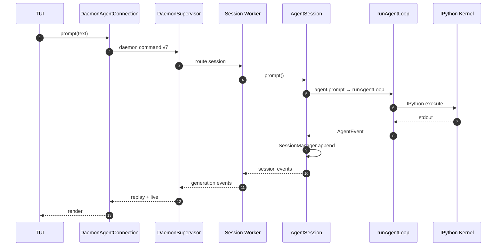

**文本调用链**：

```text
main.ts → ensureInteractiveDaemonRunning()
  → DaemonAgentConnection.prompt
  → worker: AgentSession.prompt
  → agent.runPromptMessages → runAgentLoop
  → executeToolCalls → ipython tool → KernelManager
```

### 8.2 入口模式

| 入口 | 路径 |
|------|------|
| 交互 TUI | `main.ts` → Daemon → `AgentSession.prompt` |
| RPC/JSON | `runRpcMode` / json mode → 同 `AgentSession` 或 in-process |
| ACP | `acp-mode.ts` → tool 映射到 IPython cell |
| SDK | `createAgentSession` + `InProcessAgentConnection` |

### 8.3 关键差异总结

| 主题 | Prime Agent | Codex | DeepTutor |
|------|-------------|-------|-----------|
| 工具面 | 单 IPython | 多内置 + MCP | 多 L1 Tool |
| 进程 | Daemon worker 默认 | 单 Session loop | asyncio TurnRuntime |
| 历史 | JSONL entry 树 | ResponseItem + Rollout | messages + turn_events |
| 子 Agent | `rlm.run` 子 Session | `spawn_agent` 新 Thread | capability pipelines |
| Turn ID | 无（generation） | Submission/Turn 事件 id | turn_id + seq |

---

**下一章**: [ARCHITECTURE_PART2.md](./ARCHITECTURE_PART2.md) — IPython、RLM、Compaction、Harness  
**实体时序**: [ENTITY_AND_SEQUENCES.md](./ENTITY_AND_SEQUENCES.md)  
**导航**: [README](./README.md)
