# Prime Agent 完整架构设计文档（第二部分）

> **版本**: 2.0 · **整理**: 2026-09-01  
> **体例参照**: [`docs/codex-architecture/ARCHITECTURE_PART2.md`](../codex-architecture/ARCHITECTURE_PART2.md)  
> **导航**: [PART1](./ARCHITECTURE_PART1.md) · [ENTITY §9.6–9.12](./ENTITY_AND_SEQUENCES.md)

---

## 目录

- [第1章：IPython 作为主工具 — 设计哲学](#第1章ipython-作为主工具--设计哲学)
- [第2章：KernelManager 与 Host Request](#第2章kernelmanager-与-host-request)
- [第3章：RLM 子 Agent 运行时](#第3章rlm-子-agent-运行时)
- [第4章：Continual Harness 与 /refine](#第4章continual-harness-与-refine)
- [第5章：Goals、Autonomous 与调度](#第5章goalsautonomous-与调度)
- [第6章：Skills 与 MCP](#第6章skills-与-mcp)
- [第7章：Compaction 深潜](#第7章compaction-深潜)
- [第8章：Extensions 钩子系统](#第8章extensions-钩子系统)
- [第9章：coding-agent 工具与模块地图](#第9章coding-agent-工具与模块地图)

---

## 第1章：IPython 作为主工具 — 设计哲学

### 1.1 为何「单工具面」

| 设计选择 | 收益 | 代价 |
|----------|------|------|
| 模型只见 **IPython** 一等工具 | 上下文=变量；组合=代码；RLM=函数调用 | 模型需会写 Python |
| Bash/Edit 降为遗留/辅助 | 减少 tool schema 噪声 | 迁移旧工作流 |
| MCP 在 kernel 内调用 | 与变量环境统一 | Python↔TS 往返延迟 |

**产品路径**：在 IPython cell 内 `open()`、`subprocess`、项目 API；特权操作通过 **host request** 回调 TypeScript（路径校验、RLM spawn、受控文件 IO）。

### 1.2 IPython Tool 契约

**文件**: `core/tools/ipython.ts`

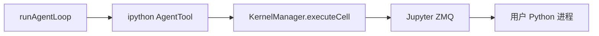

| 阶段 | 行为 |
|------|------|
| `prepareArguments` | 包装 cell 源码、超时 |
| `execute` | 经 Kernel 执行，流式 `onUpdate` 推送 partial output |
| `terminate` | 极少使用；子 cell 错误通常作为 tool result 返回 |

用户交互式 `!` bash（`bash-executor.ts`）走 **用户路径**，非模型主路径。

### 1.3 与 Codex 多工具对比

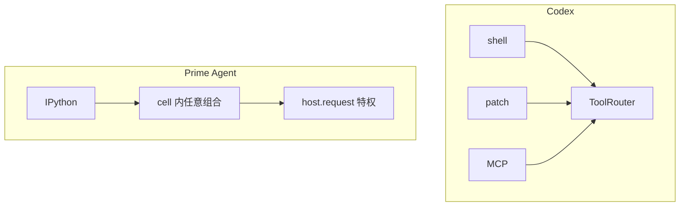

---

## 第2章：KernelManager 与 Host Request

### 2.1 KernelManager 职责

**文件**: `core/kernel/index.ts`

| 职责 | 说明 |
|------|------|
| 进程管理 | 启动/重启 IPython kernel 子进程 |
| ZMQ Jupyter 协议 | execute / inspect / complete |
| Comm 通道 | `HOST_COMM_TARGET = "host.request"` |
| 运行时注入 | 启动时注入 `prime-agent-runtime`（`rlm` 模块） |
| venv | `~/.prime/agent/kernel-venv/` 依赖隔离 |

### 2.2 Host Request 流

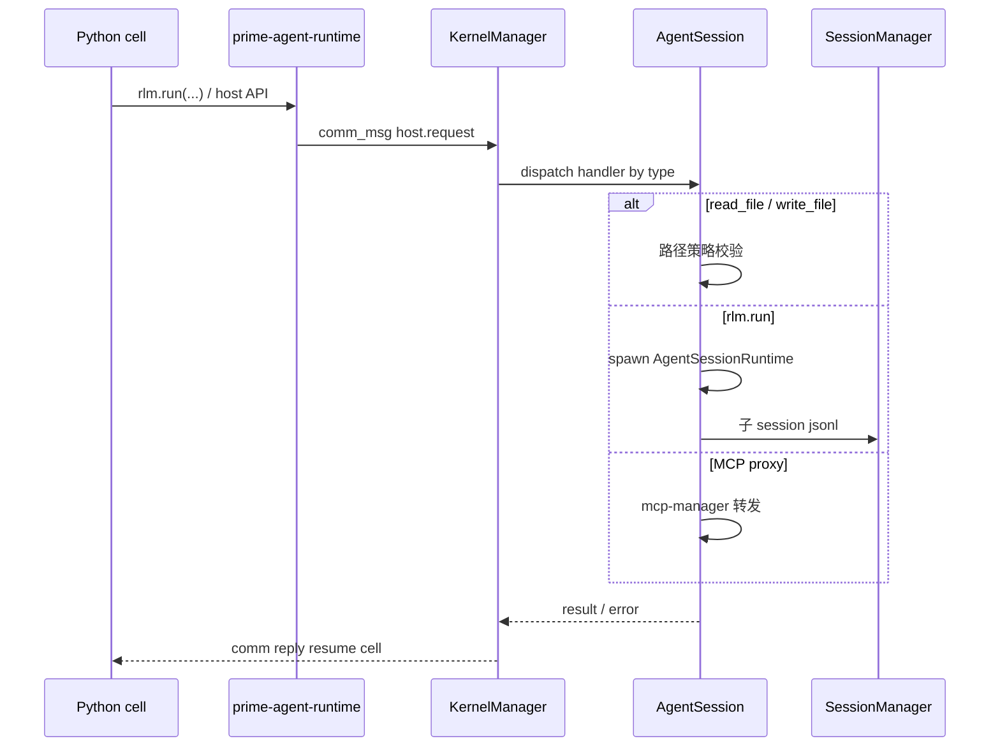

### 2.3 常见 `host.request` 类型

（以 `rlm-runtime.ts` / kernel 注册为准，节选）

| type | TS 侧行为 |
|------|-----------|
| `read_file` / `write_file` | 工作区路径策略、大小限制 |
| `rlm.run` | 创建子 `AgentSessionRuntime`，完整 `runAgentLoop` |
| `agent_message` | 跨 session 消息投递 |
| MCP 代理 | `mcp-manager` catalog 调用 |
| harness / skill 相关 | continual state 读写 |

### 2.5 KernelManager 源码级 API

**文件**: `core/kernel/index.ts` — `export class KernelManager`

| 方法/符号 | 说明 |
|-----------|------|
| `executeCell(code, options)` | Jupyter `execute_request`；流式 `onUpdate` |
| `interrupt()` | 发送 kernel interrupt |
| `dispose()` | 优雅 shutdown + 可选 snapshot |
| `registerHostHandler(type, handler)` | `createHostRequestHandler` 包装 |
| `HOST_COMM_TARGET` | `"host.request"` comm target |
| `restoreSnapshot` / `captureSnapshot` | dill 命名空间持久化 |

**ZMQ 通道**：Dealer（shell/control）+ Subscriber（iopub）。协议版本 `5.3`（`PROTOCOL_VERSION`）。

**Bootstrap**：`kernel/bootstrap.ts` → `ensureKernelPython` 创建 `~/.prime/agent/kernel-venv/`，注入 `prime-agent-runtime`。

### 2.6 Host Request 类型全集（节选）

| `request.type` | TS 处理方 | 阻塞 cell？ |
|----------------|-----------|-------------|
| `rlm.run` | `rlm-runtime.ts` `createSubagent` | 是（直到子 agent 完成） |
| `read_file` / `write_file` | `AgentSession` 路径策略 | 是 |
| `agent_message` | `agent-messages.ts` 路由 | 是 |
| `goal.*` | `goals.ts` | 是 |
| MCP 代理 | `mcp-manager.ts` | 是 |

Handler 签名：`createHostRequestHandler((payload, context) => ...)` — `context.isCurrent()` 防止 dispose 后回复。

### 3.1 编程模型

用户在 Python 中：

```python
result = rlm.run("Summarize all PDFs in data/", options={...})
```

→ Host 创建 **子 `AgentSessionRuntime`**（新 session 文件或子树）  
→ 子 session 完整 `runAgentLoop`  
→ 结果返回 Python 字符串/对象；父 session 记录 `child_usage_attributed`

### 3.2 架构图

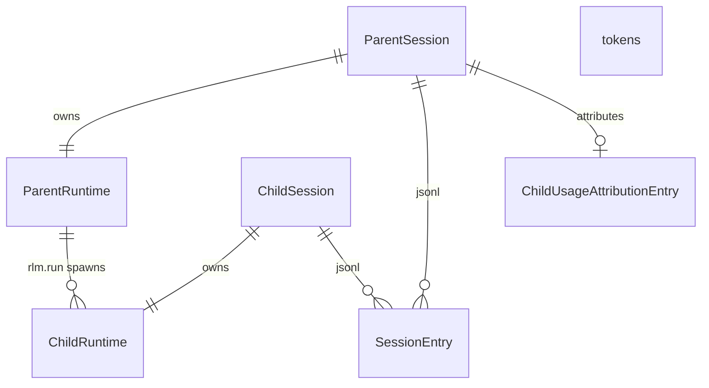

### 3.3 深度与限制

| 字段/设置 | 含义 |
|-----------|------|
| `SessionHeader.rlmDepth` | 当前 session 在 RLM 树中的深度 |
| `maxRlmDepth` | 超过则 host 拒绝 spawn |
| 子 kernel | 长任务可配置 **独立 kernel** 隔离状态 |
| `rlmChildId` | 父 session 中子节点标识 |

### 3.4 AgentSessionRuntime

| 字段 | 含义 |
|------|------|
| `_session` | 根或子 `AgentSession` |
| `subagentRuntimes` | `Map<string, AgentSessionRuntime>` |
| `_metadata.kind` | `top-level` \| `subagent` |
| `_metadata.rlmChildId` | 父 Session 中的 RLM 节点 |

### 3.5 子 Agent 完成与 quiescence

Daemon capability `rlm_quiescence_barrier`（schema rev 18+）：headless 模式下等待所有子 RLM 静默后再报告完成，避免父进程过早退出。

### 3.6 Agent 间消息

`agent-messages.ts` + Daemon 路由：运行中的 session 可互发消息，不必经用户。

- 投递为 `CustomMessage` 或 steer，取决于安全策略
- Schema revision 13+ **收窄 roster**（nuclear family），防止任意 session 互扰

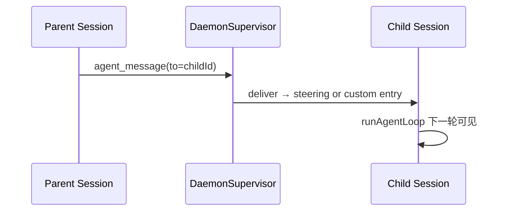

### 3.7 `createSubagent` 阶段表

**文件**: `core/rlm-runtime.ts`

| 阶段 | 行为 |
|------|------|
| S1 | 校验 `rlmDepth < maxRlmDepth` |
| S2 | 分配 `rlmChildId`；可选独立 kernel |
| S3 | `AgentSessionRuntime.createSubagentRuntime` → 新 jsonl |
| S4 | Child `prompt` → 完整 `runAgentLoop` |
| S5 | 结果序列化回 Python；父 session `child_usage_attributed` |
| S6 | Daemon roster 更新（capability `authoritative_child_roster`） |

### 3.8 RLM 与 Daemon quiescence

Headless 完成路径（`rlm_quiescence_barrier`）：`AgentSession` 等待 `_unsettledRlmChildRuns` 清空后才报告 `prompt_and_wait` 完成，避免父进程在子 agent 仍跑时退出。

---

## 第4章：Continual Harness 与 /refine

### 4.1 设计原理

**Continual Harness** = 跨 Turn 可精炼的 **补充 system 状态**，不覆写 base system prompt。

| 概念 | 存储 | 更新方式 |
|------|------|----------|
| 补充 system 片段 | harness 状态目录 + session `custom` entries | `/refine` 证据化 diff |
| Skill 描述 | skills 包 + harness | skill creator |
| Memory 文档 | L2/L3 风格 Markdown | 工具 + refine |

**不变量**：base system prompt **不可**被 refine 覆盖（防止 prompt 注入固化）。

### 4.2 Python 侧

`prime-agent-runtime/src/rlm/harness.py` — kernel 内读写 harness 快照，经 host request 与 TS 同步。

### 4.3 `/refine` 工作流

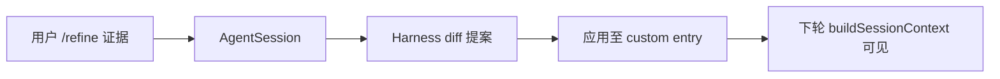

---

## 第5章：Goals、Autonomous 与调度

### 5.1 Goals

| 项 | 说明 |
|----|------|
| 用户接口 | `/goal` |
| 存储 | `GoalState` + `custom` SessionEntry |
| 进度 | assistant 消息计入 goal 完成度 |
| UI | Daemon 状态快照含 goal 摘要 |

### 5.2 Autonomous 模式

| 项 | 说明 |
|----|------|
| 用户接口 | `/autonomous` |
| 预算 | turn / token / time 上限 + quality gates |
| 停止 | `shouldStopBeforeTurn` / autonomous 评估钩子 |

### 5.3 Heartbeat 与 Cron

| 功能 | 接口 | 持久化 |
|------|------|--------|
| Heartbeat | `/heartbeat`, `rlm_heartbeat` | cron job 定义 |
| Schedule CLI | `prime-agent schedule` | `cron-jobs.ts` → `session-artifacts/` |

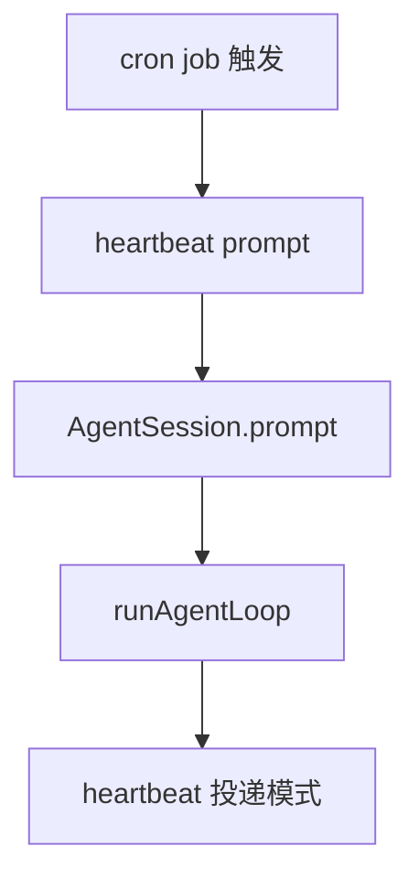

---

## 第6章：Skills 与 MCP

### 6.1 Skills

| 维度 | Skills | MCP |
|------|--------|-----|
| 形态 | 可安装 **Python 包** | **协议服务** |
| 模型使用 | `import` in cell | kernel 内 MCP 客户端 |
| 创建 | skill creator 固化 workflow | 外部 server 连接 |
| 文档 | `packages/coding-agent/docs/skills.md` | `docs/mcp` |

Skills 是 **代码**；MCP 是 **远程工具服务** — 二者均在 IPython 环境内可达，而非大量 TS 侧 tool schema。

### 6.2 MCP 双端架构

| 侧 | 职责 | 文件 |
|----|------|------|
| TypeScript | Catalog、OAuth token、UI 连接状态 | `pi-ai/mcp.ts`, `mcp-manager.ts` |
| Python kernel | 实际 MCP 调用 | `prime-agent-runtime` MCP base |

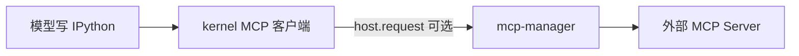

与 Codex 对比：Codex 在 Rust 侧将 MCP 工具暴露为原生 function calling；Prime 鼓励在 cell 内调用 MCP API。

---

## 第7章：Compaction 深潜

### 7.1 设计原理

| 原理 | 含义 |
|------|------|
| **Compaction 是 Entry** | 不删除 jsonl 历史；追加 `type: compaction` 节点 |
| **buildSessionContext 折叠** | 模型只见 summary + `firstKeptEntryId` 之后消息 |
| **文件操作追踪** | `CompactionDetails.readFiles/modifiedFiles` 跨压缩保留 |
| **Turn 后触发** | `estimateContextTokens` / `shouldCompact` 在 turn 末评估 |

### 7.2 默认设置

```typescript
// core/compaction/compaction.ts
export const DEFAULT_COMPACTION_SETTINGS: CompactionSettings = {
	enabled: true,
	reserveTokens: 16384,
	keepRecentTokens: 20000,
};
```

| 参数 | 含义 |
|------|------|
| `reserveTokens` | 为下一轮输出预留 |
| `keepRecentTokens` | 压缩时保留的最近上下文 token 预算 |

### 7.3 压缩流程

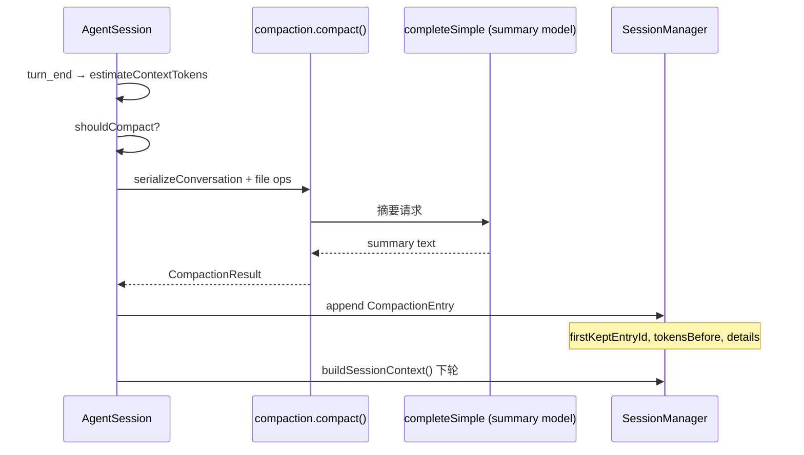

### 7.4 `buildSessionContext` 与 compaction 节点

```418:529:prime-agent/packages/coding-agent/src/core/session-manager.ts
export function buildSessionContext(
	entries: SessionEntry[],
	leafId?: string | null,
	byId?: Map<string, SessionEntry>,
): SessionContext {
	// 1. 从 leaf 沿 parentId 回溯到 root → path[]
	// 2. 扫描 path 上最后一个 compaction entry
	// 3. 若有 compaction:
	//    - 从 firstKeptEntryId 起收集 retainedMessages
	//    - messages = [CompactionSummaryMessage, ...retained, ...post-compaction]
	// 4. 否则 path 上全部 message entries
}
```

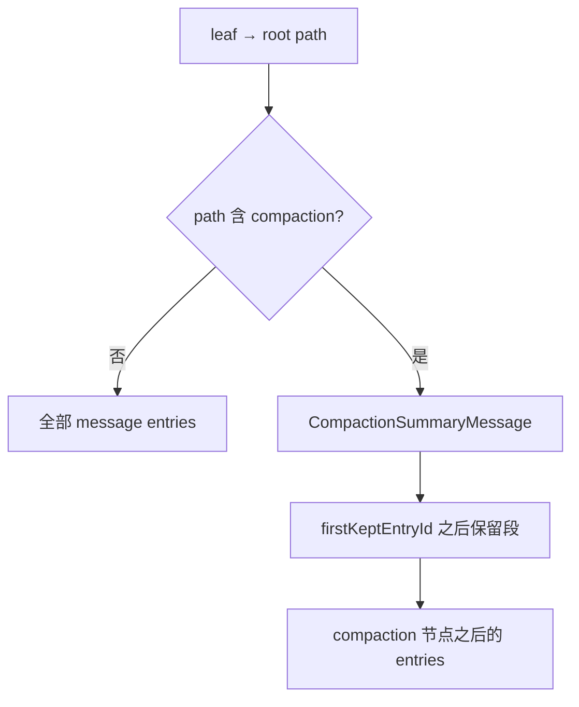

### 7.5 Branch Summarization

`core/compaction/branch-summarization.ts` — `/tree` 分叉时生成 `branch_summary` entry，使新分支以摘要种子启动而非复制全历史。

### 7.6 手动与 Hook 压缩

- 用户：`/compact` 命令
- Extensions：`compaction` hook 可注入 `customInstructions`
- `fromHook` 标记区分自动与 hook 触发（会话文件兼容）

### 7.7 与 DeepTutor / Codex 压缩对照

| | Prime | Codex | DeepTutor |
|--|-------|-------|-----------|
| 存储 | `CompactionEntry` in jsonl | `CompactionSummary` fragment | `compressed_summary` + watermark |
| 重建 | `buildSessionContext` | `ContextManager` | `ContextBuilder.build` |
| 文件追踪 | `CompactionDetails` | 部分 rollout 元数据 | 无一等文件 op 追踪 |

### 7.8 `compact()` 算法概要

**文件**: `core/compaction/compaction.ts`

| 步骤 | 函数 | 说明 |
|------|------|------|
| 1 | `serializeConversation` | 将待压缩 messages 序列化为摘要 prompt |
| 2 | `collectFileOperations` | 从 tool results 提取 read/modified 文件列表 |
| 3 | `completeSimple` | 调 summarization 模型 |
| 4 | 返回 `CompactionResult` | `summary`, `firstKeptEntryId`, `tokensBefore`, `details` |

`shouldCompact`：`estimateContextTokens(lastUsage) > contextWindow - reserveTokens`（`DEFAULT_COMPACTION_SETTINGS.reserveTokens = 16384`）。

### 7.9 Compaction 与 autonomous 交互

Threshold compaction 可能触发 `_queuedAutonomousThresholdContinuations` — autonomous 在压缩后继续同一 goal，而不丢失「未完成」语义。

---

## 第8章：Extensions 钩子系统

### 8.1 Runner 架构

**文件**: `extensions/runner.ts`

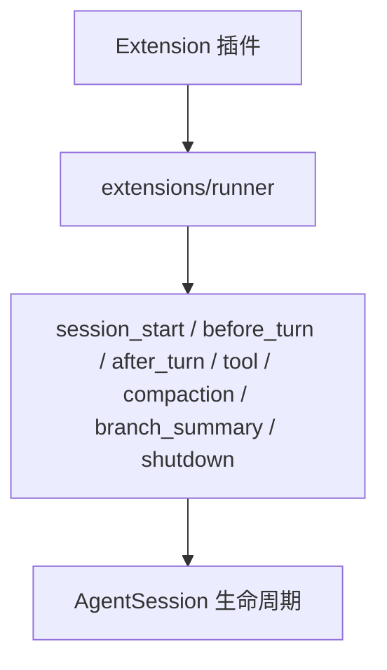

| 钩子时机 | 典型用途 |
|----------|----------|
| `session_start` / `shutdown` | 资源初始化 |
| `before_turn` / `after_turn` | 修改 steering、阻断 turn |
| tool execution | 包装 IPython、审计 |
| compaction / branch summary | 自定义摘要策略 |
| extension UI | Daemon `extension_ui` capability |

扩展可修改 steering、阻断工具、注入 custom entries（须遵守 runner 契约）。

### 8.2 钩子时机与签名（源码）

**文件**: `extensions/types.ts`, `extensions/runner.ts`

| 钩子 | 触发点 | 可修改 |
|------|--------|--------|
| `session_start` | runtime 首次 build | 资源注册 |
| `before_turn` | `AgentSession` dispatch 前 | steering 注入、阻断 |
| `after_turn` | turn_end 后 | 无 LLM 副作用 |
| `before_tool_call` / `after_tool_call` | `runAgentLoop` 工具路径 | block / 改写 result |
| `compaction` | 自动/手动压缩前 | `customInstructions` |
| `branch_summary` | `/tree` 分叉 | 摘要策略 |
| `shutdown` | dispose | 清理 |

`ExtensionRunner` 由 `AgentSession` 构造时绑定；Daemon `extension_ui` capability 允许扩展渲染 UI 面板。

### 8.3 Extension 与 Daemon 绑定

`daemon-extension-binding.ts` — attach 时协商 `supportsExtensionUi`；扩展命令经 `extension_command` 路由到 worker 内 runner。

---

## 第9章：coding-agent 工具与模块地图

### 9.1 工具目录

| 目录/文件 | 内容 |
|-----------|------|
| `core/tools/ipython.ts` | **模型主工具** |
| `core/tools/bash.ts`, `edit.ts` | 遗留/辅助 |
| `core/bash-executor.ts` | 用户 `!` 路径 |
| `core/mcp/` | MCP 管理 |
| `core/compaction/` | 压缩纯函数 |
| `core/rlm-runtime.ts` | RLM host handlers |
| `modes/daemon/` | Daemon 全家桶 |
| `modes/rpc/`, `modes/acp/` | 无头集成 |

### 9.2 持久化与 artifacts

| 路径 | 内容 |
|------|------|
| `~/.prime/agent/sessions/<uuid>.jsonl` | SessionEntry 树 |
| `.../session-artifacts/<uuid>/` | 大输出、cron、kernel 快照 |
| `auth.json` / `settings.json` | 凭证与设置 |
| `kernel-venv/` | Python 依赖 |

### 9.3 SessionManager I/O 特性

- `CURRENT_SESSION_VERSION = 3`
- 大文件流式解析（`SESSION_STREAMING_LOAD_THRESHOLD_BYTES`）
- `session-lease.ts` 防止多 worker 同时写同一 session

### 9.4 核心模块依赖图

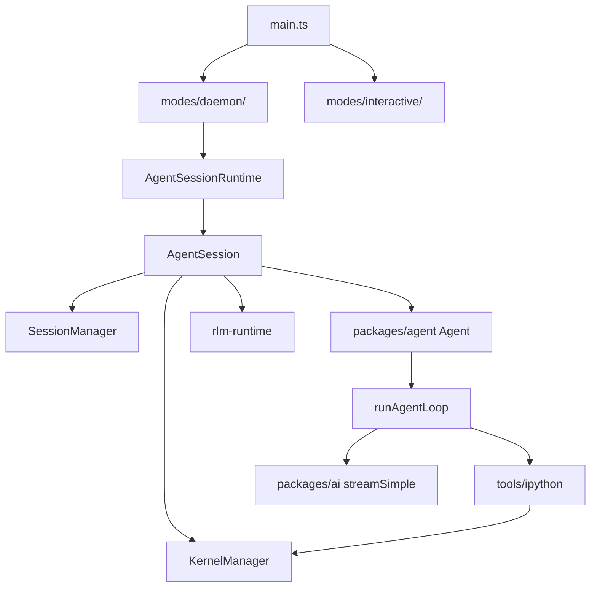

---

**上一章**: [ARCHITECTURE_PART1.md](./ARCHITECTURE_PART1.md)  
**下一章**: [ARCHITECTURE_PART3.md](./ARCHITECTURE_PART3.md)
