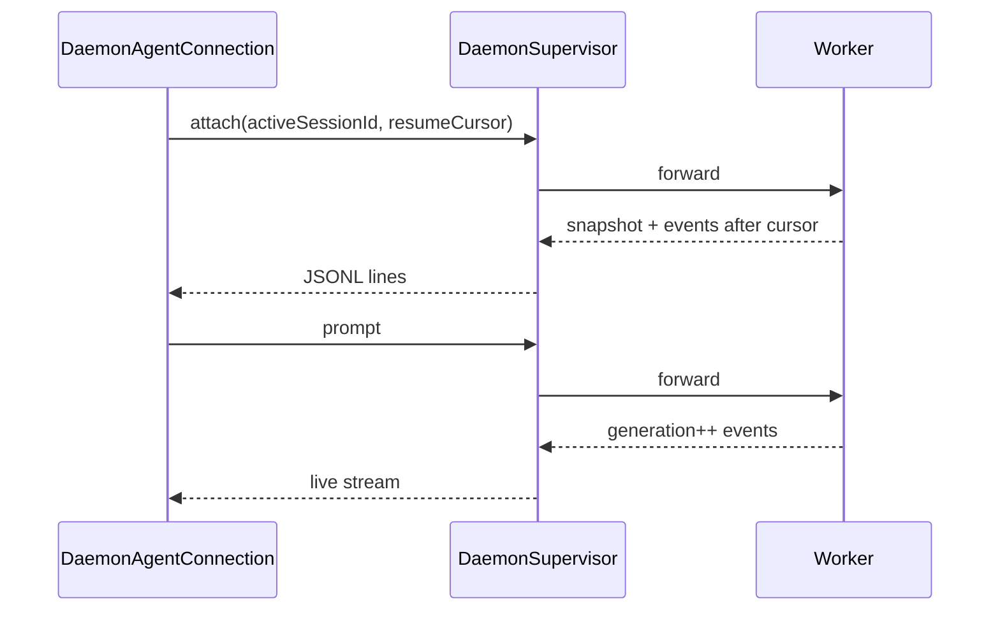
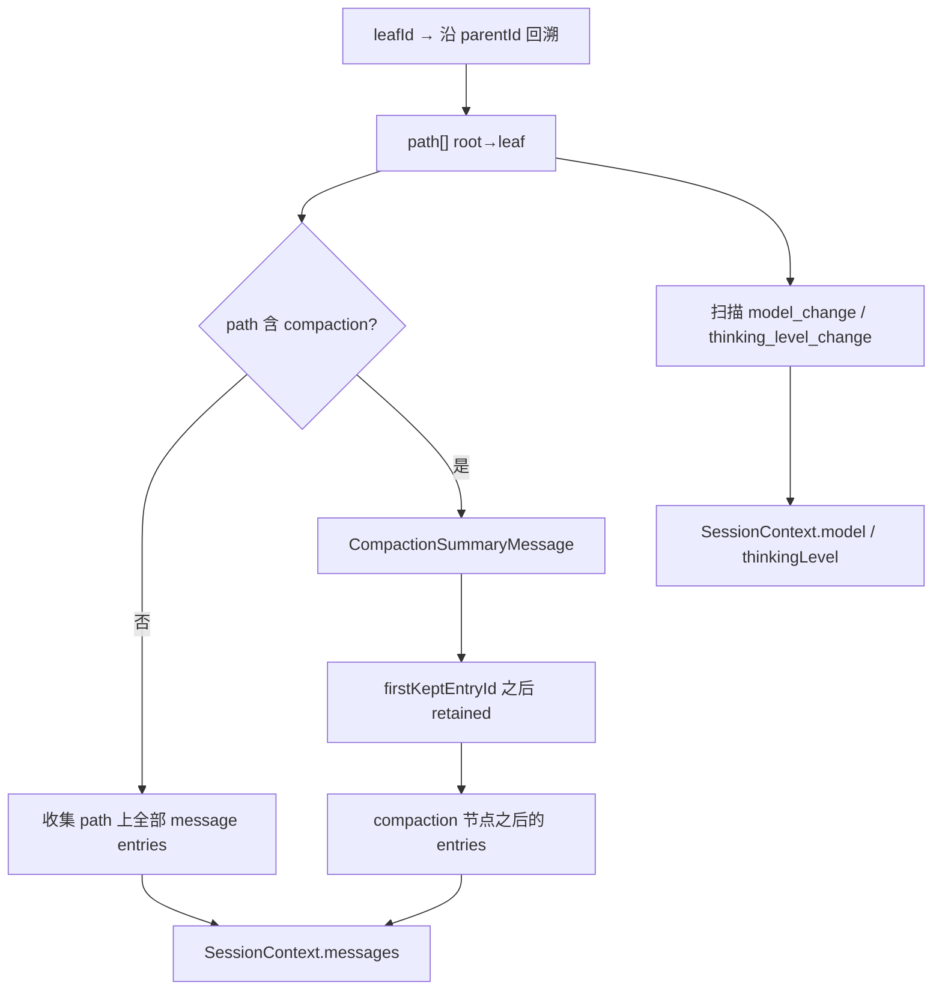

# Prime Agent 架构 — PART3：协议、持久化、设计取舍

> **版本**: 2.1 · **整理**: 2026-09-01  
> **体例参照**: [`docs/codex-architecture/ARCHITECTURE_PART3.md`](../codex-architecture/ARCHITECTURE_PART3.md)  
> **导航**: [PART1](./ARCHITECTURE_PART1.md) · [ENTITY](./ENTITY_AND_SEQUENCES.md)

---

## 目录

- [第1章：Daemon 协议 v7 深潜](#第1章daemon-协议-v7-深潜)
- [第2章：Worker 私有协议](#第2章worker-私有协议)
- [第3章：其他对外协议](#第3章其他对外协议)
- [第4章：Session 持久化与重建](#第4章session-持久化与重建)
- [第5章：Observability](#第5章observability)
- [第6章：设计取舍](#第6章设计取舍)
- [第7章：安全提示](#第7章安全提示)

---

## 第1章：Daemon 协议 v7 深潜

### 1.1 版本常量

| 常量 | 值 | 文件 |
|------|-----|------|
| `DAEMON_PROTOCOL_NAME` | `prime-agent.daemon` | `daemon-protocol.ts` |
| `DAEMON_PROTOCOL_VERSION` | **7** | 同上 |
| `DAEMON_SCHEMA_REVISION` | **20** | 能力增量修订 |
| `DAEMON_SCHEMA_ID` | `protocol-7-schema-20-ed994cc39507` | 指纹 |

```52:68:prime-agent/packages/coding-agent/src/modes/daemon/daemon-protocol.ts
export const DAEMON_PROTOCOL_NAME = "prime-agent.daemon";
export const DAEMON_PROTOCOL_VERSION = 7;
export const DAEMON_COMMAND_ENVELOPE_MIN_PROTOCOL_VERSION = 7;
// Revision 9-20: RLM depth, roster, quiescence, input pause, ...
export const DAEMON_SCHEMA_REVISION = 20;
export const DAEMON_SCHEMA_ID = "protocol-7-schema-20-ed994cc39507";
```

### 1.2 变更规则（AGENTS.md）

1. 不兼容变更 → bump `DAEMON_PROTOCOL_VERSION`
2. 可选能力 → `DaemonServerCapability` gate；客户端 attach 时检查
3. 更新 `DAEMON_COMMAND_COMPATIBILITY` maps + 双向兼容测试
4. 新命令若成为启动必需 → 必须 gate，否则旧 daemon 仍能启动

### 1.3 Capability 协商

**客户端**（`DaemonClientCapability`）：`attach_snapshot`, `event_sequence`, `extension_ui`, `slim_attach`, `chunked_snapshot`, `client_owned_sessions`

**服务端**（额外）：`delete_rlm_subagent`, `heartbeat_catalog`, `heartbeat_management`, `model_catalog`, `side_question_transcript`, `transient_bash`, `session_input_admission`, `prompt_admission_cancellation`, `queue_message_mutation`, `authoritative_child_roster`, `owned_session_recovery_context`, `rlm_quiescence_barrier`, `session_input_pause`, `owned_prompt_cancellation`

### 1.4 命令全集（逻辑分组）

**文件**: `daemon-protocol.ts` — `export type DaemonCommand`

| 分组 | `type` | 用途 |
|------|--------|------|
| **生命周期** | `list`, `create`, `attach`, `reattach`, `detach` | Session 创建与绑定 |
| **生命周期** | `complete_owned_session`, `promote_owned_session`, `kill` | client-owned worker |
| **执行** | `prompt`, `prompt_and_wait`, `steer`, `cancel` | 用户输入与中断 |
| **准入** | `cancel_prompt_admission` | 未开始的 prompt 取消 |
| **队列** | `mutate_queued_message` | 修改 steer/follow-up 队列 |
| **RLM** | `delete_rlm_subagent`, depth 相关命令 | 子 agent 管理 |
| **Side** | `start_side_question`, `execute_bash` | 不记入 session 的旁路 |
| **Heartbeat** | `heartbeat_catalog`, `heartbeat_management` | cron 调度 |
| **元数据** | `rename`, `get_state`, snapshot 系列 | UI 状态 |
| **维护** | `prepare_update_restart`, `doctor` 相关 | 升级与修复 |

每条命令可选 `id`；响应为 `{ type: "response", id, ok, result? | error? }`。

### 1.5 事件信封与重放

```typescript
// 概念形状（见 daemon-protocol.ts DaemonEventEnvelope）
{
  type: "event",
  generation: string,      // 每次 prompt 递增
  sequence: number,        // 单调序号
  meta?: DaemonEventMeta,
  event: AgentConnectionSessionEvent | ...
}
```

| 概念 | 说明 |
|------|------|
| `DaemonEventCursor` | `{ generation, sequence }` — attach 重放起点 |
| `DaemonReplayStatus` | `complete` / `partial` / `unavailable` |
| Chunked snapshot | `session_snapshot_begin` + `session_snapshot_chunk` — 大 session |



### 1.6 与远程网关的关系

协议类型 **JSON 可序列化** — `DaemonAgentConnection` 抽象已隔离 TUI 与传输；未来 gateway 可代理 Unix socket 而不泄漏传输细节到 `InteractiveMode`。

---

## 第2章：Worker 私有协议

**文件**: `daemon-worker-protocol.ts`, `session-worker/private-framing.ts`

| 属性 | 客户端 v7 | Supervisor ↔ Worker |
|------|-----------|---------------------|
| 传输 | Unix socket JSONL | 二进制帧 |
| 帧格式 | 一行一 JSON | 4-byte BE length + JSON |
| 类型 | `DaemonCommand` / `DaemonOutbound` | `DaemonWorkerFrame`, `PrivateFrame` |
| 可见性 | TUI / RPC / ACP | **永不**暴露给客户端 |

`DaemonWorkerClient`（supervisor 侧）维护 worker 进程 spawn、心跳、recovery journal（`worker-recovery-journal.ts`）。

---

## 第3章：其他对外协议

### 3.1 模式对照

| 模式 | 传输 | 入口文件 | `AgentConnection` 实现 |
|------|------|----------|------------------------|
| **Daemon**（默认 TUI） | Unix socket JSONL v7 | `daemon-mode.ts` | `DaemonAgentConnection` |
| **RPC** | stdin/stdout LF JSON | `modes/rpc/rpc-mode.ts` | 常 InProcess 或 Daemon |
| **JSON** | 单行事件 stdout | `main.ts` | InProcess |
| **ACP** | NDJSON JSON-RPC 2.0 | `modes/acp/acp-mode.ts` | tool → IPython cell 映射 |
| **Print** | 纯文本 | `main.ts` | 无事件流 |
| **SDK** | 进程内 | `core/sdk.ts` | `InProcessAgentConnection` |

### 3.2 RPC 命令形状

**文件**: `modes/rpc/rpc-types.ts` — 与 Daemon 命令语义对齐但经 stdin 适配；适合 CI 嵌入。

### 3.3 ACP 映射

编辑器发送 tool call → ACP 层包装为 IPython cell 字符串 → 同 `AgentSession.prompt` 路径。无独立工具 schema 面。

---

## 第4章：Session 持久化与重建

### 4.1 文件布局

```text
~/.prime/agent/
  sessions/<uuid>.jsonl           # SessionEntry 树（version 3）
  session-artifacts/<uuid>/       # kernel snapshot, cron, 大输出
  auth.json                       # Provider 凭证
  settings.json                   # 全局设置
  kernel-venv/                    # Python 依赖
  <project>/.prime/agent/settings.json  # 项目设置
```

### 4.2 版本与迁移

`CURRENT_SESSION_VERSION = 3`（`session-manager.ts`）。`migrateSessionEntries` / `migrateToCurrentVersion` 处理 v1 无 `version` 字段的 session。

### 4.3 `buildSessionContext` 算法（源码级）

**文件**: `session-manager.ts` L418+



| 步骤 | 函数 | 说明 |
|------|------|------|
| 1 | `getBranch(leafId)` | 叶到根路径 |
| 2 | `getLatestCompactionEntry` | 路径上最后 compaction |
| 3 | `createCompactionSummaryMessage` | 注入摘要为 custom/system 消息 |
| 4 | `applyChildUsageAttributions` | 合并 RLM 子 usage 到父 assistant |
| 5 | 跳过 | `session_state`, `agent_status`, `git_state` 等 bookkeeping |

### 4.4 SessionManager 写路径

| 方法 | 写入 `type` |
|------|-------------|
| `appendMessage` | `message` |
| `appendCompaction` | `compaction` |
| `appendCustomEntry` | `custom` |
| `appendChildUsageAttribution` | `child_usage_attributed` |
| `appendAgentStatus` | `agent_status` |

`_persist` → `appendFileSync` 单行 JSON；`onPersist` 监听器通知 catalog 刷新。

### 4.5 Lease 与并发

**文件**: `session-lease.ts`

| 机制 | 说明 |
|------|------|
| `acquireSessionLease` | 单 writer；多 worker 抢同一 jsonl 失败 |
| `SESSION_LEASES_ENABLED_ENV` | daemon worker 启用 lease |
| 孤儿恢复 | supervisor `doctor` / recovery journal |

### 4.6 大文件流式加载

`SESSION_STREAMING_LOAD_THRESHOLD_BYTES = 128 MiB` — 超过阈值流式解析，避免 OOM。

---

## 第5章：Observability

| 通道 | 文件/路径 | 内容 |
|------|-----------|------|
| Agent traces | `agent-traces.ts` | 可选上传 |
| Daemon 日志 | `getDaemonLogPath()` | supervisor + worker rotating log |
| Usage | `AssistantMessage.usage` | 每轮 token |
| RLM 归因 | `child_usage_attributed` entry | 子 agent 透明计费 |
| Extension 钩子 | `extensions/runner.ts` | 自定义埋点 |

---

## 第6章：设计取舍

### 6.1 优势

| 选择 | 收益 |
|------|------|
| IPython 单工具面 | 模型可编程组合；RLM 自然 |
| Daemon worker | 断开终端继续跑；attach 恢复 |
| JSONL 树 | 分支/compaction/审计一条文件 |
| `pi-agent-core` 独立 | SDK 可嵌入非 coding-agent 产品 |
| Host request 特权上浮 | 路径/spawn 策略集中 TS |

### 6.2 代价

| 选择 | 成本 |
|------|------|
| 多进程 | 部署与调试复杂度高 |
| 非沙箱 kernel | 用户须自备隔离 |
| Host request 同步 comm | Python↔TS 往返延迟 |
| Daemon v7 演进 | 客户端/服务端须协商 capability |
| 无 Turn 持久化 ID | 跨进程关联靠 `generation` |

### 6.3 三维对照

| 维度 | Prime Agent | Codex | DeepTutor |
|------|-------------|-------|-----------|
| 控制面 | DaemonCommand JSONL | Op/Submission | WS TurnRuntime |
| 模型历史 | `AgentMessage[]` + compaction 折叠 | `ResponseItem[]` append-only | SQLite messages |
| 工具 | IPython + host | shell/patch/MCP | 多 L1 Tool |
| 子 Agent | `rlm.run` 子 Session | `spawn_agent` Thread | capability |
| 压缩 | `CompactionEntry` | `Compaction` fragment | watermark summary |

---

## 第7章：安全提示

README 明确：模型生成的 Python 以 **用户权限** 运行。`@anthropic-ai/sandbox-runtime` 示例扩展 **不是** 默认。

| 层 | 防护 | 非防护 |
|----|------|--------|
| Host request | 路径白名单、RLM depth | OS 级隔离 |
| Daemon socket | Unix path 权限 | 网络暴露（默认本地） |
| Lease | 双写 jsonl | 恶意本地用户 |

---

返回 [文档中心](./README.md)
