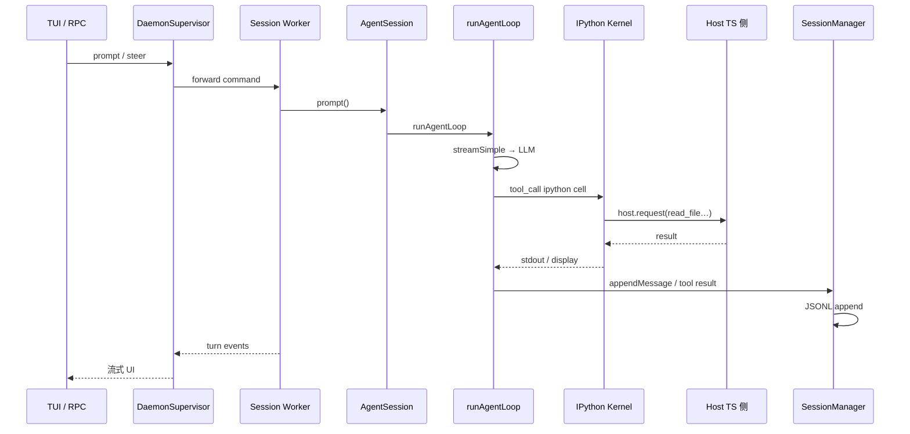
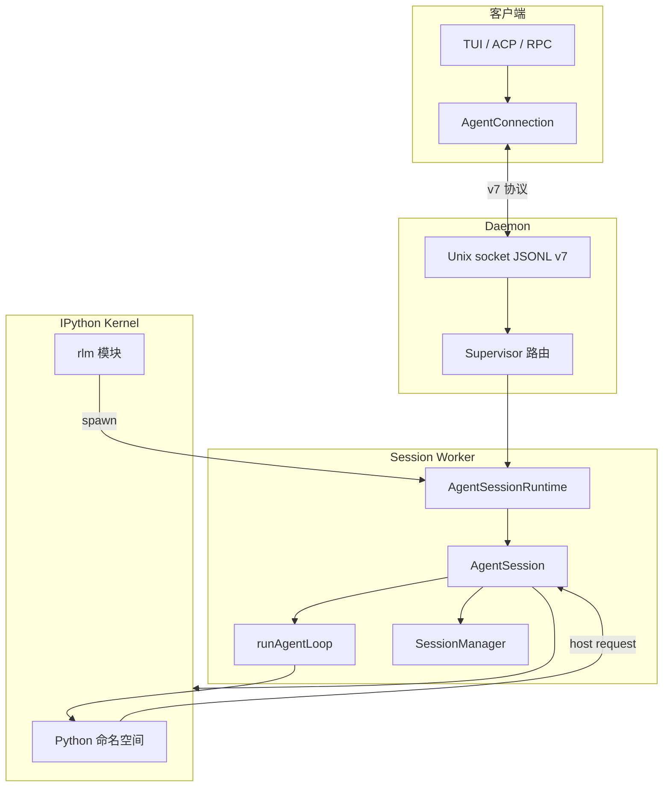
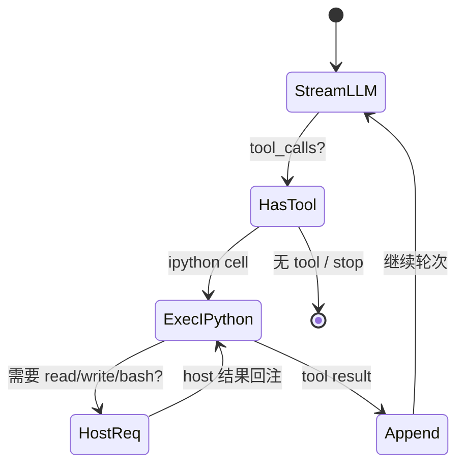
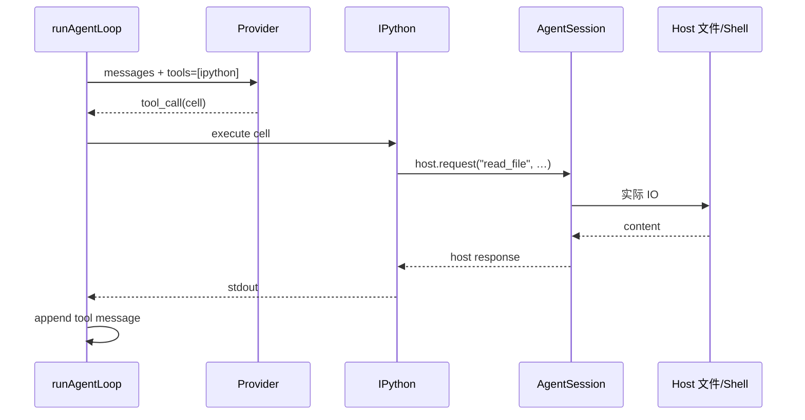
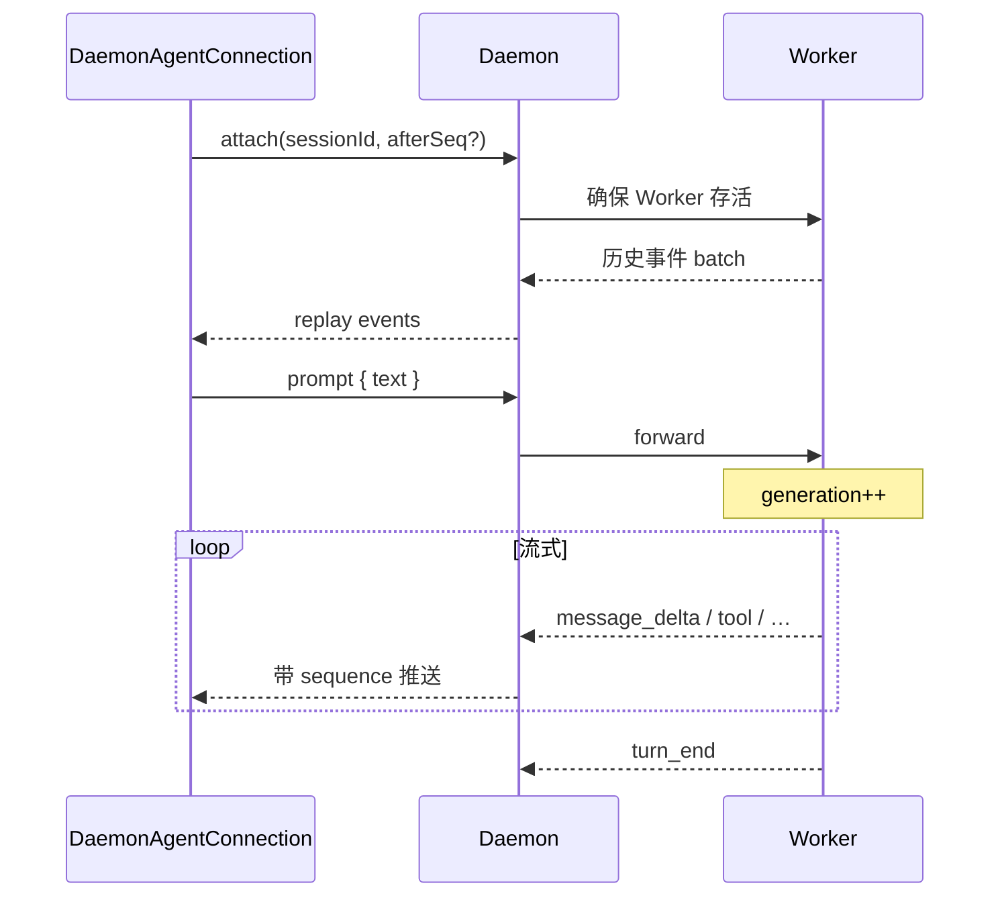
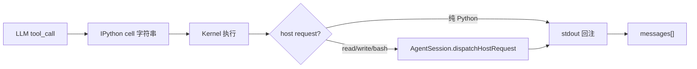
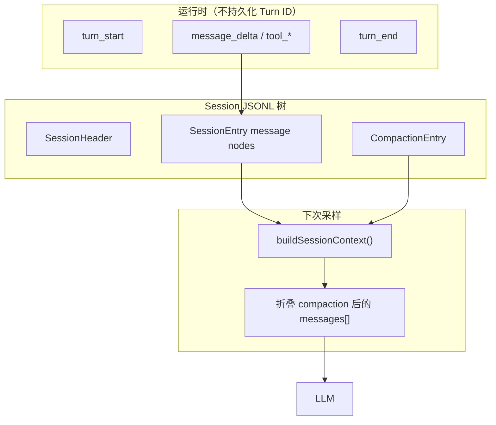
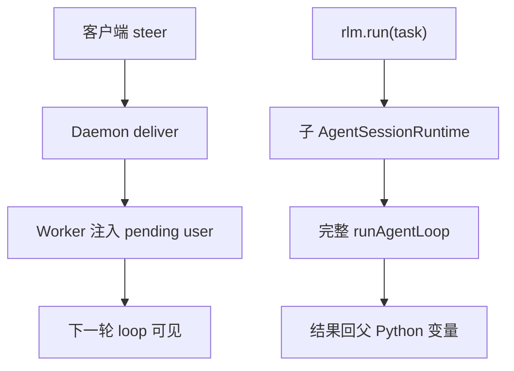
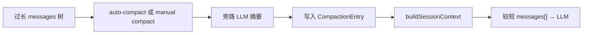

# Prime Agent 设计思想导读

> **Pi 栈 + Prime 封装主图**：[pi-architecture/PI_STACK_ARCHITECTURE.md](../pi-architecture/PI_STACK_ARCHITECTURE.md)  
> **Pi 与 Prime 关系**：[PI_AND_PRIME.md](./PI_AND_PRIME.md)（读导读前建议先看）  
> **阅读方式**：先读本导读（~40 分钟）→ [README.md](./README.md) → 改代码时打开 PART / ENTITY  
> **写法标准**：[PROGRESSIVE_ARCH_DOC_METHODOLOGY.md](../agent-doc-template/PROGRESSIVE_ARCH_DOC_METHODOLOGY.md)  
> **跨项目对照**：[CROSS_AGENT_CONCEPT_MAP.md](../agent-doc-template/CROSS_AGENT_CONCEPT_MAP.md) · [Codex 导读](../codex-architecture/DESIGN_THINKING_SERIES.md)

---

## 先建立一条运行路径

TUI / RPC / ACP 都只是 **客户端**；真正跑 Agent 的是 **Daemon 托管的 Session Worker**：

```text
客户端 AgentConnection.prompt(text)
  → DaemonSupervisor 路由到 Session Worker
  → AgentSession.prompt()
  → Agent.runPromptMessages() → runAgentLoop()
        stream LLM（主要只见 ipython 工具）
        → 执行 Python cell
        → host request 回 TS（read / write / bash…）
        → 结果追加 messages
        until stop 或 max turns
  → SessionManager.append* → JSONL 树
  → Daemon 事件流推回客户端（generation + sequence）
```



后面每一节在这条路径上加透镜。

---

## 第 1 步：四层进程 — 谁持有执行权

**一句话**：**客户端不跑 loop**；**Daemon 不采样**；**Worker 不跨 Session 共享 kernel**；**Kernel 不直接碰特权 FS**。



| 层 | 持有 | 禁止 |
|----|------|------|
| Client | UI 状态、事件游标 | 写 jsonl、调 LLM |
| Daemon | 路由表、Worker roster | 跑 Agent、开 kernel |
| Worker | 单 Session 全套状态 | 默认跨 session 共享 kernel |
| Kernel | 变量、cell 执行 | 未经 host 的特权 IO |

→ 实体 ER：[ENTITY §1](./ENTITY_AND_SEQUENCES.md#1-实体总览与包含关系) · 详图：[PART1 §1.2](./ARCHITECTURE_PART1.md#12-分层架构)

---

## 第 2 步：状态 vs 执行

**一句话**：**AgentSession 管产品与持久化**；**runAgentLoop 管单轮无状态循环**；**Turn 只有运行时事件，没有磁盘 ID**。

```mermaid
erDiagram
    AgentSession ||--|| SessionManager : persists
    AgentSession ||--|| Agent : delegates
    Agent ||--o{ Message : runtime_messages
    SessionManager ||--o{ SessionEntry : jsonl_tree
    SessionEntry ||--o| CompactionEntry : may_compact

    AgentSession {
        string sessionId
        prompt steer compact
    }
    SessionManager {
        appendMessage buildSessionContext
    }
    Agent {
        AgentState messages
    }
```

| | AgentSession | runAgentLoop |
|--|--------------|--------------|
| **生命周期** | 与 Worker 同寿 | 每次 `prompt()` 调用 |
| **持久化** | 驱动 SessionManager | 无状态函数 |
| **对外 API** | `prompt` `steer` `compact` | 内部 `stream` → tool |

**校正**：Prime **没有** Codex 式 Rollout / EventMsg / ContextManager 三真相；**JSONL 树是单账本**（消息 + compaction 节点）。

→ 专文：[RUNTIME_AND_PERSISTENCE.md](./RUNTIME_AND_PERSISTENCE.md)

---

## 第 3 步：runAgentLoop 内层 — 唯一主工具 IPython

**一句话**：模型 **主要只调 ipython**；文件/命令是 cell 里触发 **host request** 回 TypeScript 执行。





| 设计取舍 | 好处 | 代价 |
|----------|------|------|
| 单工具面 | 模型学一种调用方式 | Host 要维护请求协议 |
| 上下文在 Python 变量 | 长任务可编程组合 | Kernel 状态要管理 |
| TS 侧执行特权 IO | 统一审批/策略点 | 往返延迟 |

→ [PART1 §7](./ARCHITECTURE_PART1.md#第7章runagentloop--agent-包核心循环四层深潜) · [PART2 §2](./ARCHITECTURE_PART2.md)

---

## 第 4 步：Daemon v7 — 连接、代次、重放

**一句话**：客户端通过 **Unix socket JSONL** 说话；每条事件带 **`generation` + `sequence`**；`attach` 可 **重放历史 + 续订 live**。



| 概念 | 含义 |
|------|------|
| **generation** | 一次 `prompt`（或 steer 触发的续跑）的代次 |
| **sequence** | 会话内单调序号，用于丢包补洞 |
| **attach** | 断线重连、TUI 重启后恢复 |

→ [PART1 §4](./ARCHITECTURE_PART1.md#第4章daemon-协议-v7-深潜) · [PART3 §1](./ARCHITECTURE_PART3.md)

---

## 第 5 步：工具管线 — 从 cell 到副作用



| 路径 | 执行位置 | 策略注入点 |
|------|----------|------------|
| 纯 Python 计算 | Kernel | 沙箱化 Python 环境 |
| read / write / bash | TS Host | 审批、路径规则 |
| MCP / Skills | 扩展层 | PART2 |
| `rlm.run()` | 新 Worker + 可选子 kernel | 独立 session 文件 |

→ [CORE_RUNTIME_WALKTHROUGH](./CORE_RUNTIME_WALKTHROUGH.md)

---

## 第 6 步：事件流 — Turn 与 JSONL 的关系



| 通道 | 内容 | 持久化 |
|------|------|--------|
| Turn 事件 | UI 流式 | 否（仅内存 + Daemon 推送） |
| JSONL 行 | message / tool / compaction | ✅ 权威 |
| `buildSessionContext` | 给 LLM 的视图 | 每次现算 |

→ [RUNTIME_AND_PERSISTENCE.md](./RUNTIME_AND_PERSISTENCE.md)

---

## 第 7 步：Steer vs 新 Prompt vs RLM

| 语义 | 机制 | 何时可见 |
|------|------|----------|
| **Steer** | 运行中注入 user 片段 | **下一轮** `runAgentLoop` 迭代 |
| **新 Prompt** | 新 `prompt()` | 新 generation |
| **RLM 子 Agent** | `rlm.run()` spawn 子 Runtime | **独立** session / 子树 |



**易错**：RLM **不是** steer——是编程式 **spawn 完整子 Session**，有独立 JSONL（或子树）。

→ [PART2 §3 RLM](./ARCHITECTURE_PART2.md)

---

## 第 8 步：Compaction — 历史怎么变短

**一句话**：**CompactionEntry** 在 JSONL 树中标记「此前缀已被摘要替换」；`buildSessionContext` **跳过被压段**，用 summary 节点拼 prompt。



| | Codex compact | Prime compact |
|--|---------------|---------------|
| 触发 | token 预算 / 手动 | Harness 策略 + 手动 |
| 存储 | Rollout `Compacted` | JSONL `CompactionEntry` |
| 模型输入 | 替换 `ContextManager` 窗口 | `buildSessionContext` 折叠 |

→ [PART2 §6](./ARCHITECTURE_PART2.md) · [ENTITY §9.9](./ENTITY_AND_SEQUENCES.md)

---

## 第 9 步：Continual Harness 与边界

| 在核心 | 在扩展 |
|--------|--------|
| Daemon + Worker 进程模型 | ACP 编辑器集成 |
| AgentSession + JSONL | 具体 MCP server |
| runAgentLoop + IPython | Skills 清单 |
| RLM spawn | 远程 Provider 细节 |
| Compaction | 主题 / 插件市场 |

**一句话**：**Continual Harness + IPython 单入口 + RLM 编程式子 Agent + JSONL 单账本**。

### 三项目对照

| | Prime | Codex | DeepTutor |
|--|-------|-------|-----------|
| 主工具 | IPython | shell/patch/MCP | 多 L1 Tool |
| 会话 | JSONL 树 | Rollout + Thread | SQLite turns |
| 子 Agent | `rlm.run()` | `spawn_agent` | subagent capability |
| 客户端 | Daemon 默认 | 进程内 Session | WebSocket TRM |

→ [PART3 设计取舍](./ARCHITECTURE_PART3.md)

---

## 阅读路径

```text
DESIGN_THINKING_SERIES（本文）
  → RUNTIME_AND_PERSISTENCE（Turn / JSONL / prompt 专文）
  → CORE_RUNTIME_WALKTHROUGH（冷启动 / RLM / compact 实例）
  → PART1 §7 runAgentLoop
  → ENTITY_AND_SEQUENCES（函数级深潜）
```
