# Prime Agent — 实体模型、时序与模块深潜

> **设计原理（图表为主，推荐先读）**：[DESIGN_THINKING_SERIES.md](./DESIGN_THINKING_SERIES.md) · [RUNTIME_AND_PERSISTENCE.md](./RUNTIME_AND_PERSISTENCE.md)  
> **本文档定位**：字段级 / 函数级深潜，含模块锚点。  
> **配套**: [PART1](./ARCHITECTURE_PART1.md) · [WALKTHROUGH](./CORE_RUNTIME_WALKTHROUGH.md)

---

## 导读：阅读顺序

| 你想搞清… | 跳转 |
|-----------|------|
| Session 怎么存、Turn 存不存 | [§1](#1-实体总览与包含关系) · [§3](#3-持久化实体jsonl-树) |
| 从 TUI 到 LLM 调用链 | [§6](#6-端到端时序-a交互式-prompt--ipython-工具) |
| Daemon 命令与事件 | [§9.1](#91-daemon-协议-v7) |
| `runAgentLoop` 内层 | [§9.5](#95-runagentloop-agent-包) |
| `AgentSession.prompt` | [§9.4](#94-agentsession-编排层) |
| RLM 子 Agent | [§9.8](#98-rlm-子-agent-运行时) |
| Compaction | [§9.9](#99-compaction) |
| IPython host request | [§9.6](#96-kernelmanager--ipython-工具) |

---

## 完整目录

**第一篇 实体模型** — §1–5  
**第二篇 端到端时序** — §6–8  
**第三篇 模块深潜** — §9（9.1–9.12）  
**第四篇 JSON 实例** — §10

---

# 第一篇 实体模型

## 1. 实体总览与包含关系

### 1.1 进程与包级包含

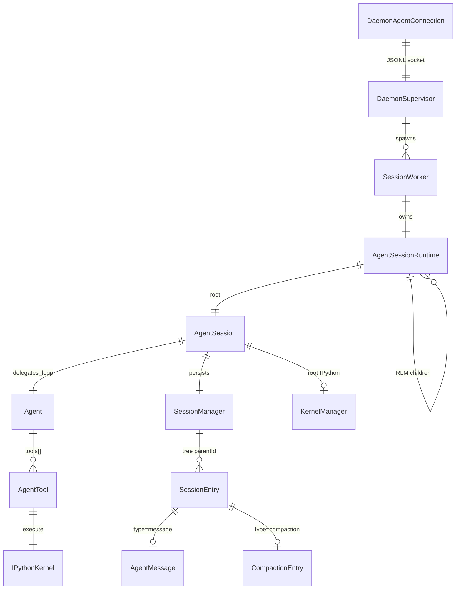

### 1.2 分层架构速查

完整 §1.2 见 [PART1 §1.2](./ARCHITECTURE_PART1.md#12-分层架构)。本节摘录实体关系。

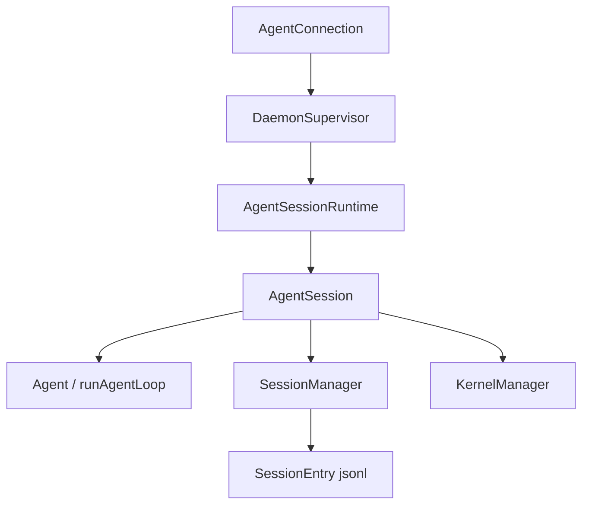

### 1.3 Monorepo 包职责

| 包 | npm 名 | 职责 |
|----|--------|------|
| `packages/coding-agent` | `@earendil-works/pi-coding-agent` | CLI、Daemon、AgentSession、SessionManager、Kernel、RLM、Compaction |
| `packages/agent` | `@earendil-works/pi-agent-core` | 通用 `Agent` + `runAgentLoop` |
| `packages/ai` | `@earendil-works/pi-ai` | Provider、`streamSimple`、Message 基类型、MCP catalog |
| `packages/tui` | `@earendil-works/pi-tui` | 终端 UI 库 |
| `prime-agent-runtime` | Python | Kernel 内 `rlm.*`、subagent 桥 |

构建顺序：`tui` → `ai` → `agent` → `coding-agent`。

### 1.4 身份 ID 对照

| ID | 类型/字段 | 生命周期 |
|----|-----------|----------|
| Session | `SessionHeader.id` (UUID) | 持久化；jsonl 文件名 |
| SessionEntry | `entry.id` | 树节点；`parentId` 链 |
| Turn | **无持久化 ID** | 运行时 `turn_start` / `turn_end` 事件相 |
| Generation | Daemon 事件信封 | 一次 prompt 派生的流式代次 |
| RLM child | `rlmChildId` / 子 session id | 子 `AgentSessionRuntime` |

### 1.5 两层「真相」

```mermaid
flowchart TB
    subgraph RUNTIME["运行时 AgentState.messages"]
        M[User / Assistant / ToolResult 数组]
    end
    subgraph DISK["SessionManager JSONL"]
        E[SessionEntry 树 + compaction 节点]
    end
    subgraph PROMPT["buildSessionContext()"]
        C[折叠 compaction 后的 messages[]]
    end
    DISK -->|reload / attach| RUNTIME
    DISK --> C
    C --> LLM[streamSimple → Provider]
    RUNTIME -->|appendMessage| DISK
```

---

## 2. 核心实体字段表

### 2.1 `SessionHeader` / `SessionEntry`

```75:99:prime-agent/packages/coding-agent/src/core/session-manager.ts
export interface SessionHeader {
	type: "session";
	version?: number;
	id: string;
	timestamp: string;
	cwd: string;
	parentSession?: string;
	rlmDepth?: number;
	git?: GitContext;
}

export interface SessionEntryBase {
	type: string;
	id: string;
	parentId: string | null;
	timestamp: string;
}
```

**Entry 类型全集**（节选）：

| `type` | 载荷 | 用途 |
|--------|------|------|
| `message` | `AgentMessage` | 用户/助手/工具结果 |
| `compaction` | `summary`, `firstKeptEntryId`, `tokensBefore` | 上下文压缩 |
| `branch_summary` | 分支摘要 | `/tree` 分叉 |
| `model_change` / `thinking_level_change` | 模型/思考级别 | 审计 |
| `custom` | `customType`, `data` | Goals、harness 等 |
| `child_usage_attributed` | 子 Agent token 归因 | RLM 计费透明 |
| `session_state` / `agent_status` | 快照 | attach 恢复 |

### 2.2 `Agent`（`packages/agent/src/agent.ts`）

| 字段 | 含义 |
|------|------|
| `state.messages` | 当前对话（含 tool results） |
| `state.tools` | `AgentTool[]` |
| `state.model` | Provider + modelId |
| `steeringQueue` | 中途插入的用户 steer |
| `followUpQueue` | Turn 结束后继续 |

### 2.3 `AgentSession`（编排层）

```1008:1066:prime-agent/packages/coding-agent/src/core/agent-session.ts
export class AgentSession {
	readonly agent: Agent;
	readonly sessionManager: SessionManager;
	// ...
	private _goalState: GoalState;
	private _autonomousState: AutonomousRuntimeState;
	private _compactionOperation: Promise<void> | undefined;
	private _actionStore = new ActionStore<QueuedSessionAction>();
	// kernel, mcp, extensions, rlm children...
}
```

职责：**不等同于** `Agent`——它管持久化、compaction、goals、autonomous、kernel、extensions、session 输入泵、RLM 子 runtime。

### 2.4 `AgentSessionRuntime`

| 字段 | 含义 |
|------|------|
| `_session` | 根或子 `AgentSession` |
| `subagentRuntimes` | `Map<string, AgentSessionRuntime>` |
| `_metadata.kind` | `top-level` \| `subagent` |
| `_metadata.rlmChildId` | 父 Session 中的 RLM 节点 |

### 2.5 Message 类型（`packages/ai` + `coding-agent/messages.ts`）

| 角色 | 说明 |
|------|------|
| `user` | 用户文本/图 |
| `assistant` | 含 `toolCalls[]`、`usage`、`stopReason` |
| `toolResult` | 配对 `toolCallId` |
| 扩展 | `BashExecutionMessage`, `CustomMessage`, `CompactionSummaryMessage`, `BranchSummaryMessage` |

### 2.6 `AgentTool` / IPython

模型可见工具以 **IPython** 为主（`core/tools/ipython.ts`）。Bash/Edit 存在，但产品路径鼓励在 cell 内完成。

### 2.7 `DaemonCommand` / `DaemonOutbound`（协议实体）

**文件**: `modes/daemon/daemon-protocol.ts`

| 类型 | 关键字段 |
|------|----------|
| `DaemonCommand` | `type`, `activeSessionId`, payload（discriminated union） |
| `DaemonEventCursor` | `generation: string`, `sequence: number` |
| `DaemonSessionSnapshot` | `messages`, `queue`, `rlmChildren`, `goals` |
| `DaemonAttachResult` | `protocol`, `capabilities`, `replay`, `snapshot` |

### 2.8 `KernelManager` / Host Request

| 符号 | 类型 | 说明 |
|------|------|------|
| `HOST_COMM_TARGET` | `const` | `"host.request"` |
| `HostRequestHandler` | 函数 | `(payload) => Promise<Record>` |
| `HostRequestContext` | interface | `requestId`, `generation`, `signal`, `isCurrent()` |
| `executeCell` | 方法 | Jupyter execute + 流式 iopub |

---

## 3. 持久化实体（JSONL 树）

| 路径 | 内容 |
|------|------|
| `~/.prime/agent/sessions/<session-id>.jsonl` | Session 树（version 3） |
| `.../session-artifacts/<session-id>/` | 调度、kernel 快照、RLM 元数据 |
| `~/.prime/agent/settings.json` | 全局设置 |
| `.prime/agent/settings.json` | 项目设置 |
| `~/.prime/agent/auth.json` | Provider 凭证 |
| Harness 状态目录 | refinement / continual harness 快照 |

**`buildSessionContext()`**：从叶向根遍历，应用 `compaction.firstKeptEntryId` 截断 + 注入 summary，跳过纯 bookkeeping entry。

---

## 4. 协议实体（客户端边界）

| 模式 | 传输 | 实现 |
|------|------|------|
| **Daemon**（默认 TUI） | Unix socket JSONL | `daemon-protocol.ts` **v7** |
| **RPC** | stdin/stdout LF JSON | `rpc-mode.ts` |
| **JSON** | 单行事件 stdout | `main.ts` mode=json |
| **ACP** | NDJSON JSON-RPC 2.0 | `acp-mode.ts` |
| **SDK** | 进程内 `AgentSession` | `InProcessAgentConnection` |

Daemon 事件信封：`{ generation, sequence, ... }` 支持 attach 重放与乱序恢复。

---

## 5. Turn 与 Agent 事件（运行时 only）

`packages/agent` 发出的事件（经 `AgentSession` 转 Daemon 事件）：

| 事件 | 含义 |
|------|------|
| `turn_start` / `turn_end` | 一轮用户 prompt 的生命周期 |
| `message_start` / `message_end` | 单条 message 落盘前后 |
| `tool_execution_start` / `tool_execution_end` | IPython 执行 |
| `compaction_start` / `compaction_end` | 压缩任务 |
| `agent_start` / `agent_end` | 整个 `runAgentLoop` |

**Turn 结束**时 `turn_end` 携带 `assistantMessage` + `toolResults[]`；Session 层将其 `appendMessage`。

---

# 第二篇 端到端时序

## 6. 端到端时序 A：交互式 prompt → IPython 工具

**场景**：TUI 输入 *List files in src*，模型生成 IPython cell。

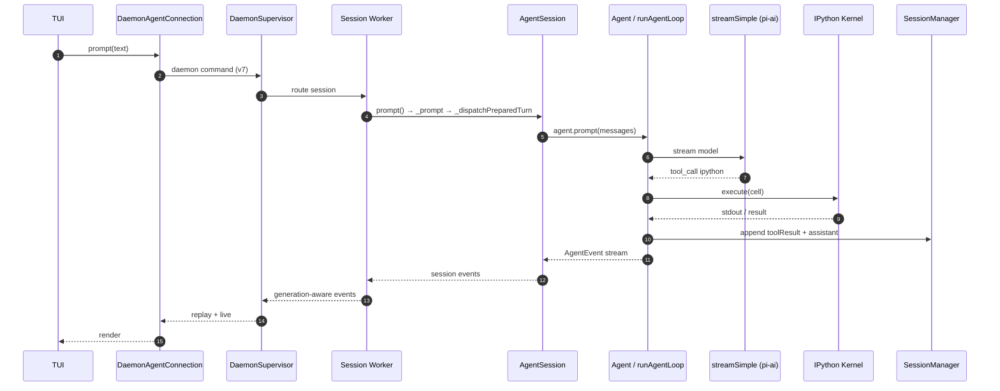

**调用链（文本）**：

```text
main.ts → ensureInteractiveDaemonRunning()
  → DaemonAgentConnection.prompt
  → worker: AgentSession.prompt (~L4374)
  → agent.runPromptMessages → runAgentLoop (agent-loop.ts L247)
  → executeToolCalls → ipython tool → KernelManager
```

---

## 7. 端到端时序 B：同 Session 第二问

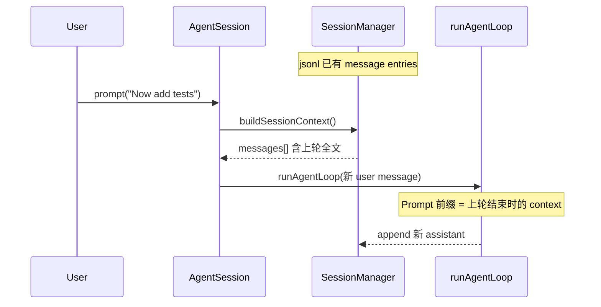

Compaction 若在上轮末触发，`buildSessionContext` 返回 **summary + 保留尾部**，而非全量历史。

---

## 8. 端到端时序 C：attach 断线重连

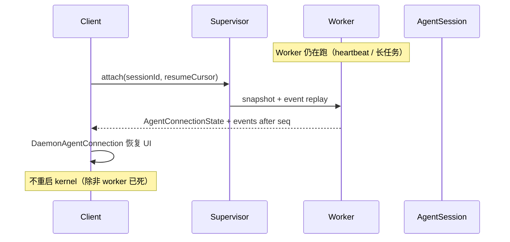

Worker 崩溃时 Supervisor 按 lease 恢复或标记 session 失败；孤儿状态见 `session-lease.ts`。

---

# 第三篇 模块深潜

## 9.1 Daemon 协议 v7

**文件**: `packages/coding-agent/src/modes/daemon/daemon-protocol.ts`

```52:54:prime-agent/packages/coding-agent/src/modes/daemon/daemon-protocol.ts
export const DAEMON_PROTOCOL_NAME = "prime-agent.daemon";
export const DAEMON_PROTOCOL_VERSION = 7;
export const DAEMON_COMMAND_ENVELOPE_MIN_PROTOCOL_VERSION = 7;
```

| 概念 | 说明 |
|------|------|
| 命令信封 | 客户端发 `command` + `id`；Worker 回 `response` 或 `event` |
| Capability 协商 | attach 时交换 server capabilities；新命令需 gate |
| Generation | 每次 prompt 递增；事件带 `generation` 防串流 |
| Schema revision | `DAEMON_SCHEMA_REVISION`（当前 20+）独立于 protocol version |

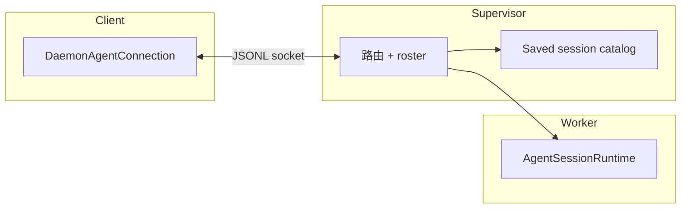

**主要命令族**（逻辑分组）：`prompt` / `steer` / `attach` / `detach` / `cancel` / `list_sessions` / `agent_message` 路由 / RLM 深度设置 / heartbeat 管理。

---

## 9.2 DaemonSupervisor 与 Session Worker

**文件**: `modes/daemon/daemon-supervisor.ts`、`daemon-mode.ts`

| 职责 | 说明 |
|------|------|
| 进程监护 | Worker 二进制帧协议（4-byte header + JSON） |
| 路由 | 将客户端 attach 到正确 worker |
| 跨 Agent 消息 | `agent-messages.ts` 投递到目标 session |
| 恢复 | snapshot + generation 事件重放 |

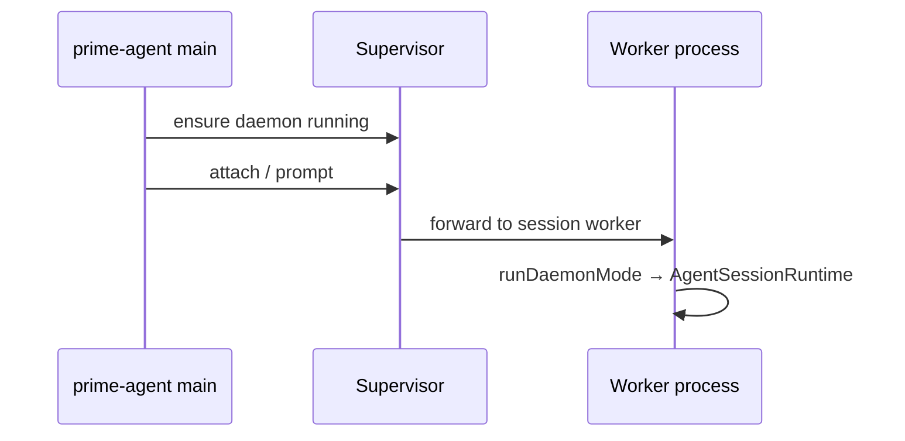

---

## 9.3 AgentConnection 客户端边界

**文件**: `modes/agent-connection/daemon-agent-connection.ts`、`in-process-agent-connection.ts`

| API | 作用 |
|-----|------|
| `prompt()` | 提交用户输入 |
| `attach()` | 绑定 session + 收事件流 |
| `steer()` | mid-turn 插入（映射 steering queue） |
| `getState()` | 快照：messages、queue、goals、RLM children |

**设计点**：TUI **不**直接持有 `AgentSession`；测试/SDK 可用 `InProcessAgentConnection` 跳过 Daemon。

---

## 9.4 AgentSession 编排层

**文件**: `core/agent-session.ts`（~11k LOC）

### 9.4.1 `prompt()` 阶段表

| 阶段 | 行为 |
|------|------|
| P1 | Session 输入泵 `_sessionInputPump` 串行化 |
| P2 | 构建 messages：`buildSessionContext` + 新 user |
| P3 | Extensions：`before_turn` hooks |
| P4 | `_dispatchPreparedTurn` → `agent.prompt` / `runAgentLoop` |
| P5 | 订阅 `AgentEvent` → `appendMessage` / compaction 触发 |
| P6 | Goals / autonomous 后续调度 |
| P7 | `turn` 结束事件广播给 Daemon |

### 9.4.2 输入泵与队列

| 队列 | 所有者 | 语义 |
|------|--------|------|
| `Agent.steeringQueue` | `packages/agent` | mid-turn 插入，loop 内 `pollMessages` |
| `Agent.followUpQueue` | 同上 | turn 结束后继续 |
| `ActionStore` | `AgentSession` | Session 级动作（非 feed 进 steer） |

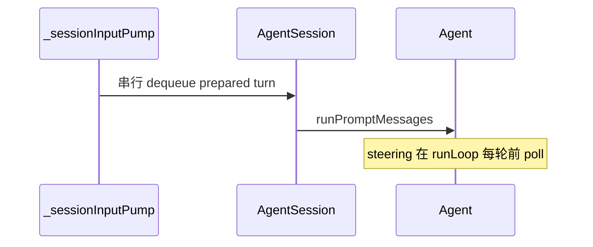

---

## 9.5 runAgentLoop（agent 包）

**文件**: `packages/agent/src/agent-loop.ts`

```247:269:prime-agent/packages/agent/src/agent-loop.ts
export async function runAgentLoop(
	prompts: AgentMessage[],
	context: AgentContext,
	config: AgentLoopConfig,
	emit: AgentEventSink,
	signal?: AbortSignal,
	streamFn?: StreamFn,
): Promise<AgentMessage[]> {
	// ...
	await emit({ type: "turn_start" });
	// ...
	await runLoop(currentContext, newMessages, config, signal, emit, streamFn);
	return newMessages;
}
```

### 9.5.1 `runLoop` 内层（L304+）

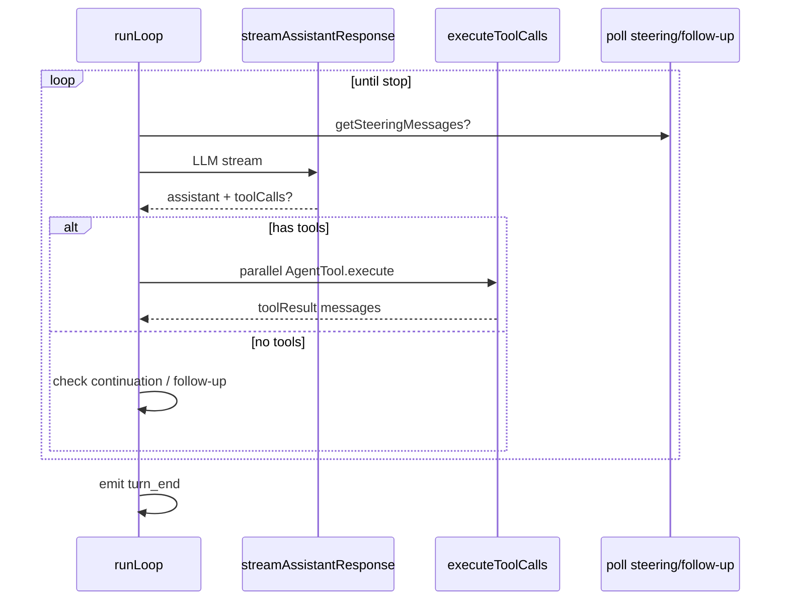

| 配置回调 | 用途 |
|----------|------|
| `getSteeringMessages` | 用户中途插入 |
| `getFollowUpMessages` | Turn 尾继续 |
| `getContinuationMessages` | 自动续写（overflow 等） |
| `shouldStopBeforeTurn` | autonomous 预算 |

---

## 9.6 KernelManager + IPython 工具

**文件**: `core/kernel/index.ts`、`core/tools/ipython.ts`

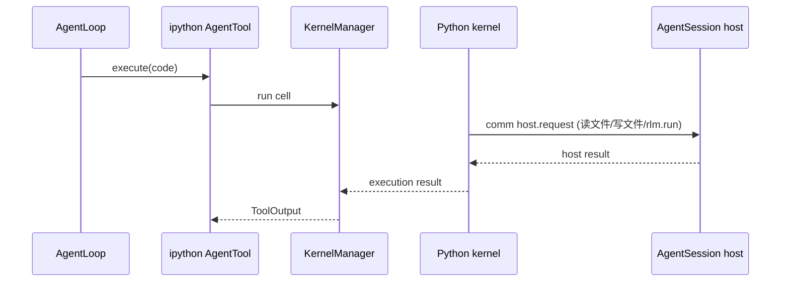

| Host request 类 | 处理方 |
|-----------------|--------|
| 文件读写 | AgentSession 授权路径 |
| `rlm.run` | `rlm-runtime.ts` → 子 runtime |
| MCP 调用 | 转 Python 侧 MCP 执行 |

**`prime-agent-runtime`**（Python）在 kernel 启动时注入 `rlm` 模块。

---

## 9.7 Provider 流（pi-ai）

**文件**: `packages/ai/src/stream.ts`

| 函数 | 作用 |
|------|------|
| `streamSimple` | 默认 `StreamFn`；按 model.provider 分发 |
| `stream` | 底层 SSE/WS 解析 → 统一 `AssistantMessageEvent` |

事件类型：`text`、`thinking`、`tool_call`、`usage`、`stop`。

---

## 9.8 RLM 子 Agent 运行时

**文件**: `core/rlm-runtime.ts`、`core/agent-session-runtime.ts`

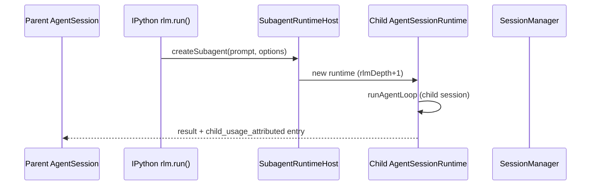

| 元数据 | 字段 |
|--------|------|
| 子 runtime | `metadata.kind = "subagent"` |
| 深度限制 | `SessionHeader.rlmDepth` / max depth 配置 |
| 并行 | 多个 `rlm.run` → 多个 child worker 内 runtime |

---

## 9.9 Compaction

**文件**: `core/compaction/compaction.ts`

| 函数 | 作用 |
|------|------|
| `shouldCompact` | token 估计 vs `reserveTokens` |
| `compact` | 调 LLM 生成 summary |
| `DEFAULT_COMPACTION_SETTINGS` | `reserveTokens: 16384`, `keepRecentTokens: 20000` |

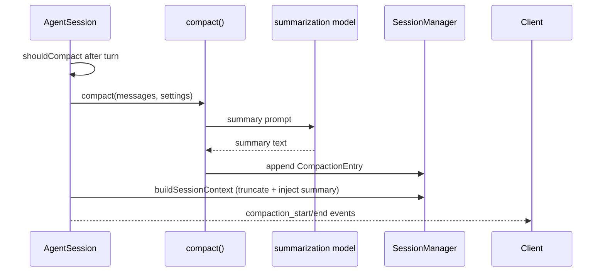

`CompactionEntry.firstKeptEntryId`：**该 id 之后**的 entry 保留；之前由 summary 代表。

---

## 9.10 Goals / Autonomous / Cron

| 模块 | 文件 | 行为 |
|------|------|------|
| Goals | `goals.ts` | `/goal` 状态存 `custom` entry；跨 turn 追踪 |
| Autonomous | `autonomous.js` | 预算内自动 follow-up |
| Cron / Heartbeat | `cron-jobs.ts` | 定时 `prompt` 重新进入 session 队列 |

均复用 **同一** `AgentSession.prompt` 路径，仅 `InputSource` 不同。

---

## 9.11 Extensions / Skills / MCP

| 层 | 文件 | 说明 |
|----|------|------|
| Extensions | `extensions/runner.ts` | turn/tool/compaction 钩子 |
| Skills | `skills.ts` | 可 import 的 Python 包 |
| MCP | `mcp/mcp-manager.ts` + `pi-ai/mcp.ts` | TS 侧 OAuth/catalog；**执行在 kernel Python** |

---

## 9.12 Harness / Refinement

**文件**: `core/refinement/refinement.ts`

Continual Harness：补充 prompt、memory 描述、skill 描述、subagent spec——经 `/refine` 小步证据化更新，**不**改写不可变 base system prompt。状态在 harness 目录 + session `custom` entries。

## 9.13 SessionManager 写路径深潜

**文件**: `core/session-manager.ts` — `export class SessionManager`（L1102+）

| 方法 | 返回 | 副作用 |
|------|------|--------|
| `newSession(options?)` | session file path | 写 `SessionHeader` 行 |
| `appendMessage(msg)` | entry id | `_persist` message entry |
| `appendCompaction(...)` | entry id | `type: compaction` |
| `branch(fromId)` | new leaf id | 新分支 parentId |
| `buildSessionContext()` | `SessionContext` | 纯函数；读 entries |
| `getTree()` | `SessionTreeNode[]` | UI `/tree` |
| `flushNow()` | void | 强制刷盘 |

`ReadonlySessionManager` — attach 快照只读子集，防止 UI 误写。

---

## 9.14 Daemon 命令处理链

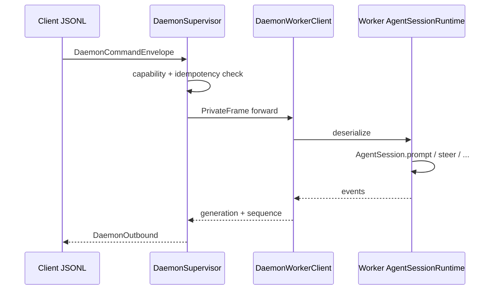

**Mutating 命令**（`isDaemonMutatingCommand`）：须 drain 或 journal（`command-recovery-journal.ts`）以防 supervisor 崩溃中间态。

---

## 9.15 `Agent` 类方法速查

**文件**: `packages/agent/src/agent.ts`

| 方法 | 说明 |
|------|------|
| `prompt(message)` | 入队并启动 `runAgentLoop` |
| `steer(message)` | `steeringQueue.enqueue` |
| `followUp(message)` | `followUpQueue.enqueue` |
| `abort()` | 中止当前 `AbortController` |
| `waitForIdle()` | Promise 在 loop 空闲 resolve |
| `subscribe(listener)` | `AgentEvent` 流 |
| `reset()` | 清空 state（测试） |

---

# 第四篇 JSON 实例

## 10. 对象实例示例

### 10.1 Session jsonl 头与 message 行

```json
{"type":"session","version":3,"id":"a1b2c3d4-...","timestamp":"2026-09-01T08:00:00.000Z","cwd":"/home/user/project"}
{"type":"message","id":"entry-001","parentId":null,"timestamp":"...","message":{"role":"user","content":"List files in src"}}
{"type":"message","id":"entry-002","parentId":"entry-001","timestamp":"...","message":{"role":"assistant","content":[{"type":"text","text":"I'll inspect src."}],"toolCalls":[{"id":"call_1","name":"ipython","arguments":"{\"code\":\"import os; os.listdir('src')\"}"}]}}
```

### 10.2 Compaction entry

```json
{
  "type": "compaction",
  "id": "entry-050",
  "parentId": "entry-049",
  "timestamp": "...",
  "summary": "User asked to refactor auth module; we renamed JwtService and added tests.",
  "firstKeptEntryId": "entry-040",
  "tokensBefore": 98500
}
```

### 10.3 Daemon prompt 命令（逻辑）

```json
{
  "type": "command",
  "id": "cmd-7",
  "command": "prompt",
  "sessionId": "a1b2c3d4-...",
  "payload": {
    "message": {"role": "user", "content": "Continue the refactor"}
  }
}
```

### 10.4 Daemon 流式事件信封

```json
{
  "type": "event",
  "generation": 3,
  "sequence": 42,
  "event": {
    "type": "message_end",
    "message": {"role": "assistant", "content": "Done.", "stopReason": "stop"}
  }
}
```

### 10.5 IPython host request（kernel → TS）

```json
{
  "target": "host.request",
  "request": {
    "type": "rlm.run",
    "prompt": "Research CVE-2024-xxxx in parallel",
    "options": {"timeout": 300000}
  }
}
```

### 10.6 Worker 私有帧（概念 — 非客户端协议）

```json
{
  "header": { "length": 512, "type": "forward_command" },
  "body": {
    "commandId": "cmd-worker-1",
    "daemonCommand": { "type": "prompt", "activeSessionId": "...", "message": "..." }
  }
}
```

### 10.7 `SessionHeader` + `rlmDepth`

```json
{
  "type": "session",
  "version": 3,
  "id": "0195a1b2-c3d4-7e8f-9abc-def012345678",
  "timestamp": "2026-09-01T12:00:00.000Z",
  "cwd": "/home/user/project",
  "rlmDepth": 1,
  "parentSession": "0195a1b2-parent-..."
}
```

---

返回 [文档中心](./README.md)
