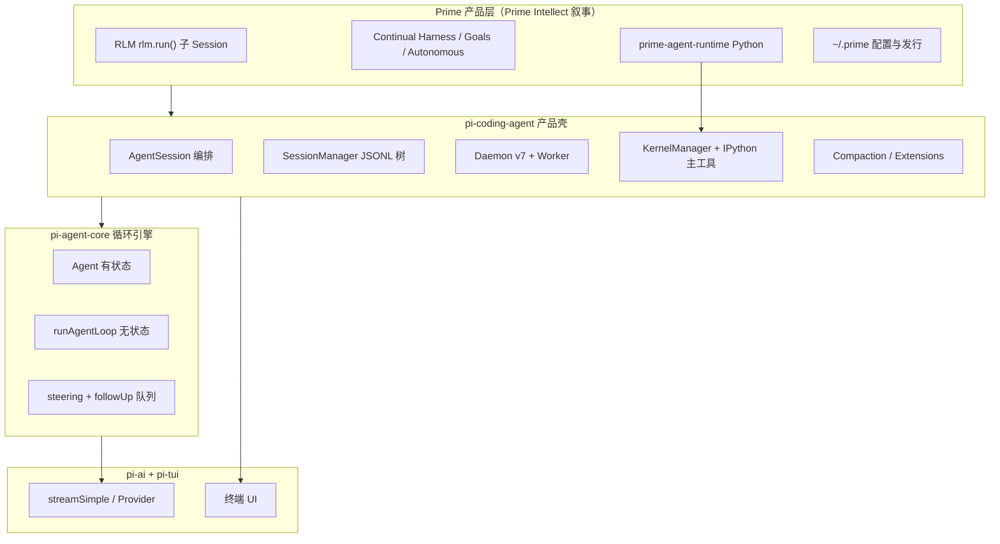
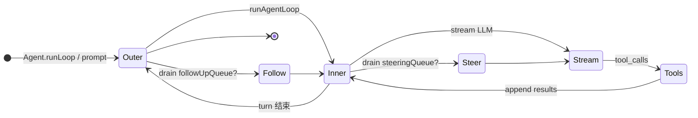

# Pi 与 Prime Agent：是什么关系？Prime 封装了什么？

> **主架构图（Pi 栈 + 🟧 Prime 封装层）**：[pi-architecture/PI_STACK_ARCHITECTURE.md](../pi-architecture/PI_STACK_ARCHITECTURE.md)  
> **读本文要解决的问题**：两个名字不是两个无关项目；也不是「Prime = Pi 套壳改名」。  
> **一句话**：**Pi = 可复用的 Agent 循环与类型栈（`pi-*` 包）**；**Prime = 在同一 monorepo 里把这套栈做成长期运行的 RLM 编码产品（Daemon + IPython + JSONL + RLM）**。

---

## 1. 先分清三个名字

| 名字 | 指什么 | 别混淆 |
|------|--------|--------|
| **Pi（设计轴）** | 双环 Agent、`steeringQueue` / `followUpQueue`、`runAgentLoop`、JSONL Session 树 | 跨项目对照里的「Pi 列」（见 [CROSS_AGENT_CONCEPT_MAP](../agent-doc-template/CROSS_AGENT_CONCEPT_MAP.md)） |
| **Pi（代码轴）** | npm 包族 `@earendil-works/pi-tui` / `pi-ai` / `pi-agent-core` / `pi-coding-agent` | 都在 **`prime-agent` 仓库**里 |
| **Prime Agent（产品）** | Prime Intellect 发行的 **RLM + Continual Harness** 编码 Agent | GitHub `PrimeIntellect-ai/prime-agent`；配置默认 `~/.prime/agent/` |

**关系**：Prime **不是**在外部再依赖一个别的「Pi 仓库」那么简单——**Prime 的 monorepo 就是把 Pi 分层拆开，最上面加 Prime 产品语义**。

→ **完整分层图（推荐）**：[pi-architecture/PI_STACK_ARCHITECTURE.md](../pi-architecture/PI_STACK_ARCHITECTURE.md)（L0–L4 + 封装边界 + 数据流）



---

## 2. 依赖方向（monorepo 真源）

```text
pi-tui
  ↑
pi-ai          ← Message、Provider、streamSimple
  ↑
pi-agent-core  ← Agent、runAgentLoop（故意无产品逻辑）
  ↑
pi-coding-agent ← CLI、Daemon、AgentSession、Kernel、RLM、Compaction
  ↑
prime-agent-runtime (Python) ← kernel 内 rlm 桥、harness 注入
```

构建顺序：`tui` → `ai` → `agent` → `coding-agent`。

| 包 | npm 名 | Agent 设计职责 |
|----|--------|----------------|
| `packages/ai` | `pi-ai` | **L0 协议**：User/Assistant/Tool 消息、流式采样 |
| `packages/agent` | `pi-agent-core` | **L1 循环**：`runAgentLoop` + 双队列 |
| `packages/coding-agent` | `pi-coding-agent` | **L2 产品**：持久化、进程、Kernel、子 Agent |
| `prime-agent-runtime` | Python | **L2.5 控制平面**：cell 里 `rlm.run()` |

---

## 3. Pi 心脏：`pi-agent-core` 到底管什么

**设计原则**（[PART1 §5](./ARCHITECTURE_PART1.md#第5章agentsession-与-agent-分工)）：**循环引擎不写盘、不知道 Daemon、不知道 IPython**。

### 3.1 双环（Pi 范式的核心）



| 环 | 函数/对象 | 状态 | 设计问题 |
|----|-----------|------|----------|
| **外环** | `Agent` + `runLoop` | `Agent.state.messages`（内存） | 这一轮结束后还要不要继续？ |
| **内环** | `runAgentLoop` → `runLoop` | 每次调用参数化（model、tools） | 这一次采样里 tool 怎么跑、何时 steer？ |

### 3.2 两条用户输入语义（Pi 对照轴的源头）

| 队列 | 时机 | 语义 | Prime 客户端 API |
|------|------|------|------------------|
| **`steeringQueue`** | **Turn 进行中**（内环每轮前 `getSteeringMessages`） | 插队改道，不结束当前 loop | Daemon `steer` |
| **`followUpQueue`** | **Turn 将结束** | 同一 Agent 再跑一轮 | 产品可配的 follow-up |

这与 Codex 的 steer / 队列、nanobot 的 inject **同族不同实现**——见 [CROSS_AGENT_CONCEPT_MAP](../agent-doc-template/CROSS_AGENT_CONCEPT_MAP.md)。

### 3.3 `pi-agent-core` **故意没有**

- JSONL / `SessionManager`
- `buildSessionContext` / compaction 节点
- Daemon / Worker / `generation`
- IPython / Kernel / host request
- `rlm.run()` 子 Session
- Goals、Autonomous、Harness 文件

这些全部在 **`pi-coding-agent`（Prime 产品壳）**。

---

## 4. Prime 在 Pi 之上封装了什么

把「Prime 封装」拆成 **6 个产品决策**，每个都对应可运行的架构，不是 marketing：

### 4.1 进程模型：客户端不跑 loop

```text
TUI/RPC/ACP → AgentConnection → DaemonSupervisor → Session Worker → AgentSession
```

| Pi 层只有 | Prime 加 |
|-----------|----------|
| 内存里的 `Agent` | **Worker 进程** 独占 Session + Kernel |
| 同进程 `prompt()` | **Daemon v7**：attach、generation、sequence 重放 |

→ [DESIGN_THINKING §4](./DESIGN_THINKING_SERIES.md#第-4-步daemon-v7--连接代次重放)

### 4.2 状态模型：JSONL 树是单账本

| Pi 层 | Prime 加 |
|-------|----------|
| `state.messages` 运行时数组 | **`SessionManager`** append-only JSONL 树 |
| — | **`buildSessionContext()`** 每次 prompt 折叠 compaction |
| — | Turn **只有** `turn_start`/`turn_end` 事件，**无 turn_id 落盘** |

→ [RUNTIME_AND_PERSISTENCE](./RUNTIME_AND_PERSISTENCE.md)

### 4.3 工具模型：IPython 是唯一主工具面

| 典型 ReAct（含 Pi 可配置多 tool） | Prime 产品选择 |
|-----------------------------------|----------------|
| bash / read / write / MCP 并列 schema | 模型 **主要只见 `ipython`** |
| 副作用在 tool 层 | 副作用在 **cell → host.request → TS** |

**设计意图**：上下文留在 Python 变量里；组合用代码；RLM 用 `rlm.run()` 像函数调用。

→ [PART2 §1](./ARCHITECTURE_PART2.md#第1章ipython-作为主工具--设计哲学)

### 4.4 执行平面：Kernel + Python runtime

| Pi 层 | Prime 加 |
|-------|----------|
| `AgentTool.execute` 在 TS | **`KernelManager`** + Jupyter ZMQ |
| — | **`prime-agent-runtime`** 注入 `rlm` 模块 |
| — | **Host request** 特权 IO 回 `AgentSession` |

### 4.5 多 Agent：RLM 不是 steer

| 机制 | 层级 | 语义 |
|------|------|------|
| **steer** | `pi-agent-core` 队列 | 同一 Session、同一 loop **插队** |
| **`rlm.run()`** | `coding-agent` + Python | **子 Session**、独立 JSONL 分支、编程式 spawn |

Prime 的「子 Agent」是 **RLM 子 Session**，不是 Pi 外环里再挂一个 `Agent` 实例那么简单。

→ [DESIGN_THINKING §7](./DESIGN_THINKING_SERIES.md#第-7-步steer-vs-新-prompt-vs-rlm)

### 4.6 长期运行：Harness / Goals / Autonomous

| 组件 | 作用 |
|------|------|
| **Continual Harness** | 跨 Turn 可精炼状态（`/refine`、registers） |
| **Goals** | 目标状态机，驱动后续 prompt |
| **Autonomous** | 无人值守调度 |
| **Compaction** | JSONL 上 `type: compaction` 节点，不删历史 |

均在 **`AgentSession`**，不在 `pi-agent-core`。

---

## 5. 对照表：`Agent` vs `AgentSession`（一张表看懂封装边界）

| 维度 | `Agent`（**Pi / pi-agent-core**） | `AgentSession`（**Prime / pi-coding-agent**） |
|------|-----------------------------------|-----------------------------------------------|
| **角色** | 无状态循环引擎的「有状态把手」 | 产品编排 + 持久化 |
| **消息** | `state.messages` 内存 | `SessionManager` → JSONL |
| **循环** | `runAgentLoop` | 调用 loop + 订阅事件 `appendMessage` |
| **Steer / Follow-up** | 队列在 `Agent` | Daemon `steer` 注入队列 |
| **工具** | `AgentTool.execute` | 配 Kernel、Extensions 包一层 IPython |
| **压缩** | 无 | auto-compact、`CompactionEntry` |
| **子 Agent** | 无 | `rlm-runtime` + 子 Worker |
| **System prompt** | `context.systemPrompt` | Harness + base instructions |
| **客户端** | 直接 `agent.prompt()`（SDK/测试） | 经 `AgentConnection` / Daemon |

**SDK 嵌入**：可以 **只用 `pi-agent-core` + `pi-ai`** 做别的产品（PART3 写明的设计目标）；**Prime 默认路径**是全套 `coding-agent` + Daemon。

---

## 6. 和文档里其它「Pi」说法怎么对齐

| 说法 | 含义 |
|------|------|
| [HARNESS-SPECTRUM](../../OpenHarness/docs/framework-comparison/HARNESS-SPECTRUM.md) 里 **Pi** 与 **Prime** 两行 | **设计谱系**对照：Pi 强调双环+JSONL；Prime 强调 Daemon+IPython+`rlm.run` |
| [CROSS_AGENT_DESIGN_INDEX](../CROSS_AGENT_DESIGN_INDEX.md) 里单独的 **Pi** 导读链接 | 常指 **上游/平行** 的 Pi 图解与仓库（`pi/docs`）；与 **prime-agent 内的 pi-* 包** 同族 |
| 本仓库 `docs/prime-agent-architecture/` | 分析对象是 **Prime 发行 monorepo**，底层循环与 Pi 包 **同源** |

若只看到 Prime 文档而不知道 Pi 层：**会以为一切都是 Daemon+IPython**；实际上 **steering、双环、runAgentLoop** 是 **Pi 心脏**，Prime 是在上面加了 **进程、持久化、RLM、Harness**。

---

## 7. 30 秒记忆

```text
Pi（pi-agent-core）  = 怎么转：stream → tool → steer → 再 stream
Prime（coding-agent）= 在哪转：Worker 里、JSONL 记下、IPython 里写代码、rlm _spawn 子会话
Prime（产品）        = 为什么这样：长期 coding、可断开重连、可编程子 Agent
```

---

## 8. 延伸阅读

| 主题 | 文档 |
|------|------|
| Prime 九步图解 | [DESIGN_THINKING_SERIES.md](./DESIGN_THINKING_SERIES.md) |
| runAgentLoop 四层 | [ARCHITECTURE_PART1 §7](./ARCHITECTURE_PART1.md) |
| IPython / RLM | [ARCHITECTURE_PART2](./ARCHITECTURE_PART2.md) |
| 跨项目 steer 对照 | [CROSS_AGENT_CONCEPT_MAP.md](../agent-doc-template/CROSS_AGENT_CONCEPT_MAP.md) |
