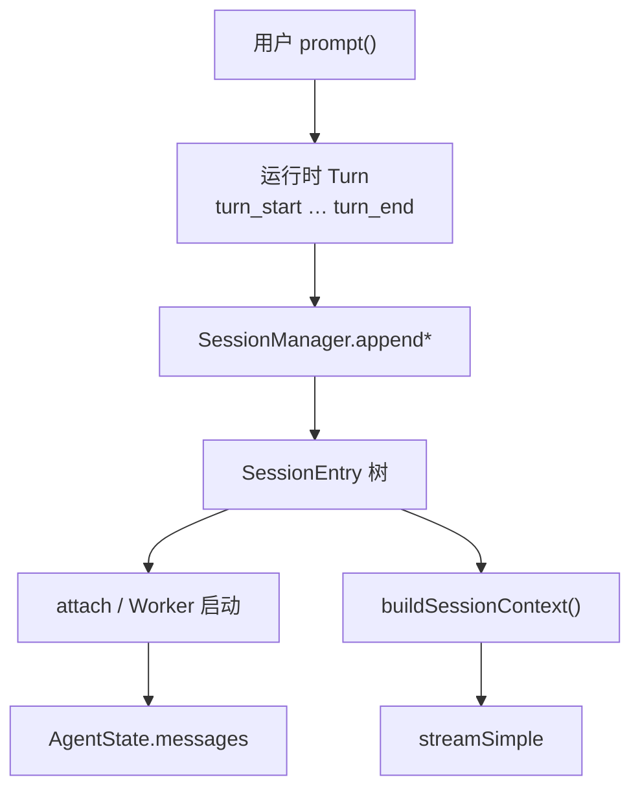
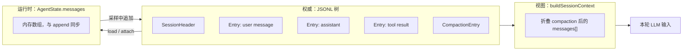
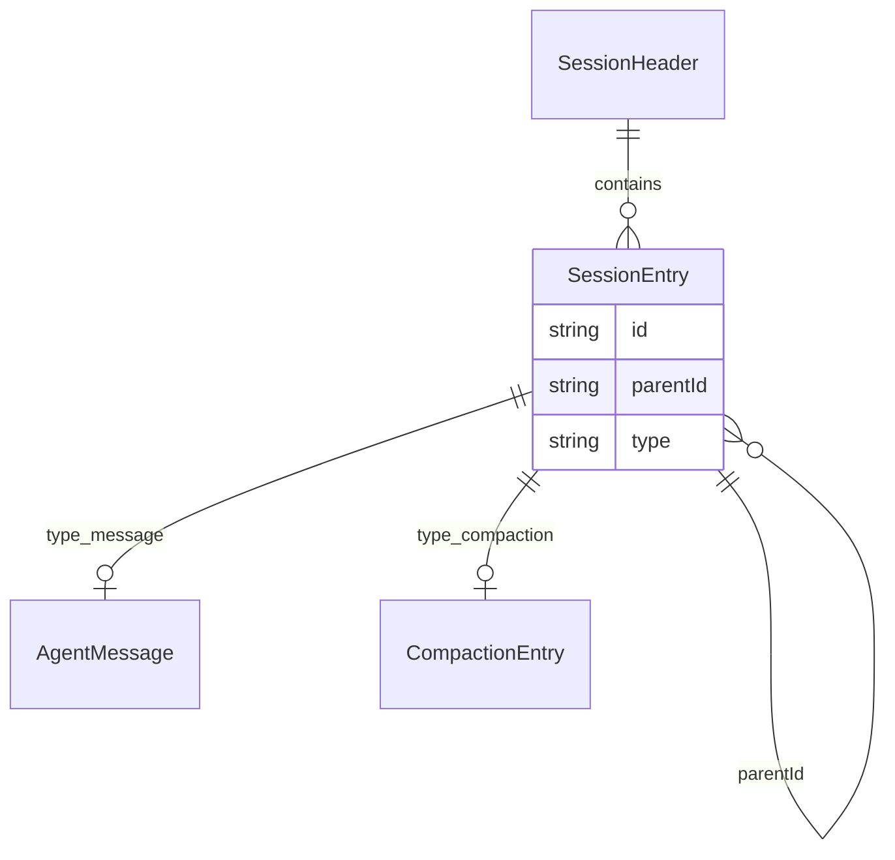
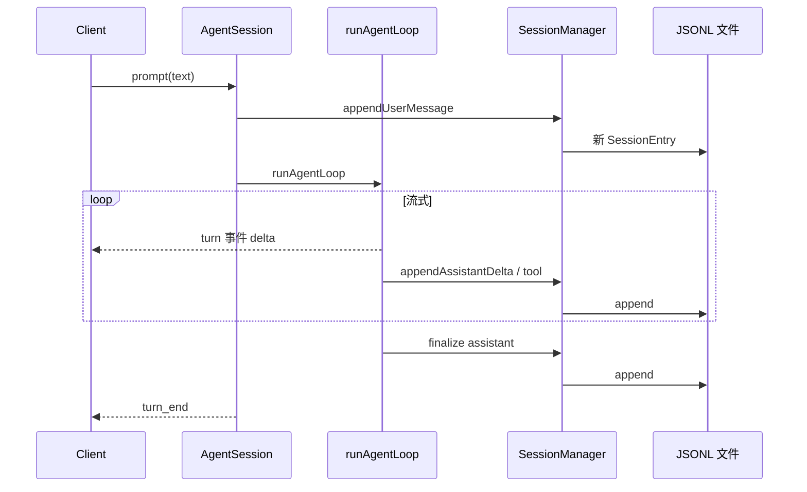
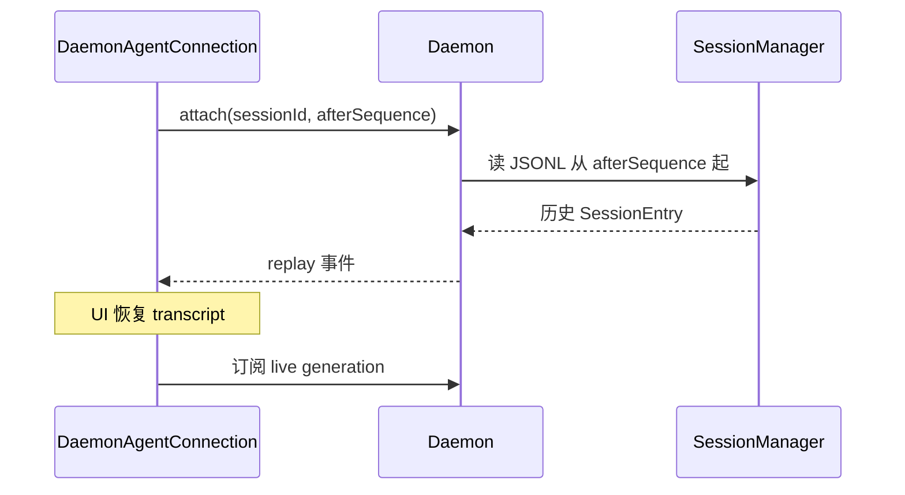
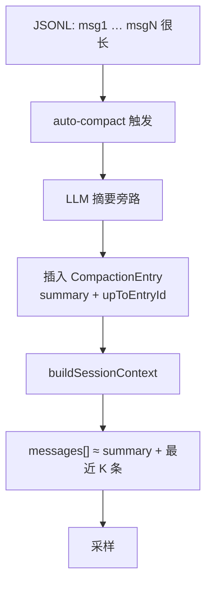
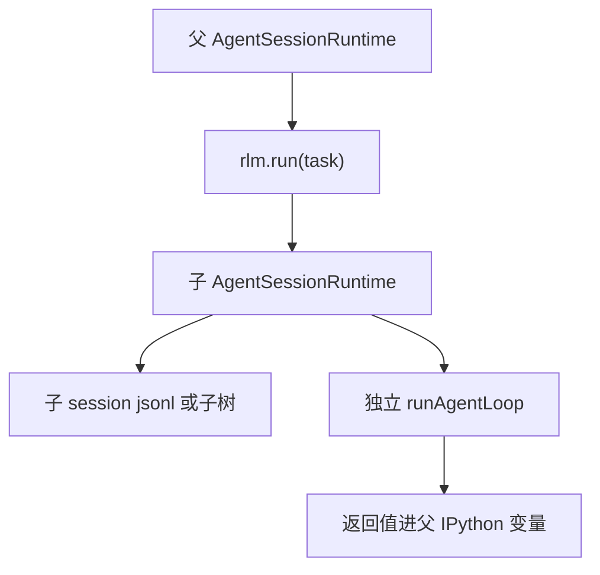

# Prime Agent 运行时与持久化导读

> **定位**：讲清 **Turn 事件、JSONL 树、buildSessionContext、运行时 messages** 四者如何协作。  
> **阅读时间**：~15 分钟  
> **循序渐进**：[DESIGN_THINKING_SERIES.md §6、§8](./DESIGN_THINKING_SERIES.md)  
> **深潜**：[PART1 §6](./ARCHITECTURE_PART1.md#第6章turn-与-message-三层模型) · [PART3 §3](./ARCHITECTURE_PART3.md) · [ENTITY §1、§3](./ENTITY_AND_SEQUENCES.md)

---

## 1. 一句话

Prime 的 **Turn 不落盘**（只有 `turn_start` / `turn_end` 运行时事件）；**真正持久化的是 SessionEntry 树**；发给 LLM 的是 **`buildSessionContext()` 每次折叠 compaction 后现算的 messages[]**——三者 **不同构**。

---

## 2. 为什么 Turn 没有 ID

| 需求 | 设计选择 |
|------|----------|
| UI 要流式 | 运行时 Turn 事件足够 |
| 历史要可分支 | JSONL **树**（`parentId`）比 Turn 表灵活 |
| Resume / attach | 重放 JSONL + 续订 live |
| Compaction | 在树上插 `CompactionEntry` 节点 |

**易错**：在 TUI 里看到「一轮对话」≠ 磁盘上有一行 `Turn` 记录。

---

## 3. 两层「真相」+ 一层「视图」

| 层 | 角色 | 类比 DeepTutor |
|----|------|----------------|
| JSONL 树 | 审计 + 分支 + compact 标记 | `turn_events` + `messages` 合体 |
| AgentState.messages | Worker 内工作集 | `ContextManager` 运行时 |
| buildSessionContext | 压缩后 prompt 视图 | `ContextBuilder` 产出 |

---

## 4. SessionEntry 树结构

| 节点类型 | 含义 |
|----------|------|
| `message` | user / assistant / tool 一条 |
| `compaction` | 摘要替换点前缀；`buildSessionContext` 跳过被压段 |
| `parentId` | 分支、regenerate、fork 的基础 |

**设计原因**：单账本 append-only，避免 Codex 式「EventMsg 与 ResponseItem 双写同步」复杂度；代价是 UI 专事件要从 JSONL **投影**。

---

## 5. 一次 prompt 的持久化时序

---

## 6. attach 与断线重连

| 场景 | 行为 |
|------|------|
| TUI 崩溃重启 | attach + 重放 |
| 另一客户端旁观 | 同 session attach |
| Worker 已退出 | Daemon 按需 respawn Worker |

---

## 7. Compaction 如何改变 prompt

| 阶段 | JSONL | LLM 所见 |
|------|-------|----------|
| compact 前 | 全量 message 链 | 全量（或 token 超限） |
| compact 后 | 原链 **保留** + compaction 节点 | 摘要 + 尾部窗口 |

**与 Codex**：Codex 用 `Compacted` Rollout 检查点替换 `ContextManager` 窗口；Prime 在 **同一 JSONL 树** 上打标记，由 `buildSessionContext` 解释。

---

## 8. RLM 子 Session 持久化

| | 父 Session | 子 Session |
|--|------------|------------|
| JSONL | 主文件 | 独立 id / 关联元数据 |
| Kernel | 默认独立 | 可选共享（配置） |
| Daemon 事件 | 父 generation | 子 worker 可选隔离 |

---

## 9. 心智模型（五句）

1. **JSONL 树是权威** — 一切 resume / compact / 分支的基础。  
2. **Turn 是 UI 节拍** — 帮助流式，不是存储单元。  
3. **AgentState.messages 是 Worker 工作内存** — 与 append 同步。  
4. **buildSessionContext 是 LLM 滤镜** — compaction 在这里生效。  
5. **单账本** — 不像 Codex 分 Rollout / EventMsg / ContextManager。

---

## 相关文档

| 文档 | 内容 |
|------|------|
| [DESIGN_THINKING_SERIES.md](./DESIGN_THINKING_SERIES.md) | 总路径 |
| [CORE_RUNTIME_WALKTHROUGH.md](./CORE_RUNTIME_WALKTHROUGH.md) | 实例走查 |
| [PART3 buildSessionContext](./ARCHITECTURE_PART3.md) | 重建算法深潜 |
