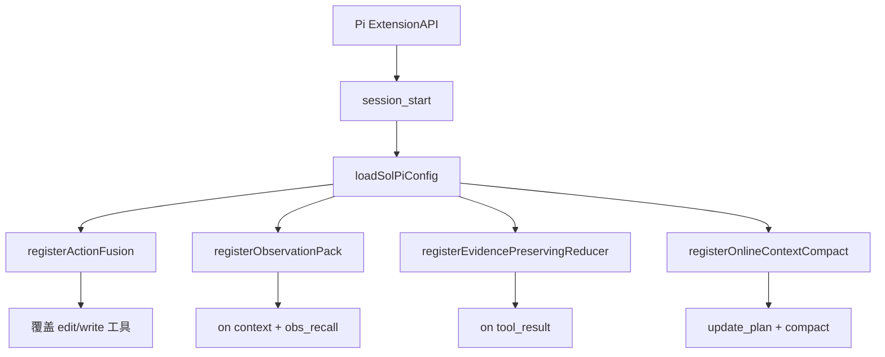

# SoL-Pi 设计思想导读（九幕）

> **深潜**：[ARCHITECTURE.md](./ARCHITECTURE.md)  
> **源码**: `SoL-Pi/src/sol-pi/` · **宿主**: `pi/packages/coding-agent`

---

## 第 1 幕：源码全景

**一句话**：一个 `ExtensionFactory`，在 `session_start` 时按 `sol-pi.json` 注册 0–4 个机制。

```text
SoL-Pi/src/sol-pi/
├── index.ts                 createSolPiExtension / registerConfiguredFeatures
├── config.ts                SolPiConfig · 查找 .pi/sol-pi.json
├── runtime-paths.ts         <sessionDir>/sol-pi/<sessionId>/
├── tui.ts                   节省提示渲染
└── extensions/
    ├── action-fusion/       替换 edit/write + then_run
    ├── observation-pack/    context 投影 + obs_recall
    ├── evidence-preserving-reducer/  tool_result → 可核验收据
    └── online-context-compact/      update_plan + 原生 compaction
```

**易错**：把 SoL-Pi 当成 fork 的 Pi。它 `import` 的是 `@earendil-works/pi-coding-agent` 公开 API，**不 vendor Pi 源码**。

---

## 第 2 幕：状态 vs 执行

| | 状态 | 执行 |
|--|------|------|
| **Pi** | Session JSONL、模型、shell | Agent loop / 工具执行 |
| **SoL-Pi** | session 下的 archive / ledger / journal / online state | 钩子与替换工具 |

**校正**：循环、鉴权、主模型仍是 Pi。SoL-Pi 只改 **工具形状** 和 **送给模型的投影**。

---

## 第 3 幕：双层循环（宿主 + 钩子）

```text
Pi 外层 session
  └── Pi 内层 turn：模型 → 工具 → 观察 → 再模型
        Action Fusion: edit/write 内嵌 then_run，少一次模型决策
        Reducer: tool_result 钩子，长日志 → 收据（失败则原文）
        ObservationPack: pi.on("context") 投影，不改磁盘历史
        Online Compact: 计划步完成 → 经济性检查 → Pi 原生 compaction
```

没有第五套 loop。Reducer 会另调 **一个** 配置好的小模型，那是侧路调用，不是第二 Agent。

---

## 第 4 幕：依赖与装配



项目 `.pi/sol-pi.json`（需 trusted）**整文件替换** 用户 `~/.pi/agent/sol-pi.json`，不 merge。

---

## 第 5 幕：工具管线（SoL-Pi 插入点）

```text
模型要 edit/write
  →（可选）Action Fusion：mutate + bash then_run → 一条 observation
模型要 bash 测/编
  → Pi 执行
  →（可选）Reducer：归档原文，小模型出收据，引用必须逐字节在归档中
之后每次拼 provider 请求
  →（可选）ObservationPack：大结果前 2 次全文，之后 placeholder + obs_recall
计划步 completed
  →（可选）Online Compact：decideCompaction → Pi compact → 新 turn 续跑
```

---

## 第 6 幕：事件流

| Pi 事件 | SoL-Pi |
|---------|--------|
| `session_start` | 只初始化一次，注册机制 |
| 工具 execute | Fusion 替换实现 |
| `tool_result` | Reducer |
| `context` | ObservationPack 投影（历史文件不动） |
| 自定义 `update_plan` | Compact 的边界输入 |
| TUI | `showSolPiSavings` |

---

## 第 7 幕：Steer vs Follow-up

SoL-Pi **不**实现 steer。用户插入、中断、审批全是 Pi 的。Compact 成功后用 `POST_COMPACTION_PLAN_REMINDER` 让模型在新 turn 里 `update_plan`。

---

## 第 8 幕：持久化账本

```text
<session-directory>/sol-pi/<session-id>/
├── observation-pack/
│   ├── ledger.jsonl
│   └── obs_*.txt          原文归档
└── evidence-preserving-reducer/
    ├── archive/
    └── journal            候选/成功/fallback
```

Online Compact 的状态条目写进 Pi session（`ONLINE_STATE_ENTRY`），resume 后 `restoreOnlineState`。

---

## 第 9 幕：核心 vs 边界

| 不碰 | 可扩展 |
|------|--------|
| Pi 鉴权、主模型、shell 后端 | 四开关、Reducer 供应商/模型、cacheWriteReadRatio |
| Session 历史字节（Pack 只投影） | 新机制：必须再走 ExtensionAPI，禁止 patch Pi |

→ [Part 1](./ARCHITECTURE_PART1.md)
