# SoL-Pi — Agent 模块级图集（细粒度）

> 源码根：`SoL-Pi/src/sol-pi/` · 与 [DIAGRAM_ATLAS.md](./DIAGRAM_ATLAS.md)（全局图）配套。
> **每个重要 Agent 相关模块**至少 1 张图；复杂模块含流程 + 时序/类图。

## 模块索引

| ID | 模块 | 源码锚点 | 图类型 |
|----|------|----------|--------|
| SP-01 | index.ts 扩展工厂 | `index.ts` | sequence |
| SP-02 | config.ts 校验 | `config.ts` | flowchart |
| SP-03 | action-fusion 注册 | `action-fusion/index.ts` | flowchart |
| SP-04 | file-queue 串行 | `file-queue.ts` | flowchart |
| SP-05 | then-run 执行 | `then-run.ts` | sequence |
| SP-06 | observation-pack context 钩 | `observation-pack/index.ts` | sequence |
| SP-07 | observation.ts CAS | `observation.ts` | flowchart |
| SP-08 | ledger.ts | `ledger.ts` | classDiagram |
| SP-09 | obs_recall 工具 | `observation-pack` | sequence |
| SP-10 | reducer candidate | `candidate.ts` | flowchart |
| SP-11 | receipt 校验 | `receipt.ts` | flowchart |
| SP-12 | archive + journal | `archive.ts journal.ts` | flowchart |
| SP-13 | reducer provider | `provider.ts` | sequence |
| SP-14 | online-compact extension | `extension.ts` | stateDiagram |
| SP-15 | economics.ts | `economics.ts` | flowchart |
| SP-16 | update_plan 工具 | `plan.ts tools.ts` | sequence |
| SP-17 | runtime-paths | `runtime-paths.ts` | flowchart |
| SP-18 | 四机制串联 | `全局` | sequence |
| SP-19 | tui.ts 渲染 | `tui.ts` | flowchart |
| SP-20 | 宿主事件总线 | `ExtensionAPI` | flowchart |

---

## SP-01 index.ts 扩展工厂

**源码**：`index.ts`

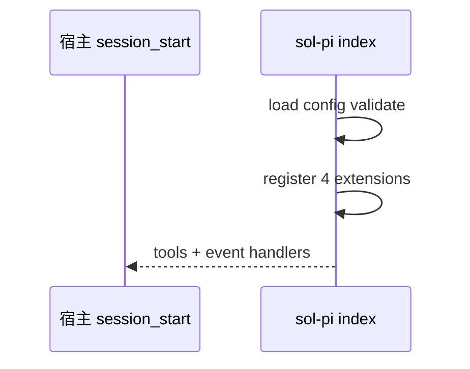

**读图**：session_start 只执行一次守卫。

---

## SP-02 config.ts 校验

**源码**：`config.ts`

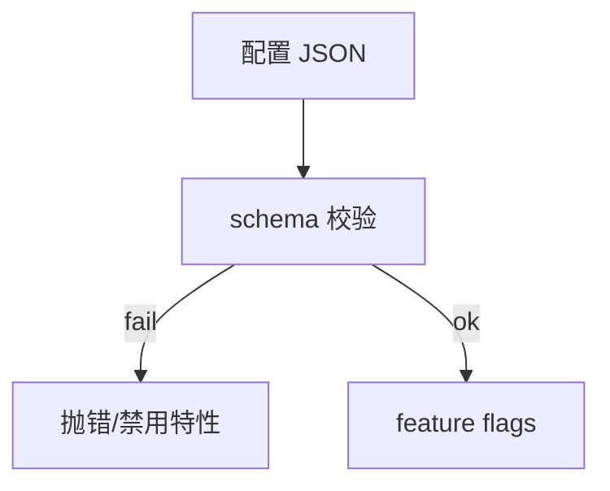

**读图**：fail closed on invalid。

---

## SP-03 action-fusion 注册

**源码**：`action-fusion/index.ts`

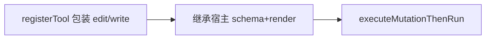

**读图**：then_run 追加参数。

---

## SP-04 file-queue 串行

**源码**：`file-queue.ts`

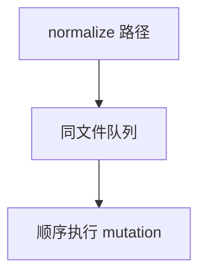

**读图**：防并发写同一文件。

---

## SP-05 then-run 执行

**源码**：`then-run.ts`

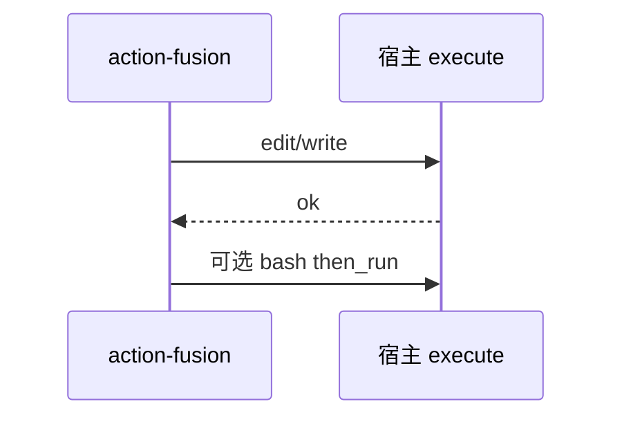

**读图**：SHA 可选防竞态。

---

## SP-06 observation-pack context 钩

**源码**：`observation-pack/index.ts`

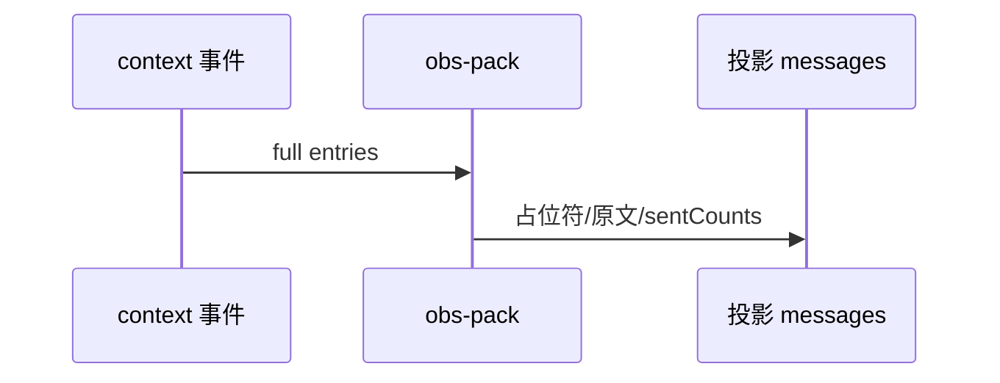

**读图**：磁盘 session 仍全文。

---

## SP-07 observation.ts CAS

**源码**：`observation.ts`

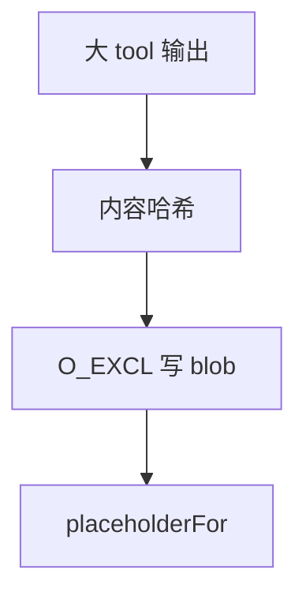

**读图**：收据前缀豁免打包。

---

## SP-08 ledger.ts

**源码**：`ledger.ts`

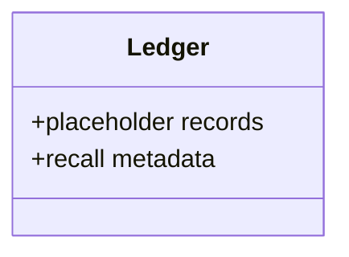

**读图**：三种记录类型。

---

## SP-09 obs_recall 工具

**源码**：`observation-pack`

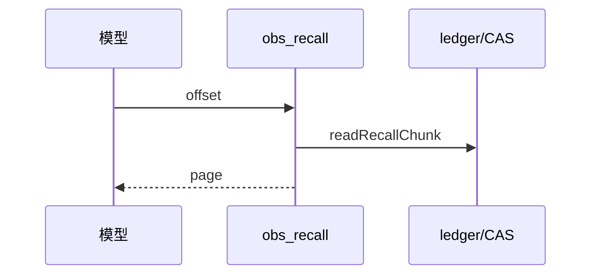

**读图**：分页召回。

---

## SP-10 reducer candidate

**源码**：`candidate.ts`

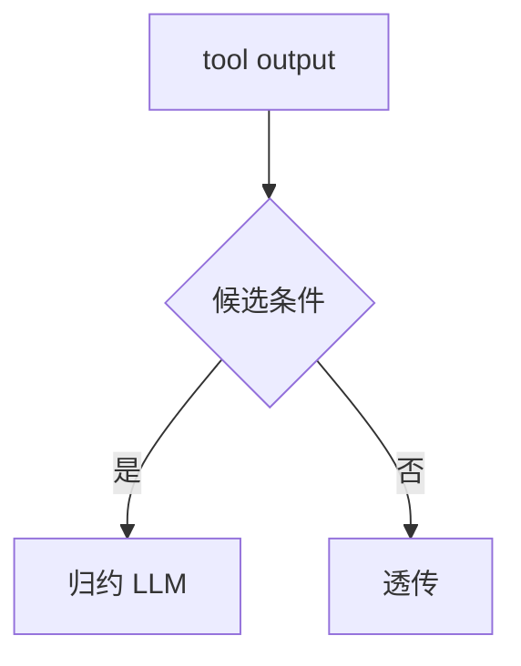

**读图**：体积与模式匹配。

---

## SP-11 receipt 校验

**源码**：`receipt.ts`

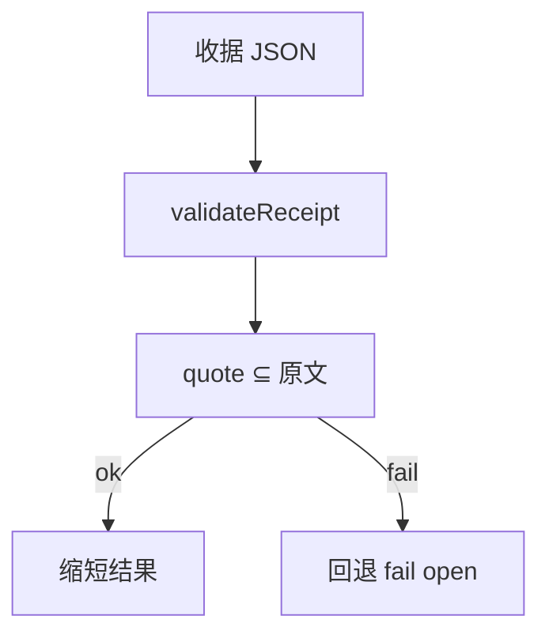

**读图**：防捏造引用。

---

## SP-12 archive + journal

**源码**：`archive.ts journal.ts`

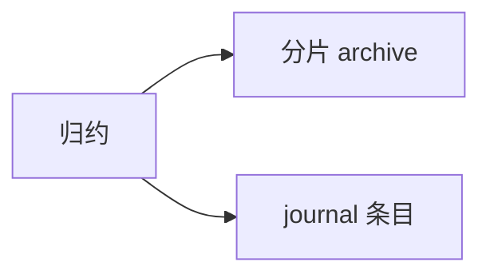

**读图**：可审计。

---

## SP-13 reducer provider

**源码**：`provider.ts`

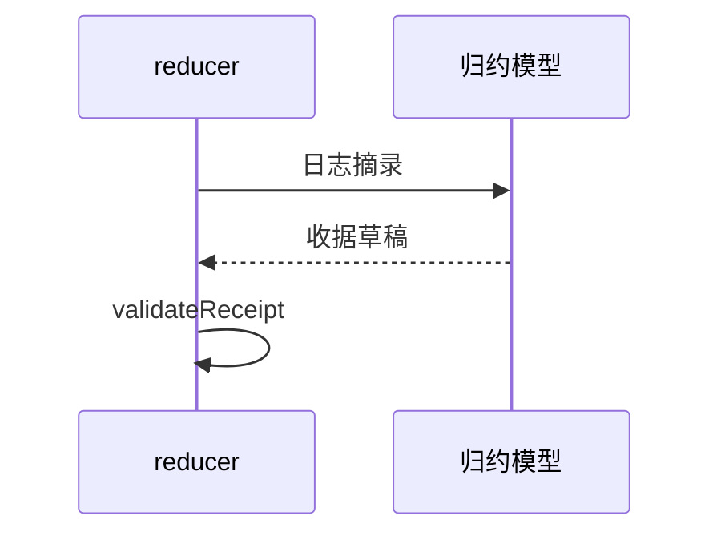

**读图**：可注入 provider。

---

## SP-14 online-compact extension

**源码**：`extension.ts`

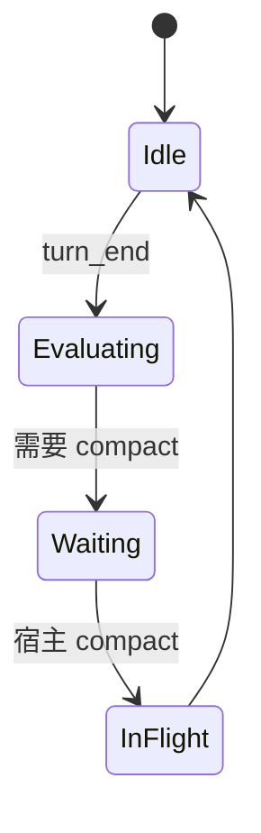

**读图**：compactionInFlight 防重入。

---

## SP-15 economics.ts

**源码**：`economics.ts`

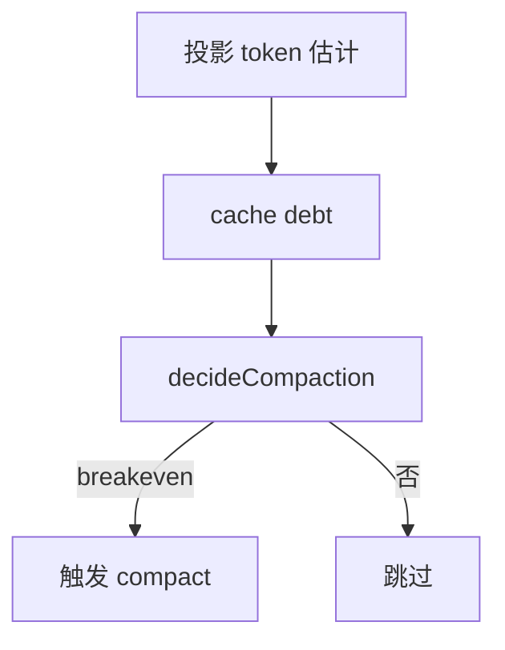

**读图**：首次宽容后续保守。

---

## SP-16 update_plan 工具

**源码**：`plan.ts tools.ts`

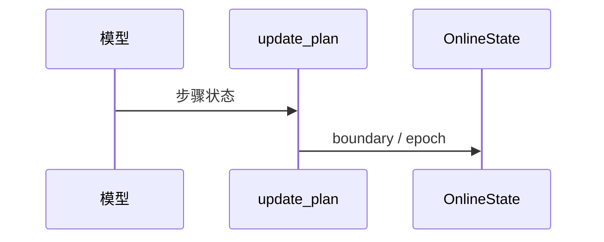

**读图**：CORRECTION 重置状态。

---

## SP-17 runtime-paths

**源码**：`runtime-paths.ts`


**读图**：会话级隔离。

---

## SP-18 四机制串联

**源码**：`全局`

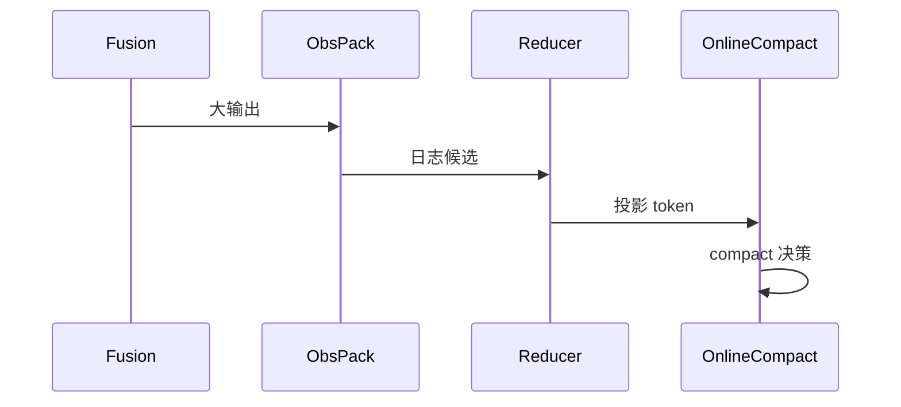

**读图**：机制可独立开关。

---

## SP-19 tui.ts 渲染

**源码**：`tui.ts`

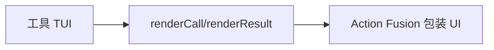

**读图**：then_run 时展示后续命令。

---

## SP-20 宿主事件总线

**源码**：`ExtensionAPI`

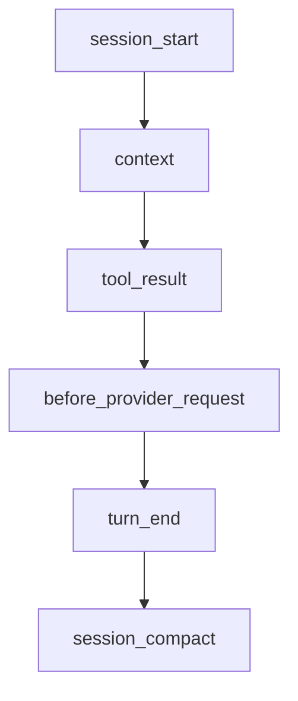

**读图**：SoL-Pi 在各事件挂接点。

---


# 附录 A — 扩展与宿主事件矩阵

```mermaid
flowchart LR
    subgraph Events
        C[context]
        TR[tool_result]
        BP[before_provider_request]
        TE[turn_end]
        SC[session_compact]
    end
    OP[observation-pack] --> C
    ER[reducer] --> TR
    OC[online-compact] --> TE
    OC --> SC
    AF[action-fusion] --> TR
```

**读图**：同一事件可能被多个机制订阅；顺序以宿主 dispatch 为准。
