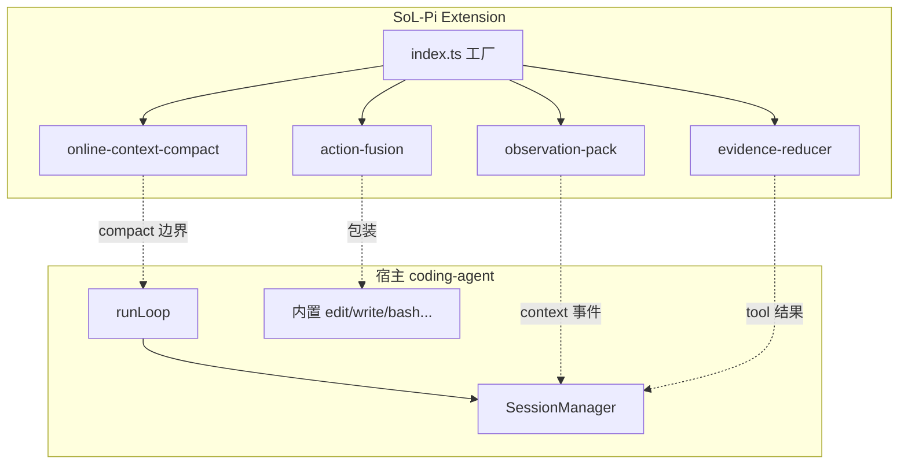
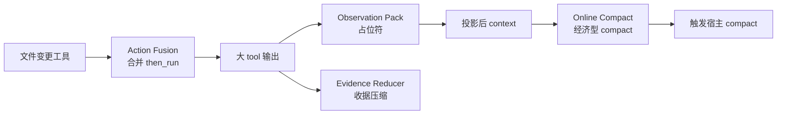
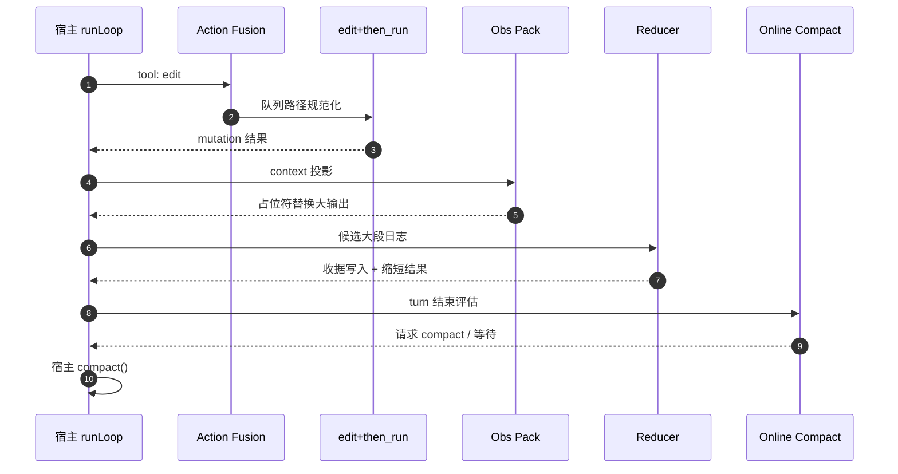
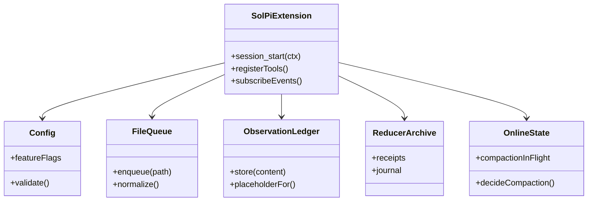
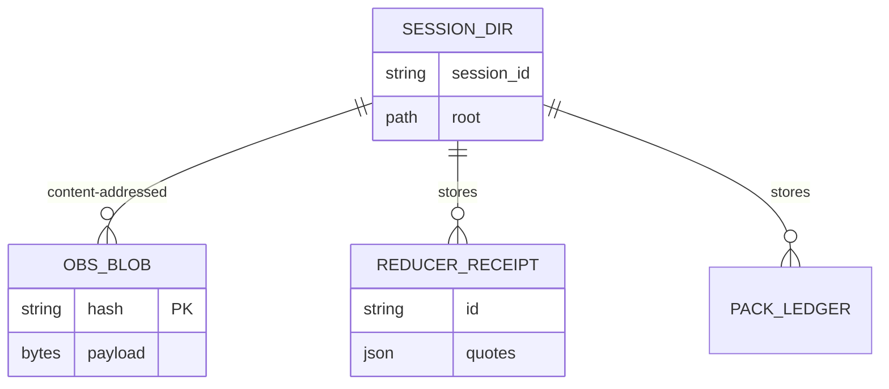
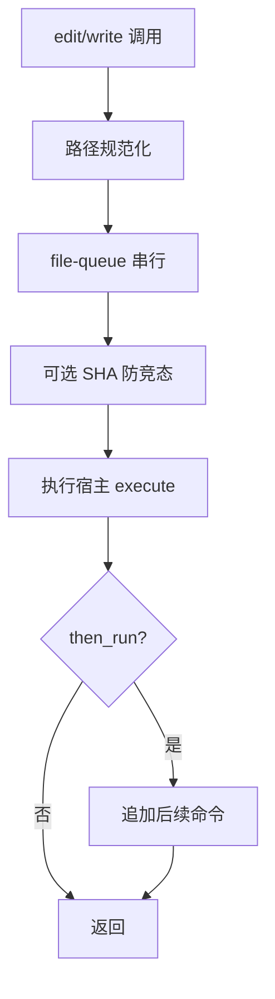
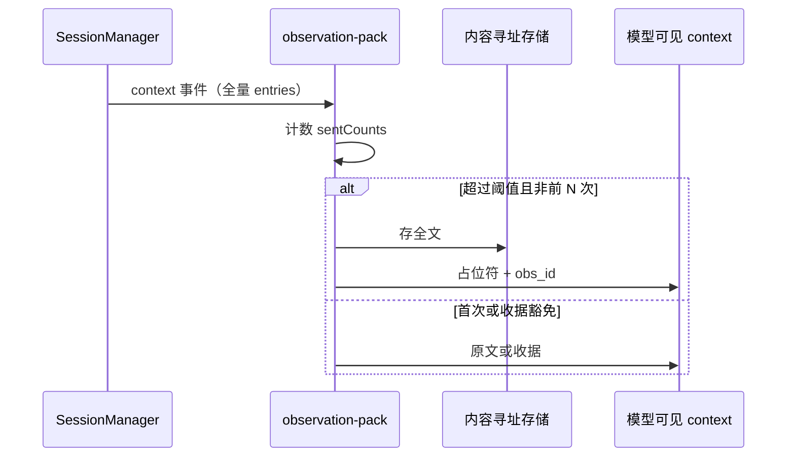
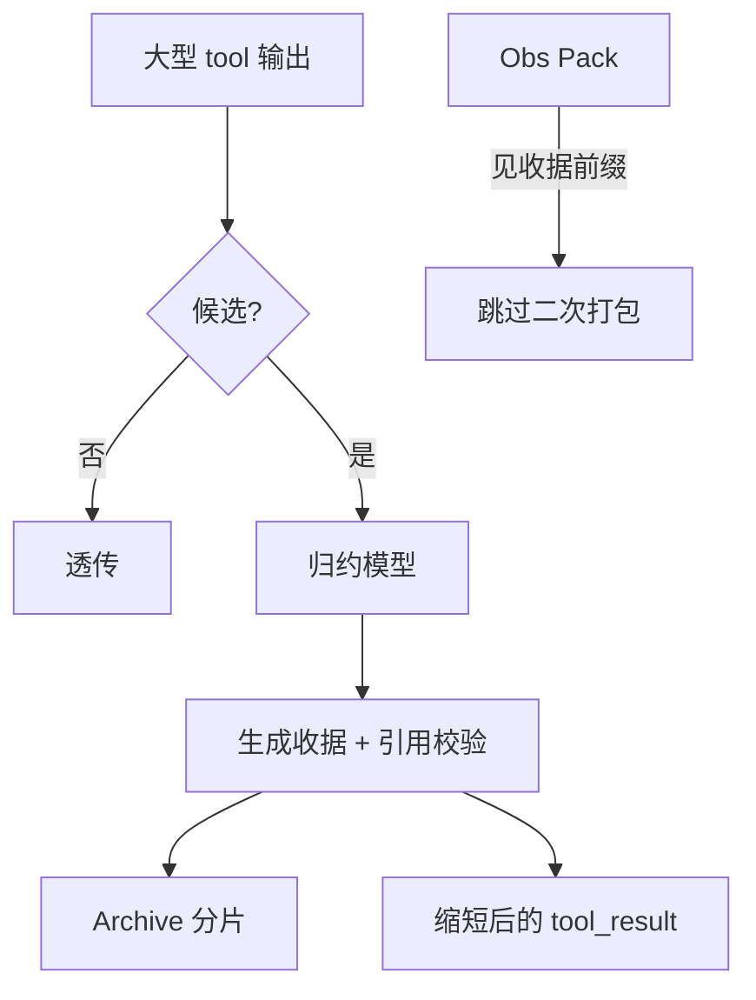
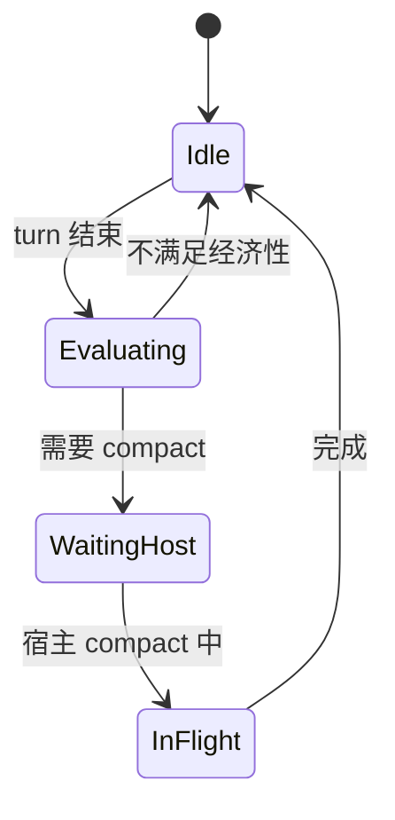
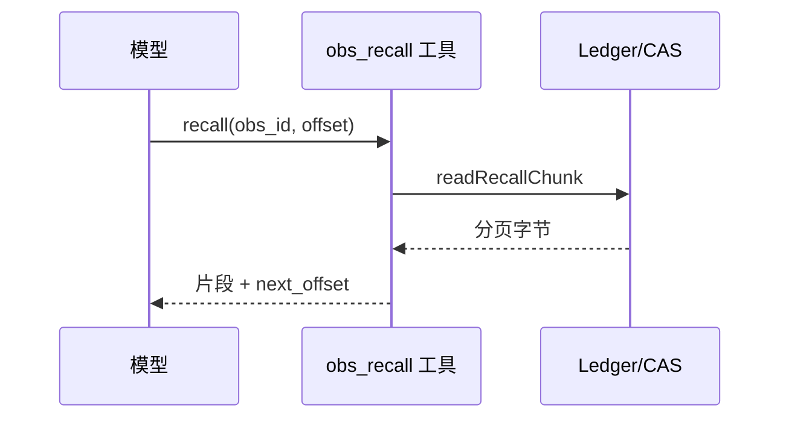

# SoL-Pi 架构图集（全局）

> 配套 [ARCHITECTURE.md](../ARCHITECTURE.md)。**模块级 SP-01…SP-20**：[AGENT_MODULE_DIAGRAMS.md](./AGENT_MODULE_DIAGRAMS.md)。  
> 源码：`SoL-Pi/src/sol-pi/`。

---

## 图目录

| 编号 | 类型 | 标题 |
|------|------|------|
| G1 | architecture | 宿主循环 vs 扩展边界 |
| G2 | flowchart | 四机制总览 |
| G3 | sequence | 四机制全开 E2E |
| G4 | classDiagram | 扩展工厂与配置 |
| G5 | erDiagram | 会话侧存储实体 |
| M1 | flowchart | Action Fusion |
| M2 | sequence | Observation Pack 投影 |
| M3 | flowchart | Evidence Preserving Reducer |
| M4 | stateDiagram | Online Context Compact |
| M5 | sequence | `obs_recall` 分页 |

---

## G1 宿主与扩展边界

**读图**：SoL-Pi **不实现** turn loop；只挂钩 ExtensionAPI 与事件。

---

## G2 四机制协作

---

## G3 四机制全开时序

---

## G4 扩展类图（逻辑模块）

---

## G5 会话目录实体

---

## M1 Action Fusion 流程

---

## M2 Observation Pack 投影时序

---

## M3 Evidence Reducer 流程

---

## M4 Online Compact 状态

---

## M5 `obs_recall` 分页

---

## 章节对照

| 图 | ARCHITECTURE |
|----|----------------|
| G1–G3 | Part I |
| G4–G5 | §20–§23, 附录 |
| M1–M5 | action-fusion / observation-pack / reducer / online-compact 各节 |
