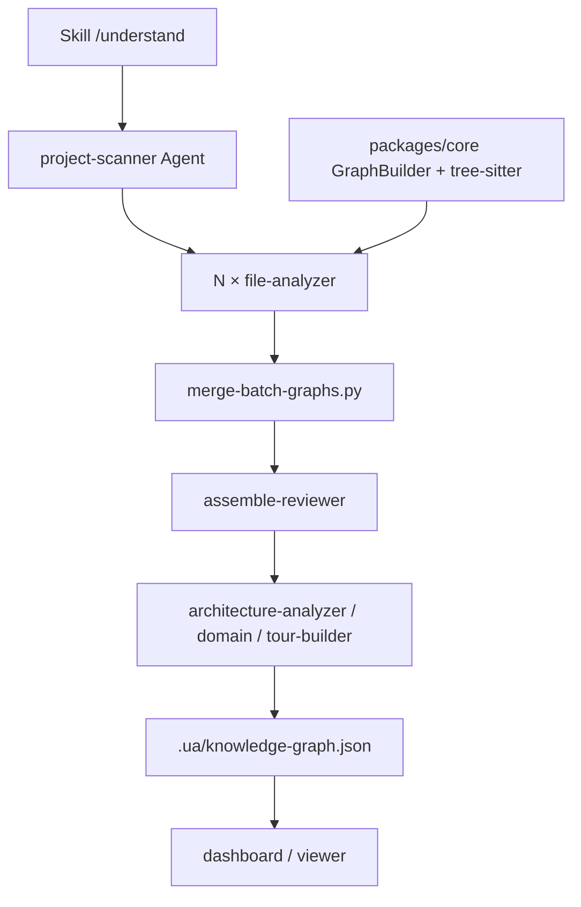

# Understand-Anything 设计思想导读（九幕）

> **深潜**：[ARCHITECTURE.md](./ARCHITECTURE.md) · [Part 1–3](./ARCHITECTURE_PART1.md)  
> **源码**: `Understand-Anything/understand-anything-plugin/`

---

## 第 1 幕：源码全景

**一句话**：插件 = **core 图引擎** + **Agent 提示词** + **Skills/脚本** + **Dashboard**。宿主 Agent 跑循环。

```text
understand-anything-plugin/
├── .claude-plugin/plugin.json     Claude Code 插件元数据
├── agents/*.md                    子 Agent 人设（scanner/analyzer/reviewer/…）
├── skills/understand*             斜杠命令：understand / diff / domain / knowledge / figma / …
├── src/                           chat/diff/explain/onboard 上下文构造（TS）
├── packages/core/                 schema、tree-sitter、GraphBuilder、持久化
├── packages/dashboard/            交互图 UI
└── packages/viewer/               独立打开图
```

**易错**：在 `packages/core` 里找 `while model`。没有。LLM 调用由 Claude Code 的 Agent 工具发出。

---

## 第 2 幕：状态 vs 执行

| | 状态 | 执行 |
|--|------|------|
| **图** | `.ua/knowledge-graph.json` | GraphBuilder + sanitize/autoFix |
| **增量** | `fingerprints.json` `meta.json` | staleness / 按文件指纹 |
| **分析过程** | `.ua/tmp/batch-*.json` | 多 file-analyzer 并行 |
| **宿主** | IDE 会话 | `/understand` Skill 编排子 Agent |

---

## 第 3 幕：双层循环

```text
外层：用户 /understand（Skill 编排，不是 SDK event loop）
  └── 内层：每个子 Agent 的宿主 tool loop
        确定性脚本（scan-project.mjs / tree-sitter extract）
        → LLM 填 summary/tags/semantic edges
        → 写 batch JSON
  └── merge-batch-graphs + assemble-reviewer
  └── dashboard 只读图
```

「循环」是 **流水线阶段**，不是 ReAct 内核。

---

## 第 4 幕：依赖与装配



---

## 第 5 幕：工具管线（插件视角）

子 Agent **被禁止**再开子 Agent（提示词里的 Subagent boundary）。它们被要求：

1. 跑捆绑脚本拿结构（不要自己 walk 目录）  
2. 只对脚本输出做语义判断  
3. 写出符合 schema 的 JSON  

质量闸门：`schema.ts` 的 `sanitizeGraph` / `autoFixGraph` / `validateGraph` —— LLM 爱写的 `func`/`fn` 会归一成 `function`。

---

## 第 6 幕：事件流

没有统一 TypedEvent 总线。阶段产物是文件：

| 产物 | 路径 |
|------|------|
| 扫描 | `.ua/tmp/ua-scan-files.json` |
| 批次 | `.ua/tmp/batch-*.json` |
| 装配 | `assembled-graph.json` |
| 终图 | `knowledge-graph.json` |
| 元数据 | `meta.json` `fingerprints.json` `config.json` |

---

## 第 7 幕：Steer vs Follow-up

宿主 IDE 的 interrupt/steer 与本插件无关。本插件的「后续」是其它 Skill：`/understand-diff`、`/understand-chat`、`/understand-explain`、`/understand-onboard` —— 都 **读已有图**，不再全量扫描（除非 stale）。

---

## 第 8 幕：持久化账本

| 账 | 文件 |
|----|------|
| 图 | `knowledge-graph.json`（写入前把 `filePath` 收成相对路径，避免泄漏家目录） |
| 分析元数据 | `meta.json`（commit、时间、文件数、theme） |
| 指纹 | `fingerprints.json` |
| 项目开关 | `config.json`（autoUpdate、语言） |

旧目录名 `.understand-anything/` 若已存在则继续用，不强制迁移。

---

## 第 9 幕：核心 vs 边界

| 进 core | Skill/Agent/UI |
|---------|----------------|
| 节点边 schema、tree-sitter 抽取、GraphBuilder、校验、持久化 | 各语言分析提示词、dashboard 交互、Figma/wiki 流水线 |

→ [Part 1](./ARCHITECTURE_PART1.md)
