# Understand-Anything — Agent 模块级图集（细粒度）

> 源码根：`understand-anything-plugin/` · 与 [DIAGRAM_ATLAS.md](./DIAGRAM_ATLAS.md)（全局图）配套。
> **每个重要 Agent 相关模块**至少 1 张图；复杂模块含流程 + 时序/类图。

## 模块索引

| ID | 模块 | 源码锚点 | 图类型 |
|----|------|----------|--------|
| UA-A01 | Agent: project-scanner | `agents/project-scanner.md` | sequence |
| UA-A02 | Agent: file-analyzer | `agents/file-analyzer.md` | sequence |
| UA-A03 | Agent: architecture-analyzer | `agents/architecture-analyzer.md` | flowchart |
| UA-A04 | Agent: tour-builder | `agents/tour-builder.md` | flowchart |
| UA-A05 | Agent: graph-reviewer | `agents/graph-reviewer.md` | flowchart |
| UA-A06 | Agent: domain-analyzer | `agents/domain-analyzer.md` | flowchart |
| UA-A07 | Agent: design-analyzer | `agents/design-analyzer.md` | flowchart |
| UA-A08 | Agent: assemble-reviewer | `agents/assemble-reviewer.md` | sequence |
| UA-A09 | Agent: article-analyzer | `agents/article-analyzer.md` | flowchart |
| UA-A10 | Agent: knowledge-graph-guide | `agents/knowledge-graph-guide.md` | flowchart |
| UA-C01 | GraphBuilder | `graph-builder` | classDiagram |
| UA-C02 | schema validateGraph | `schema.ts` | flowchart |
| UA-C03 | TreeSitterPlugin | `tree-sitter-plugin.ts` | flowchart |
| UA-C04 | fingerprint | `fingerprint.ts` | flowchart |
| UA-C05 | change-classifier | `change-classifier.ts` | flowchart |
| UA-C06 | staleness / freshness | `staleness.ts` | stateDiagram |
| UA-C07 | persistence saveGraph | `persistence/` | sequence |
| UA-C08 | merge-batch-graphs | `skills/脚本` | flowchart |
| UA-C09 | Dashboard 加载 | `dashboard` | sequence |
| UA-C10 | embedding-search | `embedding-search.ts` | flowchart |
| UA-C11 | ignore-filter | `ignore-filter.ts` | flowchart |
| UA-C12 | tour-generator | `analyzer/tour-generator.ts` | flowchart |
| UA-C13 | figma merge | `figma/` | flowchart |
| UA-C14 | file-analyzer 两阶段 | `file-analyzer` | sequence |
| UA-C15 | graph-reviewer 检查 | `graph-reviewer` | flowchart |

---

## UA-A01 Agent: project-scanner

**源码**：`agents/project-scanner.md`

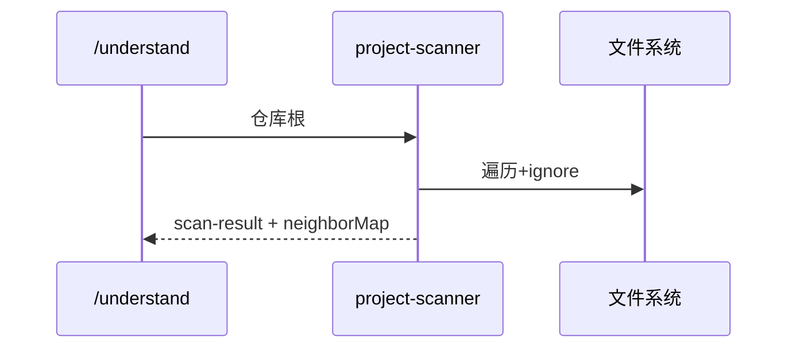

**读图**：产出批次列表与跨文件邻居符号。

---

## UA-A02 Agent: file-analyzer

**源码**：`agents/file-analyzer.md`

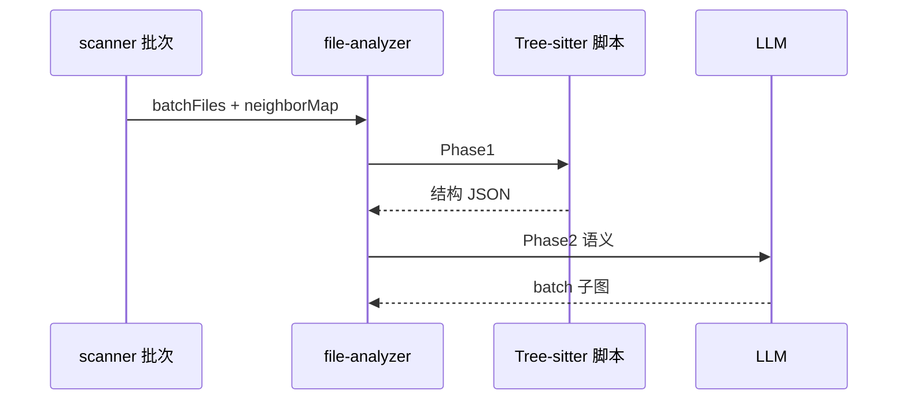

**读图**：两阶段；临时文件带 batchIndex。

---

## UA-A03 Agent: architecture-analyzer

**源码**：`agents/architecture-analyzer.md`

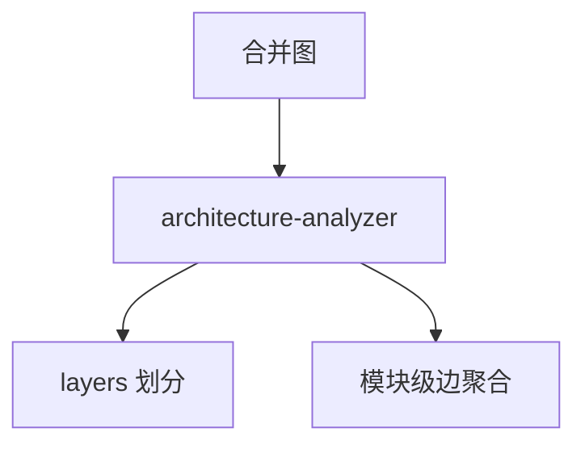

**读图**：消费 file 层节点之上抽象。

---

## UA-A04 Agent: tour-builder

**源码**：`agents/tour-builder.md`

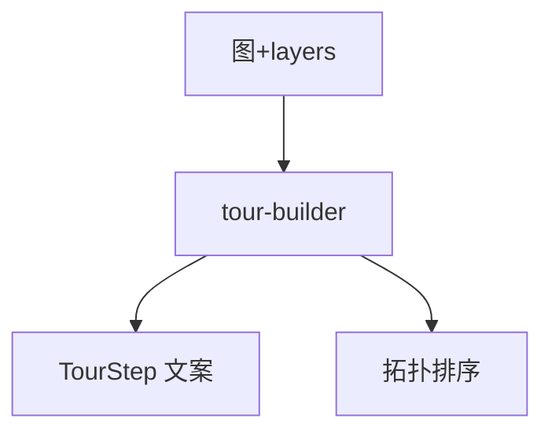

**读图**：步骤字数与覆盖约束在提示词。

---

## UA-A05 Agent: graph-reviewer

**源码**：`agents/graph-reviewer.md`

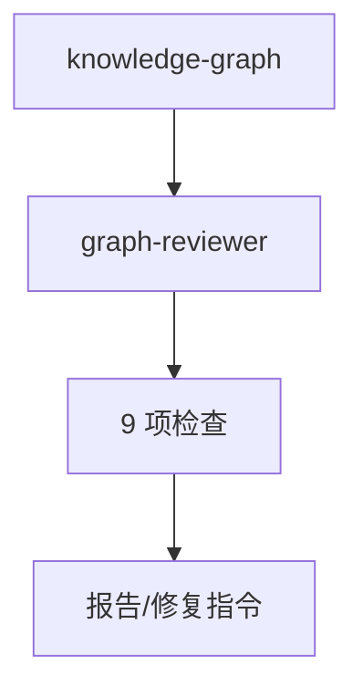

**读图**：层覆盖率 Check4 最常失败。

---

## UA-A06 Agent: domain-analyzer

**源码**：`agents/domain-analyzer.md`

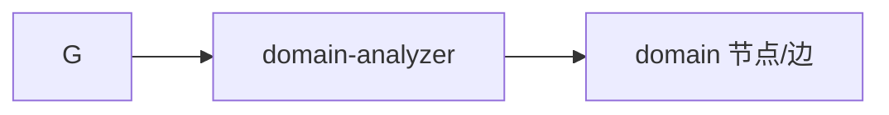

**读图**：业务域归纳，可选阶段。

---

## UA-A07 Agent: design-analyzer

**源码**：`agents/design-analyzer.md`

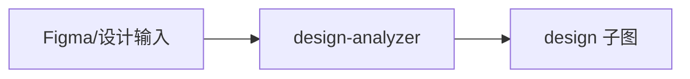

**读图**：与 figma 包协作。

---

## UA-A08 Agent: assemble-reviewer

**源码**：`agents/assemble-reviewer.md`

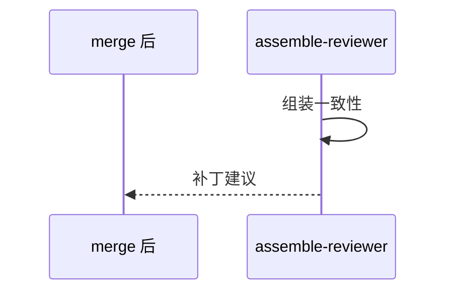

**读图**：合并后完整性审查。

---

## UA-A09 Agent: article-analyzer

**源码**：`agents/article-analyzer.md`

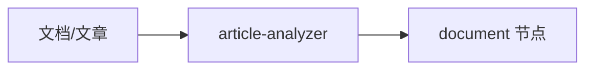

**读图**：非代码资产入图。

---

## UA-A10 Agent: knowledge-graph-guide

**源码**：`agents/knowledge-graph-guide.md`

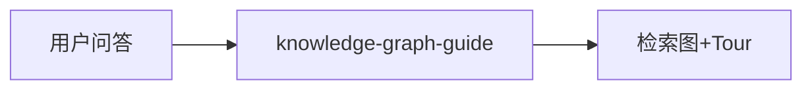

**读图**：对话式读图，非批处理流水线。

---

## UA-C01 GraphBuilder

**源码**：`graph-builder`

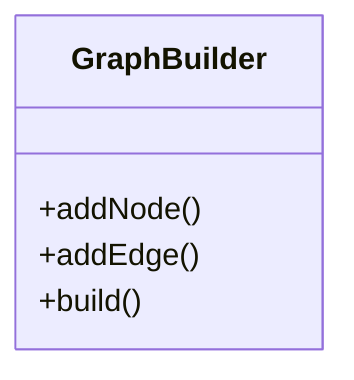

**读图**：id 命名规则与去重。

---

## UA-C02 schema validateGraph

**源码**：`schema.ts`

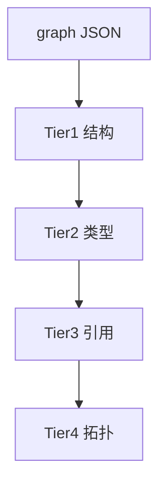

**读图**：Dashboard 加载前校验。

---

## UA-C03 TreeSitterPlugin

**源码**：`tree-sitter-plugin.ts`

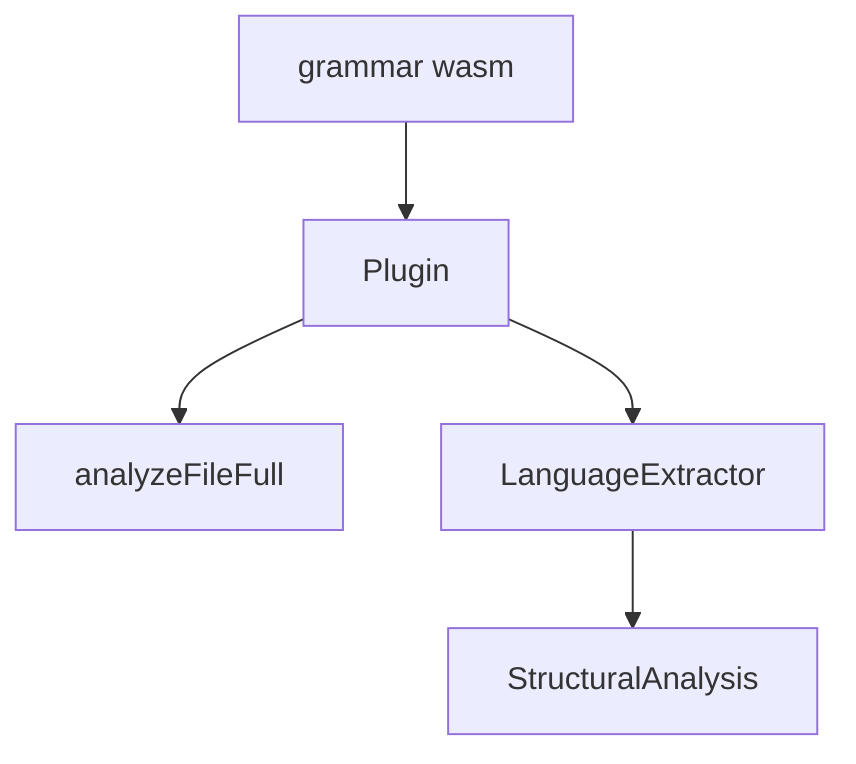

**读图**：strict vs full 模式。

---

## UA-C04 fingerprint

**源码**：`fingerprint.ts`

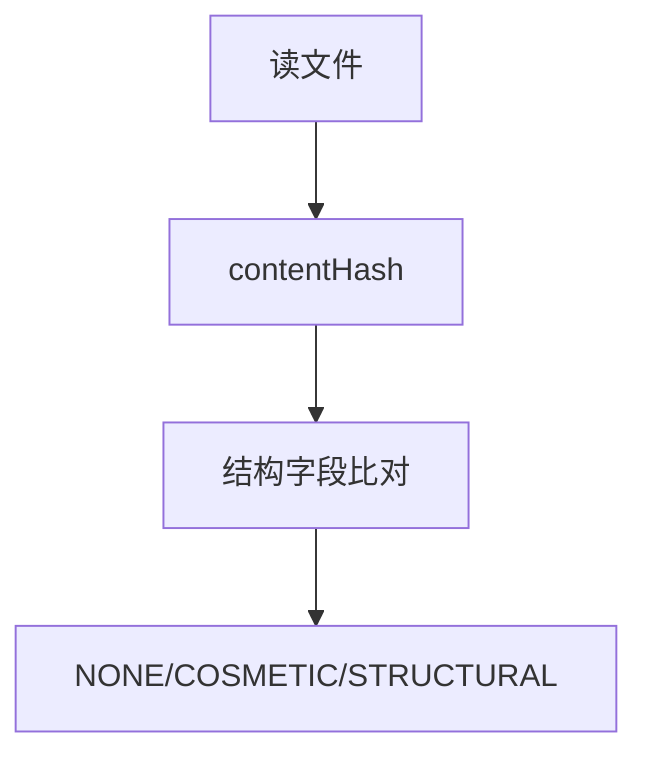

**读图**：语言白名单控制结构指纹。

---

## UA-C05 change-classifier

**源码**：`change-classifier.ts`

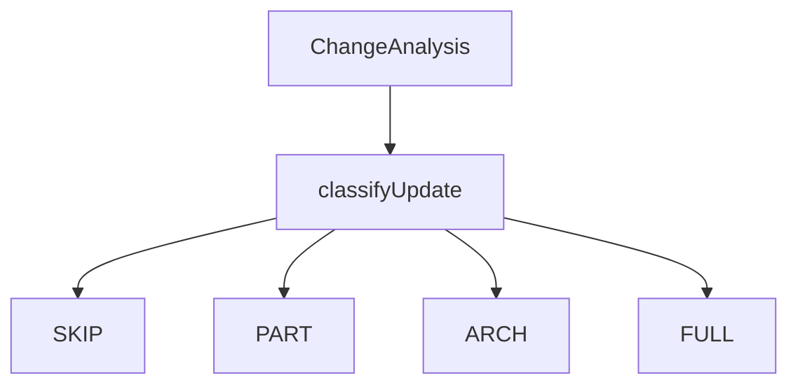

**读图**：目录变化 → ARCHITECTURE_UPDATE。

---

## UA-C06 staleness / freshness

**源码**：`staleness.ts`

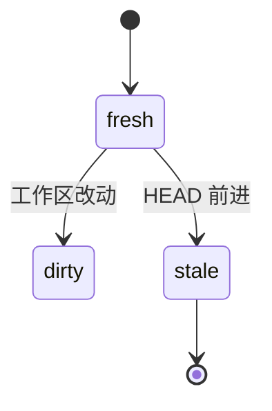

**读图**：unknown 时仍可读图。

---

## UA-C07 persistence saveGraph

**源码**：`persistence/`

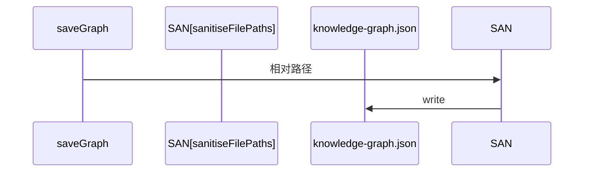

**读图**：防绝对路径泄露。

---

## UA-C08 merge-batch-graphs

**源码**：`skills/脚本`

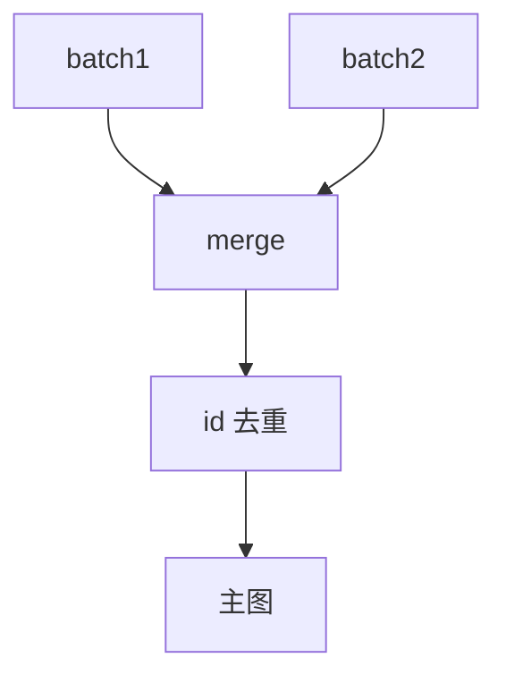

**读图**：冲突写 meta.warnings。

---

## UA-C09 Dashboard 加载

**源码**：`dashboard`

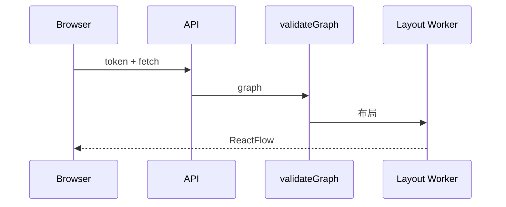

**读图**：五路并行 fetch。

---

## UA-C10 embedding-search

**源码**：`embedding-search.ts`

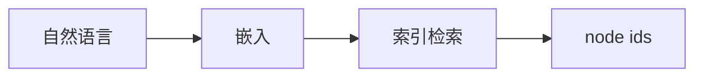

**读图**：辅助拓扑导航。

---

## UA-C11 ignore-filter

**源码**：`ignore-filter.ts`

```mermaid
flowchart TD
    SCAN[扫描] --> IGN[.understandignore]
    IGN --> SKIP[排除路径]
```

**读图**：与 scanner 输出联动。

---

## UA-C12 tour-generator

**源码**：`analyzer/tour-generator.ts`

```mermaid
flowchart TD
    G[图+layers] --> KAHN[拓扑排序]
    KAHN --> STEPS[TourStep 列表]
```

**读图**：质量约束在 agent 提示词。

---

## UA-C13 figma merge

**源码**：`figma/`

```mermaid
flowchart LR
    API[Figma API] --> PARSE[parse]
    PARSE --> MERGE[merge 进图]
    MERGE --> G[design 节点]
```

**读图**：可选设计域。

---

## UA-C14 file-analyzer 两阶段

**源码**：`file-analyzer`

```mermaid
sequenceDiagram
    participant FA as file-analyzer
    participant SC as 提取脚本
    participant LLM as LLM
    FA->>SC: Phase1
    SC-->>FA: 结构 JSON
    FA->>LLM: Phase2 语义
    LLM-->>FA: nodes/edges
```

**读图**：neighborMap 跨批边。

---

## UA-C15 graph-reviewer 检查

**源码**：`graph-reviewer`

```mermaid
flowchart TD
    G[图] --> C1..C9[9 checks]
    C1..C9 -->|fail| FIX[修复建议]
    C1..C9 -->|pass| OK[发布]
```

**读图**：层覆盖率最复杂。

---


# 附录 A — 流水线泳道

```mermaid
flowchart TB
    subgraph S1[扫描]
        PS[project-scanner]
    end
    subgraph S2[文件语义]
        FA[file-analyzer x N]
    end
    subgraph S3[架构]
        MG[merge]
        AA[architecture-analyzer]
    end
    subgraph S4[产品化]
        TB[tour-builder]
        GR[graph-reviewer]
    end
    subgraph S5[消费]
        DB[Dashboard]
    end
    PS --> FA --> MG --> AA --> TB --> GR --> DB
```

```mermaid
erDiagram
    SCAN ||--o{ BATCH : splits
    BATCH ||--o{ FILE_NODE : produces
    FILE_NODE ||--o{ SYMBOL_NODE : contains
    MERGED_GRAPH ||--o{ LAYER : organizes
    MERGED_GRAPH ||--o{ TOUR : explains
```

**读图**：泳道为时间顺序；ER 为产物结构（非全部边类型）。
