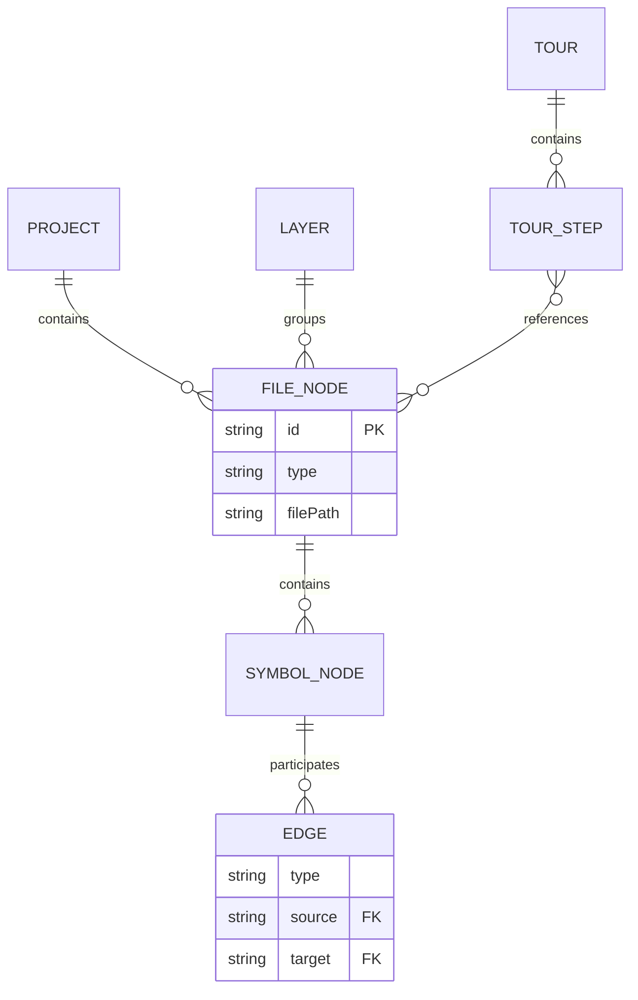
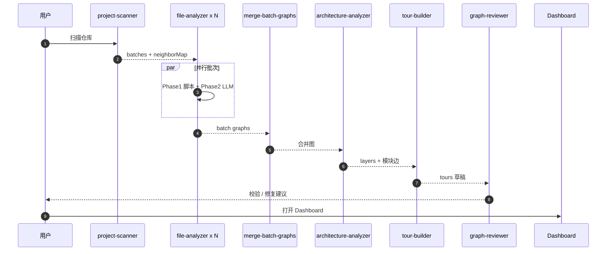
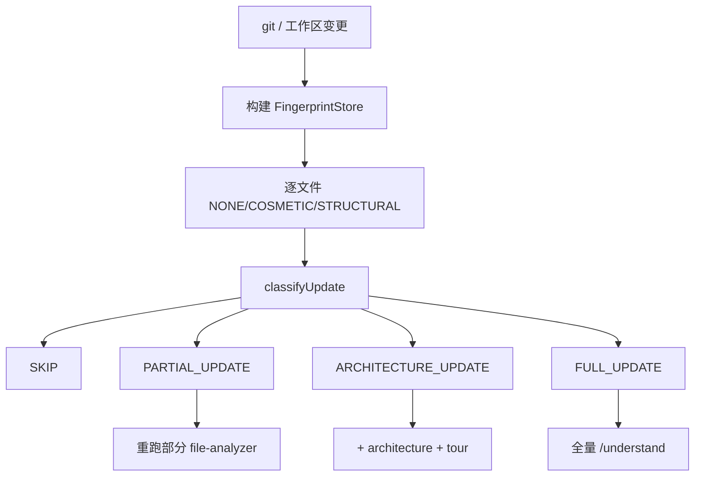
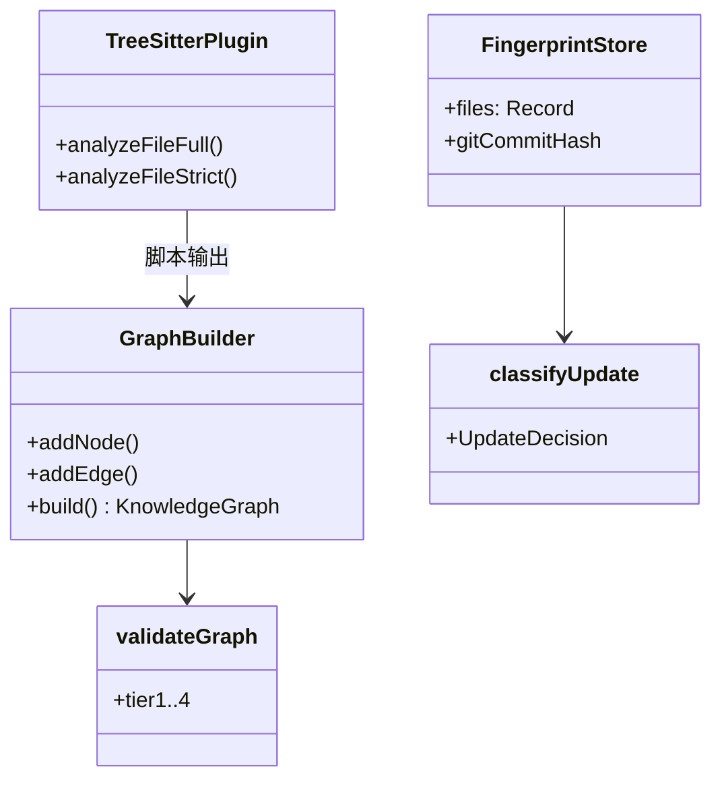
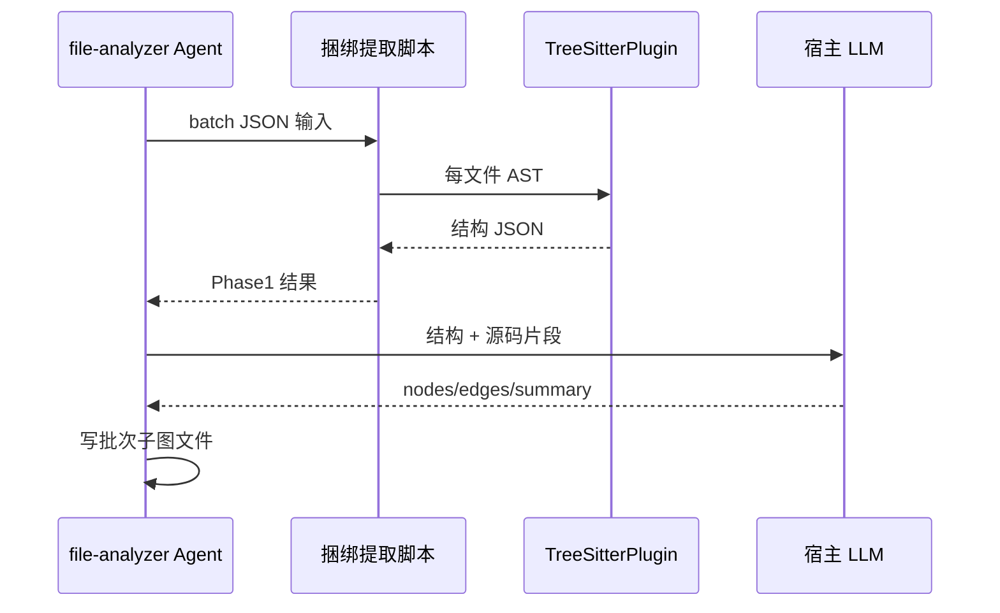
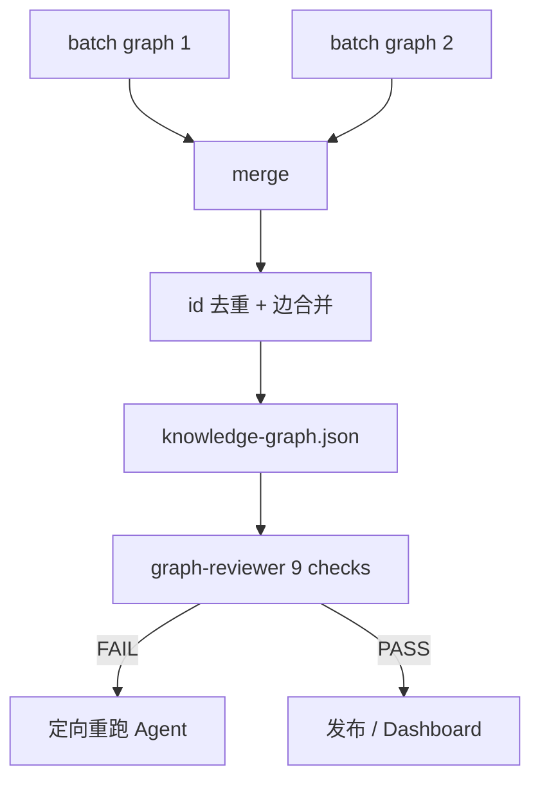
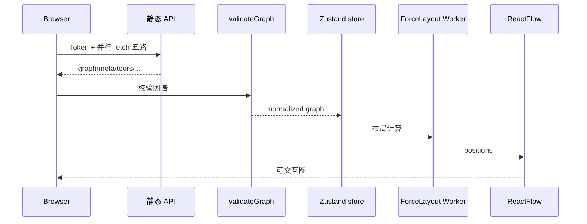
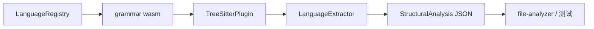
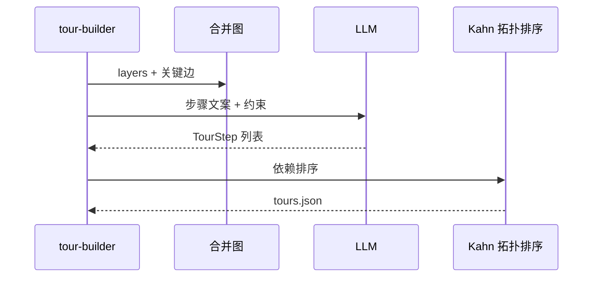

# Understand-Anything 架构图集（全局）

> 配套 [ARCHITECTURE.md](../ARCHITECTURE.md)。**各 Agent + core 模块**：[AGENT_MODULE_DIAGRAMS.md](./AGENT_MODULE_DIAGRAMS.md)。  
> 源码：`Understand-Anything/understand-anything-plugin/`。

---

## 图目录

| 编号 | 类型 | 标题 |
|------|------|------|
| G1 | architecture | 宿主 · 技能 · Core · Dashboard |
| G2 | erDiagram | 知识图谱节点/边域 |
| G3 | sequence | 全量分析流水线 |
| G4 | flowchart | 增量更新决策 |
| G5 | classDiagram | GraphBuilder / Schema |
| M1 | sequence | file-analyzer 两阶段 |
| M2 | flowchart | merge + graph-reviewer |
| M3 | sequence | Dashboard 加载 |
| M4 | flowchart | Tree-sitter 插件 |
| M5 | sequence | Tour 生成 |

---

## G1 系统总览

```mermaid
flowchart TB
    subgraph Host["IDE 宿主 Agent"]
        SK[/understand 技能]
        DISPATCH[子 Agent 调度]
    end
    subgraph Plugin["understand-anything-plugin"]
        AGENTS[agents/*.md]
        SKILLS[skills/*]
        CORE[packages/core]
    end
    subgraph Artifacts[".ua/ 产物"]
        G[knowledge-graph.json]
        FP[fingerprints.json]
        TOUR[tours.json]
    end
    subgraph UI["Dashboard"]
        API[静态服务 + Token]
        RF[ReactFlow + Worker 布局]
    end
    SK --> DISPATCH
    DISPATCH --> AGENTS
    AGENTS --> CORE
    CORE --> Artifacts
    Artifacts --> API --> RF
```

---

## G2 图谱实体（逻辑 ER）



**读图**：27 种节点 / 38 种边在 `schema.ts` 枚举；ER 为概念聚合。

---

## G3 全量流水线时序



---

## G4 增量更新决策



---

## G5 核心类图



---

## M1 file-analyzer 两阶段



---

## M2 合并与审阅



---

## M3 Dashboard 加载时序



---

## M4 Tree-sitter 管线



---

## M5 Tour 生成



---

## 章节对照

| 图 | ARCHITECTURE |
|----|----------------|
| G1–G3 | §1–§3 |
| G4 | §41–§42 |
| G5 | §6–§8 |
| M1 | §9 file-analyzer |
| M2 | §18, §35 |
| M3 | §11 |
| M4 | §8 |
| M5 | §4 |
